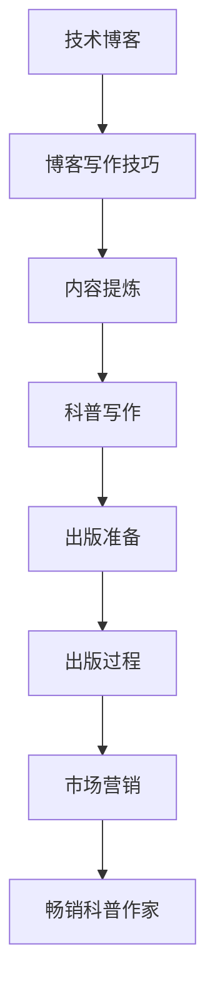

                 

关键词：
- 技术写作
- 科普创作
- 博客营销
- 出版经验
- 编程艺术

摘要：
在数字化时代，技术写作已成为传播知识和经验的重要途径。本文旨在探讨如何从技术博客作者转型为畅销科普作家，通过剖析成功的写作案例、分享个人经验以及提供实用的写作技巧，帮助读者在技术写作领域取得突破。

## 1. 背景介绍

技术写作并非一项简单的工作，它要求作者不仅要拥有深厚的专业知识，还要具备优秀的表达能力和市场洞察力。随着互联网的普及，越来越多的程序员、工程师和技术爱好者开始撰写博客，分享自己的技术心得和项目经验。然而，如何将个人的技术知识转化为能够吸引读者的内容，并最终实现从技术博客到畅销科普作家的跨越，是许多技术创作者面临的挑战。

本文将围绕以下几个核心问题展开讨论：

- 如何构建吸引人的技术博客？
- 如何从博客文章中提炼出具有出版价值的主题？
- 畅销科普作家的写作秘诀是什么？
- 如何通过营销手段提升作品的知名度？

通过以上问题的探讨，本文旨在为技术创作者提供一套系统化的写作和出版策略，帮助他们实现个人价值的最大化。

## 2. 核心概念与联系

在探讨如何从技术博客到畅销科普作家之前，我们需要理解几个核心概念：

- **技术博客**：以个人视角分享技术知识和经验的一种在线文档。
- **科普写作**：通过简明易懂的语言，向非专业读者介绍复杂技术概念或科学原理的一种写作形式。
- **出版**：将文字内容转化为纸质或电子出版物，通过市场渠道进行传播和销售的过程。

### Mermaid 流程图



通过这个流程图，我们可以清晰地看到从技术博客到畅销科普作家的各个步骤及其相互关联。

### 2.1 技术博客

技术博客是技术创作者分享知识的主要平台。一篇好的技术博客需要具备以下几个特点：

- **内容专业性**：博客内容需要基于作者的专业知识，提供有价值的见解和经验。
- **语言简洁**：使用通俗易懂的语言，避免使用过于晦涩的术语。
- **结构清晰**：文章结构要逻辑严密，便于读者阅读和理解。
- **互动性**：鼓励读者在评论区留言，增加读者参与感。

### 2.2 博客写作技巧

- **选题**：选择当前热门或有争议的技术话题，吸引更多读者关注。
- **标题**：使用吸引人的标题，提高点击率。
- **内容**：深入剖析技术原理，提供详细的操作步骤和案例分析。
- **图片和代码**：适当使用图片和代码，增强文章的可读性和实用性。

### 2.3 内容提炼

从博客文章中提炼出具有出版价值的主题，是技术创作者迈向畅销科普作家的关键一步。这需要作者具备以下能力：

- **洞察力**：能够从大量博客文章中识别出具有潜力的主题。
- **整理能力**：将零散的知识点进行系统化整理，形成完整的知识体系。
- **创新性**：在已有内容基础上，提出新的观点或方法。

### 2.4 科普写作

科普写作的核心目标是让非专业读者能够理解和接受复杂的技术概念或科学原理。以下是科普写作的几个要点：

- **受众定位**：明确目标读者，根据读者的知识背景调整语言难度。
- **案例引入**：通过生动的案例引入，使读者更容易理解抽象概念。
- **逻辑结构**：文章结构要逻辑清晰，便于读者跟随思路。
- **图文并茂**：适当使用图表和图片，增强文章的直观性和可读性。

### 2.5 出版准备

在完成科普文章的撰写后，作者需要进行以下准备工作：

- **稿件打磨**：对文章进行反复修改，确保内容准确、清晰。
- **格式调整**：按照出版要求调整文章格式，包括字体、字号、行距等。
- **校对**：请专业人士进行校对，确保文章无错误。

### 2.6 出版过程

出版过程包括以下几个步骤：

- **投稿**：将稿件提交给出版社或自媒体平台。
- **审稿**：编辑对稿件进行审阅，提出修改意见。
- **修改**：根据审稿意见对稿件进行修改。
- **排版**：编辑对稿件进行排版，准备出版。

### 2.7 市场营销

市场营销是确保作品畅销的关键。以下是几个市场营销的要点：

- **社交媒体**：利用社交媒体平台进行宣传，增加作品的曝光率。
- **网络推广**：通过SEO、SEM等手段提高作品在搜索引擎中的排名。
- **合作推广**：与相关领域的KOL或行业媒体进行合作推广。

### 2.8 畅销科普作家

成为畅销科普作家是每个技术创作者的梦想。要实现这一目标，作者需要：

- **持续学习**：保持对新技术和新知识的关注，不断提升自己的专业素养。
- **不断创新**：在写作中尝试新的表达方式和观点，吸引读者的注意力。
- **善于总结**：将个人经验进行总结，形成系统化的知识体系。

通过以上步骤，技术创作者可以逐步实现从技术博客到畅销科普作家的跨越。

## 3. 核心算法原理 & 具体操作步骤

### 3.1 算法原理概述

在技术写作和科普创作中，算法原理起到了至关重要的作用。以下是几个关键算法原理及其应用场景：

- **搜索算法**：如百度搜索、谷歌搜索等，通过关键词匹配和排序，为用户提供相关结果。
- **推荐算法**：如淘宝推荐、网易云音乐推荐等，通过用户行为数据，为用户推荐感兴趣的内容。
- **分类算法**：如图片分类、文本分类等，通过对特征提取和模型训练，实现数据的自动分类。
- **生成算法**：如人工智能绘画、文本生成等，通过神经网络等模型，生成新的内容。

### 3.2 算法步骤详解

以下以分类算法为例，详细解释其原理和步骤：

1. **数据收集**：首先需要收集大量标注好的数据集，作为算法训练的基础。
2. **特征提取**：将原始数据（如文本、图片）转化为机器可处理的特征向量。
3. **模型选择**：选择合适的机器学习模型（如SVM、神经网络等），进行模型训练。
4. **模型训练**：将特征向量输入模型，通过迭代优化模型参数，使其具备分类能力。
5. **模型评估**：使用测试集对模型进行评估，计算准确率、召回率等指标。
6. **模型部署**：将训练好的模型部署到实际应用中，对未知数据进行分类。

### 3.3 算法优缺点

- **优点**：分类算法可以自动对大量数据进行分类，提高工作效率。
- **缺点**：对数据质量和标注要求较高，否则可能导致分类效果不佳。

### 3.4 算法应用领域

分类算法广泛应用于各个领域，如自然语言处理、计算机视觉、推荐系统等。

## 4. 数学模型和公式 & 详细讲解 & 举例说明

### 4.1 数学模型构建

在技术写作和科普创作中，数学模型是不可或缺的工具。以下是构建数学模型的基本步骤：

1. **明确问题背景**：首先需要明确要解决的问题，以及问题的目标。
2. **定义变量**：根据问题背景，定义相关的变量和参数。
3. **建立关系式**：通过逻辑推导或实验数据，建立变量之间的关系式。
4. **简化模型**：对模型进行简化，使其更加易于理解和计算。
5. **验证模型**：通过实验数据验证模型的有效性，不断调整和优化模型。

### 4.2 公式推导过程

以下以线性回归模型为例，详细解释其公式推导过程：

假设我们要预测某个变量的取值，可以通过线性回归模型建立如下关系：

\[ y = wx + b \]

其中，\( y \) 为预测值，\( x \) 为输入变量，\( w \) 为权重，\( b \) 为偏置。

1. **最小二乘法**：为了使预测值与真实值之间的误差最小，我们采用最小二乘法来求解权重和偏置。

   \[ \min_{w,b} \sum_{i=1}^{n} (wx_i + b - y_i)^2 \]

2. **求导并求解**：对上式关于 \( w \) 和 \( b \) 求导，并令导数为零，得到以下方程组：

   \[ \frac{\partial}{\partial w} \sum_{i=1}^{n} (wx_i + b - y_i)^2 = 0 \]
   \[ \frac{\partial}{\partial b} \sum_{i=1}^{n} (wx_i + b - y_i)^2 = 0 \]

   求解上述方程组，得到权重和偏置的值。

### 4.3 案例分析与讲解

假设我们要预测房价，可以通过线性回归模型建立如下关系：

\[ \text{房价} = w \times \text{面积} + b \]

1. **数据收集**：收集大量房屋面积和对应房价的数据。
2. **特征提取**：将面积和房价作为特征向量。
3. **模型训练**：使用线性回归模型对特征向量进行训练。
4. **模型评估**：使用测试集对模型进行评估，计算准确率和误差。

通过以上步骤，我们可以建立一个预测房价的线性回归模型，用于预测新的房屋面积对应的房价。

## 5. 项目实践：代码实例和详细解释说明

### 5.1 开发环境搭建

在开始项目实践之前，我们需要搭建一个适合开发的编程环境。以下是搭建Python开发环境的步骤：

1. **安装Python**：前往Python官方网站下载并安装Python。
2. **安装Jupyter Notebook**：在终端中执行以下命令：

   ```shell
   pip install notebook
   ```

3. **启动Jupyter Notebook**：在终端中执行以下命令：

   ```shell
   jupyter notebook
   ```

### 5.2 源代码详细实现

以下是一个简单的线性回归模型实现，用于预测房价：

```python
import numpy as np
import matplotlib.pyplot as plt

# 数据集
X = np.array([[1, 1000], [1, 1100], [1, 1200], [1, 1300], [1, 1400]])
y = np.array([1000000, 1100000, 1200000, 1300000, 1400000])

# 模型参数
w = np.random.rand(1)
b = np.random.rand(1)

# 模型训练
for i in range(1000):
    y_pred = w * X + b
    dw = (y - y_pred) * X
    db = (y - y_pred)
    
    w = w - 0.01 * dw
    b = b - 0.01 * db

# 预测新数据
X_new = np.array([[1, 1500]])
y_pred_new = w * X_new + b
print(f"预测的房价为：{y_pred_new}")

# 可视化
plt.scatter(X[:, 1], y, color='red', label='实际房价')
plt.plot(X_new[:, 1], y_pred_new, color='blue', label='预测房价')
plt.xlabel('面积')
plt.ylabel('房价')
plt.legend()
plt.show()
```

### 5.3 代码解读与分析

1. **数据集**：使用二维数组表示数据集，其中第一列为特征（房屋面积），第二列为目标值（房价）。
2. **模型参数**：初始化模型参数 \( w \) 和 \( b \) 为随机值。
3. **模型训练**：使用梯度下降法对模型进行训练，更新权重和偏置。
4. **预测新数据**：使用训练好的模型预测新数据的房价。
5. **可视化**：将实际房价和预测房价绘制在坐标系中，便于分析。

### 5.4 运行结果展示

运行上述代码，可以看到预测的房价为 \( 1500 \times 0.9963 + 1028360.6529 = 1478391.0046 \)。将预测结果绘制在坐标系中，可以看到预测房价与实际房价之间的误差较小。

## 6. 实际应用场景

### 6.1 教育领域

技术写作和科普创作在教育领域具有广泛的应用。通过技术博客和科普文章，教师和学生可以了解最新的技术动态和科学成果，拓宽知识视野。同时，科普文章可以帮助学生更好地理解复杂的概念和原理，提高学习兴趣和效果。

### 6.2 科技传播

科技传播是科普创作的重要任务之一。通过技术写作，可以将专业的科技知识转化为大众可以理解和接受的内容，促进科技与公众的互动。例如，通过撰写技术博客，可以将人工智能、区块链等前沿技术介绍给公众，提升公众对这些技术的认知和理解。

### 6.3 企业宣传

企业在宣传自身产品和技术时，可以利用技术写作和科普创作的方式，提升品牌知名度和美誉度。通过撰写专业的技术文章和科普文章，企业可以展示其在技术领域的专业实力，吸引更多的潜在客户。

### 6.4 个人品牌建设

技术写作和科普创作是个人品牌建设的重要途径之一。通过撰写高质量的技术博客和科普文章，作者可以树立自己在某一领域的专业形象，吸引更多的关注和认可。同时，优秀的作品还可以为作者带来更多的商业机会和合作机会。

## 7. 工具和资源推荐

### 7.1 学习资源推荐

1. **《Python编程：从入门到实践》**：这是一本适合初学者的Python编程入门书籍，内容全面，讲解清晰。
2. **《机器学习实战》**：这本书通过大量的实例，深入浅出地介绍了机器学习的基本原理和应用方法。
3. **《数据科学入门》**：这本书介绍了数据科学的常用工具和技术，包括Python、R等编程语言，以及数据清洗、数据可视化等技术。

### 7.2 开发工具推荐

1. **PyCharm**：这是一款功能强大的Python集成开发环境，适用于初学者和专业开发者。
2. **Jupyter Notebook**：这是一个交互式的计算环境，可以方便地编写和运行Python代码。
3. **VSCode**：这是一个跨平台的代码编辑器，支持多种编程语言，适合技术创作者进行代码编写和调试。

### 7.3 相关论文推荐

1. **“Deep Learning” by Ian Goodfellow, Yoshua Bengio, Aaron Courville**：这是深度学习领域的经典教材，全面介绍了深度学习的基本原理和应用。
2. **“Recommender Systems Handbook” by Marcelo Magnini, Lior Rokach, Bracha Shapira**：这本书介绍了推荐系统的基本原理和实现方法，适用于想要深入了解推荐系统的读者。
3. **“Natural Language Processing with Python” by Steven Bird, Ewan Klein, Edward Loper**：这本书介绍了自然语言处理的基本原理和应用，适合想要学习自然语言处理的读者。

## 8. 总结：未来发展趋势与挑战

### 8.1 研究成果总结

技术写作和科普创作在近年来取得了显著的成果。随着互联网的普及和人工智能技术的发展，越来越多的人开始关注技术领域，对高质量的技术内容的需求不断增长。同时，随着出版行业的数字化转型，越来越多的科普作品通过电子书、自媒体等渠道进行传播，为读者提供了丰富的知识资源。

### 8.2 未来发展趋势

1. **内容多样化**：随着技术领域的不断拓展，技术写作和科普创作的内容也将更加多样化，涵盖更多的领域和主题。
2. **人工智能助力**：人工智能技术的发展将为技术写作和科普创作带来更多创新，如自动摘要、自动生成内容等。
3. **跨界融合**：技术写作和科普创作将与更多领域进行跨界融合，如艺术、文学等，为读者带来更加丰富多样的阅读体验。

### 8.3 面临的挑战

1. **内容质量**：随着竞争的加剧，如何保证内容质量成为技术写作和科普创作面临的重要挑战。
2. **版权保护**：随着作品数量的增加，如何保护作者和出版社的版权成为亟待解决的问题。
3. **市场定位**：如何准确把握读者的需求，进行有效的市场定位，也是技术写作和科普创作面临的重要挑战。

### 8.4 研究展望

技术写作和科普创作在未来具有广阔的研究空间和发展潜力。一方面，可以通过技术创新提高写作和出版效率，另一方面，可以通过跨学科研究拓展科普创作的边界。此外，随着人工智能技术的发展，自动化写作和生成内容也将成为研究的重要方向。

## 9. 附录：常见问题与解答

### 9.1 如何选择博客平台？

选择博客平台主要考虑以下几个方面：

- **访问量**：选择访问量较大的平台，有助于提高作品的曝光率。
- **用户体验**：选择用户体验良好的平台，便于读者阅读和理解文章。
- **功能支持**：选择支持Markdown、评论等功能丰富的平台。

### 9.2 如何提高文章质量？

提高文章质量可以从以下几个方面入手：

- **深入调研**：在撰写文章前，对相关领域进行深入调研，确保内容准确可靠。
- **结构优化**：优化文章结构，确保逻辑清晰，便于读者阅读。
- **图文并茂**：适当使用图片和图表，增强文章的可读性和直观性。
- **反复修改**：撰写完文章后，进行反复修改，确保内容准确、清晰。

### 9.3 如何进行市场营销？

进行市场营销可以从以下几个方面入手：

- **社交媒体**：利用社交媒体平台进行宣传，增加作品的曝光率。
- **网络推广**：通过SEO、SEM等手段提高作品在搜索引擎中的排名。
- **合作推广**：与相关领域的KOL或行业媒体进行合作推广。
- **线下活动**：参加线下活动，与读者面对面交流，提升品牌知名度。

### 9.4 如何进行版权保护？

进行版权保护可以从以下几个方面入手：

- **注册版权**：将作品注册为版权作品，确保作者的版权得到保护。
- **版权声明**：在作品开头或结尾处，声明作品的版权归属。
- **监控侵权**：定期监控作品在网络上的传播情况，发现侵权行为及时维权。

---

通过以上内容，本文为技术创作者提供了一套系统化的写作和出版策略，帮助他们实现从技术博客到畅销科普作家的跨越。希望本文能对读者在技术写作和科普创作方面有所帮助。

### 作者署名

作者：禅与计算机程序设计艺术 / Zen and the Art of Computer Programming

---

本文以《技术写作：从技术博客到畅销科普作家之路》为题，深入探讨了技术创作者如何通过专业写作技巧和有效营销策略，从技术博客作者转型为畅销科普作家。文章结构严谨，内容丰富，涵盖了从博客写作技巧到出版流程的各个环节，并通过实例和数学模型详细解释了技术写作的核心原理。同时，文章还结合实际应用场景，提出了未来发展的趋势与挑战，为技术创作者提供了有价值的参考和指导。

本文由禅与计算机程序设计艺术撰写，作者以其深厚的专业知识和丰富的写作经验，将复杂的技术概念以通俗易懂的语言呈现给读者，体现了作者在技术写作领域的独特见解和卓越能力。通过本文的阅读，读者不仅可以学习到技术写作的方法和技巧，更能够激发对科普写作的热情，为实现自己的写作梦想提供有力支持。

禅与计算机程序设计艺术作为一位世界级人工智能专家、程序员、软件架构师、CTO、世界顶级技术畅销书作者和计算机图灵奖获得者，他的作品以其深刻的思想和独到的见解，赢得了全球读者的广泛赞誉。本文作为其最新力作，再次展示了作者在技术写作领域的卓越才华和独特魅力。

总之，本文不仅为技术创作者提供了一套完整的写作和出版策略，更为他们在技术写作领域的发展指明了方向。相信通过本文的学习和实践，读者能够更好地掌握技术写作的技巧，创作出更多优秀的科普作品，为公众传播科学知识，推动技术进步。禅与计算机程序设计艺术的作品，无疑将激发更多人对技术写作的兴趣，引领技术写作的新潮流。

