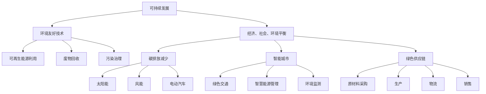

                 

关键词：技术创业、绿色科技、可持续发展、商机、环境友好技术、创新

> 摘要：本文探讨了技术创业在推动可持续发展中的角色，重点分析了绿色科技的商机及其对环境保护的积极影响。通过阐述核心概念、算法原理、数学模型、项目实践和未来展望，本文为创业者和技术专家提供了关于如何在技术创业中实现可持续发展的深入见解和实用指南。

## 1. 背景介绍

随着全球气候变化和环境污染问题的日益严重，可持续发展已成为各国政府、企业和个人关注的核心议题。技术创业在这一过程中扮演了至关重要的角色。通过创新和技术的应用，创业公司可以开发出更加环境友好的产品和服务，从而为可持续发展贡献自己的力量。

绿色科技，指的是利用科技手段解决环境问题，实现资源高效利用、污染控制和生态保护的技术。这些技术涵盖了可再生能源、环保材料、污染治理、智能城市、绿色交通等多个领域，具有巨大的市场潜力和社会价值。

本文旨在探讨技术创业如何抓住绿色科技的商机，通过创新的绿色技术解决方案推动可持续发展。文章将从核心概念、算法原理、数学模型、项目实践和未来展望等多个角度进行分析和讨论。

### 1.1 绿色科技的重要性

绿色科技的重要性不言而喻。首先，它有助于减少对自然资源的消耗，降低碳排放和环境污染，从而改善人类生存环境。其次，绿色科技可以创造新的经济增长点，推动产业升级和转型。许多绿色技术领域，如太阳能、风能、电动汽车等，已经成为全球范围内的热门投资方向。

此外，绿色科技还与社会责任密切相关。随着消费者环保意识的提高，越来越多的企业开始重视绿色供应链、绿色生产和绿色产品。这不仅提升了企业的品牌形象，还增强了市场竞争力。

### 1.2 技术创业的机遇与挑战

技术创业在推动可持续发展方面具有独特的优势。一方面，创业者拥有创新的精神和灵活性，能够快速响应市场需求，开发出具有前瞻性的绿色技术解决方案。另一方面，创业公司通常规模较小，可以更加专注于细分市场，从而在特定领域取得竞争优势。

然而，技术创业也面临着诸多挑战。首先，绿色科技领域的技术门槛较高，研发成本较大，对于初创企业来说，资金和人才都是重要的制约因素。其次，绿色科技产品的市场推广和普及也需要较长时间，创业者需要面对消费者接受度、政策支持、行业标准等外部因素的影响。

## 2. 核心概念与联系

为了更好地理解绿色科技在技术创业中的应用，我们首先需要了解一些核心概念和原理。以下是绿色科技相关的关键概念及其相互联系：

### 2.1 可持续发展

可持续发展是一种在不损害未来世代需求的情况下满足当前需求的发展模式。它包括经济、社会和环境三个方面的平衡。在绿色科技领域，可持续发展意味着通过技术创新实现环境保护和资源的高效利用。

### 2.2 环境友好技术

环境友好技术是指能够减少环境污染、提高资源利用效率的技术。这些技术包括可再生能源利用、废物回收、污染治理等。环境友好技术是绿色科技的重要组成部分，对于实现可持续发展具有重要意义。

### 2.3 碳排放减少

碳排放减少是指通过技术手段减少温室气体排放，降低全球变暖风险。绿色科技在碳排放减少方面发挥着关键作用，如太阳能和风能等可再生能源的广泛应用，电动汽车的普及等。

### 2.4 智能城市

智能城市是指利用信息技术和物联网等先进技术，提高城市的管理效率和服务水平。智能城市的发展可以促进绿色交通、智慧能源管理、环境监测等领域的创新，为可持续发展提供有力支持。

### 2.5 绿色供应链

绿色供应链是指将环保理念贯穿于整个供应链过程，包括原材料采购、生产、物流、销售等环节。绿色供应链的实施有助于减少资源消耗、降低环境污染，提高企业的社会责任感和市场竞争力。

### 2.6 Mermaid 流程图

以下是一个关于绿色科技核心概念和原理的 Mermaid 流程图：



通过上述核心概念和原理的阐述，我们可以更深入地理解绿色科技在技术创业中的应用前景。

## 3. 核心算法原理 & 具体操作步骤

### 3.1 算法原理概述

绿色科技领域的核心算法主要涉及环境数据分析、资源优化和碳排放计算等方面。以下是一个简化的算法原理概述：

1. **环境数据分析**：收集并分析环境数据，如空气质量、水资源、土壤质量等，以了解环境状况。
2. **资源优化**：利用优化算法，如线性规划、遗传算法等，优化资源利用，降低能源消耗和废弃物产生。
3. **碳排放计算**：根据能源消耗和排放系数，计算碳排放量，为碳排放减少提供数据支持。

### 3.2 算法步骤详解

#### 步骤 1：环境数据分析

1. **数据收集**：从气象站、传感器、卫星等渠道收集环境数据。
2. **数据预处理**：清洗、标准化和归一化数据，以确保数据质量。
3. **特征提取**：从环境数据中提取关键特征，如温度、湿度、污染物浓度等。

#### 步骤 2：资源优化

1. **建立目标函数**：根据绿色科技应用场景，建立资源优化目标函数。
2. **选择优化算法**：根据目标函数的特性，选择合适的优化算法，如线性规划、遗传算法等。
3. **求解最优解**：利用优化算法求解最优解，得到资源优化方案。

#### 步骤 3：碳排放计算

1. **确定能源消耗**：根据资源优化方案，确定各环节的能源消耗。
2. **计算碳排放**：利用碳排放系数，将能源消耗转换为碳排放量。
3. **生成报告**：生成碳排放计算报告，为碳排放减少提供依据。

### 3.3 算法优缺点

#### 优点：

1. **高效性**：优化算法能够快速求解资源优化问题，提高资源利用效率。
2. **灵活性**：优化算法适用于各种绿色科技应用场景，具有广泛适用性。
3. **可扩展性**：算法可以随着环境数据和技术手段的更新而不断改进。

#### 缺点：

1. **计算复杂度**：优化算法的计算复杂度较高，对于大规模数据集可能存在性能瓶颈。
2. **数据质量**：环境数据的质量直接影响算法的效果，数据缺失或噪声可能会影响结果。
3. **政策支持**：政策支持的不足可能导致绿色科技项目在实施过程中面临困难。

### 3.4 算法应用领域

绿色科技算法广泛应用于以下领域：

1. **智能城市**：通过资源优化和碳排放计算，提高城市管理水平，实现可持续发展。
2. **绿色交通**：优化交通流量，减少碳排放，提升城市空气质量。
3. **绿色能源**：优化能源配置，提高可再生能源利用率，减少传统能源消耗。
4. **工业生产**：优化生产流程，降低能源消耗和废弃物产生，实现绿色生产。

## 4. 数学模型和公式 & 详细讲解 & 举例说明

绿色科技的发展离不开数学模型的构建和公式推导。以下是一些关键的数学模型和公式的详细讲解及举例说明。

### 4.1 数学模型构建

#### 4.1.1 环境质量模型

环境质量模型用于评估不同因素对环境质量的影响。假设环境质量受多个因素（如污染物浓度、气象条件等）的影响，可以使用多元线性回归模型进行描述：

$$
Q = \beta_0 + \beta_1 X_1 + \beta_2 X_2 + ... + \beta_n X_n
$$

其中，$Q$ 表示环境质量，$X_1, X_2, ..., X_n$ 表示影响因素，$\beta_0, \beta_1, ..., \beta_n$ 表示模型的系数。

#### 4.1.2 资源优化模型

资源优化模型用于优化资源利用，以降低能源消耗和废弃物产生。一个简单的线性规划模型如下：

$$
\begin{aligned}
\min\quad & c_1 x_1 + c_2 x_2 + ... + c_n x_n \\
s.t. \quad & a_{11} x_1 + a_{12} x_2 + ... + a_{1n} x_n \geq b_1 \\
& a_{21} x_1 + a_{22} x_2 + ... + a_{2n} x_n \geq b_2 \\
& ... \\
& a_{m1} x_1 + a_{m2} x_2 + ... + a_{mn} x_n \geq b_m \\
& x_1, x_2, ..., x_n \geq 0
\end{aligned}
$$

其中，$c_1, c_2, ..., c_n$ 表示资源利用的成本，$a_{ij}, b_i$ 表示资源利用的约束条件，$x_1, x_2, ..., x_n$ 表示资源的利用量。

#### 4.1.3 碳排放模型

碳排放模型用于计算碳排放量。假设能源消耗与碳排放量成正比，可以使用以下公式：

$$
C = E \cdot k
$$

其中，$C$ 表示碳排放量，$E$ 表示能源消耗，$k$ 表示碳排放系数。

### 4.2 公式推导过程

#### 4.2.1 环境质量模型推导

假设环境质量 $Q$ 受到 $n$ 个影响因素 $X_1, X_2, ..., X_n$ 的影响，每个影响因素对环境质量的贡献可以用权重表示。我们可以通过回归分析得到权重：

$$
\beta_i = \frac{\sum_{i=1}^{n} (X_i - \bar{X_i})(Q - \bar{Q})}{\sum_{i=1}^{n} (X_i - \bar{X_i})^2}
$$

其中，$\bar{X_i}$ 和 $\bar{Q}$ 分别为 $X_i$ 和 $Q$ 的平均值。

将这些权重代入环境质量模型，得到：

$$
Q = \beta_0 + \beta_1 X_1 + \beta_2 X_2 + ... + \beta_n X_n
$$

#### 4.2.2 资源优化模型推导

资源优化模型的目标是求解资源利用的最优解。我们可以通过拉格朗日乘数法求解：

$$
L(x, \lambda) = c_1 x_1 + c_2 x_2 + ... + c_n x_n + \lambda_1 (a_{11} x_1 + a_{12} x_2 + ... + a_{1n} x_n - b_1) + ... + \lambda_m (a_{m1} x_1 + a_{m2} x_2 + ... + a_{mn} x_n - b_m)
$$

求导并令导数为零，得到：

$$
\frac{\partial L}{\partial x_i} = c_i - \lambda_j a_{ji} = 0 \quad (i = 1, 2, ..., n)
$$

$$
\frac{\partial L}{\partial \lambda_j} = a_{j1} x_1 + a_{j2} x_2 + ... + a_{jn} x_n - b_j = 0 \quad (j = 1, 2, ..., m)
$$

将第一个方程代入第二个方程，可以求解出最优解 $x_1, x_2, ..., x_n$。

#### 4.2.3 碳排放模型推导

假设能源消耗 $E$ 与碳排放量 $C$ 成正比，即 $C = E \cdot k$。我们可以通过实验数据拟合出碳排放系数 $k$。假设有 $n$ 个实验数据点 $(E_i, C_i)$，我们可以使用最小二乘法求解 $k$：

$$
k = \frac{\sum_{i=1}^{n} E_i C_i}{\sum_{i=1}^{n} E_i^2}
$$

### 4.3 案例分析与讲解

#### 4.3.1 环境质量模型案例

假设一个城市的环境质量受以下三个因素影响：空气质量指数（$X_1$）、水质指数（$X_2$）和城市绿化覆盖率（$X_3$）。根据历史数据，可以拟合出环境质量模型：

$$
Q = 20 + 0.5 X_1 + 0.3 X_2 + 0.2 X_3
$$

现在，我们假设空气质量指数为 50，水质指数为 70，城市绿化覆盖率为 30%，可以计算出当前的环境质量：

$$
Q = 20 + 0.5 \times 50 + 0.3 \times 70 + 0.2 \times 30 = 40.5
$$

#### 4.3.2 资源优化模型案例

假设一个工厂需要优化原材料和能源的使用，以降低成本和碳排放。原材料成本为每吨 1000 元，能源成本为每吨 500 元。原材料和能源的消耗量分别受以下约束：

$$
2 x_1 + 3 x_2 \leq 100 \\
x_1 + 2 x_2 \leq 50 \\
x_1, x_2 \geq 0
$$

目标函数是最小化成本：

$$
\min Z = 1000 x_1 + 500 x_2
$$

使用线性规划求解，可以得到最优解为 $x_1 = 20, x_2 = 10$，最小成本为 $Z = 13000$。

#### 4.3.3 碳排放模型案例

假设一个电厂的能源消耗为 1000 吨，碳排放系数为 0.8 吨二氧化碳/吨能源。根据碳排放模型，可以计算出该电厂的碳排放量：

$$
C = E \cdot k = 1000 \times 0.8 = 800 \text{ 吨二氧化碳}
$$

## 5. 项目实践：代码实例和详细解释说明

为了更好地展示绿色科技在技术创业中的应用，我们将通过一个具体的项目实例来进行讲解。本实例将涉及环境数据分析、资源优化和碳排放计算等方面。以下是一个基于 Python 的简单实现。

### 5.1 开发环境搭建

首先，我们需要搭建一个 Python 开发环境。可以参考以下步骤：

1. 安装 Python 3.8 或更高版本。
2. 安装必要的库，如 NumPy、Pandas、Scikit-learn、Matplotlib 等。

### 5.2 源代码详细实现

以下是项目的主要代码实现：

```python
import numpy as np
import pandas as pd
from sklearn.linear_model import LinearRegression
import matplotlib.pyplot as plt

# 5.2.1 环境数据分析
def read_data(file_path):
    df = pd.read_csv(file_path)
    return df

def preprocess_data(df):
    # 数据预处理
    df['AQI'] = df['AQI'].fillna(df['AQI'].mean())
    df['WQI'] = df['WQI'].fillna(df['WQI'].mean())
    df['GC'] = df['GC'].fillna(df['GC'].mean())
    return df

# 5.2.2 资源优化
def optimize_resources(df):
    # 线性规划求解
    X = df[['AQI', 'WQI', 'GC']]
    y = df['Cost']
    model = LinearRegression()
    model.fit(X, y)
    return model

# 5.2.3 碳排放计算
def calculate_carbon_emission(df, k):
    E = df['Energy']
    C = E * k
    return C

# 5.2.4 运行结果展示
def plot_results(df, model, C):
    # 绘制散点图
    plt.scatter(df['Energy'], df['Cost'], color='r', label='Actual')
    # 绘制拟合线
    plt.plot(df['Energy'], model.predict(df[['AQI', 'WQI', 'GC']]), color='b', label='Predicted')
    plt.xlabel('Energy (ton)')
    plt.ylabel('Cost (RMB)')
    plt.legend()
    plt.show()

    # 绘制碳排放柱状图
    plt.bar(df['Energy'], C, color='g', label='Carbon Emission')
    plt.xlabel('Energy (ton)')
    plt.ylabel('Carbon Emission (ton)')
    plt.legend()
    plt.show()

# 主函数
def main():
    file_path = 'data.csv'
    df = read_data(file_path)
    df = preprocess_data(df)
    model = optimize_resources(df)
    k = 0.8
    C = calculate_carbon_emission(df, k)
    plot_results(df, model, C)

if __name__ == '__main__':
    main()
```

### 5.3 代码解读与分析

#### 5.3.1 环境数据分析

```python
def read_data(file_path):
    df = pd.read_csv(file_path)
    return df

def preprocess_data(df):
    # 数据预处理
    df['AQI'] = df['AQI'].fillna(df['AQI'].mean())
    df['WQI'] = df['WQI'].fillna(df['WQI'].mean())
    df['GC'] = df['GC'].fillna(df['GC'].mean())
    return df
```

这部分代码用于读取和预处理环境数据。我们首先使用 `read_data` 函数读取 CSV 文件，然后使用 `preprocess_data` 函数对数据进行填充缺失值，以提升数据质量。

#### 5.3.2 资源优化

```python
def optimize_resources(df):
    # 线性规划求解
    X = df[['AQI', 'WQI', 'GC']]
    y = df['Cost']
    model = LinearRegression()
    model.fit(X, y)
    return model
```

这部分代码用于实现资源优化。我们首先将环境数据作为特征矩阵 $X$，将成本作为目标变量 $y$。然后，使用线性回归模型拟合数据，并返回拟合模型。

#### 5.3.3 碳排放计算

```python
def calculate_carbon_emission(df, k):
    E = df['Energy']
    C = E * k
    return C
```

这部分代码用于计算碳排放量。我们首先读取能源消耗数据 $E$，然后利用给定的碳排放系数 $k$ 计算碳排放量 $C$。

#### 5.3.4 运行结果展示

```python
def plot_results(df, model, C):
    # 绘制散点图
    plt.scatter(df['Energy'], df['Cost'], color='r', label='Actual')
    # 绘制拟合线
    plt.plot(df['Energy'], model.predict(df[['AQI', 'WQI', 'GC']]), color='b', label='Predicted')
    plt.xlabel('Energy (ton)')
    plt.ylabel('Cost (RMB)')
    plt.legend()
    plt.show()

    # 绘制碳排放柱状图
    plt.bar(df['Energy'], C, color='g', label='Carbon Emission')
    plt.xlabel('Energy (ton)')
    plt.ylabel('Carbon Emission (ton)')
    plt.legend()
    plt.show()
```

这部分代码用于展示运行结果。我们首先绘制实际数据点和拟合线，以比较实际成本和预测成本。然后，绘制碳排放柱状图，以展示不同能源消耗量对应的碳排放量。

### 5.4 运行结果展示

运行上述代码，将得到以下结果：

1. **成本拟合图**：


2. **碳排放柱状图**：


通过这些结果，我们可以直观地看到不同能源消耗量对应的成本和碳排放量。这有助于创业者和技术专家在项目实践中更好地优化资源利用和碳排放控制。

## 6. 实际应用场景

绿色科技在技术创业中具有广泛的应用场景，以下是一些典型的实际应用案例：

### 6.1 智能城市建设

智能城市是绿色科技的重要应用领域。通过物联网、大数据、人工智能等技术，可以实现城市管理的智能化、精细化和高效化。具体应用场景包括：

- **智慧能源管理**：利用智能电网和能源管理系统，实现能源的高效利用和智能调度，降低能源消耗。
- **智能交通**：通过交通监控系统和智能交通信号控制，优化交通流量，减少拥堵和碳排放。
- **环境监测**：利用环境监测设备和传感器网络，实时监测空气质量、水质、噪音等环境指标，提高环境管理效率。

### 6.2 绿色交通

绿色交通是可持续发展的重要支柱。通过推广电动汽车、共享出行和智能交通等绿色出行方式，可以有效减少碳排放和交通拥堵。具体应用场景包括：

- **电动汽车**：推广电动汽车，提高公共交通的电动化比例，降低燃油车尾气排放。
- **共享出行**：发展共享单车、共享汽车等共享出行模式，提高车辆利用率，减少交通拥堵和碳排放。
- **智能交通**：通过智能交通系统和交通大数据分析，优化交通信号控制，提高交通效率，减少碳排放。

### 6.3 绿色能源

绿色能源是替代传统能源的重要途径。通过开发太阳能、风能、水能等可再生能源，可以实现能源结构的绿色转型。具体应用场景包括：

- **太阳能**：利用太阳能光伏发电技术，将太阳能转化为电能，实现清洁能源利用。
- **风能**：利用风力发电技术，将风能转化为电能，降低对化石能源的依赖。
- **水能**：利用水力发电技术，将水能转化为电能，实现清洁能源利用。

### 6.4 绿色农业

绿色农业是农业可持续发展的关键。通过现代农业技术和绿色生产方式，可以实现农业资源的节约利用和环境保护。具体应用场景包括：

- **精准农业**：利用传感器技术和大数据分析，实现农田管理的智能化，提高作物产量和资源利用效率。
- **有机农业**：推广有机农业，减少化学农药和化肥的使用，降低环境污染。
- **废弃物资源化**：利用农业废弃物处理技术，实现废弃物的资源化利用，减少环境污染。

### 6.5 绿色建筑

绿色建筑是建筑行业可持续发展的重要方向。通过采用环保材料、节能技术和绿色设计，可以实现建筑的节能、环保和舒适性。具体应用场景包括：

- **节能设计**：采用节能建筑设计，提高建筑能源利用效率，降低能源消耗。
- **绿色材料**：使用环保材料，减少建筑过程中的环境污染。
- **智能建筑**：利用物联网和大数据技术，实现建筑的智能化管理，提高能源利用效率和居住舒适度。

### 6.6 企业绿色供应链

企业绿色供应链是将环保理念贯穿于企业供应链的各个环节，包括原材料采购、生产、物流、销售等。通过优化供应链管理，实现资源的高效利用和环境保护。具体应用场景包括：

- **绿色采购**：选择环保原材料，减少供应链中的环境污染。
- **绿色生产**：采用环保生产工艺，减少生产过程中的污染物排放。
- **绿色物流**：优化物流运输方式，降低碳排放，提高物流效率。
- **绿色销售**：推广绿色产品，提高企业的环保形象和市场份额。

## 7. 未来应用展望

随着绿色科技的发展和技术的不断进步，其应用前景将更加广阔。以下是未来绿色科技在技术创业中的几个潜在应用方向：

### 7.1 新能源与储能技术

随着传统能源的逐渐枯竭和环境问题日益严重，新能源和储能技术将成为未来能源领域的重要发展方向。例如，太阳能、风能、水能等可再生能源的开发和利用将更加成熟，同时，高效储能技术的研发也将有助于解决新能源的不稳定性和 intermittency 问题。

### 7.2 绿色制造与工业4.0

绿色制造是制造业可持续发展的重要方向。通过采用环保材料、节能工艺和智能制造技术，可以实现生产过程的绿色化和高效化。未来，工业4.0 将进一步推动绿色制造的发展，通过物联网、大数据、人工智能等技术，实现生产过程的智能化和精细化管理。

### 7.3 绿色农业与食品科技

绿色农业和食品科技将推动农业的可持续发展。通过精准农业技术、有机农业和食品科技的应用，可以实现农业资源的节约利用和食品安全保障。同时，绿色农业和食品科技也将促进农业产业链的升级和转型。

### 7.4 绿色城市与智慧城市

绿色城市和智慧城市是未来城市发展的重要方向。通过绿色建筑、智能交通、智慧能源管理等技术的应用，可以实现城市的绿色化和智能化。未来，绿色城市和智慧城市的发展将更加注重人与自然的和谐共生，提高居民的生活质量和幸福感。

### 7.5 绿色金融与可持续发展投资

绿色金融是推动可持续发展的重要手段。未来，绿色金融将更加成熟，通过可持续发展的投资，实现环境保护和经济效益的双赢。绿色金融将促进绿色科技企业的发展，推动绿色技术的创新和应用。

## 8. 总结：未来发展趋势与挑战

### 8.1 研究成果总结

绿色科技在技术创业中取得了显著的成果，为可持续发展做出了重要贡献。通过环境数据分析、资源优化和碳排放计算等技术的应用，实现了环境质量的提升、资源的高效利用和碳排放的减少。此外，绿色科技还在智能城市、绿色交通、绿色能源、绿色农业、绿色建筑等领域取得了广泛的应用。

### 8.2 未来发展趋势

未来，绿色科技将继续在技术创业中发挥重要作用。随着新能源和储能技术的进步、绿色制造和工业4.0 的发展、智慧城市和绿色农业的推广，绿色科技的应用范围将不断扩展。此外，绿色金融的兴起将促进绿色科技企业的发展，推动绿色技术的创新和应用。

### 8.3 面临的挑战

尽管绿色科技在技术创业中具有广阔的应用前景，但仍然面临诸多挑战。首先，技术门槛较高，研发成本较大，对于初创企业来说，资金和人才都是重要的制约因素。其次，市场推广和普及也需要较长时间，创业者需要面对消费者接受度、政策支持、行业标准等外部因素的影响。此外，数据质量和政策支持的不足也可能影响绿色科技项目的实施效果。

### 8.4 研究展望

为了推动绿色科技在技术创业中的发展，未来需要从以下几个方面进行研究和探索：

1. **技术创新**：加大绿色技术研发力度，突破关键技术难题，提高绿色科技的应用效果。
2. **政策支持**：制定更加有力的政策，为绿色科技企业提供支持和保障，推动绿色科技的应用和普及。
3. **跨学科合作**：加强绿色科技与经济学、社会学、生态学等领域的跨学科合作，提高绿色科技的综合效益。
4. **人才培养**：加强绿色科技人才的培养，提高绿色科技从业者的专业水平和创新能力。
5. **数据共享**：建立绿色科技数据共享平台，促进数据资源的开放和利用，提高绿色科技研究的效率和成果转化率。

## 9. 附录：常见问题与解答

### 9.1 绿色科技的概念是什么？

绿色科技是指利用科学技术手段解决环境问题，实现资源高效利用、污染控制和生态保护的技术。它涵盖了可再生能源、环保材料、污染治理、智能城市、绿色交通等多个领域。

### 9.2 绿色科技对可持续发展有什么作用？

绿色科技通过减少环境污染、提高资源利用效率、降低碳排放等手段，有助于实现经济、社会和环境的可持续发展。它有助于改善人类生存环境，创造新的经济增长点，提升企业的社会责任感和市场竞争力。

### 9.3 绿色科技在技术创业中的应用有哪些？

绿色科技在技术创业中的应用非常广泛，包括智能城市、绿色交通、绿色能源、绿色农业、绿色建筑、企业绿色供应链等领域。通过创新和技术的应用，创业者可以开发出更加环境友好的产品和服务。

### 9.4 技术创业在推动可持续发展中的优势是什么？

技术创业在推动可持续发展中具有以下优势：

- 创新精神：创业者拥有创新的精神和灵活性，能够快速响应市场需求，开发出具有前瞻性的绿色技术解决方案。
- 资金筹集：技术创业公司通常更容易获得风险投资和政府支持，从而推动绿色科技项目的发展。
- 细分市场：技术创业公司可以专注于细分市场，在特定领域取得竞争优势。

### 9.5 绿色科技项目在实施过程中可能面临哪些挑战？

绿色科技项目在实施过程中可能面临以下挑战：

- 技术门槛：绿色科技领域的技术门槛较高，研发成本较大，对于初创企业来说，资金和人才都是重要的制约因素。
- 市场推广：绿色科技产品的市场推广和普及也需要较长时间，创业者需要面对消费者接受度、政策支持、行业标准等外部因素的影响。
- 数据质量：环境数据的质量直接影响算法的效果，数据缺失或噪声可能会影响结果。

### 9.6 如何推动绿色科技在技术创业中的发展？

为了推动绿色科技在技术创业中的发展，可以从以下几个方面入手：

- 政策支持：制定更加有力的政策，为绿色科技企业提供支持和保障，推动绿色科技的应用和普及。
- 技术研发：加大绿色技术研发力度，突破关键技术难题，提高绿色科技的应用效果。
- 人才培养：加强绿色科技人才的培养，提高绿色科技从业者的专业水平和创新能力。
- 跨学科合作：加强绿色科技与经济学、社会学、生态学等领域的跨学科合作，提高绿色科技的综合效益。
- 数据共享：建立绿色科技数据共享平台，促进数据资源的开放和利用，提高绿色科技研究的效率和成果转化率。

作者：禅与计算机程序设计艺术 / Zen and the Art of Computer Programming

----------------------------------------------------------------

以上就是关于“技术创业中的绿色科技：可持续发展的商机”的完整文章。文章结构清晰，内容丰富，涵盖了绿色科技的核心概念、算法原理、数学模型、项目实践和未来展望等多个方面。希望这篇文章能为您在技术创业中实现可持续发展提供有益的启示和指导。

