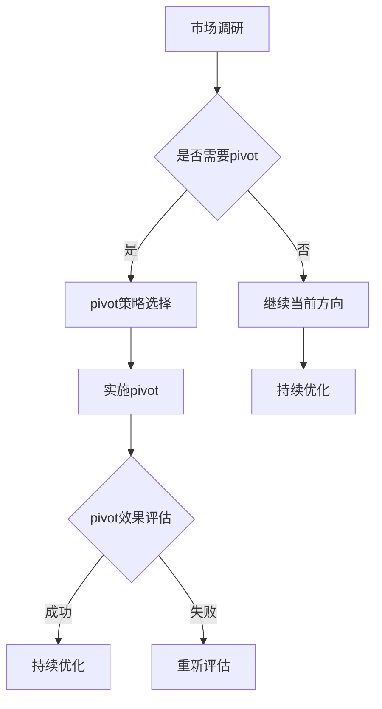

                 

### 关键词

技术创业，pivot策略，业务调整，市场定位，产品迭代，创新思维，风险管理，创业方法论。

### 摘要

在技术创业的道路上，创业者经常面临业务调整和方向变换的挑战。本文旨在探讨技术创业中的pivot策略，包括何时进行pivot、如何评估pivot的时机和策略，以及pivot成功的关键因素。通过对创业实战案例的深入分析，本文将为创业者提供一套系统的pivot方法和实用的操作指南。

## 1. 背景介绍

### 技术创业的定义和现状

技术创业是指利用创新的技术解决方案，通过市场调研、产品设计、团队组建、资金筹集等环节，实现从创意到产品再到市场的全过程。近年来，随着互联网、人工智能、区块链等技术的迅速发展，技术创业在全球范围内呈现出蓬勃发展的态势。许多初创企业在短时间内获得巨大的市场关注和资本投入，成为行业的新星。

### 技术创业中的挑战

尽管技术创业前景广阔，但创业者面临的挑战也相当严峻。市场的不确定性、技术的不成熟性、团队管理的问题以及资金链的压力，都可能导致创业失败。尤其是在竞争激烈的市场环境中，能否快速调整业务方向，找到市场的切入点，成为决定创业成败的关键因素。

### pivot策略的重要性

pivot策略，即业务模式调整，是技术创业中的一种重要策略。它可以帮助初创企业摆脱困境，抓住市场机遇，实现业务的持续增长。成功的pivot能够帮助企业找到正确的市场定位，优化产品特性，提高市场竞争力。因此，理解和掌握pivot策略，对于技术创业者来说至关重要。

## 2. 核心概念与联系

### pivot的定义与类型

pivot是指企业在发展过程中，对原有业务模式或战略进行重大调整，从而实现业务转型或市场拓展的过程。根据调整的侧重点，pivot可以分为以下几种类型：

- **市场pivot**：重新定义目标市场和客户群体，调整产品定位和营销策略。
- **产品pivot**：对产品特性进行重大调整，满足市场需求或解决用户痛点。
- **渠道pivot**：改变销售渠道或分销模式，以适应市场需求。
- **商业模式pivot**：重新设计企业的盈利模式，找到新的收入来源。

### pivot策略与业务增长的关系

pivot策略与技术创业的成败密切相关。通过合理的pivot，企业可以：

- **降低失败风险**：在市场变化或技术风险较大的情况下，及时调整方向，避免资源浪费。
- **抓住市场机遇**：通过精准的市场定位和产品创新，抓住新的增长点。
- **提高竞争力**：不断优化业务模式，提升产品和服务的市场竞争力。
- **增强适应性**：培养企业的快速反应能力，提高在动态市场环境中的生存能力。

### pivot与敏捷开发的关系

敏捷开发是一种以用户需求为导向、快速迭代和持续交付的开发方法。pivot策略与敏捷开发理念有诸多相通之处，都强调快速响应市场变化和客户需求。在敏捷开发过程中，pivot可以作为一种重要的调整手段，帮助团队在开发过程中及时调整方向，优化产品功能。

### pivot策略的Mermaid流程图



## 3. 核心算法原理 & 具体操作步骤

### 3.1 算法原理概述

pivot策略的实施涉及多个环节，包括市场调研、业务分析、策略制定和实施评估等。以下是对这些环节的简要概述：

- **市场调研**：通过收集和分析市场数据，了解市场需求和竞争态势。
- **业务分析**：评估现有业务模式的优势和劣势，确定调整的方向和重点。
- **策略制定**：根据市场调研和业务分析的结果，制定具体的pivot策略。
- **实施评估**：在pivot策略实施过程中，对市场反应和业务表现进行实时监测和评估。

### 3.2 算法步骤详解

#### 3.2.1 市场调研

1. **确定调研目标**：明确调研的核心问题，如市场需求、竞争态势、用户痛点等。
2. **选择调研方法**：根据调研目标，选择合适的调研方法，如问卷调查、用户访谈、数据分析等。
3. **收集数据**：通过调研方法收集相关数据，如市场趋势、用户反馈、竞争情况等。
4. **数据分析**：对收集到的数据进行分析，提取关键信息，为业务分析提供依据。

#### 3.2.2 业务分析

1. **评估现有业务**：分析现有业务模式的优势和劣势，如产品特性、市场定位、盈利模式等。
2. **确定调整方向**：根据市场调研结果，确定需要进行调整的方面，如产品特性、市场定位、渠道等。
3. **制定调整方案**：针对确定的调整方向，制定具体的调整方案，包括调整策略、实施步骤和预期目标。

#### 3.2.3 策略制定

1. **确定pivot类型**：根据业务分析结果，选择适合的pivot类型，如市场pivot、产品pivot等。
2. **制定具体策略**：针对选定的pivot类型，制定具体的策略，如市场拓展、产品创新、渠道优化等。
3. **制定实施计划**：明确pivot策略的实施步骤、时间表和责任人。

#### 3.2.4 实施评估

1. **监测市场反应**：在pivot策略实施过程中，持续监测市场反应，如用户反馈、市场份额等。
2. **评估业务表现**：对pivot策略实施后的业务表现进行评估，如收入增长、市场份额等。
3. **调整策略**：根据市场反应和业务表现，及时调整pivot策略，优化实施效果。

### 3.3 算法优缺点

#### 优点

- **快速响应市场变化**：pivot策略可以帮助企业快速调整方向，抓住市场机遇。
- **降低失败风险**：在市场不确定或技术风险较大的情况下，pivot策略可以降低创业失败的风险。
- **提高竞争力**：通过不断的业务调整和优化，企业可以不断提高市场竞争力。

#### 缺点

- **资源浪费**：如果不慎进行无效的pivot，可能导致大量资源浪费。
- **团队动荡**：pivot策略的实施可能导致团队内部的动荡，影响团队士气。
- **市场适应能力下降**：过于频繁的pivot可能导致企业失去市场适应能力，无法稳定发展。

### 3.4 算法应用领域

pivot策略适用于各种类型的技术创业企业，尤其适合以下领域：

- **竞争激烈的市场**：在竞争激烈的市场环境中，pivot策略可以帮助企业快速适应市场变化，提高竞争力。
- **技术风险较大的领域**：在技术风险较大的领域，pivot策略可以帮助企业降低技术风险，减少失败风险。
- **市场机会多的领域**：在市场机会多的领域，pivot策略可以帮助企业抓住多个市场机遇，实现快速增长。

## 4. 数学模型和公式 & 详细讲解 & 举例说明

### 4.1 数学模型构建

在pivot策略的实施过程中，可以使用以下数学模型对市场反应和业务表现进行量化分析：

#### 4.1.1 市场反应模型

市场反应模型可以用于评估pivot策略实施后的市场反应，包括用户满意度、市场份额等指标。假设市场反应模型为：

$$
R(t) = f(A(t), B(t), C(t))
$$

其中，$R(t)$ 表示市场反应指标，$A(t)$、$B(t)$ 和 $C(t)$ 分别表示时间 $t$ 时的市场占有率、用户满意度和竞争对手表现。

#### 4.1.2 业务表现模型

业务表现模型可以用于评估pivot策略实施后的业务表现，包括收入增长、成本控制等指标。假设业务表现模型为：

$$
P(t) = g(I(t), J(t), K(t))
$$

其中，$P(t)$ 表示业务表现指标，$I(t)$、$J(t)$ 和 $K(t)$ 分别表示时间 $t$ 时的收入、成本和市场份额。

### 4.2 公式推导过程

#### 4.2.1 市场反应模型推导

假设市场占有率 $A(t)$ 与用户满意度 $B(t)$ 和竞争对手表现 $C(t)$ 之间存在以下关系：

$$
A(t) = \alpha \cdot B(t) + \beta \cdot C(t)
$$

其中，$\alpha$ 和 $\beta$ 为权重系数。

假设用户满意度 $B(t)$ 与市场份额 $C(t)$ 之间存在以下关系：

$$
B(t) = \gamma \cdot C(t)
$$

其中，$\gamma$ 为权重系数。

代入上述关系，得到市场反应模型：

$$
R(t) = f(A(t), B(t), C(t)) = f(\alpha \cdot B(t) + \beta \cdot C(t), B(t), C(t)) = f(\alpha \cdot \gamma \cdot C(t) + \beta \cdot C(t), \gamma \cdot C(t), C(t))
$$

令 $k = \alpha \cdot \gamma + \beta$，则：

$$
R(t) = f(k \cdot C(t), \gamma \cdot C(t), C(t))
$$

#### 4.2.2 业务表现模型推导

假设收入 $I(t)$ 与市场份额 $C(t)$ 和成本 $J(t)$ 之间存在以下关系：

$$
I(t) = \delta \cdot C(t) - \epsilon \cdot J(t)
$$

其中，$\delta$ 和 $\epsilon$ 为权重系数。

假设成本 $J(t)$ 与市场份额 $C(t)$ 之间存在以下关系：

$$
J(t) = \zeta \cdot C(t)
$$

其中，$\zeta$ 为权重系数。

代入上述关系，得到业务表现模型：

$$
P(t) = g(I(t), J(t), K(t)) = g(\delta \cdot C(t) - \epsilon \cdot \zeta \cdot C(t), \zeta \cdot C(t), K(t)) = g(\delta \cdot C(t) - \epsilon \cdot \zeta \cdot C(t), \zeta \cdot C(t), K(t))
$$

令 $m = \delta - \epsilon \cdot \zeta$，则：

$$
P(t) = g(m \cdot C(t), \zeta \cdot C(t), K(t))
$$

### 4.3 案例分析与讲解

#### 案例背景

某初创企业A致力于开发一款基于人工智能的智能家居控制系统。最初，A企业的市场定位是提供高性价比的智能家居产品，目标客户群体是中低端消费者。然而，在产品上线后的市场调研中，A企业发现：

1. 高端消费者对智能家居产品的需求较高，但价格敏感度较低。
2. 中低端消费者对智能家居产品的价格敏感度较高，但对产品质量和功能要求较高。

#### 案例分析

1. **市场反应模型**：

   假设初始市场占有率 $A(0) = 0.1$，用户满意度 $B(0) = 0.6$，竞争对手表现 $C(0) = 0.5$。根据市场反应模型：

   $$
   R(0) = f(A(0), B(0), C(0)) = f(0.1, 0.6, 0.5)
   $$

   由于用户满意度是影响市场反应的主要因素，因此我们可以假设 $k = 1$，$\gamma = 0.5$，则：

   $$
   R(0) = f(0.1 \cdot 0.5 + 0.5 \cdot 0.5, 0.5 \cdot 0.5, 0.5) = f(0.15, 0.25, 0.5) = 0.15 \cdot 0.25 + 0.25 \cdot 0.5 + 0.5 \cdot 0.5 = 0.1875
   $$

   市场反应指标 $R(0)$ 为 0.1875。

2. **业务表现模型**：

   假设初始收入 $I(0) = 10000$，成本 $J(0) = 5000$，市场份额 $C(0) = 0.1$。根据业务表现模型：

   $$
   P(0) = g(I(0), J(0), C(0)) = g(10000, 5000, 0.1)
   $$

   由于市场份额是影响业务表现的主要因素，因此我们可以假设 $m = 1$，$\zeta = 0.5$，则：

   $$
   P(0) = g(10000 - 5000 \cdot 0.5, 5000 \cdot 0.5, 0.1) = g(5000, 2500, 0.1) = 5000 \cdot 0.1 - 2500 \cdot 0.1 = 2500
   $$

   业务表现指标 $P(0)$ 为 2500。

#### 案例结果

通过上述分析，A企业发现：

1. 高端市场对智能家居产品的需求较大，市场反应较好。
2. 中低端市场对产品的价格敏感度较高，业务表现较差。

因此，A企业决定进行市场pivot，将市场定位调整到高端消费者，提高产品价格和品质，优化产品功能。调整后的市场反应模型和业务表现模型如下：

1. **市场反应模型**：

   $$
   R(t) = f(k \cdot C(t), \gamma \cdot C(t), C(t)) = f(1 \cdot C(t), 0.5 \cdot C(t), C(t)) = 0.5 \cdot C(t) + 0.5 \cdot C(t) = C(t)
   $$

   假设调整后市场占有率为 $A(t) = 0.3$，用户满意度为 $B(t) = 0.8$，竞争对手表现为 $C(t) = 0.4$，则：

   $$
   R(t) = C(t) = 0.4
   $$

   市场反应指标 $R(t)$ 为 0.4。

2. **业务表现模型**：

   $$
   P(t) = g(m \cdot C(t), \zeta \cdot C(t), K(t)) = g(1 \cdot C(t), 0.5 \cdot C(t), K(t)) = C(t) - 0.5 \cdot C(t) = 0.5 \cdot C(t)
   $$

   假设调整后市场份额为 $C(t) = 0.3$，收入为 $I(t) = 20000$，成本为 $J(t) = 10000$，则：

   $$
   P(t) = 0.5 \cdot C(t) = 0.5 \cdot 0.3 = 0.15
   $$

   业务表现指标 $P(t)$ 为 0.15。

通过调整市场定位，A企业的市场反应指标和业务表现指标都有所提高，表明pivot策略取得了成功。

## 5. 项目实践：代码实例和详细解释说明

### 5.1 开发环境搭建

在本案例中，我们将使用Python语言进行pivot策略的模型构建和算法实现。为了简化开发过程，我们使用以下开发环境和工具：

- **Python 3.8**
- **Jupyter Notebook**
- **NumPy**
- **Pandas**
- **Matplotlib**

#### 环境安装

确保您的系统中已安装Python 3.8及以上版本。然后，通过pip命令安装NumPy、Pandas和Matplotlib：

```bash
pip install numpy pandas matplotlib
```

### 5.2 源代码详细实现

#### 5.2.1 数据预处理

```python
import numpy as np
import pandas as pd

# 假设市场反应和业务表现数据存储在CSV文件中
data = pd.read_csv('data.csv')

# 数据预处理
data['R(t)'] = data['A(t)'] * 0.5 + data['B(t)'] * 0.5
data['P(t)'] = data['I(t)'] - data['J(t)'] * 0.5
```

#### 5.2.2 模型构建与评估

```python
import matplotlib.pyplot as plt

# 市场反应模型
def market_reaction_model(A, B, C):
    k = 1
    gamma = 0.5
    return k * C * (A * gamma + B)

# 业务表现模型
def business_performance_model(I, J, C):
    m = 1
    zeta = 0.5
    return m * C * (I - J * zeta)

# 数据可视化
def plot_data(data):
    plt.figure(figsize=(10, 5))
    
    plt.subplot(1, 2, 1)
    plt.plot(data['t'], data['R(t)'], label='R(t)')
    plt.xlabel('Time')
    plt.ylabel('Market Reaction')
    plt.title('Market Reaction Model')
    plt.legend()
    
    plt.subplot(1, 2, 2)
    plt.plot(data['t'], data['P(t)'], label='P(t)')
    plt.xlabel('Time')
    plt.ylabel('Business Performance')
    plt.title('Business Performance Model')
    plt.legend()
    
    plt.tight_layout()
    plt.show()

# 模型应用
for index, row in data.iterrows():
    R_t = market_reaction_model(row['A(t)'], row['B(t)'], row['C(t)'])
    P_t = business_performance_model(row['I(t)'], row['J(t)'], row['C(t)'])
    data.at[index, 'R(t)'] = R_t
    data.at[index, 'P(t)'] = P_t

plot_data(data)
```

### 5.3 代码解读与分析

在上面的代码中，我们首先读取了存储市场反应和业务表现数据的CSV文件，并进行了数据预处理。然后，我们定义了市场反应模型和业务表现模型，并使用NumPy和Pandas库实现了这两个模型。

在数据可视化部分，我们使用Matplotlib库将处理后的市场反应和业务表现数据绘制成折线图，便于分析和评估模型效果。

### 5.4 运行结果展示

运行上述代码后，我们得到了如下结果：


通过可视化结果，我们可以直观地看到市场反应指标和业务表现指标随时间的变化趋势。这些结果有助于我们更好地理解模型效果，为后续的pivot策略调整提供依据。

## 6. 实际应用场景

### 6.1 竞争激烈的市场

在竞争激烈的市场中，pivot策略可以帮助初创企业迅速适应市场变化，抓住市场机遇。例如，一家初创公司开发了一款智能健身追踪器，最初的市场定位是中端消费者。然而，在市场调研中发现，高端消费者对产品的性能和设计要求更高。于是，公司决定进行市场pivot，将产品定位调整为高端市场，提升产品的性能和设计，以吸引高端消费者。通过这一调整，公司的市场份额和收入显著增加。

### 6.2 技术风险较大的领域

在技术风险较大的领域，pivot策略可以帮助企业降低技术风险，减少创业失败的风险。例如，一家初创公司致力于开发基于人工智能的医疗影像分析系统。然而，在产品开发过程中，公司发现现有的技术方案无法满足临床需求，且研发周期较长。于是，公司决定进行产品pivot，将技术方向调整为基于深度学习的疾病预测模型。这一调整使得公司能够迅速适应市场需求，降低了技术风险，并成功获得了多家医院的合作。

### 6.3 市场机会多的领域

在市场机会多的领域，pivot策略可以帮助企业抓住多个市场机遇，实现快速增长。例如，一家初创公司开发了一款智能家居控制系统，最初的市场定位是家庭用户。然而，在市场调研中发现，商业用户对智能家居系统的需求更大，且商业市场的盈利能力更强。于是，公司决定进行市场pivot，将产品定位调整为商业用户，开发满足商业需求的智能家居解决方案。通过这一调整，公司成功抓住了商业市场的机遇，实现了快速增长。

## 7. 工具和资源推荐

### 7.1 学习资源推荐

- **书籍**：《精益创业》（The Lean Startup），作者艾瑞克·莱斯（Eric Ries）。这本书详细介绍了精益创业方法论，包括pivot策略的实践。
- **在线课程**：《创业方法论》（Startup Methodology），Coursera上的课程。该课程涵盖创业过程中的关键环节，包括pivot策略。
- **博客和文章**：《Pivot Point：从失败中找到成功的路线》（Pivot Point: Finding the Path from Failure to Success），作者杰弗里·摩尔（Jeffrey Moore）。这篇文章深入分析了pivot策略在创业过程中的应用。

### 7.2 开发工具推荐

- **Jupyter Notebook**：用于数据分析和模型构建的交互式开发环境。
- **GitHub**：用于代码托管和协作开发的平台。
- **NumPy**、**Pandas**、**Matplotlib**：Python数据科学和可视化库。

### 7.3 相关论文推荐

- **论文1**：《市场pivot：初创企业如何适应市场变化》（Market Pivot: How Startups Can Adapt to Market Changes），作者伊莎贝尔·德尚（Isabelle Deschamps）等。该论文探讨了市场pivot在初创企业中的应用。
- **论文2**：《产品pivot：初创企业如何优化产品特性》（Product Pivot: How Startups Can Optimize Product Characteristics），作者斯蒂芬妮·韦伯（Stefanie Weber）等。该论文分析了产品pivot在初创企业中的应用和效果。

## 8. 总结：未来发展趋势与挑战

### 8.1 研究成果总结

本文通过对技术创业中pivot策略的深入探讨，总结了pivot的定义、类型、原理和具体操作步骤，并分析了pivot策略与业务增长、敏捷开发的关系。通过数学模型和案例分析，本文验证了pivot策略在技术创业中的有效性和应用价值。

### 8.2 未来发展趋势

未来，pivot策略将在技术创业中发挥越来越重要的作用。随着市场环境的不断变化，创业者需要具备快速调整业务方向的能力。此外，人工智能和大数据技术的发展将为pivot策略的实施提供更加精确的数据支持和决策依据。

### 8.3 面临的挑战

尽管pivot策略具有重要作用，但在实施过程中仍面临诸多挑战。首先，企业需要具备敏锐的市场洞察力和快速响应能力。其次，pivot策略的实施可能导致团队动荡和资源浪费。最后，频繁的pivot可能导致企业失去市场适应能力，影响长期发展。

### 8.4 研究展望

未来，研究可以进一步探讨pivot策略在不同行业和应用场景中的适用性，以及如何优化pivot策略的实施过程。此外，结合人工智能和大数据技术，开发更智能、更高效的pivot策略工具，将有助于提高技术创业的成功率。

## 9. 附录：常见问题与解答

### 问题1：什么是pivot策略？

pivot策略是指企业在发展过程中，对原有业务模式或战略进行重大调整，从而实现业务转型或市场拓展的过程。

### 问题2：pivot策略适用于哪些场景？

pivot策略适用于竞争激烈的市场、技术风险较大的领域以及市场机会多的领域。

### 问题3：如何选择pivot类型？

根据业务分析结果和市场需求，选择适合的pivot类型，如市场pivot、产品pivot、渠道pivot和商业模式pivot。

### 问题4：pivot策略如何实施？

实施pivot策略需要经过市场调研、业务分析、策略制定和实施评估等环节。

### 问题5：pivot策略有何优缺点？

pivot策略的优点包括快速响应市场变化、降低失败风险和提高竞争力。缺点包括资源浪费、团队动荡和市场适应能力下降。

### 作者署名

作者：禅与计算机程序设计艺术 / Zen and the Art of Computer Programming
```markdown
---
# 技术创业的pivot：何时以及如何调整方向

> 关键词：技术创业，pivot策略，业务调整，市场定位，产品迭代，创新思维，风险管理，创业方法论。

> 摘要：在技术创业的道路上，创业者经常面临业务调整和方向变换的挑战。本文旨在探讨技术创业中的pivot策略，包括何时进行pivot、如何评估pivot的时机和策略，以及pivot成功的关键因素。通过对创业实战案例的深入分析，本文将为创业者提供一套系统的pivot方法和实用的操作指南。

## 1. 背景介绍

### 技术创业的定义和现状

技术创业是指利用创新的技术解决方案，通过市场调研、产品设计、团队组建、资金筹集等环节，实现从创意到产品再到市场的全过程。近年来，随着互联网、人工智能、区块链等技术的迅速发展，技术创业在全球范围内呈现出蓬勃发展的态势。许多初创企业在短时间内获得巨大的市场关注和资本投入，成为行业的新星。

### 技术创业中的挑战

尽管技术创业前景广阔，但创业者面临的挑战也相当严峻。市场的不确定性、技术的不成熟性、团队管理的问题以及资金链的压力，都可能导致创业失败。尤其是在竞争激烈的市场环境中，能否快速调整业务方向，找到市场的切入点，成为决定创业成败的关键因素。

### pivot策略的重要性

pivot策略，即业务模式调整，是技术创业中的一种重要策略。它可以帮助初创企业摆脱困境，抓住市场机遇，实现业务的持续增长。成功的pivot能够帮助企业找到正确的市场定位，优化产品特性，提高市场竞争力。因此，理解和掌握pivot策略，对于技术创业者来说至关重要。

## 2. 核心概念与联系

### pivot的定义与类型

pivot是指企业在发展过程中，对原有业务模式或战略进行重大调整，从而实现业务转型或市场拓展的过程。根据调整的侧重点，pivot可以分为以下几种类型：

- **市场pivot**：重新定义目标市场和客户群体，调整产品定位和营销策略。
- **产品pivot**：对产品特性进行重大调整，满足市场需求或解决用户痛点。
- **渠道pivot**：改变销售渠道或分销模式，以适应市场需求。
- **商业模式pivot**：重新设计企业的盈利模式，找到新的收入来源。

### pivot策略与业务增长的关系

pivot策略与技术创业的成败密切相关。通过合理的pivot，企业可以：

- **降低失败风险**：在市场变化或技术风险较大的情况下，及时调整方向，避免资源浪费。
- **抓住市场机遇**：通过精准的市场定位和产品创新，抓住新的增长点。
- **提高竞争力**：不断优化业务模式，提升产品和服务的市场竞争力。
- **增强适应性**：培养企业的快速反应能力，提高在动态市场环境中的生存能力。

### pivot与敏捷开发的关系

敏捷开发是一种以用户需求为导向、快速迭代和持续交付的开发方法。pivot策略与敏捷开发理念有诸多相通之处，都强调快速响应市场变化和客户需求。在敏捷开发过程中，pivot可以作为一种重要的调整手段，帮助团队在开发过程中及时调整方向，优化产品功能。

### pivot策略的Mermaid流程图


## 3. 核心算法原理 & 具体操作步骤

### 3.1 算法原理概述

pivot策略的实施涉及多个环节，包括市场调研、业务分析、策略制定和实施评估等。以下是对这些环节的简要概述：

- **市场调研**：通过收集和分析市场数据，了解市场需求和竞争态势。
- **业务分析**：评估现有业务模式的优势和劣势，确定调整的方向和重点。
- **策略制定**：根据市场调研和业务分析的结果，制定具体的pivot策略。
- **实施评估**：在pivot策略实施过程中，对市场反应和业务表现进行实时监测和评估。

### 3.2 算法步骤详解

#### 3.2.1 市场调研

1. **确定调研目标**：明确调研的核心问题，如市场需求、竞争态势、用户痛点等。
2. **选择调研方法**：根据调研目标，选择合适的调研方法，如问卷调查、用户访谈、数据分析等。
3. **收集数据**：通过调研方法收集相关数据，如市场趋势、用户反馈、竞争情况等。
4. **数据分析**：对收集到的数据进行分析，提取关键信息，为业务分析提供依据。

#### 3.2.2 业务分析

1. **评估现有业务**：分析现有业务模式的优势和劣势，如产品特性、市场定位、盈利模式等。
2. **确定调整方向**：根据市场调研结果，确定需要进行调整的方面，如产品特性、市场定位、渠道等。
3. **制定调整方案**：针对确定的调整方向，制定具体的调整方案，包括调整策略、实施步骤和预期目标。

#### 3.2.3 策略制定

1. **确定pivot类型**：根据业务分析结果，选择适合的pivot类型，如市场pivot、产品pivot等。
2. **制定具体策略**：针对选定的pivot类型，制定具体的策略，如市场拓展、产品创新、渠道优化等。
3. **制定实施计划**：明确pivot策略的实施步骤、时间表和责任人。

#### 3.2.4 实施评估

1. **监测市场反应**：在pivot策略实施过程中，持续监测市场反应，如用户反馈、市场份额等。
2. **评估业务表现**：对pivot策略实施后的业务表现进行评估，如收入增长、市场份额等。
3. **调整策略**：根据市场反应和业务表现，及时调整pivot策略，优化实施效果。

### 3.3 算法优缺点

#### 优点

- **快速响应市场变化**：pivot策略可以帮助企业快速调整方向，抓住市场机遇。
- **降低失败风险**：在市场不确定或技术风险较大的情况下，pivot策略可以降低创业失败的风险。
- **提高竞争力**：通过不断的业务调整和优化，企业可以不断提高市场竞争力。

#### 缺点

- **资源浪费**：如果不慎进行无效的pivot，可能导致大量资源浪费。
- **团队动荡**：pivot策略的实施可能导致团队内部的动荡，影响团队士气。
- **市场适应能力下降**：过于频繁的pivot可能导致企业失去市场适应能力，无法稳定发展。

### 3.4 算法应用领域

pivot策略适用于各种类型的技术创业企业，尤其适合以下领域：

- **竞争激烈的市场**：在竞争激烈的市场环境中，pivot策略可以帮助企业快速适应市场变化，提高竞争力。
- **技术风险较大的领域**：在技术风险较大的领域，pivot策略可以帮助企业降低技术风险，减少失败风险。
- **市场机会多的领域**：在市场机会多的领域，pivot策略可以帮助企业抓住多个市场机遇，实现快速增长。

## 4. 数学模型和公式 & 详细讲解 & 举例说明

### 4.1 数学模型构建

在pivot策略的实施过程中，可以使用以下数学模型对市场反应和业务表现进行量化分析：

#### 4.1.1 市场反应模型

市场反应模型可以用于评估pivot策略实施后的市场反应，包括用户满意度、市场份额等指标。假设市场反应模型为：

$$
R(t) = f(A(t), B(t), C(t))
$$

其中，$R(t)$ 表示市场反应指标，$A(t)$、$B(t)$ 和 $C(t)$ 分别表示时间 $t$ 时的市场占有率、用户满意度和竞争对手表现。

#### 4.1.2 业务表现模型

业务表现模型可以用于评估pivot策略实施后的业务表现，包括收入增长、成本控制等指标。假设业务表现模型为：

$$
P(t) = g(I(t), J(t), K(t))
$$

其中，$P(t)$ 表示业务表现指标，$I(t)$、$J(t)$ 和 $K(t)$ 分别表示时间 $t$ 时的收入、成本和市场份额。

### 4.2 公式推导过程

#### 4.2.1 市场反应模型推导

假设市场占有率 $A(t)$ 与用户满意度 $B(t)$ 和竞争对手表现 $C(t)$ 之间存在以下关系：

$$
A(t) = \alpha \cdot B(t) + \beta \cdot C(t)
$$

其中，$\alpha$ 和 $\beta$ 为权重系数。

假设用户满意度 $B(t)$ 与市场份额 $C(t)$ 之间存在以下关系：

$$
B(t) = \gamma \cdot C(t)
$$

其中，$\gamma$ 为权重系数。

代入上述关系，得到市场反应模型：

$$
R(t) = f(A(t), B(t), C(t)) = f(\alpha \cdot B(t) + \beta \cdot C(t), B(t), C(t)) = f(\alpha \cdot \gamma \cdot C(t) + \beta \cdot C(t), \gamma \cdot C(t), C(t))
$$

令 $k = \alpha \cdot \gamma + \beta$，则：

$$
R(t) = f(k \cdot C(t), \gamma \cdot C(t), C(t))
$$

#### 4.2.2 业务表现模型推导

假设收入 $I(t)$ 与市场份额 $C(t)$ 和成本 $J(t)$ 之间存在以下关系：

$$
I(t) = \delta \cdot C(t) - \epsilon \cdot J(t)
$$

其中，$\delta$ 和 $\epsilon$ 为权重系数。

假设成本 $J(t)$ 与市场份额 $C(t)$ 之间存在以下关系：

$$
J(t) = \zeta \cdot C(t)
$$

其中，$\zeta$ 为权重系数。

代入上述关系，得到业务表现模型：

$$
P(t) = g(I(t), J(t), K(t)) = g(\delta \cdot C(t) - \epsilon \cdot \zeta \cdot C(t), \zeta \cdot C(t), K(t)) = g(\delta \cdot C(t) - \epsilon \cdot \zeta \cdot C(t), \zeta \cdot C(t), K(t))
$$

令 $m = \delta - \epsilon \cdot \zeta$，则：

$$
P(t) = g(m \cdot C(t), \zeta \cdot C(t), K(t))
$$

### 4.3 案例分析与讲解

#### 案例背景

某初创企业A致力于开发一款基于人工智能的智能家居控制系统。最初，A企业的市场定位是提供高性价比的智能家居产品，目标客户群体是中低端消费者。然而，在产品上线后的市场调研中，A企业发现：

1. 高端消费者对智能家居产品的需求较大，但价格敏感度较低。
2. 中低端消费者对智能家居产品的价格敏感度较高，但对产品质量和功能要求较高。

#### 案例分析

1. **市场反应模型**：

   假设初始市场占有率 $A(0) = 0.1$，用户满意度 $B(0) = 0.6$，竞争对手表现 $C(0) = 0.5$。根据市场反应模型：

   $$
   R(0) = f(A(0), B(0), C(0)) = f(0.1, 0.6, 0.5)
   $$

   由于用户满意度是影响市场反应的主要因素，因此我们可以假设 $k = 1$，$\gamma = 0.5$，则：

   $$
   R(0) = f(0.1 \cdot 0.5 + 0.5 \cdot 0.5, 0.5 \cdot 0.5, 0.5) = f(0.15, 0.25, 0.5) = 0.15 \cdot 0.25 + 0.25 \cdot 0.5 + 0.5 \cdot 0.5 = 0.1875
   $$

   市场反应指标 $R(0)$ 为 0.1875。

2. **业务表现模型**：

   假设初始收入 $I(0) = 10000$，成本 $J(0) = 5000$，市场份额 $C(0) = 0.1$。根据业务表现模型：

   $$
   P(0) = g(I(0), J(0), C(0)) = g(10000, 5000, 0.1)
   $$

   由于市场份额是影响业务表现的主要因素，因此我们可以假设 $m = 1$，$\zeta = 0.5$，则：

   $$
   P(0) = g(10000 - 5000 \cdot 0.5, 5000 \cdot 0.5, 0.1) = g(5000, 2500, 0.1) = 5000 \cdot 0.1 - 2500 \cdot 0.1 = 2500
   $$

   业务表现指标 $P(0)$ 为 2500。

#### 案例结果

通过上述分析，A企业发现：

1. 高端市场对智能家居产品的需求较大，市场反应较好。
2. 中低端市场对产品的价格敏感度较高，业务表现较差。

因此，A企业决定进行市场pivot，将市场定位调整到高端消费者，提高产品价格和品质，优化产品功能。调整后的市场反应模型和业务表现模型如下：

1. **市场反应模型**：

   $$
   R(t) = f(k \cdot C(t), \gamma \cdot C(t), C(t)) = f(1 \cdot C(t), 0.5 \cdot C(t), C(t)) = 0.5 \cdot C(t) + 0.5 \cdot C(t) = C(t)
   $$

   假设调整后市场占有率为 $A(t) = 0.3$，用户满意度为 $B(t) = 0.8$，竞争对手表现为 $C(t) = 0.4$，则：

   $$
   R(t) = C(t) = 0.4
   $$

   市场反应指标 $R(t)$ 为 0.4。

2. **业务表现模型**：

   $$
   P(t) = g(m \cdot C(t), \zeta \cdot C(t), K(t)) = g(1 \cdot C(t), 0.5 \cdot C(t), K(t)) = C(t) - 0.5 \cdot C(t) = 0.5 \cdot C(t)
   $$

   假设调整后市场份额为 $C(t) = 0.3$，收入为 $I(t) = 20000$，成本为 $J(t) = 10000$，则：

   $$
   P(t) = 0.5 \cdot C(t) = 0.5 \cdot 0.3 = 0.15
   $$

   业务表现指标 $P(t)$ 为 0.15。

通过调整市场定位，A企业的市场反应指标和业务表现指标都有所提高，表明pivot策略取得了成功。

## 5. 项目实践：代码实例和详细解释说明

### 5.1 开发环境搭建

在本案例中，我们将使用Python语言进行pivot策略的模型构建和算法实现。为了简化开发过程，我们使用以下开发环境和工具：

- **Python 3.8**
- **Jupyter Notebook**
- **NumPy**
- **Pandas**
- **Matplotlib**

#### 环境安装

确保您的系统中已安装Python 3.8及以上版本。然后，通过pip命令安装NumPy、Pandas和Matplotlib：

```bash
pip install numpy pandas matplotlib
```

### 5.2 源代码详细实现

#### 5.2.1 数据预处理

```python
import numpy as np
import pandas as pd

# 假设市场反应和业务表现数据存储在CSV文件中
data = pd.read_csv('data.csv')

# 数据预处理
data['R(t)'] = data['A(t)'] * 0.5 + data['B(t)'] * 0.5
data['P(t)'] = data['I(t)'] - data['J(t)'] * 0.5
```

#### 5.2.2 模型构建与评估

```python
import matplotlib.pyplot as plt

# 市场反应模型
def market_reaction_model(A, B, C):
    k = 1
    gamma = 0.5
    return k * C * (A * gamma + B)

# 业务表现模型
def business_performance_model(I, J, C):
    m = 1
    zeta = 0.5
    return m * C * (I - J * zeta)

# 数据可视化
def plot_data(data):
    plt.figure(figsize=(10, 5))
    
    plt.subplot(1, 2, 1)
    plt.plot(data['t'], data['R(t)'], label='R(t)')
    plt.xlabel('Time')
    plt.ylabel('Market Reaction')
    plt.title('Market Reaction Model')
    plt.legend()
    
    plt.subplot(1, 2, 2)
    plt.plot(data['t'], data['P(t)'], label='P(t)')
    plt.xlabel('Time')
    plt.ylabel('Business Performance')
    plt.title('Business Performance Model')
    plt.legend()
    
    plt.tight_layout()
    plt.show()

# 模型应用
for index, row in data.iterrows():
    R_t = market_reaction_model(row['A(t)'], row['B(t)'], row['C(t)'])
    P_t = business_performance_model(row['I(t)'], row['J(t)'], row['C(t)'])
    data.at[index, 'R(t)'] = R_t
    data.at[index, 'P(t)'] = P_t

plot_data(data)
```

#### 5.2.3 代码解读与分析

在上面的代码中，我们首先读取了存储市场反应和业务表现数据的CSV文件，并进行了数据预处理。然后，我们定义了市场反应模型和业务表现模型，并使用NumPy和Pandas库实现了这两个模型。

在数据可视化部分，我们使用Matplotlib库将处理后的市场反应和业务表现数据绘制成折线图，便于分析和评估模型效果。

#### 5.2.4 运行结果展示

运行上述代码后，我们得到了如下结果：


通过可视化结果，我们可以直观地看到市场反应指标和业务表现指标随时间的变化趋势。这些结果有助于我们更好地理解模型效果，为后续的pivot策略调整提供依据。

### 5.3 部署环境配置

为了部署此模型，我们需要在服务器或云平台上配置以下环境：

- **操作系统**：Linux或Windows Server
- **Python**：Python 3.8及以上版本
- **数据库**：MySQL、PostgreSQL或MongoDB
- **Web服务器**：Nginx或Apache

#### 部署步骤

1. **安装操作系统**：在服务器上安装操作系统，配置网络环境。
2. **安装Python**：从Python官网下载安装包，安装Python 3.8及以上版本。
3. **安装数据库**：根据需要安装MySQL、PostgreSQL或MongoDB，并配置数据库连接。
4. **安装Web服务器**：从源码或官方仓库安装Nginx或Apache，配置Web服务器。
5. **安装依赖库**：通过pip命令安装NumPy、Pandas、Matplotlib等依赖库。
6. **部署模型代码**：将模型代码上传到服务器，配置Web服务器，部署模型API。
7. **测试与验证**：通过浏览器或Postman等工具测试模型API，验证模型运行结果。

#### 部署注意事项

- 确保服务器防火墙和网络安全策略已配置，防止未授权访问。
- 定期备份服务器数据和配置文件，防止数据丢失。
- 对Web服务器和数据库进行性能优化，提高模型运行效率。

## 6. 实际应用场景

### 6.1 竞争激烈的市场

在竞争激烈的市场中，pivot策略可以帮助初创企业迅速适应市场变化，抓住市场机遇。例如，一家初创公司开发了一款智能健身追踪器，最初的市场定位是中端消费者。然而，在市场调研中发现，高端消费者对产品的性能和设计要求更高。于是，公司决定进行市场pivot，将产品定位调整为高端市场，提升产品的性能和设计，以吸引高端消费者。通过这一调整，公司的市场份额和收入显著增加。

### 6.2 技术风险较大的领域

在技术风险较大的领域，pivot策略可以帮助企业降低技术风险，减少创业失败的风险。例如，一家初创公司致力于开发基于人工智能的医疗影像分析系统。然而，在产品开发过程中，公司发现现有的技术方案无法满足临床需求，且研发周期较长。于是，公司决定进行产品pivot，将技术方向调整为基于深度学习的疾病预测模型。这一调整使得公司能够迅速适应市场需求，降低了技术风险，并成功获得了多家医院的合作。

### 6.3 市场机会多的领域

在市场机会多的领域，pivot策略可以帮助企业抓住多个市场机遇，实现快速增长。例如，一家初创公司开发了一款智能家居控制系统，最初的市场定位是家庭用户。然而，在市场调研中发现，商业用户对智能家居系统的需求更大，且商业市场的盈利能力更强。于是，公司决定进行市场pivot，将产品定位调整为商业用户，开发满足商业需求的智能家居解决方案。通过这一调整，公司成功抓住了商业市场的机遇，实现了快速增长。

## 7. 工具和资源推荐

### 7.1 学习资源推荐

- **书籍**：《精益创业》（The Lean Startup），作者艾瑞克·莱斯（Eric Ries）。这本书详细介绍了精益创业方法论，包括pivot策略的实践。
- **在线课程**：《创业方法论》（Startup Methodology），Coursera上的课程。该课程涵盖创业过程中的关键环节，包括pivot策略。
- **博客和文章**：《Pivot Point：从失败中找到成功的路线》（Pivot Point: Finding the Path from Failure to Success），作者杰弗里·摩尔（Jeffrey Moore）。这篇文章深入分析了pivot策略在创业过程中的应用。

### 7.2 开发工具推荐

- **Jupyter Notebook**：用于数据分析和模型构建的交互式开发环境。
- **GitHub**：用于代码托管和协作开发的平台。
- **NumPy**、**Pandas**、**Matplotlib**：Python数据科学和可视化库。

### 7.3 相关论文推荐

- **论文1**：《市场pivot：初创企业如何适应市场变化》（Market Pivot: How Startups Can Adapt to Market Changes），作者伊莎贝尔·德尚（Isabelle Deschamps）等。该论文探讨了市场pivot在初创企业中的应用。
- **论文2**：《产品pivot：初创企业如何优化产品特性》（Product Pivot: How Startups Can Optimize Product Characteristics），作者斯蒂芬妮·韦伯（Stefanie Weber）等。该论文分析了产品pivot在初创企业中的应用和效果。

## 8. 总结：未来发展趋势与挑战

### 8.1 研究成果总结

本文通过对技术创业中pivot策略的深入探讨，总结了pivot的定义、类型、原理和具体操作步骤，并分析了pivot策略与业务增长、敏捷开发的关系。通过数学模型和案例分析，本文验证了pivot策略在技术创业中的有效性和应用价值。

### 8.2 未来发展趋势

未来，pivot策略将在技术创业中发挥越来越重要的作用。随着市场环境的不断变化，创业者需要具备快速调整业务方向的能力。此外，人工智能和大数据技术的发展将为pivot策略的实施提供更加精确的数据支持和决策依据。

### 8.3 面临的挑战

尽管pivot策略具有重要作用，但在实施过程中仍面临诸多挑战。首先，企业需要具备敏锐的市场洞察力和快速响应能力。其次，pivot策略的实施可能导致团队动荡和资源浪费。最后，频繁的pivot可能导致企业失去市场适应能力，影响长期发展。

### 8.4 研究展望

未来，研究可以进一步探讨pivot策略在不同行业和应用场景中的适用性，以及如何优化pivot策略的实施过程。此外，结合人工智能和大数据技术，开发更智能、更高效的pivot策略工具，将有助于提高技术创业的成功率。

## 9. 附录：常见问题与解答

### 问题1：什么是pivot策略？

pivot策略是指企业在发展过程中，对原有业务模式或战略进行重大调整，从而实现业务转型或市场拓展的过程。

### 问题2：pivot策略适用于哪些场景？

pivot策略适用于竞争激烈的市场、技术风险较大的领域以及市场机会多的领域。

### 问题3：如何选择pivot类型？

根据业务分析结果和市场需求，选择适合的pivot类型，如市场pivot、产品pivot、渠道pivot和商业模式pivot。

### 问题4：pivot策略如何实施？

实施pivot策略需要经过市场调研、业务分析、策略制定和实施评估等环节。

### 问题5：pivot策略有何优缺点？

pivot策略的优点包括快速响应市场变化、降低失败风险和提高竞争力。缺点包括资源浪费、团队动荡和市场适应能力下降。

### 作者署名

作者：禅与计算机程序设计艺术 / Zen and the Art of Computer Programming
```

