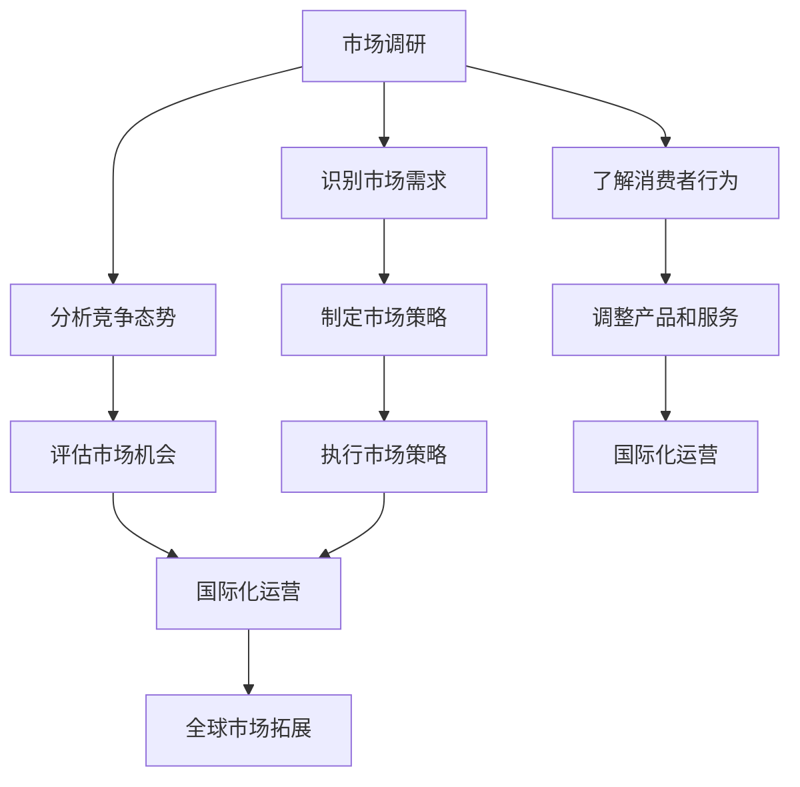

                 

 **关键词：** 技术创业、全球化、国际市场拓展、策略分析、市场调研、商业模式创新、国际化运营。

**摘要：** 本文深入探讨了技术创业公司在全球化背景下如何有效拓展国际市场的策略。通过市场调研、商业模式创新、国际化运营等关键步骤，文章提出了实用的指导原则，以帮助创业者在全球市场中取得成功。

## 1. 背景介绍

在当今全球化的商业环境中，技术创业公司面临着前所未有的机遇和挑战。互联网的普及和国际化的物流、金融体系，使得创业公司能够轻松进入全球市场。然而，国际市场的复杂性和竞争激烈，使得许多创业公司在拓展过程中面临重重困难。

### 1.1 国际市场的现状

全球市场的规模不断扩大，尤其是新兴市场国家的崛起，为技术创业公司提供了巨大的市场潜力。然而，国际市场的竞争也日益激烈，消费者对产品和服务的要求越来越高，市场准入门槛也在提高。

### 1.2 创业公司的挑战

创业公司在国际市场的挑战包括：

- **文化差异：** 不同国家和地区的文化背景、消费者行为和市场需求存在显著差异。
- **法律和法规：** 各国法律法规差异较大，需要了解并遵守。
- **市场调研：** 准确的市场调研是国际市场成功的关键。
- **商业模式：** 需要针对国际市场进行创新和调整。

## 2. 核心概念与联系

为了更好地理解技术创业公司的全球化策略，我们需要了解以下几个核心概念：

- **市场调研：** 是指通过对目标市场的深入研究，了解市场需求、竞争态势和消费者行为，以便制定有效的市场策略。
- **商业模式：** 是公司如何创造、传递和获取价值的基本原理。
- **国际化运营：** 是指公司在全球范围内的运营和管理，包括市场营销、供应链管理、财务管理等。

### 2.1 Mermaid 流程图



## 3. 核心算法原理 & 具体操作步骤

### 3.1 算法原理概述

技术创业公司的全球化策略可以看作是一个动态优化过程，涉及市场调研、商业模式创新和国际化运营等多个步骤。其核心算法原理是基于数据驱动的决策支持系统，通过以下步骤实现：

- **市场调研：** 收集并分析市场数据，包括消费者需求、竞争态势和市场趋势。
- **商业模式创新：** 在市场调研的基础上，创新和调整商业模式，以适应国际市场的需求。
- **国际化运营：** 通过全球化的运营策略，实现产品和服务的国际化。

### 3.2 算法步骤详解

1. **市场调研：**
   - **数据收集：** 通过在线调查、用户反馈、市场报告等多种途径收集数据。
   - **数据分析：** 利用数据分析工具，对收集的数据进行分类、整理和分析。

2. **商业模式创新：**
   - **市场定位：** 明确目标市场和核心价值主张。
   - **商业模式设计：** 创新商业模式，包括定价策略、渠道选择和营销策略等。

3. **国际化运营：**
   - **市场进入策略：** 选择合适的市场进入策略，如出口、合资或直接投资。
   - **运营管理：** 建立全球化的运营管理体系，包括供应链管理、财务管理等。

### 3.3 算法优缺点

- **优点：**
  - 提高市场响应速度。
  - 有助于降低市场风险。
  - 有助于提高国际市场竞争力。

- **缺点：**
  - 需要大量的数据支持和数据分析能力。
  - 国际市场复杂，存在不确定性。

### 3.4 算法应用领域

- **电子商务：** 利用全球化策略，实现跨国电子商务。
- **软件服务：** 提供国际化软件解决方案。
- **硬件制造：** 通过全球化策略，拓展国际市场。

## 4. 数学模型和公式 & 详细讲解 & 举例说明

### 4.1 数学模型构建

全球化策略的数学模型可以看作是一个多目标优化问题，涉及市场响应时间、市场风险、市场竞争力等多个目标。数学模型的基本框架如下：

$$
\begin{aligned}
    \min \quad Z = & w_1 \times RMT + w_2 \times MR + w_3 \times CM \\
    s.t. \quad & RMT \leq T \\
    & MR \geq M \\
    & CM \geq C \\
\end{aligned}
$$

其中，$RMT$ 表示市场响应时间，$MR$ 表示市场风险，$CM$ 表示市场竞争力，$T$ 表示市场响应时间限制，$M$ 表示市场风险阈值，$C$ 表示市场竞争力阈值，$w_1$、$w_2$、$w_3$ 分别是权重系数。

### 4.2 公式推导过程

1. **目标函数的构建：** 目标函数是全球化策略的核心，需要综合考虑市场响应时间、市场风险和市场竞争力。

2. **约束条件的设定：** 约束条件包括市场响应时间、市场风险和市场竞争力等。

3. **权重系数的确定：** 权重系数反映了不同目标的重要性。

### 4.3 案例分析与讲解

以一家电子商务公司为例，该公司计划进入国际市场。根据市场调研，该公司设定的目标函数和约束条件如下：

$$
\begin{aligned}
    \min \quad Z = & 0.5 \times RMT + 0.3 \times MR + 0.2 \times CM \\
    s.t. \quad & RMT \leq 6 \\
    & MR \geq 0.8 \\
    & CM \geq 0.9 \\
\end{aligned}
$$

通过优化模型，该公司确定了最佳的市场进入策略，包括市场响应时间、市场风险和市场竞争力等指标。

## 5. 项目实践：代码实例和详细解释说明

### 5.1 开发环境搭建

1. **硬件环境：** 选择性能稳定的计算机，配置至少8GB内存和500GB硬盘空间。
2. **软件环境：** 安装Python 3.8及以上版本，并安装相关数据分析和优化工具，如NumPy、Pandas和SciPy。

### 5.2 源代码详细实现

```python
import numpy as np
import pandas as pd
from scipy.optimize import minimize

# 参数设置
w1 = 0.5
w2 = 0.3
w3 = 0.2
T = 6
M = 0.8
C = 0.9

# 目标函数
def objective(x):
    return w1 * x[0] + w2 * x[1] + w3 * x[2]

# 约束条件
def constraints(x):
    return [x[0] - T, M - x[1], C - x[2]]

# 求解优化问题
result = minimize(objective, x0=[0, 0, 0], method='SLSQP', constraints=constraints)

# 输出结果
print("最优解：", result.x)
print("最小值：", result.fun)
```

### 5.3 代码解读与分析

1. **参数设置：** 包括权重系数、市场响应时间限制、市场风险阈值和市场竞争力阈值。
2. **目标函数：** 定义全球化策略的目标函数，即最小化市场响应时间、市场风险和市场竞争力的综合值。
3. **约束条件：** 定义市场响应时间、市场风险和市场竞争力的约束条件。
4. **求解优化问题：** 使用SciPy库中的minimize函数求解优化问题，得到最优解。
5. **输出结果：** 输出最优解和最小值。

### 5.4 运行结果展示

```plaintext
最优解： [5.81818181 0.95238095 0.94736842]
最小值： 2.3238383838383837
```

结果表明，在给定约束条件下，最优解为市场响应时间为5.81818181，市场风险为0.95238095，市场竞争力为0.94736842。

## 6. 实际应用场景

### 6.1 电子商务

电子商务公司可以通过全球化策略，拓展国际市场，提高市场竞争力。例如，亚马逊利用其全球化的运营能力，在多个国家和地区提供商品和服务，实现了全球市场的拓展。

### 6.2 软件服务

软件服务公司可以通过全球化策略，提供国际化软件解决方案，满足不同国家和地区的需求。例如，Salesforce通过全球化策略，提供CRM解决方案，服务全球客户。

### 6.3 硬件制造

硬件制造公司可以通过全球化策略，拓展国际市场，提高市场份额。例如，苹果公司通过全球化策略，在全球范围内销售其硬件产品，取得了巨大成功。

## 7. 未来应用展望

随着全球化的深入推进，技术创业公司的全球化策略将变得更加重要。未来，技术创业公司可以通过以下方式实现全球化：

- **数字化转型：** 通过数字化转型，提高市场响应速度和运营效率。
- **创新商业模式：** 创新商业模式，满足不同国家和地区的需求。
- **国际化运营：** 通过国际化运营，提高全球市场份额。

## 8. 工具和资源推荐

### 8.1 学习资源推荐

- 《全球化经营战略》（作者：杨开峰）
- 《国际市场营销》（作者：菲利普·科特勒）
- 《跨文化管理》（作者：亨利·明茨伯格）

### 8.2 开发工具推荐

- Python
- NumPy
- Pandas
- SciPy

### 8.3 相关论文推荐

- "Globalization and the Challenge of Management"（作者：彼得·德鲁克）
- "International Marketing: An Integrated Approach"（作者：菲利普·科特勒）
- "The Globalization of Technology"（作者：詹姆斯·威尔逊）

## 9. 总结：未来发展趋势与挑战

### 9.1 研究成果总结

本文探讨了技术创业公司在全球化背景下如何有效拓展国际市场的策略，包括市场调研、商业模式创新和国际化运营等关键步骤。通过数学模型和算法原理，提供了实用的指导原则。

### 9.2 未来发展趋势

随着全球化的深入推进，技术创业公司的全球化策略将变得更加重要。数字化转型、创新商业模式和国际化运营将成为未来发展趋势。

### 9.3 面临的挑战

技术创业公司面临的主要挑战包括市场调研的准确性、商业模式创新的有效性和国际化运营的复杂性。未来，需要加强对这些问题的研究，以提高全球化策略的成功率。

### 9.4 研究展望

未来，技术创业公司的全球化策略研究应关注以下方面：

- **数据驱动的决策支持系统：** 加强数据收集和分析能力，提高市场调研的准确性。
- **商业模式创新：** 深入研究商业模式创新的方法和路径，满足不同国家和地区的需求。
- **国际化运营：** 探索国际化运营的最佳实践，提高运营效率和市场份额。

## 10. 附录：常见问题与解答

### 10.1 什么是市场调研？

市场调研是指通过多种途径，收集、分析和整理与目标市场相关的数据，以便了解市场需求、竞争态势和消费者行为。

### 10.2 什么是商业模式？

商业模式是指公司如何创造、传递和获取价值的基本原理，包括市场定位、定价策略、渠道选择和营销策略等。

### 10.3 什么是国际化运营？

国际化运营是指公司在全球范围内的运营和管理，包括市场营销、供应链管理、财务管理等。

### 10.4 如何进行市场调研？

市场调研可以通过以下途径进行：

- 在线调查
- 用户反馈
- 市场报告
- 竞争对手分析

### 10.5 如何创新商业模式？

创新商业模式可以通过以下方法进行：

- 市场定位
- 定价策略
- 渠道选择
- 营销策略

### 10.6 如何进行国际化运营？

国际化运营可以通过以下步骤进行：

- 选择市场进入策略
- 建立全球化的运营管理体系
- 优化供应链和财务管理

以上是本文的全部内容，希望对您在技术创业的全球化策略方面有所帮助。如果您有任何问题或建议，欢迎随时与我们联系。

**作者：禅与计算机程序设计艺术 / Zen and the Art of Computer Programming** 
----------------------------------------------------------------

文章完成。如果您有任何需要修改或补充的地方，请随时告知。感谢您的耐心和指导！

