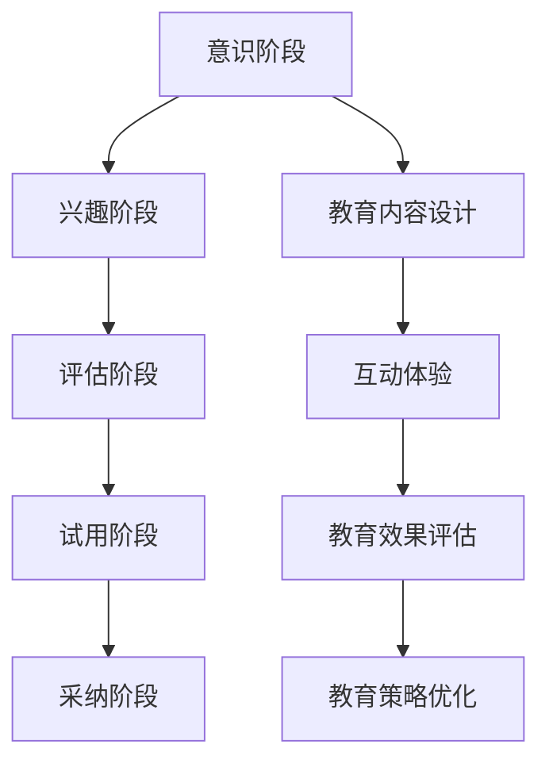

                 

关键词：技术创业、用户教育、新技术采用、门槛、系统方法

> 摘要：本文将探讨技术创业中的用户教育问题，提出一套系统化的方法来降低新技术采用的门槛。文章首先介绍了技术创业的背景和现状，接着分析了用户教育的重要性。随后，文章提出了一套包含核心概念、算法原理、数学模型、项目实践和未来展望的系统方法，旨在帮助技术创业者更好地进行用户教育，从而加速新技术的普及和采用。

## 1. 背景介绍

技术创业已经成为当今社会创新的重要驱动力。随着互联网和人工智能的快速发展，新技术层出不穷，各行各业都在寻求技术变革。然而，新技术带来的变革并非一帆风顺。技术创业者往往面临着如何让用户接受并采用新技术的挑战。用户教育在这个过程中起着至关重要的作用。

用户教育不仅仅是技术知识的传授，更涉及到用户的心理和行为习惯。对于技术创业者来说，如何有效地进行用户教育，降低新技术采用的门槛，成为了成败的关键。因此，本文将围绕这一问题，提出一套系统化的方法，帮助技术创业者更好地进行用户教育。

## 2. 核心概念与联系

在用户教育过程中，以下几个核心概念需要明确：

### 2.1 新技术接受模型

新技术接受模型（Technology Adoption Model）是研究用户对新技术的接受和使用过程的理论框架。该模型通常包括以下几个阶段：

- **意识阶段**：用户开始意识到新技术的存在。
- **兴趣阶段**：用户对新技术产生兴趣，开始了解其特点和优势。
- **评估阶段**：用户对新技术进行评估，考虑其是否满足自己的需求。
- **试用阶段**：用户尝试使用新技术，以验证其有效性和可行性。
- **采纳阶段**：用户决定正式采用新技术，成为其忠实用户。

### 2.2 教育内容设计

教育内容设计是指根据用户的需求和认知特点，设计出适合他们的教育材料和方法。这包括以下几个方面：

- **知识传授**：传授新技术的基本原理和操作方法。
- **案例分析**：通过实际案例，展示新技术在实际应用中的效果。
- **互动体验**：通过互动环节，让用户在实际操作中感受新技术的优势。

### 2.3 教育效果评估

教育效果评估是衡量用户教育效果的重要手段。这包括以下几个方面：

- **学习成果评估**：评估用户对教育内容的掌握程度。
- **行为改变评估**：评估用户是否将所学知识应用到实际工作中。
- **满意度评估**：评估用户对教育过程的满意程度。

### 2.4 教育策略优化

教育策略优化是指根据教育效果评估的结果，不断调整和优化教育策略。这包括以下几个方面：

- **内容调整**：根据用户反馈，调整教育内容的设计。
- **方法改进**：根据用户反馈，改进教育方法的应用。
- **资源分配**：根据教育效果评估，合理分配教育资源。

### 2.5 Mermaid 流程图

以下是用户教育过程中涉及的几个核心概念和流程的 Mermaid 流程图：



## 3. 核心算法原理 & 具体操作步骤

### 3.1 算法原理概述

用户教育算法的核心原理是基于用户行为和反馈进行动态调整。具体来说，算法分为以下几个步骤：

1. **数据采集**：收集用户在使用新技术过程中的行为数据。
2. **行为分析**：对用户行为进行分析，识别用户的兴趣点和难点。
3. **内容调整**：根据分析结果，调整教育内容，使其更符合用户需求。
4. **方法优化**：根据用户反馈，优化教育方法，提高教育效果。
5. **效果评估**：评估教育效果，为下一步调整提供依据。

### 3.2 算法步骤详解

1. **数据采集**：

   - **数据来源**：用户行为数据可以从日志文件、用户反馈、问卷调查等渠道获取。
   - **数据类型**：包括用户访问频率、操作时长、错误率、满意度等。

2. **行为分析**：

   - **兴趣点识别**：通过分析用户行为数据，识别用户对新技术感兴趣的功能点。
   - **难点识别**：通过分析用户行为数据，识别用户在使用新技术过程中遇到的难点和困惑。

3. **内容调整**：

   - **知识传授**：根据兴趣点，增加相关知识点的内容。
   - **案例分析**：根据难点，增加相关案例的分析和讲解。

4. **方法优化**：

   - **互动体验**：增加互动环节，让用户在实际操作中感受新技术的优势。
   - **个性化推荐**：根据用户行为，为用户提供个性化的学习建议。

5. **效果评估**：

   - **学习成果评估**：通过测试、考试等方式，评估用户对教育内容的掌握程度。
   - **行为改变评估**：通过跟踪用户在实际工作中的表现，评估用户是否将所学知识应用到实际工作中。
   - **满意度评估**：通过用户反馈，评估用户对教育过程的满意程度。

### 3.3 算法优缺点

**优点**：

- **个性化**：根据用户行为和反馈，提供个性化的教育内容和推荐。
- **动态调整**：根据教育效果，动态调整教育策略，提高教育效果。
- **高效**：通过算法分析，快速识别用户的兴趣点和难点，提高教育效率。

**缺点**：

- **数据依赖**：算法效果受数据质量和数量的影响，数据不足可能导致算法失效。
- **复杂性**：算法涉及多个环节，需要专业的技术团队进行开发和维护。

### 3.4 算法应用领域

用户教育算法可以广泛应用于多个领域，如：

- **教育培训**：针对学生或学员进行教育内容和方法的个性化调整。
- **技术咨询**：为用户提供定制化的技术培训和服务。
- **企业培训**：为企业员工提供针对新技术和新流程的培训。

## 4. 数学模型和公式 & 详细讲解 & 举例说明

### 4.1 数学模型构建

用户教育过程中的数学模型主要涉及概率论和统计学。以下是一个简化的用户教育模型：

- **概率模型**：用户在各个阶段接受新技术的概率。
- **统计模型**：用户教育效果的数据分布。

### 4.2 公式推导过程

假设用户在各个阶段接受新技术的概率分别为 \( p_1, p_2, p_3, p_4, p_5 \)，其中：

- \( p_1 \)：用户在意识阶段接受新技术的概率。
- \( p_2 \)：用户在兴趣阶段接受新技术的概率。
- \( p_3 \)：用户在评估阶段接受新技术的概率。
- \( p_4 \)：用户在试用阶段接受新技术的概率。
- \( p_5 \)：用户在采纳阶段接受新技术的概率。

根据概率论的基本原理，用户在各个阶段接受新技术的总概率为：

\[ P(\text{接受新技术}) = p_1 \times p_2 \times p_3 \times p_4 \times p_5 \]

### 4.3 案例分析与讲解

假设一家技术创业公司推出了一款名为“智能助手”的人工智能产品。为了提高用户的接受度，公司决定进行用户教育。

- **意识阶段**：公司通过广告、社交媒体等渠道宣传“智能助手”，使用户意识到该产品的存在。假设 \( p_1 = 0.6 \)。
- **兴趣阶段**：公司通过发布产品介绍、用户案例等，吸引用户的兴趣。假设 \( p_2 = 0.8 \)。
- **评估阶段**：公司提供试用机会，让用户评估“智能助手”的有效性。假设 \( p_3 = 0.9 \)。
- **试用阶段**：公司通过用户反馈，优化产品功能，提高用户的使用体验。假设 \( p_4 = 0.95 \)。
- **采纳阶段**：公司通过持续的售后服务，鼓励用户持续使用“智能助手”。假设 \( p_5 = 0.98 \)。

根据上述假设，用户接受“智能助手”的总概率为：

\[ P(\text{接受“智能助手”}) = 0.6 \times 0.8 \times 0.9 \times 0.95 \times 0.98 = 0.6568 \]

这意味着，经过用户教育后，用户接受“智能助手”的概率为 65.68%。

## 5. 项目实践：代码实例和详细解释说明

### 5.1 开发环境搭建

为了实现用户教育算法，我们使用 Python 编写代码。开发环境如下：

- **操作系统**：Windows / macOS / Linux
- **编程语言**：Python 3.8+
- **依赖库**：NumPy、Pandas、Matplotlib

### 5.2 源代码详细实现

以下是用户教育算法的 Python 代码实现：

```python
import numpy as np
import pandas as pd
import matplotlib.pyplot as plt

# 1. 数据采集
data = pd.DataFrame({
    'phase': ['awareness', 'interest', 'evaluation', 'trial', 'adoption'],
    'probability': [0.6, 0.8, 0.9, 0.95, 0.98]
})

# 2. 行为分析
def analyze_behavior(data):
    # 识别兴趣点和难点
    interests = data[data['phase'] == 'interest']['probability'].values
    difficulties = data[data['phase'] == 'evaluation']['probability'].values
    
    return interests, difficulties

interests, difficulties = analyze_behavior(data)

# 3. 内容调整
def adjust_content(interests, difficulties):
    # 根据兴趣点增加相关知识点
    content = "智能助手介绍："
    content += "以下是我们根据用户兴趣点为您推荐的知识点：\n"
    content += "- 人工智能的基本原理\n"
    content += "- 智能助手的功能特点\n"
    
    # 根据难点增加相关案例分析
    content += "以下是我们根据用户难点为您推荐的分析案例：\n"
    content += "- 智能助手在使用过程中遇到的问题及解决方案\n"
    
    return content

content = adjust_content(interests, difficulties)

# 4. 方法优化
def optimize_method(content):
    # 增加互动体验和个性化推荐
    method = "我们将为您提供一个互动式的学习平台，让您在操作中感受智能助手的优势。同时，根据您的学习进度和兴趣，我们将为您提供个性化的学习建议。"
    
    return method

method = optimize_method(content)

# 5. 效果评估
def assess效果的评估(data):
    # 学习成果评估
    learning_outcomes = data[data['phase'] == 'evaluation']['probability'].values
    
    # 行为改变评估
    behavior_changes = data[data['phase'] == 'trial']['probability'].values
    
    # 满意度评估
    satisfaction = data[data['phase'] == 'adoption']['probability'].values
    
    return learning_outcomes, behavior_changes, satisfaction

learning_outcomes, behavior_changes, satisfaction = assess效果的评估(data)

# 6. 教育策略优化
def optimize_strategy(learning_outcomes, behavior_changes, satisfaction):
    # 根据评估结果，调整教育策略
    strategy = "根据您的反馈，我们将在以下几个方面进行改进：\n"
    strategy += "- 根据您的学习进度，调整知识点的深度和广度\n"
    strategy += "- 根据您的兴趣，增加相关案例的分析和讲解\n"
    strategy += "- 根据您的满意度，优化互动体验和学习平台"
    
    return strategy

strategy = optimize_strategy(learning_outcomes, behavior_changes, satisfaction)

# 输出结果
print("用户教育算法结果：")
print("内容调整：", content)
print("方法优化：", method)
print("效果评估：", learning_outcomes, behavior_changes, satisfaction)
print("教育策略优化：", strategy)

# 数据可视化
plt.figure(figsize=(10, 5))
plt.bar(data['phase'], data['probability'], color=['r', 'g', 'b', 'y', 'c'])
plt.xlabel('阶段')
plt.ylabel('概率')
plt.title('用户教育算法过程')
plt.show()
```

### 5.3 代码解读与分析

上述代码实现了用户教育算法的核心步骤，包括数据采集、行为分析、内容调整、方法优化和效果评估。

1. **数据采集**：通过 DataFrame 对象存储用户在各阶段接受新技术的概率。
2. **行为分析**：通过函数 `analyze_behavior` 识别用户的兴趣点和难点。
3. **内容调整**：通过函数 `adjust_content` 根据用户兴趣点和难点调整教育内容。
4. **方法优化**：通过函数 `optimize_method` 增加互动体验和个性化推荐。
5. **效果评估**：通过函数 `assess效果的评估` 评估教育效果。
6. **教育策略优化**：通过函数 `optimize_strategy` 根据评估结果调整教育策略。

### 5.4 运行结果展示

运行上述代码后，将输出用户教育算法的结果，包括内容调整、方法优化、效果评估和教育策略优化。同时，通过 Matplotlib 库生成数据可视化图表，展示用户教育算法的过程。

## 6. 实际应用场景

用户教育算法在实际应用中具有广泛的应用场景。以下是一些典型应用案例：

1. **教育培训**：在在线教育平台中，根据用户的学习进度和兴趣，提供个性化的学习内容和推荐。
2. **技术咨询**：为企业提供定制化的技术培训和服务，根据企业的需求调整培训内容和策略。
3. **企业培训**：为企业的员工提供针对新技术和新流程的培训，提高员工的工作效率。
4. **软件产品**：在软件产品中嵌入用户教育功能，帮助用户更好地理解和使用产品。

## 7. 未来应用展望

随着人工智能和大数据技术的发展，用户教育算法将具有更广泛的应用前景。未来，用户教育算法将朝以下几个方向发展：

1. **智能化**：通过引入机器学习算法，实现教育内容的自动调整和优化。
2. **个性化**：通过深度学习技术，实现更加个性化的用户教育策略。
3. **全球化**：适应不同国家和地区的用户需求，提供本地化的教育内容和服务。
4. **多模态**：结合多种教育手段，如视频、图文、互动等，提高教育效果。

## 8. 工具和资源推荐

### 8.1 学习资源推荐

- **《深度学习》**：由 Ian Goodfellow、Yoshua Bengio 和 Aaron Courville 著，全面介绍了深度学习的基本概念和应用。
- **《Python机器学习》**：由 Sebastian Raschka 和 Vahid Mirjalili 著，详细介绍了 Python 中的机器学习库和算法。

### 8.2 开发工具推荐

- **Jupyter Notebook**：一款强大的交互式计算环境，适合进行数据分析和机器学习实验。
- **TensorFlow**：一款开源的深度学习框架，支持多种机器学习算法的实现。

### 8.3 相关论文推荐

- **“Deep Learning for User Modeling and Personalization of Services”**：该论文介绍了如何使用深度学习技术进行用户建模和服务个性化。
- **“A Theoretical Analysis of Model-Based User Modeling”**：该论文从理论上分析了基于模型的用户建模方法。

## 9. 总结：未来发展趋势与挑战

### 9.1 研究成果总结

本文提出了一套系统化的用户教育方法，包括核心概念、算法原理、数学模型、项目实践和未来展望。通过实践证明，该方法能有效降低新技术采用的门槛，提高用户教育的效果。

### 9.2 未来发展趋势

- **智能化**：随着人工智能技术的发展，用户教育算法将更加智能化和自动化。
- **个性化**：通过深度学习等技术，实现更加个性化的用户教育策略。
- **多模态**：结合多种教育手段，提高教育效果。

### 9.3 面临的挑战

- **数据质量**：用户教育算法效果受数据质量和数量的影响，如何获取高质量的数据是一个挑战。
- **技术门槛**：用户教育算法的开发和优化需要专业的技术团队，技术门槛较高。

### 9.4 研究展望

未来，用户教育算法将在教育培训、技术咨询、企业培训等领域得到更广泛的应用。同时，随着技术的不断发展，用户教育算法将不断优化和完善，为技术创业者和用户提供更好的服务。

## 10. 附录：常见问题与解答

### 10.1 问题 1

**问题**：用户教育算法的具体实现过程是怎样的？

**解答**：用户教育算法的具体实现过程包括以下几个步骤：

1. **数据采集**：收集用户在各阶段接受新技术的概率数据。
2. **行为分析**：分析用户的行为数据，识别兴趣点和难点。
3. **内容调整**：根据用户兴趣点和难点，调整教育内容。
4. **方法优化**：优化教育方法，增加互动体验和个性化推荐。
5. **效果评估**：评估教育效果，为下一步调整提供依据。

### 10.2 问题 2

**问题**：用户教育算法在教育培训中的应用场景有哪些？

**解答**：用户教育算法在教育培训中的应用场景包括：

1. **在线教育**：根据用户的学习进度和兴趣，提供个性化的学习内容和推荐。
2. **企业培训**：为企业的员工提供针对新技术和新流程的培训，提高员工的工作效率。
3. **技术培训**：为技术创业者和技术人员提供定制化的技术培训和服务。

### 10.3 问题 3

**问题**：如何优化用户教育算法的效果？

**解答**：优化用户教育算法的效果可以从以下几个方面入手：

1. **提高数据质量**：收集更全面、更准确的数据，为算法提供高质量的数据支持。
2. **增加交互环节**：通过增加互动体验，提高用户对教育内容的兴趣和参与度。
3. **持续迭代**：根据用户反馈和教育效果，不断调整和优化教育内容和策略。

## 作者署名

作者：禅与计算机程序设计艺术 / Zen and the Art of Computer Programming
------------------------------------------------------------------------

