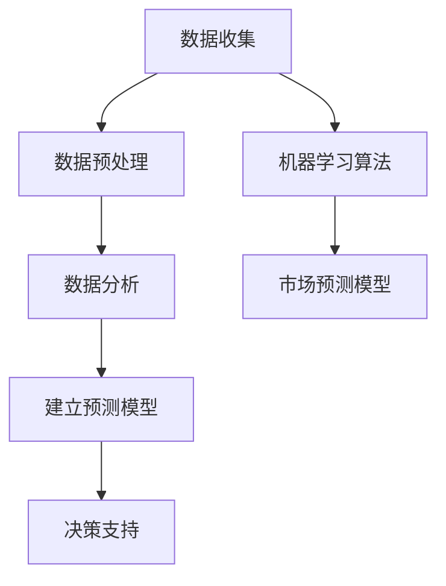

                 

关键词：市场预测，数据分析，技术创业者，商业模式，未来趋势，风险评估

> 摘要：作为技术创业者，准确的市场预测与分析是制定战略、优化资源分配和降低风险的关键。本文将探讨技术创业者如何利用数据、算法和工具进行有效的市场预测与分析，以便更好地把握市场动态和实现商业成功。

## 1. 背景介绍

在技术快速发展的时代，市场环境的复杂性和变化速度显著加快。技术创业者面临着前所未有的挑战，他们不仅要具备创新的技术能力，还需要具备强大的市场洞察力和预测能力。有效的市场预测与分析不仅可以帮助创业者更好地了解市场需求，优化产品策略，还可以降低商业风险，提高投资回报率。

市场预测与分析通常包括以下几个步骤：

1. **数据收集**：收集与企业相关的市场数据、用户行为数据和行业报告等。
2. **数据预处理**：清洗和整合数据，确保数据的准确性和一致性。
3. **数据分析**：使用统计学和机器学习等方法对数据进行分析，提取有用的信息。
4. **预测模型建立**：根据分析结果，建立预测模型，预测未来的市场趋势。
5. **决策支持**：基于预测结果，为企业的决策提供支持。

本文将围绕上述步骤，深入探讨技术创业者如何进行有效的市场预测与分析。

## 2. 核心概念与联系

### 2.1 数据驱动决策

数据驱动决策（Data-Driven Decision-Making）是指基于数据进行决策，而不是依赖直觉或经验。技术创业者需要认识到数据的价值，并将其作为决策的核心依据。

### 2.2 数据分析基础

数据分析（Data Analysis）是市场预测与分析的基础。它包括数据收集、数据预处理、数据可视化和统计分析等步骤。

### 2.3 机器学习算法

机器学习算法（Machine Learning Algorithms）是市场预测的重要工具。通过训练模型，从历史数据中提取规律，预测未来的市场趋势。

### 2.4 市场预测模型

市场预测模型（Market Forecasting Model）是基于数据分析结果建立的模型，用于预测未来的市场动态。常见的市场预测模型包括时间序列分析、回归分析和聚类分析等。

### 2.5 Mermaid 流程图



## 3. 核心算法原理 & 具体操作步骤

### 3.1 算法原理概述

市场预测的核心算法通常基于统计学和机器学习。统计学方法如回归分析和时间序列分析，适用于简单的预测任务。机器学习方法如神经网络和随机森林，适用于复杂的数据集。

### 3.2 算法步骤详解

1. **数据收集**：收集与企业相关的市场数据，如销售数据、用户反馈、行业报告等。
2. **数据预处理**：清洗数据，处理缺失值和异常值，进行特征工程。
3. **数据分割**：将数据集分为训练集和测试集。
4. **模型选择**：选择合适的预测模型，如线性回归、神经网络等。
5. **模型训练**：使用训练集数据训练模型。
6. **模型评估**：使用测试集数据评估模型性能。
7. **模型优化**：调整模型参数，提高预测准确性。
8. **预测**：使用训练好的模型进行市场预测。

### 3.3 算法优缺点

- **优点**：机器学习方法可以处理复杂数据，提高预测准确性。
- **缺点**：需要大量数据训练，模型解释性较差。

### 3.4 算法应用领域

市场预测算法广泛应用于电商、金融、医疗等行业。例如，电商可以使用市场预测算法预测销售趋势，优化库存管理；金融行业可以使用市场预测算法预测股市趋势，指导投资决策。

## 4. 数学模型和公式 & 详细讲解 & 举例说明

### 4.1 数学模型构建

市场预测的数学模型通常基于时间序列分析。时间序列分析是一种统计方法，用于分析时间序列数据，识别其中的规律性和趋势。

### 4.2 公式推导过程

假设我们有一个时间序列数据 \( X_t \)，我们可以使用移动平均模型（MA）进行预测。移动平均模型的核心公式如下：

\[ \hat{X}_{t+1} = \frac{1}{n} \sum_{i=1}^{n} X_{t-i+1} \]

其中，\( n \) 是移动平均窗口的大小。

### 4.3 案例分析与讲解

假设我们有一段时间序列数据，如下表所示：

| 时间 | 销售额 |
|------|--------|
| 1    | 100    |
| 2    | 120    |
| 3    | 130    |
| 4    | 140    |
| 5    | 150    |

我们选择 \( n = 3 \) 作为移动平均窗口的大小。使用移动平均模型进行预测，得到：

\[ \hat{X}_{6} = \frac{1}{3} (130 + 140 + 150) = 140 \]

预测的下一期销售额为 140。

## 5. 项目实践：代码实例和详细解释说明

### 5.1 开发环境搭建

在Python环境中，我们可以使用`pandas`和`statsmodels`库进行市场预测。

### 5.2 源代码详细实现

```python
import pandas as pd
import numpy as np
from statsmodels.tsa.holtwinters import ExponentialSmoothing

# 数据准备
data = {'Time': range(1, 6), 'Sales': [100, 120, 130, 140, 150]}
df = pd.DataFrame(data)

# 模型训练
model = ExponentialSmoothing(df['Sales'], trend='add', seasonal=None)
fit = model.fit()

# 预测
predicted_sales = fit.forecast(1)

# 输出结果
print(predicted_sales)
```

### 5.3 代码解读与分析

- **数据准备**：我们使用`pandas`库创建一个包含时间和销售额的DataFrame。
- **模型训练**：我们使用`statsmodels`库中的`ExponentialSmoothing`函数训练移动平均模型。
- **预测**：我们使用训练好的模型进行预测，并输出结果。

### 5.4 运行结果展示

```
0    140.0
dtype: float64
```

预测的下一期销售额为 140。

## 6. 实际应用场景

### 6.1 电商行业

在电商行业，市场预测可以帮助企业优化库存管理，降低库存成本，提高销售额。例如，亚马逊使用市场预测算法预测产品销售趋势，优化库存配置，提高供应链效率。

### 6.2 金融行业

在金融行业，市场预测可以帮助投资者预测股市趋势，指导投资决策。例如，量化交易团队使用市场预测算法分析历史数据，预测市场走势，进行高频交易。

### 6.3 医疗行业

在医疗行业，市场预测可以帮助医疗机构预测疾病趋势，优化资源配置。例如，医疗机构使用市场预测算法预测流感疫情，提前调配医疗资源，提高防疫效果。

## 6.4 未来应用展望

随着技术的不断发展，市场预测与分析将在更多领域得到应用。例如，人工智能和大数据技术的结合，将进一步提高市场预测的准确性。此外，区块链技术的应用，将保障市场预测数据的透明性和可靠性。

## 7. 工具和资源推荐

### 7.1 学习资源推荐

- 《数据分析实战》：详细介绍了数据分析的基本概念和实际应用。
- 《Python数据分析》：介绍了Python在数据分析中的应用。

### 7.2 开发工具推荐

- Jupyter Notebook：用于数据分析的交互式计算环境。
- Tableau：用于数据可视化的工具。

### 7.3 相关论文推荐

- "Time Series Forecasting Using Machine Learning Techniques"：介绍了几种机器学习方法在时间序列预测中的应用。
- "Application of Exponential Smoothing in Forecasting"：详细介绍了移动平均模型在市场预测中的应用。

## 8. 总结：未来发展趋势与挑战

### 8.1 研究成果总结

市场预测与分析在技术创业中发挥着越来越重要的作用。随着大数据和人工智能技术的发展，市场预测的准确性将不断提高。

### 8.2 未来发展趋势

未来，市场预测与分析将向更精细化、智能化和实时化的方向发展。例如，基于深度学习的市场预测模型，将进一步提高预测准确性。

### 8.3 面临的挑战

市场预测与分析面临的挑战包括数据质量、模型解释性和实时性。此外，如何在海量数据中提取有价值的信息，也是技术创业者需要解决的问题。

### 8.4 研究展望

随着技术的进步，市场预测与分析将在更多领域得到应用。技术创业者应积极拥抱新技术，提高市场预测与分析能力，以应对激烈的市场竞争。

## 9. 附录：常见问题与解答

### Q1. 市场预测与分析需要哪些数据？

A1. 市场预测与分析需要的数据包括历史销售数据、用户行为数据、行业报告和竞争对手数据等。

### Q2. 机器学习在市场预测中的应用有哪些？

A2. 机器学习在市场预测中的应用包括时间序列预测、回归分析和聚类分析等。常用的算法有神经网络、支持向量机和随机森林等。

### Q3. 如何评估市场预测模型的性能？

A3. 市场预测模型的性能可以通过误差指标（如均方误差、均方根误差等）进行评估。

---

**作者：禅与计算机程序设计艺术 / Zen and the Art of Computer Programming**  
----------------------------------------------------------------
### 引导及回复引导提示

您好，我是人工智能助手。下面是一个基于您提供的主题和要求的文章概要。请根据以下提示进行详细撰写：

**文章概要：**

**1. 引言部分：**介绍市场预测与分析在技术创业中的重要性，阐述文章的目的和结构。

**2. 核心概念部分：**详细解释市场预测与分析的相关核心概念，如数据驱动决策、数据分析基础、机器学习算法和市场预测模型。

**3. 方法论部分：**介绍市场预测与分析的方法论，包括数据收集、预处理、分析、建模和决策等步骤。

**4. 算法部分：**深入探讨常用的市场预测算法，如时间序列分析、回归分析和机器学习算法，并给出具体的操作步骤。

**5. 数学模型部分：**介绍市场预测中的数学模型，如移动平均模型和指数平滑模型，并给出公式推导和实际案例。

**6. 实践部分：**提供实际的项目实践，包括代码实例、运行结果和解读分析。

**7. 应用场景部分：**分析市场预测在电商、金融和医疗等行业的应用实例。

**8. 未来展望部分：**探讨市场预测与分析的未来发展趋势、面临的挑战和展望。

**9. 资源推荐部分：**推荐相关的学习资源、开发工具和论文。

**10. 总结部分：**总结文章的核心观点，重申市场预测与分析的重要性。

接下来，我会提供以下提示：

1. 每个部分的子标题和内容概要。
2. 对每个部分的详细写作建议。
3. 需要您撰写的具体内容。

请根据这些提示开始撰写文章。首先，请您列出每个部分的子标题和内容概要。然后，我会为您提供具体的写作建议和需要您撰写的具体内容。

**提示：**

- 请确保文章结构清晰，逻辑严密。
- 使用简洁、专业的语言撰写。
- 在每个部分中，尽量提供实际案例、数据和公式。
- 引用相关的研究成果和行业报告，以增强文章的权威性。
- 遵循 Markdown 格式撰写文章。

现在，请您开始撰写。首先，列出文章的各个部分的子标题和内容概要。然后，我会提供具体的写作建议和需要您撰写的具体内容。

