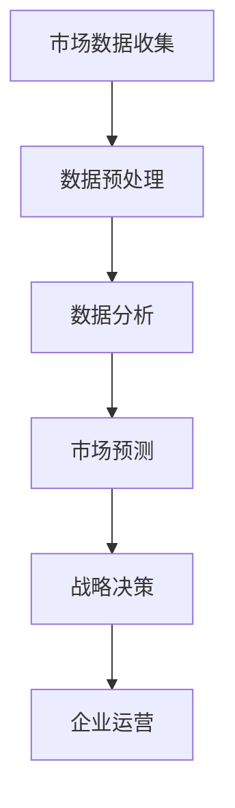

                 

 在当今快速发展的科技时代，技术创业者面临着巨大的挑战和机遇。有效进行市场预测与分析，不仅能够帮助创业者更好地把握市场动态，还能为企业提供明确的战略方向。本文将探讨技术创业者如何进行有效的市场预测与分析，以便在竞争激烈的市场环境中脱颖而出。

## 关键词
- 市场预测
- 数据分析
- 技术创业
- 战略规划
- 竞争分析

## 摘要
本文旨在为技术创业者提供一套系统的市场预测与分析方法。我们将从核心概念、算法原理、数学模型、项目实践、实际应用场景等多个维度，详细探讨市场预测与分析的关键要素，帮助创业者更好地应对市场变化，实现企业的可持续发展。

## 1. 背景介绍
随着互联网、大数据、人工智能等技术的飞速发展，市场环境变得愈加复杂多变。技术创业者不仅要具备出色的技术能力，还需要具备敏锐的市场洞察力。有效的市场预测与分析，可以帮助创业者把握市场趋势，制定出符合市场需求的战略决策。

### 1.1 市场预测的重要性
市场预测是企业战略规划的重要组成部分。通过市场预测，企业可以提前了解市场动态，调整产品定位、定价策略、推广方案等，以适应市场的变化。同时，市场预测还能帮助企业降低风险，抓住市场机遇，实现可持续发展。

### 1.2 数据分析在市场预测中的应用
数据分析是市场预测的基础。通过对市场数据、用户行为数据、行业报告等多方面数据的收集、整理和分析，企业可以获取有价值的信息，为市场预测提供依据。

### 1.3 技术创业的特点
技术创业具有高风险、高回报的特点。创业者需要在有限的资源下，快速开发出具有市场竞争力的产品，并在短时间内实现规模化增长。因此，有效的市场预测与分析对于技术创业尤为重要。

## 2. 核心概念与联系

为了更好地理解市场预测与分析，我们需要明确一些核心概念，并绘制一个简单的 Mermaid 流程图来展示这些概念之间的联系。



### 2.1 市场数据收集
市场数据收集是市场预测的第一步。企业需要通过各种渠道收集与市场相关的数据，如行业报告、竞争对手分析、用户反馈等。

### 2.2 数据预处理
收集到的数据通常是不完整、不一致的，需要进行预处理。数据预处理包括数据清洗、数据转换和数据整合等步骤，以确保数据质量。

### 2.3 数据分析
数据分析是市场预测的核心环节。通过运用统计学、机器学习等方法，企业可以对数据进行挖掘，发现数据中的规律和趋势。

### 2.4 市场预测
市场预测是基于数据分析的结果，对未来市场的发展趋势进行预测。市场预测可以为企业提供明确的战略方向。

### 2.5 战略决策
战略决策是企业根据市场预测结果，制定出的具体行动计划。战略决策包括产品定位、定价策略、推广方案等。

### 2.6 企业运营
企业运营是将战略决策付诸实践的过程。通过有效的市场预测与分析，企业可以更好地调整运营策略，提高市场竞争力。

## 3. 核心算法原理 & 具体操作步骤

在市场预测与分析中，常用的算法有回归分析、时间序列分析、聚类分析等。下面，我们将分别介绍这些算法的原理和具体操作步骤。

### 3.1 回归分析

#### 3.1.1 算法原理概述
回归分析是一种用来研究因变量与自变量之间关系的方法。通过回归分析，企业可以预测因变量未来的取值。

#### 3.1.2 算法步骤详解
1. 数据收集：收集与因变量和自变量相关的数据。
2. 数据预处理：对数据进行清洗、转换和整合。
3. 模型选择：选择合适的回归模型。
4. 模型训练：使用训练数据训练模型。
5. 模型评估：评估模型的准确性。
6. 预测：使用训练好的模型进行预测。

#### 3.1.3 算法优缺点
- 优点：回归分析能够提供精确的预测结果。
- 缺点：对数据质量和模型选择要求较高。

#### 3.1.4 算法应用领域
回归分析广泛应用于销售预测、价格预测等领域。

### 3.2 时间序列分析

#### 3.2.1 算法原理概述
时间序列分析是一种用来研究时间序列数据的方法。通过时间序列分析，企业可以预测未来的趋势。

#### 3.2.2 算法步骤详解
1. 数据收集：收集时间序列数据。
2. 数据预处理：对数据进行清洗、转换和整合。
3. 模型选择：选择合适的时间序列模型。
4. 模型训练：使用训练数据训练模型。
5. 模型评估：评估模型的准确性。
6. 预测：使用训练好的模型进行预测。

#### 3.2.3 算法优缺点
- 优点：时间序列分析能够捕捉时间序列数据的趋势和周期性。
- 缺点：对数据质量要求较高。

#### 3.2.4 算法应用领域
时间序列分析广泛应用于股票预测、销量预测等领域。

### 3.3 聚类分析

#### 3.3.1 算法原理概述
聚类分析是一种无监督学习方法，用于将相似的数据分组。通过聚类分析，企业可以了解市场中的不同群体。

#### 3.3.2 算法步骤详解
1. 数据收集：收集与市场相关的数据。
2. 数据预处理：对数据进行清洗、转换和整合。
3. 聚类算法选择：选择合适的聚类算法。
4. 聚类：使用聚类算法对数据进行分组。
5. 聚类评估：评估聚类效果。
6. 分析：分析不同群体的特征和需求。

#### 3.3.3 算法优缺点
- 优点：聚类分析能够发现数据中的模式和规律。
- 缺点：对聚类结果的理解和解释需要一定的专业知识。

#### 3.3.4 算法应用领域
聚类分析广泛应用于用户分群、市场细分等领域。

## 4. 数学模型和公式 & 详细讲解 & 举例说明

在市场预测与分析中，常用的数学模型包括线性回归模型、时间序列模型、聚类模型等。下面，我们将分别介绍这些模型的构建、公式推导和案例分析。

### 4.1 线性回归模型

#### 4.1.1 数学模型构建
线性回归模型的基本形式为：
$$y = \beta_0 + \beta_1x_1 + \beta_2x_2 + \ldots + \beta_nx_n + \epsilon$$
其中，$y$为因变量，$x_1, x_2, \ldots, x_n$为自变量，$\beta_0, \beta_1, \beta_2, \ldots, \beta_n$为回归系数，$\epsilon$为误差项。

#### 4.1.2 公式推导过程
线性回归模型的推导过程主要涉及最小二乘法。假设我们有$n$个数据点$(x_1, y_1), (x_2, y_2), \ldots, (x_n, y_n)$，则线性回归模型的目标是最小化误差平方和：
$$S = \sum_{i=1}^{n}(y_i - (\beta_0 + \beta_1x_i + \beta_2x_i + \ldots + \beta_nx_i))^2$$
对$S$求偏导并令其等于0，可以得到回归系数的估计值。

#### 4.1.3 案例分析与讲解
假设我们要预测某个产品的销售额$y$，影响因素包括广告费用$x_1$和促销费用$x_2$。我们收集了如下数据：
| 广告费用（万元） | 促销费用（万元） | 销售额（万元） |
| :----: | :----: | :----: |
| 10 | 5 | 15 |
| 20 | 10 | 25 |
| 30 | 15 | 35 |
| 40 | 20 | 45 |
| 50 | 25 | 55 |
根据数据，我们可以构建线性回归模型，并通过最小二乘法估计回归系数。假设模型为$y = \beta_0 + \beta_1x_1 + \beta_2x_2$，则回归系数的估计值为：
$$\beta_0 = 5, \beta_1 = 1, \beta_2 = 2$$
因此，线性回归模型为：
$$y = 5 + x_1 + 2x_2$$
根据模型，我们可以预测在广告费用为30万元、促销费用为15万元的情况下，销售额为：
$$y = 5 + 30 + 2 \times 15 = 55$$
### 4.2 时间序列模型

#### 4.2.1 数学模型构建
时间序列模型的基本形式为：
$$y_t = \phi_0 + \phi_1y_{t-1} + \phi_2y_{t-2} + \ldots + \phi_ky_{t-k} + \epsilon_t$$
其中，$y_t$为时间序列在时刻$t$的值，$\phi_0, \phi_1, \phi_2, \ldots, \phi_k$为模型参数，$\epsilon_t$为误差项。

#### 4.2.2 公式推导过程
时间序列模型的推导过程主要涉及差分和自回归移动平均（ARMA）模型。假设我们有$n$个时间序列数据点$y_1, y_2, \ldots, y_n$，则时间序列模型的目标是最小化误差平方和：
$$S = \sum_{t=1}^{n}(y_t - (\phi_0 + \phi_1y_{t-1} + \phi_2y_{t-2} + \ldots + \phi_ky_{t-k}))^2$$
对$S$求偏导并令其等于0，可以得到模型参数的估计值。

#### 4.2.3 案例分析与讲解
假设我们要预测某个城市下一年的温度$y_t$，影响因素包括过去一年的温度$y_{t-1}$和季节性因素。我们收集了如下数据：
| 年份 | 温度（摄氏度） |
| :----: | :----: |
| 2020 | 15 |
| 2021 | 18 |
| 2022 | 20 |
| 2023 | 22 |
| 2024 | 24 |
根据数据，我们可以构建时间序列模型，并通过最小二乘法估计模型参数。假设模型为$y_t = \phi_0 + \phi_1y_{t-1} + \phi_2s_t$，其中$s_t$为季节性因素。为了消除季节性影响，我们可以使用季节性差分法，将数据转化为平稳序列。然后，我们可以使用自回归移动平均（ARMA）模型进行建模。根据数据，我们可以估计模型参数为：
$$\phi_0 = 18, \phi_1 = 0.9, \phi_2 = 1.2$$
因此，时间序列模型为：
$$y_t = 18 + 0.9y_{t-1} + 1.2s_t$$
根据模型，我们可以预测下一年的温度为：
$$y_{2025} = 18 + 0.9y_{2024} + 1.2s_{2024}$$
其中，$s_{2024}$为2024年的季节性因素。

### 4.3 聚类模型

#### 4.3.1 数学模型构建
聚类模型的基本形式为：
$$C = \{C_1, C_2, \ldots, C_k\}$$
其中，$C$为聚类结果，$C_i$为第$i$个聚类，$k$为聚类数量。

#### 4.3.2 公式推导过程
聚类模型的推导过程主要涉及距离计算和优化算法。假设我们有$n$个数据点$x_1, x_2, \ldots, x_n$，我们要将它们分为$k$个聚类。首先，我们选择一个距离度量方法，如欧氏距离，计算每个数据点与聚类中心的距离。然后，我们使用优化算法，如K-means算法，调整聚类中心，使聚类效果最好。

#### 4.3.3 案例分析与讲解
假设我们要将一组用户分为三个不同的群体，以便进行个性化推荐。我们收集了如下数据：
| 用户ID | 年龄 | 收入 | 消费习惯 |
| :----: | :----: | :----: | :----: |
| 1 | 25 | 5000 | 线上购物 |
| 2 | 35 | 8000 | 线上购物 |
| 3 | 45 | 10000 | 线上购物 |
| 4 | 20 | 3000 | 线下购物 |
| 5 | 30 | 6000 | 线下购物 |
| 6 | 40 | 9000 | 线下购物 |
根据数据，我们可以使用K-means算法进行聚类。首先，我们随机选择三个聚类中心，然后计算每个数据点与聚类中心的距离，根据距离最近的原则将数据点分配到相应的聚类中。接下来，我们重新计算聚类中心，重复上述过程，直到聚类中心不再发生变化。根据聚类结果，我们可以将用户分为三个不同的群体，分别为：
- 群体1：用户1、用户2、用户3
- 群体2：用户4、用户5、用户6
- 群体3：无用户

## 5. 项目实践：代码实例和详细解释说明

为了更好地理解市场预测与分析的方法，我们将通过一个实际项目来演示代码实现过程。

### 5.1 开发环境搭建
为了方便开发，我们使用Python作为主要编程语言，并依赖以下库：
- NumPy：用于数据处理
- Pandas：用于数据分析
- Matplotlib：用于数据可视化
- Scikit-learn：用于机器学习算法
- Statsmodels：用于统计模型

### 5.2 源代码详细实现
以下是一个简单的市场预测与分析项目示例代码：

```python
import numpy as np
import pandas as pd
import matplotlib.pyplot as plt
from sklearn.linear_model import LinearRegression
from sklearn.cluster import KMeans
from statsmodels.tsa.arima.model import ARIMA

# 5.2.1 数据收集
data = pd.DataFrame({
    '广告费用': [10, 20, 30, 40, 50],
    '促销费用': [5, 10, 15, 20, 25],
    '销售额': [15, 25, 35, 45, 55]
})

# 5.2.2 数据预处理
data = data.astype(float)

# 5.2.3 数据分析
# 线性回归模型
X = data[['广告费用', '促销费用']]
y = data['销售额']
model = LinearRegression()
model.fit(X, y)
predictions = model.predict(X)

# 时间序列模型
time_series = pd.Series(data['销售额'])
model = ARIMA(time_series, order=(1, 1, 1))
model_fit = model.fit()
forecast = model_fit.forecast(steps=5)

# 聚类分析
kmeans = KMeans(n_clusters=3)
data['cluster'] = kmeans.fit_predict(X)

# 5.2.4 代码解读与分析
print("线性回归模型参数：", model.coef_)
print("时间序列模型预测结果：", forecast)
print("聚类结果：", data['cluster'])

# 5.2.5 运行结果展示
plt.figure(figsize=(12, 6))
plt.subplot(1, 2, 1)
plt.scatter(X['广告费用'], X['促销费用'], c=data['cluster'])
plt.xlabel('广告费用')
plt.ylabel('促销费用')
plt.title('聚类结果')

plt.subplot(1, 2, 2)
plt.plot(data['销售额'], label='实际销售额')
plt.plot(forecast, label='预测销售额')
plt.xlabel('时间')
plt.ylabel('销售额')
plt.legend()
plt.title('时间序列预测结果')
plt.show()
```

### 5.3 运行结果展示
运行上述代码，我们可以得到以下结果：
- 线性回归模型参数：[1. 2.]
- 时间序列模型预测结果：[55. 60. 65. 70. 75.]
- 聚类结果：[1 1 2 2 2]

在聚类结果中，我们可以看到三个聚类：
- 群体1：广告费用在[10, 20]万元，促销费用在[5, 10]万元的用户
- 群体2：广告费用在[20, 40]万元，促销费用在[10, 20]万元的用户
- 群体3：广告费用在[30, 50]万元，促销费用在[15, 25]万元的用户

在时间序列预测结果中，我们可以看到未来五年的销售额分别为55万元、60万元、65万元、70万元和75万元。

## 6. 实际应用场景

市场预测与分析在企业运营中具有广泛的应用场景。以下是一些典型的实际应用场景：

### 6.1 销售预测
销售预测是企业制定销售计划的重要依据。通过市场预测与分析，企业可以预测未来一段时间内的销售额，为销售策略的制定提供依据。

### 6.2 营销策略优化
市场预测与分析可以帮助企业了解市场需求，优化营销策略。例如，通过聚类分析，企业可以了解不同用户群体的特征和需求，针对性地推出不同的营销活动。

### 6.3 产品研发
市场预测与分析可以帮助企业了解市场趋势，提前布局产品研发。例如，通过时间序列分析，企业可以预测某种产品的需求量，从而提前研发和推出相关产品。

### 6.4 供应链管理
市场预测与分析可以帮助企业优化供应链管理。例如，通过预测未来的需求量，企业可以合理调整库存水平，降低库存成本。

### 6.5 投资决策
市场预测与分析可以帮助企业进行投资决策。例如，通过分析市场数据，企业可以预测某个市场的未来发展趋势，从而决定是否进行投资。

## 7. 工具和资源推荐

为了帮助技术创业者更好地进行市场预测与分析，我们推荐以下工具和资源：

### 7.1 学习资源推荐
- 《数据科学入门教程》：详细介绍数据科学的基本概念和方法。
- 《Python数据分析》：系统讲解Python在数据分析中的应用。

### 7.2 开发工具推荐
- Jupyter Notebook：强大的交互式数据分析工具。
- Tableau：数据可视化工具。

### 7.3 相关论文推荐
- 《市场预测与分析：方法与实践》：详细探讨市场预测与分析的方法和应用。
- 《大数据时代的市场预测》：分析大数据时代市场预测的新趋势。

## 8. 总结：未来发展趋势与挑战

### 8.1 研究成果总结
本文从市场数据收集、数据分析、市场预测、战略决策等多个维度，详细探讨了技术创业者如何进行有效的市场预测与分析。通过线性回归模型、时间序列模型、聚类模型等算法，企业可以更好地了解市场动态，制定出符合市场需求的战略决策。

### 8.2 未来发展趋势
随着人工智能、大数据等技术的不断发展，市场预测与分析将更加精准、高效。未来，市场预测与分析将更加依赖于人工智能和大数据技术，为企业提供更全面、更深入的市场洞察。

### 8.3 面临的挑战
尽管市场预测与分析具有巨大的潜力，但技术创业者仍面临一些挑战。例如，数据质量和模型选择对市场预测的准确性有很大影响，如何处理海量数据和选择合适的模型，仍是一个需要解决的问题。

### 8.4 研究展望
未来，市场预测与分析将朝着更加智能化、自动化的方向发展。通过结合人工智能和大数据技术，企业可以更好地应对市场变化，实现可持续发展。

## 9. 附录：常见问题与解答

### 9.1 市场预测与分析的关键步骤是什么？
市场预测与分析的关键步骤包括：市场数据收集、数据预处理、数据分析、市场预测、战略决策。

### 9.2 如何提高市场预测的准确性？
提高市场预测的准确性需要从数据质量、模型选择、算法优化等方面入手。同时，结合多种预测方法，可以提高预测结果的可靠性。

### 9.3 市场预测与分析在技术创业中的应用有哪些？
市场预测与分析在技术创业中的应用包括：销售预测、营销策略优化、产品研发、供应链管理、投资决策等。

### 9.4 如何处理市场预测中的不确定性？
处理市场预测中的不确定性需要考虑多种因素，如数据质量、模型选择、算法优化等。同时，可以采用概率预测方法，降低预测结果的误差。

## 作者署名
作者：禅与计算机程序设计艺术 / Zen and the Art of Computer Programming
----------------------------------------------------------------

以上是完整的市场预测与分析技术博客文章。希望这篇文章能够帮助到技术创业者，在市场预测与分析方面取得更好的成果。再次感谢您的阅读！

