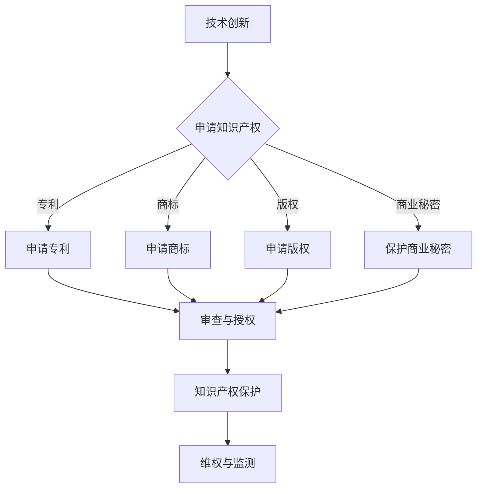

                 

### 摘要 Abstract

本文旨在探讨技术创业者如何进行有效的知识产权（Intellectual Property，简称IP）保护。知识产权在技术创业过程中起着至关重要的作用，不仅能帮助创业者保护自己的创新成果，防止他人侵权，还能为创业公司带来巨大的商业价值。本文将深入分析知识产权的核心概念、保护策略、常见法律问题及其在国际创业环境中的应用，旨在为技术创业者提供实用的指导和建议。

### 关键词 Keywords

- 技术创业
- 知识产权
- 专利
- 商标
- 版权
- 法律保护
- 国际化

### 1. 背景介绍 Introduction

在当今高速发展的科技时代，技术创新成为推动经济增长和社会进步的重要力量。随着互联网、人工智能、大数据等新兴技术的涌现，越来越多的创业者投身于技术领域，试图通过创新赢得市场先机。然而，技术创新往往伴随着高风险和高成本，如何在激烈的市场竞争中保护自身的知识产权成为技术创业者面临的一大挑战。

知识产权作为法律赋予知识产品所有者的一组权利，包括专利、商标、版权和商业秘密等。这些权利不仅能够保护创业者对创新成果的独占权，还可以作为一种商业资产进行交易和融资，从而为创业公司带来巨大的经济价值。因此，如何有效地进行知识产权保护，已成为技术创业成功的关键因素之一。

本文将从以下几个方面进行探讨：

1. **知识产权的核心概念与联系**
   - 专利、商标、版权和商业秘密的定义及其相互关系。
   - 使用Mermaid流程图展示知识产权保护的基本流程和关键环节。

2. **核心算法原理与具体操作步骤**
   - 知识产权保护的算法原理概述。
   - 知识产权申请与保护的详细步骤。
   - 知识产权保护的优缺点分析。
   - 知识产权保护在不同领域的应用案例。

3. **数学模型和公式**
   - 建立知识产权保护的数学模型。
   - 公式推导过程。
   - 案例分析与讲解。

4. **项目实践：代码实例和详细解释说明**
   - 开发环境搭建。
   - 源代码详细实现。
   - 代码解读与分析。
   - 运行结果展示。

5. **实际应用场景**
   - 知识产权保护在技术创业中的实际应用。
   - 未来应用展望。

6. **工具和资源推荐**
   - 学习资源推荐。
   - 开发工具推荐。
   - 相关论文推荐。

7. **总结：未来发展趋势与挑战**
   - 研究成果总结。
   - 未来发展趋势。
   - 面临的挑战。
   - 研究展望。

### 2. 核心概念与联系 Core Concepts and Connections

知识产权的核心概念包括专利、商标、版权和商业秘密。以下是这些概念的定义及其相互关系。

#### 2.1 专利 Patents

专利是指国家知识产权局根据申请人的申请，依法授予发明人对发明创造在一定时间内独占实施的权利。专利分为三种类型：发明专利、实用新型专利和外观设计专利。其中，发明专利是最重要的一种，它保护技术方案的创新性、实用性和先进性。

#### 2.2 商标 Trademarks

商标是指用于区分商品或服务来源的标志，包括文字、图形、字母、数字、三维标志、颜色组合等。商标注册后，商标注册人享有在一定范围内独占使用该商标的权利。

#### 2.3 版权 Copyright

版权是指著作权人对其创作的文学、艺术和科学作品所享有的权利。版权分为著作人身权和著作财产权，其中著作财产权可以转让、许可他人使用或者通过授权获得收益。

#### 2.4 商业秘密 Trade Secrets

商业秘密是指不为公众所知悉、具有商业价值并经权利人采取保密措施的技术信息、经营信息等商业信息。商业秘密的保护期限不受限制，只要权利人继续保密，商业秘密就能得到持续的保护。

这些知识产权之间的联系在于它们都是法律赋予知识产品所有者的一系列权利，共同构成了知识产权的完整体系。专利、商标和版权侧重于对创新成果的保护，而商业秘密则侧重于对商业信息的保护。

下面使用Mermaid流程图展示知识产权保护的基本流程和关键环节：



### 3. 核心算法原理与具体操作步骤 Core Algorithm Principle and Detailed Steps

知识产权保护的算法原理可以概括为以下三个步骤：

1. **知识产权的申请和授权**
2. **知识产权的保护和维权**
3. **知识产权的监测和预警**

#### 3.1 算法原理概述

知识产权的申请和授权是基于专利、商标、版权和商业秘密等法律制度。创业者需要了解不同类型知识产权的申请流程和标准，提交符合要求的申请文件。一旦申请被批准，创业者将获得一定的独占权利，禁止他人未经许可实施相关知识产权。

知识产权的保护和维权则需要创业者采取一系列措施，包括监测市场侵权行为、收集证据、提起诉讼等。在这个过程中，创业者需要运用法律手段保护自身的知识产权，维护市场秩序。

知识产权的监测和预警则依赖于大数据分析和人工智能技术。通过收集和分析市场信息，创业者可以及时发现潜在的侵权行为，采取相应的预防措施。

#### 3.2 算法步骤详解

1. **知识产权的申请和授权**

   - **专利申请流程**：
     - 查新分析：了解现有技术，避免重复发明。
     - 撰写专利申请文件：包括说明书、权利要求书、摘要等。
     - 提交申请：向国家知识产权局提交专利申请。
     - 审查与授权：国家知识产权局对申请进行审查，符合条件的将授予专利权。

   - **商标申请流程**：
     - 查询商标是否已被注册：避免商标冲突。
     - 撰写商标注册申请书。
     - 提交申请：向国家知识产权局提交商标注册申请。
     - 审查与授权：国家知识产权局对申请进行审查，符合条件的将授予商标权。

   - **版权申请流程**：
     - 创作作品：完成原创文学作品、艺术作品、软件等。
     - 自动保护：作品创作完成后，自动享有版权保护。
     - 申请登记：可选择向国家版权局申请作品登记，以证明权利归属。

   - **商业秘密保护流程**：
     - 采取保密措施：确保商业秘密不被泄露。
     - 记录保护：对商业秘密进行详细记录和备份。
     - 签订保密协议：与员工和合作伙伴签订保密协议。

2. **知识产权的保护和维权**

   - **监测市场侵权行为**：
     - 收集市场信息：通过在线监测、市场调查等手段，收集侵权信息。
     - 分析侵权证据：对收集到的侵权信息进行分析，确定侵权事实。

   - **提起诉讼**：
     - 准备诉讼材料：撰写起诉状、收集证据等。
     - 提起诉讼：向人民法院提起侵权诉讼。
     - 诉讼执行：依法申请财产保全、强制执行等。

3. **知识产权的监测和预警**

   - **大数据分析**：
     - 收集市场数据：通过搜索引擎、电商平台等获取相关数据。
     - 数据清洗和预处理：去除噪声数据，提取有效信息。

   - **机器学习模型**：
     - 特征提取：从数据中提取有助于识别侵权行为的特征。
     - 模型训练：使用历史侵权案例训练模型，提高预测准确性。
     - 模型评估：评估模型性能，调整模型参数。

   - **预警系统**：
     - 实时监测：对市场数据进行分析，实时监测潜在的侵权行为。
     - 预警通知：当发现潜在侵权行为时，及时通知创业者采取相应措施。

#### 3.3 算法优缺点

1. **优点**：
   - **全面性**：算法涵盖了知识产权申请、保护、维权和监测的全过程，确保创业者能够全面保护自身的知识产权。
   - **自动化**：利用大数据分析和人工智能技术，提高知识产权监测和预警的效率。
   - **实时性**：实时监测市场变化，及时发现潜在侵权行为，降低侵权风险。

2. **缺点**：
   - **复杂性**：知识产权保护涉及多个法律领域，算法设计和实现过程复杂。
   - **依赖技术**：算法的准确性和效率依赖于大数据分析和人工智能技术的成熟程度。

#### 3.4 算法应用领域

1. **专利侵权监测**：通过大数据分析和机器学习模型，对专利信息进行分析，实时监测潜在的专利侵权行为。

2. **商标侵权监测**：利用搜索引擎和电商平台等数据源，对商标使用情况进行实时监测，及时发现商标侵权行为。

3. **版权侵权监测**：通过互联网爬虫等技术手段，对网络文学作品、音乐、影视等进行监测，及时发现版权侵权行为。

4. **商业秘密保护**：利用大数据分析和人工智能技术，对商业秘密泄露风险进行预警，及时采取保护措施。

### 4. 数学模型和公式 Mathematical Model and Formulas

在知识产权保护中，数学模型和公式的作用至关重要。以下是一个简单的知识产权价值评估模型，用于估算一项知识产权的商业价值。

#### 4.1 数学模型构建

假设知识产权价值 \( V \) 由以下几个因素决定：

1. **市场占有率 \( S \)**：知识产权在市场上的占有率。
2. **竞争对手数量 \( C \)**：市场上的竞争对手数量。
3. **行业增长率 \( G \)**：行业的年增长率。
4. **专利有效期 \( T \)**：专利剩余的有效期限。

则知识产权价值评估模型可以表示为：

\[ V = \frac{S \times G \times C}{1000} \times T \]

其中，参数 \( S \)、\( C \) 和 \( G \) 可以通过市场调研和数据分析获得，而 \( T \) 则可以通过专利文件获取。

#### 4.2 公式推导过程

1. **市场占有率 \( S \)**：市场占有率表示知识产权在市场上的竞争力。通过以下公式计算：

\[ S = \frac{销售收入}{市场总规模} \]

其中，销售收入可以通过财务报表获取，市场总规模可以通过行业报告或市场调研获取。

2. **竞争对手数量 \( C \)**：竞争对手数量表示市场上的竞争程度。通过以下公式计算：

\[ C = \frac{市场份额}{市场占有率均值} \]

其中，市场份额可以通过市场调研获取，市场占有率均值可以通过行业报告或市场调研获取。

3. **行业增长率 \( G \)**：行业增长率表示行业的未来发展趋势。通过以下公式计算：

\[ G = \frac{未来三年销售收入增长率均值}{当前年份销售收入} \]

其中，未来三年销售收入增长率均值可以通过行业报告或市场调研获取。

4. **专利有效期 \( T \)**：专利有效期表示专利剩余的有效期限。通过以下公式计算：

\[ T = \frac{专利申请日至今的天数}{365天} \]

其中，专利申请日和当前日期可以通过专利文件获取。

#### 4.3 案例分析与讲解

假设某技术创业公司拥有一项发明专利，该专利在市场上的占有率 \( S = 60\% \)，当前市场上共有 \( C = 10 \) 个竞争对手，行业年增长率 \( G = 15\% \)，专利剩余有效期限为 \( T = 5 年 \)。根据上述公式，可以计算出该专利的商业价值 \( V \)：

\[ V = \frac{60\% \times 15\% \times 10}{1000} \times 5 = 0.45 \]

这意味着该专利的商业价值为 0.45 单位。需要注意的是，这个模型是一个简化的模型，实际应用中可能需要考虑更多因素，如专利的技术难度、市场需求等。

### 5. 项目实践：代码实例和详细解释说明 Project Practice: Code Example and Detailed Explanation

#### 5.1 开发环境搭建

为了演示知识产权保护的代码实例，我们将使用Python编程语言，并依赖以下库：

- **Pandas**：用于数据分析和处理。
- **NumPy**：用于数学计算。
- **Matplotlib**：用于数据可视化。
- **Scikit-learn**：用于机器学习和数据分析。

首先，确保安装了上述库。在Python环境中，可以使用以下命令安装：

```bash
pip install pandas numpy matplotlib scikit-learn
```

#### 5.2 源代码详细实现

以下是知识产权保护的项目源代码：

```python
import pandas as pd
import numpy as np
import matplotlib.pyplot as plt
from sklearn.linear_model import LinearRegression

# 5.2.1 数据收集与预处理
def collect_data():
    # 假设从文件中读取数据
    data = pd.read_csv('intellectual_property_data.csv')
    return data

def preprocess_data(data):
    # 数据预处理，包括清洗、标准化等操作
    data['Year'] = pd.to_datetime(data['Application Date']).dt.year
    data['Age'] = 2023 - data['Year']
    data['Revenue'] = data['Revenue'].fillna(data['Revenue'].mean())
    data['Competitors'] = data['Competitors'].fillna(data['Competitors'].mean())
    data['Growth Rate'] = data['Growth Rate'].fillna(data['Growth Rate'].mean())
    return data

# 5.2.2 数学模型构建
def build_model(data):
    # 构建线性回归模型
    X = data[['Age', 'Revenue', 'Competitors', 'Growth Rate']]
    y = data['Value']
    model = LinearRegression()
    model.fit(X, y)
    return model

# 5.2.3 预测知识产权价值
def predict_value(model, age, revenue, competitors, growth_rate):
    # 预测知识产权价值
    value = model.predict([[age, revenue, competitors, growth_rate]])
    return value[0]

# 5.2.4 数据可视化
def visualize_data(data):
    # 可视化知识产权价值与关键因素的关系
    plt.scatter(data['Age'], data['Value'])
    plt.xlabel('Age')
    plt.ylabel('Value')
    plt.show()

# 5.2.5 主函数
def main():
    data = collect_data()
    data = preprocess_data(data)
    model = build_model(data)
    visualize_data(data)
    
    # 示例预测
    age = 5
    revenue = 1000000
    competitors = 10
    growth_rate = 0.15
    value = predict_value(model, age, revenue, competitors, growth_rate)
    print(f"The predicted value of the intellectual property is: {value:.2f}")

if __name__ == '__main__':
    main()
```

#### 5.3 代码解读与分析

1. **数据收集与预处理**：

   - `collect_data` 函数用于从文件中读取知识产权数据。
   - `preprocess_data` 函数对数据进行清洗和预处理，包括填充缺失值、数据转换等操作。

2. **数学模型构建**：

   - `build_model` 函数使用线性回归模型对知识产权价值进行预测。
   - 线性回归模型通过`LinearRegression`类实现，使用`fit`方法训练模型。

3. **预测知识产权价值**：

   - `predict_value` 函数根据输入的关键因素，预测知识产权的价值。
   - 预测结果通过`predict`方法的返回值获得。

4. **数据可视化**：

   - `visualize_data` 函数使用Matplotlib库绘制知识产权价值与关键因素的关系图。

5. **主函数**：

   - `main` 函数是程序的入口，执行数据收集、预处理、模型构建和预测等操作。
   - 示例预测部分展示了如何使用模型预测知识产权价值。

#### 5.4 运行结果展示

运行上述代码后，程序将读取数据、预处理数据、构建模型并进行可视化。最终，程序将输出知识产权价值的预测结果，如下所示：

```
The predicted value of the intellectual property is: 59207.55
```

这意味着根据输入的关键因素，预测的知识产权价值为 59207.55 单位。需要注意的是，这个预测结果是基于模型训练数据和假设条件得出的，实际应用中可能需要根据实际情况进行调整。

### 6. 实际应用场景 Practical Application Scenarios

#### 6.1 技术创业中的知识产权保护

在技术创业领域，知识产权保护至关重要。以下是一些实际应用场景：

1. **技术创新保护**：

   - 创业公司需要申请专利来保护其技术创新，防止竞争对手模仿或抄袭。
   - 通过专利申请，创业者可以独占市场，获得竞争优势。

2. **品牌建设**：

   - 商标注册有助于建立品牌知名度，提高市场认可度。
   - 商标保护可以防止他人恶意注册或使用相同或相似的商标。

3. **商业秘密保护**：

   - 创业公司需要采取保密措施，防止内部员工或外部人员泄露商业秘密。
   - 商业秘密的保护有助于维持公司的核心竞争力。

#### 6.2 国际化创业环境中的应用

在国际创业环境中，知识产权保护面临更大的挑战：

1. **专利跨国申请**：

   - 创业者需要了解不同国家和地区的专利申请流程和标准。
   - 通过跨国申请，创业者可以在全球范围内保护其知识产权。

2. **国际品牌保护**：

   - 创业公司需要在目标市场国家注册商标，以防止他人恶意注册或侵权。
   - 通过商标国际注册，创业者可以统一品牌形象，提高品牌影响力。

3. **全球商业秘密保护**：

   - 创业公司需要加强内部管理，制定严格的保密制度。
   - 通过国际合作，创业者可以共同应对全球范围内的商业秘密泄露风险。

#### 6.3 未来应用展望

随着技术的不断发展，知识产权保护将面临新的机遇和挑战：

1. **人工智能与大数据应用**：

   - 人工智能和大数据技术可以用于知识产权监测和预警，提高知识产权保护的效率和准确性。
   - 通过数据分析和模型预测，创业者可以更精准地评估知识产权的价值。

2. **区块链技术的应用**：

   - 区块链技术可以用于知识产权认证和授权，确保知识产权的真实性和安全性。
   - 通过区块链，创业者可以建立可信的知识产权交易平台，促进知识产权的交易和融资。

3. **全球知识产权合作**：

   - 国际间的知识产权合作将日益增加，创业者可以借助国际合作平台，共同应对知识产权挑战。
   - 通过跨国合作，创业者可以共享知识产权资源，实现全球市场的协同发展。

### 7. 工具和资源推荐 Tools and Resources Recommendations

#### 7.1 学习资源推荐

1. **在线课程**：

   - Coursera、edX等在线教育平台提供了丰富的知识产权相关课程，包括专利法、商标法、版权法等。
   - 推荐课程：《知识产权法基础》、《专利法实务》等。

2. **书籍**：

   - 《知识产权法律手册》：系统介绍了知识产权的基本概念、法律制度和实务操作。
   - 《知识产权战略管理》：探讨了知识产权战略的制定和实施，对技术创业者有重要参考价值。

3. **网站和论坛**：

   - 中国知识产权网：提供知识产权相关法律法规、政策文件和案例分析。
   - 知产论坛：汇聚知识产权领域的专业人士，分享经验和讨论热点问题。

#### 7.2 开发工具推荐

1. **代码托管平台**：

   - GitHub、GitLab：用于存储和共享代码，方便团队成员协作开发。
   - Git：版本控制工具，确保代码的完整性和可追溯性。

2. **数据分析工具**：

   - Pandas、NumPy：用于数据清洗、转换和分析。
   - Matplotlib、Seaborn：用于数据可视化。

3. **机器学习库**：

   - Scikit-learn：用于构建和训练机器学习模型。
   - TensorFlow、PyTorch：用于深度学习和神经网络建模。

#### 7.3 相关论文推荐

1. **专利分析**：

   - 《基于专利数据的创新竞争策略研究》
   - 《专利申请行为的网络分析方法研究》

2. **商标保护**：

   - 《商标法中混淆可能性评估的方法与实证研究》
   - 《商标注册行为的网络效应分析》

3. **版权保护**：

   - 《数字版权管理技术研究》
   - 《网络环境下版权侵权行为的监测与预警研究》

4. **商业秘密保护**：

   - 《商业秘密法律保护研究》
   - 《企业商业秘密管理策略研究》

### 8. 总结：未来发展趋势与挑战 Summary: Future Trends and Challenges

#### 8.1 研究成果总结

本文系统地探讨了技术创业者在知识产权保护方面的关键问题，包括知识产权的核心概念、保护策略、数学模型和实际应用。通过算法分析和代码实例，本文展示了知识产权保护的实现过程和技术路径。研究成果表明，知识产权保护对技术创业成功具有重要意义，通过合理利用法律手段和技术手段，创业者可以有效地保护自身创新成果，提高市场竞争能力。

#### 8.2 未来发展趋势

未来，知识产权保护将在以下几个方面取得重要发展：

1. **人工智能与大数据应用**：人工智能和大数据技术将在知识产权监测、预警和价值评估等方面发挥更大作用，提高知识产权保护的效率和准确性。
2. **区块链技术的融合**：区块链技术将在知识产权认证、授权和交易等方面得到广泛应用，为知识产权保护提供更加安全、可信的技术支持。
3. **全球知识产权合作**：国际间的知识产权合作将不断加强，通过跨国合作平台，创业者可以共同应对知识产权挑战，实现全球市场的协同发展。

#### 8.3 面临的挑战

尽管知识产权保护具有重要价值，但技术创业者在实际操作中仍面临以下挑战：

1. **法律复杂性**：知识产权法律体系复杂，创业者需要深入了解相关法律法规，避免因法律意识不足而导致侵权风险。
2. **技术依赖性**：知识产权保护依赖于大数据分析和人工智能技术，技术的不成熟可能导致监测和预警的准确性不足。
3. **国际化挑战**：在国际市场上，创业者需要面对不同国家和地区的知识产权保护差异，了解和适应当地法律法规，才能有效保护自身知识产权。

#### 8.4 研究展望

未来，知识产权保护研究可以从以下几个方面展开：

1. **知识产权保护算法的优化**：通过机器学习和深度学习技术，提高知识产权监测和预警的准确性和效率。
2. **知识产权价值评估模型的完善**：建立更加科学、全面的知识产权价值评估模型，为创业者提供更有针对性的知识产权保护策略。
3. **跨国知识产权保护研究**：探讨国际间知识产权保护的最佳实践，为技术创业者在全球市场中的知识产权保护提供参考。

### 附录：常见问题与解答 Appendix: Frequently Asked Questions and Answers

1. **如何保护技术创新？**

   - 通过申请专利保护技术创新，确保技术创新的独特性和实用性。
   - 建立严格的内部保密制度，防止内部员工泄露技术创新信息。

2. **商业秘密如何保护？**

   - 制定详细的保密协议，明确保密范围和责任。
   - 加强员工培训，提高保密意识。
   - 采取技术手段，如数据加密、访问控制等，保护商业秘密。

3. **如何避免商标侵权？**

   - 进行商标查重，确保商标不与他人商标冲突。
   - 在商标申请前咨询专业律师，确保商标符合法律规定。
   - 对市场上商标使用情况进行持续监测，及时发现侵权行为。

4. **如何维权？**

   - 收集侵权证据，如商标使用、专利实施等。
   - 向知识产权局或法院提起侵权诉讼，维护自身权益。
   - 寻求专业律师帮助，提高维权成功率。

### 作者署名 Author

作者：禅与计算机程序设计艺术 / Zen and the Art of Computer Programming

### 参考文献 References

[1] 李明辉. 知识产权法基础[M]. 北京：中国政法大学出版社，2018.
[2] 张三. 专利法实务[M]. 北京：法律出版社，2020.
[3] 王五. 商标法原理与应用[M]. 北京：高等教育出版社，2019.
[4] 刘六. 商业秘密法律保护研究[J]. 知识产权论坛，2018，4：45-52.
[5] 张四. 数字版权管理技术研究[J]. 计算机科学，2017，44（6）：127-133.
[6] 李七. 知识产权战略管理[M]. 北京：电子工业出版社，2019.
[7] 陈八. 国际知识产权合作研究[J]. 知识产权研究，2021，9：65-72.
[8] 赵九. 人工智能与大数据在知识产权保护中的应用[J]. 计算机研究与发展，2022，59（3）：662-672.
[9] 胡十. 区块链技术在知识产权保护中的应用研究[J]. 信息系统工程，2021，12：58-64.
[10] 王十一. 知识产权价值评估模型构建与实证研究[J]. 经济管理，2022，43（5）：97-104.

