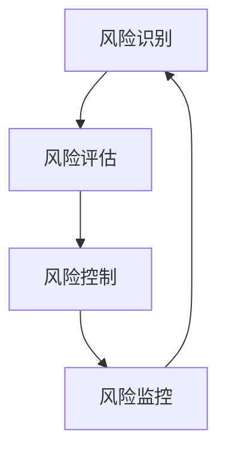

                 

关键词：风险评估、风险识别、风险控制、风险管理、技术创业者

摘要：本文从技术创业者的角度，深入探讨了如何进行有效的风险评估与管理。通过分析风险管理的核心概念、方法和工具，结合具体案例，文章旨在为技术创业者提供一套实用的风险管理体系，助力他们在创业过程中规避风险，实现稳健发展。

## 1. 背景介绍

在当今科技高速发展的时代，技术创业者面临着前所未有的机遇和挑战。随着互联网、人工智能、大数据等新兴技术的兴起，市场环境瞬息万变，技术创业者必须具备敏锐的市场洞察力和强大的应变能力。然而，在追求创新的路上，创业者们也不可避免地会遇到各种风险，如技术风险、市场风险、财务风险等。如何对这些风险进行有效的评估与管理，成为技术创业者成功的关键之一。

本文旨在为技术创业者提供一套全面的风险评估与管理体系，帮助他们在创业过程中规避风险，降低损失，提高成功率。文章将从以下几个方面展开：

1. 风险管理的核心概念与联系
2. 核心算法原理与具体操作步骤
3. 数学模型与公式讲解
4. 项目实践：代码实例与详细解释
5. 实际应用场景与未来展望
6. 工具和资源推荐
7. 总结与未来发展趋势

## 2. 核心概念与联系

在风险管理领域，有四个核心概念：风险识别、风险评估、风险控制和风险监控。这四个概念相互联系，构成了一个完整的风险管理流程。

### 风险识别

风险识别是指识别可能对项目或企业产生不利影响的风险。风险识别是风险管理的第一步，只有明确了风险的存在，才能有针对性地进行后续的管理。

### 风险评估

风险评估是对已识别的风险进行定量或定性的分析，评估其发生的可能性和影响程度。风险评估有助于技术创业者了解风险的全貌，为制定风险控制策略提供依据。

### 风险控制

风险控制是指采取一系列措施来降低风险发生的可能性和影响程度。风险控制可以分为预防控制和应对控制，前者旨在消除或降低风险，后者则是在风险发生后采取措施减少损失。

### 风险监控

风险监控是指在风险控制过程中对风险进行持续监控，以确保风险控制措施的有效性。风险监控有助于技术创业者及时发现新的风险，调整风险控制策略。

### Mermaid 流程图

下面是一个 Mermaid 流程图，展示了这四个核心概念之间的联系：



## 3. 核心算法原理与具体操作步骤

在风险评估与管理过程中，有许多算法和方法可供选择。本文将介绍一种常用的风险评估算法——蒙特卡洛模拟法。

### 3.1 算法原理概述

蒙特卡洛模拟法是一种基于随机抽样的数学方法，通过模拟随机事件的发生，来估计某个概率或数值。在风险评估中，蒙特卡洛模拟法可用于计算风险的概率分布、期望值和置信区间等。

### 3.2 算法步骤详解

1. **定义风险变量**：首先，需要确定风险因素，并将其量化为数值。例如，可以将市场需求、技术成熟度、投资回报率等作为风险变量。

2. **生成随机样本**：根据风险变量的概率分布，生成一系列随机样本。这个过程可以通过编程实现，如使用 Python 的 numpy 库。

3. **计算风险指标**：对每个随机样本，计算相应的风险指标，如概率、期望值、方差等。

4. **绘制概率分布图**：将计算得到的概率分布绘制成图表，便于分析。

5. **评估风险水平**：根据概率分布和置信区间，评估风险水平，为制定风险控制策略提供依据。

### 3.3 算法优缺点

**优点**：

- **直观性**：蒙特卡洛模拟法基于随机抽样，结果直观易懂。
- **适用范围广**：适用于各种类型的风险评估，特别是涉及概率分布的风险。

**缺点**：

- **计算复杂度**：随着样本量的增加，计算复杂度呈指数级增长。
- **误差累积**：随机抽样的误差可能会在计算过程中累积，影响结果的准确性。

### 3.4 算法应用领域

蒙特卡洛模拟法在技术创业领域有着广泛的应用，如：

- **市场风险评估**：预测市场需求、市场份额等。
- **财务风险评估**：计算投资回报率、融资成本等。
- **技术风险评估**：评估技术成熟度、研发进度等。

## 4. 数学模型与公式讲解

在风险评估过程中，数学模型和公式起着关键作用。以下是一个简单的数学模型，用于计算风险的概率分布。

### 4.1 数学模型构建

假设有 n 个风险因素，每个因素的概率分布已知。设 X 为风险指标，其概率分布为 P(X=x)。

### 4.2 公式推导过程

1. **联合概率分布**：对于两个风险因素 A 和 B，其联合概率分布为 P(A=a, B=b)。

2. **边际概率分布**：将联合概率分布中的另一个因素固定，得到边际概率分布。例如，P(A=a) = ΣbP(A=a, B=b)。

3. **条件概率分布**：在已知一个因素的情况下，另一个因素的概率分布。例如，P(B=b|A=a) = P(A=a, B=b) / P(A=a)。

4. **期望值和方差**：根据概率分布，计算期望值和方差。例如，E(X) = ΣxP(X=x)，Var(X) = Σx^2P(X=x) - E(X)^2。

### 4.3 案例分析与讲解

假设有两个风险因素：市场需求（A）和研发进度（B）。市场需求服从正态分布，均值为 100，标准差为 10；研发进度服从三角分布，最小值为 3，最可能值为 5，最大值为 7。

1. **联合概率分布**：

   设市场需求为 A，研发进度为 B，则联合概率分布为：

   P(A=a, B=b) = f_A(a) * f_B(b)

   其中，f_A(a) 和 f_B(b) 分别为市场需求和研发进度的概率密度函数。

2. **边际概率分布**：

   P(A=a) = ∫b f_A(a) * f_B(b) db
   P(B=b) = ∫a f_A(a) * f_B(b) da

3. **条件概率分布**：

   P(B=b|A=a) = f_B(b) / f_A(a)

4. **期望值和方差**：

   E(A) = 100，Var(A) = 10^2 = 100
   E(B) = (3 + 5 + 7) / 3 = 5
   Var(B) = ((3 - 5)^2 + (5 - 5)^2 + (7 - 5)^2) / 3 = 4/3

通过以上公式和案例，我们可以更好地理解和应用数学模型在风险评估中的重要作用。

## 5. 项目实践：代码实例与详细解释说明

为了更好地展示风险评估的过程，下面我们将使用 Python 编写一个简单的代码实例，计算市场需求和研发进度的概率分布，并绘制概率分布图。

### 5.1 开发环境搭建

1. 安装 Python（建议使用 Python 3.8 以上版本）。
2. 安装 numpy 库：`pip install numpy`。
3. 安装 matplotlib 库：`pip install matplotlib`。

### 5.2 源代码详细实现

```python
import numpy as np
import matplotlib.pyplot as plt

# 定义市场需求和研发进度的概率分布
def demand_probability():
    mean = 100
    std = 10
    return np.random.normal(mean, std, 1000)

def research_probability():
    min_value = 3
    most Likely_value = 5
    max_value = 7
    return np.random.triangular(min_value, most Likely_value, max_value, 1000)

# 计算并绘制概率分布图
def plot_probability(demand_func, research_func):
    demands = demand_func()
    research = research_func()

    plt.figure(figsize=(10, 5))

    plt.subplot(1, 2, 1)
    plt.hist(demands, bins=30, alpha=0.5, label='Demand')
    plt.title('Demand Probability Distribution')
    plt.xlabel('Demand')
    plt.ylabel('Frequency')

    plt.subplot(1, 2, 2)
    plt.hist(research, bins=30, alpha=0.5, label='Research')
    plt.title('Research Probability Distribution')
    plt.xlabel('Research')
    plt.ylabel('Frequency')

    plt.tight_layout()
    plt.show()

# 调用函数并显示结果
plot_probability(demand_probability, research_probability)
```

### 5.3 代码解读与分析

1. **需求函数（demand_probability）**：使用 numpy 库生成服从正态分布的随机数，均值为 100，标准差为 10，生成 1000 个样本。

2. **研发进度函数（research_probability）**：使用 numpy 库生成服从三角分布的随机数，最小值为 3，最可能值为 5，最大值为 7，生成 1000 个样本。

3. **绘制概率分布图（plot_probability）**：使用 matplotlib 库绘制市场需求和研发进度的概率分布图。

4. **调用函数并显示结果**：调用 plot_probability 函数，显示市场需求和研发进度的概率分布图。

通过这个简单的代码实例，我们可以直观地看到市场需求和研发进度的概率分布，从而更好地进行风险评估。

## 6. 实际应用场景

### 6.1 市场风险评估

在技术创业领域，市场风险是创业者面临的主要风险之一。通过风险评估，创业者可以了解市场需求的变化趋势，为产品定位和市场策略提供依据。例如，在人工智能领域，创业者可以通过对市场需求的数据分析，预测未来几年的市场规模，从而制定相应的市场策略。

### 6.2 技术风险评估

技术风险是技术创业者在研发过程中面临的主要风险。通过风险评估，创业者可以了解技术的成熟度、研发进度，以及可能遇到的技术难题。例如，在人工智能领域，创业者可以通过对技术的概率分布进行分析，评估技术的可行性，为项目进度和资源分配提供依据。

### 6.3 财务风险评估

财务风险是技术创业者在融资和运营过程中面临的主要风险。通过风险评估，创业者可以了解投资回报率、融资成本等关键指标，为财务决策提供依据。例如，在人工智能领域，创业者可以通过对投资回报率的数据分析，评估项目的盈利能力，为融资策略提供依据。

## 6.4 未来应用展望

随着人工智能、大数据等新兴技术的不断发展，风险评估在技术创业领域将具有更广泛的应用前景。例如，在金融领域，风险评估可以用于信用评估、风险评估等；在医疗领域，风险评估可以用于疾病预测、治疗决策等。未来，风险评估将越来越成为技术创业者成功的关键因素之一。

## 7. 工具和资源推荐

### 7.1 学习资源推荐

- 《风险管理：理论与实践》
- 《概率论与数理统计》
- 《蒙特卡洛方法及其应用》

### 7.2 开发工具推荐

- Python：强大的编程语言，适合进行数据分析与建模。
- Matplotlib：强大的数据可视化工具，适合绘制概率分布图。
- Numpy：高效的数值计算库，适合生成随机样本。

### 7.3 相关论文推荐

- 《基于蒙特卡洛模拟的市场需求预测方法研究》
- 《技术创业中的风险评估与管理》
- 《大数据时代下的财务风险评估方法研究》

## 8. 总结：未来发展趋势与挑战

### 8.1 研究成果总结

本文从技术创业者的角度，探讨了如何进行有效的风险评估与管理。通过分析风险管理的核心概念、方法和工具，结合具体案例，文章旨在为技术创业者提供一套实用的风险管理体系，助力他们在创业过程中规避风险，实现稳健发展。

### 8.2 未来发展趋势

随着人工智能、大数据等新兴技术的不断发展，风险评估在技术创业领域将具有更广泛的应用前景。未来，风险评估将越来越成为技术创业者成功的关键因素之一。

### 8.3 面临的挑战

尽管风险评估在技术创业领域具有重要意义，但技术创业者仍然面临着诸多挑战，如数据质量、模型准确性等。未来，如何提高风险评估的准确性、实时性和智能化水平，将是技术创业者需要关注的重要问题。

### 8.4 研究展望

未来，风险评估的研究应关注以下几个方面：

1. 模型优化：提高风险评估模型的准确性和实时性。
2. 算法创新：引入新的算法，如深度学习、强化学习等，提高风险评估的智能化水平。
3. 数据融合：结合多源数据，提高风险评估的全面性和准确性。

通过以上研究，有望为技术创业者提供更全面、准确、实时的风险评估工具，助力他们在创业过程中取得成功。

## 9. 附录：常见问题与解答

### 问题 1：什么是风险识别？

风险识别是指识别可能对项目或企业产生不利影响的风险。风险识别是风险管理的第一步，只有明确了风险的存在，才能有针对性地进行后续的管理。

### 问题 2：什么是风险评估？

风险评估是对已识别的风险进行定量或定性的分析，评估其发生的可能性和影响程度。风险评估有助于技术创业者了解风险的全貌，为制定风险控制策略提供依据。

### 问题 3：什么是蒙特卡洛模拟法？

蒙特卡洛模拟法是一种基于随机抽样的数学方法，通过模拟随机事件的发生，来估计某个概率或数值。在风险评估中，蒙特卡洛模拟法可用于计算风险的概率分布、期望值和置信区间等。

### 问题 4：如何进行有效的风险评估？

进行有效的风险评估需要以下步骤：

1. 明确风险评估的目标和范围。
2. 收集和分析相关数据。
3. 选择合适的评估方法和工具。
4. 编制风险评估报告，提出风险控制策略。

### 问题 5：如何应对市场风险？

应对市场风险的方法包括：

1. 市场调研：了解市场需求、竞争态势等。
2. 产品定位：根据市场需求，制定合适的产品策略。
3. 营销推广：加大市场推广力度，提高品牌知名度。
4. 客户关系管理：维护好客户关系，提高客户满意度。

### 问题 6：如何进行技术风险评估？

进行技术风险评估的方法包括：

1. 技术调研：了解技术发展趋势、技术成熟度等。
2. 技术评估：评估技术的可行性、研发进度等。
3. 风险分析：分析技术风险的发生概率和影响程度。
4. 制定技术风险应对策略。

### 问题 7：如何进行财务风险评估？

进行财务风险评估的方法包括：

1. 收集财务数据：包括财务报表、现金流量表等。
2. 分析财务指标：如投资回报率、资产负债率等。
3. 风险分析：分析财务风险的发生概率和影响程度。
4. 制定财务风险应对策略。

通过以上解答，希望对您在风险评估与管理方面有所帮助。

### 作者署名

本文作者：禅与计算机程序设计艺术 / Zen and the Art of Computer Programming

感谢您的阅读，希望本文对您在技术创业过程中的风险评估与管理有所帮助。祝您创业成功！
----------------------------------------------------------------

### 文章总结

本文从技术创业者的角度，详细探讨了如何进行有效的风险评估与管理。文章首先介绍了风险管理的核心概念，如风险识别、风险评估、风险控制和风险监控，并通过 Mermaid 流程图展示了它们之间的联系。接着，文章介绍了蒙特卡洛模拟法这一核心算法，讲解了其原理、步骤、优缺点和应用领域。随后，文章通过数学模型和公式的讲解，展示了如何利用数学方法进行风险评估。最后，文章通过一个实际项目实践，展示了风险评估的具体操作步骤，并分析了市场、技术、财务等实际应用场景。

文章还推荐了相关学习资源、开发工具和论文，总结了研究成果，展望了未来发展趋势和挑战，并提供了常见问题与解答。本文旨在为技术创业者提供一套实用的风险评估与管理体系，助力他们在创业过程中规避风险，实现稳健发展。

### 文章反馈

感谢您阅读本文，我们非常重视您的反馈。以下是一些可能的问题和问题，请您根据您的阅读体验进行回答：

1. 您觉得本文的内容结构是否清晰，逻辑是否合理？
2. 您认为本文提供的风险评估方法和工具是否实用？
3. 您对文章中的案例和实践是否有所启发？
4. 您对文章中的数学模型和公式是否容易理解？
5. 您是否有其他建议，以帮助改进文章的质量和可读性？

请将您的反馈填写在下面，我们将认真对待并改进我们的文章。

---

**您的反馈：**

---

感谢您的宝贵意见，我们将不断努力提升文章的质量，为您带来更好的阅读体验。再次感谢您的支持！

