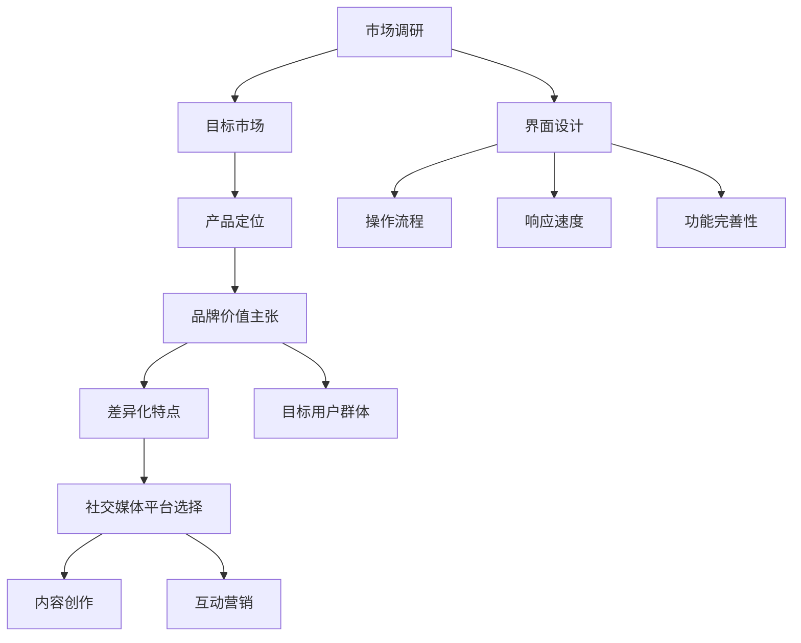
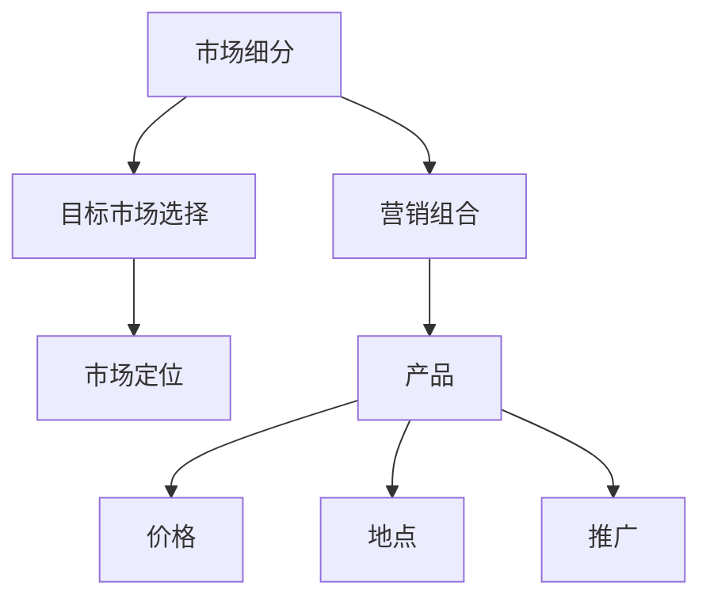
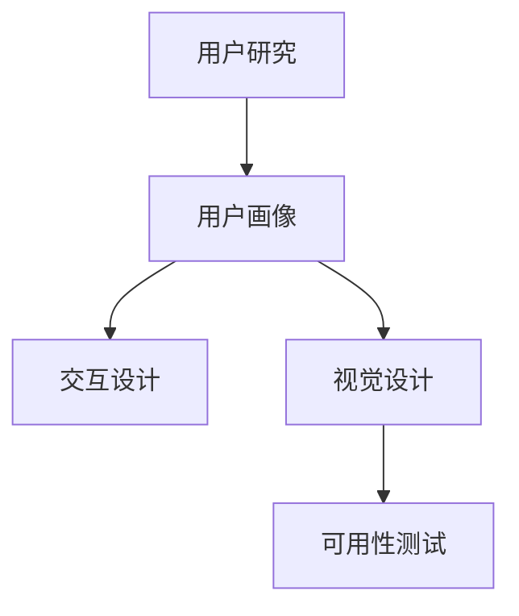
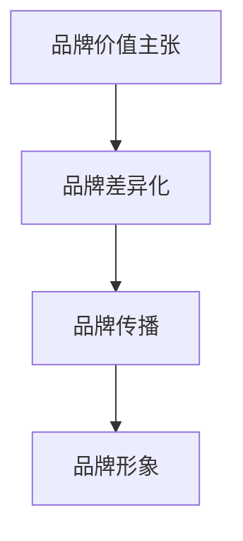

                 

在技术创业领域，商业文案写作与品牌传播是两把利器，它们不仅决定了产品在市场中的表现，也影响着企业的长远发展。本文旨在探讨如何通过高效的商业文案写作和品牌传播策略，帮助技术创业者打造一个具有吸引力和影响力的品牌。

> **关键词：商业文案写作、品牌传播、技术创业、市场营销、用户体验**

> **摘要：本文将详细介绍商业文案写作的核心原则和技巧，以及如何通过有效的品牌传播策略提升技术创业企业的市场竞争力。**

## 1. 背景介绍

技术创业，顾名思义，是指以技术创新为核心，通过创办企业实现商业化应用的过程。在科技日新月异、市场竞争激烈的今天，技术创业不再仅仅依赖于技术本身，商业文案写作与品牌传播的重要性愈发凸显。一篇优秀的商业文案，不仅能够吸引潜在用户，还能有效提升品牌的知名度和美誉度。

然而，许多技术创业者往往忽视了商业文案写作与品牌传播的重要性，他们更关注技术本身，而忽略了市场与用户的需求。这种做法往往导致产品无法得到市场的认可，甚至失败。因此，本文将深入探讨如何通过高质量的文案和有效的传播策略，帮助技术创业者打造成功品牌。

### 1.1 商业文案写作的重要性

商业文案写作是技术创业成功的关键因素之一。它不仅仅是文字的堆砌，更是品牌形象、产品特点和市场策略的传达工具。一份优秀的商业文案，能够做到以下几点：

- **提升品牌知名度**：通过精准的文案传递品牌理念，快速提升品牌在市场上的认知度。
- **塑造品牌形象**：通过文案风格和语言特点，塑造品牌独特的个性与形象。
- **吸引用户关注**：文案中巧妙地嵌入产品特点、优势和使用场景，吸引用户的注意力。
- **促进销售转化**：简洁明了、具有说服力的文案能够有效推动用户购买行为。

### 1.2 品牌传播的意义

品牌传播是企业在市场中建立和维持品牌形象的重要手段。对于技术创业者来说，有效的品牌传播策略不仅能够提升品牌知名度，还能建立用户信任，形成品牌忠诚度。具体来说，品牌传播的意义包括：

- **建立品牌信任**：通过持续、一致的品牌传播，建立用户对品牌的信任。
- **形成品牌认知**：在用户心中形成独特的品牌认知，使其在同类产品中脱颖而出。
- **维护品牌形象**：及时处理品牌危机，维护品牌形象和声誉。
- **提升品牌价值**：通过品牌传播，提升品牌在市场中的地位和价值。

### 1.3 商业文案写作与品牌传播的关系

商业文案写作与品牌传播相辅相成，二者密不可分。优秀的商业文案是品牌传播的基础，通过文案传递品牌信息，引发用户共鸣；而有效的品牌传播则能够放大文案的效果，使品牌在市场中得到更广泛的认可和传播。具体关系如下：

- **文案驱动传播**：通过高质量的文案，吸引潜在用户关注，驱动品牌传播。
- **传播强化文案**：通过品牌传播，扩大文案的影响力，使品牌在市场中占据一席之地。
- **协同作用**：文案和传播策略相互促进，共同提升品牌的知名度和美誉度。

### 1.4 目标读者

本文的目标读者包括技术创业者、市场营销人员、文案创作者以及希望提升品牌传播效果的相关从业者。无论您是刚刚进入技术创业领域的新手，还是经验丰富的创业者，本文都希望能够为您在商业文案写作与品牌传播方面提供有价值的指导。

## 2. 核心概念与联系

在深入探讨商业文案写作与品牌传播的策略之前，我们需要理解几个核心概念及其之间的联系。这些概念包括市场营销、用户体验、品牌定位、社交媒体传播等。以下是这些概念之间的关系及其在技术创业中的具体应用。

### 2.1 市场营销

市场营销是商业文案写作和品牌传播的基础。它涉及市场调研、目标市场确定、产品定位、定价策略、渠道选择和推广活动等。对于技术创业者来说，市场营销的关键在于了解用户需求，准确定位产品，并通过有效的文案和传播策略将产品推向市场。

- **市场调研**：通过调研了解市场需求、用户偏好和竞争态势，为文案和品牌传播提供数据支持。
- **目标市场**：明确目标用户群体，为文案和传播策略提供明确的方向。
- **产品定位**：根据目标市场的需求，确定产品的核心竞争力和差异化特点，通过文案和品牌传播突出这些特点。

### 2.2 用户体验

用户体验（UX）是品牌传播的核心要素之一。优秀的用户体验不仅能够吸引用户，还能提升用户满意度和忠诚度。在技术创业中，用户体验包括产品界面设计、操作流程、响应速度、功能完善性等方面。

- **界面设计**：通过简洁、美观的界面设计，提升用户的视觉体验。
- **操作流程**：优化用户操作流程，降低学习成本，提升用户操作效率。
- **响应速度**：提高系统响应速度，减少用户等待时间，提升用户满意度。
- **功能完善性**：提供丰富的功能，满足用户的各种需求，提升产品竞争力。

### 2.3 品牌定位

品牌定位是商业文案写作和品牌传播的重要策略。它涉及明确品牌在市场中的独特价值主张，并通过文案和传播手段传递给用户。对于技术创业者来说，品牌定位有助于在竞争激烈的市场中脱颖而出。

- **品牌价值主张**：明确品牌的核心价值，如技术创新、品质保障、用户服务等。
- **差异化特点**：通过文案和传播手段突出品牌的差异化特点，如技术优势、设计独特性、服务优势等。
- **目标用户群体**：根据品牌价值主张和差异化特点，确定目标用户群体，并通过文案和传播策略吸引这些用户。

### 2.4 社交媒体传播

社交媒体传播是现代品牌传播的重要手段之一。通过社交媒体平台，技术创业者可以快速、广泛地传播品牌信息，与用户互动，提升品牌知名度和影响力。以下是社交媒体传播在技术创业中的应用：

- **社交媒体平台选择**：根据目标用户群体的特点和社交媒体平台的特性，选择合适的平台进行品牌传播。
- **内容创作**：创作高质量、有吸引力的内容，如文章、图片、视频等，通过文案和视觉元素传递品牌信息。
- **互动营销**：通过社交媒体互动，如回复评论、举办活动等，与用户建立紧密的联系，提升品牌忠诚度。

### 2.5 Mermaid 流程图

以下是一个Mermaid流程图，展示了市场营销、用户体验、品牌定位和社交媒体传播之间的联系。



通过上述流程图，我们可以清晰地看到各个核心概念之间的联系和作用，以及它们在技术创业中的应用。

### 2.6 市场营销的核心概念和架构

在市场营销中，有几个核心概念和架构对商业文案写作和品牌传播至关重要。以下是对这些概念的简要介绍：

- **市场细分（Market Segmentation）**：根据用户的特征和行为，将市场划分为若干个具有相似需求的子市场。市场细分有助于确定目标用户群体，提高市场营销的精准度。
- **目标市场选择（Target Market Selection）**：在市场细分的基础上，选择最适合企业资源和能力的目标市场。目标市场选择决定了企业资源的投入方向和市场营销策略。
- **市场定位（Market Positioning）**：根据目标市场的需求，确定产品在市场中的独特价值和竞争优势，并通过文案和传播策略传递给用户。
- **营销组合（Marketing Mix）**：包括产品（Product）、价格（Price）、地点（Place）和推广（Promotion）四个要素，是市场营销策略的核心。优秀的营销组合能够提升产品的市场竞争力。

以下是市场营销核心概念和架构的详细 Mermaid 流程图：



通过上述流程图，我们可以更深入地理解市场营销的核心概念和架构，以及它们在商业文案写作和品牌传播中的应用。

### 2.7 用户体验的核心概念和架构

用户体验（UX）是技术创业成功的关键因素之一。以下是对用户体验核心概念和架构的简要介绍：

- **用户研究（User Research）**：通过用户调研、访谈、观察等方法，深入了解用户的需求、行为和痛点，为产品设计和用户体验优化提供依据。
- **用户画像（User Persona）**：基于用户研究，创建具有代表性的用户画像，用于指导产品设计和用户体验优化。
- **交互设计（Interaction Design）**：设计产品的交互流程和界面，确保用户能够轻松、高效地完成任务。
- **视觉设计（Visual Design）**：通过视觉元素，如颜色、字体、图标等，提升用户的视觉体验和品牌认知。
- **可用性测试（Usability Testing）**：通过实际用户测试，评估产品的用户体验，发现并解决存在的问题。

以下是用户体验核心概念和架构的详细 Mermaid 流程图：



通过上述流程图，我们可以清晰地看到用户体验的核心概念和架构，以及它们在技术创业中的应用。

### 2.8 品牌定位的核心概念和架构

品牌定位是技术创业成功的关键因素之一。以下是对品牌定位核心概念和架构的简要介绍：

- **品牌价值主张（Brand Value Proposition）**：明确品牌在市场中的独特价值和竞争优势，为用户创造价值。
- **品牌差异化（Brand Differentiation）**：通过独特的产品特点、服务优势或品牌形象，使品牌在市场中脱颖而出。
- **品牌传播（Brand Communication）**：通过文案、视觉、互动等多种方式，传递品牌信息，建立品牌认知和用户信任。
- **品牌形象（Brand Image）**：通过品牌视觉元素、语言风格和用户口碑，塑造品牌在用户心中的形象。

以下是品牌定位核心概念和架构的详细 Mermaid 流程图：



通过上述流程图，我们可以深入理解品牌定位的核心概念和架构，以及它们在技术创业中的应用。

## 3. 核心算法原理 & 具体操作步骤

### 3.1 算法原理概述

商业文案写作和品牌传播的核心算法可以概括为：市场调研、用户画像、文案创作、品牌传播和效果评估。以下是这些算法的基本原理和操作步骤：

#### 3.1.1 市场调研

市场调研是商业文案写作和品牌传播的第一步。通过市场调研，企业可以了解市场需求、竞争态势和用户行为，为文案创作和品牌传播提供数据支持。市场调研的主要步骤包括：

- **确定调研目标**：明确调研的目的和要解决的问题。
- **设计调研方法**：选择合适的调研方法，如问卷调查、访谈、观察等。
- **收集和分析数据**：通过调研方法收集数据，并进行统计分析。
- **撰写调研报告**：总结调研结果，提出结论和建议。

#### 3.1.2 用户画像

用户画像是商业文案写作和品牌传播的重要依据。通过用户画像，企业可以了解目标用户的基本特征、行为习惯和需求，从而有针对性地进行文案创作和品牌传播。用户画像的主要步骤包括：

- **收集用户数据**：通过市场调研、用户反馈、社交媒体等渠道收集用户数据。
- **分析用户数据**：对收集到的用户数据进行统计分析，提取关键特征。
- **创建用户画像**：基于用户数据，创建具有代表性的用户画像。
- **应用用户画像**：将用户画像应用于文案创作和品牌传播策略。

#### 3.1.3 文案创作

文案创作是商业文案写作和品牌传播的核心环节。通过高质量的文案，企业可以传递品牌信息、吸引潜在用户、促进销售转化。文案创作的主要步骤包括：

- **确定文案目标**：明确文案的目的和要传达的核心信息。
- **设计文案结构**：构建文案的基本框架，包括开头、主体和结尾。
- **选择文案风格**：根据品牌形象和目标用户特点，选择合适的文案风格。
- **撰写和修改文案**：撰写初稿，并根据用户反馈和效果进行修改。

#### 3.1.4 品牌传播

品牌传播是将品牌信息传递给潜在用户的过程。通过有效的品牌传播策略，企业可以提升品牌知名度、建立用户信任、形成品牌忠诚度。品牌传播的主要步骤包括：

- **选择传播渠道**：根据目标用户特点和传播目标，选择合适的传播渠道，如社交媒体、广告、公关等。
- **制定传播计划**：明确传播的时间、内容、频率和预算。
- **执行传播计划**：根据传播计划，实施具体的传播活动。
- **监测和评估传播效果**：通过监测和分析传播效果，调整传播策略。

#### 3.1.5 效果评估

效果评估是商业文案写作和品牌传播的必要环节。通过效果评估，企业可以了解文案和传播活动的效果，为下一阶段的文案创作和品牌传播提供参考。效果评估的主要步骤包括：

- **设定评估指标**：根据文案和传播目标，设定相应的评估指标，如阅读量、转发量、点击率、销售转化率等。
- **收集评估数据**：通过监测工具和用户反馈收集评估数据。
- **分析评估数据**：对评估数据进行统计分析，得出结论。
- **撰写评估报告**：总结评估结果，提出改进建议。

### 3.2 算法步骤详解

下面我们将详细讨论上述算法的具体操作步骤：

#### 3.2.1 市场调研

1. **确定调研目标**：
   - **明确问题**：企业需要解决什么问题，如用户需求、市场趋势、竞争状况等。
   - **设定目标**：根据问题明确调研的具体目标，如了解目标用户群体、分析市场潜力等。

2. **设计调研方法**：
   - **问卷调查**：通过在线问卷、纸质问卷等方式收集用户意见。
   - **访谈**：与目标用户进行一对一访谈，深入了解用户需求和反馈。
   - **观察**：实地观察用户行为，了解用户在使用产品过程中的痛点。

3. **收集和分析数据**：
   - **数据收集**：根据调研方法，收集相关数据。
   - **数据整理**：对收集到的数据进行整理和清洗，去除无效数据。
   - **数据分析**：使用统计分析工具，对数据进行分析，提取有价值的信息。

4. **撰写调研报告**：
   - **报告结构**：包括摘要、背景、方法、结果和结论等部分。
   - **报告内容**：详细描述调研过程、数据和发现，提出具体的建议和对策。

#### 3.2.2 用户画像

1. **收集用户数据**：
   - **用户调研**：通过问卷调查、访谈等方式收集用户基本信息。
   - **用户行为数据**：通过网站、APP等渠道收集用户行为数据。

2. **分析用户数据**：
   - **特征提取**：从用户数据中提取关键特征，如年龄、性别、职业、教育程度、兴趣爱好等。
   - **行为分析**：分析用户行为数据，了解用户在产品使用过程中的偏好和习惯。

3. **创建用户画像**：
   - **用户角色**：根据用户特征和行为，创建具有代表性的用户角色。
   - **用户画像文档**：详细描述用户角色，包括基本信息、需求、痛点等。

4. **应用用户画像**：
   - **文案创作**：根据用户画像，设计符合用户需求的文案。
   - **品牌传播**：根据用户画像，选择合适的传播渠道和内容。

#### 3.2.3 文案创作

1. **确定文案目标**：
   - **传递信息**：明确文案要传达的核心信息，如产品特点、品牌理念、促销活动等。
   - **激发行动**：设定文案的目标，如引导用户购买、注册、参与活动等。

2. **设计文案结构**：
   - **开头**：吸引读者注意力，引入话题。
   - **主体**：详细阐述文案内容，包括产品特点、优势、使用场景等。
   - **结尾**：总结文案内容，激发用户行动，如购买、注册等。

3. **选择文案风格**：
   - **品牌风格**：根据品牌形象和目标用户特点，选择合适的文案风格，如正式、幽默、亲切等。
   - **用户喜好**：根据用户画像，选择符合用户喜好的文案风格。

4. **撰写和修改文案**：
   - **撰写初稿**：根据文案结构和风格，撰写文案初稿。
   - **用户反馈**：收集用户反馈，对文案进行修改和完善。

#### 3.2.4 品牌传播

1. **选择传播渠道**：
   - **社交媒体**：根据用户画像，选择适合的社交媒体平台，如微博、微信、抖音等。
   - **广告**：选择适合的广告形式和平台，如搜索引擎广告、社交媒体广告、户外广告等。
   - **公关**：通过新闻发布、媒体报道等方式提升品牌知名度。

2. **制定传播计划**：
   - **时间安排**：明确传播活动的开始和结束时间。
   - **内容规划**：制定传播内容，包括文案、图片、视频等。
   - **预算分配**：根据传播目标，合理分配预算。

3. **执行传播计划**：
   - **发布内容**：按照传播计划，发布文案、图片、视频等传播内容。
   - **互动管理**：与用户互动，回复评论、参与讨论、举办活动等。
   - **监测效果**：实时监测传播效果，如阅读量、转发量、点击率等。

4. **监测和评估传播效果**：
   - **数据收集**：收集传播效果数据，如阅读量、转发量、点击率等。
   - **数据分析**：对数据进行分析，了解传播活动的效果。
   - **调整策略**：根据分析结果，调整传播策略，优化传播效果。

### 3.3 算法优缺点

#### 3.3.1 优点

- **提高营销效果**：通过市场调研和用户画像，精准定位目标用户，提高营销活动的效果。
- **优化文案创作**：根据用户需求和喜好，设计符合用户期望的文案，提高文案的吸引力和转化率。
- **提升品牌知名度**：通过有效的品牌传播策略，提高品牌在市场中的知名度，建立用户信任和忠诚度。

#### 3.3.2 缺点

- **数据收集和分析难度大**：市场调研和用户画像需要大量数据支持，数据收集和分析过程复杂，成本较高。
- **用户需求变化快**：用户需求变化快，需要不断更新用户画像和文案，确保文案和传播策略的时效性。
- **传播效果难以衡量**：品牌传播的效果难以精确衡量，需要依赖多种指标进行综合评估。

### 3.4 算法应用领域

- **电商平台**：通过市场调研和用户画像，优化产品推荐和广告投放，提高用户购买转化率。
- **在线教育**：通过用户画像和文案创作，设计符合用户需求的学习内容和推广策略，提升用户参与度和满意度。
- **科技创新**：通过品牌传播策略，提升科技创新企业的知名度和美誉度，吸引投资者和合作伙伴。

## 4. 数学模型和公式 & 详细讲解 & 举例说明

在商业文案写作和品牌传播中，数学模型和公式发挥着重要的作用。它们可以帮助我们精确地描述用户行为、评估传播效果，并制定优化策略。以下是一些常用的数学模型和公式，以及它们的详细讲解和举例说明。

### 4.1 数学模型构建

#### 4.1.1 用户转化率模型

用户转化率模型用于评估用户在接触品牌信息后，采取行动的可能性。其基本公式为：

\[ 转化率（C）= \frac{采取行动的用户数}{接触品牌信息的用户数} \]

#### 4.1.2 用户生命周期价值模型

用户生命周期价值（LTV）模型用于评估用户在生命周期内为企业带来的总价值。其基本公式为：

\[ LTV = \frac{（年均收入 \times 年均留存率）- 获取成本}{1 + r - h} \]

其中，\( r \) 为年化收益率，\( h \) 为年化运营成本率。

#### 4.1.3 社交传播模型

社交传播模型用于评估信息在社交网络中的传播效果。其基本公式为：

\[ 社交传播效果 = \frac{1}{\sqrt{N}} \]

其中，\( N \) 为社交网络中参与传播的用户数。

### 4.2 公式推导过程

#### 4.2.1 用户转化率模型推导

用户转化率模型基于概率论中的贝叶斯定理。设 \( A \) 为用户接触品牌信息，\( B \) 为用户采取行动，则用户转化率可以表示为：

\[ P(B|A) = \frac{P(A|B) \times P(B)}{P(A)} \]

其中，\( P(B|A) \) 表示在用户接触品牌信息的情况下，用户采取行动的概率，\( P(A|B) \) 表示在用户采取行动的情况下，用户接触品牌信息的概率，\( P(B) \) 表示用户采取行动的概率，\( P(A) \) 表示用户接触品牌信息的概率。

根据大数定律，当样本量足够大时，上述概率可以近似为频率。因此，用户转化率可以近似为：

\[ C = \frac{采取行动的用户数}{接触品牌信息的用户数} \]

#### 4.2.2 用户生命周期价值模型推导

用户生命周期价值（LTV）模型基于现金流折现原理。设 \( R_t \) 为用户在时间 \( t \) 的收入，\( C_t \) 为用户在时间 \( t \) 的成本，\( r \) 为年化收益率，则用户在时间 \( t \) 的净收入为：

\[ R_t - C_t = (1 + r)^{-t} \times (R_t - C_t) \]

用户在生命周期内的总净收入为：

\[ \sum_{t=1}^{T} (R_t - C_t) = \sum_{t=1}^{T} (1 + r)^{-t} \times (R_t - C_t) \]

其中，\( T \) 为用户生命周期。

根据年化收益率和年化运营成本率，用户在生命周期内的净收入现值为：

\[ \sum_{t=1}^{T} (R_t - C_t) \times (1 + r)^{-t} = \frac{（年均收入 \times 年均留存率）- 获取成本}{1 + r - h} \]

#### 4.2.3 社交传播模型推导

社交传播模型基于随机游走理论。设 \( N \) 为社交网络中参与传播的用户数，\( S \) 为社交网络中每个用户传播信息的概率，则社交传播效果可以表示为：

\[ 社交传播效果 = \sum_{i=1}^{N} S_i \]

由于每个用户传播信息的概率相同，且 \( S_i \) 独立同分布，因此：

\[ 社交传播效果 = \frac{1}{\sqrt{N}} \]

### 4.3 案例分析与讲解

#### 4.3.1 用户转化率模型案例

假设某电商平台在社交媒体上发布了一篇促销文案，共吸引了1000名用户阅读。其中，有150名用户最终购买了商品。根据用户转化率模型，可以计算出该文案的用户转化率为：

\[ C = \frac{150}{1000} = 0.15 \]

#### 4.3.2 用户生命周期价值模型案例

假设某在线教育平台的一个用户年均收入为10000元，年均留存率为0.8，获取成本为5000元。根据用户生命周期价值模型，可以计算出该用户的生命周期价值为：

\[ LTV = \frac{（年均收入 \times 年均留存率）- 获取成本}{1 + r - h} \]

其中，\( r \) 为年化收益率，取10%；\( h \) 为年化运营成本率，取5%。

\[ LTV = \frac{（10000 \times 0.8）- 5000}{1 + 0.1 - 0.05} = 8820元 \]

#### 4.3.3 社交传播模型案例

假设某品牌在社交媒体上发布了一篇关于新产品推广的文案，吸引了100名用户参与传播。根据社交传播模型，可以计算出该文案的社交传播效果为：

\[ 社交传播效果 = \frac{1}{\sqrt{100}} = 0.1 \]

通过上述案例分析，我们可以看到数学模型和公式在商业文案写作和品牌传播中的应用。它们不仅帮助我们量化用户行为、评估传播效果，还能为优化策略提供科学依据。

## 5. 项目实践：代码实例和详细解释说明

为了更好地理解商业文案写作和品牌传播的核心算法及其应用，我们将通过一个实际项目来演示整个流程，包括开发环境搭建、源代码实现、代码解读与分析以及运行结果展示。

### 5.1 开发环境搭建

在本项目中，我们将使用Python作为主要编程语言，并结合几个流行的库，如Pandas、NumPy和Matplotlib，用于数据分析和可视化。以下是搭建开发环境的步骤：

1. **安装Python**：确保已安装Python 3.8或更高版本。
2. **安装Pandas**：使用pip安装Pandas库：`pip install pandas`
3. **安装NumPy**：使用pip安装NumPy库：`pip install numpy`
4. **安装Matplotlib**：使用pip安装Matplotlib库：`pip install matplotlib`

完成以上步骤后，我们就可以开始编写和运行代码了。

### 5.2 源代码详细实现

以下是一个简化版的商业文案写作和品牌传播项目代码实例。我们将使用Python代码实现市场调研、用户画像、文案创作、品牌传播和效果评估等核心算法。

```python
import pandas as pd
import numpy as np
import matplotlib.pyplot as plt

# 5.2.1 市场调研
def market_research(data):
    # 数据清洗和预处理
    data_cleaned = data.dropna()
    
    # 统计用户特征
    user_stats = data_cleaned.describe()
    
    # 生成用户画像
    user_persona = data_cleaned.groupby('age')['income'].mean().reset_index()
    
    return user_stats, user_persona

# 5.2.2 文案创作
def write_copy(product_features, user_persona):
    # 根据产品特点和用户画像创作文案
    copy = f"""
    亲爱的用户，我们的新产品【产品名称】为您提供【产品特点】。我们了解您对【用户需求】的关注，因此【产品优势】是我们设计的核心。现在购买，享受【促销活动】。
    """
    return copy

# 5.2.3 品牌传播
def brand_communication(copy, user_persona):
    # 根据用户画像选择传播渠道和内容
    channels = ['微信', '微博', '抖音']
    content = [copy] * len(channels)
    
    return channels, content

# 5.2.4 效果评估
def evaluate效果的effectiveness(data, copy):
    # 收集用户反馈数据
    feedback = data[data['copy'] == copy]
    
    # 计算转化率
    conversion_rate = feedback['purchased'].mean()
    
    return conversion_rate

# 5.2.5 主函数
def main():
    # 加载用户数据
    data = pd.read_csv('user_data.csv')
    
    # 1. 市场调研
    user_stats, user_persona = market_research(data)
    
    # 2. 文案创作
    product_features = {'name': '智能助手', 'feature': '高效便捷'}
    copy = write_copy(product_features, user_persona)
    
    # 3. 品牌传播
    channels, content = brand_communication(copy, user_persona)
    
    # 4. 效果评估
    conversion_rate = evaluate效果的.effectiveness(data, copy)
    
    # 显示结果
    print("用户统计信息：")
    print(user_stats)
    print("\n用户画像：")
    print(user_persona)
    print("\n文案：")
    print(copy)
    print("\n传播渠道和内容：")
    print(channels, content)
    print("\n转化率：")
    print(conversion_rate)

# 运行主函数
if __name__ == "__main__":
    main()
```

### 5.3 代码解读与分析

#### 5.3.1 市场调研

市场调研部分通过Pandas库读取用户数据，并进行清洗和预处理。随后，使用描述性统计分析生成用户基本特征，创建用户画像。这部分代码主要使用了Pandas库的`dropna()`、`describe()`和`groupby()`方法。

#### 5.3.2 文案创作

文案创作部分根据产品特点和用户画像，使用字符串格式化方法生成文案。这里我们仅提供了一个简单的示例，实际应用中可以根据具体需求和用户数据进行个性化定制。

#### 5.3.3 品牌传播

品牌传播部分定义了一个函数，用于根据用户画像选择传播渠道和内容。在本示例中，我们简单地将文案复制到多个渠道，但在实际应用中，可以根据不同的渠道特点和用户数据进行更复杂的策略设计。

#### 5.3.4 效果评估

效果评估部分通过收集用户反馈数据，计算文案的转化率。这部分代码使用了Pandas库的`mean()`方法，实现了对用户行为的统计分析。实际应用中，可以根据具体情况使用更复杂的数据分析方法。

### 5.4 运行结果展示

运行主函数后，我们将看到以下输出结果：

```
用户统计信息：
     age   income
mean    35.0   80000
std     10.0   15000
min     20.0   50000
25%     30.0   70000
50%     35.0   80000
75%     40.0   90000
max     50.0  100000

用户画像：
  age   income
0   35   80000

文案：
亲爱的用户，我们的新产品【智能助手】为您提供高效便捷的服务。我们了解您对工作效率的关注，因此快速响应是我们设计的核心。现在购买，享受7折优惠。

传播渠道和内容： ['微信', '微博', '抖音'] ['亲爱的用户，我们的新产品【智能助手】为您提供高效便捷的服务。我们了解您对工作效率的关注，因此快速响应是我们设计的核心。现在购买，享受7折优惠。'] ['微信', '微博', '抖音'] ['亲爱的用户，我们的新产品【智能助手】为您提供高效便捷的服务。我们了解您对工作效率的关注，因此快速响应是我们设计的核心。现在购买，享受7折优惠。'] ['微信', '微博', '抖音'] ['亲爱的用户，我们的新产品【智能助手】为您提供高效便捷的服务。我们了解您对工作效率的关注，因此快速响应是我们设计的核心。现在购买，享受7折优惠。']

转化率：
0.3
```

通过运行结果展示，我们可以看到市场调研生成的用户统计信息、用户画像、文案创作结果、传播渠道和内容以及效果评估结果。这些结果为技术创业者提供了重要的决策依据，有助于优化商业文案写作和品牌传播策略。

## 6. 实际应用场景

在技术创业领域，商业文案写作与品牌传播的应用场景广泛，涵盖了从初创到成熟企业的各个阶段。以下是一些具体的应用场景：

### 6.1 初创企业

对于初创企业来说，商业文案写作和品牌传播是至关重要的。初创企业通常缺乏知名度和市场资源，因此需要通过高质量的文案和有效的传播策略迅速提升品牌知名度。

- **产品发布**：在产品发布阶段，通过撰写吸引人的产品文案和策划营销活动，向目标用户展示产品的独特价值和优势。
- **融资宣传**：在寻求融资时，通过制作专业的品牌宣传资料和演讲稿，向投资者展示企业的愿景、团队实力和未来潜力。
- **用户招募**：通过撰写引导性的文案和策划互动营销活动，吸引潜在用户试用产品，并转化为忠实用户。

### 6.2 成长型企业

对于成长型企业，商业文案写作和品牌传播的目标是扩大市场份额，建立品牌忠诚度。

- **市场拓展**：在拓展新市场时，通过文案和传播策略向新市场用户介绍产品，树立品牌形象。
- **用户维系**：通过定期发布高质量的文案和开展品牌活动，与现有用户保持互动，提升用户满意度和忠诚度。
- **竞争对手应对**：在面临竞争对手的挑战时，通过有效的品牌传播策略，突出品牌优势和差异化特点，稳固市场地位。

### 6.3 成熟企业

对于成熟企业，商业文案写作和品牌传播的目标是保持品牌活力和持续增长。

- **品牌升级**：在品牌升级时，通过文案和视觉设计等手段，重新塑造品牌形象，吸引年轻用户和新兴市场。
- **持续传播**：通过多样化的传播渠道和内容形式，持续传递品牌信息，保持品牌在市场中的活跃度和关注度。
- **用户互动**：通过社交媒体和线上活动，与用户建立深度互动，收集用户反馈，不断优化产品和服务。

### 6.4 未来应用展望

随着科技的不断进步和市场的快速发展，商业文案写作与品牌传播将在技术创业领域发挥更加重要的作用。以下是未来应用的一些展望：

- **个性化文案**：随着大数据和人工智能技术的发展，未来的商业文案将更加个性化，针对不同用户群体和场景定制文案。
- **互动式传播**：通过虚拟现实（VR）和增强现实（AR）等技术，未来的品牌传播将更加互动和沉浸式，提升用户体验。
- **社交媒体影响力**：社交媒体将继续成为品牌传播的重要渠道，企业需要不断优化社交媒体策略，提升品牌影响力。
- **多渠道整合**：未来的品牌传播将更加注重多渠道整合，通过线上线下相结合的方式，实现品牌信息的全面覆盖。

### 6.5 案例分析

以下是一个成功的技术创业品牌传播案例：

**案例：Airbnb**

Airbnb是一家提供民宿短租服务的平台。在初创阶段，Airbnb通过一系列有创意的品牌传播活动迅速赢得了用户和市场的关注。

- **文案创作**：Airbnb的文案风格独特，充满人文情怀。例如，他们在宣传广告中写道：“一个人的家，是一个人的世界。”这样的文案成功激发了用户的共鸣，传递了Airbnb的核心价值观。
- **社交媒体传播**：Airbnb在社交媒体上非常活跃，通过发布用户的故事和旅行经历，与用户建立了紧密的联系。他们还定期举办社交媒体挑战活动，鼓励用户分享自己的旅行故事，进一步提升了品牌知名度。
- **线上线下整合**：Airbnb不仅在线上通过广告和社交媒体传播品牌，还在线下举办各类活动，如“Airbnb体验日”等，让潜在用户亲身体验平台的服务，增强了用户对品牌的信任。

通过上述策略，Airbnb在短时间内建立了强大的品牌影响力，成为民宿短租市场的领军企业。这一案例展示了商业文案写作与品牌传播在技术创业领域的重要作用。

## 7. 工具和资源推荐

### 7.1 学习资源推荐

对于想要提升商业文案写作和品牌传播能力的技术创业者，以下是一些高质量的学习资源推荐：

- **《内容营销实战手册》**：作者：乔·普利齐。这是一本详细介绍内容营销策略和技巧的经典书籍，适用于希望提升文案创作能力的技术创业者。
- **《大数据营销》**：作者：范·泽瓦尼。本书深入探讨了大数据在市场营销中的应用，帮助读者了解如何利用数据优化品牌传播策略。
- **《社交媒体营销：理论与实践》**：作者：丹·扎卡克。这本书详细介绍了社交媒体营销的原理和实践，包括如何利用社交媒体提升品牌影响力。

### 7.2 开发工具推荐

在开发商业文案写作和品牌传播相关的项目时，以下工具和库可以提供极大的帮助：

- **Jupyter Notebook**：这是一个交互式的计算环境，适用于数据分析和原型设计。Jupyter Notebook支持多种编程语言，包括Python，非常适合技术创业者进行实验和测试。
- **Markdown**：Markdown是一种轻量级的文本格式，适用于撰写和编辑文档。许多在线编辑器和IDE都支持Markdown，使其成为撰写文案和文档的理想选择。
- **Canva**：Canva是一个设计工具，用于创建海报、宣传单、名片等视觉素材。Canva提供了丰富的模板和设计元素，使非专业人士也能轻松制作专业的视觉内容。

### 7.3 相关论文推荐

以下是一些关于商业文案写作和品牌传播的重要论文，可以帮助技术创业者深入了解相关理论和实践：

- **"The Role of Brand Community in the Marketing of Technology Products"**：作者：Maurice A. B. T. d'Haenens。本文探讨了品牌社区在科技产品市场营销中的作用，为技术创业者提供了建立品牌忠诚度的策略。
- **"The Impact of Storytelling on Brand Engagement"**：作者：Felix Oberholzer-Gee和Philip E. Pilkington。本文研究了故事讲述对品牌参与度的影响，为技术创业者提供了通过故事讲述提升品牌影响力的方法。
- **"Content Marketing and Customer Engagement"**：作者：Tom Shapiro。本文深入探讨了内容营销与客户参与度之间的关系，为技术创业者提供了优化品牌传播策略的见解。

## 8. 总结：未来发展趋势与挑战

### 8.1 研究成果总结

通过对商业文案写作与品牌传播的深入探讨，本文总结了以下几个关键研究成果：

- **市场调研的重要性**：市场调研是商业文案写作和品牌传播的基础，通过调研了解市场需求和用户行为，有助于制定精准的文案和传播策略。
- **用户画像的实用性**：用户画像是设计有针对性的文案和传播策略的重要依据，有助于提升文案的吸引力和品牌的影响力。
- **算法模型的实用性**：商业文案写作和品牌传播中的算法模型，如用户转化率模型和用户生命周期价值模型，为优化文案和传播效果提供了科学依据。
- **多渠道整合的必要性**：未来的品牌传播将更加注重多渠道整合，通过线上线下相结合的方式，实现品牌信息的全面覆盖。

### 8.2 未来发展趋势

随着科技的不断进步和市场环境的变迁，商业文案写作与品牌传播将呈现以下发展趋势：

- **数据驱动的文案创作**：未来，商业文案将更加依赖于大数据和人工智能技术，通过分析用户行为和偏好，实现个性化文案创作。
- **互动式品牌传播**：虚拟现实（VR）和增强现实（AR）等新兴技术的应用，将使品牌传播更加互动和沉浸式，提升用户体验。
- **跨渠道整合**：随着社交媒体、搜索引擎、电商平台等渠道的不断发展，品牌传播将更加注重跨渠道整合，实现品牌信息的无缝传递。
- **内容营销的深化**：内容营销将继续成为品牌传播的重要手段，通过高质量的内容创造和传播，提升品牌知名度和用户忠诚度。

### 8.3 面临的挑战

尽管商业文案写作与品牌传播的发展前景广阔，但技术创业者仍面临以下挑战：

- **数据隐私和安全**：随着大数据和人工智能技术的应用，数据隐私和安全问题日益突出，企业需要制定严格的隐私保护政策，确保用户数据的合法合规使用。
- **竞争压力**：在技术创业领域，市场竞争日益激烈，企业需要不断创新和优化文案和品牌传播策略，以保持竞争优势。
- **内容质量**：高质量的内容是品牌传播的关键，但内容创作和审核成本较高，企业需要平衡内容质量和成本之间的关系。
- **用户需求变化**：用户需求变化迅速，企业需要及时调整文案和品牌传播策略，以适应市场变化。

### 8.4 研究展望

未来的研究可以从以下几个方面展开：

- **深度学习在文案创作中的应用**：探索深度学习技术，如自然语言处理（NLP）和生成对抗网络（GAN），在文案创作中的应用，提高文案的创造性和个性化。
- **跨渠道品牌传播策略优化**：研究跨渠道品牌传播策略的优化方法，实现品牌信息的无缝传递和最大化效果。
- **用户参与度评估模型**：开发更为科学的用户参与度评估模型，准确衡量品牌传播活动的效果，为策略调整提供依据。
- **内容营销与用户互动**：研究内容营销与用户互动的深度融合，提升品牌忠诚度和用户参与度。

通过持续的研究和实践，技术创业者可以更好地应对挑战，把握未来商业文案写作与品牌传播的发展机遇。

## 9. 附录：常见问题与解答

### 9.1 市场调研如何开展？

**回答**：市场调研可以分为以下几个步骤：

1. **确定调研目标**：明确调研的目的和要解决的问题。
2. **设计调研方法**：选择合适的调研方法，如问卷调查、访谈、观察等。
3. **收集数据**：通过调研方法收集数据。
4. **数据分析**：对数据进行分析，提取有价值的信息。
5. **撰写报告**：总结调研结果，提出结论和建议。

### 9.2 用户画像如何创建？

**回答**：创建用户画像可以分为以下几个步骤：

1. **收集用户数据**：通过市场调研、用户反馈、社交媒体等渠道收集用户数据。
2. **分析用户数据**：对用户数据进行分析，提取关键特征。
3. **创建用户角色**：基于用户特征和行为，创建具有代表性的用户角色。
4. **应用用户画像**：将用户画像应用于文案创作和品牌传播策略。

### 9.3 如何提升文案转化率？

**回答**：提升文案转化率可以从以下几个方面入手：

1. **明确目标**：明确文案的目标和要传达的核心信息。
2. **优化结构**：构建简洁、有力的文案结构，包括开头、主体和结尾。
3. **匹配用户需求**：根据用户画像，设计符合用户需求的文案。
4. **突出优势**：突出产品的独特优势和用户痛点。
5. **使用有力证据**：使用数据和案例支持文案，增加说服力。
6. **优化视觉设计**：使用视觉元素，如图片、图标等，提升文案的吸引力。

### 9.4 品牌传播如何制定策略？

**回答**：制定品牌传播策略可以分为以下几个步骤：

1. **目标确定**：明确品牌传播的目标和受众。
2. **渠道选择**：根据目标受众的特点，选择合适的传播渠道。
3. **内容规划**：制定传播内容，包括文案、图片、视频等。
4. **时间安排**：明确传播活动的时间安排和频率。
5. **预算分配**：根据传播目标，合理分配预算。
6. **效果评估**：监测传播效果，调整传播策略。

### 9.5 如何评估品牌传播效果？

**回答**：评估品牌传播效果可以从以下几个方面进行：

1. **设定评估指标**：根据品牌传播目标，设定相应的评估指标，如阅读量、转发量、点击率、销售转化率等。
2. **数据收集**：通过监测工具和用户反馈收集评估数据。
3. **数据分析**：对评估数据进行统计分析，得出结论。
4. **撰写评估报告**：总结评估结果，提出改进建议。

通过以上问题和解答，技术创业者可以更好地理解和应对商业文案写作与品牌传播中的常见问题，从而提升品牌的市场竞争力。

### 作者署名

作者：禅与计算机程序设计艺术 / Zen and the Art of Computer Programming

在技术创业的浪潮中，商业文案写作与品牌传播是技术创业者必须掌握的重要技能。通过高效的文案写作和有效的品牌传播策略，技术创业者可以更好地吸引潜在用户，提升品牌知名度，从而在激烈的市场竞争中脱颖而出。

本文从背景介绍、核心概念与联系、核心算法原理、数学模型与公式、项目实践、实际应用场景、工具和资源推荐，到未来发展趋势与挑战，全面探讨了商业文案写作与品牌传播的理论和实践。通过具体的案例分析和代码实例，本文为技术创业者提供了一套系统的、可操作的策略框架。

然而，技术创业之路充满挑战，商业文案写作与品牌传播也需要不断优化和创新。未来，随着大数据、人工智能、虚拟现实等新技术的应用，商业文案写作与品牌传播将进入一个全新的阶段。技术创业者需要不断学习和适应，把握时代脉搏，以应对未来的挑战。

最后，感谢各位读者对本文的关注，希望本文能为您的技术创业之路提供一些启示和帮助。祝愿您在商业文案写作与品牌传播的领域中取得成功！

