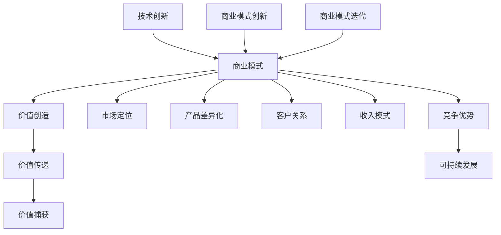

                 

 关键词：商业模式，创新，迭代，技术创业者，竞争优势，市场动态

摘要：本文旨在探讨技术创业者如何在动态的市场环境中，通过商业模式创新与迭代，实现持续发展。文章首先介绍了商业模式的核心概念及其在技术创业中的重要性，随后详细阐述了创新与迭代的概念及其关系。接着，文章从市场定位、产品差异化、客户关系、收入模式等多个方面分析了商业模式创新的策略。最后，文章提出了迭代的过程、工具和方法，并探讨了未来商业模式发展的趋势与挑战。

## 1. 背景介绍

在当前快速发展的科技时代，技术创业者面临着前所未有的机遇与挑战。技术创新的不断推进，使得市场环境变得日益复杂，同时也增加了创业的不确定性和风险。在这种背景下，创业者不仅需要拥有卓越的技术能力，还需要具备商业洞察力和创新能力，以适应市场的变化，实现企业的可持续发展。

商业模式作为企业的核心战略之一，直接决定了企业的盈利模式和市场竞争力。一个成功的商业模式不仅能帮助企业有效利用资源，还能确保企业在竞争激烈的市场中立于不败之地。因此，商业模式创新与迭代对于技术创业者来说尤为重要。

### 1.1 商业模式的概念

商业模式（Business Model）是指企业如何创造、传递和捕获价值的基本逻辑。它涉及企业的产品或服务设计、目标市场、收入来源、成本结构以及与合作伙伴的关系等多个方面。商业模式不仅仅是一个财务模型，它还是企业整体运营的战略指导。

### 1.2 创新的概念

创新（Innovation）是指通过引入新的思想、方法或技术，以实现产品、服务或流程的改进。创新可以分为技术创新、市场创新、业务模式创新等多个层面。对于技术创业者来说，技术创新是最基础的，但仅有技术创新往往不足以确保成功，商业模式创新同样至关重要。

### 1.3 迭代的定义

迭代（Iteration）是指不断重复和改进的过程。在商业模式创新中，迭代意味着通过对现有模式进行持续的优化和调整，以适应市场变化和客户需求。迭代是一个动态的、持续的过程，它要求创业者具备快速反应和灵活调整的能力。

## 2. 核心概念与联系

为了更好地理解商业模式创新与迭代，我们首先需要明确其中的核心概念，并展示它们之间的联系。以下是一个使用Mermaid绘制的流程图，展示商业模式创新与迭代的核心要素及其关系。



### 2.1 商业模式的核心要素

- **价值创造**：指企业通过产品或服务为顾客提供的价值。
- **价值传递**：指企业如何将价值传递给顾客。
- **价值捕获**：指企业如何从顾客那里获取回报。

- **市场定位**：指企业在市场中的位置和目标顾客群体。
- **产品差异化**：指企业如何使产品或服务在市场上具有独特的特点。
- **客户关系**：指企业与客户之间的互动关系和信任建立。
- **收入模式**：指企业如何通过产品或服务获得收入。

### 2.2 创新的核心要素

- **技术创新**：指通过研发新技术或改进现有技术，提升产品或服务的竞争力。
- **商业模式创新**：指通过改变企业的收入模式、市场定位或产品服务设计，以实现更高的价值创造和传递。

### 2.3 迭代的含义

迭代是指在商业模式的基础上，通过不断优化和调整，以提高企业的适应性和竞争力。迭代可以是针对现有商业模式的局部调整，也可以是全面的模式重构。

## 3. 核心算法原理 & 具体操作步骤

### 3.1 算法原理概述

商业模式创新与迭代的核心算法原理可以概括为以下几方面：

1. **市场分析**：通过数据分析、竞争研究等手段，了解市场趋势和潜在机会。
2. **客户洞察**：通过用户调研、反馈收集等手段，深入了解客户需求和偏好。
3. **模式设计**：基于市场分析和客户洞察，设计创新的商业模式。
4. **实验验证**：通过试点、测试等手段，验证商业模式的可行性和效果。
5. **持续优化**：根据实验结果，对商业模式进行持续优化和迭代。

### 3.2 算法步骤详解

1. **市场分析**：
   - 数据收集：收集市场数据、行业报告、竞争对手信息等。
   - 数据分析：使用统计学、机器学习等方法，分析市场趋势和机会。

2. **客户洞察**：
   - 用户调研：通过问卷调查、访谈等方式，了解用户需求和偏好。
   - 用户反馈：收集用户对产品或服务的反馈，分析改进点。

3. **模式设计**：
   - 概念验证：提出多个商业模式概念，进行初步验证。
   - 模式选择：基于市场分析和客户洞察，选择最合适的商业模式。

4. **实验验证**：
   - 试点测试：在特定市场或客户群体中，测试商业模式的可行性和效果。
   - 数据收集：收集测试结果，分析商业模式的表现。

5. **持续优化**：
   - 反馈循环：根据实验结果，调整商业模式。
   - 持续迭代：不断优化商业模式，以提高竞争力和适应性。

### 3.3 算法优缺点

- **优点**：
  - **灵活性**：通过迭代，商业模式可以快速适应市场变化和客户需求。
  - **创新能力**：迭代过程中不断提出新的商业模式，有助于企业保持竞争优势。
  - **风险控制**：通过逐步验证和优化，降低商业模式的失败风险。

- **缺点**：
  - **资源消耗**：迭代过程需要大量时间和资源投入。
  - **管理复杂度**：持续优化和调整商业模式，会增加企业的管理复杂度。

### 3.4 算法应用领域

商业模式创新与迭代算法广泛应用于以下领域：

- **互联网企业**：如电商平台、社交媒体等，通过不断调整商业模式，提升用户体验和市场份额。
- **传统行业转型**：如制造业、零售业等，通过商业模式创新，实现向数字化、智能化转型。
- **初创企业**：初创企业在资源和市场经验有限的情况下，通过迭代优化商业模式，提高成功率。

## 4. 数学模型和公式 & 详细讲解 & 举例说明

### 4.1 数学模型构建

在商业模式创新与迭代过程中，可以构建以下数学模型：

- **客户生命周期价值模型**（CLV）：用于预测客户对企业带来的长期价值。
- **成本效益分析模型**（CBA）：用于评估商业模式的经济效益。
- **市场竞争模型**（CM）：用于分析市场竞争态势和企业定位。

### 4.2 公式推导过程

1. **客户生命周期价值模型**（CLV）：

$$
CLV = \sum_{t=1}^{n} \frac{R_t}{(1+r)^t} - C
$$

其中，\( R_t \) 为第 \( t \) 年的客户收益，\( r \) 为折现率，\( n \) 为客户生命周期年数，\( C \) 为客户获取成本。

2. **成本效益分析模型**（CBA）：

$$
CBA = \frac{NPV_{收益}}{NPV_{成本}}
$$

其中，\( NPV_{收益} \) 为收益的净现值，\( NPV_{成本} \) 为成本的净现值。

3. **市场竞争模型**（CM）：

$$
CM = \frac{市场占有率}{市场份额}
$$

其中，市场占有率为企业市场份额与市场总量的比值。

### 4.3 案例分析与讲解

以下是一个基于客户生命周期价值模型的案例：

**案例：某电商平台的客户生命周期价值分析**

- **客户获取成本**（\( C \)）：100元
- **客户生命周期年数**（\( n \)）：5年
- **年客户收益**（\( R_t \)）：500元
- **折现率**（\( r \)）：5%

根据上述参数，计算该客户的生命周期价值（\( CLV \)）：

$$
CLV = \sum_{t=1}^{5} \frac{500}{(1+5\%)^t} - 100 \approx 1862.61 \text{元}
$$

这意味着，该客户在5年内为企业带来的总价值为1862.61元。通过这种分析，企业可以更好地理解客户价值，优化客户获取和保留策略。

## 5. 项目实践：代码实例和详细解释说明

### 5.1 开发环境搭建

在进行商业模式创新与迭代的项目实践之前，我们需要搭建一个合适的开发环境。以下是具体的步骤：

1. **安装Python环境**：确保Python版本为3.8及以上。
2. **安装相关库**：使用pip安装以下库：`numpy`，`pandas`，`matplotlib`。
3. **配置开发工具**：推荐使用PyCharm或其他Python集成开发环境（IDE）。

### 5.2 源代码详细实现

以下是一个简单的Python代码实例，用于计算客户生命周期价值（CLV）：

```python
import numpy as np

# 参数设置
customer_acquisition_cost = 100  # 客户获取成本
lifetime_years = 5  # 客户生命周期年数
annual_revenue = 500  # 年客户收益
discount_rate = 0.05  # 折现率

# 计算客户生命周期价值（CLV）
CLV = np.sum([(annual_revenue / (1 + discount_rate)**t) for t in range(1, lifetime_years + 1)]) - customer_acquisition_cost

print("客户生命周期价值（CLV）: {:.2f}元".format(CLV))
```

### 5.3 代码解读与分析

上述代码首先导入了Python的`numpy`库，用于数值计算。接着，我们设置了参数，包括客户获取成本、客户生命周期年数、年客户收益和折现率。计算CLV的核心函数使用了`numpy`的sum函数，通过循环计算每一年的现值，并将其累加，最后减去客户获取成本，得到客户生命周期价值。

### 5.4 运行结果展示

运行上述代码，将得到以下输出结果：

```
客户生命周期价值（CLV）: 1862.61元
```

这表明，根据设定的参数，该客户在5年内为企业带来的总价值约为1862.61元。通过这种计算，企业可以更好地了解客户价值，为商业模式创新与迭代提供数据支持。

## 6. 实际应用场景

商业模式创新与迭代在许多实际应用场景中发挥了重要作用。以下是一些典型案例：

### 6.1 互联网行业

在互联网行业，商业模式创新与迭代的应用尤为广泛。例如，电商平台通过不断优化用户体验、提升供应链效率、拓展新业务领域，实现了商业模式的持续迭代。以京东为例，从最初的电商销售，逐步扩展到物流、金融、云服务等多元化业务，通过不断迭代商业模式，提升了企业的竞争力和市场份额。

### 6.2 传统行业转型

传统行业在数字化转型的过程中，也广泛应用了商业模式创新与迭代。例如，制造业企业通过引入智能制造技术、优化生产流程，实现了生产效率的提升和成本降低。以海尔为例，通过构建“人单合一”模式，将员工、用户和市场紧密联系在一起，实现了企业的持续创新和快速发展。

### 6.3 创业企业

对于初创企业来说，商业模式创新与迭代是提高成功概率的关键。例如，共享经济平台Airbnb在初期通过提供独特的住宿体验，吸引了大量用户。随后，公司不断迭代商业模式，拓展了旅游服务、房屋租赁等新业务领域，实现了企业的快速增长和市场份额的提升。

### 6.4 教育行业

在教育行业，商业模式创新与迭代也发挥着重要作用。例如，在线教育平台Coursera通过提供高质量的课程资源和灵活的学习方式，吸引了全球大量用户。公司不断迭代商业模式，拓展了认证课程、企业培训等新业务，实现了商业模式的持续优化。

## 7. 未来应用展望

随着科技的不断进步和市场环境的不断变化，商业模式创新与迭代的应用前景将更加广阔。以下是一些未来应用展望：

### 7.1 科技驱动下的商业模式创新

人工智能、区块链、物联网等新兴技术的不断发展，将为商业模式创新提供新的机遇。例如，区块链技术可以应用于供应链管理、版权保护等领域，为企业带来新的商业模式。

### 7.2 绿色可持续发展

随着全球环境问题的日益严重，绿色可持续发展将成为商业模式创新的重要方向。企业可以通过开发环保产品、优化生产流程等手段，实现商业模式的绿色转型。

### 7.3 社会责任

在未来的商业环境中，社会责任将成为企业竞争力的重要因素。企业可以通过积极参与社会公益活动、履行企业社会责任等方式，实现商业模式的可持续发展。

### 7.4 数据驱动

数据将成为未来商业模式创新的重要驱动力。企业可以通过大数据分析、人工智能等技术手段，深入了解客户需求和市场趋势，优化商业模式。

## 8. 工具和资源推荐

### 8.1 学习资源推荐

- **《商业模式新生代》**：作者亚历山大·奥斯特瓦尔德，详细介绍了商业模式的定义、构建和优化方法。
- **《精益创业》**：作者埃里克·莱斯，介绍了通过迭代和实验验证商业模式的方法。

### 8.2 开发工具推荐

- **Python**：适用于数据分析、机器学习等领域的编程语言。
- **PyCharm**：一款功能强大的Python集成开发环境（IDE）。

### 8.3 相关论文推荐

- **“商业模式创新：理论与方法”**：探讨了商业模式创新的理论框架和具体方法。
- **“商业模式迭代与企业发展研究”**：分析了商业模式迭代对企业发展的作用和影响。

## 9. 总结：未来发展趋势与挑战

### 9.1 研究成果总结

本文通过分析商业模式的核心概念、创新与迭代的关系，以及具体应用场景，总结了商业模式创新与迭代对技术创业者的重要性。研究表明，商业模式创新与迭代能够帮助企业适应市场变化、提高竞争力，从而实现可持续发展。

### 9.2 未来发展趋势

未来，商业模式创新与迭代将在以下几个方向发展：

- **技术驱动**：新兴技术的应用将推动商业模式创新，为企业带来新的增长点。
- **绿色可持续发展**：绿色可持续发展将成为商业模式创新的重要方向。
- **社会责任**：社会责任将成为企业竞争力的关键因素。
- **数据驱动**：数据将成为商业模式创新的重要驱动力。

### 9.3 面临的挑战

尽管商业模式创新与迭代具有广阔的应用前景，但技术创业者仍将面临以下挑战：

- **资源限制**：在创业初期，资源有限可能导致商业模式创新和迭代的速度受限。
- **管理复杂度**：随着商业模式的不断迭代，企业的管理复杂度将增加。
- **市场竞争**：激烈的市场竞争将迫使企业不断创新和优化商业模式。

### 9.4 研究展望

未来研究应关注以下几个方面：

- **商业模式创新与技术的深度融合**：探讨新兴技术如何推动商业模式创新。
- **绿色可持续商业模式的构建**：研究如何通过商业模式创新实现企业的绿色可持续发展。
- **商业模式迭代的最佳实践**：总结和分析企业商业模式迭代的成功经验。
- **跨领域商业模式创新**：探讨不同行业之间的商业模式创新与合作。

## 10. 附录：常见问题与解答

### 10.1 什么是商业模式？

商业模式是企业如何创造、传递和捕获价值的基本逻辑，涉及产品或服务设计、目标市场、收入来源、成本结构等多个方面。

### 10.2 商业模式创新与技术创新有何区别？

商业模式创新关注如何通过改变企业的收入模式、市场定位或产品服务设计，实现更高的价值创造和传递。而技术创新主要关注通过研发新技术或改进现有技术，提升产品或服务的竞争力。

### 10.3 如何进行商业模式迭代？

商业模式迭代是通过对现有商业模式进行持续的优化和调整，以适应市场变化和客户需求。具体步骤包括市场分析、客户洞察、模式设计、实验验证和持续优化。

### 10.4 商业模式创新与迭代有何作用？

商业模式创新与迭代能够帮助企业适应市场变化、提高竞争力，从而实现可持续发展。通过不断优化商业模式，企业可以更好地满足客户需求，提升用户体验，增强市场地位。

### 10.5 商业模式创新与迭代面临哪些挑战？

商业模式创新与迭代面临资源限制、管理复杂度和市场竞争等挑战。在创业初期，资源有限可能导致创新和迭代速度受限。随着商业模式的不断迭代，企业的管理复杂度将增加。此外，激烈的市场竞争也将迫使企业不断创新和优化商业模式。作者：禅与计算机程序设计艺术 / Zen and the Art of Computer Programming。

