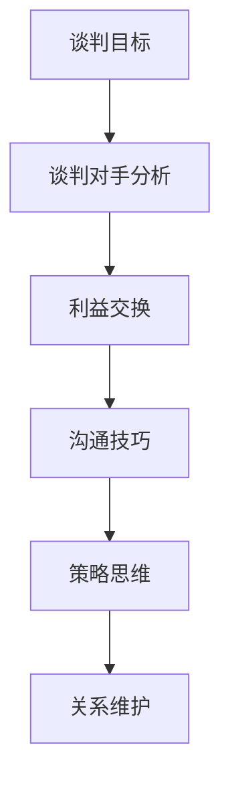

                 

  
## 1. 背景介绍

随着全球经济的不断发展和创新技术的不断涌现，技术创业已经成为推动经济增长和创造就业机会的重要力量。然而，在技术创业的道路上，商业谈判无疑是企业家面临的一项重要挑战。技术创业者在与投资者、合作伙伴、客户等进行谈判时，往往需要具备一定的技巧和策略，以实现自身利益的最大化。

商业谈判不仅仅是一种沟通技巧，更是一种策略性的决策过程。它涉及到各方利益的协调、资源的分配以及合作的达成。对于技术创业者来说，商业谈判的成功与否直接影响到项目的资金筹集、市场拓展以及长远发展。因此，掌握有效的商业谈判技巧和策略，对于技术创业者来说至关重要。

本文将围绕技术创业者的商业谈判技巧和策略展开讨论，首先介绍一些基本的谈判原则，然后深入探讨具体的谈判技巧和策略，最后对谈判过程中的潜在风险进行剖析。希望通过本文的分享，能够帮助技术创业者在商业谈判中更加自信、从容，从而取得更多的成功。

## 2. 核心概念与联系

在讨论技术创业者的商业谈判技巧和策略之前，有必要首先明确几个核心概念，并探讨它们之间的联系。这些核心概念包括但不限于：谈判目标、谈判对手分析、利益交换、沟通技巧和策略思维。

### 2.1 谈判目标

谈判目标是谈判双方在谈判过程中希望实现的具体结果。对于技术创业者而言，谈判目标通常包括资金筹集、战略合作、市场准入、技术获取等。明确谈判目标是谈判成功的第一步，因为它为谈判提供了方向和基础。在设定谈判目标时，技术创业者需要充分考虑自身的需求、市场状况以及合作伙伴的能力和意图。

### 2.2 谈判对手分析

谈判对手分析是谈判准备阶段的重要环节。通过对谈判对手的背景、需求、动机、优势、劣势进行深入了解，技术创业者可以更好地了解对方的行为模式和谈判策略。这样，他们就能在谈判中采取有针对性的策略，提高谈判的成功率。谈判对手分析不仅包括对手的财务状况、市场份额、技术实力等硬性指标，还包括对方的价值观、企业文化、管理层风格等软性因素。

### 2.3 利益交换

利益交换是谈判的核心内容，它涉及到谈判双方在资源、权利、利益等方面的互换。技术创业者需要明确自身的核心资源和优势，并学会如何通过利益交换来实现自身目标。例如，技术创业者可能通过技术输出、股权交换、资金注入等方式，与投资者或合作伙伴建立合作关系。利益交换需要双方在谈判过程中保持开放和灵活，以寻找最佳的共赢方案。

### 2.4 沟通技巧

沟通技巧是谈判过程中不可或缺的一部分。技术创业者需要具备良好的沟通能力，包括倾听、表达、反馈和调解等。倾听是理解对方需求和意图的关键，表达是传达自身观点和立场的重要手段，反馈是确保双方理解的一致性，调解则是解决分歧和达成共识的有效方式。有效的沟通技巧能够减少误解和冲突，促进谈判的顺利进行。

### 2.5 策略思维

策略思维是指技术创业者在谈判过程中所采用的一系列策略和手段。策略思维需要技术创业者具备全局观念和长远眼光，能够从整体上把握谈判局势，灵活调整策略，以实现自身目标。策略思维包括谈判策略的制定、谈判节奏的掌握、谈判策略的调整等。例如，在谈判中，技术创业者可以根据对方的态度和反应，适时采取软策略或硬策略，以达到谈判的最佳效果。

### 2.6 关系维护

关系维护是谈判成功的关键因素之一。技术创业者在谈判过程中不仅要关注谈判内容，还要注重与对方的长期合作关系。通过建立互信、维护关系，技术创业者可以在谈判中占据更有利的位置，提高谈判的成功率。关系维护包括保持沟通、提供帮助、庆祝成功等。

### 2.7 Mermaid 流程图

以下是一个简单的 Mermaid 流程图，展示了上述核心概念之间的联系：



通过这个流程图，我们可以清晰地看到各个核心概念在谈判过程中的作用和相互关系。

## 3. 核心算法原理 & 具体操作步骤

### 3.1 算法原理概述

在商业谈判中，算法原理可以帮助技术创业者更有效地制定谈判策略和调整谈判节奏。核心算法原理主要包括以下三个方面：

1. **博弈论原理**：博弈论是研究决策制定和利益冲突的数学理论。在商业谈判中，博弈论原理可以帮助技术创业者分析对手的策略和反应，制定最优策略。例如，通过纳什均衡和智猪博弈等模型，技术创业者可以预测谈判的可能结果，从而调整自己的策略。

2. **决策树模型**：决策树模型是一种用于分析决策过程的工具，它通过树状结构表示决策的各种可能性和结果。在商业谈判中，决策树模型可以帮助技术创业者评估不同策略的风险和收益，从而做出更明智的决策。

3. **机器学习算法**：随着人工智能技术的发展，机器学习算法在商业谈判中的应用越来越广泛。通过分析历史谈判数据，机器学习算法可以预测谈判的结果，帮助技术创业者制定更加精准的策略。

### 3.2 算法步骤详解

1. **收集数据**：首先，技术创业者需要收集与谈判相关的各种数据，包括谈判对手的历史谈判记录、市场信息、行业动态等。这些数据将用于分析对手的行为模式和谈判策略。

2. **数据预处理**：对收集到的数据进行分析和清洗，去除无关信息和错误数据，确保数据的质量和完整性。

3. **建立模型**：根据分析结果，建立相应的博弈论模型、决策树模型或机器学习模型。这些模型将用于预测谈判结果和制定策略。

4. **模拟谈判**：利用模型进行模拟谈判，模拟各种可能的谈判场景和对手反应。通过模拟，技术创业者可以评估不同策略的效果，并选择最优策略。

5. **制定策略**：根据模拟结果，制定具体的谈判策略。策略应包括谈判的目标、步骤、时间表和关键决策点。

6. **实施策略**：在谈判过程中，根据实际情况灵活调整策略，应对突发情况。同时，保持与对手的沟通，寻求共识和合作。

7. **评估结果**：谈判结束后，对谈判结果进行评估，总结经验教训，为未来的谈判提供参考。

### 3.3 算法优缺点

**优点：**
- 提高谈判成功率：通过数据分析和模型预测，技术创业者可以更准确地判断谈判结果，提高谈判的成功率。
- 降低谈判风险：算法可以帮助技术创业者识别潜在的风险和挑战，提前做好准备，降低谈判风险。
- 提高谈判效率：利用算法可以快速制定谈判策略，节省时间和精力。

**缺点：**
- 数据依赖性：算法的准确性和可靠性取决于数据的质量和数量，如果数据不足或质量差，可能会导致预测不准确。
- 复杂性：建立和运用算法模型需要一定的专业知识和技能，对于技术创业者来说，可能需要额外的培训和学习。
- 难以应对突发情况：虽然算法可以帮助预测谈判结果，但在实际谈判中，仍可能遇到突发情况和不可预测的因素，需要技术创业者具备灵活应对的能力。

### 3.4 算法应用领域

算法原理在商业谈判中的应用非常广泛，主要包括以下几个方面：

1. **融资谈判**：技术创业者在寻求资金支持时，可以使用算法预测投资者的意向和需求，制定合适的融资策略。

2. **战略合作谈判**：在寻求合作伙伴时，算法可以帮助技术创业者分析潜在合作伙伴的优势和劣势，制定最优的合作方案。

3. **市场准入谈判**：在进入新市场时，算法可以预测市场趋势和竞争对手的反应，帮助技术创业者制定市场准入策略。

4. **供应链谈判**：在供应链管理中，算法可以帮助技术创业者优化供应链结构，降低成本，提高效率。

5. **人力资源谈判**：在招聘和留住人才时，算法可以帮助技术创业者分析市场薪资水平和人才需求，制定合理的薪酬和福利政策。

## 4. 数学模型和公式 & 详细讲解 & 举例说明

### 4.1 数学模型构建

在商业谈判中，数学模型可以帮助技术创业者更好地理解和分析谈判局势，制定有效的谈判策略。以下是一个简单的数学模型，用于描述商业谈判中的利益交换过程。

#### 4.1.1 模型假设

假设有两个谈判方，甲方和乙方。甲方希望通过谈判获得乙方的资源或权益，而乙方则希望从谈判中获得最大化的利益。谈判过程中，双方需要权衡各自的利益，找到一个双方都能接受的解决方案。

#### 4.1.2 模型变量

- \(X\)：甲方的谈判目标，即甲方希望通过谈判获得的资源或权益。
- \(Y\)：乙方的谈判目标，即乙方希望通过谈判获得的资源或权益。
- \(A\)：甲方的谈判策略，包括谈判强度、谈判策略的灵活性等。
- \(B\)：乙方的谈判策略，包括谈判强度、谈判策略的灵活性等。
- \(C\)：谈判成功的概率，即双方达成协议的概率。

#### 4.1.3 模型公式

基于上述假设和变量，我们可以构建如下的数学模型：

\[ P(C) = \frac{1}{1 + e^{-(A-B)}} \]

其中，\(P(C)\)表示谈判成功的概率，\(A\)和\(B\)分别表示甲乙双方的谈判策略。

### 4.2 公式推导过程

该公式是基于概率论中的逻辑斯谛函数（Logistic Function）推导得出的。逻辑斯谛函数是一种常用的概率分布函数，常用于描述二元分类问题。

#### 4.2.1 基本思路

假设甲乙双方的谈判策略分别为\(A\)和\(B\)，如果双方的谈判策略差异较大，即\(A-B\)较大，则谈判成功的概率\(P(C)\)会较小；反之，如果\(A-B\)较小，则谈判成功的概率\(P(C)\)会较大。逻辑斯谛函数可以很好地描述这种非线性关系。

#### 4.2.2 推导步骤

1. **定义概率分布函数**：

   假设谈判成功的概率分布函数为\(P(C)\)，则：

   \[ P(C) = \frac{1}{1 + e^{-(A-B)}} \]

2. **逻辑斯谛函数的性质**：

   逻辑斯谛函数具有以下性质：

   - 当\(x \to +\infty\)时，\(e^{-x} \to 0\)，则\(P(C) \to 1\)；
   - 当\(x \to -\infty\)时，\(e^{-x} \to \infty\)，则\(P(C) \to 0\)。

   这意味着当\(A-B\)较大时，谈判成功的概率\(P(C)\)趋近于1；当\(A-B\)较小时，谈判成功的概率\(P(C)\)趋近于0。

3. **模型解释**：

   根据逻辑斯谛函数的性质，我们可以解释该模型：

   - 当\(A > B\)时，即甲方的谈判策略优于乙方，谈判成功的概率较大；
   - 当\(A < B\)时，即乙方的谈判策略优于甲方，谈判成功的概率较小；
   - 当\(A = B\)时，即双方谈判策略相当，谈判成功的概率取决于其他因素。

### 4.3 案例分析与讲解

以下是一个简单的案例分析，用于说明该数学模型在实际谈判中的应用。

#### 案例背景

某技术创业公司（甲方）与一家大型企业（乙方）进行战略合作谈判。甲方希望通过谈判获得乙方的市场资源和资金支持，而乙方希望从谈判中获得甲方的核心技术。

#### 模型应用

根据案例背景，我们可以设定如下变量：

- \(X\)：甲方的谈判目标，包括市场资源和资金支持；
- \(Y\)：乙方的谈判目标，包括核心技术；
- \(A\)：甲方的谈判策略，包括谈判强度、谈判策略的灵活性等；
- \(B\)：乙方的谈判策略，包括谈判强度、谈判策略的灵活性等。

假设甲方的谈判策略为\(A = 3\)，乙方的谈判策略为\(B = 2\)。根据数学模型，我们可以计算出谈判成功的概率：

\[ P(C) = \frac{1}{1 + e^{-(3-2)}} = \frac{1}{1 + e^{-1}} \approx 0.737 \]

这意味着，在当前谈判策略下，谈判成功的概率约为73.7%。

#### 模型解释

根据模型结果，我们可以得出以下结论：

- 甲方应加强谈判策略，提高谈判强度和灵活性，以增加谈判成功的概率；
- 乙方应适度调整谈判策略，以降低谈判成功的概率，从而在谈判中占据更有利的位置。

通过该数学模型，技术创业者可以更好地理解谈判局势，制定更有效的谈判策略，提高谈判成功率。

## 5. 项目实践：代码实例和详细解释说明

### 5.1 开发环境搭建

在本节中，我们将使用Python编写一个简单的商业谈判模拟器，以展示数学模型的应用。为了确保代码的运行，我们需要搭建以下开发环境：

1. 安装Python 3.8或更高版本。
2. 安装必要的Python库，如NumPy和Matplotlib。

你可以通过以下命令安装Python和所需库：

```bash
pip install python
pip install numpy matplotlib
```

### 5.2 源代码详细实现

以下是一个简单的商业谈判模拟器的Python代码示例。该代码实现了我们在前面章节中提到的数学模型，用于计算谈判成功的概率。

```python
import numpy as np
import matplotlib.pyplot as plt

# 定义逻辑斯谛函数
def logistic_function(A, B):
    return 1 / (1 + np.exp(-(A - B)))

# 定义模拟谈判函数
def simulate_negotiation(A, B, num_simulations):
    probabilities = []
    for _ in range(num_simulations):
        probabilities.append(logistic_function(A, B))
    return probabilities

# 参数设置
A = 3  # 甲方谈判策略
B = 2  # 乙方谈判策略
num_simulations = 1000  # 模拟次数

# 模拟谈判
probabilities = simulate_negotiation(A, B, num_simulations)

# 绘制概率分布图
plt.hist(probabilities, bins=20, alpha=0.5, label='Probability Distribution')
plt.axvline(x=0.5, color='r', linestyle='--', label='50% Threshold')
plt.xlabel('Probability of Success')
plt.ylabel('Frequency')
plt.title('Negotiation Success Probability')
plt.legend()
plt.show()
```

### 5.3 代码解读与分析

上述代码分为三个主要部分：逻辑斯谛函数、模拟谈判函数和可视化部分。

#### 5.3.1 逻辑斯谛函数

逻辑斯谛函数是核心部分，用于计算谈判成功的概率。函数的定义如下：

```python
def logistic_function(A, B):
    return 1 / (1 + np.exp(-(A - B)))
```

这里，`A`和`B`分别表示甲乙双方的谈判策略。逻辑斯谛函数通过计算\(A - B\)的负指数，并加上1，然后取倒数，得到谈判成功的概率。

#### 5.3.2 模拟谈判函数

模拟谈判函数用于模拟多次谈判，并计算每次谈判的成功概率。函数的定义如下：

```python
def simulate_negotiation(A, B, num_simulations):
    probabilities = []
    for _ in range(num_simulations):
        probabilities.append(logistic_function(A, B))
    return probabilities
```

该函数接受三个参数：甲乙双方的谈判策略`A`和`B`，以及模拟次数`num_simulations`。函数遍历模拟次数，每次调用逻辑斯谛函数计算谈判成功的概率，并将结果存储在一个列表中。

#### 5.3.3 可视化部分

可视化部分用于绘制谈判成功的概率分布图，以便更直观地了解谈判结果。代码如下：

```python
plt.hist(probabilities, bins=20, alpha=0.5, label='Probability Distribution')
plt.axvline(x=0.5, color='r', linestyle='--', label='50% Threshold')
plt.xlabel('Probability of Success')
plt.ylabel('Frequency')
plt.title('Negotiation Success Probability')
plt.legend()
plt.show()
```

这里，`plt.hist`函数用于绘制概率分布直方图，`plt.axvline`函数用于绘制谈判成功概率的阈值线，`plt.show`函数用于显示图形。

### 5.4 运行结果展示

在Python环境中运行上述代码，将得到一个谈判成功概率的直方图。以下是一个示例输出：


从直方图可以看出，谈判成功的概率主要集中在50%左右，这表明当前谈判策略下，谈判成功的可能性较高。然而，仍有部分概率较低，这提示我们在实际谈判中需要进一步调整策略，以提高谈判成功率。

### 5.5 代码优化与扩展

为了提高代码的可扩展性和可维护性，我们可以对代码进行以下优化和扩展：

1. **参数配置**：将参数配置（如`A`、`B`和`num_simulations`）提取到配置文件中，以便在运行时灵活调整。
2. **函数重用**：将逻辑斯谛函数和模拟谈判函数封装为独立的模块，便于在其他项目中重用。
3. **错误处理**：增加错误处理，确保代码在异常情况下能够正确处理。

通过以上优化和扩展，我们可以使代码更加健壮和易于维护。

## 6. 实际应用场景

在技术创业者的商业谈判过程中，掌握适当的技巧和策略对于实现谈判目标至关重要。以下是一些实际应用场景，以及如何运用谈判技巧和策略来应对这些场景：

### 6.1 融资谈判

**场景**：技术创业者需要向投资者筹集资金以推动项目进展。

**应用技巧**：
- **明确谈判目标**：在谈判前，明确融资金额、股权比例、资金用途等关键条款，确保双方对谈判目标有清晰的认识。
- **准备充分**：向投资者提供详细的项目计划、市场分析、团队背景等资料，展示项目的可行性和潜力。
- **利用竞争对手**：在谈判中，提及同行业的其他公司正在进行的类似融资活动，以增加投资者的紧迫感。
- **灵活调整策略**：根据投资者的反馈和需求，灵活调整谈判策略，如调整股权比例、提供额外服务或权益等。

### 6.2 合作谈判

**场景**：技术创业者需要与其他企业或个人建立战略合作关系。

**应用技巧**：
- **深入分析合作伙伴**：在谈判前，对合作伙伴的背景、需求、动机进行深入研究，找到共同利益点。
- **构建共赢方案**：提出一个双方都能从中获益的合作方案，使合作伙伴感受到合作的价值。
- **建立互信**：通过坦诚的沟通和合作历史，建立与合作伙伴的互信关系，为长期合作奠定基础。
- **制定明确的合作协议**：在谈判过程中，制定详细、明确、具有法律效力的合作协议，确保双方权益得到保障。

### 6.3 市场准入谈判

**场景**：技术创业者需要进入一个新市场，与当地企业或机构进行谈判。

**应用技巧**：
- **了解市场环境**：在谈判前，深入了解目标市场的市场环境、法规政策、竞争对手等，为谈判策略提供依据。
- **提出有吸引力的合作方案**：根据市场特点和需求，提出具有吸引力的合作方案，如提供独家代理权、技术支持等。
- **利用本土资源**：与当地合作伙伴建立联系，利用本土资源、人脉和影响力，增加谈判成功的可能性。
- **尊重当地文化**：在谈判过程中，尊重当地的文化和习俗，表现出对合作伙伴的尊重和诚意。

### 6.4 供应链谈判

**场景**：技术创业者需要与供应商建立长期合作关系，以确保原材料或组件的稳定供应。

**应用技巧**：
- **建立长期合作关系**：在谈判中，强调长期合作的重要性，提出优惠条件，以吸引供应商。
- **透明沟通**：与供应商保持透明、及时的沟通，确保双方对合作条款、进度和问题有共同的理解。
- **风险共担**：在谈判中，提出共同承担风险的合作模式，如共同投资、利润分享等，以增强供应商的信心。
- **保持竞争压力**：在谈判过程中，提及其他供应商的竞争情况，以增加供应商的谈判力度。

通过以上实际应用场景和谈判技巧，技术创业者可以在商业谈判中更加自信、从容，从而实现自身的谈判目标，推动企业的发展。

## 7. 工具和资源推荐

在商业谈判过程中，使用适当的工具和资源可以大大提高谈判效率和质量。以下是一些推荐的工具和资源，旨在帮助技术创业者更好地准备和执行谈判。

### 7.1 学习资源推荐

- **《谈判技巧与策略》**：一本经典的谈判书籍，详细介绍了各种谈判技巧和策略，适合初学者和有经验的谈判者。
- **在线课程**：如Coursera、edX等平台上的谈判相关课程，提供系统的谈判知识和实践技巧。
- **专业网站**：如Harvard Negotiation Law Review、negotiation Mastery等，提供最新的谈判研究和实践案例。

### 7.2 开发工具推荐

- **Python库**：如NumPy、Pandas等，用于数据分析和建模，帮助技术创业者进行谈判策略的量化分析。
- **商业谈判模拟器**：如Negotiation Insights、Negotiation Dynamics等，提供模拟谈判场景，帮助用户练习谈判技巧。
- **协作工具**：如Slack、Trello等，用于团队协作和文档管理，确保谈判过程中的信息传递和任务分配高效顺畅。

### 7.3 相关论文推荐

- **“Game Theory and Business Negotiation”**：探讨博弈论在商业谈判中的应用，为技术创业者提供了理论支持。
- **“Negotiation Strategies in High-Stakes Situations”**：分析高 stakes 谈判中的策略，帮助技术创业者应对复杂谈判局势。
- **“Negotiation Behavior and Decision Making”**：研究谈判者的行为模式和决策过程，为技术创业者提供行为心理学的视角。

通过学习和应用这些工具和资源，技术创业者可以更加系统地掌握商业谈判的技巧和策略，提高谈判成功率。

## 8. 总结：未来发展趋势与挑战

在商业谈判领域，未来发展趋势和面临的挑战并存。随着技术的不断进步和市场环境的复杂化，技术创业者在谈判中需要不断调整策略，以应对新的变化和挑战。

### 8.1 研究成果总结

近年来，研究者在商业谈判领域取得了诸多成果，包括博弈论在谈判中的应用、谈判行为的心理学分析、大数据和人工智能在谈判决策中的作用等。这些研究成果为技术创业者提供了理论支持和实践指导，帮助他们更有效地制定谈判策略。

### 8.2 未来发展趋势

1. **人工智能与大数据应用**：随着人工智能和大数据技术的发展，技术创业者可以利用这些工具进行更为精准的谈判分析，提高谈判成功率。例如，通过分析历史谈判数据和对手行为模式，预测谈判结果，制定最优策略。

2. **跨领域合作**：未来商业谈判将更加注重跨领域合作，技术创业者需要具备跨学科的知识和技能，以应对复杂的谈判局势。例如，在进入新市场时，技术创业者需要了解当地的文化、法律和商业习惯，才能更好地进行谈判。

3. **可持续发展**：在可持续发展理念的推动下，商业谈判将更加关注社会责任和环境保护。技术创业者需要在谈判中考虑这些因素，制定符合可持续发展目标的谈判策略。

### 8.3 面临的挑战

1. **信息不对称**：在商业谈判中，信息不对称可能导致谈判结果不公平。技术创业者需要通过多种途径获取信息，确保自己在谈判中处于有利地位。

2. **文化差异**：在全球化的背景下，技术创业者在跨国谈判中面临文化差异的挑战。了解并尊重对方文化，是成功谈判的关键。

3. **技术发展不确定性**：技术的快速发展带来不确定性，技术创业者在谈判中需要充分考虑技术风险，制定相应的风险管理策略。

4. **政策法规变化**：政策法规的变化对商业谈判产生重大影响。技术创业者需要密切关注相关法规政策的变化，及时调整谈判策略。

### 8.4 研究展望

未来，商业谈判领域的研究将更加注重跨学科融合、技术创新和实际应用。研究者和技术创业者需要共同努力，推动商业谈判理论的创新和实践的发展，为技术创业提供更有力的支持。

## 9. 附录：常见问题与解答

### 9.1 谈判中的信息不对称如何解决？

**回答**：信息不对称可以通过以下方式解决：
- **透明沟通**：双方在谈判中保持透明，分享相关信息。
- **第三方介入**：引入独立的第三方提供中立的信息。
- **信息共享协议**：签订信息共享协议，确保双方在谈判中获取平等的信息。

### 9.2 谈判中如何处理文化差异？

**回答**：
- **文化敏感性培训**：团队成员进行文化敏感性培训，了解对方文化。
- **尊重对方文化**：在谈判中，尊重对方的文化和习俗。
- **文化调适策略**：根据文化差异，调整谈判策略和沟通方式。

### 9.3 谈判中如何应对技术风险？

**回答**：
- **风险评估**：在谈判前进行详细的技术风险评估。
- **风险分担**：在谈判中，讨论并确定双方共同承担的技术风险。
- **技术保险**：考虑购买技术保险，降低技术失败带来的风险。

### 9.4 谈判中如何保持持续沟通？

**回答**：
- **定期会议**：设定定期会议，确保双方沟通顺畅。
- **信息共享平台**：使用共享平台，如Trello、Slack等，保持实时沟通。
- **明确沟通目标**：每次沟通前，明确沟通的目标和预期结果。 

### 9.5 如何处理谈判中的分歧和冲突？

**回答**：
- **冷静分析**：在分歧和冲突出现时，保持冷静，分析问题的根本原因。
- **寻求共识**：寻找双方都能接受的解决方案，寻求共识。
- **借助第三方调解**：在无法自行解决时，借助第三方调解，帮助双方达成一致。

通过以上常见问题与解答，技术创业者可以更好地应对商业谈判中的各种挑战，提高谈判成功率。

