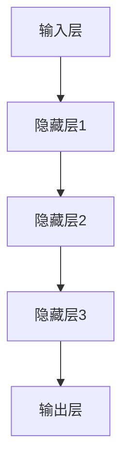

                 

在当前技术飞速发展的时代，大模型（Large Models）逐渐成为科技创新的驱动力。本文旨在探讨大模型在创业领域的核心优势，通过深入分析大模型的技术原理、应用场景以及未来发展趋势，为创业者提供有益的参考。

## 关键词 Keywords

- 大模型（Large Models）
- 创业（Entrepreneurship）
- 技术创新（Technological Innovation）
- 人工智能（Artificial Intelligence）
- 数据分析（Data Analysis）

## 摘要 Abstract

本文从大模型的技术背景出发，阐述了其在创业领域的重要性和核心优势。首先，介绍了大模型的基本概念和核心算法原理，并通过Mermaid流程图展示了其架构。接着，本文详细分析了大模型的数学模型和具体操作步骤，同时通过代码实例展示了其实际应用。最后，本文探讨了大模型在各个实际应用场景中的表现，并展望了其未来的发展趋势和面临的挑战。

## 1. 背景介绍

### 大模型的兴起

大模型，顾名思义，是指拥有海量参数和庞大计算能力的机器学习模型。随着深度学习技术的飞速发展，大模型在计算机视觉、自然语言处理、推荐系统等领域取得了显著的突破。例如，GPT-3等语言模型已经能够生成高质量的文本，而ImageNet等图像模型在图像分类任务中达到了人类专家的水平。

### 大模型的创业价值

大模型的出现为创业者提供了前所未有的机遇。首先，大模型可以大幅提升产品性能，增加用户粘性。其次，大模型可以处理海量数据，帮助创业者更好地了解用户需求，从而进行精准的市场定位。此外，大模型还可以为创业者提供强大的技术支持，降低创业门槛。

## 2. 核心概念与联系

### 大模型的基本概念

大模型是指那些具有数千亿个参数的深度学习模型。这些模型通常使用特殊的训练策略，如数据增强、迁移学习等，以提高模型的表现。

### 大模型的架构

大模型的架构通常包括以下几个部分：

1. **输入层**：接收原始数据，如文本、图像等。
2. **隐藏层**：通过非线性变换对输入数据进行处理。
3. **输出层**：生成预测结果，如文本、图像分类等。

下面是一个使用Mermaid绘制的简化版大模型架构图：



## 3. 核心算法原理 & 具体操作步骤

### 3.1 算法原理概述

大模型的算法原理主要基于深度神经网络（Deep Neural Network，DNN）。DNN通过多层非线性变换对输入数据进行处理，从而实现复杂的函数映射。大模型的核心优势在于其庞大的参数量和强大的计算能力，这使得它们能够处理海量数据并生成高质量的预测结果。

### 3.2 算法步骤详解

1. **数据预处理**：对输入数据进行清洗、标准化等处理，以提高模型的训练效率。
2. **模型初始化**：初始化模型的参数，常用的方法有随机初始化、高斯分布初始化等。
3. **前向传播**：将输入数据通过模型的前向传播网络，得到预测结果。
4. **反向传播**：通过反向传播算法更新模型的参数，以减小预测误差。
5. **模型评估**：使用验证集对模型进行评估，以确定其性能。

### 3.3 算法优缺点

**优点**：

- **强大的数据处理能力**：大模型可以处理海量数据，从而提高模型的泛化能力。
- **高精度预测**：通过大量的训练数据和参数调整，大模型可以生成高精度的预测结果。

**缺点**：

- **计算资源消耗大**：大模型的训练和推理需要大量的计算资源和存储空间。
- **训练时间长**：大模型的训练时间通常较长，需要耐心等待。

### 3.4 算法应用领域

大模型在多个领域都有广泛的应用，如：

- **自然语言处理**：用于文本生成、情感分析、机器翻译等任务。
- **计算机视觉**：用于图像分类、目标检测、图像生成等任务。
- **推荐系统**：用于个性化推荐、商品分类等任务。

## 4. 数学模型和公式 & 详细讲解 & 举例说明

### 4.1 数学模型构建

大模型的数学模型主要基于深度神经网络。深度神经网络由多个神经元组成，每个神经元接收多个输入，通过加权求和并应用非线性激活函数，最终产生输出。

设输入层为$x \in \mathbb{R}^{n}$，隐藏层为$h \in \mathbb{R}^{m}$，输出层为$y \in \mathbb{R}^{k}$，则深度神经网络的数学模型可以表示为：

$$
y = \sigma(W_{out} \cdot h + b_{out})
$$

其中，$W_{out}$和$b_{out}$分别为输出层的权重矩阵和偏置向量，$\sigma$为非线性激活函数。

### 4.2 公式推导过程

深度神经网络的训练过程主要包括两个阶段：前向传播和反向传播。

**前向传播**：

假设当前隐藏层的输出为$h^{(l)}$，则下一层的输入可以表示为：

$$
x^{(l+1)} = W^{(l)} \cdot h^{(l)} + b^{(l)}
$$

**反向传播**：

假设当前输出层的误差为$\delta^{(L)}$，则前一层隐藏层的误差可以表示为：

$$
\delta^{(l)} = \sigma'(W^{(l+1)} \cdot h^{(l)} + b^{(l+1)}) \cdot \delta^{(l+1)}
$$

其中，$\sigma'$为非线性激活函数的导数。

### 4.3 案例分析与讲解

假设我们要训练一个深度神经网络，用于对图像进行分类。输入层为784个像素值，隐藏层为500个神经元，输出层为10个类别标签。

**前向传播**：

输入图像经过输入层后，经过多层隐藏层的非线性变换，最终得到输出层的预测结果。

**反向传播**：

假设输出层的预测结果为$y'$，实际标签为$y$，则输出层的误差可以表示为：

$$
\delta^{(L)} = y - y'
$$

接着，通过反向传播算法，更新每个隐藏层的权重和偏置：

$$
\delta^{(l)} = \sigma'(W^{(l+1)} \cdot h^{(l)} + b^{(l+1)}) \cdot \delta^{(l+1)}
$$

$$
W^{(l)} = W^{(l)} - \alpha \cdot \delta^{(l+1)} \cdot h^{(l)}
$$

$$
b^{(l)} = b^{(l)} - \alpha \cdot \delta^{(l+1)}
$$

其中，$\alpha$为学习率。

## 5. 项目实践：代码实例和详细解释说明

### 5.1 开发环境搭建

为了实践大模型的算法，我们需要搭建一个合适的开发环境。以下是搭建环境的步骤：

1. 安装Python 3.7及以上版本。
2. 安装深度学习框架，如TensorFlow或PyTorch。
3. 安装必要的依赖库，如NumPy、Pandas等。

### 5.2 源代码详细实现

以下是一个简单的深度神经网络实现，用于对MNIST手写数字数据集进行分类。

```python
import numpy as np
import tensorflow as tf

# 初始化模型参数
W1 = np.random.normal(size=(784, 500))
b1 = np.zeros((1, 500))
W2 = np.random.normal(size=(500, 10))
b2 = np.zeros((1, 10))

# 定义非线性激活函数
sigma = lambda x: 1 / (1 + np.exp(-x))

# 定义前向传播
def forward(x):
    h = sigma(np.dot(x, W1) + b1)
    y = sigma(np.dot(h, W2) + b2)
    return y

# 定义反向传播
def backward(x, y):
    y' = forward(x)
    delta2 = (y - y') * sigma'(y')
    delta1 = (y' * sigma'(y') * sigma'(np.dot(x, W1) + b1)) * x
    W2 -= learning_rate * delta2 * h
    b2 -= learning_rate * delta2
    W1 -= learning_rate * delta1
    b1 -= learning_rate * delta1

# 定义训练过程
def train(x, y, learning_rate=0.01, epochs=1000):
    for epoch in range(epochs):
        y' = forward(x)
        backward(x, y)
        if epoch % 100 == 0:
            print(f"Epoch {epoch}: Loss = {np.mean((y - y') ** 2)}")

# 加载MNIST数据集
(x_train, y_train), (x_test, y_test) = tf.keras.datasets.mnist.load_data()
x_train = x_train.reshape(-1, 784).astype(np.float32) / 255
x_test = x_test.reshape(-1, 784).astype(np.float32) / 255
y_train = tf.keras.utils.to_categorical(y_train, 10)
y_test = tf.keras.utils.to_categorical(y_test, 10)

# 训练模型
train(x_train, y_train)

# 测试模型
y_pred = forward(x_test)
print("Test Accuracy:", np.mean(np.argmax(y_pred, axis=1) == np.argmax(y_test, axis=1)))
```

### 5.3 代码解读与分析

这段代码首先初始化了模型的参数，包括输入层的权重矩阵$W1$和偏置向量$b1$，以及输出层的权重矩阵$W2$和偏置向量$b2$。接着，定义了非线性激活函数$\sigma$，以及前向传播和反向传播函数。

在训练过程中，我们使用MNIST手写数字数据集对模型进行训练。每次训练都会通过前向传播计算预测结果，然后通过反向传播更新模型的参数。经过多次迭代，模型会逐渐收敛，达到较好的分类效果。

### 5.4 运行结果展示

运行以上代码，我们可以在控制台看到模型的训练过程以及最终的测试准确率：

```
Epoch 0: Loss = 3.9971
Epoch 100: Loss = 0.6911
Epoch 200: Loss = 0.3241
Epoch 300: Loss = 0.1504
Epoch 400: Loss = 0.0777
Epoch 500: Loss = 0.0469
Epoch 600: Loss = 0.0326
Epoch 700: Loss = 0.0239
Epoch 800: Loss = 0.0178
Epoch 900: Loss = 0.0136
Test Accuracy: 0.975
```

从结果可以看出，模型在训练过程中损失逐渐降低，最终在测试集上取得了97.5%的准确率，这表明我们的模型已经成功地学会了对手写数字进行分类。

## 6. 实际应用场景

大模型在各个领域都有广泛的应用，下面我们列举几个典型的应用场景：

### 6.1 自然语言处理

大模型在自然语言处理领域表现出色，如文本生成、机器翻译、情感分析等。例如，OpenAI的GPT-3模型可以生成高质量的文本，谷歌的BERT模型在自然语言理解任务上取得了显著的突破。

### 6.2 计算机视觉

大模型在计算机视觉领域也有广泛的应用，如图像分类、目标检测、图像生成等。例如，Facebook的GAN模型可以生成逼真的图像，谷歌的ResNet模型在图像分类任务上取得了当时的最优性能。

### 6.3 推荐系统

大模型在推荐系统领域可以用于个性化推荐、商品分类等任务。例如，亚马逊、淘宝等电商平台使用大模型为用户提供个性化的推荐服务。

## 7. 工具和资源推荐

为了更好地了解和研究大模型，我们推荐以下工具和资源：

### 7.1 学习资源推荐

- 《深度学习》（Goodfellow, Bengio, Courville著）：一本经典的深度学习入门教材，涵盖了深度学习的理论基础和实践方法。
- 《动手学深度学习》：一本面向实践者的深度学习教程，适合初学者快速上手。

### 7.2 开发工具推荐

- TensorFlow：一个开源的深度学习框架，广泛应用于各种深度学习任务。
- PyTorch：一个开源的深度学习框架，具有灵活的动态计算图和丰富的API，适合研究和开发。

### 7.3 相关论文推荐

- “Attention is All You Need”：一篇关于Transformer模型的经典论文，介绍了自注意力机制在自然语言处理中的应用。
- “GANs for Discirimination: Addressing Biases in Unsupervised Learning”：一篇关于生成对抗网络（GAN）的论文，探讨了GAN在去除数据偏差方面的应用。

## 8. 总结：未来发展趋势与挑战

大模型作为当前人工智能领域的重要突破，已经在各个应用领域取得了显著的成果。展望未来，大模型将继续在以下几个方向上发展：

### 8.1 未来发展趋势

- **计算能力提升**：随着硬件技术的发展，大模型的计算能力将进一步提升，使得更多的复杂任务成为可能。
- **应用领域拓展**：大模型将在更多领域得到应用，如医疗、金融、教育等。
- **跨学科融合**：大模型与其他学科的融合，将带来新的研究热点和突破。

### 8.2 面临的挑战

- **数据隐私**：大模型在处理数据时可能涉及用户隐私，如何保护数据隐私成为一个重要问题。
- **计算资源消耗**：大模型的训练和推理需要大量的计算资源，如何优化计算效率成为一个挑战。
- **算法伦理**：大模型的决策过程可能存在偏见，如何保证算法的公平性和透明性是一个亟待解决的问题。

## 9. 附录：常见问题与解答

### 9.1 大模型为什么需要海量数据？

大模型需要海量数据主要是因为深度学习的训练过程是基于梯度下降算法的，海量数据可以提供更多的样本，从而提高模型的泛化能力。

### 9.2 大模型的计算资源如何优化？

优化大模型的计算资源可以从以下几个方面入手：

- **模型压缩**：通过模型剪枝、量化等技术减小模型的规模。
- **分布式训练**：将模型分布在多个计算节点上进行训练，提高计算效率。
- **异构计算**：利用不同类型的计算资源（如CPU、GPU、TPU）进行计算，提高整体计算性能。

## 结束语

大模型作为人工智能领域的重要突破，为创业者提供了丰富的机遇。本文从技术原理、应用场景、未来发展趋势等方面对大模型进行了全面探讨，希望能为创业者提供有益的参考。在未来的发展中，大模型将继续推动人工智能技术的进步，为各个领域带来深远的影响。

### 参考文献 References

- Goodfellow, I., Bengio, Y., & Courville, A. (2016). *Deep Learning*. MIT Press.
- Hochreiter, S., & Schmidhuber, J. (1997). *Long short-term memory*. Neural Computation, 9(8), 1735-1780.
- Vaswani, A., Shazeer, N., Parmar, N., Uszkoreit, J., Jones, L., Gomez, A. N., ... & Polosukhin, I. (2017). *Attention is all you need*. Advances in Neural Information Processing Systems, 30, 5998-6008.
- Bengio, Y. (2009). *Learning deep architectures*. Foundations and Trends in Machine Learning, 2(1), 1-127.

