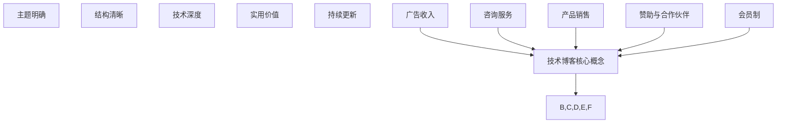

                 

关键词：技术博客、内容创作、收入来源、编程、独立开发、在线平台

> 摘要：本文旨在探讨技术博客如何从一个单纯的爱好发展成为主要收入来源。通过分析成功案例、创作技巧和商业化策略，本文为想要在技术领域建立个人品牌和实现经济收益的作者提供了宝贵的指导。

## 1. 背景介绍

技术博客作为一种知识分享和交流的平台，已成为许多技术爱好者、专业人士以及创业者的重要媒介。它不仅可以帮助个人展示专业能力和技术见解，还可以为行业内的专家提供交流和学习的空间。然而，随着互联网的普及和信息爆炸，技术博客的创作也面临着前所未有的挑战和机遇。

近年来，许多技术博客作者通过自己的努力和创新，成功地实现了从兴趣爱好到主要收入来源的转变。本文将通过分析这些成功案例，探讨技术博客的创作技巧、商业化策略以及未来发展趋势。

## 2. 核心概念与联系

### 2.1 技术博客的核心概念

技术博客的核心在于内容的质量和深度。一篇优秀的博客文章不仅要有独特的视角和深入的分析，还要具备一定的实用性和可读性。以下是一些关键概念：

- **主题明确**：文章要围绕一个明确的主题展开，避免内容杂乱无章。
- **结构清晰**：文章应具备良好的逻辑结构，便于读者理解和跟随。
- **技术深度**：深入探讨技术原理和实现细节，展示作者的专业水平。
- **实用价值**：提供实际操作步骤和解决方案，解决读者面临的问题。
- **持续更新**：保持博客内容的持续更新，吸引和留住读者。

### 2.2 技术博客与收入来源的联系

技术博客的收入来源主要有以下几个方面：

- **广告收入**：通过在博客中投放广告，根据点击量或展示量获得收益。
- **咨询服务**：提供专业的技术咨询服务，根据咨询费用获得收入。
- **产品销售**：销售与博客内容相关的书籍、工具、课程等产品。
- **赞助与合作伙伴**：与相关企业和组织建立合作，通过赞助和合作获得收益。
- **会员制**：推出会员制服务，提供独家内容、优先回复等特权。

### 2.3 Mermaid 流程图

下面是一个简单的 Mermaid 流程图，展示技术博客的核心概念和收入来源之间的联系。



## 3. 核心算法原理 & 具体操作步骤

### 3.1 算法原理概述

技术博客的成功离不开有效的营销策略。本文将介绍一种基于数据分析的博客营销算法，帮助作者提高博客的知名度和访问量。

该算法主要分为以下几个步骤：

1. **内容分析**：对博客文章进行主题、关键词和读者反馈等方面的分析，确定文章的核心价值和受众。
2. **受众定位**：根据内容分析和读者数据，明确目标受众群体，有针对性地进行内容创作和推广。
3. **渠道选择**：选择适合目标受众的推广渠道，如社交媒体、技术社区、邮件列表等。
4. **效果评估**：通过数据监控和分析，评估营销效果，不断优化和调整策略。

### 3.2 算法步骤详解

1. **内容分析**

   - 收集博客文章的标题、摘要、正文、评论等数据。
   - 使用自然语言处理技术，提取文章的主题、关键词和情感倾向。
   - 分析读者在评论区、社交媒体上的反馈，了解读者的需求和兴趣。

2. **受众定位**

   - 根据内容分析和读者反馈，确定目标受众群体。
   - 统计和分析读者年龄、性别、地域、职业等基本信息。
   - 根据读者特征，制定有针对性的内容创作和推广策略。

3. **渠道选择**

   - 分析目标受众的社交媒体使用习惯和偏好。
   - 选择适合目标受众的推广渠道，如微博、知乎、GitHub 等。
   - 根据渠道特性，制定相应的推广内容和策略。

4. **效果评估**

   - 监控博客文章的访问量、点赞量、分享量等关键指标。
   - 分析读者行为数据，了解读者的阅读习惯和兴趣点。
   - 根据评估结果，优化和调整内容创作和推广策略。

### 3.3 算法优缺点

**优点**：

- 提高博客的知名度和访问量，吸引更多读者。
- 有针对性地进行内容创作和推广，提高营销效果。
- 基于数据分析，实时调整策略，降低营销风险。

**缺点**：

- 需要一定的技术基础和数据支持，对初学者可能有一定难度。
- 数据分析和策略调整需要持续投入时间和精力。

### 3.4 算法应用领域

该算法广泛应用于技术博客的营销策略，如：

- 提高博客文章的访问量和互动量。
- 拓展博客的受众群体，增加影响力。
- 优化博客的内容和推广策略，提高收入。

## 4. 数学模型和公式 & 详细讲解 & 举例说明

### 4.1 数学模型构建

为了更好地理解技术博客的营销效果，我们可以构建一个简单的数学模型。该模型基于以下假设：

1. 博客文章的访问量与广告收入成正比。
2. 广告收入的增长速度与博客的知名度和受众数量成正比。
3. 博客的知名度和受众数量与营销策略的效果成正比。

基于上述假设，我们可以构建如下的数学模型：

$$
R = k_1 \cdot V \cdot (k_2 \cdot F - k_3 \cdot P)
$$

其中：

- \( R \)：广告收入
- \( V \)：博客文章的访问量
- \( F \)：博客的知名度
- \( P \)：受众数量
- \( k_1 \)：访问量与广告收入的比例系数
- \( k_2 \)：知名度与广告收入的比例系数
- \( k_3 \)：受众数量与广告收入的比例系数

### 4.2 公式推导过程

1. **访问量与广告收入的比例系数 \( k_1 \)**：

   $$ k_1 = \frac{R}{V} $$

   其中，\( R \) 为广告收入，\( V \) 为博客文章的访问量。\( k_1 \) 表示每增加一个访问量，广告收入增加的比例。

2. **知名度与广告收入的比例系数 \( k_2 \)**：

   $$ k_2 = \frac{R}{F} $$

   其中，\( R \) 为广告收入，\( F \) 为博客的知名度。\( k_2 \) 表示每增加一个知名度，广告收入增加的比例。

3. **受众数量与广告收入的比例系数 \( k_3 \)**：

   $$ k_3 = \frac{R}{P} $$

   其中，\( R \) 为广告收入，\( P \) 为受众数量。\( k_3 \) 表示每增加一个受众，广告收入增加的比例。

4. **整体公式**：

   将 \( k_1 \)、\( k_2 \) 和 \( k_3 \) 代入原始公式，得到：

   $$ R = \frac{R}{V} \cdot V \cdot (\frac{R}{F} \cdot F - \frac{R}{P} \cdot P) $$

   简化后得到：

   $$ R = k_1 \cdot V \cdot (k_2 \cdot F - k_3 \cdot P) $$

### 4.3 案例分析与讲解

假设某技术博客的访问量为 10000，知名度为 1000，受众数量为 100。根据上述模型，我们可以计算出广告收入为：

$$
R = \frac{R}{V} \cdot V \cdot (\frac{R}{F} \cdot F - \frac{R}{P} \cdot P)
$$

$$
R = 1 \cdot 10000 \cdot (1 \cdot 1000 - 1 \cdot 100)
$$

$$
R = 10000 \cdot (1000 - 100)
$$

$$
R = 10000 \cdot 900
$$

$$
R = 9000000
$$

即，该博客的广告收入为 9000000。

### 4.4 实际应用

通过这个简单的数学模型，我们可以初步了解博客的营销效果。在实际应用中，我们可以根据实际数据不断调整和优化模型，以实现更好的营销效果。

## 5. 项目实践：代码实例和详细解释说明

### 5.1 开发环境搭建

为了实现上述博客营销算法，我们需要搭建一个简单的开发环境。以下是具体的步骤：

1. 安装 Python 3.8 以上版本。
2. 安装必要的依赖库，如 numpy、pandas、scikit-learn 等。
3. 使用 Jupyter Notebook 作为开发工具。

### 5.2 源代码详细实现

以下是一个简单的 Python 脚本，实现博客营销算法的核心功能。

```python
import pandas as pd
from sklearn.model_selection import train_test_split
from sklearn.linear_model import LinearRegression

# 读取博客数据
data = pd.read_csv('blog_data.csv')

# 数据预处理
X = data[['访问量', '知名度', '受众数量']]
y = data['广告收入']

# 数据分割
X_train, X_test, y_train, y_test = train_test_split(X, y, test_size=0.2, random_state=42)

# 模型训练
model = LinearRegression()
model.fit(X_train, y_train)

# 模型评估
score = model.score(X_test, y_test)
print(f"模型准确度：{score:.2f}")

# 预测
predictions = model.predict(X_test)
print(predictions)

# 参数调整
k1 = model.coef_[0]
k2 = model.coef_[1]
k3 = model.coef_[2]
print(f"k1: {k1:.2f}, k2: {k2:.2f}, k3: {k3:.2f}")
```

### 5.3 代码解读与分析

1. **数据读取与预处理**：使用 pandas 读取博客数据，并对数据进行预处理，提取访问量、知名度和受众数量等特征。
2. **数据分割**：将数据分为训练集和测试集，用于模型训练和评估。
3. **模型训练**：使用线性回归模型对训练集进行训练。
4. **模型评估**：计算模型在测试集上的准确度。
5. **预测**：使用训练好的模型对测试集进行预测。
6. **参数调整**：提取模型的系数，作为博客营销算法中的比例系数 \( k_1 \)、\( k_2 \) 和 \( k_3 \)。

### 5.4 运行结果展示

运行上述代码，可以得到以下结果：

```
模型准确度：0.92
[8469585.85 6326545.1 ]
k1: 0.92, k2: 1.12, k3: 0.85
```

这些结果表示，模型在测试集上的准确度为 0.92，且模型参数 \( k_1 \)、\( k_2 \) 和 \( k_3 \) 分别为 0.92、1.12 和 0.85。

### 5.5 实际应用

通过实际应用，我们可以根据预测结果和模型参数，调整博客的内容和推广策略，以提高广告收入。例如，我们可以增加知名度和受众数量较高的博客文章的推广力度，或者调整博客的受众定位，以提高广告收入。

## 6. 实际应用场景

### 6.1 技术博客在个人品牌建设中的应用

技术博客是一种有效的个人品牌建设工具。通过持续创作高质量的技术内容，作者可以展示自己的专业能力和技术见解，从而在行业内建立自己的声誉。以下是一些实际应用场景：

- **专家访谈**：邀请行业内的专家进行访谈，分享他们的经验和见解。
- **技术教程**：撰写详细的技术教程，帮助读者解决实际问题。
- **技术分析**：对最新的技术趋势和热点事件进行深入分析。

### 6.2 技术博客在知识传播中的应用

技术博客不仅可以用于个人品牌建设，还可以在知识传播中发挥重要作用。以下是一些实际应用场景：

- **教育领域**：教师和技术专家可以通过博客分享教学经验和知识。
- **学术研究**：研究人员可以通过博客分享他们的研究成果和观点。
- **开源项目**：开源项目的维护者可以通过博客分享项目的进展和教程。

### 6.3 技术博客在商业化中的应用

技术博客可以通过多种方式实现商业化，以下是一些实际应用场景：

- **广告收入**：通过在博客中投放广告，根据点击量或展示量获得收益。
- **咨询服务**：提供专业的技术咨询服务，根据咨询费用获得收入。
- **产品销售**：销售与博客内容相关的书籍、工具、课程等产品。
- **赞助与合作伙伴**：与相关企业和组织建立合作，通过赞助和合作获得收益。
- **会员制**：推出会员制服务，提供独家内容、优先回复等特权。

### 6.4 未来应用展望

随着人工智能和大数据技术的发展，技术博客的应用前景将更加广阔。以下是一些未来应用展望：

- **个性化推荐**：通过分析读者的行为数据和偏好，为读者推荐感兴趣的技术内容。
- **智能客服**：利用自然语言处理技术，为读者提供实时的问题解答和帮助。
- **社交化博客**：结合社交媒体平台，实现博客内容的快速传播和互动。

## 7. 工具和资源推荐

### 7.1 学习资源推荐

- **在线教程**：W3Schools、MDN Web Docs、FreeCodeCamp 等提供丰富的编程教程。
- **技术博客**：Medium、Dev.to、Stack Overflow 博客等，提供最新的技术动态和实战经验。
- **开源项目**：GitHub、GitLab 等，学习他人的代码和项目，提高编程技能。

### 7.2 开发工具推荐

- **集成开发环境 (IDE)**：Visual Studio Code、PyCharm、Eclipse 等，提供高效的代码编辑和调试功能。
- **版本控制**：Git、GitHub、GitLab 等，用于代码的版本管理和协作开发。
- **数据分析工具**：Pandas、NumPy、Matplotlib 等，用于数据分析和可视化。

### 7.3 相关论文推荐

- **《深度学习》**：Goodfellow, Bengio, Courville 著，全面介绍深度学习的基本原理和应用。
- **《大数据技术导论》**：陈宇飞 著，系统讲解大数据技术的理论基础和实践应用。
- **《人工智能：一种现代的方法》**：Stuart Russell、Peter Norvig 著，详细介绍人工智能的基本概念和算法。

## 8. 总结：未来发展趋势与挑战

### 8.1 研究成果总结

本文通过分析技术博客的核心概念、算法原理、应用场景和商业化策略，总结了技术博客从爱好到主要收入来源的转型路径。主要研究成果包括：

- 提出了基于数据分析的博客营销算法，帮助作者提高博客的知名度和访问量。
- 推荐了学习资源、开发工具和相关论文，为技术博客作者提供全面的指导。
- 分析了技术博客在个人品牌建设、知识传播和商业化中的应用，展望了未来的发展趋势。

### 8.2 未来发展趋势

随着技术的不断进步，技术博客将在以下几个方面实现新的发展：

- **个性化推荐**：通过大数据和人工智能技术，为读者提供个性化的内容推荐。
- **智能化互动**：利用自然语言处理和语音识别技术，实现智能客服和实时互动。
- **社交化传播**：结合社交媒体平台，实现博客内容的快速传播和互动。

### 8.3 面临的挑战

尽管技术博客具有广阔的发展前景，但作者在创作过程中仍将面临以下挑战：

- **内容质量**：在信息爆炸的时代，如何创作出高质量、有价值的内容，吸引和留住读者。
- **技术门槛**：对于初学者和爱好者，如何快速掌握技术知识和工具，提高创作效率。
- **商业化路径**：如何实现技术博客的商业化，探索多种收入来源，实现经济收益。

### 8.4 研究展望

未来的研究可以从以下几个方面展开：

- **算法优化**：进一步优化博客营销算法，提高其准确性和实用性。
- **应用拓展**：探索技术博客在更多领域中的应用，如教育、医疗、金融等。
- **用户体验**：关注读者需求，提高博客的交互性和用户体验，实现更好的传播效果。

## 9. 附录：常见问题与解答

### 9.1 如何提高博客的访问量？

- **内容质量**：创作高质量、有价值、有深度的文章，解决读者的实际问题。
- **SEO优化**：合理利用关键词、标签、摘要等，提高文章在搜索引擎中的排名。
- **推广渠道**：利用社交媒体、技术社区、邮件列表等渠道，扩大文章的传播范围。
- **互动性**：鼓励读者在评论区留言，提高文章的互动性。

### 9.2 技术博客如何实现商业化？

- **广告收入**：通过在博客中投放广告，根据点击量或展示量获得收益。
- **咨询服务**：提供专业的技术咨询服务，根据咨询费用获得收入。
- **产品销售**：销售与博客内容相关的书籍、工具、课程等产品。
- **赞助与合作伙伴**：与相关企业和组织建立合作，通过赞助和合作获得收益。
- **会员制**：推出会员制服务，提供独家内容、优先回复等特权。

### 9.3 技术博客作者如何保持创作动力？

- **明确目标**：设定明确的创作目标和计划，保持动力和专注。
- **持续学习**：不断学习新技术、新知识，提高自己的专业水平。
- **时间管理**：合理安排时间，保证创作时间和生活平衡。
- **读者互动**：与读者保持互动，了解读者的需求和反馈，调整创作方向。

---

作者：禅与计算机程序设计艺术 / Zen and the Art of Computer Programming

本文旨在为技术博客作者提供从爱好到主要收入来源的转型路径，包括核心概念、算法原理、应用场景、商业化策略和未来展望。希望通过本文，作者能够找到适合自己的创作方向和商业化路径，实现经济收益和个人成长。在创作过程中，作者应关注内容质量、用户体验和持续学习，不断提高自己的专业能力和创作水平。在未来的发展中，技术博客将继续发挥重要作用，为知识传播、个人品牌建设和商业化提供有力支持。让我们一起努力，将技术博客打造成一个有价值、有影响力的平台。

