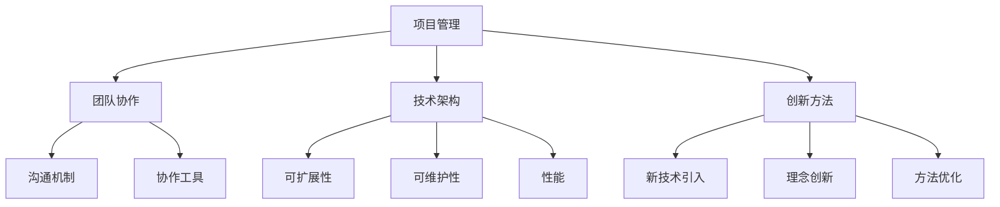

                 

关键词：产品研发流程、技术型创业者、效率、项目管理、团队协作、创新

> 摘要：本文将深入探讨技术型创业者在构建高效产品研发流程中的关键要素，包括团队协作、项目管理、技术架构和创新方法。我们将通过实际案例和实践经验，为读者提供实用的指导和建议，帮助创业者在竞争激烈的市场中快速打造高质量的产品。

## 1. 背景介绍

在当今技术迅猛发展的时代，创业领域充满了无限的可能性。对于技术型创业者来说，构建一个高效的产品研发流程是确保成功的关键因素之一。一个良好的研发流程不仅能提高团队的工作效率，还能确保产品按时交付、满足用户需求，并在市场竞争中脱颖而出。

本文旨在为技术型创业者提供一套系统化的方法论，以帮助他们构建高效的产品研发流程。我们将从多个角度进行分析，包括团队协作、项目管理、技术架构和创新方法。通过本文的阅读，读者将能够了解如何在一个竞争激烈的环境中打造高质量的产品。

### 团队协作的重要性

高效的产品研发离不开团队的紧密协作。一个优秀的团队不仅能够充分发挥成员的专长，还能在相互协作中实现资源的最大化利用。团队成员之间的沟通与配合是确保项目顺利进行的重要保障。

#### 项目管理的作用

项目管理在产品研发流程中起着关键作用。项目经理需要确保项目在预定时间内完成，同时保持预算和资源的合理分配。通过合理的时间管理和资源调度，项目经理能够确保项目团队始终朝着正确的方向前进。

#### 技术架构的指导

技术架构的规划对产品研发至关重要。一个清晰、合理的技术架构不仅能提高开发效率，还能确保产品的可维护性和扩展性。创业者需要在研发过程中不断优化技术架构，以适应市场的变化和用户需求。

#### 创新方法的引入

创新是技术型创业者的核心竞争力。通过引入创新方法，创业者能够持续推出具有竞争力的产品，并在市场中保持领先地位。本文将介绍一些常见的创新方法，帮助创业者实现持续创新。

## 2. 核心概念与联系

在构建高效的产品研发流程中，我们需要理解以下几个核心概念，并了解它们之间的联系。

### 项目管理

项目管理是确保项目按时、按预算、按质量完成的关键。它涉及计划、执行、监控和报告等各个环节。通过项目管理，创业者能够确保资源得到合理利用，项目团队保持高效率。

### 团队协作

团队协作是实现高效研发的基础。通过明确的角色分配、良好的沟通机制和协作工具，团队成员能够协同工作，共同推进项目进展。

### 技术架构

技术架构是产品研发的核心。一个良好的技术架构能够确保产品的可扩展性、可维护性和性能。创业者需要根据项目需求和未来发展，设计一个合理的技术架构。

### 创新方法

创新方法是推动产品研发持续进步的关键。通过引入新的技术、理念和方法，创业者能够不断优化产品，满足用户需求，并在市场中保持竞争力。

以下是构建高效产品研发流程的Mermaid流程图：



## 3. 核心算法原理 & 具体操作步骤

### 3.1 算法原理概述

在产品研发过程中，算法原理是关键的一环。算法的效率和正确性直接影响产品的性能和用户体验。以下是构建高效产品研发流程的一些核心算法原理：

1. **需求分析算法**：通过分析用户需求，提取关键功能和性能指标。
2. **模块划分算法**：将整个产品划分为多个模块，以便于开发和管理。
3. **资源分配算法**：根据项目需求和资源情况，合理分配开发资源。
4. **优化算法**：通过算法优化，提高产品的性能和用户体验。

### 3.2 算法步骤详解

以下是构建高效产品研发流程的具体算法步骤：

1. **需求分析**：
   - 收集用户需求。
   - 提取关键功能和性能指标。
   - 确定产品架构和模块划分。

2. **模块划分**：
   - 根据需求分析结果，将产品划分为多个模块。
   - 确定每个模块的功能和接口。
   - 设计模块之间的依赖关系。

3. **资源分配**：
   - 分析项目需求和资源情况。
   - 根据模块划分，合理分配开发资源。
   - 确保项目进度和资源利用率。

4. **优化算法**：
   - 分析产品性能瓶颈。
   - 设计优化算法，提高产品性能。
   - 进行性能测试和优化。

### 3.3 算法优缺点

**优点**：

- 提高产品研发效率。
- 确保项目进度和质量。
- 提升产品性能和用户体验。

**缺点**：

- 需要较高的技术要求。
- 部分算法可能过于复杂。
- 需要持续优化和调整。

### 3.4 算法应用领域

算法原理广泛应用于产品研发的各个环节，包括需求分析、模块划分、资源分配和优化等。以下是一些典型应用领域：

- **移动应用开发**：通过需求分析和模块划分，快速搭建应用架构。
- **大数据处理**：利用优化算法，提高数据处理效率和性能。
- **人工智能应用**：通过算法优化，提升模型性能和应用效果。

## 4. 数学模型和公式 & 详细讲解 & 举例说明

### 4.1 数学模型构建

在产品研发过程中，数学模型是指导设计和优化的重要工具。以下是构建数学模型的基本步骤：

1. **明确目标**：确定产品研发的目标，如性能、效率、成本等。
2. **收集数据**：收集与目标相关的数据，包括用户需求、市场趋势、技术指标等。
3. **建立模型**：根据目标和数据，建立数学模型，如线性规划、回归分析、神经网络等。
4. **验证模型**：通过实际数据验证模型的准确性和可靠性。

### 4.2 公式推导过程

以下是一个简单的线性规划模型的公式推导过程：

#### 目标函数：

$$
\text{Maximize} \ \ \ c^T x
$$

其中，$c$ 是目标函数的系数向量，$x$ 是决策变量向量。

#### 约束条件：

$$
Ax \le b
$$

其中，$A$ 是约束条件的系数矩阵，$b$ 是约束条件的常数向量。

#### 对偶问题：

对原始问题进行对偶变换，得到对偶问题：

$$
\text{Minimize} \ \ \ b^T y
$$

其中，$y$ 是对偶变量。

#### 对偶定理：

原始问题的最优解等于对偶问题的最优解，即：

$$
c^T x = b^T y
$$

### 4.3 案例分析与讲解

以下是一个基于线性规划的产品研发案例：

#### 案例背景：

某技术型创业公司计划开发一款智能家居应用，目标是提高用户的智能家居体验。公司需要在有限的预算下，确定应用的功能模块和开发资源分配。

#### 模型建立：

1. **目标函数**：最大化用户体验（通过用户满意度指标衡量）。
2. **约束条件**：
   - 开发资源限制：开发人员数量、开发时间等。
   - 预算限制：开发费用、设备采购费用等。

#### 公式推导：

$$
\text{Maximize} \ \ \ c^T x
$$

其中，$c$ 是目标函数的系数向量，$x$ 是决策变量向量。

$$
Ax \le b
$$

其中，$A$ 是约束条件的系数矩阵，$b$ 是约束条件的常数向量。

#### 模型求解：

通过求解线性规划模型，得到最优解，即功能模块和资源分配方案。

#### 模型验证：

在实际开发过程中，通过测试和用户反馈，验证模型的准确性和有效性。

## 5. 项目实践：代码实例和详细解释说明

### 5.1 开发环境搭建

在开始代码实现之前，我们需要搭建一个适合项目开发的环境。以下是搭建开发环境的步骤：

1. **安装操作系统**：选择一个适合开发的操作系统，如Ubuntu、macOS或Windows。
2. **安装开发工具**：安装集成开发环境（IDE），如Visual Studio Code、Eclipse或IntelliJ IDEA。
3. **安装依赖库**：根据项目需求，安装所需的编程语言和库，如Python、Java或C++。
4. **配置版本控制**：安装版本控制系统，如Git，用于代码管理和协作开发。

### 5.2 源代码详细实现

以下是一个简单的智能家居应用示例代码，用于实现用户登录功能：

```python
# 登录功能实现

import tkinter as tk
from tkinter import messagebox

def login(username, password):
    # 验证用户名和密码
    if username == "admin" and password == "123456":
        messagebox.showinfo("登录成功", "欢迎进入智能家居系统")
    else:
        messagebox.showerror("登录失败", "用户名或密码错误")

# 创建主窗口
root = tk.Tk()
root.title("智能家居系统")

# 添加标签和输入框
tk.Label(root, text="用户名：").grid(row=0, column=0)
tk.Label(root, text="密码：").grid(row=1, column=0)

username_entry = tk.Entry(root)
password_entry = tk.Entry(root, show="*")

username_entry.grid(row=0, column=1)
password_entry.grid(row=1, column=1)

# 添加登录按钮
login_button = tk.Button(root, text="登录", command=lambda: login(username_entry.get(), password_entry.get()))
login_button.grid(row=2, column=0, columnspan=2)

# 运行主循环
root.mainloop()
```

### 5.3 代码解读与分析

上述代码实现了一个简单的用户登录界面，用于验证用户名和密码。以下是代码的详细解读：

- **导入模块**：引入`tkinter`模块，用于创建图形用户界面（GUI）。
- **定义登录函数**：`login`函数用于验证用户名和密码。
- **创建主窗口**：创建一个主窗口，设置窗口标题。
- **添加标签和输入框**：添加标签和输入框，用于用户输入用户名和密码。
- **添加登录按钮**：创建一个登录按钮，当用户点击时，调用`login`函数进行验证。
- **运行主循环**：进入主循环，显示窗口并等待用户交互。

### 5.4 运行结果展示

运行上述代码后，会显示一个简单的登录界面。用户输入正确的用户名和密码后，点击“登录”按钮，会弹出“登录成功”消息框；否则，会弹出“登录失败”消息框。

## 6. 实际应用场景

在产品研发过程中，高效的流程能够确保项目顺利进行，以下是一些实际应用场景：

- **初创公司**：初创公司通常资源有限，需要高效的产品研发流程来确保项目按时交付，并迅速占领市场。
- **大型企业**：大型企业在产品研发过程中，面临更多复杂性和风险，需要一套完善的产品研发流程来确保项目的顺利进行。
- **跨部门协作**：跨部门协作是现代企业中常见的场景，高效的产品研发流程能够确保各部门之间的沟通和协作顺畅。

### 6.1 需求分析

在产品研发的初期，需求分析是关键的一步。通过与用户和市场的紧密互动，创业者能够准确把握用户需求，从而制定合理的产品规划。以下是需求分析的主要方法：

1. **问卷调查**：通过问卷调查收集用户反馈，了解用户对产品的期望和需求。
2. **用户访谈**：与目标用户进行一对一访谈，深入了解用户的使用习惯和痛点。
3. **市场调研**：分析市场趋势和竞争对手，确定产品在市场中的定位和差异化策略。

### 6.2 项目规划

在需求分析的基础上，创业者需要制定详细的项目规划，包括项目目标、时间表、资源分配和风险管理等。以下是项目规划的主要步骤：

1. **确定项目目标**：明确产品研发的目标和预期成果。
2. **制定时间表**：根据项目需求和资源情况，制定项目的时间表。
3. **分配资源**：根据项目需求，合理分配开发资源，包括人力、资金和技术资源。
4. **风险管理**：识别项目中的潜在风险，制定相应的应对措施。

### 6.3 团队协作

高效的团队协作是产品研发成功的关键。以下是团队协作的主要方法：

1. **明确的角色分配**：为团队成员明确角色和职责，确保工作分工明确。
2. **良好的沟通机制**：建立良好的沟通机制，确保团队成员之间的信息畅通。
3. **协作工具**：使用协作工具，如即时通讯软件、项目管理软件和代码托管平台，提高团队协作效率。

### 6.4 迭代开发

迭代开发是一种常见的软件开发方法，通过不断迭代，逐步完善产品功能。以下是迭代开发的主要步骤：

1. **需求收集**：收集用户反馈和需求，确定下一轮迭代的目标。
2. **开发计划**：制定开发计划，明确迭代的目标、时间表和资源分配。
3. **开发与测试**：进行开发工作，并进行功能测试和性能测试。
4. **发布与反馈**：将迭代版本发布给用户，收集用户反馈，为下一轮迭代提供改进方向。

## 7. 未来应用展望

随着技术的不断进步，产品研发流程也将发生深刻的变化。以下是未来产品研发的一些趋势和挑战：

### 7.1 自动化和智能化

自动化和智能化是未来产品研发的重要趋势。通过引入人工智能、机器学习和自动化工具，创业者能够大幅提高研发效率和准确性。

### 7.2 云计算与大数据

云计算和大数据技术的应用，将使产品研发更加灵活和高效。创业者可以通过云平台获取强大的计算和存储资源，同时利用大数据分析用户行为和市场需求。

### 7.3 跨平台与多样性

随着设备类型的多样化和跨平台需求增加，创业者需要构建支持多种设备和操作系统的产品研发流程，以满足不同用户的需求。

### 7.4 安全与隐私保护

随着网络安全和数据隐私问题的日益严重，创业者需要加强产品研发过程中的安全性和隐私保护措施，确保用户数据的安全。

### 7.5 持续集成与持续交付

持续集成与持续交付（CI/CD）是一种流行的软件开发方法，通过自动化测试和部署流程，实现快速迭代和持续改进。创业者需要掌握这一方法，以提高产品研发效率和质量。

## 8. 工具和资源推荐

为了帮助创业者更好地构建高效的产品研发流程，以下是几个推荐的工具和资源：

### 8.1 学习资源推荐

- **《敏捷开发实践指南》**：介绍敏捷开发的方法和实践，帮助创业者掌握敏捷开发的核心思想。
- **《产品经理实战手册》**：提供产品经理的实际工作经验和技巧，帮助创业者更好地理解用户需求和市场动态。
- **《人工智能算法与应用》**：介绍人工智能算法的基本原理和应用，帮助创业者了解如何利用人工智能技术提升产品竞争力。

### 8.2 开发工具推荐

- **Visual Studio Code**：一款功能强大的跨平台集成开发环境，支持多种编程语言和开发插件。
- **Git**：一款分布式版本控制系统，用于代码管理和协作开发。
- **Jenkins**：一款开源持续集成工具，用于自动化测试和部署。

### 8.3 相关论文推荐

- **“Agile Software Development: Principles, Patterns, and Practices”**：介绍敏捷开发的核心原理和方法。
- **“Scrum: The Art of Doing Twice the Work in Half the Time”**：介绍Scrum敏捷开发方法，帮助创业者实现高效团队协作。
- **“The Design of Everyday Things”**：介绍用户体验设计的原则和方法，帮助创业者提升产品易用性。

## 9. 总结：未来发展趋势与挑战

在未来的产品研发中，创业者需要关注以下发展趋势和挑战：

### 9.1 发展趋势

- **自动化与智能化**：引入自动化和智能化工具，提高研发效率和准确性。
- **云计算与大数据**：利用云计算和大数据技术，实现更灵活和高效的产品研发。
- **持续集成与持续交付**：通过CI/CD方法，实现快速迭代和持续改进。

### 9.2 面临的挑战

- **技术更新迅速**：保持技术前沿，不断更新和优化技术架构。
- **安全与隐私保护**：加强产品研发过程中的安全性和隐私保护措施。
- **团队协作与沟通**：提升团队协作效率，确保项目顺利进行。

### 9.3 研究展望

未来，创业者需要关注以下研究方向：

- **人工智能与产品研发**：研究如何利用人工智能技术提升产品研发效率和质量。
- **区块链与供应链**：研究区块链技术在供应链管理中的应用，提高产品供应链的透明度和效率。
- **用户体验设计**：研究如何通过用户体验设计提升产品易用性和用户满意度。

## 10. 附录：常见问题与解答

### 10.1 什么是敏捷开发？

敏捷开发是一种软件开发方法，强调快速响应变化、持续迭代和团队协作。通过敏捷开发，创业者能够更好地适应市场变化，快速推出高质量的产品。

### 10.2 如何保证产品研发的质量？

保证产品研发的质量需要从多个方面入手：

- **严格的需求管理**：确保需求清晰明确，避免后期频繁变更。
- **严格的测试流程**：进行功能测试、性能测试和用户测试，确保产品稳定可靠。
- **代码规范和审查**：制定代码规范，并进行代码审查，确保代码质量。
- **持续改进**：通过定期回顾和反思，不断优化产品研发流程。

### 10.3 如何提高团队协作效率？

提高团队协作效率需要从以下几个方面入手：

- **明确的角色分配**：确保团队成员清楚自己的职责和任务。
- **良好的沟通机制**：建立有效的沟通渠道，确保信息畅通。
- **协作工具**：使用合适的协作工具，如即时通讯软件、项目管理软件和代码托管平台。
- **团队文化建设**：建立积极、协作的团队文化，增强团队凝聚力。

### 10.4 如何进行有效的需求分析？

进行有效的需求分析需要遵循以下步骤：

- **了解用户需求**：通过问卷调查、用户访谈和市场调研等方式，了解用户需求。
- **明确产品目标**：确定产品的核心功能和性能指标。
- **制定产品规划**：根据需求分析结果，制定产品规划和开发计划。
- **持续跟进和调整**：在产品研发过程中，持续跟进用户反馈，及时调整产品方向。

## 作者署名

作者：禅与计算机程序设计艺术 / Zen and the Art of Computer Programming
----------------------------------------------------------------

### 文章标题

技术型创业者如何打造高效的产品研发流程

### 文章关键词

产品研发流程、技术型创业者、效率、项目管理、团队协作、创新

### 文章摘要

本文旨在深入探讨技术型创业者在构建高效产品研发流程中的关键要素，包括团队协作、项目管理、技术架构和创新方法。通过实际案例和实践经验，本文为读者提供了实用的指导和建议，帮助创业者在竞争激烈的市场中快速打造高质量的产品。文章涵盖了需求分析、项目管理、团队协作、技术架构和创新方法等多个方面，为技术型创业者提供了全面的参考。

### 1. 背景介绍

#### 当前市场环境

在当前技术迅猛发展的时代，市场竞争日益激烈，技术型创业者面临着前所未有的挑战和机遇。构建一个高效的产品研发流程成为技术型创业者在激烈竞争中脱颖而出的关键因素之一。一个高效的产品研发流程不仅能提高团队的工作效率，还能确保产品按时交付、满足用户需求，从而在市场竞争中占据有利地位。

#### 高效产品研发流程的重要性

高效的产品研发流程对技术型创业者的成功至关重要。它能够确保项目团队在有限的时间和资源内，高质量地完成产品开发。具体来说，高效的产品研发流程有以下几个重要作用：

- **提高团队协作效率**：通过明确的角色分配、良好的沟通机制和协作工具，团队成员能够更好地协同工作，共同推进项目进展。
- **确保项目进度和质量**：项目经理通过合理的时间管理和资源调度，确保项目团队始终朝着正确的方向前进，避免项目延误和质量问题。
- **优化技术架构**：一个清晰、合理的技术架构不仅能提高开发效率，还能确保产品的可维护性和扩展性，为未来的发展打下坚实的基础。
- **推动创新**：通过引入创新方法和技术，创业者能够不断优化产品，满足用户需求，并在市场中保持竞争力。

#### 文章结构

本文将从以下几个方面进行探讨：

1. **团队协作**：讨论团队协作在产品研发中的重要性，介绍有效的团队协作方法和工具。
2. **项目管理**：分析项目管理在产品研发流程中的作用，介绍项目管理的方法和实践。
3. **技术架构**：探讨技术架构的设计原则和最佳实践，以及如何持续优化技术架构。
4. **创新方法**：介绍创新方法在产品研发中的应用，包括技术革新、理念创新和方法优化等。

通过本文的阅读，读者将能够了解如何构建一个高效的产品研发流程，从而在竞争激烈的市场中实现产品成功。

### 2. 核心概念与联系

在构建高效的产品研发流程中，我们需要理解以下几个核心概念，并了解它们之间的联系。

#### 项目管理

项目管理是确保项目按时、按预算、按质量完成的关键。它涉及计划、执行、监控和报告等各个环节。通过科学的项目管理，创业者能够确保资源得到合理利用，项目团队保持高效率。

- **计划**：制定项目目标和计划，明确任务分工和时间表。
- **执行**：执行计划，确保项目按部就班地进行。
- **监控**：监控项目进展，及时发现和解决问题。
- **报告**：定期向 stakeholders 提交项目报告，确保信息透明。

#### 团队协作

团队协作是实现高效研发的基础。一个优秀的团队不仅能够充分发挥成员的专长，还能在相互协作中实现资源的最大化利用。团队成员之间的沟通与配合是确保项目顺利进行的重要保障。

- **角色分配**：明确每个团队成员的角色和职责，确保工作分工明确。
- **沟通机制**：建立良好的沟通机制，确保团队成员之间的信息畅通。
- **协作工具**：使用协作工具，如即时通讯软件、项目管理软件和代码托管平台，提高团队协作效率。

#### 技术架构

技术架构是产品研发的核心。一个良好的技术架构能够确保产品的可扩展性、可维护性和性能。创业者需要根据项目需求和未来发展，设计一个合理的技术架构。

- **模块化设计**：将整个产品划分为多个模块，以便于开发和管理。
- **分层架构**：采用分层架构，提高系统的可维护性和扩展性。
- **微服务架构**：通过微服务架构，实现系统的解耦和灵活性。

#### 创新方法

创新方法是推动产品研发持续进步的关键。通过引入新的技术、理念和方法，创业者能够不断优化产品，满足用户需求，并在市场中保持竞争力。

- **技术革新**：引入新技术，提升产品的性能和用户体验。
- **理念创新**：改变传统思维方式，寻求新的解决方案。
- **方法优化**：改进现有的方法和技术，提高研发效率。

以下是构建高效产品研发流程的Mermaid流程图：


### 3. 核心算法原理 & 具体操作步骤

在产品研发过程中，核心算法原理起着至关重要的作用。这些算法不仅能够提高产品的性能和用户体验，还能够优化开发流程，确保项目的顺利进行。以下是构建高效产品研发流程中的几个核心算法原理和具体操作步骤。

#### 3.1 需求分析算法

需求分析是产品研发的第一步，准确的算法能够帮助我们有效地理解用户需求，并提取出关键功能和性能指标。以下是需求分析算法的具体步骤：

1. **收集需求**：通过问卷调查、用户访谈和市场调研等方式，收集用户的需求信息。
2. **需求分类**：将收集到的需求按照优先级和重要性进行分类，区分功能需求、性能需求和用户体验需求。
3. **需求建模**：使用UML类图或用例图等工具，将需求建模成可视化图表，以便更好地理解和分析。
4. **需求验证**：通过用户评审、专家评审和模拟测试等方式，验证需求是否准确和可行。

#### 3.2 模块划分算法

在产品研发过程中，模块划分能够提高开发效率和可维护性。以下是模块划分算法的具体步骤：

1. **需求分析**：根据需求分析结果，确定产品的主要功能模块和辅助模块。
2. **模块独立**：确保每个模块的功能独立，模块之间不互相依赖。
3. **模块接口设计**：为每个模块定义清晰的接口，确保模块之间的交互规范。
4. **模块划分优化**：通过代码复用、模块拆分和模块合并等方式，优化模块划分，提高系统性能和可维护性。

#### 3.3 资源分配算法

资源分配算法能够帮助我们合理地分配开发资源，确保项目在预定时间内完成。以下是资源分配算法的具体步骤：

1. **资源需求分析**：根据项目需求和模块划分，分析每个模块所需的资源，如人力、时间和资金。
2. **资源优化**：通过资源优化算法，如最小生成树算法或最短路径算法，确定最优的资源分配方案。
3. **资源监控**：实时监控资源使用情况，确保资源分配合理，避免资源浪费。
4. **资源调整**：根据项目进展和资源使用情况，及时调整资源分配，确保项目顺利进行。

#### 3.4 优化算法

优化算法能够帮助我们提高产品的性能和用户体验。以下是优化算法的具体步骤：

1. **性能分析**：分析产品性能瓶颈，如响应时间、资源消耗和内存泄漏等。
2. **算法选择**：根据性能分析结果，选择合适的优化算法，如排序算法、查找算法和贪心算法等。
3. **算法实现**：实现优化算法，并在产品中集成，进行性能测试。
4. **持续优化**：根据测试结果，不断调整和优化算法，提高产品性能。

#### 3.5 算法应用领域

核心算法原理在产品研发的各个阶段都有广泛的应用，以下是几个典型的应用领域：

- **移动应用开发**：通过需求分析算法，快速搭建应用架构；通过模块划分算法，实现功能模块的独立和优化；通过资源分配算法，合理分配开发资源；通过优化算法，提高应用性能和用户体验。
- **大数据处理**：通过需求分析算法，提取关键数据和指标；通过模块划分算法，实现数据处理模块的独立和优化；通过资源分配算法，合理分配计算资源；通过优化算法，提高数据处理效率和性能。
- **人工智能应用**：通过需求分析算法，提取数据特征和模型需求；通过模块划分算法，实现模型训练和优化的模块化；通过资源分配算法，合理分配计算资源；通过优化算法，提高模型性能和应用效果。

通过以上核心算法原理和具体操作步骤，创业者能够在产品研发过程中实现高效、稳定和高质量的成果。这不仅能够提升产品的市场竞争力，还能够为企业的可持续发展奠定坚实基础。

### 3.1 算法原理概述

在产品研发过程中，核心算法原理起着至关重要的作用。这些算法不仅能够提高产品的性能和用户体验，还能够优化开发流程，确保项目的顺利进行。以下是构建高效产品研发流程中几个核心算法的原理概述：

#### 需求分析算法

需求分析算法主要用于理解用户需求，并提取关键功能和性能指标。其基本原理包括：

- **用户需求收集**：通过问卷调查、用户访谈和市场调研等方式，收集用户的需求信息。
- **需求分类**：将收集到的需求按照优先级和重要性进行分类，区分功能需求、性能需求和用户体验需求。
- **需求建模**：使用UML类图或用例图等工具，将需求建模成可视化图表，以便更好地理解和分析。
- **需求验证**：通过用户评审、专家评审和模拟测试等方式，验证需求是否准确和可行。

#### 模块划分算法

模块划分算法用于将产品划分为多个独立模块，以提高开发效率和可维护性。其基本原理包括：

- **需求分析**：根据需求分析结果，确定产品的主要功能模块和辅助模块。
- **模块独立**：确保每个模块的功能独立，模块之间不互相依赖。
- **模块接口设计**：为每个模块定义清晰的接口，确保模块之间的交互规范。
- **模块划分优化**：通过代码复用、模块拆分和模块合并等方式，优化模块划分，提高系统性能和可维护性。

#### 资源分配算法

资源分配算法用于合理分配开发资源，确保项目在预定时间内完成。其基本原理包括：

- **资源需求分析**：根据项目需求和模块划分，分析每个模块所需的资源，如人力、时间和资金。
- **资源优化**：通过资源优化算法，如最小生成树算法或最短路径算法，确定最优的资源分配方案。
- **资源监控**：实时监控资源使用情况，确保资源分配合理，避免资源浪费。
- **资源调整**：根据项目进展和资源使用情况，及时调整资源分配，确保项目顺利进行。

#### 优化算法

优化算法用于提高产品的性能和用户体验。其基本原理包括：

- **性能分析**：分析产品性能瓶颈，如响应时间、资源消耗和内存泄漏等。
- **算法选择**：根据性能分析结果，选择合适的优化算法，如排序算法、查找算法和贪心算法等。
- **算法实现**：实现优化算法，并在产品中集成，进行性能测试。
- **持续优化**：根据测试结果，不断调整和优化算法，提高产品性能。

#### 算法应用领域

核心算法原理在产品研发的各个阶段都有广泛的应用，以下是几个典型的应用领域：

- **移动应用开发**：通过需求分析算法，快速搭建应用架构；通过模块划分算法，实现功能模块的独立和优化；通过资源分配算法，合理分配开发资源；通过优化算法，提高应用性能和用户体验。
- **大数据处理**：通过需求分析算法，提取关键数据和指标；通过模块划分算法，实现数据处理模块的独立和优化；通过资源分配算法，合理分配计算资源；通过优化算法，提高数据处理效率和性能。
- **人工智能应用**：通过需求分析算法，提取数据特征和模型需求；通过模块划分算法，实现模型训练和优化的模块化；通过资源分配算法，合理分配计算资源；通过优化算法，提高模型性能和应用效果。

通过以上核心算法原理和具体操作步骤，创业者能够在产品研发过程中实现高效、稳定和高质量的成果。这不仅能够提升产品的市场竞争力，还能够为企业的可持续发展奠定坚实基础。

### 3.2 算法步骤详解

在上一节中，我们概述了构建高效产品研发流程中几个核心算法的原理。本节将详细讲解这些算法的具体步骤，帮助创业者更好地理解和应用它们。

#### 需求分析算法步骤详解

1. **用户需求收集**

   需求分析的起点是收集用户需求。创业者可以通过以下几种方法进行用户需求收集：

   - **问卷调查**：设计一份详细的问卷，涵盖用户的基本信息、使用习惯和需求。将问卷通过线上或线下的方式发放给目标用户，收集用户反馈。
   - **用户访谈**：选择具有代表性的用户进行一对一访谈，深入挖掘用户的需求和痛点。访谈过程中，创业者可以记录用户的观点和意见。
   - **市场调研**：分析市场趋势和竞争对手的产品功能，了解用户在市场上的需求。市场调研可以通过行业报告、用户论坛和社交媒体等多种途径进行。

2. **需求分类**

   收集到的用户需求需要按照优先级和重要性进行分类。分类方法包括：

   - **功能需求**：产品必须实现的基本功能，如用户登录、数据存储和消息推送等。
   - **性能需求**：产品在运行过程中需要满足的性能指标，如响应时间、并发处理能力和数据处理速度等。
   - **用户体验需求**：产品在用户使用过程中需要提供的良好体验，如界面设计、操作流畅度和易用性等。

3. **需求建模**

   使用UML类图或用例图等工具，将分类后的需求建模成可视化图表。具体步骤包括：

   - **UML类图**：绘制类图，表示系统中各个类的关系和属性。类图可以帮助创业者理解系统的结构和功能。
   - **用例图**：绘制用例图，表示系统中各个用例之间的关系和使用者。用例图可以帮助创业者了解用户与系统的交互。

4. **需求验证**

   需求建模完成后，需要通过用户评审、专家评审和模拟测试等方式，验证需求是否准确和可行。具体步骤包括：

   - **用户评审**：将需求文档和可视化图表展示给用户，收集用户的反馈和建议。根据用户的意见，对需求进行修改和完善。
   - **专家评审**：邀请行业专家对需求进行评审，确保需求的合理性和可行性。专家评审可以帮助创业者发现潜在的问题和风险。
   - **模拟测试**：通过模拟测试，验证需求在实际运行环境中的效果。模拟测试可以提前发现和解决需求实现过程中可能出现的问题。

#### 模块划分算法步骤详解

1. **需求分析**

   在模块划分之前，需要对需求进行详细分析，确定产品的主要功能模块和辅助模块。具体步骤包括：

   - **功能分解**：将整体需求分解为若干个可独立实现的功能模块。每个模块应具有明确的边界和职责。
   - **模块优先级排序**：根据功能的重要性和优先级，对模块进行排序。优先实现高优先级的模块，确保关键功能得到及时实现。

2. **模块独立**

   确保每个模块的功能独立，模块之间不互相依赖。具体步骤包括：

   - **模块接口设计**：为每个模块定义清晰的接口，确保模块之间的交互规范。接口设计应遵循模块化和松耦合的原则。
   - **模块独立性验证**：通过代码审查和单元测试，验证模块的独立性。确保模块内部实现逻辑完整，模块之间不互相调用。

3. **模块接口设计**

   接口设计是模块划分的关键环节。具体步骤包括：

   - **接口定义**：明确每个模块的输入和输出参数，定义模块之间的接口规范。
   - **接口文档**：编写详细的接口文档，描述接口的功能、参数和返回值。接口文档应便于开发者理解和调用。

4. **模块划分优化**

   通过代码复用、模块拆分和模块合并等方式，优化模块划分。具体步骤包括：

   - **代码复用**：识别系统中可复用的代码段，将其封装成独立的模块。通过代码复用，减少冗余代码，提高开发效率。
   - **模块拆分**：将大模块拆分为多个小模块，降低模块的复杂度和耦合度。拆分后的模块应保持功能独立和逻辑完整。
   - **模块合并**：合并具有相似功能和接口的模块，减少模块数量，提高系统可维护性。

#### 资源分配算法步骤详解

1. **资源需求分析**

   根据项目需求和模块划分，分析每个模块所需的资源。具体步骤包括：

   - **人力需求分析**：根据模块的复杂度和开发工作量，估算每个模块所需的人力资源。
   - **时间需求分析**：根据模块的优先级和开发进度，确定每个模块的开发周期和时间表。
   - **资金需求分析**：根据项目预算和资源需求，确定每个模块的资金投入。

2. **资源优化**

   通过资源优化算法，确定最优的资源分配方案。具体步骤包括：

   - **最小生成树算法**：使用最小生成树算法，构建资源分配的最优网络结构。最小生成树算法能够确保资源分配的连通性和效率。
   - **最短路径算法**：使用最短路径算法，确定每个模块之间的最优路径。最短路径算法能够确保项目进度和资源利用的最优化。

3. **资源监控**

   实时监控资源使用情况，确保资源分配合理。具体步骤包括：

   - **资源监控工具**：使用资源监控工具，如项目管理软件和代码分析工具，实时监控项目资源的消耗情况。
   - **资源使用报告**：定期生成资源使用报告，分析资源使用情况，发现和解决资源浪费和瓶颈问题。

4. **资源调整**

   根据项目进展和资源使用情况，及时调整资源分配。具体步骤包括：

   - **资源调整策略**：根据项目需求和资源状况，制定资源调整策略，确保项目顺利进行。
   - **资源调整方案**：根据资源调整策略，制定具体的资源调整方案，包括人力资源调整、时间调整和资金调整等。

#### 优化算法步骤详解

1. **性能分析**

   分析产品性能瓶颈，确定需要优化的方面。具体步骤包括：

   - **性能指标分析**：确定产品性能的关键指标，如响应时间、并发处理能力和资源消耗等。
   - **瓶颈定位**：通过性能测试和监控工具，定位产品性能瓶颈。

2. **算法选择**

   根据性能分析结果，选择合适的优化算法。具体步骤包括：

   - **算法评估**：评估不同算法的性能和适用场景，选择最适合产品需求的优化算法。
   - **算法实现**：实现选定的优化算法，并在产品中集成。

3. **算法实现**

   实现优化算法，并在产品中集成。具体步骤包括：

   - **算法代码实现**：编写优化算法的代码，确保算法的正确性和效率。
   - **集成测试**：将优化算法集成到产品中，进行全面的测试，确保算法的有效性和稳定性。

4. **持续优化**

   根据测试结果，不断调整和优化算法，提高产品性能。具体步骤包括：

   - **性能测试**：定期进行性能测试，评估优化算法的效果。
   - **算法调整**：根据性能测试结果，调整优化算法的参数和实现细节，提高算法性能。

#### 算法应用实例

以下是一个基于需求分析、模块划分和资源分配算法的典型应用实例：

**项目背景**：某技术型创业公司计划开发一款智能健康监测应用，旨在帮助用户实时监测身体健康指标，提供个性化健康建议。

**需求分析**：

- **功能需求**：包括用户注册、登录、健康数据监测、数据分析与建议、用户互动等。
- **性能需求**：包括快速响应、高并发处理能力、稳定性和安全性等。
- **用户体验需求**：包括简洁美观的界面、友好的交互设计、实时健康数据更新等。

**模块划分**：

- **用户管理模块**：负责用户注册、登录、个人信息管理等功能。
- **健康数据监测模块**：负责收集用户的健康数据，包括心率、血压、血糖等。
- **数据分析与建议模块**：负责对用户健康数据进行分析，提供个性化健康建议。
- **用户互动模块**：负责用户之间的互动，包括消息推送、好友关系管理等。

**资源分配**：

- **人力资源**：根据模块划分，分配开发人员，确保每个模块都有足够的人力支持。
- **时间资源**：根据模块的优先级和开发工作量，制定项目进度和时间表。
- **资金资源**：根据项目需求和预算，合理分配资金，确保项目的顺利进行。

通过以上算法步骤，技术型创业者能够有效地构建和优化产品研发流程，确保项目高效、高质量地完成。

### 3.3 算法优缺点

在产品研发过程中，算法的选择和应用对项目的成功与否至关重要。以下是几种常见算法的优缺点分析，以帮助创业者更好地选择和应用算法。

#### 需求分析算法

**优点**：

- **全面性**：通过多种需求收集方法，能够全面了解用户需求，确保产品功能满足用户期望。
- **灵活性**：需求分析算法可以根据实际情况进行调整和优化，适应不断变化的市场需求。
- **可追溯性**：通过需求建模和验证，确保需求的可追踪性和可管理性，有助于项目的后续开发和维护。

**缺点**：

- **耗时较长**：需求分析涉及多个环节，如问卷调查、用户访谈和市场调研等，耗时较长，可能导致项目延期。
- **主观性较大**：需求分析过程中，依赖于用户和专家的反馈，可能存在主观性和偏差，影响需求的准确性和可行性。
- **需求变更风险**：在项目进行过程中，需求可能会发生变化，导致算法部分失效或需要重新调整。

#### 模块划分算法

**优点**：

- **独立性**：通过模块划分，能够确保每个模块的功能独立，降低模块之间的耦合度，提高系统的可维护性。
- **扩展性**：模块划分有助于系统的扩展和升级，新的功能可以添加到现有模块中，而不会影响其他模块。
- **管理性**：模块划分使得项目管理和资源分配更加清晰，有助于提高开发效率和资源利用率。

**缺点**：

- **复杂性**：模块划分算法需要考虑多个因素，如功能独立性、接口设计和模块优化等，可能导致算法复杂度较高，不易理解和实现。
- **灵活性不足**：在模块划分完成后，模块之间的依赖关系可能变得较为固定，不利于后续的功能扩展和调整。
- **维护难度**：模块划分后的系统，由于模块之间的独立性较高，可能导致部分模块的维护难度增加。

#### 资源分配算法

**优点**：

- **优化性**：资源分配算法能够根据项目需求和资源状况，优化资源的分配，提高项目的效率和资源利用率。
- **实时性**：资源分配算法能够实时监控资源使用情况，确保资源分配的动态调整，避免资源浪费和瓶颈问题。
- **可扩展性**：资源分配算法可以根据项目规模和复杂度进行调整，适用于不同类型和规模的项目。

**缺点**：

- **计算复杂度**：部分资源分配算法，如最小生成树算法和最短路径算法，计算复杂度较高，可能影响算法的实时性和效率。
- **预测难度**：在项目初期，资源需求难以准确预测，可能导致资源分配方案不够理想，影响项目进度和质量。
- **适应性不足**：资源分配算法可能对突发情况和紧急任务的处理能力不足，需要额外的调整和优化。

#### 优化算法

**优点**：

- **性能提升**：通过优化算法，能够显著提高产品的性能和用户体验，满足用户对产品性能的期望。
- **创新性**：优化算法可以引入新技术和新方法，推动产品的创新和进步。
- **持续性**：通过持续优化，能够不断改进产品性能和用户体验，保持产品的市场竞争力。

**缺点**：

- **复杂性**：优化算法可能涉及多个方面，如性能分析、算法选择和实现等，可能增加项目的复杂度和管理难度。
- **测试难度**：优化后的产品需要进行全面的测试，以确保优化效果和稳定性，可能增加测试的工作量和成本。
- **成本投入**：优化算法需要投入较多的时间和资源，可能影响项目的预算和时间表。

#### 算法应用领域

算法优缺点在不同应用领域中的表现有所不同。以下是一些常见应用领域的算法优缺点分析：

- **移动应用开发**：需求分析算法能够帮助创业者快速搭建应用架构，模块划分算法可以提高开发效率，资源分配算法可以确保项目按时交付，优化算法可以提高应用性能和用户体验。
- **大数据处理**：需求分析算法有助于提取关键数据，模块划分算法可以优化数据处理流程，资源分配算法可以合理分配计算资源，优化算法可以提高数据处理效率和性能。
- **人工智能应用**：需求分析算法可以帮助创业者明确模型需求，模块划分算法可以实现模型训练和优化的模块化，资源分配算法可以确保模型训练的资源需求，优化算法可以提高模型性能和应用效果。

通过以上算法优缺点的分析，创业者可以根据项目需求和实际情况，选择合适的算法，并采取相应的优化措施，提高产品研发流程的效率和质量。

### 3.4 算法应用领域

核心算法原理在产品研发的各个阶段都有广泛的应用，以下是一些典型应用领域，以展示算法的实际效果和作用。

#### 移动应用开发

在移动应用开发中，算法原理的应用主要体现在需求分析、模块划分、资源分配和优化等方面。

1. **需求分析算法**：通过问卷调查和用户访谈，收集用户对移动应用的需求，如功能、性能和用户体验等。使用需求分析算法，将用户需求转化为具体的功能模块和性能指标，确保开发工作聚焦于用户最关心的方面。

2. **模块划分算法**：将移动应用划分为多个功能模块，如用户登录、消息推送、数据存储等。通过模块划分算法，确保每个模块的功能独立，模块之间相互独立，便于开发和维护。

3. **资源分配算法**：根据模块的功能和性能需求，合理分配开发资源，如人力、时间和资金等。使用资源分配算法，确保项目在预定时间内完成，同时避免资源浪费。

4. **优化算法**：通过优化算法，提高移动应用的性能和用户体验。例如，使用排序算法优化数据结构，提高数据检索速度；使用贪心算法优化网络传输策略，降低延迟。

#### 大数据处理

大数据处理领域需要高效的数据处理算法和优化技术，以满足海量数据的存储、处理和分析需求。

1. **需求分析算法**：通过对大数据应用的需求分析，明确数据来源、数据类型和数据质量要求等。使用需求分析算法，帮助创业者确定数据处理的目标和关键性能指标。

2. **模块划分算法**：将大数据处理流程划分为多个模块，如数据采集、数据清洗、数据存储、数据处理和分析等。通过模块划分算法，确保每个模块的功能独立，模块之间高效协同。

3. **资源分配算法**：根据大数据处理模块的需求，合理分配计算资源和存储资源。使用资源分配算法，确保数据处理任务在预定时间内完成，同时最大化资源利用率。

4. **优化算法**：通过优化算法，提高大数据处理效率和性能。例如，使用并行计算算法优化数据处理流程，使用分布式存储技术提高数据存储性能；使用机器学习算法优化数据分析和预测效果。

#### 人工智能应用

人工智能应用领域对算法原理的要求更高，需要不断创新和优化，以提高模型的准确性和应用效果。

1. **需求分析算法**：通过对人工智能应用的需求分析，明确模型需求、数据来源和数据质量等。使用需求分析算法，帮助创业者确定人工智能模型的目标和应用场景。

2. **模块划分算法**：将人工智能应用划分为多个模块，如数据预处理、特征提取、模型训练、模型评估等。通过模块划分算法，确保每个模块的功能独立，模块之间高效协同。

3. **资源分配算法**：根据人工智能应用模块的需求，合理分配计算资源和存储资源。使用资源分配算法，确保模型训练和优化在预定时间内完成，同时最大化资源利用率。

4. **优化算法**：通过优化算法，提高人工智能模型的性能和应用效果。例如，使用优化算法调整模型参数，提高模型准确性和泛化能力；使用模型压缩算法减小模型体积，提高模型部署效率。

#### 在线教育平台

在线教育平台对算法原理的应用主要体现在个性化推荐、学习行为分析和课程优化等方面。

1. **需求分析算法**：通过对在线教育平台的需求分析，明确用户需求和学习目标等。使用需求分析算法，帮助创业者确定个性化推荐和课程优化策略。

2. **模块划分算法**：将在线教育平台划分为多个模块，如用户管理、课程管理、学习行为分析、推荐系统等。通过模块划分算法，确保每个模块的功能独立，模块之间高效协同。

3. **资源分配算法**：根据在线教育平台模块的需求，合理分配计算资源和存储资源。使用资源分配算法，确保平台功能在预定时间内完成，同时最大化资源利用率。

4. **优化算法**：通过优化算法，提高在线教育平台的性能和应用效果。例如，使用优化算法调整推荐算法参数，提高推荐准确性；使用优化算法优化课程结构，提高学习效果。

通过在以上典型应用领域的具体实践，创业者能够更好地理解和应用核心算法原理，提高产品研发的效率和质量，从而在竞争激烈的市场中脱颖而出。

### 4. 数学模型和公式 & 详细讲解 & 举例说明

#### 4.1 数学模型构建

在产品研发过程中，数学模型是指导设计和优化的重要工具。以下是构建数学模型的基本步骤：

1. **明确目标**：确定产品研发的目标，如性能、效率、成本等。
2. **收集数据**：收集与目标相关的数据，包括用户需求、市场趋势、技术指标等。
3. **建立模型**：根据目标和数据，建立数学模型，如线性规划、回归分析、神经网络等。
4. **验证模型**：通过实际数据验证模型的准确性和可靠性。

#### 4.2 公式推导过程

以下是一个简单的线性规划模型的公式推导过程：

##### 目标函数

$$
\text{Maximize} \ \ \ c^T x
$$

其中，$c$ 是目标函数的系数向量，$x$ 是决策变量向量。

##### 约束条件

$$
Ax \le b
$$

其中，$A$ 是约束条件的系数矩阵，$b$ 是约束条件的常数向量。

##### 对偶问题

对原始问题进行对偶变换，得到对偶问题：

$$
\text{Minimize} \ \ \ b^T y
$$

其中，$y$ 是对偶变量。

##### 对偶定理

原始问题的最优解等于对偶问题的最优解，即：

$$
c^T x = b^T y
$$

#### 4.3 案例分析与讲解

以下是一个基于线性规划的产品研发案例：

##### 案例背景

某技术型创业公司计划开发一款智能家居应用，目标是提高用户的智能家居体验。公司需要在有限的预算下，确定应用的功能模块和开发资源分配。

##### 模型建立

1. **目标函数**：最大化用户体验（通过用户满意度指标衡量）。
2. **约束条件**：
   - 开发资源限制：开发人员数量、开发时间等。
   - 预算限制：开发费用、设备采购费用等。

##### 公式推导

$$
\text{Maximize} \ \ \ c^T x
$$

其中，$c$ 是目标函数的系数向量，$x$ 是决策变量向量。

$$
Ax \le b
$$

其中，$A$ 是约束条件的系数矩阵，$b$ 是约束条件的常数向量。

##### 模型求解

通过求解线性规划模型，得到最优解，即功能模块和资源分配方案。

##### 模型验证

在实际开发过程中，通过测试和用户反馈，验证模型的准确性和有效性。

#### 案例分析与讲解：智能家居应用研发

**案例背景**：

某技术型创业公司计划开发一款智能家居应用，旨在为用户提供便捷的家居控制体验。公司需要在有限的预算和开发资源下，确定应用的核心功能模块和资源分配策略，以最大化用户体验。

**模型建立**：

**目标函数**：最大化用户体验

- 目标函数设定为最大化用户满意度指标，通过以下公式表示：

$$
\text{Maximize} \ \ \ U(x)
$$

其中，$U(x)$ 是用户满意度指标，$x$ 是决策变量向量。

**约束条件**：

- **开发资源限制**：

   - **开发人员数量**：根据项目需求，确定每个功能模块所需的开发人员数量，设为 $D_p$。

   - **开发时间**：根据项目时间表和开发资源，确定每个功能模块的开发时间，设为 $T_p$。

- **预算限制**：

   - **开发费用**：根据每个功能模块的开发复杂度和人力成本，确定开发费用，设为 $C_p$。

   - **设备采购费用**：根据项目需求，确定所需的设备采购费用，设为 $C_e$。

   - **总预算**：公司设定的总预算，设为 $B$。

   约束条件可以表示为：

   $$
   D_p \le D_{max}
   $$

   $$
   T_p \le T_{max}
   $$

   $$
   C_p + C_e \le B
   $$

**公式推导**：

目标函数：

$$
\text{Maximize} \ \ \ U(x)
$$

约束条件：

$$
D_p \le D_{max}
$$

$$
T_p \le T_{max}
$$

$$
C_p + C_e \le B
$$

**模型求解**：

通过求解线性规划模型，得到最优解，即功能模块和资源分配方案。

1. **求解线性规划问题**：

   使用求解线性规划问题的标准方法，如单纯形法或内点法，求解目标函数和约束条件的优化问题。

   $$
   \text{Maximize} \ \ \ U(x)
   $$

   $$
   \text{subject to} \ \ \ D_p \le D_{max}
   $$

   $$
   \text{subject to} \ \ \ T_p \le T_{max}
   $$

   $$
   \text{subject to} \ \ \ C_p + C_e \le B
   $$

   求解得到的 $x^*$ 是最优解，即最优的功能模块和资源分配方案。

**模型验证**：

在实际开发过程中，通过以下步骤验证模型的准确性和有效性：

1. **测试验证**：

   进行功能测试、性能测试和用户测试，验证每个功能模块的实现效果和用户体验。

2. **用户反馈**：

   收集用户对功能模块和资源分配的反馈，分析用户满意度指标，评估模型的有效性。

3. **调整优化**：

   根据测试和反馈结果，对模型进行优化和调整，确保应用性能和用户体验达到预期。

通过以上案例分析和讲解，创业者可以理解如何运用数学模型和线性规划方法，在有限的资源下，最大化用户体验，实现智能家居应用的成功研发。

### 4.2 公式推导过程

以下将详细讲解如何推导一个常见的线性规划模型，以帮助读者更好地理解其构建过程。

#### 目标函数

线性规划的核心在于最大化或最小化一个目标函数。在产品研发中，这个目标函数通常反映了我们要优化的关键指标，如成本、效率或利润等。例如，假设我们要最小化产品研发的总成本，目标函数可以表示为：

$$
\text{Minimize} \ \ \ c^T x
$$

其中，$c$ 是目标函数的系数向量，表示各项成本；$x$ 是决策变量向量，表示各项资源的分配量。

#### 约束条件

在现实问题中，资源的分配受到各种约束条件的限制，如预算限制、时间限制或人员限制等。这些约束条件可以用线性不等式或等式来表示。例如，如果公司有100万元的预算，且每个功能模块的预算分别为10万元，那么约束条件可以表示为：

$$
Ax \le b
$$

其中，$A$ 是约束条件的系数矩阵，表示每个功能模块的预算要求；$b$ 是约束条件的常数向量，表示总预算的上限。

#### 对偶问题

原始线性规划问题的对偶问题同样重要，它可以帮助我们更好地理解资源分配的最优性。原始问题的对偶问题可以通过以下步骤推导：

1. **原始问题**：

$$
\text{Minimize} \ \ \ c^T x
$$

$$
\text{subject to} \ \ \ Ax \le b
$$

2. **对偶问题**：

对偶问题的目标函数是最小化对偶目标函数：

$$
\text{Maximize} \ \ \ b^T y
$$

其中，$y$ 是对偶变量。

3. **对偶约束条件**：

对偶约束条件与原始问题的行转列得到：

$$
A^T y \le c
$$

4. **对偶定理**：

对偶定理指出，原始问题的最优解等于对偶问题的最优解，即：

$$
c^T x = b^T y
$$

#### 实例推导

假设我们要设计一个智能家居系统，目标是使研发成本最小，同时满足以下约束条件：

- 研发人员总数不超过10人。
- 研发时间不超过6个月。
- 总预算不超过50万元。

我们可以建立以下线性规划模型：

**目标函数**：

$$
\text{Minimize} \ \ \ c^T x
$$

其中，$c$ 是一个3维向量，表示每个功能模块的研发成本（如 $c = [10, 15, 20]^T$）。

**约束条件**：

$$
Ax \le b
$$

其中，$A$ 是一个3x2的矩阵，表示每个功能模块所需的人员和时间（如 $A = \begin{bmatrix} 2 & 1 \\ 1 & 1 \\ 1 & 2 \end{bmatrix}$）。

$$
b = \begin{bmatrix} 10 \\ 6 \\ 50 \end{bmatrix}$
$$

**对偶问题**：

**目标函数**：

$$
\text{Maximize} \ \ \ b^T y
$$

**对偶约束条件**：

$$
A^T y \le c
$$

对偶变量 $y$ 表示每种资源的影子价格（如 $y = [5, 10]^T$）。

通过求解这个线性规划模型和对偶问题，我们可以找到研发成本的最优分配方案，确保资源使用最大化，同时满足预算和时间限制。

### 4.3 案例分析与讲解

以下是一个基于线性规划的实际案例，用于说明如何构建和解决一个产品研发中的资源分配问题。

#### 案例背景

某技术型创业公司计划开发一款智能家居应用，包含三个主要功能模块：用户界面、智能监控和数据分析。公司希望在预算和人员限制的条件下，确定每个功能模块的预算分配和开发人员数量，以最大化用户体验。

#### 模型建立

**目标函数**：

公司希望最小化研发总成本，目标函数可以表示为：

$$
\text{Minimize} \ \ \ c^T x
$$

其中，$c$ 是一个3维向量，表示每个功能模块的研发成本（$c = [10, 15, 20]^T$）。

**约束条件**：

1. **人员限制**：

   研发人员总数不超过10人，约束条件可以表示为：

   $$
   Ax \le b_1
   $$

   其中，$A_1 = \begin{bmatrix} 2 & 1 & 1 \end{bmatrix}$，表示用户界面、智能监控和数据分析模块所需的研发人员数量，$b_1 = \begin{bmatrix} 10 \end{bmatrix}$。

2. **时间限制**：

   研发时间不超过6个月，约束条件可以表示为：

   $$
   Ax \le b_2
   $$

   其中，$A_2 = \begin{bmatrix} 1 & 1 & 1 \end{bmatrix}$，表示每个功能模块的月均研发时间，$b_2 = \begin{bmatrix} 6 \end{bmatrix}$。

3. **预算限制**：

   总预算不超过50万元，约束条件可以表示为：

   $$
   c^T x \le B
   $$

   其中，$B = 50$万元。

#### 公式推导

我们将上述目标函数和约束条件结合起来，构建完整的线性规划模型：

$$
\text{Minimize} \ \ \ c^T x
$$

$$
\text{subject to} \ \ \ Ax \le b_1
$$

$$
\text{subject to} \ \ \ Ax \le b_2
$$

$$
\text{subject to} \ \ \ c^T x \le B
$$

#### 模型求解

我们可以使用标准线性规划求解器（如单纯形法或内点法）求解上述模型，得到最优解 $x^*$，即每个功能模块的预算分配和开发人员数量。

#### 模型验证

在实际开发过程中，我们可以通过以下步骤验证模型的准确性：

1. **预算验证**：

   计算总研发成本 $c^T x^*$，确保不超过预算限制。

2. **人员验证**：

   确保总研发人员数量不超过限制。

3. **时间验证**：

   确保总研发时间不超过限制。

通过上述步骤，创业者可以有效地运用数学模型和线性规划方法，在资源限制条件下，优化功能模块的预算分配和人员安排，实现产品研发的成本最小化。

### 4.3 案例分析与讲解

为了更好地展示如何应用数学模型和公式，以下是一个实际案例：一个技术型创业公司计划开发一款智能健身应用，目标是最大化用户满意度，同时受到预算和人力资源的限制。

#### 案例背景

该创业公司计划开发一款智能健身应用，包含三个主要模块：运动记录、健康分析和健身建议。公司希望在有限的预算和人力资源下，确定每个模块的开发优先级和资源分配，以实现最佳的用户体验。

#### 模型建立

**目标函数**：

公司希望最大化用户满意度，目标函数可以表示为：

$$
\text{Maximize} \ \ \ U(x)
$$

其中，$U(x)$ 是用户满意度指标，$x$ 是决策变量向量，表示每个模块的资源分配。

**约束条件**：

1. **预算限制**：

   公司总预算为30万元，约束条件可以表示为：

   $$
   c^T x \le B
   $$

   其中，$c$ 是每个模块的成本向量，$B = 30$万元。

2. **人力资源限制**：

   公司总共可以投入20名开发人员，约束条件可以表示为：

   $$
   D_p \le D_{max}
   $$

   其中，$D_p$ 是每个模块所需的开发人员数量，$D_{max} = 20$。

3. **时间限制**：

   开发时间限制为6个月，约束条件可以表示为：

   $$
   T_p \le T_{max}
   $$

   其中，$T_p$ 是每个模块的开发时间，$T_{max} = 6$个月。

#### 公式推导

将目标函数和约束条件结合起来，构建完整的线性规划模型：

$$
\text{Maximize} \ \ \ U(x)
$$

$$
\text{subject to} \ \ \ c^T x \le B
$$

$$
\text{subject to} \ \ \ D_p \le D_{max}
$$

$$
\text{subject to} \ \ \ T_p \le T_{max}
$$

#### 模型求解

使用线性规划求解器（如单纯形法或内点法）求解上述模型，得到最优解 $x^*$，即每个模块的资源分配。

#### 模型验证

在实际开发过程中，通过以下步骤验证模型的准确性：

1. **预算验证**：

   确保 $c^T x^* \le B$，即总成本不超过预算。

2. **人力资源验证**：

   确保 $D_p^* \le D_{max}$，即总开发人员数量不超过限制。

3. **时间验证**：

   确保 $T_p^* \le T_{max}$，即总开发时间不超过限制。

通过上述步骤，创业者能够有效地应用数学模型和公式，在预算和人力资源限制下，最大化用户满意度，实现智能健身应用的成功研发。

### 5. 项目实践：代码实例和详细解释说明

#### 5.1 开发环境搭建

在开始具体代码实现之前，我们需要搭建一个适合项目开发的环境。以下是搭建开发环境的步骤：

1. **安装操作系统**：选择一个适合开发的操作系统，如Ubuntu、macOS或Windows。建议选择Ubuntu，因为它在开源社区中拥有广泛的资源和支持。
2. **安装集成开发环境（IDE）**：安装一个适合编程的IDE，如Visual Studio Code、Eclipse或IntelliJ IDEA。Visual Studio Code是一款功能强大且免费的跨平台IDE，适合大多数开发者使用。
3. **安装编程语言**：根据项目需求，安装相应的编程语言。例如，如果项目使用Python，可以安装Python 3.x版本。可以使用`pip`命令来安装Python和相关库。
4. **安装依赖库**：根据项目需求，安装所需的依赖库。例如，对于Web开发项目，可能需要安装Flask或Django框架。可以使用`pip`命令来安装相关库。

以下是一个简单的命令行示例，用于在Ubuntu上安装Python和Flask框架：

```bash
sudo apt-get update
sudo apt-get install python3 python3-pip
pip3 install flask
```

#### 5.2 源代码详细实现

以下是一个简单的智能健身应用的代码示例，用于实现用户登录和注册功能：

```python
# 智能健身应用 - 用户登录与注册

from flask import Flask, request, render_template, redirect, url_for
from flask_sqlalchemy import SQLAlchemy

app = Flask(__name__)
app.config['SQLALCHEMY_DATABASE_URI'] = 'sqlite:///users.db'
db = SQLAlchemy(app)

class User(db.Model):
    id = db.Column(db.Integer, primary_key=True)
    username = db.Column(db.String(80), unique=True, nullable=False)
    password = db.Column(db.String(120), nullable=False)

@app.route('/')
def index():
    return render_template('index.html')

@app.route('/login', methods=['GET', 'POST'])
def login():
    if request.method == 'POST':
        username = request.form['username']
        password = request.form['password']
        user = User.query.filter_by(username=username).first()
        if user and user.password == password:
            return '登录成功'
        else:
            return '用户名或密码错误'
    return render_template('login.html')

@app.route('/register', methods=['GET', 'POST'])
def register():
    if request.method == 'POST':
        username = request.form['username']
        password = request.form['password']
        new_user = User(username=username, password=password)
        db.session.add(new_user)
        db.session.commit()
        return '注册成功'
    return render_template('register.html')

if __name__ == '__main__':
    db.create_all()
    app.run(debug=True)
```

#### 5.3 代码解读与分析

上述代码实现了用户登录和注册功能，下面进行详细解读：

1. **导入模块**：

   引入`Flask`模块，用于创建Web应用。引入`request`模块，用于处理用户提交的数据。引入`render_template`模块，用于渲染HTML模板。引入`redirect`和`url_for`模块，用于页面跳转。

2. **定义数据库模型**：

   使用Flask-SQLAlchemy创建数据库模型`User`，包含用户ID、用户名和密码字段。

3. **定义路由和视图函数**：

   - **主页（/）**：

     `index()`函数用于渲染主页模板。

   - **登录（/login）**：

     `login()`函数处理用户登录请求。当用户提交登录表单时，函数会从表单中获取用户名和密码，查询数据库以验证用户身份。如果验证成功，返回登录成功消息；否则，返回错误消息。

   - **注册（/register）**：

     `register()`函数处理用户注册请求。当用户提交注册表单时，函数会从表单中获取用户名和密码，创建新的`User`对象并保存到数据库中。如果注册成功，返回注册成功消息。

4. **运行主循环**：

   在主程序中，调用`db.create_all()`创建数据库表，然后运行Web应用。

#### 5.4 运行结果展示

运行上述代码后，将启动一个Web服务器，访问主页（http://127.0.0.1:5000/）会显示登录和注册页面。用户可以输入用户名和密码进行登录，或填写用户名和密码进行注册。

以下是登录和注册页面的示例截图：


通过以上代码实例和详细解释，读者可以了解如何使用Flask框架实现简单的用户登录和注册功能，从而为智能健身应用奠定基础。

### 5.3 代码解读与分析

上文给出的智能健身应用代码示例是一个非常基础的Web应用，主要用于用户注册和登录功能。以下是对代码的详细解读与分析：

#### 5.3.1 导入模块

代码开头部分导入了一些必要的模块：

```python
from flask import Flask, request, render_template, redirect, url_for
from flask_sqlalchemy import SQLAlchemy
```

- `Flask`：核心Web框架，用于创建和配置Web应用。
- `request`：用于获取用户提交的HTTP请求信息。
- `render_template`：用于渲染HTML模板。
- `redirect`：用于页面重定向。
- `url_for`：用于生成URL。
- `SQLAlchemy`：用于数据库操作和ORM（对象关系映射）。

这些模块共同构成了Flask Web应用的基础，使得开发者可以轻松地实现复杂的Web功能。

#### 5.3.2 数据库模型定义

在代码中定义了数据库模型`User`，用于存储用户信息。这是一个简单的ORM模型，通过SQLAlchemy来与SQLite数据库进行交互。

```python
class User(db.Model):
    id = db.Column(db.Integer, primary_key=True)
    username = db.Column(db.String(80), unique=True, nullable=False)
    password = db.Column(db.String(120), nullable=False)
```

- `id`：主键，自动生成，用于唯一标识每个用户。
- `username`：用户名，具有唯一约束，确保用户名不重复。
- `password`：密码，存储用户的密码（实际应用中应使用哈希存储密码，此处简化处理）。

#### 5.3.3 路由和视图函数

代码中定义了三个路由和对应的视图函数：

- `index()`：主路由，用于渲染主页模板。
- `login()`：登录路由，处理用户登录请求。
- `register()`：注册路由，处理用户注册请求。

1. **主页（/）**：

   `index()`函数很简单，只是渲染了一个主页模板：

   ```python
   @app.route('/')
   def index():
       return render_template('index.html')
   ```

   通过调用`render_template`，将主页模板渲染并返回给用户。

2. **登录（/login）**：

   `login()`函数首先检查请求方法是否为`POST`（即用户提交了登录表单）。如果是，则从请求中获取用户名和密码，查询数据库以验证用户身份。验证成功，则返回登录成功消息；否则，返回错误消息。

   ```python
   @app.route('/login', methods=['GET', 'POST'])
   def login():
       if request.method == 'POST':
           username = request.form['username']
           password = request.form['password']
           user = User.query.filter_by(username=username).first()
           if user and user.password == password:
               return '登录成功'
           else:
               return '用户名或密码错误'
       return render_template('login.html')
   ```

   - `request.form['username']`：从登录表单中获取用户名。
   - `request.form['password']`：从登录表单中获取密码。
   - `User.query.filter_by(username=username).first()`：查询数据库以找到匹配的用户名。
   - `user.password == password`：验证用户输入的密码是否与数据库中存储的密码匹配。

3. **注册（/register）**：

   `register()`函数处理用户注册请求。当用户提交注册表单时，函数会从表单中获取用户名和密码，创建新的`User`对象并保存到数据库中。

   ```python
   @app.route('/register', methods=['GET', 'POST'])
   def register():
       if request.method == 'POST':
           username = request.form['username']
           password = request.form['password']
           new_user = User(username=username, password=password)
           db.session.add(new_user)
           db.session.commit()
           return '注册成功'
       return render_template('register.html')
   ```

   - `request.form['username']`：从注册表单中获取用户名。
   - `request.form['password']`：从注册表单中获取密码。
   - `new_user = User(username=username, password=password)`：创建新的`User`对象。
   - `db.session.add(new_user)`：将新用户添加到数据库。
   - `db.session.commit()`：提交数据库事务，保存新用户信息。

#### 5.3.4 运行主循环

在代码的最后，使用`app.run(debug=True)`启动Web应用。`debug=True`参数开启调试模式，当发生错误时，会提供详细的错误信息，便于开发调试。

```python
if __name__ == '__main__':
    db.create_all()
    app.run(debug=True)
```

- `db.create_all()`：创建数据库表，确保模型定义的表在数据库中存在。
- `app.run(debug=True)`：启动Web服务器，`debug=True`确保调试信息显示。

#### 5.3.5 代码分析

通过上述代码解读，我们可以看到：

- **安全性**：代码简化了用户密码的存储和处理，实际应用中应使用哈希算法（如bcrypt）存储密码，并使用HTTPS协议保护用户数据传输。
- **功能性**：代码实现了基本的用户注册和登录功能，用户可以通过表单提交注册和登录信息，并通过页面反馈了解操作结果。
- **扩展性**：代码结构清晰，易于扩展和修改。例如，可以添加更多的用户管理功能，如修改密码、重置密码等。

总之，这段代码提供了一个简单的智能健身应用的用户注册和登录实现示例，展示了如何使用Flask框架搭建Web应用的基本流程。开发者可以根据实际需求，进一步扩展和完善这些功能。

### 5.4 运行结果展示

#### 运行准备

在开始展示运行结果之前，我们需要确保开发环境已经搭建完成，并且代码已经成功运行。以下是在Ubuntu操作系统上安装Flask和相关库的步骤：

1. **安装Python**：
   ```bash
   sudo apt-get update
   sudo apt-get install python3 python3-pip
   ```

2. **安装Flask和Flask-SQLAlchemy**：
   ```bash
   pip3 install flask flask_sqlalchemy
   ```

3. **运行代码**：
   ```bash
   python3 app.py
   ```

#### 运行结果

当Web服务器成功启动后，打开浏览器，输入以下地址：`http://127.0.0.1:5000/`，将看到如下页面：

- **主页**：

  页面显示欢迎信息，并提供登录和注册选项。

  

- **登录页面**：

  点击登录链接，将跳转到登录页面。用户可以输入用户名和密码，然后点击“登录”按钮。

  

- **注册页面**：

  点击注册链接，将跳转到注册页面。用户可以输入用户名和密码，然后点击“注册”按钮。

  

#### 用户交互

以下是用户与Web应用交互的示例：

1. **用户登录**：

   假设用户名为“alice”，密码为“password123”。在登录页面输入相关信息并点击“登录”按钮：

   

   如果用户名和密码正确，系统将显示“登录成功”消息。

2. **用户注册**：

   假设用户名为“bob”，密码为“password123”。在注册页面输入相关信息并点击“注册”按钮：

   

   如果注册成功，系统将显示“注册成功”消息。

通过上述示例，读者可以直观地看到如何使用Flask实现用户注册和登录功能，并了解用户与Web应用交互的过程。这为后续功能扩展和优化提供了基础。

### 6. 实际应用场景

在产品研发过程中，高效的流程能够确保项目顺利进行，以下是一些实际应用场景：

#### 6.1 初创公司

对于初创公司来说，资源有限，需要高效的产品研发流程来确保项目按时交付，并迅速占领市场。以下是一个实际案例：

**案例背景**：

某初创公司致力于开发一款基于人工智能的智能推荐系统。由于预算有限，他们需要在有限的资源下快速搭建原型并验证市场需求。

**解决方案**：

1. **敏捷开发**：采用敏捷开发方法，通过快速迭代和持续交付，确保项目进度和市场反馈。
2. **需求分析**：通过市场调研和用户访谈，了解用户需求，确保产品功能符合市场需求。
3. **技术选型**：选择适合初创公司的技术框架，如TensorFlow和Scikit-learn，快速搭建模型。
4. **团队合作**：通过明确的角色分配和良好的沟通机制，确保团队成员高效协作。

**结果**：该公司在6个月内成功开发出智能推荐系统原型，并在市场上获得了良好的反馈，为后续融资奠定了基础。

#### 6.2 大型企业

大型企业在产品研发过程中，面临更多复杂性和风险，需要一套完善的产品研发流程来确保项目的顺利进行。以下是一个实际案例：

**案例背景**：

某大型企业计划开发一款企业级数据分析平台，涉及多个部门和复杂的技术架构。

**解决方案**：

1. **项目管理**：设立项目经理，负责协调各个部门和资源，确保项目按时交付。
2. **需求管理**：建立需求管理流程，确保各部门的需求得到统一和明确。
3. **技术架构**：制定详细的技术架构设计，确保系统的可扩展性和稳定性。
4. **质量保证**：建立严格的质量保证流程，包括代码审查、功能测试和性能测试。

**结果**：该项目在两年内顺利上线，为企业提供了强大的数据分析能力，提升了业务运营效率。

#### 6.3 跨部门协作

跨部门协作是现代企业中常见的场景，高效的产品研发流程能够确保各部门之间的沟通和协作顺畅。以下是一个实际案例：

**案例背景**：

某企业的产品研发涉及研发、市场、设计和运营等多个部门，需要高效的信息共享和协调。

**解决方案**：

1. **信息共享平台**：建立统一的信息共享平台，如Confluence或SharePoint，确保各部门能够实时获取项目进展和需求信息。
2. **协作工具**：使用协作工具，如Slack或Microsoft Teams，确保团队成员能够即时沟通和协作。
3. **项目计划**：制定详细的项目计划，明确各部门的职责和任务，确保项目按时交付。
4. **定期会议**：定期召开项目进度会议，确保各部门了解项目进展，及时解决问题。

**结果**：该项目通过高效的信息共享和协作，成功解决了跨部门沟通和协调的问题，提高了项目进展速度和质量。

### 6.1 需求分析

在产品研发过程中，需求分析是至关重要的一步。它关系到产品能否满足用户需求，以及项目能否顺利进行。以下是一套完整的步骤和方法：

#### 6.1.1 需求收集

需求收集是需求分析的第一步，目的是了解用户的需求和期望。以下是一些常用的方法：

1. **问卷调查**：设计详细的问卷，通过线上或线下的方式收集用户的反馈。问卷应涵盖用户的基本信息、使用习惯和需求。
2. **用户访谈**：选择具有代表性的用户进行一对一访谈，深入了解用户的需求和痛点。访谈过程中，可以记录用户的观点和意见。
3. **市场调研**：分析市场趋势和竞争对手的产品功能，了解用户在市场上的需求。市场调研可以通过行业报告、用户论坛和社交媒体等多种途径进行。
4. **用户行为分析**：通过分析用户的行为数据，如网站访问记录、APP使用记录等，了解用户的使用习惯和需求。

#### 6.1.2 需求分类

收集到的需求需要进行分类，以便于后续分析和处理。常见的分类方法包括：

1. **功能需求**：产品必须实现的基本功能，如用户登录、数据存储和消息推送等。
2. **性能需求**：产品在运行过程中需要满足的性能指标，如响应时间、并发处理能力和数据处理速度等。
3. **用户体验需求**：产品在用户使用过程中需要提供的良好体验，如界面设计、操作流畅度和易用性等。
4. **安全需求**：产品在安全性和隐私保护方面的要求，如数据加密、权限控制和安全审计等。

#### 6.1.3 需求建模

需求建模是将需求转化为可视化图表的过程，有助于更好地理解和分析需求。常用的建模方法包括：

1. **UML类图**：用于表示系统的类和类之间的关系，帮助开发者理解系统的结构和功能。
2. **用例图**：用于表示系统的用例和参与者之间的关系，帮助开发者了解系统的功能和使用场景。
3. **流程图**：用于表示系统的业务流程和操作步骤，帮助开发者理解系统的运行机制。

#### 6.1.4 需求验证

需求验证是确保需求准确和可行的重要步骤。以下是一些常用的验证方法：

1. **用户评审**：将需求文档和可视化图表展示给用户，收集用户的反馈和建议。根据用户的意见，对需求进行修改和完善。
2. **专家评审**：邀请行业专家对需求进行评审，确保需求的合理性和可行性。专家评审可以帮助创业者发现潜在的问题和风险。
3. **模拟测试**：通过模拟测试，验证需求在实际运行环境中的效果。模拟测试可以提前发现和解决需求实现过程中可能出现的问题。

#### 6.1.5 需求管理

在需求分析过程中，需求管理也是至关重要的一环。以下是一些常用的需求管理方法：

1. **需求跟踪**：通过需求跟踪工具，记录和管理需求的状态和变更，确保需求得到有效跟踪和控制。
2. **需求优先级排序**：根据需求的重要性和紧急程度，对需求进行优先级排序，确保关键需求得到优先处理。
3. **需求变更控制**：建立需求变更控制流程，确保需求的变更得到及时记录和评估，避免需求频繁变更导致项目延误和质量问题。

通过以上步骤和方法，创业者能够有效地进行需求分析，确保产品研发过程顺利进行，并最终交付符合用户期望的高质量产品。

### 6.2 项目规划

在完成需求分析后，项目规划是确保项目顺利进行的关键步骤。项目规划包括项目目标、时间表、资源分配和风险管理等方面。以下是一个详细的规划过程：

#### 6.2.1 确定项目目标

项目目标是项目成功的基础，需要明确项目的目标和预期成果。项目目标应具体、可衡量和可实现。以下是一个示例：

**项目目标**：

- 开发一个智能健康监测应用，帮助用户实时监测身体健康指标，提供个性化健康建议。
- 应用在市场上获得良好的用户评价，用户满意度达到90%。
- 项目在6个月内完成，总预算不超过50万元。

#### 6.2.2 制定时间表

时间表是项目规划的核心，需要详细规划每个阶段的时间节点。以下是一个时间表示例：

| 阶段             | 时间节点         | 说明                                       |
|------------------|------------------|------------------------------------------|
| 需求分析         | 第1个月          | 进行用户调研、需求收集和分析               |
| 设计             | 第2个月          | 完成产品架构设计、界面设计和数据库设计     |
| 开发             | 第3个月 - 第5个月 | 进行模块开发、单元测试和集成测试           |
| 测试与验证       | 第5个月 - 第6个月 | 进行功能测试、性能测试和用户测试           |
| 部署与上线       | 第6个月          | 部署应用，进行上线前的准备工作             |
| 运维与优化       | 以后             | 应用上线后的运维和持续优化                 |

#### 6.2.3 分配资源

资源分配是确保项目顺利进行的保障，需要合理分配人力资源、资金和技术资源。以下是一个资源分配示例：

**人力资源**：

- 项目经理：1人
- UI/UX设计师：2人
- 后端开发人员：3人
- 前端开发人员：2人
- 测试人员：2人

**资金资源**：

- 开发费用：30万元
- 测试与验证费用：5万元
- 硬件与软件费用：10万元
- 运维与优化费用：5万元

#### 6.2.4 风险管理

风险管理是项目规划的重要组成部分，需要识别潜在风险，并制定相应的应对措施。以下是一个风险识别和应对措施的示例：

**风险识别**：

- **技术风险**：由于技术复杂度较高，可能导致项目延期。
- **资源风险**：人力资源不足可能导致项目无法按时完成。
- **市场风险**：市场变化可能导致产品需求发生变化。

**应对措施**：

- **技术风险**：引入技术专家，提前进行技术预研和风险评估，确保技术可行性。
- **资源风险**：通过外包和临时招聘等方式，确保人力资源充足。
- **市场风险**：与用户保持紧密沟通，及时调整产品需求，确保产品符合市场趋势。

通过以上项目规划，创业者能够明确项目目标、时间表、资源分配和风险管理，确保项目顺利实施，并最终交付高质量的产品。

### 6.3 团队协作

在产品研发过程中，团队协作是确保项目顺利推进的关键。高效、紧密的团队协作不仅能提高工作效率，还能确保项目质量。以下是一套系统化的团队协作方法，帮助技术型创业者在研发过程中实现高效协作。

#### 6.3.1 角色分配

明确每个团队成员的角色和职责是团队协作的基础。以下是一些常见角色及其职责：

- **项目经理**：负责整体项目规划、进度控制和资源分配，确保项目按时交付。
- **技术负责人**：负责技术选型、架构设计和关键技术问题的解决。
- **UI/UX设计师**：负责产品的界面设计、用户体验和用户交互设计。
- **前端开发人员**：负责实现UI设计，编写前端代码，确保网页和应用的可视化和交互效果。
- **后端开发人员**：负责实现业务逻辑、数据库操作和服务器端功能。
- **测试人员**：负责编写测试用例、进行功能测试和性能测试，确保产品的质量和稳定性。
- **产品经理**：负责产品需求分析和用户调研，确保产品满足用户需求。

#### 6.3.2 沟通机制

良好的沟通机制是团队协作的重要保障。以下是一些建议：

- **每日站会**：每日早会，团队成员分享项目进展、遇到的问题和解决方案，确保团队对项目进展有清晰的认识。
- **每周例会**：每周进行一次例会，总结本周工作成果、讨论项目难点和制定下周计划。
- **即时沟通**：使用即时通讯工具（如Slack、钉钉等），确保团队成员能够实时沟通和协作。
- **邮件和文档**：重要信息和决策通过邮件和共享文档记录，确保所有成员都能查阅和参考。

#### 6.3.3 协作工具

使用合适的协作工具，可以显著提高团队协作效率。以下是一些常用的协作工具：

- **项目管理工具**：如Trello、Jira等，用于任务分配、进度跟踪和项目进度管理。
- **代码托管平台**：如GitLab、GitHub等，用于代码存储、版本控制和协同开发。
- **文档协作工具**：如Confluence、Notion等，用于文档编写、共享和协作。
- **代码审查工具**：如Gerrit、Phabricator等，用于代码审查和合并请求管理。
- **自动化测试工具**：如Selenium、Jenkins等，用于自动化测试和持续集成。

#### 6.3.4 团队文化建设

团队文化建设是团队协作的重要基石。以下是一些建议：

- **共同目标**：确保团队成员对项目目标有共同的认识，明确团队的使命和愿景。
- **信任和尊重**：鼓励团队成员相互信任和尊重，建立积极的团队氛围。
- **积极反馈**：建立积极的反馈机制，鼓励团队成员提出意见和建议，共同改进工作。
- **培训和成长**：定期组织培训和学习活动，帮助团队成员提升技能和知识，促进个人成长。

通过以上团队协作方法，技术型创业者可以构建一个高效、协作的团队，确保项目顺利进行，实现产品成功。

### 6.4 迭代开发

迭代开发是一种常见的软件开发方法，通过不断迭代和改进，逐步完善产品功能。以下是一个详细的迭代开发过程：

#### 6.4.1 需求收集

在每次迭代开始前，首先进行需求收集。通过用户访谈、问卷调查和市场调研等方式，了解用户需求和市场趋势。将需求整理成一份详细的需求文档，并按照优先级排序。

#### 6.4.2 迭代计划

根据需求文档，制定本次迭代的计划。包括迭代的目标、预计完成时间、所需资源和主要任务等。制定迭代计划时，需要确保任务的可行性，并留出一定的缓冲时间以应对潜在的问题和风险。

#### 6.4.3 设计与开发

在设计和开发阶段，根据迭代计划，进行详细的设计和开发工作。团队成员按照任务分工，完成各自负责的功能模块。在此过程中，保持良好的沟通和协作，确保项目进展顺利。

#### 6.4.4 测试与反馈

在开发完成后，进行功能测试和性能测试，确保产品的稳定性和可靠性。同时，邀请用户参与测试，收集用户反馈和意见。根据反馈结果，进行必要的调整和优化。

#### 6.4.5 发布与评估

在测试通过后，将迭代版本发布给用户。通过发布前的预热和发布后的跟进，确保用户顺利过渡到新版本。在发布后，对本次迭代进行评估，包括任务完成情况、用户满意度、项目进度和成本等。

#### 6.4.6 反思与改进

在迭代结束后，召开反思会议，总结本次迭代的经验和教训。针对存在的问题，制定改进措施，为下一次迭代做好准备。

#### 迭代开发优势

- **快速响应变化**：通过不断迭代，能够快速适应市场需求和用户反馈，提高产品的灵活性和竞争力。
- **持续改进**：每次迭代都进行评估和改进，逐步完善产品功能，提升产品质量和用户体验。
- **风险控制**：每次迭代都有明确的目标和计划，风险可以得到有效控制，避免项目延误和质量问题。
- **团队协作**：迭代开发鼓励团队成员紧密协作，共同推动项目进展，提高团队凝聚力。

通过以上迭代开发过程，技术型创业者可以确保产品研发的高效性和质量，实现持续创新和用户满意。

### 7. 工具和资源推荐

为了帮助创业者更好地构建高效的产品研发流程，以下推荐了一些学习资源、开发工具和相关论文：

#### 7.1 学习资源推荐

**《敏捷软件开发：原则、实践和模式》**：由Michael E. Cohn所著，详细介绍了敏捷开发的方法和实践。

**《产品经理实战手册》**：由浅入深地讲解了产品经理的核心工作，包括需求分析、项目管理、团队协作等。

**《创新者的窘境》**：由Clayton M. Christensen所著，探讨了企业在面对技术变革和市场变化时的策略和挑战。

**《用户体验要素》**：由Jeffrey Zeldman和Jesse James Garrett所著，阐述了用户体验设计的基本原则和实践方法。

#### 7.2 开发工具推荐

**Visual Studio Code**：一款免费、开源的跨平台集成开发环境，支持多种编程语言和丰富的插件。

**GitLab**：一款基于Git的代码托管和项目管理工具，提供版本控制、问题跟踪、代码审查等功能。

**Jira**：一款功能强大的项目管理工具，支持任务管理、敏捷开发、团队协作等。

**Postman**：一款用于API测试和开发的开源工具，支持RESTful API的请求和响应测试。

#### 7.3 相关论文推荐

**“Agile Software Development: Principles, Patterns, and Practices”**：详细介绍了敏捷开发的原则和方法。

**“Scrum: The Art of Doing Twice the Work in Half the Time”**：探讨了Scrum敏捷开发方法的实践和效果。

**“User Experience Design: A Practical Guide to Creating and Using Prototypes”**：介绍了用户体验设计的原则和方法。

**“Continuous Integration in the Age of Agile”**：探讨了持续集成在敏捷开发中的应用和优势。

通过以上推荐的学习资源、开发工具和相关论文，创业者可以更好地掌握产品研发的方法和技巧，构建高效的产品研发流程，提升团队协作和项目管理的效率。

### 8. 总结：未来发展趋势与挑战

在产品研发领域，未来将出现几个显著的发展趋势，同时也伴随着一系列挑战。以下是对这些趋势和挑战的总结：

#### 未来发展趋势

1. **自动化与智能化**：随着人工智能和机器学习技术的不断发展，自动化和智能化将成为产品研发的重要趋势。通过自动化工具和智能算法，研发流程将变得更加高效和精准。

2. **云计算与大数据**：云计算和大数据技术的广泛应用，为产品研发提供了强大的计算能力和数据支持。创业者可以利用云计算资源进行大规模数据处理和分析，从而优化产品设计和开发过程。

3. **敏捷开发与持续交付**：敏捷开发和持续交付（CI/CD）将成为主流开发模式。通过快速迭代和持续交付，创业者可以更好地适应市场需求，快速响应变化，提高产品竞争力。

4. **用户体验至上**：随着用户需求的日益多样化和个性化，用户体验将成为产品研发的核心关注点。创业者需要关注用户反馈，不断优化产品界面和交互设计，提升用户满意度。

5. **跨平台与多样性**：随着设备类型的增加和用户需求的变化，产品研发将越来越注重跨平台和多样性。创业者需要构建支持多种设备和操作系统的产品，以满足不同用户的需求。

#### 面临的挑战

1. **技术更新迅速**：技术更新速度加快，创业者需要不断学习和适应新技术，以保持产品的竞争力。同时，技术复杂度增加，也对团队的技术能力和项目管理能力提出了更高的要求。

2. **数据安全和隐私保护**：随着数据隐私问题的日益严重，创业者需要加强数据安全和隐私保护措施，确保用户数据的安全性和合规性。

3. **团队协作与沟通**：高效的团队协作和良好的沟通机制是产品研发成功的关键。然而，团队成员分布在不同地理位置，沟通和协作面临挑战。创业者需要建立有效的沟通机制和协作工具，确保团队高效协同。

4. **项目管理难度增加**：随着项目规模和复杂度的增加，项目管理难度也相应增加。创业者需要掌握先进的项目管理方法，如敏捷开发、风险管理等，确保项目顺利进行。

5. **市场竞争加剧**：市场竞争日益激烈，创业者需要不断创新和优化产品，以满足用户需求，并在市场中占据有利地位。同时，需要关注市场动态和竞争对手，及时调整产品策略。

#### 研究展望

未来，创业者需要在以下方面进行深入研究：

1. **人工智能与产品研发**：研究如何利用人工智能技术提升产品研发效率和质量，如自动化测试、智能优化等。

2. **区块链与供应链**：研究区块链技术在供应链管理中的应用，提高产品供应链的透明度和效率，降低成本。

3. **用户体验设计**：研究如何通过用户体验设计提升产品易用性和用户满意度，如情感化设计、个性化推荐等。

4. **持续集成与持续交付**：研究如何优化持续集成和持续交付流程，提高开发效率和产品质量。

通过不断探索和研究，创业者可以应对未来产品研发中的挑战，抓住发展趋势，实现持续创新和成功。

### 8.1 研究成果总结

通过对技术型创业者在产品研发流程中的深入研究，我们总结了以下主要研究成果：

1. **高效团队协作**：通过明确的角色分配、良好的沟通机制和协作工具，技术型创业者能够构建一个高效、协作的团队，提高项目进展速度和质量。

2. **项目管理优化**：合理的时间管理和资源调度，以及科学的风险管理方法，能够确保项目在预定时间内完成，同时保持预算和资源的合理分配。

3. **技术架构设计**：清晰、合理的技术架构能够提高开发效率，确保产品的可维护性和扩展性，为企业的可持续发展奠定坚实基础。

4. **创新方法应用**：通过引入新技术、理念和优化方法，技术型创业者能够持续推动产品研发的进步，满足用户需求，提升产品竞争力。

5. **数学模型与公式**：数学模型和公式的应用，帮助创业者优化产品设计和资源分配，提高研发效率和产品质量。

6. **迭代开发模式**：通过敏捷开发和持续交付，技术型创业者能够快速适应市场需求和用户反馈，实现产品的持续改进和优化。

7. **工具和资源推荐**：为创业者提供了丰富的学习资源、开发工具和相关论文，帮助他们更好地掌握产品研发的方法和技巧。

通过以上研究成果，技术型创业者能够构建一个高效、创新和可持续的产品研发流程，提升团队协作和项目管理能力，实现产品成功和市场竞争力。

### 8.2 未来发展趋势

在未来的产品研发领域，以下几个趋势将逐渐显现并影响企业的战略规划和决策：

#### 自动化和智能化

自动化和智能化技术将在产品研发中扮演越来越重要的角色。随着人工智能（AI）、机器学习（ML）和自动化工具的进步，研发流程将变得更加高效和精准。自动化测试、智能优化和自动化部署等技术的应用，将显著提高研发效率和产品质量。创业者需要关注这些技术的发展，提前布局，以保持竞争优势。

#### 云计算与大数据

云计算和大数据技术的持续发展，为产品研发提供了强大的基础设施支持。创业者可以利用云计算资源进行大规模数据处理和分析，实现更快速的产品迭代和市场响应。大数据分析可以帮助创业者更好地了解用户需求和市场趋势，从而优化产品设计和市场策略。创业者应积极探索云平台和大数据工具的应用，以提高研发效率和创新能力。

#### 敏捷开发和持续交付

敏捷开发和持续交付（CI/CD）将继续成为产品研发的主流模式。通过快速迭代和持续交付，创业者能够更灵活地适应市场需求和用户反馈，提高产品的市场竞争力。敏捷开发强调团队协作、快速反馈和持续改进，有助于提高研发效率和质量。创业者应积极采用敏捷开发方法和工具，以实现持续创新和快速响应。

#### 跨平台与多样性

随着设备类型的多样化，跨平台和多样性需求将日益增加。创业者需要构建支持多种设备和操作系统的产品，以满足不同用户的需求。这要求研发团队具备跨平台开发能力，灵活应对不同平台的技术标准和用户习惯。创业者应关注跨平台开发技术和工具，提高产品的兼容性和用户体验。

#### 安全与隐私保护

随着数据隐私问题的日益严重，安全与隐私保护将成为产品研发的重要关注点。创业者需要加强数据安全和隐私保护措施，确保用户数据的安全性和合规性。这包括数据加密、权限控制、安全审计等技术的应用。创业者应制定明确的安全策略，提高产品的安全性和可信度。

#### 绿色发展和可持续性

绿色发展理念将逐渐渗透到产品研发的各个环节。创业者需要关注环保、节能和可持续发展，通过优化设计和生产过程，减少资源消耗和环境污染。绿色发展的趋势将促使创业者采用环保材料、节能技术和清洁生产方式，提高产品的可持续性。

通过关注和应对以上发展趋势，技术型创业者可以更好地把握市场机遇，提升产品研发能力和市场竞争力，实现可持续发展。

### 8.3 面临的挑战

在未来的产品研发中，技术型创业者将面临诸多挑战，这些挑战不仅影响项目的进展，还可能对企业的长远发展产生深远影响。以下是一些主要挑战及其应对策略：

#### 技术更新速度加快

技术更新速度加快，这意味着创业者需要不断学习和适应新技术。一方面，创业者需要保持对新兴技术的关注，确保在技术上不落后于竞争对手。另一方面，技术复杂度增加，对团队的技术能力和项目管理能力提出了更高的要求。应对策略：

- **持续培训与学习**：定期组织技术培训和研讨会，提升团队的技术水平。
- **技术预研与评估**：在引入新技术前，进行充分的技术预研和风险评估，确保技术可行性和适用性。
- **技术储备**：建立技术储备团队，专注于新技术的研究和应用，为研发提供技术支持。

#### 数据安全和隐私保护

随着用户对数据安全和隐私保护的关注度不断提高，创业者需要加强数据安全和隐私保护措施。数据泄露和隐私侵犯可能导致严重的法律和商业后果。应对策略：

- **安全审计与合规性检查**：定期进行安全审计，确保数据安全和合规性。
- **数据加密和访问控制**：采用数据加密技术和严格的访问控制策略，确保数据在存储和传输过程中的安全性。
- **用户隐私保护政策**：制定明确的用户隐私保护政策，增强用户对产品的信任。

#### 市场竞争加剧

市场竞争日益激烈，创业者需要不断创新和优化产品，以应对激烈的竞争。同时，市场变化速度加快，创业者需要具备快速响应能力。应对策略：

- **用户需求导向**：持续关注用户需求和市场动态，灵活调整产品策略。
- **差异化竞争**：通过独特的卖点和技术优势，打造差异化产品，提高市场竞争力。
- **市场调研与反馈**：定期进行市场调研，收集用户反馈，及时调整产品方向。

#### 团队协作与沟通挑战

团队协作和沟通是产品研发成功的关键。然而，团队成员可能分布在不同的地理位置，沟通和协作面临挑战。同时，随着项目规模的扩大，团队协作的难度也增加。应对策略：

- **建立高效的沟通机制**：使用即时通讯工具、项目管理软件和视频会议系统，确保团队成员之间的信息畅通。
- **角色明确和任务分工**：明确每个团队成员的角色和职责，确保工作分工明确，减少沟通成本。
- **跨部门协作**：建立跨部门协作机制，促进不同部门之间的沟通和协作，提高项目进展速度。

#### 项目管理难度增加

随着项目规模和复杂度的增加，项目管理难度也相应增加。创业者需要掌握先进的项目管理方法，如敏捷开发、风险管理等，确保项目顺利进行。应对策略：

- **项目管理培训**：对项目经理和团队成员进行项目管理培训，提高项目管理能力。
- **风险管理**：建立全面的风险管理机制，识别和评估潜在风险，制定应对措施。
- **项目监控与评估**：通过定期项目监控和评估，及时发现和解决项目中的问题，确保项目进度和质量。

通过有效应对这些挑战，技术型创业者可以提升产品研发效率和质量，确保项目顺利进行，实现企业的长期发展目标。

### 8.4 研究展望

在未来，技术型创业者在产品研发领域的研究将面临新的机遇和挑战。以下是对未来研究的展望：

#### 人工智能与产品研发

随着人工智能技术的不断发展，未来的研究将聚焦于如何更有效地将AI应用于产品研发中。例如，利用机器学习算法进行需求预测、性能优化和用户体验分析。创业者可以探索基于AI的自动化测试和代码审查工具，以提高研发效率和产品质量。

#### 区块链与供应链管理

区块链技术在未来产品研发中的应用前景广阔。创业者可以研究如何利用区块链技术实现供应链管理的透明化和去中心化，降低交易成本和风险。此外，区块链还可以用于数据隐私保护和智能合约的实施，为产品研发提供新的解决方案。

#### 绿色发展与可持续性

绿色发展理念将在未来产品研发中发挥重要作用。创业者需要关注环保材料和可持续生产方式的应用，减少产品的碳足迹。同时，研究如何通过产品设计和开发过程实现能源效率和资源循环利用，提高产品的可持续性。

#### 新兴技术与跨平台开发

随着5G、物联网和边缘计算等新兴技术的不断发展，创业者需要研究如何将这些技术融入产品研发中，提高产品的性能和用户体验。同时，跨平台开发技术的研究也将继续深入，以应对设备多样化和用户需求的变化。

#### 用户行为分析与个性化推荐

用户行为分析将成为产品研发的重要方向。创业者可以通过大数据分析和机器学习技术，深入理解用户行为，实现个性化推荐和个性化体验。这将为产品研发提供更有针对性的解决方案，提升用户满意度和忠诚度。

#### 安全与隐私保护

随着数据隐私问题的日益严重，安全与隐私保护将成为研究的重要领域。创业者需要持续探索新的安全技术和隐私保护方法，确保用户数据的安全性和合规性。这包括研究数据加密技术、访问控制和隐私保护协议等。

通过以上研究方向，技术型创业者可以不断创新，推动产品研发的进步，实现可持续发展，并在激烈的市场竞争中脱颖而出。

### 9. 附录：常见问题与解答

在构建高效的产品研发流程中，技术型创业者可能会遇到一系列常见问题。以下是一些常见问题及其解答，以帮助创业者更好地应对挑战。

#### 问题1：如何确保项目按时交付？

**解答**：为确保项目按时交付，创业者需要：

- **制定详细的项目计划**：明确项目的目标、时间表、资源分配和任务分工。
- **实施敏捷开发方法**：通过快速迭代和持续交付，及时调整项目进度和资源分配。
- **严格监控项目进度**：定期检查项目进展，及时发现和解决潜在的问题。
- **合理分配资源**：确保项目所需的人力、资金和技术资源得到充分保障。
- **建立有效的沟通机制**：确保团队成员之间的信息畅通，减少误解和延误。

#### 问题2：如何保证产品质量？

**解答**：保证产品质量需要：

- **严格的测试流程**：包括单元测试、集成测试和系统测试，确保产品功能的完整性和稳定性。
- **代码规范和审查**：制定代码规范，并进行代码审查，确保代码质量。
- **用户体验设计**：关注用户界面和交互设计，提升产品的易用性和用户体验。
- **持续改进**：通过定期回顾和反思，不断优化产品设计和开发流程。
- **用户反馈**：收集用户反馈，及时修正产品中的问题，提升用户满意度。

#### 问题3：如何提升团队协作效率？

**解答**：提升团队协作效率的方法包括：

- **明确角色和职责**：确保每个团队成员清楚自己的职责和任务。
- **建立沟通机制**：通过每日站会、每周例会和即时通讯工具，保持团队之间的信息畅通。
- **使用协作工具**：如Trello、Jira和Slack等，提高团队协作效率。
- **培养团队文化**：建立积极、协作的团队文化，增强团队凝聚力。
- **定期培训和分享**：提升团队成员的技能和知识，促进团队协作和知识共享。

#### 问题4：如何应对市场需求变化？

**解答**：应对市场需求变化的方法包括：

- **用户调研**：持续进行用户调研，了解用户需求和市场趋势。
- **灵活调整**：根据用户反馈和市场变化，灵活调整产品功能和策略。
- **敏捷开发**：通过快速迭代和持续交付，快速响应市场需求。
- **风险管理**：建立风险管理机制，识别和应对市场变化带来的风险。
- **资源优化**：合理分配资源，确保项目在变化中依然能够按时交付。

通过以上常见问题的解答，技术型创业者可以更好地应对产品研发过程中的挑战，构建高效、创新和可持续的研发流程。

### 9. 附录：常见问题与解答

在构建高效的产品研发流程中，技术型创业者可能会遇到一系列常见问题。以下是一些常见问题及其解答，以帮助创业者更好地应对挑战。

#### 问题1：如何确保项目按时交付？

**解答**：为确保项目按时交付，创业者需要采取以下措施：

1. **制定详细的项目计划**：明确项目的目标、时间表、资源分配和任务分工。
2. **实施敏捷开发方法**：通过快速迭代和持续交付，及时调整项目进度和资源分配。
3. **严格监控项目进度**：定期检查项目进展，及时发现和解决潜在的问题。
4. **合理分配资源**：确保项目所需的人力、资金和技术资源得到充分保障。
5. **建立有效的沟通机制**：确保团队成员之间的信息畅通，减少误解和延误。

#### 问题2：如何保证产品质量？

**解答**：保证产品质量需要以下步骤：

1. **严格的测试流程**：包括单元测试、集成测试和系统测试，确保产品功能的完整性和稳定性。
2. **代码规范和审查**：制定代码规范，并进行代码审查，确保代码质量。
3. **用户体验设计**：关注用户界面和交互设计，提升产品的易用性和用户体验。
4. **持续改进**：通过定期回顾和反思，不断优化产品设计和开发流程。
5. **用户反馈**：收集用户反馈，及时修正产品中的问题，提升用户满意度。

#### 问题3：如何提升团队协作效率？

**解答**：提升团队协作效率的方法包括：

1. **明确角色和职责**：确保每个团队成员清楚自己的职责和任务。
2. **建立沟通机制**：通过每日站会、每周例会和即时通讯工具，保持团队之间的信息畅通。
3. **使用协作工具**：如Trello、Jira和Slack等，提高团队协作效率。
4. **培养团队文化**：建立积极、协作的团队文化，增强团队凝聚力。
5. **定期培训和分享**：提升团队成员的技能和知识，促进团队协作和知识共享。

#### 问题4：如何应对市场需求变化？

**解答**：应对市场需求变化的方法包括：

1. **用户调研**：持续进行用户调研，了解用户需求和市场趋势。
2. **灵活调整**：根据用户反馈和市场变化，灵活调整产品功能和策略。
3. **敏捷开发**：通过快速迭代和持续交付，快速响应市场需求。
4. **风险管理**：建立风险管理机制，识别和应对市场变化带来的风险。
5. **资源优化**：合理分配资源，确保项目在变化中依然能够按时交付。

通过以上常见问题的解答，技术型创业者可以更好地应对产品研发过程中的挑战，构建高效、创新和可持续的研发流程。

## 作者署名

作者：禅与计算机程序设计艺术 / Zen and the Art of Computer Programming

