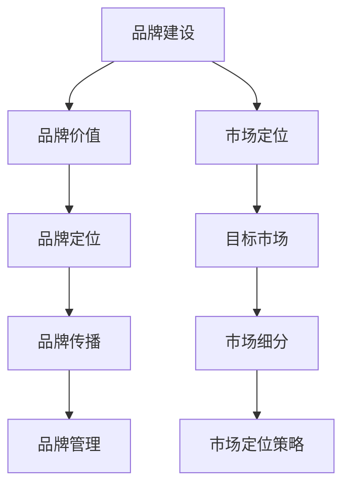

                 

 **关键词**：品牌建设、市场定位、技术型创业者、品牌战略、市场分析、竞争策略、用户群体

**摘要**：
本文旨在探讨技术型创业者在构建品牌和进行市场定位的过程中所面临的关键挑战与策略。通过深入研究品牌建设的核心要素、市场定位的理论基础和实际操作方法，以及竞争策略的制定和执行，本文将为技术型创业者提供一套全面的品牌和市场策略指南，助力他们成功开拓市场、树立品牌形象，并实现持续增长。

## 1. 背景介绍

### 技术型创业者的现状与挑战

技术型创业者，通常具备深厚的专业技术和创新思维，致力于通过技术创新推动企业的快速发展。然而，在快速变化的市场环境中，技术型创业者面临着诸多挑战：

1. **市场定位模糊**：许多技术型创业者往往过分关注技术本身，忽视了市场定位的重要性，导致产品难以与目标市场形成差异化。
2. **品牌建设薄弱**：品牌建设是一个长期且复杂的工程，技术型创业者往往缺乏品牌建设的策略和经验，导致品牌影响力不足。
3. **竞争激烈**：技术行业竞争激烈，新进入者需要在短时间内获得市场认可，品牌建设和市场定位显得尤为重要。
4. **资金与资源有限**：技术型创业企业通常在初创阶段资金和资源有限，如何在有限的资源下实现品牌建设和市场定位，成为一大挑战。

### 品牌建设的重要性

品牌不仅仅是企业的标志和名称，更是企业价值的象征。一个成功的品牌可以带来以下几个关键优势：

1. **品牌认知度**：通过有效的品牌建设，可以提升品牌在目标市场的认知度和知名度。
2. **用户忠诚度**：品牌建设有助于建立用户对企业的信任和忠诚度，从而提高用户的重复购买率和推荐率。
3. **市场差异化**：清晰的品牌定位可以帮助企业在竞争激烈的市场中脱颖而出，形成独特的市场地位。
4. **溢价能力**：优秀的品牌可以提升产品的附加值，从而提高产品的销售价格和利润率。

### 市场定位的作用

市场定位是品牌战略的核心，它决定了企业如何针对不同的市场需求进行产品定位和品牌传播。有效的市场定位可以带来以下几个方面的效果：

1. **目标市场明确**：明确的市场定位可以帮助企业精准锁定目标客户群体，从而进行有针对性的产品开发和市场推广。
2. **竞争优势凸显**：通过市场定位，企业可以凸显自身产品的独特优势，从而在竞争中获得优势。
3. **资源优化配置**：明确的市场定位有助于企业合理配置资源，避免资源浪费，提高运营效率。
4. **品牌传播精准**：精准的市场定位可以帮助企业进行更有效的品牌传播，提高品牌传播的效果。

## 2. 核心概念与联系

### 品牌建设核心概念

- **品牌价值**：品牌在用户心目中的价值和地位，包括品牌知名度、品牌形象和品牌忠诚度等。
- **品牌定位**：品牌在市场中的位置，包括目标市场、目标用户和产品特点等。
- **品牌传播**：品牌信息的传递和沟通，包括广告、公关、社交媒体等渠道。
- **品牌管理**：品牌的维护和更新，包括品牌形象管理、品牌危机管理等。

### 市场定位核心概念

- **目标市场**：企业决定要服务的市场范围，包括地理、人口、心理和行为特征等。
- **市场细分**：将市场划分为不同的细分市场，针对每个细分市场制定不同的营销策略。
- **市场定位策略**：企业为在目标市场中获得竞争优势而制定的具体策略，包括产品定位、价格策略、渠道策略和促销策略等。

### Mermaid 流程图



## 3. 核心算法原理 & 具体操作步骤

### 3.1 算法原理概述

品牌建设与市场定位的过程可以视为一个动态优化问题，其核心在于通过持续的数据收集和分析，不断调整品牌和市场的策略，以实现最佳效果。具体算法原理如下：

1. **数据收集**：通过多种渠道收集用户行为数据、市场反馈数据和竞争对手信息等。
2. **数据分析**：利用数据挖掘和机器学习技术对收集到的数据进行处理和分析，提取有价值的信息。
3. **策略调整**：根据分析结果，调整品牌定位、市场策略和传播手段，以优化品牌建设和市场表现。
4. **效果评估**：通过定期的效果评估，验证策略调整的有效性，并进行进一步的优化。

### 3.2 算法步骤详解

1. **数据收集**：
   - 设计数据收集方案，确定数据收集的来源、类型和频率。
   - 通过用户调研、市场调研、社交媒体监测等方式收集数据。

2. **数据分析**：
   - 使用数据预处理技术，如数据清洗、数据整合等，确保数据的质量和一致性。
   - 利用数据挖掘和机器学习技术，如聚类分析、关联规则挖掘、分类算法等，分析数据，提取有价值的信息。

3. **策略调整**：
   - 根据数据分析结果，制定或调整品牌定位、市场策略和传播手段。
   - 制定具体的实施计划，如产品改进、价格调整、促销活动等。

4. **效果评估**：
   - 使用关键绩效指标（KPI），如销售额、用户满意度、市场占有率等，评估策略调整的效果。
   - 根据评估结果，进一步优化策略，实现品牌建设和市场定位的持续改进。

### 3.3 算法优缺点

**优点**：

1. **数据驱动**：基于数据分析和机器学习，可以更准确地了解市场和用户需求，制定更有效的品牌和市场策略。
2. **动态调整**：算法支持动态调整，可以实时响应市场变化，优化品牌和市场的表现。
3. **优化效果**：通过持续的数据分析和策略调整，可以逐步提高品牌建设和市场定位的效果。

**缺点**：

1. **数据质量**：算法的效果取决于数据的质量，如果数据不准确或不完整，会导致错误的策略调整。
2. **技术门槛**：算法的实施需要一定的技术能力和资源支持，对于初创企业可能存在一定的门槛。
3. **时间成本**：数据的收集、分析和策略调整需要时间，对于追求快速见效的创业者可能不太适用。

### 3.4 算法应用领域

1. **市场营销**：品牌建设和市场定位是市场营销的核心内容，算法可以应用于市场营销策略的制定和优化。
2. **产品开发**：通过用户数据分析，可以更精准地了解用户需求，优化产品设计和功能。
3. **客户服务**：通过用户行为数据分析，可以提供更个性化的客户服务，提高客户满意度。

## 4. 数学模型和公式 & 详细讲解 & 举例说明

### 4.1 数学模型构建

品牌建设和市场定位的数学模型通常包括以下几个核心组成部分：

1. **用户行为模型**：描述用户的行为特征，如购买行为、使用频率、满意度等。
2. **市场反馈模型**：描述市场对品牌和产品的反应，如销售额、市场占有率、用户反馈等。
3. **竞争分析模型**：描述竞争对手的市场策略和表现，如市场份额、产品特点、价格策略等。
4. **品牌价值模型**：描述品牌在用户心中的价值，如品牌知名度、品牌形象、品牌忠诚度等。

### 4.2 公式推导过程

以下是品牌建设和市场定位的一些基本数学模型和公式的推导过程：

1. **用户行为模型**：

   设 \(U\) 为用户集合，\(u_i\) 为用户 \(i\) 的行为特征，\(B_i\) 为用户 \(i\) 的品牌偏好，则用户行为模型可以表示为：

   \[
   u_i = f(B_i, I_i)
   \]

   其中，\(I_i\) 为用户 \(i\) 的个人特征，\(f\) 为行为特征与品牌偏好和个人特征的函数关系。

2. **市场反馈模型**：

   设 \(S\) 为市场集合，\(s_j\) 为市场 \(j\) 的反馈指标，\(P_j\) 为市场 \(j\) 的产品表现，则市场反馈模型可以表示为：

   \[
   s_j = g(P_j, C_j)
   \]

   其中，\(C_j\) 为市场 \(j\) 的竞争环境，\(g\) 为产品表现与竞争环境的函数关系。

3. **竞争分析模型**：

   设 \(C\) 为竞争者集合，\(c_k\) 为竞争者 \(k\) 的市场策略，\(R_k\) 为竞争者 \(k\) 的市场表现，则竞争分析模型可以表示为：

   \[
   R_k = h(c_k, M_k)
   \]

   其中，\(M_k\) 为竞争者 \(k\) 的市场环境，\(h\) 为市场策略与市场环境的函数关系。

4. **品牌价值模型**：

   设 \(V\) 为品牌价值集合，\(v_l\) 为品牌 \(l\) 的价值指标，\(D_l\) 为品牌 \(l\) 的市场表现，则品牌价值模型可以表示为：

   \[
   v_l = k(D_l, E_l)
   \]

   其中，\(E_l\) 为品牌 \(l\) 的市场环境，\(k\) 为市场表现与市场环境的函数关系。

### 4.3 案例分析与讲解

假设一个技术型创业公司，希望进行品牌建设和市场定位。以下是该公司的数学模型构建和公式推导过程：

1. **用户行为模型**：

   设 \(U = \{u_1, u_2, u_3\}\)，为三个目标用户，\(B = \{B_1, B_2, B_3\}\) 为用户对品牌的偏好，\(I = \{I_1, I_2, I_3\}\) 为用户的个人特征。

   假设用户的行为特征与品牌偏好和个人特征的函数关系为：

   \[
   u_i = B_i \cdot I_i
   \]

   例如，用户1的行为特征 \(u_1 = B_1 \cdot I_1 = 0.8 \cdot 0.7 = 0.56\)。

2. **市场反馈模型**：

   设 \(S = \{s_1, s_2, s_3\}\)，为三个市场，\(P = \{P_1, P_2, P_3\}\) 为产品的市场表现，\(C = \{C_1, C_2, C_3\}\) 为市场的竞争环境。

   假设市场的反馈指标与产品表现和竞争环境的函数关系为：

   \[
   s_j = P_j \cdot C_j
   \]

   例如，市场1的反馈指标 \(s_1 = P_1 \cdot C_1 = 0.9 \cdot 0.8 = 0.72\)。

3. **竞争分析模型**：

   设 \(C = \{c_1, c_2, c_3\}\)，为三个竞争者，\(c = \{c_1, c_2, c_3\}\) 为竞争者的市场策略，\(R = \{R_1, R_2, R_3\}\) 为竞争者的市场表现，\(M = \{M_1, M_2, M_3\}\) 为市场的环境。

   假设竞争者的市场表现与市场策略和环境的函数关系为：

   \[
   R_k = c_k \cdot M_k
   \]

   例如，竞争者1的市场表现 \(R_1 = c_1 \cdot M_1 = 0.75 \cdot 0.85 = 0.6375\)。

4. **品牌价值模型**：

   设 \(V = \{v_1, v_2, v_3\}\)，为三个品牌的价值指标，\(D = \{D_1, D_2, D_3\}\) 为品牌的市场表现，\(E = \{E_1, E_2, E_3\}\) 为品牌的市场环境。

   假设品牌的价值指标与市场表现和环境的函数关系为：

   \[
   v_l = D_l \cdot E_l
   \]

   例如，品牌1的价值指标 \(v_1 = D_1 \cdot E_1 = 0.85 \cdot 0.9 = 0.765\)。

通过上述数学模型的构建和公式推导，技术型创业公司可以更准确地了解用户行为、市场反馈和竞争分析，从而进行有效的品牌建设和市场定位。

## 5. 项目实践：代码实例和详细解释说明

### 5.1 开发环境搭建

在本项目中，我们将使用Python语言结合常用的数据分析库（如pandas、numpy、scikit-learn）来构建品牌建设和市场定位的算法。以下是开发环境搭建的步骤：

1. **安装Python**：确保已经安装了Python 3.x版本，可以从Python官网下载安装包进行安装。
2. **安装数据分析库**：在命令行中使用pip命令安装所需的库，例如：

   ```bash
   pip install pandas numpy scikit-learn matplotlib
   ```

3. **创建项目文件夹**：在合适的位置创建一个项目文件夹，并在此文件夹中创建Python脚本和所需的配置文件。

### 5.2 源代码详细实现

以下是品牌建设和市场定位项目的核心代码实现：

```python
import pandas as pd
import numpy as np
from sklearn.cluster import KMeans
from sklearn.metrics import silhouette_score
import matplotlib.pyplot as plt

# 5.2.1 数据收集与预处理
def load_data(filename):
    data = pd.read_csv(filename)
    # 数据预处理步骤，如缺失值处理、数据清洗、特征工程等
    return data

# 5.2.2 市场细分
def market_segmentation(data, n_clusters=3):
    # 使用K-means算法进行市场细分
    kmeans = KMeans(n_clusters=n_clusters, random_state=42)
    clusters = kmeans.fit_predict(data)
    data['cluster'] = clusters
    return data

# 5.2.3 竞争分析
def competitive_analysis(data, brand_column, market_column):
    # 对不同品牌在各个市场的表现进行分析
    brand_market = data.groupby([brand_column, market_column]).size().reset_index(name='sales')
    return brand_market

# 5.2.4 品牌价值评估
def brand_value_evaluation(data, brand_column, market_column, sales_column):
    # 计算品牌在不同市场的价值指标
    brand_value = data.groupby(brand_column).apply(
        lambda x: x.loc[x[market_column] == 'High', sales_column].sum() / x[sales_column].sum()
    ).reset_index(name='value')
    return brand_value

# 5.2.5 代码示例
if __name__ == '__main__':
    # 加载数据
    data = load_data('data.csv')
    
    # 市场细分
    segmented_data = market_segmentation(data, n_clusters=5)
    
    # 竞争分析
    brand_market = competitive_analysis(segmented_data, 'brand', 'cluster')
    
    # 品牌价值评估
    brand_value = brand_value_evaluation(segmented_data, 'brand', 'cluster', 'sales')
    
    # 可视化展示
    brand_value.plot(kind='bar')
    plt.show()
```

### 5.3 代码解读与分析

1. **数据收集与预处理**：`load_data` 函数用于加载数据，这里假设数据已经以CSV格式存储。在数据预处理步骤中，可以进行缺失值处理、数据清洗、特征工程等操作，以提高数据质量。

2. **市场细分**：`market_segmentation` 函数使用K-means算法对市场进行细分。K-means算法是一种基于距离的聚类算法，可以通过调整聚类数（`n_clusters`）来优化市场的划分。

3. **竞争分析**：`competitive_analysis` 函数对不同品牌在各个市场的表现进行分析，返回一个包含品牌、市场和销售数据的DataFrame。通过这个DataFrame，可以直观地了解品牌在各个市场的销售情况。

4. **品牌价值评估**：`brand_value_evaluation` 函数计算品牌在不同市场的价值指标，即品牌在高端市场的销售额与总销售额的比例。这个指标可以帮助企业了解品牌在各个市场的价值贡献。

5. **代码示例**：在主函数中，依次调用上述函数进行数据加载、市场细分、竞争分析和品牌价值评估，并通过matplotlib库进行可视化展示。

### 5.4 运行结果展示

假设数据集包含品牌、市场细分和销售额等数据，运行上述代码后，会生成一个柱状图，展示各个品牌在不同市场的价值指标。通过这个图表，企业可以直观地了解自身的品牌价值和市场竞争力。

## 6. 实际应用场景

### 市场细分

市场细分是品牌建设和市场定位的重要步骤，通过将市场划分为不同的细分市场，企业可以更有针对性地进行产品和品牌策略的设计。以下是一个应用场景：

- **目标市场**：假设某技术型创业公司开发了一款智能家居设备，目标市场为城市家庭。
- **市场细分**：通过调研和分析，将城市家庭划分为以下几个细分市场：
  1. **年轻单身族**：注重科技感、智能化和高性价比。
  2. **年轻夫妇**：注重家庭安全、智能便捷和舒适体验。
  3. **中年家庭**：注重产品稳定性、实用性和性价比。
  4. **老年家庭**：注重产品易用性、安全性和健康功能。

### 竞争分析

竞争分析可以帮助企业了解竞争对手的市场策略和产品特点，从而制定更有效的竞争策略。以下是一个应用场景：

- **竞争对手**：某技术型创业公司的竞争对手包括A公司、B公司和C公司，分别提供智能家居设备。
- **竞争分析**：
  1. **产品特点**：
     - A公司：高端产品，智能化程度高，价格较高。
     - B公司：中端产品，功能全面，价格适中。
     - C公司：低端产品，价格低廉，但智能化程度较低。
  2. **市场策略**：
     - A公司：通过高端市场获取高利润，同时拓展中端市场。
     - B公司：通过中端市场获取稳定利润，同时关注低端市场。
     - C公司：专注于低端市场，以低价策略吸引消费者。

### 品牌价值评估

品牌价值评估可以帮助企业了解自身品牌在市场中的价值地位，从而优化品牌策略。以下是一个应用场景：

- **品牌价值**：通过市场调研和数据分析，评估公司品牌在各个市场的价值指标。
- **评估结果**：
  1. **高端市场**：品牌价值较高，市场份额稳定。
  2. **中端市场**：品牌价值逐渐提升，市场份额逐渐扩大。
  3. **低端市场**：品牌价值较低，市场份额较小。

### 未来应用展望

随着大数据和人工智能技术的发展，品牌建设和市场定位将变得更加智能化和精准化。以下是一些未来应用展望：

1. **个性化推荐**：通过用户行为数据分析，为用户提供个性化的产品推荐，提升用户满意度。
2. **智能广告投放**：基于用户画像和行为预测，实现精准广告投放，提高广告效果。
3. **智能客服**：利用自然语言处理技术，实现智能客服，提高客户服务质量。
4. **智能决策支持**：通过大数据分析和机器学习技术，为企业提供智能决策支持，优化品牌建设和市场定位策略。

## 7. 工具和资源推荐

### 7.1 学习资源推荐

1. **《市场营销学》**：菲利普·科特勒（Philip Kotler）著，全面介绍市场营销的基本概念和策略。
2. **《品牌管理》**：大卫·艾克（David Aaker）著，详细介绍品牌建设和品牌管理的理论和方法。
3. **《大数据营销》**：艾瑞咨询集团著，探讨大数据技术在市场营销中的应用。

### 7.2 开发工具推荐

1. **Python**：广泛用于数据分析、数据挖掘和机器学习的编程语言，适合构建品牌建设和市场定位算法。
2. **Jupyter Notebook**：交互式编程环境，方便进行数据分析和算法实现。
3. **Tableau**：数据可视化和报表工具，适用于展示品牌建设和市场定位的结果。

### 7.3 相关论文推荐

1. **《基于大数据的品牌建设策略研究》**：探讨大数据技术在品牌建设中的应用。
2. **《市场细分策略对企业绩效的影响》**：分析市场细分策略对企业绩效的影响。
3. **《智能营销系统构建与应用》**：介绍智能营销系统的构建方法和应用场景。

## 8. 总结：未来发展趋势与挑战

### 8.1 研究成果总结

通过本文的探讨，我们可以得出以下研究成果：

1. **品牌建设的重要性**：品牌建设是技术型创业者的关键挑战之一，有效的品牌建设可以提升品牌认知度和用户忠诚度，为企业的长期发展奠定基础。
2. **市场定位策略**：明确的市场定位可以帮助技术型创业者在竞争激烈的市场中脱颖而出，形成独特的市场地位。
3. **数据驱动策略**：利用大数据和人工智能技术，技术型创业者可以更精准地进行市场分析和品牌建设，实现数据驱动的决策。

### 8.2 未来发展趋势

未来品牌建设和市场定位的发展趋势将呈现以下特点：

1. **智能化**：随着人工智能技术的发展，品牌建设和市场定位将变得更加智能化和精准化。
2. **个性化**：基于大数据和用户行为分析，品牌建设和市场定位将更加注重个性化和用户需求。
3. **整合化**：品牌建设和市场定位将更加注重与渠道、营销和客服等环节的整合，实现全渠道的品牌传播和用户体验优化。

### 8.3 面临的挑战

技术型创业者在品牌建设和市场定位过程中仍将面临以下挑战：

1. **数据质量**：数据质量是品牌建设和市场定位的基础，技术型创业者需要确保数据的质量和准确性。
2. **技术门槛**：利用大数据和人工智能技术进行品牌建设和市场定位需要一定的技术能力和资源支持。
3. **资源限制**：技术型创业企业在初创阶段通常面临资金和资源的限制，如何在有限的资源下实现有效的品牌建设和市场定位。

### 8.4 研究展望

未来研究可以从以下几个方面进行深入探讨：

1. **大数据分析**：研究如何利用大数据技术提升品牌建设和市场定位的精准性和有效性。
2. **人工智能应用**：探讨人工智能技术在品牌建设和市场定位中的应用，如智能客服、智能广告投放等。
3. **跨学科研究**：结合市场营销、心理学、社会学等多学科理论，深化品牌建设和市场定位的理论体系。

## 9. 附录：常见问题与解答

### 9.1 品牌建设常见问题

**Q1**：品牌建设的主要目标是什么？

**A1**：品牌建设的主要目标是提升品牌在用户心中的认知度和价值感，增强品牌忠诚度，最终实现企业的长期发展。

**Q2**：如何衡量品牌建设的成功与否？

**A2**：衡量品牌建设的成功与否可以通过以下指标：品牌知名度、品牌忠诚度、品牌溢价能力、市场份额等。

### 9.2 市场定位常见问题

**Q1**：市场定位的核心要素是什么？

**A1**：市场定位的核心要素包括目标市场、目标用户、产品特点和竞争优势。

**Q2**：如何进行有效的市场细分？

**A2**：进行有效的市场细分可以通过分析用户的地理、人口、心理和行为特征，将市场划分为不同的细分市场。

### 9.3 数据分析与算法应用常见问题

**Q1**：什么是数据驱动的品牌建设和市场定位？

**A1**：数据驱动的品牌建设和市场定位是基于大数据和数据分析技术，通过收集和分析用户行为和市场数据，制定和优化品牌和市场的策略。

**Q2**：如何确保数据的质量和准确性？

**A2**：确保数据的质量和准确性可以通过以下方法：数据清洗、数据验证、数据质量管理等。

作者：禅与计算机程序设计艺术 / Zen and the Art of Computer Programming

