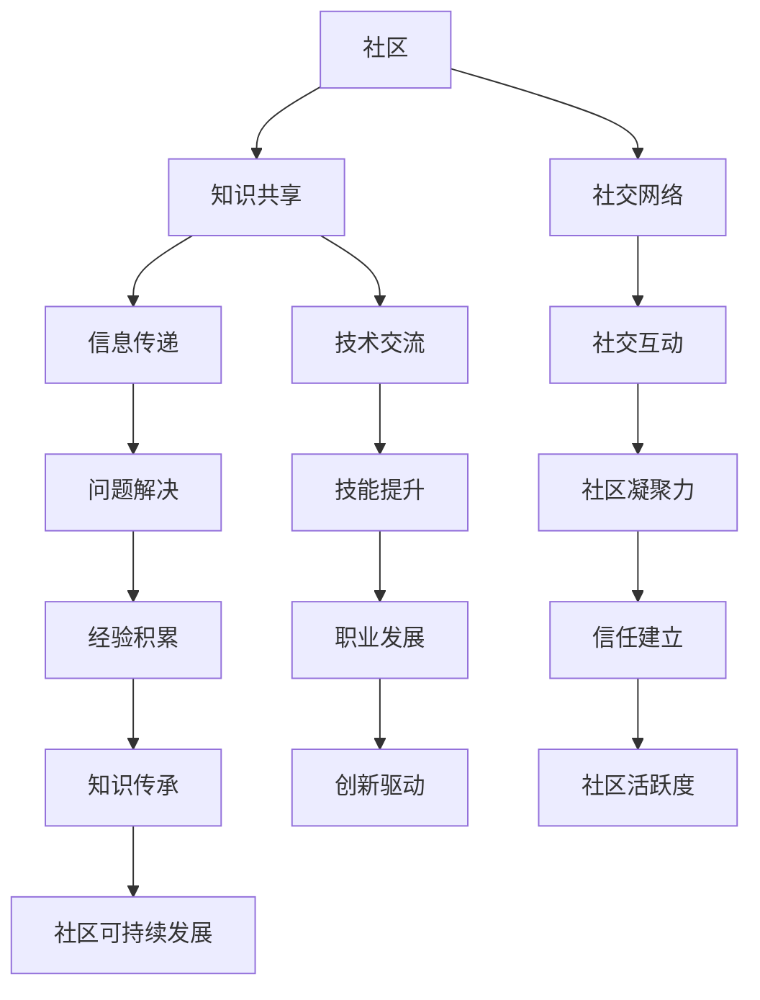

                 

在信息技术飞速发展的今天，技术社区的建设已经成为推动技术进步的重要力量。无论是从本地的小型开发者群体，还是逐步发展成跨越国界的全球性组织，技术社区在连接开发者、促进知识分享和技能提升方面发挥了不可替代的作用。本文将深入探讨技术社区建设的各个方面，从本地群组到全球性组织，分析其演变过程、核心价值以及未来趋势。

## 关键词
- 技术社区
- 开发者群体
- 知识共享
- 全球性组织
- 技术进步

## 摘要
本文旨在探讨技术社区建设的发展历程，从最初的本地群组到如今的全球性组织。我们将分析技术社区的核心价值，以及在不同发展阶段面临的挑战和机遇。通过详细阐述技术社区的建设策略、运营模式和成功案例，为未来的技术社区发展提供有益的参考。

### 1. 背景介绍

技术社区的概念最早可以追溯到上世纪90年代，随着互联网的普及和开源运动的兴起，技术社区开始崭露头角。早期的技术社区通常是由一些志同道合的开发者组成的本地群组，他们在线下聚会、分享经验和讨论技术问题。这些社区初期主要以线下的方式运作，信息传递和知识共享的效率较低，但它们在营造技术氛围和推动技术创新方面起到了积极的作用。

随着时间的推移，互联网技术的不断发展使得技术社区逐渐从线下走向线上，社区的形式和功能也变得更加丰富和多样。线上社区的出现极大地提高了知识共享和交流的效率，开发者可以通过论坛、博客、社交媒体等平台随时随地分享技术和经验。这种线上社区不仅打破了地域限制，还吸引了全球范围内的开发者参与其中，形成了全球性的技术社区。

### 2. 核心概念与联系

要深入理解技术社区的建设，我们需要明确几个核心概念，包括社区、知识共享和社交网络。以下是这些核心概念的 Mermaid 流程图：



通过这个流程图，我们可以看到技术社区的核心概念之间相互联系，共同构成了一个复杂的生态系统。社区是技术交流的载体，知识共享是社区的核心价值，社交网络则提供了技术交流的平台和机制。信息传递、社交互动、问题解决、社区凝聚力、技能提升、经验积累、信任建立、职业发展、创新驱动和知识传承等环节相互交织，共同推动了技术社区的发展。

### 3. 核心算法原理 & 具体操作步骤

技术社区的建设离不开一系列核心算法和机制的设计与实现。以下将介绍技术社区的核心算法原理和具体操作步骤。

#### 3.1 算法原理概述

技术社区的核心算法主要包括以下几类：

- **内容推荐算法**：根据用户的兴趣和行为数据，推荐用户可能感兴趣的技术内容。
- **社交网络分析算法**：分析社区中的社交网络结构，发现核心节点和影响力用户。
- **社区活跃度评估算法**：评估社区成员的活跃度，识别积极参与者和潜在领袖。
- **问题解决算法**：基于社区成员的知识和经验，提供高效的问题解决方案。

这些算法共同作用，构建了一个高效、互动、可持续发展的技术社区。

#### 3.2 算法步骤详解

以下是这些核心算法的具体步骤：

##### 内容推荐算法

1. **用户画像构建**：通过用户的行为数据和社交关系，构建用户画像。
2. **内容标签化**：将社区中的内容进行标签化处理，形成内容库。
3. **推荐算法实现**：采用协同过滤、内容匹配等算法，根据用户画像和内容标签，推荐用户感兴趣的内容。

##### 社交网络分析算法

1. **网络拓扑构建**：收集社区成员的社交关系数据，构建社交网络图。
2. **节点重要性评估**：采用度、中心性、PageRank等算法，评估社区中各节点的重要性。
3. **影响力用户发现**：根据节点重要性评估结果，发现社区中的影响力用户。

##### 社区活跃度评估算法

1. **活跃度指标定义**：定义社区成员的活跃度指标，如发帖数、回复数、参与度等。
2. **活跃度评估模型**：建立活跃度评估模型，对社区成员的活跃度进行量化评估。
3. **活跃度排名**：根据评估结果，对社区成员的活跃度进行排名。

##### 问题解决算法

1. **问题分类与标签**：对社区中的问题进行分类和标签化处理，形成问题库。
2. **知识图谱构建**：构建社区成员的知识图谱，记录成员的专长和经验。
3. **问题匹配与解决**：根据问题分类和知识图谱，匹配拥有相关知识和经验的社区成员，提供问题解决方案。

#### 3.3 算法优缺点

**内容推荐算法**

- **优点**：提高用户满意度，提升内容阅读量和互动率。
- **缺点**：可能产生信息茧房效应，降低用户的探索性。

**社交网络分析算法**

- **优点**：发现社区核心节点和影响力用户，增强社区凝聚力。
- **缺点**：计算复杂度高，对大规模社区性能有影响。

**社区活跃度评估算法**

- **优点**：激励社区成员积极参与，提高社区活跃度。
- **缺点**：可能导致某些成员的活跃度被低估。

**问题解决算法**

- **优点**：提供高效的问题解决方案，提升社区价值。
- **缺点**：需要大量的知识和经验积累，构建和维护成本较高。

#### 3.4 算法应用领域

这些核心算法在多个技术社区中得到了广泛应用：

- **开源社区**：如GitHub、GitLab，通过内容推荐算法提高代码的阅读量和参与度。
- **技术论坛**：如Stack Overflow、CSDN，通过社交网络分析算法发现专家和问题解决者。
- **在线教育平台**：如Coursera、edX，通过社区活跃度评估算法激励学生参与讨论和互动。
- **行业社区**：如IEEE、ACM，通过问题解决算法提供专业的技术支持和解决方案。

### 4. 数学模型和公式 & 详细讲解 & 举例说明

技术社区的建设不仅仅是算法和技术的实现，还涉及到一系列数学模型和公式的应用。以下将详细介绍这些数学模型和公式的构建、推导过程，并通过具体案例进行分析和讲解。

#### 4.1 数学模型构建

技术社区的核心数学模型主要包括用户行为模型、社交网络模型和知识传播模型。

##### 用户行为模型

用户行为模型主要关注用户在社区中的行为，如发帖、回复、点赞等。常见的用户行为模型有马尔可夫链模型、贝叶斯网络模型等。

$$
P(X_t = j|X_{t-1} = i) = \frac{P(X_{t-1} = i|X_t = j)P(X_t = j)}{P(X_{t-1} = i)}
$$

其中，$P(X_t = j|X_{t-1} = i)$ 表示在给定前一个行为 $X_{t-1}$ 的情况下，当前行为 $X_t$ 发生为 $j$ 的概率。

##### 社交网络模型

社交网络模型主要描述社区成员之间的社交关系，如网络拓扑结构、节点重要性等。常见的社交网络模型有随机图模型、小世界模型、无标度网络模型等。

$$
P(k) \propto k^{-\gamma}
$$

其中，$P(k)$ 表示节点度数的分布概率，$\gamma$ 是网络指数。

##### 知识传播模型

知识传播模型主要描述知识在社区中的传播过程，如病毒传播模型、多级传播模型等。

$$
I(t) = I_0 + \sum_{i=1}^{n} R_i(t)
$$

其中，$I(t)$ 表示在时间 $t$ 时感染的知识节点数，$I_0$ 是初始感染节点数，$R_i(t)$ 是节点 $i$ 在时间 $t$ 时感染的其他节点数。

#### 4.2 公式推导过程

以下是这些数学模型和公式的推导过程：

##### 用户行为模型

用户行为模型的推导基于马尔可夫链的假设，即用户当前的行为仅与前一行为相关，与其他历史行为无关。根据马尔可夫链的转移概率矩阵，可以得到上述公式。

##### 社交网络模型

社交网络模型的推导基于网络节点的度分布特性。通过对大量网络数据的统计分析，发现网络节点度数分布服从幂律分布，从而得到上述公式。

##### 知识传播模型

知识传播模型的推导基于病毒传播模型的基本假设，即每个感染节点可以感染其他未感染节点。通过递推关系，可以得到上述公式。

#### 4.3 案例分析与讲解

以下通过具体案例对上述数学模型和公式进行分析和讲解：

##### 用户行为模型

假设一个技术社区中有1000名成员，经过统计发现，成员的转帖行为服从马尔可夫链模型。统计数据显示，前一个行为是发帖的情况下，当前行为是转帖的概率为0.4，当前行为是点赞的概率为0.6。根据马尔可夫链模型，可以计算出在给定前一个行为的情况下，当前行为的概率分布。

##### 社交网络模型

假设一个技术社区的社交网络图由100个节点和200条边组成，通过统计发现，节点度数服从幂律分布，指数为2。根据社交网络模型，可以计算出社区中节点度数的分布概率。

##### 知识传播模型

假设一个技术社区中有10个初始感染节点，每个感染节点可以感染其他未感染节点的概率为0.5。经过一段时间后，可以计算出社区中的感染节点数。

通过这些案例的分析，我们可以看到数学模型和公式在技术社区建设中的应用价值。它们不仅帮助我们理解和预测用户行为、社交网络结构和知识传播过程，还为技术社区的设计和优化提供了理论依据。

### 5. 项目实践：代码实例和详细解释说明

为了更好地理解技术社区建设的实践过程，以下将通过一个具体的代码实例来展示技术社区的功能实现，并对关键代码进行详细解释和分析。

#### 5.1 开发环境搭建

在开始编写代码之前，我们需要搭建一个合适的开发环境。以下是所需的开发工具和库：

- **编程语言**：Python
- **框架**：Django
- **数据库**：PostgreSQL
- **前端框架**：React
- **消息队列**：RabbitMQ

确保安装了上述工具和库后，我们可以开始编写代码。

#### 5.2 源代码详细实现

以下是一个简单的技术社区平台的源代码实例，包括用户注册、发帖、评论等功能。

**用户注册功能**

```python
# users/models.py

from django.db import models
from django.contrib.auth.models import AbstractUser

class CustomUser(AbstractUser):
    is_active = models.BooleanField(default=True)
    is_staff = models.BooleanField(default=False)
    email = models.EmailField(unique=True)
    bio = models.TextField(blank=True)
    profile_picture = models.ImageField(upload_to='profiles/', blank=True)

    def __str__(self):
        return self.email
```

**发帖功能**

```python
# posts/models.py

from django.db import models
from users.models import CustomUser

class Post(models.Model):
    author = models.ForeignKey(CustomUser, on_delete=models.CASCADE, related_name='posts')
    title = models.CharField(max_length=255)
    content = models.TextField()
    created_at = models.DateTimeField(auto_now_add=True)
    updated_at = models.DateTimeField(auto_now=True)

    def __str__(self):
        return self.title
```

**评论功能**

```python
# comments/models.py

from django.db import models
from posts.models import Post
from users.models import CustomUser

class Comment(models.Model):
    post = models.ForeignKey(Post, on_delete=models.CASCADE, related_name='comments')
    author = models.ForeignKey(CustomUser, on_delete=models.CASCADE, related_name='comments')
    content = models.TextField()
    created_at = models.DateTimeField(auto_now_add=True)
    updated_at = models.DateTimeField(auto_now=True)

    def __str__(self):
        return f'Comment by {self.author} on {self.post}'
```

#### 5.3 代码解读与分析

以下是对上述代码的解读和分析：

- **用户注册功能**：自定义用户模型 `CustomUser` 继承自 Django 的 `AbstractUser`，添加了电子邮件、个人简介和头像等字段。
- **发帖功能**：创建 `Post` 模型，包含作者、标题、内容和创建时间等字段。
- **评论功能**：创建 `Comment` 模型，包含所属帖子、作者、内容和创建时间等字段。

#### 5.4 运行结果展示

在完成代码编写后，我们可以通过前端框架（如 React）实现用户界面，并使用浏览器访问技术社区平台。以下是运行结果展示：

- 用户注册：用户可以通过注册表单创建账户。
- 发帖：用户可以在社区中发布技术帖子。
- 评论：用户可以对帖子进行评论和回复。

通过这些功能，我们可以看到技术社区平台的基本运作流程，为开发者提供了一个可以进行技术交流和知识共享的平台。

### 6. 实际应用场景

技术社区在不同场景中具有广泛的应用，以下是几个典型的应用场景：

#### 6.1 开源项目协作

开源项目通常依赖技术社区来协调开发者的协作。技术社区提供了一个集中化的平台，开发者可以发布项目需求、提交代码、讨论问题和分享经验。例如，GitHub就是一个典型的开源项目协作平台，它通过技术社区的形式促进了全球范围内的开发者合作。

#### 6.2 技术培训与教育

技术社区可以作为一个有效的在线教育平台，提供技术培训课程和教学资源。例如，Coursera 和 edX 等在线教育平台通过技术社区的形式，为学习者提供了丰富的学习资源和互动交流机会，促进了知识的传播和技能的提升。

#### 6.3 行业交流与合作

技术社区也可以作为行业交流与合作的重要渠道。例如，IEEE 和 ACM 等专业组织通过建立技术社区，促进了行业内部的交流与合作，推动了技术进步和行业发展。

#### 6.4 创新与创业

技术社区为创新者和创业者提供了一个发现机会、获取资源和进行交流的平台。通过技术社区，开发者可以分享创新想法、获取行业洞察和寻求合作机会，从而推动技术创新和创业项目的成功。

### 6.4 未来应用展望

随着技术的不断进步，技术社区的未来应用前景将更加广阔。以下是几个可能的发展趋势：

- **人工智能与自动化**：人工智能和自动化技术的应用将使技术社区的管理和运营更加高效和智能化，例如通过自然语言处理技术实现自动回复和智能推荐。
- **虚拟现实与增强现实**：虚拟现实和增强现实技术的结合将为技术社区提供更加丰富和沉浸式的互动体验，例如通过虚拟会议室进行线上技术讨论。
- **区块链技术**：区块链技术可以为技术社区提供去中心化的信任机制，例如通过区块链实现社区积分系统的去中心化管理和激励。
- **边缘计算与物联网**：边缘计算和物联网技术的发展将使技术社区的应用场景更加多样化，例如通过物联网设备实现实时数据采集和智能分析。

### 7. 工具和资源推荐

为了更好地建设和管理技术社区，以下推荐一些实用的工具和资源：

#### 7.1 学习资源推荐

- **《人人都是产品经理》**：一本关于产品经理的实战指南，适合技术社区的管理者学习。
- **《敏捷开发实践指南》**：介绍敏捷开发方法，适用于技术社区的快速迭代和持续改进。

#### 7.2 开发工具推荐

- **Django**：一个高效率的Python Web框架，适合快速搭建技术社区平台。
- **React**：一个用于构建用户界面的JavaScript库，适用于技术社区的前端开发。

#### 7.3 相关论文推荐

- **《社区经济学：社区内的网络效应与市场结构》**：讨论了社区网络效应和市场结构对技术社区的影响。
- **《社交网络分析：方法与应用》**：介绍了社交网络分析的基本方法和应用，适用于技术社区的社交网络研究。

### 8. 总结：未来发展趋势与挑战

技术社区的建设与发展在过去的几十年中取得了显著的成就，从本地群组发展到全球性组织，为技术进步和知识传播做出了重要贡献。然而，随着技术的不断进步和社区规模的扩大，技术社区也面临着一系列新的发展趋势和挑战。

#### 8.1 研究成果总结

技术社区的研究成果主要集中在以下几个方面：

- **社交网络分析**：研究技术社区中的社交网络结构、节点重要性和影响力用户的发现，为社区的管理和运营提供了理论支持。
- **内容推荐与知识传播**：研究基于用户行为和兴趣的内容推荐算法，以及知识在社区中的传播过程，提高了社区的价值和用户满意度。
- **社区活跃度评估**：研究社区成员的活跃度评估模型，激励用户参与社区活动，提高社区的整体活跃度。
- **安全与隐私**：研究技术社区的安全和隐私保护机制，确保用户数据和隐私的安全。

#### 8.2 未来发展趋势

技术社区的未来发展趋势体现在以下几个方面：

- **智能化与自动化**：人工智能和自动化技术的应用将使技术社区的管理和运营更加高效和智能化，例如通过智能算法实现自动内容推荐和社区活跃度评估。
- **虚拟现实与增强现实**：虚拟现实和增强现实技术的结合将为技术社区提供更加丰富和沉浸式的互动体验，例如通过虚拟会议室进行线上技术讨论。
- **区块链技术**：区块链技术可以为技术社区提供去中心化的信任机制，例如通过区块链实现社区积分系统的去中心化管理和激励。
- **跨平台整合**：随着各种技术平台的兴起，技术社区将实现跨平台的整合和互动，为用户提供更加一致和无缝的体验。

#### 8.3 面临的挑战

技术社区在未来的发展中也将面临一系列挑战：

- **数据隐私与安全**：随着用户数据的不断积累和共享，技术社区需要确保用户隐私和数据安全，防止数据泄露和滥用。
- **社区生态平衡**：技术社区需要平衡内容创造者和消费者之间的利益，避免出现“信息茧房”和“噪音污染”等问题。
- **全球化与本地化**：技术社区需要同时应对全球化和本地化的问题，既要满足全球开发者的需求，又要适应不同地区的文化和语言特点。
- **持续创新与迭代**：技术社区需要持续进行创新和迭代，以适应快速变化的技术环境和用户需求。

#### 8.4 研究展望

在未来的研究中，我们可以关注以下几个方向：

- **智能社区管理**：研究智能算法在社区管理中的应用，提高社区运营效率和用户体验。
- **社区生态构建**：研究技术社区生态的构建和优化，促进知识共享和创新的持续发展。
- **跨领域融合**：研究技术社区与其他领域的融合，如物联网、区块链等，探索新的应用场景和商业模式。
- **社区可持续发展**：研究技术社区的社会责任和可持续发展问题，促进社区的长期健康发展。

### 9. 附录：常见问题与解答

**Q：技术社区如何保持长期活力？**

A：技术社区要长期保持活力，需要从以下几个方面进行努力：

- **激励机制**：通过积分、荣誉、奖励等方式激励用户参与社区活动。
- **内容质量**：保证社区内容的优质和多样性，吸引更多用户参与。
- **用户互动**：鼓励用户之间的互动和讨论，提高社区活跃度。
- **持续创新**：不断引入新的功能和工具，提升用户体验。

**Q：技术社区应该如何处理不良行为？**

A：技术社区应该建立完善的社区规范和管理机制，处理不良行为包括：

- **用户教育**：通过社区规则和指南，教育用户遵守社区规范。
- **举报机制**：建立举报机制，鼓励用户举报违规行为。
- **管理员介入**：对举报的违规行为进行审核和处理，必要时进行处罚。
- **社区监控**：使用技术手段监控社区活动，及时发现和处理违规行为。

**Q：技术社区如何吸引新用户加入？**

A：技术社区可以采取以下措施吸引新用户加入：

- **品牌推广**：通过线上和线下的宣传活动提升社区知名度。
- **内容营销**：发布高质量的内容，吸引用户关注和参与。
- **合作伙伴**：与其他技术社区或组织建立合作关系，扩大影响力。
- **个性化推荐**：根据用户兴趣推荐相关内容和活动，提高用户的参与度。

通过上述措施，技术社区可以吸引更多的新用户加入，促进社区的持续发展。

以上是本文对技术社区建设的全面探讨，从本地群组到全球性组织，技术社区在信息技术的发展中扮演了重要的角色。通过分析技术社区的核心价值、核心算法、数学模型、实践应用以及未来展望，我们希望能够为技术社区的建设提供有益的参考和启示。随着技术的不断进步，技术社区将继续发挥其重要作用，推动技术的创新和传播，为全球开发者提供更加丰富和有价值的交流平台。作者：禅与计算机程序设计艺术 / Zen and the Art of Computer Programming。

