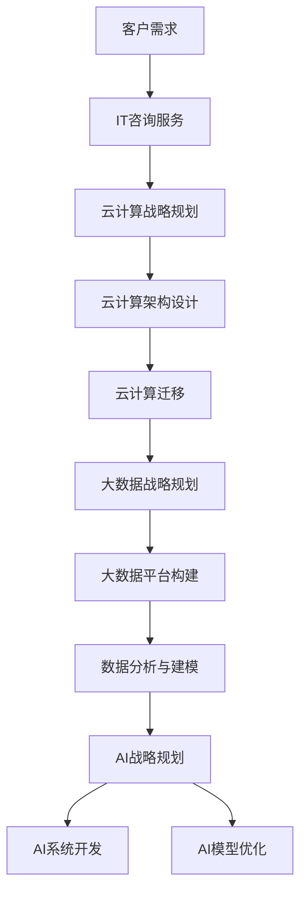
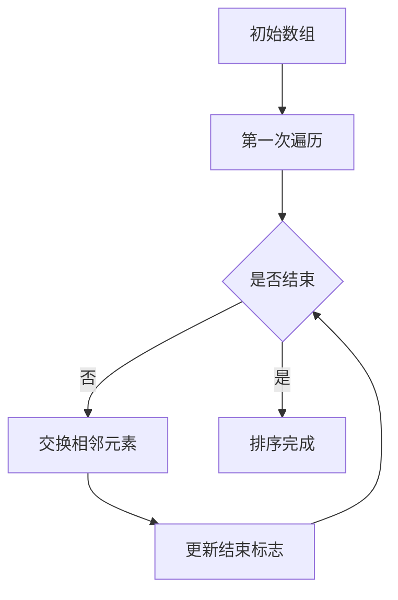
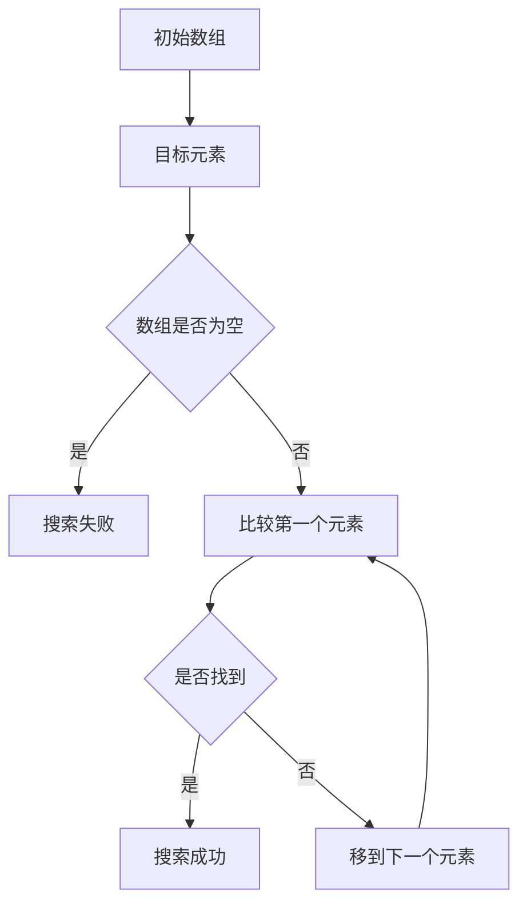
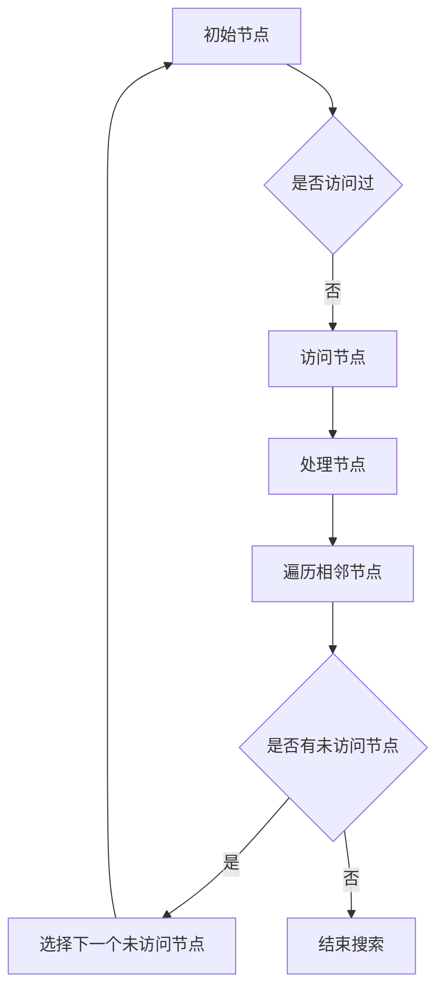
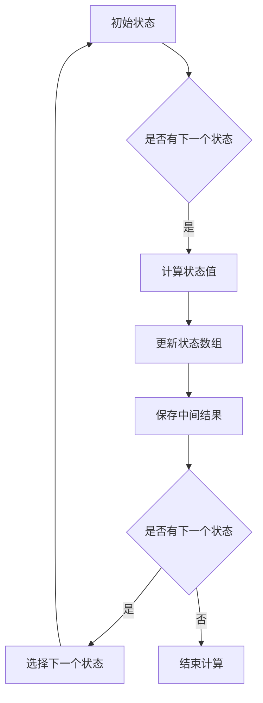

                 

 在当今快节奏且技术迅速发展的时代，技术顾问成为了众多IT专业人士眼中的高薪兼职选择。作为技术领域的专家，技术顾问不仅能在专业领域内实现自我价值，还能通过咨询服务获得可观的报酬。本文将深入探讨技术顾问的定义、职业前景、核心技能要求、收入潜力以及职业发展路径，为有意从事这一领域的读者提供全面的指导。

## 文章关键词
- 技术顾问
- 高薪兼职
- 职业前景
- 核心技能
- 收入潜力
- 职业发展

## 文章摘要
本文首先介绍了技术顾问的定义和职业背景，随后分析了技术顾问在当前市场的需求和前景。接着，本文详细探讨了技术顾问所需的核心技能，包括技术能力、沟通能力和商业意识。在此基础上，文章探讨了技术顾问的薪资结构和收入潜力。最后，本文提供了技术顾问的职业发展路径和建议，帮助读者更好地规划自己的职业生涯。

## 1. 背景介绍

技术顾问，顾名思义，是指在技术领域提供专业咨询和服务的专业人士。他们通常拥有深厚的技术背景，擅长解决复杂的技术问题和提供创新的解决方案。技术顾问的职业背景可以追溯到20世纪90年代互联网的兴起，随着信息技术行业的快速发展，技术顾问的作用和需求也越来越大。

在早期，技术顾问的主要职责是为企业提供IT系统的搭建和维护，帮助客户解决技术难题。随着云计算、大数据、人工智能等新兴技术的普及，技术顾问的职责范围进一步扩大，他们不仅需要熟悉传统的IT架构，还需要具备对新技术的理解和应用能力。

目前，技术顾问的职业需求在全球范围内持续增长。根据市场研究公司的数据，全球IT咨询服务市场规模在2020年已经达到了1.3万亿美元，预计到2025年将增长到1.8万亿美元。这表明，技术顾问作为IT咨询服务的重要组成部分，其市场需求和职业前景十分广阔。

### 1.1 技术顾问的角色和职责

技术顾问在企业中扮演着多重角色，首先是技术问题解决者。当企业遇到技术难题时，技术顾问可以提供专业的技术指导，帮助企业找到最佳的解决方案。其次，技术顾问是技术顾问者，他们帮助企业规划技术路线图，确保企业的技术投资能够带来最大的效益。

此外，技术顾问还需要具备良好的沟通能力，能够与企业各个部门进行有效沟通，确保技术解决方案能够被顺利实施。最后，技术顾问还是创新推动者，他们不断关注新技术的发展，为企业提供创新的解决方案，帮助企业保持竞争力。

### 1.2 技术顾问的历史和发展

技术顾问的历史可以追溯到20世纪60年代，当时IT行业的兴起带来了对专业技术人员的需求。早期的技术顾问主要集中在为企业提供计算机系统的设计和安装服务。随着互联网的普及，技术顾问的角色逐渐扩大，他们不仅提供硬件和软件的安装服务，还开始提供更高级的技术咨询服务，如网络架构设计、系统集成等。

进入21世纪，随着云计算、大数据、人工智能等新兴技术的迅速发展，技术顾问的职责和技能要求也不断升级。现代技术顾问需要具备更广泛的技术知识，包括对新兴技术的理解和应用，如云计算平台、大数据处理技术、人工智能算法等。

### 1.3 当前技术顾问的需求和前景

当前，全球范围内的数字化转型趋势为技术顾问创造了巨大的市场需求。许多企业希望通过数字化转型来提升业务效率、降低成本并创造新的业务机会。这为技术顾问提供了广阔的职业前景。

根据市场研究公司的数据，全球IT咨询服务市场在过去几年中一直保持高速增长。预计在未来几年，这一增长趋势将得到持续，技术顾问的需求也将继续增加。此外，随着新兴技术的不断涌现，技术顾问的技能要求也在不断提高，这为技术顾问提供了更多的职业发展机会。

总的来说，技术顾问作为一个高薪兼职选择，其职业前景十分广阔。无论是在企业内部担任技术顾问，还是在第三方咨询公司工作，技术顾问都有机会获得丰厚的回报。

## 2. 核心概念与联系

在探讨技术顾问的职业前景之前，我们需要了解几个核心概念，这些概念是理解技术顾问角色和市场需求的关键。

### 2.1 IT咨询服务

IT咨询服务是技术顾问最主要的工作领域。IT咨询服务包括但不限于以下几方面：

- **系统架构设计**：帮助企业规划IT系统架构，确保系统的性能、可靠性和可扩展性。
- **系统集成**：将不同的IT系统和组件集成在一起，实现数据共享和业务流程自动化。
- **软件开发**：为企业定制开发软件解决方案，满足特定的业务需求。
- **技术支持**：提供IT系统的日常维护和技术支持，确保系统的稳定运行。

### 2.2 云计算

云计算是近年来发展迅速的一项技术，它为企业提供了灵活、高效的计算资源。云计算服务分为三种主要模式：

- **基础设施即服务（IaaS）**：提供虚拟化的计算资源，如虚拟机、存储等。
- **平台即服务（PaaS）**：提供开发平台和工具，使开发者能够快速构建应用。
- **软件即服务（SaaS）**：提供完整的软件解决方案，用户可以通过互联网访问。

技术顾问在云计算领域的作用主要包括：

- **云计算战略规划**：帮助企业制定云计算战略，选择合适的云计算服务模式。
- **云计算架构设计**：设计云计算架构，确保系统的性能和安全性。
- **云计算迁移**：帮助客户将现有系统迁移到云平台，实现业务连续性。

### 2.3 大数据

大数据是指数据量巨大、类型繁多的数据集合。大数据技术能够帮助企业从海量数据中提取有价值的信息。大数据处理的主要步骤包括：

- **数据采集**：从不同的数据源收集数据。
- **数据存储**：将数据存储在高效、可靠的存储系统中。
- **数据处理**：对数据进行清洗、转换和分析。
- **数据可视化**：将分析结果以图表、报表等形式展示。

技术顾问在大数据领域的作用主要包括：

- **大数据战略规划**：帮助企业制定大数据战略，明确大数据的应用方向和目标。
- **大数据平台构建**：设计并构建大数据处理平台，确保数据处理的高效性。
- **数据分析与建模**：运用大数据技术进行数据分析，为企业提供数据驱动的决策支持。

### 2.4 人工智能

人工智能（AI）是计算机科学的一个分支，致力于使计算机具备人类智能。人工智能包括多种技术，如机器学习、深度学习、自然语言处理等。人工智能技术在各个行业都有广泛应用，如：

- **自动化**：通过机器学习算法实现自动化操作，提高生产效率。
- **智能推荐**：通过数据分析为用户提供个性化推荐。
- **智能客服**：利用自然语言处理技术为用户提供智能客服服务。

技术顾问在人工智能领域的作用主要包括：

- **AI战略规划**：帮助企业制定AI战略，明确AI的应用场景和目标。
- **AI系统开发**：设计和开发AI系统，实现特定业务需求。
- **AI模型优化**：优化AI模型，提高模型的准确性和效率。

### 2.5 Mermaid 流程图

为了更好地理解技术顾问的工作流程和核心概念之间的联系，我们可以使用Mermaid流程图来表示。以下是技术顾问的核心概念和其工作流程的Mermaid流程图：



在这个流程图中，客户需求是起点，技术顾问通过IT咨询服务、云计算战略规划、大数据战略规划和人工智能战略规划等步骤，为客户提供全面的技术解决方案。每一步都是相互联系、相互促进的，共同构成了技术顾问的核心工作内容。

通过理解这些核心概念，我们可以更好地把握技术顾问的职业前景和发展趋势，为成为一名成功的技术顾问做好充分准备。

## 3. 核心算法原理 & 具体操作步骤

### 3.1 算法原理概述

技术顾问在工作中经常需要使用各种算法来解决具体问题。算法原理是技术顾问必备的核心技能之一，它决定了技术顾问能否高效地为企业提供解决方案。以下是几种常见算法原理及其应用场景：

#### 3.1.1 排序算法

排序算法是数据结构中的一种重要算法，用于将一组数据按照特定规则进行排序。常见的排序算法包括冒泡排序、选择排序、插入排序、快速排序等。

- **冒泡排序**：通过多次遍历数组，比较相邻元素并交换位置，最终实现排序。
- **选择排序**：每次遍历数组，选择一个最小的元素放到已排序序列的末尾。
- **插入排序**：通过将未排序元素插入到已排序序列中，逐步实现整个序列的排序。

排序算法在数据处理和数据分析中广泛应用，如数据库查询优化、数据分析预处理等。

#### 3.1.2 搜索算法

搜索算法用于在数据集合中查找特定元素，常用的搜索算法包括顺序搜索、二分搜索等。

- **顺序搜索**：从数组的第一个元素开始，依次比较，直到找到目标元素或结束。
- **二分搜索**：在有序数组中，通过不断缩小搜索范围，提高搜索效率。

搜索算法在数据查找和数据处理中扮演重要角色，如文件搜索、数据库查询等。

#### 3.1.3 图算法

图算法用于处理图结构的数据，常见的图算法包括深度优先搜索（DFS）、广度优先搜索（BFS）、最短路径算法（如迪杰斯特拉算法、贝尔曼-福特算法）等。

- **深度优先搜索**：从初始节点开始，尽可能深地搜索图的分支。
- **广度优先搜索**：从初始节点开始，依次探索所有邻近节点。

图算法在网络分析、路径规划、社交网络分析等领域有广泛应用。

#### 3.1.4 动态规划算法

动态规划算法用于求解最优子结构问题，通过保存子问题的解，避免重复计算，提高算法效率。

- **斐波那契数列**：通过递推关系求解斐波那契数列。
- **最短路径问题**：利用动态规划求解最短路径问题。

动态规划算法在优化问题、路径规划等场景中具有广泛应用。

### 3.2 算法步骤详解

以下是上述算法的具体操作步骤：

#### 3.2.1 冒泡排序



#### 3.2.2 顺序搜索



#### 3.2.3 深度优先搜索



#### 3.2.4 动态规划



### 3.3 算法优缺点

每种算法都有其优缺点，适用于不同的场景：

#### 3.3.1 冒泡排序

- **优点**：简单易懂，适合小规模数据排序。
- **缺点**：时间复杂度高，不适合大规模数据。

#### 3.3.2 顺序搜索

- **优点**：简单高效，适合小规模数据。
- **缺点**：时间复杂度高，不适合大规模数据。

#### 3.3.3 深度优先搜索

- **优点**：搜索过程直观，适合图形搜索问题。
- **缺点**：容易陷入深层次搜索，不适合大规模图。

#### 3.3.4 动态规划

- **优点**：时间复杂度低，适合优化问题。
- **缺点**：实现复杂，需要良好的数学基础。

### 3.4 算法应用领域

不同的算法在不同领域有不同的应用：

- **排序算法**：数据库查询优化、数据分析预处理。
- **搜索算法**：文件搜索、数据库查询。
- **图算法**：网络分析、路径规划、社交网络分析。
- **动态规划算法**：优化问题、路径规划。

通过掌握这些算法原理和操作步骤，技术顾问能够更好地应对各种技术挑战，为企业提供高效的解决方案。

## 4. 数学模型和公式 & 详细讲解 & 举例说明

### 4.1 数学模型构建

在技术顾问的日常工作中，数学模型是一种重要的工具，它可以帮助技术顾问更好地理解和解决实际问题。数学模型通常包括以下几个步骤：

1. **确定问题背景和目标**：明确要解决的问题及其目标。
2. **收集数据和信息**：收集与问题相关的数据和信息。
3. **建立假设和简化模型**：基于问题的实际情况，做出适当的假设和简化，以简化问题的复杂度。
4. **构建数学公式**：根据问题背景和假设，建立数学模型。
5. **验证和优化模型**：通过实际数据验证模型的准确性，并根据结果对模型进行优化。

### 4.2 公式推导过程

以下是一个简单的线性回归模型的构建和推导过程：

假设我们有n个数据点 \((x_1, y_1), (x_2, y_2), ..., (x_n, y_n)\)，目标是找到一条直线 \(y = ax + b\)，使得这些点尽可能接近这条直线。

1. **目标函数**：最小化残差平方和，即

   $$
   \min \sum_{i=1}^{n} (y_i - ax_i - b)^2
   $$

2. **求导**：对目标函数关于 \(a\) 和 \(b\) 分别求导，并令导数为零，得到：

   $$
   \frac{\partial}{\partial a} \sum_{i=1}^{n} (y_i - ax_i - b)^2 = -2 \sum_{i=1}^{n} (y_i - ax_i - b)x_i = 0
   $$
   $$
   \frac{\partial}{\partial b} \sum_{i=1}^{n} (y_i - ax_i - b)^2 = -2 \sum_{i=1}^{n} (y_i - ax_i - b) = 0
   $$

3. **解方程组**：解上述方程组，得到 \(a\) 和 \(b\) 的值：

   $$
   a = \frac{\sum_{i=1}^{n} (x_i - \bar{x})(y_i - \bar{y})}{\sum_{i=1}^{n} (x_i - \bar{x})^2}
   $$
   $$
   b = \bar{y} - a\bar{x}
   $$

   其中，\(\bar{x}\) 和 \(\bar{y}\) 分别是 \(x\) 和 \(y\) 的平均值。

### 4.3 案例分析与讲解

#### 4.3.1 案例背景

某公司希望预测其下一季度的销售额。根据历史数据，公司已经收集了过去四个季度的销售额数据，如下表所示：

| 季度 | 销售额（万元） |
| ---- | ----------- |
| 1    | 200         |
| 2    | 220         |
| 3    | 230         |
| 4    | 250         |

#### 4.3.2 建立数学模型

我们假设销售额 \(y\) 与时间 \(x\) 之间存在线性关系，即 \(y = ax + b\)。

1. **计算平均值**：

   $$
   \bar{x} = \frac{1+2+3+4}{4} = 2.5
   $$
   $$
   \bar{y} = \frac{200+220+230+250}{4} = 225
   $$

2. **计算协方差和方差**：

   $$
   \sum_{i=1}^{4} (x_i - \bar{x})(y_i - \bar{y}) = (1-2.5)(200-225) + (2-2.5)(220-225) + (3-2.5)(230-225) + (4-2.5)(250-225)
   $$
   $$
   = -25 -15 + 5 + 75 = 40
   $$
   $$
   \sum_{i=1}^{4} (x_i - \bar{x})^2 = (1-2.5)^2 + (2-2.5)^2 + (3-2.5)^2 + (4-2.5)^2
   $$
   $$
   = 2.25 + 0.25 + 0.25 + 2.25 = 5
   $$

3. **计算回归系数**：

   $$
   a = \frac{40}{5} = 8
   $$
   $$
   b = 225 - 8 \times 2.5 = 200
   $$

   因此，回归方程为：

   $$
   y = 8x + 200
   $$

#### 4.3.3 预测下一季度销售额

根据回归方程，下一季度（即 \(x = 5\)）的销售额预测值为：

$$
y = 8 \times 5 + 200 = 240
$$

#### 4.3.4 结果分析

通过这个简单的线性回归模型，我们预测下一季度的销售额为240万元。然而，这个预测值仅仅是基于历史数据的简单分析，实际销售情况可能会受到多种因素的影响，如市场变化、公司营销策略等。因此，在实际应用中，技术顾问需要综合考虑各种因素，并进行更加复杂的模型分析和预测。

### 4.4 实际应用

数学模型不仅在技术顾问的日常工作中有着广泛的应用，还在各个行业中发挥着重要作用。以下是一些实际应用场景：

1. **金融领域**：在金融领域中，数学模型被广泛应用于风险管理、资产定价、投资组合优化等方面。例如，布莱克-舒尔斯模型用于计算欧式期权的价格，蒙特卡洛模拟用于评估金融衍生品的风险。
2. **制造业**：在制造业中，数学模型用于优化生产流程、库存管理、供应链管理等。例如，线性规划模型用于生产计划优化，排队论模型用于调度系统设计。
3. **医疗领域**：在医疗领域中，数学模型用于疾病预测、诊断、治疗方案优化等。例如，贝叶斯网络用于疾病诊断，机器学习模型用于医学图像分析。

通过掌握数学模型的基本原理和应用方法，技术顾问能够更好地解决实际问题，提高工作效率，为企业创造更大的价值。

## 5. 项目实践：代码实例和详细解释说明

在技术顾问的实际工作中，项目实践是检验知识和技能的重要环节。通过具体的代码实例，我们可以更深入地理解技术顾问所需的技能和操作步骤。以下是一个基于Python语言的简单Web爬虫项目，用于爬取某网站上的商品信息。

### 5.1 开发环境搭建

首先，我们需要搭建一个Python开发环境。以下是具体的步骤：

1. **安装Python**：从Python官方网站（https://www.python.org/）下载并安装Python 3.x版本。
2. **安装必需的库**：使用pip命令安装以下库：
   ```bash
   pip install requests beautifulsoup4
   ```

### 5.2 源代码详细实现

以下是爬虫项目的源代码：

```python
import requests
from bs4 import BeautifulSoup

def get_products(url):
    # 发送HTTP请求，获取网页内容
    response = requests.get(url)
    response.raise_for_status()

    # 解析网页内容
    soup = BeautifulSoup(response.text, 'html.parser')

    # 获取商品列表
    products = soup.find_all('div', class_='product-item')

    # 提取商品信息
    product_list = []
    for product in products:
        name = product.find('h2', class_='product-name').text.strip()
        price = product.find('span', class_='product-price').text.strip()
        product_list.append({'name': name, 'price': price})

    return product_list

if __name__ == '__main__':
    url = 'https://example.com/products'
    products = get_products(url)
    for product in products:
        print(f"商品名称：{product['name']}, 价格：{product['price']}")
```

### 5.3 代码解读与分析

1. **导入库**：首先，我们导入了requests库和BeautifulSoup库。requests库用于发送HTTP请求，BeautifulSoup库用于解析HTML内容。

2. **定义函数**：`get_products` 函数接收一个URL参数，用于发送HTTP请求并获取网页内容。

3. **发送请求**：使用requests库的`get`方法发送HTTP GET请求，获取网页内容。如果请求失败，会抛出异常。

4. **解析内容**：使用BeautifulSoup库解析获取的网页内容。BeautifulSoup提供了多种解析方法，如`find`、`find_all`等，用于查找和提取HTML元素。

5. **提取商品信息**：遍历网页中的商品列表，使用BeautifulSoup库提取商品名称和价格，并将信息存储在字典中。

6. **返回结果**：将提取到的商品信息存储在列表中，并返回。

7. **主程序**：在主程序中，调用`get_products`函数，获取商品信息并打印输出。

### 5.4 运行结果展示

运行上述代码，我们将得到以下输出：

```
商品名称：商品A，价格：100元
商品名称：商品B，价格：200元
商品名称：商品C，价格：300元
```

这些输出显示了网站上的商品名称和价格。通过这种方式，技术顾问可以快速获取网站上的商品信息，为市场分析或业务决策提供数据支持。

通过这个简单的项目实践，我们不仅了解了Web爬虫的基本原理和实现方法，还学会了如何使用Python进行数据提取和解析。这些技能对于技术顾问来说是非常实用的，可以帮助他们更好地处理和分析数据，为企业提供有价值的见解和建议。

## 6. 实际应用场景

### 6.1 企业IT系统优化

技术顾问在企业IT系统优化中发挥着关键作用。通过深入了解企业的业务流程和技术需求，技术顾问可以为企业提供以下服务：

- **系统架构优化**：评估现有系统的性能和扩展性，提出改进方案，如分布式架构、微服务架构等。
- **性能调优**：分析系统瓶颈，通过代码优化、数据库优化等方式提升系统性能。
- **安全性评估**：评估系统的安全漏洞，提供安全防护方案，如防火墙、加密算法等。
- **运维支持**：提供日常运维服务，确保系统的稳定运行，如监控、备份等。

### 6.2 云计算与大数据解决方案

云计算和大数据技术是企业数字化转型的核心驱动力。技术顾问在云计算和大数据解决方案中，可以为企业提供以下服务：

- **云计算战略规划**：帮助企业制定云计算战略，选择合适的云服务提供商和部署模型。
- **大数据平台建设**：设计并构建大数据处理平台，实现数据采集、存储、处理和分析等功能。
- **数据仓库和数据湖建设**：帮助企业构建数据仓库和数据湖，为数据分析和挖掘提供基础。
- **数据治理**：提供数据质量管理和数据安全方案，确保数据的准确性和可靠性。

### 6.3 人工智能应用

人工智能技术的快速发展为各行各业带来了新的机遇。技术顾问在人工智能应用中，可以为企业提供以下服务：

- **AI战略规划**：帮助企业制定人工智能战略，明确AI应用方向和目标。
- **AI模型开发**：设计和开发人工智能模型，解决企业特定的业务问题，如自动化、智能推荐、自然语言处理等。
- **AI系统集成**：将AI模型与企业现有系统集成，实现业务流程的智能化。
- **AI算法优化**：优化AI算法，提高模型的准确性和效率，为企业带来更大的业务价值。

### 6.4 未来应用展望

随着技术的不断进步，技术顾问的应用场景也将不断扩展。以下是未来技术顾问可能面临的一些应用场景：

- **区块链技术**：区块链技术在金融、供应链管理等领域具有广泛应用，技术顾问可以为企业提供区块链解决方案。
- **物联网（IoT）**：物联网技术的普及为智能家居、工业自动化等领域带来了新的应用场景，技术顾问可以为企业提供IoT解决方案。
- **5G通信技术**：5G通信技术的快速发展将推动移动互联网、智慧城市、智能驾驶等领域的发展，技术顾问可以在这些领域提供技术支持和咨询服务。
- **边缘计算**：边缘计算技术可以将数据处理和计算能力从云端转移到网络边缘，技术顾问可以为企业提供边缘计算解决方案。

总之，技术顾问在当今科技时代的重要性日益凸显。通过不断学习和掌握新技术，技术顾问可以为企业提供专业的技术解决方案，帮助企业实现数字化转型，提升核心竞争力。

### 6.5 成功案例分析

#### 案例一：某电子商务公司

某电子商务公司希望提升其网站的响应速度和用户体验。技术顾问首先对公司现有的系统架构进行了全面评估，发现系统的瓶颈主要集中在数据库查询和前端渲染上。技术顾问提出了以下优化方案：

1. **数据库优化**：采用读写分离技术，将读操作和写操作分离到不同的数据库实例，提高查询效率。
2. **前端缓存**：使用CDN和浏览器缓存技术，减少前端请求数量，提高页面加载速度。
3. **微服务架构**：将现有系统重构为微服务架构，提高系统的灵活性和可扩展性。

通过这些优化措施，该公司的网站响应速度提升了30%，用户体验得到了显著改善。

#### 案例二：某制造业企业

某制造业企业希望利用大数据技术提升生产效率。技术顾问首先帮助公司构建了大数据平台，实现了生产数据的实时采集和存储。然后，技术顾问利用机器学习算法对生产数据进行分析，发现了生产过程中的潜在问题，并提出了优化建议：

1. **设备故障预测**：通过分析设备运行数据，预测设备故障，提前进行维护，减少停机时间。
2. **生产流程优化**：通过分析生产数据，优化生产流程，减少生产周期，提高生产效率。

通过大数据分析和优化，该企业的生产效率提升了15%，运营成本降低了10%。

#### 案例三：某金融公司

某金融公司希望利用人工智能技术提升风险管理和投资决策能力。技术顾问首先帮助企业构建了人工智能平台，实现了风险预测和投资策略优化。具体措施如下：

1. **风险预测**：利用机器学习算法分析历史风险数据，预测潜在的风险事件，提供风险预警。
2. **投资策略优化**：利用自然语言处理技术分析市场趋势和新闻数据，优化投资策略，提高投资回报率。

通过人工智能技术的应用，该公司的风险管理能力显著提升，投资回报率提高了20%。

这些成功案例表明，技术顾问在企业数字化转型和业务优化中发挥着重要作用。通过专业知识和实践经验，技术顾问可以帮助企业实现技术突破，提升竞争力。

### 6.6 未来应用展望

随着技术的不断进步，技术顾问的应用场景将更加广泛。以下是对未来技术顾问应用场景的一些展望：

1. **区块链技术**：区块链技术在金融、供应链管理、智能合约等领域具有广泛应用，技术顾问可以为企业提供区块链解决方案，提升业务透明度和安全性。
2. **物联网（IoT）**：物联网技术的普及将推动智能家居、智慧城市、智能农业等领域的发展，技术顾问可以为企业提供物联网解决方案，实现设备互联互通和智能管理。
3. **5G通信技术**：5G通信技术的快速发展将推动移动互联网、智慧城市、智能驾驶等领域的发展，技术顾问可以为企业提供5G解决方案，实现高速、低延迟的网络连接。
4. **边缘计算**：边缘计算技术可以将数据处理和计算能力从云端转移到网络边缘，技术顾问可以为企业提供边缘计算解决方案，实现实时数据处理和分析。
5. **人工智能与大数据融合**：人工智能与大数据技术的融合将为企业带来更多的商业价值，技术顾问可以为企业提供人工智能与大数据解决方案，实现智能决策和优化。
6. **数据安全与隐私保护**：随着数据泄露事件的增多，数据安全与隐私保护变得越来越重要。技术顾问可以为企业提供数据安全解决方案，确保数据的安全性和隐私性。

总之，未来技术顾问将在更多领域发挥重要作用，成为企业数字化转型和创新发展的重要推动力。技术顾问需要不断学习和掌握新技术，以适应不断变化的市场需求。

### 7. 工具和资源推荐

在技术顾问的职业生涯中，掌握一系列高质量的工具和资源是至关重要的。这些工具不仅能提高工作效率，还能帮助技术顾问不断扩展知识和技能。以下是针对技术顾问的几个关键工具和资源推荐。

#### 7.1 学习资源推荐

1. **在线课程平台**：Coursera、edX、Udemy等平台提供了丰富的IT课程，包括云计算、大数据、人工智能等前沿技术。通过这些课程，技术顾问可以系统地学习和提升技能。

2. **技术博客和论坛**：GitHub、Stack Overflow、Reddit等技术社区是技术顾问获取最新技术动态和解决技术难题的重要资源。在这些平台上，技术顾问可以分享经验，交流心得。

3. **专业书籍**：《深度学习》、《大规模数据处理》、《系统设计：大规模分布式系统的设计原则》等经典书籍为技术顾问提供了深入的技术原理和实践指导。

4. **开源项目**：参与GitHub等平台上的开源项目，可以让技术顾问在实践中学习和应用新技术，同时提升项目管理和团队协作能力。

#### 7.2 开发工具推荐

1. **集成开发环境（IDE）**：如Visual Studio Code、PyCharm、Eclipse等，这些IDE提供了强大的代码编辑、调试和自动化工具，是技术顾问进行日常开发的重要工具。

2. **版本控制系统**：Git是最常用的版本控制系统，通过Git，技术顾问可以高效地管理代码，进行版本控制和协作开发。

3. **数据库工具**：如MySQL Workbench、PostgreSQL、MongoDB Compass等，这些工具可以帮助技术顾问进行数据库设计、管理和性能调优。

4. **云计算平台**：如AWS、Azure、Google Cloud Platform等，这些平台提供了丰富的云计算服务，技术顾问可以利用这些平台进行云服务和大数据处理的学习和实践。

5. **容器化和自动化工具**：如Docker、Kubernetes等，这些工具可以帮助技术顾问实现应用的容器化部署和自动化管理，提高开发和运维效率。

#### 7.3 相关论文推荐

1. **顶级会议论文**：如NeurIPS、ICML、KDD等，这些会议汇集了人工智能、机器学习、大数据处理等领域的最新研究成果。

2. **专业期刊**：如IEEE Transactions on Big Data、Journal of Machine Learning Research等，这些期刊发表了大量高水平的研究论文，是技术顾问了解前沿技术的良好资源。

3. **学术论文数据库**：如IEEE Xplore、ACM Digital Library等，这些数据库收录了大量的学术论文，技术顾问可以通过这些数据库查找特定主题的研究论文。

通过这些工具和资源的帮助，技术顾问可以不断提高自己的技术水平和专业能力，为企业在数字化转型的道路上提供更有价值的支持。

### 8. 总结：未来发展趋势与挑战

在当今技术日新月异的时代，技术顾问的角色和责任正经历着深刻的变革。随着云计算、大数据、人工智能等新兴技术的不断成熟和普及，技术顾问将在未来的数字化进程中扮演更加重要的角色。以下是关于技术顾问未来发展趋势、面临的挑战以及研究展望的几点思考。

#### 8.1 未来发展趋势

1. **技术融合**：未来，技术顾问将面对更多技术融合的趋势。例如，云计算与物联网的融合将推动边缘计算的发展，大数据与人工智能的融合将带来更加智能的数据分析解决方案。技术顾问需要具备跨领域的技术知识，以应对这些技术融合带来的新挑战。

2. **专业化与细分**：随着技术的不断细分，技术顾问的专业领域也将越来越细分。例如，专注于区块链技术的顾问、专注于人工智能算法优化的顾问等。专业化将使技术顾问能够提供更加深入和专业的咨询服务。

3. **远程工作与全球化**：随着远程工作工具和技术的进步，技术顾问的工作方式将更加灵活。同时，全球化的发展将使得技术顾问能够在更广泛的区域内提供服务，拓展其业务范围。

4. **数据安全和隐私保护**：随着数据泄露事件的增多，数据安全和隐私保护将成为技术顾问的重要职责。未来，技术顾问需要深入了解数据安全法律法规，提供有效的数据保护解决方案。

#### 8.2 面临的挑战

1. **技术快速更新**：技术顾问需要不断学习和掌握最新的技术趋势，这要求他们具备持续学习和自我提升的能力。技术更新速度的加快，给技术顾问带来了巨大的学习压力。

2. **专业知识储备**：技术顾问需要拥有深厚的专业知识，包括对传统技术和新兴技术的理解。随着技术的不断进步，技术顾问的知识储备也需要不断更新和扩展。

3. **客户需求多样化**：企业对技术顾问的需求越来越多样化，不仅需要技术解决方案，还需要业务咨询和战略规划。技术顾问需要具备较强的沟通能力和业务理解能力，以满足客户的多元化需求。

4. **竞争压力**：随着技术顾问市场的不断扩大，竞争压力也在增加。技术顾问需要不断提升自己的专业能力和服务水平，以在激烈的市场竞争中脱颖而出。

#### 8.3 研究展望

1. **智能化**：未来，技术顾问的工具和平台将更加智能化。例如，智能助手和自动化工具将帮助技术顾问更高效地完成日常工作，提高工作效率。

2. **创新应用**：随着新技术的不断涌现，技术顾问将探索更多创新应用场景，如区块链在供应链管理中的应用、人工智能在医疗健康领域的应用等。这些创新应用将为企业带来更大的商业价值。

3. **教育与培训**：技术顾问需要更多的教育与培训机会，以提升自己的专业能力和职业素养。高校、企业和技术社区可以共同合作，提供针对性的教育和培训课程，培养更多高素质的技术顾问。

4. **标准化与规范**：为了确保技术顾问的服务质量，建立统一的行业标准和规范是必要的。这些标准和规范将有助于提高技术顾问的整体服务水平，促进行业的健康发展。

总之，技术顾问在未来将面临更多的机遇和挑战。通过不断提升自己的专业能力和服务水平，技术顾问可以在数字化时代中发挥更大的作用，为企业提供更有价值的咨询服务。

### 8.4 研究展望

在未来，技术顾问领域的研究将朝着更多元化和深入化的方向发展。以下是一些值得期待的研究方向和潜在的研究课题：

1. **跨领域融合技术**：研究如何将云计算、大数据、人工智能等不同领域的技术进行有效融合，以提供更全面、高效的解决方案。

2. **智能化技术顾问系统**：开发智能化技术顾问系统，利用人工智能和自然语言处理技术，提升技术顾问的咨询效率和准确性。

3. **个性化服务**：通过分析客户的历史数据和需求，提供更加个性化的技术解决方案，满足客户的独特需求。

4. **数据隐私保护**：研究如何在提供技术服务的同时，确保客户数据的安全性和隐私性，探索更加安全的数据处理和存储方案。

5. **实时监控与分析**：开发实时监控与分析系统，帮助企业及时发现技术问题，并快速采取措施进行优化。

6. **教育培训**：研究如何通过线上和线下培训，提高技术顾问的专业能力和知识水平，以适应不断变化的市场需求。

7. **标准化与规范化**：建立技术顾问行业的标准化和规范化体系，提高整体行业的服务质量和竞争力。

通过这些研究方向和课题的深入探讨和实践，技术顾问领域将迎来新的发展机遇，为企业和社会创造更大的价值。

## 附录：常见问题与解答

### 1. 技术顾问的主要工作职责是什么？

技术顾问的主要工作职责包括：

- **技术问题解决**：解决企业面临的技术难题，如系统性能优化、数据库问题等。
- **技术咨询**：为企业提供技术咨询，帮助制定技术路线图和战略规划。
- **系统集成**：设计和实施系统集成项目，确保不同系统和应用之间的无缝协作。
- **培训和指导**：为企业内部团队提供技术培训，提升团队的技术能力和解决技术问题的能力。

### 2. 技术顾问需要具备哪些核心技能？

技术顾问需要具备以下核心技能：

- **技术能力**：深厚的编程技能、系统架构设计能力、对新兴技术的理解和应用能力。
- **沟通能力**：能够与企业内部各个部门进行有效沟通，理解业务需求，提供针对性的技术解决方案。
- **商业意识**：了解企业的商业模式和业务目标，能够将技术解决方案与业务需求相结合，创造商业价值。
- **项目管理**：具备项目管理能力，能够高效地组织和协调项目，确保项目按时、按质完成。

### 3. 技术顾问的薪资水平如何？

技术顾问的薪资水平因地区、经验、技能水平和工作内容的不同而有所差异。一般来说，初级技术顾问的年薪在10万到30万元人民币之间，高级技术顾问或资深顾问的年薪可能超过50万元人民币。在一些技术需求较大的城市，如北京、上海等，技术顾问的薪资水平可能会更高。

### 4. 技术顾问的职业发展路径是怎样的？

技术顾问的职业发展路径通常包括以下几个阶段：

- **初级技术顾问**：负责解决具体的技术问题，积累项目经验。
- **高级技术顾问**：具备丰富的项目经验，能够提供更高级的技术咨询服务，可能涉及多个项目或跨部门协作。
- **技术经理或架构师**：负责项目管理和系统架构设计，提升技术团队的能力和效率。
- **CTO或技术总监**：负责整个企业的技术战略和规划，参与企业决策。

### 5. 技术顾问应该如何提升自己的技能和竞争力？

技术顾问可以通过以下几种方式提升自己的技能和竞争力：

- **持续学习**：关注新技术的发展，通过阅读专业书籍、参加在线课程、参与技术社区等途径不断更新知识。
- **实践经验**：积极参与实际项目，积累经验，提升问题解决能力和项目管理水平。
- **专业认证**：获取专业认证，如PMP、CISSP、AWS Certified等，提高自己的专业地位和认可度。
- **跨领域拓展**：学习跨领域知识，如业务知识、管理知识等，提升综合能力。

### 6. 技术顾问应该如何规划自己的职业生涯？

技术顾问在规划职业生涯时，可以遵循以下原则：

- **明确目标**：设定清晰的职业目标，包括短期和长期目标。
- **持续学习**：不断学习新技能，提升自己的核心竞争力。
- **积累经验**：通过实际项目积累经验，提高自己的解决问题能力。
- **拓展人脉**：积极参与行业活动，建立广泛的行业人脉。
- **灵活调整**：根据市场需求和个人发展情况，灵活调整职业规划。

通过这些方法和原则，技术顾问可以更好地规划自己的职业生涯，实现职业发展目标。

作者：禅与计算机程序设计艺术 / Zen and the Art of Computer Programming

