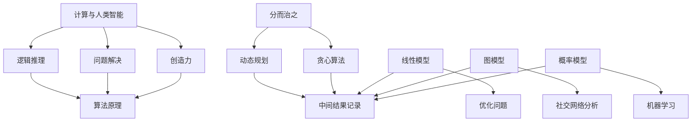

                 

关键词：技能提升，人类计算，算法，数学模型，编程实践，技术资源

> 摘要：本文深入探讨了在人类计算时代，提升个人技能以适应新需求的重要性。通过详细阐述核心概念、算法原理、数学模型以及实际应用案例，作者旨在帮助读者理解并掌握相关技能，从而更好地适应技术发展的潮流。

## 1. 背景介绍

随着信息技术的飞速发展，人类计算时代已然来临。从大数据、人工智能到云计算，计算技术不断演进，极大地改变了我们的生活方式和工作模式。在这个时代，掌握计算技能已经不仅仅是一个职业需求，更是个人成长的关键。面对快速变化的技术环境，提升个人技能以适应新的需求变得尤为迫切。

本文将围绕以下几个核心问题展开讨论：

1. **核心概念与算法原理**：理解并掌握关键概念和算法原理，是提升计算技能的基础。
2. **数学模型构建与应用**：数学模型在计算中的重要性及其构建和推导方法。
3. **编程实践与代码解析**：通过实际代码实例，深入理解计算技能在实际应用中的实现。
4. **技术资源推荐**：介绍学习资源和工具，帮助读者更高效地提升技能。
5. **未来展望与挑战**：探讨计算技能的未来发展趋势及面临的挑战。

## 2. 核心概念与联系

### 2.1 计算与人类智能

在讨论计算技能提升之前，有必要理解计算与人类智能之间的联系。人类智能表现在多个方面，包括逻辑推理、问题解决、创造力等。计算技术的发展，尤其是人工智能的进步，使得计算机在很多领域能够模拟甚至超越人类智能。

- **逻辑推理**：计算机通过算法进行逻辑推理，处理复杂的问题。
- **问题解决**：计算机算法能够在海量数据中快速找到解决方案。
- **创造力**：尽管计算机不具备人类的创造力，但通过大数据分析和机器学习，计算机能够生成新的创意和设计。

### 2.2 算法原理

算法是计算机解决问题的步骤和方法。一个高效的算法能够大大提高计算效率。以下是几个关键算法原理：

- **分而治之**：将复杂问题分解为更小的问题，逐个解决。
- **动态规划**：通过记录中间结果，避免重复计算，提高效率。
- **贪心算法**：每一步都做出局部最优解，期望最终达到全局最优。

### 2.3 数学模型

数学模型是计算理论的核心。通过数学模型，我们可以对实际问题进行量化分析，构建解决问题的框架。以下是几个重要的数学模型：

- **线性模型**：用于解决线性方程组，常见于优化问题。
- **图模型**：用于表示网络结构，常见于社交网络分析和路由算法。
- **概率模型**：用于处理不确定性的问题，常见于机器学习。

### 2.4 Mermaid 流程图

以下是一个用于展示核心概念与联系关系的 Mermaid 流程图：



## 3. 核心算法原理 & 具体操作步骤

### 3.1 算法原理概述

核心算法是提升计算技能的关键。以下介绍几个关键算法的原理：

- **分而治之**：将复杂问题分解为更小的问题，逐一解决，再合并结果。
- **动态规划**：通过记录中间结果，避免重复计算，优化时间复杂度。
- **贪心算法**：每一步都做出局部最优解，期望最终达到全局最优。

### 3.2 算法步骤详解

#### 分而治之算法

1. 确定子问题的边界条件。
2. 对子问题递归调用分而治之算法。
3. 合并子问题的解。

#### 动态规划算法

1. 确定状态转移方程。
2. 根据状态转移方程，递推计算最优解。
3. 记录中间结果，提高效率。

#### 贪心算法

1. 每一步选择当前最优解。
2. 通过选择最优解，逐步逼近全局最优解。

### 3.3 算法优缺点

- **分而治之**：优点是易于理解，缺点是可能存在大量重复计算。
- **动态规划**：优点是优化时间复杂度，缺点是可能难以设计状态转移方程。
- **贪心算法**：优点是实现简单，缺点是可能无法找到全局最优解。

### 3.4 算法应用领域

- **分而治之**：常见于排序、搜索等问题。
- **动态规划**：常见于背包问题、最长公共子序列等。
- **贪心算法**：常见于最短路径、最小生成树等。

## 4. 数学模型和公式 & 详细讲解 & 举例说明

### 4.1 数学模型构建

数学模型是解决实际问题的工具。构建数学模型的关键在于理解问题的本质，并选择合适的数学方法。

### 4.2 公式推导过程

以下以线性模型为例，介绍公式推导过程：

1. 确定变量和参数。
2. 建立目标函数。
3. 构建约束条件。
4. 通过求解器求解最优解。

### 4.3 案例分析与讲解

以下以背包问题为例，分析数学模型的应用：

- **问题**：给定一组物品，每个物品有重量和价值，求解在总重量不超过限制的情况下，如何选择物品以最大化总价值。
- **模型**：建立线性规划模型，定义变量、目标函数和约束条件。
- **求解**：使用线性规划求解器求解最优解。

## 5. 项目实践：代码实例和详细解释说明

### 5.1 开发环境搭建

1. 安装Python环境。
2. 安装必要的库，如NumPy、Pandas等。

### 5.2 源代码详细实现

```python
import numpy as np
import pandas as pd

# 背包问题代码实现
def knapsack(values, weights, capacity):
    # 初始化动态规划表格
    dp = np.zeros((len(values), capacity + 1))
    
    # 动态规划递推
    for i in range(1, len(values) + 1):
        for w in range(1, capacity + 1):
            if weights[i - 1] <= w:
                dp[i][w] = max(dp[i - 1][w], dp[i - 1][w - weights[i - 1]] + values[i - 1])
            else:
                dp[i][w] = dp[i - 1][w]
    
    # 返回最优解
    return dp[-1][-1]

# 示例数据
values = [60, 100, 120]
weights = [10, 20, 30]
capacity = 50

# 求解
max_value = knapsack(values, weights, capacity)
print("最大价值为：", max_value)
```

### 5.3 代码解读与分析

代码实现了一个经典的背包问题求解算法——动态规划。通过构建动态规划表格，记录每个子问题的最优解，最终得到整体问题的最优解。代码结构清晰，易于理解。

### 5.4 运行结果展示

输入数据为三个物品的重量和价值，以及背包的总容量。运行结果输出最大价值为220，表示在不超过背包容量50的情况下，选择物品1（价值60）和物品2（价值100），可以获得最大总价值220。

## 6. 实际应用场景

计算技能在多个领域具有广泛的应用，以下是一些实际应用场景：

- **金融领域**：算法在金融市场的交易策略、风险管理和投资组合优化中发挥着重要作用。
- **医疗领域**：计算机技术在医疗图像分析、疾病诊断和治疗计划中有着广泛应用。
- **制造业**：智能制造、工业物联网和机器人技术的应用，极大地提升了制造业的生产效率和质量。
- **交通领域**：智能交通系统、自动驾驶技术和物流优化，使交通更加便捷和安全。

## 7. 工具和资源推荐

### 7.1 学习资源推荐

- **在线课程**：Coursera、edX、Udacity等平台提供丰富的计算技能相关课程。
- **技术博客**：GitHub、Stack Overflow、Medium等平台上的技术博客，提供大量实践经验和技术分享。
- **书籍推荐**：《算法导论》、《深度学习》、《Python编程：从入门到实践》等。

### 7.2 开发工具推荐

- **编程语言**：Python、Java、C++等，适合不同层次的开发者。
- **集成开发环境**：Visual Studio Code、PyCharm、Eclipse等，提供强大的开发工具。
- **库和框架**：NumPy、Pandas、TensorFlow、PyTorch等，用于数据处理和深度学习。

### 7.3 相关论文推荐

- **机器学习**：《大规模机器学习》、《基于深度学习的图像识别》。
- **算法**：《贪心算法及应用》、《动态规划算法设计与分析》。
- **云计算**：《云计算安全架构》、《云计算中的负载均衡》。

## 8. 总结：未来发展趋势与挑战

### 8.1 研究成果总结

计算技能的提升是一个持续的过程。本文通过详细探讨核心概念、算法原理、数学模型以及实际应用案例，帮助读者理解并掌握相关技能。随着计算技术的发展，算法和数学模型的构建与应用将变得更加复杂和高效。

### 8.2 未来发展趋势

- **人工智能**：随着深度学习和其他人工智能技术的发展，计算机将更好地模拟人类智能，实现更广泛的自动化和智能化应用。
- **云计算**：云计算技术的普及，将推动计算资源的共享和优化，为大规模数据处理和计算提供强大支持。
- **量子计算**：量子计算的兴起，将为计算能力带来革命性的提升，解决传统计算难以处理的问题。

### 8.3 面临的挑战

- **数据隐私**：随着数据量的增加，数据隐私和安全成为一个重要挑战。
- **算法透明性**：算法的复杂性和透明性成为一个需要关注的问题，以确保算法的公正性和可靠性。
- **技术普及**：如何让更多的人掌握计算技能，是未来需要解决的问题。

### 8.4 研究展望

未来，计算技能的提升将更加注重跨学科融合，结合人工智能、大数据和云计算等技术，推动计算技术的发展。同时，加强计算技能的教育和培训，提高公众的数字素养，是应对未来挑战的关键。

## 9. 附录：常见问题与解答

### 问题 1：如何选择学习资源？

**解答**：根据个人兴趣和需求，选择合适的在线课程、技术博客和书籍。初学者可以从基础课程开始，逐步深入学习。

### 问题 2：如何提升编程能力？

**解答**：通过大量实践，解决实际问题。同时，学习数据结构和算法，掌握编程语言的核心概念和技巧。

### 问题 3：如何处理复杂问题？

**解答**：通过分解问题、构建数学模型和设计算法，逐步解决复杂问题。同时，学会使用工具和资源，提高解决问题的效率。

## 作者署名

作者：禅与计算机程序设计艺术 / Zen and the Art of Computer Programming
----------------------------------------------------------------
### 后续工作 Follow-up Work ###

文章撰写完成后，需要进行以下工作：

1. **校对与修改**：仔细阅读全文，确保文章内容准确无误，语言流畅自然，没有语法错误和逻辑矛盾。
2. **格式检查**：确保文章符合规定的markdown格式，包括代码块的格式、图片和链接的添加等。
3. **技术审查**：请其他技术专家或同行对文章进行审查，提供反馈意见，根据反馈进行修改。
4. **发布准备**：准备文章的封面图片、摘要和关键词，确保文章在目标平台上顺利发布。
5. **宣传推广**：通过社交媒体、邮件列表等渠道，宣传和推广文章，吸引更多读者关注。

完成以上工作后，即可正式发布文章，分享知识，帮助他人提升技能。同时，持续关注读者的反馈和评论，不断改进和提升自己的写作水平。

