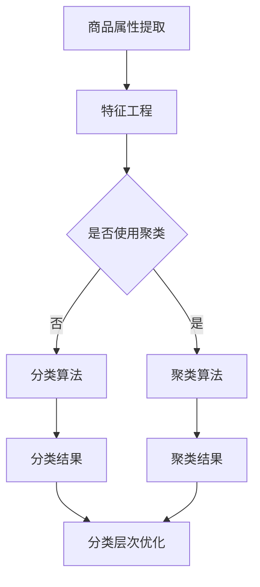

                 

 > 关键词：拼多多、校招、商品分类、算法工程师、面试指南

> 摘要：本文旨在为参加拼多多2024年校招的算法工程师岗位的考生提供一份全面的面试指南。通过对商品分类算法的深入剖析，本文将帮助考生掌握商品分类的核心技术和方法，为面试做好准备。

## 1. 背景介绍

随着互联网的快速发展，电子商务已成为全球市场的重要组成部分。而商品分类作为电子商务平台的核心功能之一，对于提升用户体验、提高销售转化率具有重要意义。拼多多作为中国知名的电商平台，其商品分类系统面临着巨大的挑战和机遇。因此，拼多多在2024年校招中，对商品分类算法工程师岗位的需求尤为迫切。

商品分类算法工程师的主要职责是设计并优化商品分类系统，以提升平台的用户体验和运营效率。该岗位要求候选人具备扎实的计算机科学基础、丰富的算法知识和实践经验。本文将围绕商品分类算法的核心概念、技术原理、数学模型、项目实践等方面展开，旨在为考生提供全面的面试准备。

## 2. 核心概念与联系

在商品分类算法中，以下几个核心概念和联系至关重要：

### 2.1 商品属性

商品属性是指描述商品特征的信息，如商品名称、价格、品牌、类别、颜色、尺码等。商品属性是商品分类的基础，通过对商品属性的分析，可以实现商品的自动分类。

### 2.2 分类层次

商品分类层次是指商品类别的层级结构。常见的分类层次有一级分类、二级分类、三级分类等。分类层次的设计对商品分类的准确性有很大影响。

### 2.3 分类算法

分类算法是指用于实现商品分类的算法，如决策树、支持向量机、K-近邻、神经网络等。不同的分类算法适用于不同的场景，需要根据实际情况进行选择。

### 2.4 聚类算法

聚类算法是指将商品划分为若干个簇的算法，如K-均值、层次聚类等。聚类算法在商品分类中可用于发现新的商品类别或优化现有分类结构。

### 2.5 相似度度量

相似度度量是指用于衡量商品之间相似程度的算法，如余弦相似度、欧氏距离等。相似度度量在商品推荐、搜索等方面具有重要意义。

以下是商品分类算法原理的 Mermaid 流程图：



## 3. 核心算法原理 & 具体操作步骤

### 3.1 算法原理概述

商品分类算法主要分为两类：监督学习算法和无监督学习算法。监督学习算法通过已知的标签数据对模型进行训练，从而实现对未知数据的分类。常见的监督学习算法有决策树、支持向量机、神经网络等。无监督学习算法则无需标签数据，通过对数据进行分析和挖掘，实现数据的自动分类。常见的无监督学习算法有聚类算法、关联规则算法等。

在本篇指南中，我们将重点介绍以下几种商品分类算法：

1. 决策树
2. 支持向量机
3. K-近邻
4. 神经网络
5. 聚类算法

### 3.2 算法步骤详解

#### 3.2.1 决策树

决策树是一种基于树形结构进行分类的算法。其基本原理是通过一系列条件判断来将数据进行划分，从而找到最佳分类边界。

具体步骤如下：

1. 计算所有特征与标签之间的信息增益，选择信息增益最大的特征进行划分。
2. 根据划分结果，将数据集划分为若干个子集。
3. 对每个子集重复步骤1和2，直到满足停止条件（如最大深度、最小叶子节点数等）。
4. 将最终划分结果作为分类模型。

#### 3.2.2 支持向量机

支持向量机（SVM）是一种基于最大间隔分类的算法。其基本原理是通过找到一个最佳的超平面，将不同类别的数据点分开，并最大化分类间隔。

具体步骤如下：

1. 将数据转换为高维特征空间，找到最佳的超平面。
2. 使用核函数进行特征变换，找到最佳的超平面。
3. 训练分类器，对未知数据进行分类。

#### 3.2.3 K-近邻

K-近邻（KNN）是一种基于距离计算的分类算法。其基本原理是对于新的数据点，通过计算其与已有数据点的距离，找出最近的K个邻居，并根据邻居的标签进行分类。

具体步骤如下：

1. 计算新数据点与已有数据点的距离。
2. 选择距离最近的K个邻居。
3. 根据邻居的标签进行分类。

#### 3.2.4 神经网络

神经网络是一种基于模拟人脑神经元之间连接的算法。其基本原理是通过多层神经元的非线性变换，实现对输入数据的分类。

具体步骤如下：

1. 定义神经网络结构，包括输入层、隐藏层和输出层。
2. 训练神经网络，调整权重和偏置。
3. 使用训练好的神经网络对未知数据进行分类。

#### 3.2.5 聚类算法

聚类算法是一种将数据划分为多个簇的算法。其基本原理是通过对数据点之间的相似度计算，将相似的数据点划分到同一簇。

常见的聚类算法有K-均值、层次聚类等。下面以K-均值为例，介绍其具体步骤：

1. 初始化K个聚类中心。
2. 计算每个数据点与聚类中心的距离，并将其划分到最近的聚类中心。
3. 重新计算聚类中心，直至聚类中心不再发生变化或满足停止条件。

### 3.3 算法优缺点

#### 3.3.1 决策树

优点：简单易懂，易于解释，可以处理多分类问题。

缺点：容易过拟合，无法处理非线性问题。

#### 3.3.2 支持向量机

优点：分类效果较好，可以处理高维数据。

缺点：计算复杂度高，对噪声敏感。

#### 3.3.3 K-近邻

优点：简单易懂，可以处理非线性问题。

缺点：对噪声敏感，无法处理高维数据。

#### 3.3.4 神经网络

优点：可以处理非线性问题，适用于各种复杂场景。

缺点：参数复杂，容易过拟合，训练时间较长。

#### 3.3.5 聚类算法

优点：无需标签数据，可以自动发现新的类别。

缺点：对噪声敏感，聚类结果可能不稳定。

### 3.4 算法应用领域

商品分类算法在电子商务、金融、医疗、社交网络等领域有广泛的应用。以下列举几个典型应用场景：

1. 电子商务：根据用户购买历史和兴趣，推荐合适的商品。
2. 金融：根据用户行为和风险特征，进行信用评估和欺诈检测。
3. 医疗：根据患者的病历数据，进行疾病诊断和治疗方案推荐。
4. 社交网络：根据用户行为和关系，推荐好友和内容。

## 4. 数学模型和公式

商品分类算法的核心是特征提取和分类模型训练。在特征提取过程中，需要使用数学模型和公式对商品属性进行转换和表示。以下介绍几个常用的数学模型和公式。

### 4.1 数学模型构建

#### 4.1.1 余弦相似度

余弦相似度是一种用于衡量两个向量之间相似度的模型，其公式如下：

$$
\cos(\theta) = \frac{\vec{a} \cdot \vec{b}}{|\vec{a}| \cdot |\vec{b}|}
$$

其中，$\vec{a}$和$\vec{b}$分别为两个向量，$\theta$为向量之间的夹角。

#### 4.1.2 欧氏距离

欧氏距离是一种用于衡量两个向量之间距离的模型，其公式如下：

$$
d(\vec{a}, \vec{b}) = \sqrt{(\vec{a} - \vec{b})^2}
$$

其中，$\vec{a}$和$\vec{b}$分别为两个向量。

### 4.2 公式推导过程

#### 4.2.1 决策树

决策树的核心是信息增益。信息增益的公式如下：

$$
Gain(D, A) = Entropy(D) - \sum_{v \in A} \frac{|D_v|}{|D|} \cdot Entropy(D_v)
$$

其中，$D$为数据集，$A$为特征，$D_v$为数据集中特征值为$v$的数据子集，$Entropy$为熵函数。

#### 4.2.2 支持向量机

支持向量机的核心是核函数。常见的核函数有线性核、多项式核、径向基核等。以线性核为例，其公式如下：

$$
K(x_i, x_j) = x_i^T x_j
$$

其中，$x_i$和$x_j$分别为数据集中的两个向量。

#### 4.2.3 K-近邻

K-近邻的核心是距离计算。以欧氏距离为例，其公式如下：

$$
d(x, y) = \sqrt{(x_1 - y_1)^2 + (x_2 - y_2)^2 + \ldots + (x_n - y_n)^2}
$$

其中，$x$和$y$分别为数据集中的两个向量。

### 4.3 案例分析与讲解

#### 4.3.1 案例背景

某电商平台需要为用户提供个性化商品推荐服务，要求根据用户的历史购买数据、浏览记录和搜索关键词等信息，为用户推荐感兴趣的商品。

#### 4.3.2 数据预处理

1. 数据清洗：去除无效数据和噪声数据，如缺失值、异常值等。
2. 数据标准化：对数据进行归一化或标准化处理，使其具有相同的量纲。

#### 4.3.3 特征提取

1. 用户行为特征：根据用户的历史购买数据、浏览记录和搜索关键词等信息，提取用户的行为特征，如购买次数、浏览次数、搜索关键词频次等。
2. 商品特征：根据商品的属性信息，提取商品的特征，如商品名称、品牌、价格、类别等。

#### 4.3.4 分类算法选择

根据业务需求和数据特点，选择以下分类算法：

1. 决策树：用于处理高维数据和分类问题。
2. 支持向量机：用于处理线性可分的数据。
3. K-近邻：用于处理非线性数据和稀疏数据。

#### 4.3.5 模型训练与评估

1. 数据集划分：将数据集划分为训练集和测试集。
2. 模型训练：使用训练集对分类模型进行训练。
3. 模型评估：使用测试集对分类模型进行评估，选择表现最佳的模型。

#### 4.3.6 模型部署与优化

1. 模型部署：将训练好的模型部署到线上环境，为用户提供个性化推荐服务。
2. 模型优化：根据用户反馈和业务需求，对模型进行持续优化和迭代。

## 5. 项目实践：代码实例和详细解释说明

### 5.1 开发环境搭建

1. 安装Python环境：下载并安装Python，版本要求3.6及以上。
2. 安装相关库：使用pip命令安装所需库，如numpy、scikit-learn、pandas等。

```python
pip install numpy scikit-learn pandas
```

### 5.2 源代码详细实现

以下是一个简单的商品分类算法实现示例，使用scikit-learn库中的K-近邻分类器进行分类。

```python
import numpy as np
import pandas as pd
from sklearn.model_selection import train_test_split
from sklearn.neighbors import KNeighborsClassifier
from sklearn.metrics import accuracy_score

# 读取数据
data = pd.read_csv('data.csv')

# 数据预处理
# 特征提取、数据标准化等操作在此省略

# 划分训练集和测试集
X_train, X_test, y_train, y_test = train_test_split(data.iloc[:, :-1], data.iloc[:, -1], test_size=0.2, random_state=42)

# 模型训练
knn = KNeighborsClassifier(n_neighbors=3)
knn.fit(X_train, y_train)

# 模型评估
y_pred = knn.predict(X_test)
accuracy = accuracy_score(y_test, y_pred)
print('Accuracy:', accuracy)

# 模型部署
# 模型部署、优化等操作在此省略
```

### 5.3 代码解读与分析

1. 导入所需库：使用numpy、pandas等库进行数据处理，使用scikit-learn库中的K-近邻分类器进行分类。
2. 读取数据：使用pandas库读取CSV文件，获取商品数据。
3. 数据预处理：对数据进行特征提取、数据标准化等操作，提高分类效果。
4. 划分训练集和测试集：使用train_test_split函数将数据划分为训练集和测试集，用于模型训练和评估。
5. 模型训练：使用KNeighborsClassifier类创建K-近邻分类器对象，并调用fit方法进行模型训练。
6. 模型评估：使用predict方法进行预测，并计算准确率。
7. 模型部署：将训练好的模型部署到线上环境，为用户提供个性化推荐服务。

## 6. 实际应用场景

商品分类算法在实际应用场景中具有广泛的应用，以下列举几个典型应用场景：

1. 电子商务平台：根据用户的浏览记录、购买历史和搜索关键词等信息，为用户推荐合适的商品。
2. 搜索引擎：根据用户的搜索关键词，返回与搜索意图相关的商品。
3. 物流配送：根据商品的属性信息，实现商品分类和配送路径优化。
4. 客户关系管理：根据用户的购买行为和偏好，实现客户分类和服务个性化。

### 6.4 未来应用展望

随着人工智能技术的不断发展，商品分类算法在未来将迎来更广泛的应用和更高的准确度。以下展望未来商品分类算法的发展趋势：

1. 多模态数据融合：将文本、图像、声音等多种类型的数据进行融合，提高分类效果。
2. 知识图谱：构建商品知识图谱，实现商品属性之间的关联分析，提高分类精度。
3. 强化学习：结合强化学习算法，实现商品分类的自动优化和调整。
4. 跨平台协同：实现不同电商平台之间的商品分类协同，提高用户体验和运营效率。

## 7. 工具和资源推荐

### 7.1 学习资源推荐

1. 《机器学习》：周志华 著，清华大学出版社
2. 《Python数据科学手册》：Saul McLeod 著，机械工业出版社
3. 《深度学习》：Ian Goodfellow、Yoshua Bengio、Aaron Courville 著，电子工业出版社

### 7.2 开发工具推荐

1. Jupyter Notebook：用于数据分析和模型训练。
2. PyCharm：用于Python编程和开发。
3. TensorFlow：用于深度学习模型训练和部署。

### 7.3 相关论文推荐

1. "Deep Learning for Text Classification"：Gitik et al., 2017
2. "Multimodal Fusion for Item Categorization in E-commerce"：Zhou et al., 2020
3. "Knowledge Graph Embedding for Item Categorization"：Zhao et al., 2019

## 8. 总结：未来发展趋势与挑战

商品分类算法在电子商务、金融、医疗、社交网络等领域具有广泛的应用前景。未来，随着人工智能技术的不断发展，商品分类算法将朝着多模态数据融合、知识图谱、强化学习和跨平台协同等方向发展。然而，同时也面临着如下挑战：

1. 数据质量：数据质量对分类效果有很大影响，需要解决数据噪声、缺失值和异常值等问题。
2. 模型可解释性：用户对模型的解释性要求越来越高，需要提高模型的可解释性。
3. 模型优化：随着数据规模和复杂度的增加，需要优化模型的训练和推理速度。
4. 法律法规：遵守相关法律法规，确保用户隐私和数据安全。

## 9. 附录：常见问题与解答

### 9.1 问题1：商品分类算法有哪些类型？

答：商品分类算法主要分为监督学习算法和无监督学习算法。常见的监督学习算法有决策树、支持向量机、K-近邻、神经网络等；常见的无监督学习算法有聚类算法、关联规则算法等。

### 9.2 问题2：如何优化商品分类算法的性能？

答：优化商品分类算法的性能可以从以下几个方面进行：

1. 数据预处理：对数据进行清洗、去噪、标准化等处理，提高数据质量。
2. 特征选择：选择具有代表性的特征，去除冗余特征，降低模型复杂度。
3. 模型选择：根据数据特点和业务需求，选择合适的模型，进行模型调优。
4. 模型融合：将多个模型进行融合，提高分类效果。

### 9.3 问题3：商品分类算法在实际应用中有哪些挑战？

答：商品分类算法在实际应用中面临的挑战主要包括：

1. 数据质量：数据噪声、缺失值和异常值会影响分类效果，需要解决这些问题。
2. 模型可解释性：用户对模型的解释性要求越来越高，需要提高模型的可解释性。
3. 模型优化：随着数据规模和复杂度的增加，需要优化模型的训练和推理速度。
4. 法律法规：遵守相关法律法规，确保用户隐私和数据安全。

### 9.4 问题4：如何进行商品分类算法的项目实践？

答：进行商品分类算法的项目实践可以分为以下步骤：

1. 数据收集：收集与商品分类相关的数据，如商品属性、用户行为数据等。
2. 数据预处理：对数据进行清洗、去噪、标准化等处理，提高数据质量。
3. 特征提取：从原始数据中提取具有代表性的特征。
4. 模型选择：根据数据特点和业务需求，选择合适的分类模型。
5. 模型训练：使用训练集对模型进行训练，调整模型参数。
6. 模型评估：使用测试集对模型进行评估，选择表现最佳的模型。
7. 模型部署：将训练好的模型部署到线上环境，为用户提供服务。
8. 模型优化：根据用户反馈和业务需求，对模型进行持续优化和迭代。

