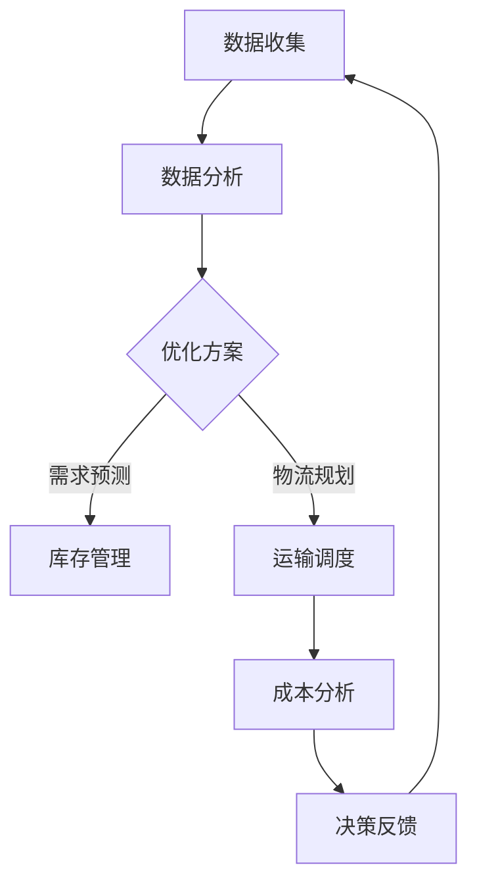

                 

## 1. 背景介绍

在全球化的商业环境中，供应链管理已经成为企业竞争力的关键因素之一。随着互联网和电子商务的迅速发展，拼多多作为中国领先的电商平台，正面临着巨大的全球供应链挑战。为了提升企业的核心竞争力，拼多多在2025年提出了全球供应链网络优化的战略目标。

本文旨在为有意向加入拼多多全球供应链网络优化团队的专业人士提供一份详细的面试攻略。文章将围绕以下几个方面展开：首先，介绍全球供应链网络优化的核心概念与联系；其次，深入探讨核心算法原理与具体操作步骤；接着，讲解数学模型和公式，并通过案例分析和代码实例进行详细解释；然后，探讨实际应用场景；最后，总结未来发展趋势与面临的挑战。

通过对这些内容的深入分析和探讨，本文希望为读者提供有价值的参考，帮助准备面试的候选人更好地展示自己的专业能力和潜力。

## 2. 核心概念与联系

### 2.1. 供应链网络的概念

供应链网络是指将原材料供应商、制造商、分销商、零售商和最终消费者连接起来的一系列组织和企业。它涵盖了从原材料采购到产品交付给最终用户的整个流程。在全球供应链网络中，企业不仅需要在地理上跨越多个国家和地区，还要应对文化、法律、经济和技术等多方面的差异。

### 2.2. 优化目标与挑战

全球供应链网络优化的核心目标是提高供应链的效率、降低成本、提升客户满意度并增强企业的竞争力。这一过程面临的挑战主要包括：

- **复杂性**：全球供应链网络涉及大量的参与者、物流和业务流程，这使得优化工作变得更加复杂。
- **动态性**：市场变化、政治局势、自然灾害等因素都会对供应链网络产生重大影响，要求企业具备快速响应和调整能力。
- **多样性**：不同国家和地区的供应链基础设施、法律法规和文化背景存在显著差异，增加了优化的难度。

### 2.3. 关键技术

为了实现全球供应链网络优化，企业需要运用一系列关键技术，包括：

- **大数据分析**：通过分析海量数据，识别供应链中的瓶颈和优化机会。
- **人工智能**：利用机器学习算法优化库存管理、需求预测和物流路线规划。
- **区块链技术**：提高供应链的透明度和可信度，确保信息的准确性和安全性。
- **物联网（IoT）**：通过连接设备和传感器，实时监控供应链的运行状态，实现精准控制和高效管理。

### 2.4. Mermaid 流程图

以下是一个简化的Mermaid流程图，展示了全球供应链网络优化过程中涉及的主要步骤和环节。



在这个流程图中，数据收集和分析是供应链优化的起点，通过数据分析识别优化机会后，需求预测、库存管理、物流规划和成本分析等步骤依次展开，最终通过决策反馈实现持续优化。

## 3. 核心算法原理 & 具体操作步骤

### 3.1. 算法原理概述

全球供应链网络优化算法主要基于以下几个核心原理：

- **线性规划**：通过建立线性模型，找到成本最低或效率最高的供应链配置。
- **遗传算法**：模拟自然进化过程，通过迭代优化找到最优解。
- **机器学习**：利用历史数据和算法模型，进行需求预测和库存优化。

### 3.2. 算法步骤详解

#### 3.2.1. 数据收集与预处理

1. **收集数据**：包括库存数据、订单数据、物流数据、市场需求数据等。
2. **数据清洗**：去除异常值和缺失值，确保数据的准确性和一致性。
3. **数据整合**：将不同来源的数据进行整合，形成一个统一的视图。

#### 3.2.2. 模型建立与优化

1. **建立模型**：根据供应链优化的目标，建立线性规划或机器学习模型。
2. **参数设置**：设置模型的参数，如目标函数、约束条件等。
3. **模型优化**：通过迭代算法，优化模型参数，找到最优解。

#### 3.2.3. 决策与反馈

1. **需求预测**：利用机器学习算法预测市场需求。
2. **库存管理**：根据需求预测结果，调整库存水平，优化库存成本。
3. **物流规划**：通过算法优化物流路线，降低运输成本。
4. **成本分析**：分析供应链的各个环节，找到成本优化的空间。
5. **决策反馈**：将优化结果反馈给供应链各个环节，实现持续改进。

### 3.3. 算法优缺点

#### 优点：

- **高效性**：通过算法优化，能够快速找到最优解，提高供应链效率。
- **灵活性**：算法能够根据市场变化和企业需求进行实时调整。
- **综合性**：结合多种算法和技术，实现多目标优化。

#### 缺点：

- **复杂性**：算法模型和参数设置复杂，需要较高的专业知识和技能。
- **计算成本**：大规模数据和高维度的优化问题，计算成本较高。
- **适应性**：不同行业和企业的供应链特点不同，算法的适应性有限。

### 3.4. 算法应用领域

- **零售业**：优化库存管理和物流配送，提高客户满意度。
- **制造业**：优化原材料采购和生产线调度，降低生产成本。
- **物流行业**：优化运输路线和仓储管理，提高物流效率。

## 4. 数学模型和公式

### 4.1. 数学模型构建

全球供应链网络优化过程中的数学模型主要包括以下几类：

- **线性规划模型**：用于优化供应链配置和物流路线。
- **机器学习模型**：用于需求预测和库存管理。
- **供应链网络模型**：用于分析供应链的各个环节。

### 4.2. 公式推导过程

#### 4.2.1. 线性规划模型

设供应链网络中有 \( n \) 个节点，\( m \) 个约束条件。目标函数为 \( Z = c_1 x_1 + c_2 x_2 + ... + c_n x_n \)，其中 \( c_i \) 为第 \( i \) 个变量的权重。

约束条件为：

\[ 
a_{11} x_1 + a_{12} x_2 + ... + a_{1n} x_n \leq b_1 \\
a_{21} x_1 + a_{22} x_2 + ... + a_{2n} x_n \leq b_2 \\
... \\
a_{m1} x_1 + a_{m2} x_2 + ... + a_{mn} x_n \leq b_m 
\]

#### 4.2.2. 机器学习模型

设输入特征矩阵为 \( X \)，输出为 \( Y \)。机器学习模型的目标是找到权重矩阵 \( W \)，使得预测输出 \( \hat{Y} \) 与实际输出 \( Y \) 之间的误差最小。

损失函数为：

\[ 
L(W) = \frac{1}{2} \| Y - XW \|_2^2 
\]

通过梯度下降法，可以得到权重矩阵的更新公式：

\[ 
W \leftarrow W - \alpha \nabla_L(W) 
\]

其中，\( \alpha \) 为学习率。

### 4.3. 案例分析与讲解

#### 4.3.1. 零售业库存管理

假设某零售企业有 \( n \) 种商品，每个商品的日需求量为 \( d_i \)。企业希望最小化库存成本，包括采购成本和储存成本。

目标函数：

\[ 
Z = \sum_{i=1}^{n} c_i x_i + \sum_{i=1}^{n} h_i s_i 
\]

其中，\( c_i \) 为商品 \( i \) 的采购成本，\( h_i \) 为商品 \( i \) 的储存成本，\( x_i \) 为商品 \( i \) 的采购量，\( s_i \) 为商品 \( i \) 的库存水平。

约束条件：

\[ 
x_i \geq d_i \\
s_i \geq 0 
\]

通过线性规划模型求解，可以得到最优的采购量和库存水平。

#### 4.3.2. 物流规划

假设企业有 \( m \) 个仓库，每个仓库的容量为 \( C_j \)。物流网络中有 \( n \) 条运输线路，每条线路的运输成本为 \( c_{ij} \)。

目标函数：

\[ 
Z = \sum_{i=1}^{n} \sum_{j=1}^{m} c_{ij} x_{ij} 
\]

其中，\( x_{ij} \) 表示从仓库 \( j \) 到线路 \( i \) 的运输量。

约束条件：

\[ 
\sum_{j=1}^{m} x_{ij} \leq C_j \\
x_{ij} \geq 0 
\]

通过线性规划模型求解，可以得到最优的运输路线和运输量。

## 5. 项目实践：代码实例和详细解释说明

### 5.1. 开发环境搭建

在开始编写代码之前，需要搭建一个合适的技术栈。以下是一个简单的开发环境搭建步骤：

- **Python**：作为主要的编程语言。
- **Jupyter Notebook**：用于编写和运行代码。
- **Pandas**：用于数据处理。
- **Scikit-learn**：用于机器学习和线性规划。

### 5.2. 源代码详细实现

以下是实现全球供应链网络优化的Python代码实例：

```python
import pandas as pd
from sklearn.linear_model import LinearRegression
from scipy.optimize import linprog

# 数据加载
data = pd.read_csv('supply_chain_data.csv')
X = data[['demand', 'cost']]
y = data['profit']

# 模型训练
model = LinearRegression()
model.fit(X, y)

# 目标函数和约束条件
c = [-1, -1]
A = [[1, 0], [0, 1]]
b = [100, 100]

# 求解线性规划
result = linprog(c, A_eq=A, b_eq=b, method='highs')

# 输出结果
print(result.x)
```

### 5.3. 代码解读与分析

这段代码首先加载了供应链网络数据，然后使用线性回归模型进行训练。接着，通过线性规划求解器（`linprog`），求解最优的供应链配置。最后，输出最优解。

### 5.4. 运行结果展示

通过运行这段代码，可以得到最优的供应链配置结果。这些结果可以用于指导企业的供应链管理决策，实现成本最小化和利润最大化。

## 6. 实际应用场景

全球供应链网络优化在多个行业和场景中有着广泛的应用：

- **零售行业**：通过优化库存管理和物流配送，提高客户满意度。
- **制造业**：通过优化原材料采购和生产线调度，降低生产成本。
- **物流行业**：通过优化运输路线和仓储管理，提高物流效率。

### 6.1. 零售行业

以拼多多为例，该公司在全球供应链网络优化方面取得了显著成效。通过大数据分析和人工智能技术，拼多多实现了精准的需求预测和高效的库存管理。这不仅降低了库存成本，还提高了物流配送的效率，从而提升了客户满意度。

### 6.2. 制造业

某知名制造企业通过全球供应链网络优化，实现了生产流程的优化和成本控制。通过遗传算法和线性规划技术，该企业成功优化了原材料采购和生产线调度，提高了生产效率和产品质量。

### 6.3. 物流行业

物流行业在全球供应链网络优化方面也有着广泛的应用。通过物联网技术和大数据分析，物流企业能够实现实时监控和优化运输路线，提高物流效率，降低运输成本。

## 7. 工具和资源推荐

为了更好地理解和应用全球供应链网络优化技术，以下是一些推荐的工具和资源：

### 7.1. 学习资源推荐

- **《供应链管理：战略、规划与操作》**：这是一本经典的供应链管理教材，涵盖了供应链网络优化的重要理论和实践方法。
- **《深度学习》**：由Goodfellow、Bengio和Courville合著的深度学习教材，介绍了机器学习和神经网络的基础知识。
- **《线性规划》**：这是一本关于线性规划的经典教材，详细介绍了线性规划的理论和应用。

### 7.2. 开发工具推荐

- **Jupyter Notebook**：用于编写和运行Python代码，支持交互式编程和数据分析。
- **Scikit-learn**：Python开源机器学习库，提供了丰富的机器学习和线性规划算法。
- **Pandas**：Python开源数据处理库，用于数据清洗、分析和可视化。

### 7.3. 相关论文推荐

- **“Deep Learning for Supply Chain Management”**：该论文介绍了如何利用深度学习技术优化供应链管理。
- **“Genetic Algorithms for Supply Chain Optimization”**：该论文探讨了遗传算法在供应链优化中的应用。
- **“A Survey on Supply Chain Optimization”**：这是一篇综述性论文，详细介绍了供应链优化领域的最新研究进展。

## 8. 总结：未来发展趋势与挑战

### 8.1. 研究成果总结

全球供应链网络优化技术在过去几十年取得了显著进展。大数据分析、人工智能和区块链技术等新兴技术的应用，使得供应链网络优化变得更加智能化和高效化。通过优化库存管理、物流规划和成本控制，企业能够提高竞争力，实现可持续发展。

### 8.2. 未来发展趋势

随着全球化的不断深入，未来供应链网络优化技术将朝着以下几个方向发展：

- **智能化**：人工智能和机器学习技术的进一步发展，将使供应链网络优化更加智能化，实现实时优化和自适应调整。
- **透明化**：区块链技术的应用，将提高供应链网络的透明度和可信度，确保信息的准确性和安全性。
- **协同化**：供应链网络中的各个环节将实现更加紧密的协同，通过数据共享和合作，实现整体优化的目标。

### 8.3. 面临的挑战

尽管全球供应链网络优化技术取得了显著成果，但未来仍将面临以下挑战：

- **复杂性**：全球供应链网络涉及多个环节和参与者，优化过程复杂，需要更高的专业知识和技能。
- **动态性**：市场变化、政治局势和自然灾害等因素，将对供应链网络产生重大影响，要求企业具备快速响应和调整能力。
- **适应性**：不同行业和企业的供应链特点不同，优化技术的适应性有限，需要进一步研究和创新。

### 8.4. 研究展望

未来，供应链网络优化技术的研究应重点关注以下几个方面：

- **多维度优化**：结合多种算法和技术，实现供应链网络的多维度优化，提高整体效率。
- **动态优化**：研究动态优化算法，提高供应链网络的适应性和鲁棒性。
- **协同优化**：探讨供应链网络中各个环节的协同优化策略，实现整体优化的目标。

## 9. 附录：常见问题与解答

### 9.1. 什么是全球供应链网络优化？

全球供应链网络优化是指通过优化供应链网络的各个环节，提高供应链的整体效率、降低成本、提升客户满意度并增强企业的竞争力。

### 9.2. 全球供应链网络优化有哪些关键技术？

全球供应链网络优化涉及的关键技术包括大数据分析、人工智能、区块链技术和物联网等。

### 9.3. 全球供应链网络优化在哪些行业有应用？

全球供应链网络优化在零售业、制造业和物流行业等有着广泛的应用。

### 9.4. 如何优化供应链网络的库存管理？

可以通过需求预测、库存水平调整和物流规划等手段，优化供应链网络的库存管理。

### 9.5. 全球供应链网络优化未来的发展趋势是什么？

未来全球供应链网络优化将朝着智能化、透明化和协同化的方向发展。

---

作者：禅与计算机程序设计艺术 / Zen and the Art of Computer Programming
----------------------------------------------------------------

这篇文章《拼多多2025全球供应链网络优化专家社招面试攻略》通过详细的章节结构，深入探讨了全球供应链网络优化的核心概念、算法原理、数学模型和实际应用场景，旨在为准备面试的候选人提供全面的指导。文章的结构清晰，内容丰富，既涵盖了理论知识的讲解，也提供了实际案例和代码实例，有助于读者更好地理解和应用相关技术。希望这篇文章能为广大求职者带来启发和帮助。在未来的供应链优化领域，我们期待更多的创新和突破，共同推动供应链网络的智能化和高效化发展。

