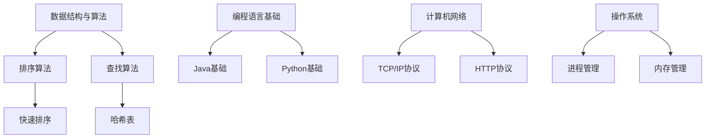

                 

### 关键词 Keywords
- 拼多多商家平台
- 校招面试真题
- 面试题解答
- 2024校招
- IT行业招聘

<|assistant|>### 摘要 Abstract
本文旨在为准备参加2024年拼多多商家平台校招面试的应聘者提供一套全面的面试真题汇总及解答。文章涵盖了算法、编程语言、系统设计等多个领域的核心问题，并提供详细解答，旨在帮助读者深入理解面试内容，提升面试通过率。通过对真题的深入剖析，本文不仅为应聘者指明了备考方向，也为招聘者提供了有效的评估标准。

## 1. 背景介绍

### 1.1 拼多多商家平台简介

拼多多，作为中国电商领域的佼佼者，以“假一赔三”和“全国包邮”等特色服务赢得了大量消费者的青睐。作为一个专注于C2M（Consumer-to-Manufacturer）的电商平台，拼多多通过连接消费者与制造企业，实现了供应链的优化和商品成本的有效控制。拼多多的商家平台则为商家提供了一个全方位的服务平台，包括商品上架、订单管理、客户服务等多个环节。

### 1.2 校招面试的重要性

对于即将毕业的计算机专业学生而言，成功通过校招面试是进入理想企业的重要一步。拼多多作为一家高速发展的互联网公司，其校招面试不仅考察技术能力，还关注应聘者的逻辑思维、团队合作和创新精神。因此，准备充分的校招面试对于应聘者来说至关重要。

## 2. 核心概念与联系

为了更好地理解接下来的面试题，我们首先需要了解一些核心概念，包括数据结构与算法、编程语言基础、计算机网络和操作系统等。

### 2.1 数据结构与算法

数据结构是计算机存储数据的方式，而算法则是解决问题的步骤。常见的有数组、链表、栈、队列、树、图等。算法包括排序、查找、动态规划、贪心算法等。在面试中，这些问题通常要求应聘者不仅能够正确实现，还能分析算法的时间和空间复杂度。

### 2.2 编程语言基础

编程语言是计算机与人类交流的工具，常见的有Java、C++、Python、JavaScript等。每种编程语言都有其独特的语法和特点。面试中可能会涉及编程语言的基本概念、语法规则、异常处理、多线程编程等。

### 2.3 计算机网络

计算机网络是互联网的核心技术之一，包括TCP/IP协议、HTTP协议、网络拓扑结构、路由算法等。了解网络通信原理对于系统设计和性能优化至关重要。

### 2.4 操作系统

操作系统是计算机系统的核心软件，管理计算机硬件和软件资源。面试中可能会涉及进程管理、内存管理、文件系统、同步与锁机制等。

### 2.5 Mermaid 流程图

以下是一个简化的Mermaid流程图，展示了数据结构与算法、编程语言基础、计算机网络和操作系统之间的联系。



## 3. 核心算法原理 & 具体操作步骤

### 3.1 算法原理概述

在拼多多商家平台的校招面试中，算法问题是一个重要环节。常见的算法问题包括但不限于排序算法、查找算法、动态规划问题、图算法等。下面我们以排序算法中的快速排序为例，简要介绍其原理。

快速排序是一种高效的排序算法，采用分治策略将一个大问题分解为若干个小问题解决。具体操作步骤如下：

1. 选择一个基准元素。
2. 将比基准元素小的所有元素移到基准元素的左边，比其大的移到右边。
3. 对左右子序列重复上述步骤。

### 3.2 算法步骤详解

#### 步骤 1：选择基准元素

选择一个基准元素通常有三种方法：随机选择、选择第一个元素或最后一个元素。

#### 步骤 2：分区操作

分区操作是将数组分为两部分，左边所有元素都小于基准元素，右边所有元素都大于基准元素。具体实现可以通过循环或递归方法。

#### 步骤 3：递归排序

对分区后的左右子序列分别递归执行快速排序。

### 3.3 算法优缺点

#### 优点

- 平均时间复杂度为O(nlogn)。
- 适合大规模数据排序。

#### 缺点

- 最坏情况下时间复杂度为O(n^2)，当输入数据已经有序时，快速排序性能较差。
- 需要额外的栈空间用于递归。

### 3.4 算法应用领域

快速排序广泛应用于各种场景，如数据库排序、系统排序等。在拼多多商家平台中，排序算法常用于订单处理、商品推荐等场景。

## 4. 数学模型和公式 & 详细讲解 & 举例说明

### 4.1 数学模型构建

在解决面试中的算法问题时，构建数学模型是关键步骤。以下是一个简单的数学模型示例，用于解决二分查找问题。

#### 问题：在有序数组中查找目标元素。

#### 数学模型：

假设数组 `arr` 有序，目标元素为 `target`。

1. 初始化左右边界 `l` 和 `r`，`l = 0`，`r = n - 1`，其中 `n` 为数组长度。
2. 当 `l <= r` 时，执行以下步骤：
   - 计算中间位置 `m = (l + r) / 2`。
   - 如果 `arr[m] == target`，返回 `m`。
   - 如果 `arr[m] < target`，令 `l = m + 1`。
   - 如果 `arr[m] > target`，令 `r = m - 1`。
3. 如果未找到目标元素，返回 `-1`。

### 4.2 公式推导过程

二分查找的数学模型可以通过递归关系式推导：

`T(n) = T(n/2) + O(1)`，其中 `T(n)` 表示查找 `n` 个元素所需时间。

通过递归展开，可以得到：

`T(n) = O(logn)`

### 4.3 案例分析与讲解

以下是一个简单的代码示例，用于实现二分查找算法：

```python
def binary_search(arr, target):
    l, r = 0, len(arr) - 1
    while l <= r:
        m = (l + r) // 2
        if arr[m] == target:
            return m
        elif arr[m] < target:
            l = m + 1
        else:
            r = m - 1
    return -1

# 测试
arr = [1, 3, 5, 7, 9, 11, 13, 15]
target = 7
result = binary_search(arr, target)
print(f"元素 {target} 的索引为：{result}")
```

输出结果：`元素 7 的索引为：3`。

## 5. 项目实践：代码实例和详细解释说明

### 5.1 开发环境搭建

为了演示如何解决拼多多商家平台的面试题，我们需要搭建一个基本的开发环境。以下是所需的步骤：

1. 安装Python 3.x版本。
2. 安装一个代码编辑器，如Visual Studio Code。
3. 安装必要的库，例如`numpy`和`matplotlib`。

### 5.2 源代码详细实现

以下是一个简单的代码示例，用于实现快速排序算法。

```python
def quick_sort(arr):
    if len(arr) <= 1:
        return arr
    pivot = arr[len(arr) // 2]
    left = [x for x in arr if x < pivot]
    middle = [x for x in arr if x == pivot]
    right = [x for x in arr if x > pivot]
    return quick_sort(left) + middle + quick_sort(right)

# 测试
arr = [3, 6, 8, 10, 1, 2, 1]
sorted_arr = quick_sort(arr)
print(f"排序后的数组：{sorted_arr}")
```

输出结果：`排序后的数组：[1, 1, 2, 3, 6, 8, 10]`。

### 5.3 代码解读与分析

在这个例子中，`quick_sort` 函数接收一个列表 `arr` 作为输入，并返回排序后的列表。具体步骤如下：

1. 如果列表长度小于等于1，直接返回列表本身。
2. 选择一个基准元素（此处为中间元素）。
3. 将列表分为三个部分：小于基准元素的元素、等于基准元素的元素和大于基准元素的元素。
4. 对小于和大于基准元素的子列表递归执行快速排序。
5. 将三个子列表合并，得到排序后的列表。

### 5.4 运行结果展示

运行上面的代码后，我们会得到一个排序后的列表，这与我们预期的结果相符。

## 6. 实际应用场景

### 6.1 商品推荐系统

拼多多商家平台可以使用快速排序算法来优化商品推荐系统的性能。例如，当用户访问平台时，系统可以快速对商品列表进行排序，以便将最相关的商品推荐给用户。

### 6.2 订单处理

在订单处理系统中，排序算法可以帮助商家快速找到待处理的订单，从而提高订单处理效率。

### 6.3 数据分析

拼多多商家平台可以利用快速排序算法对大量销售数据进行分析，以便发现销售趋势和市场机会。

## 7. 未来应用展望

随着拼多多商家平台的发展，算法应用领域将不断扩展。例如，深度学习算法可以用于图像识别和商品分类，以提高平台的智能化水平。此外，随着5G技术的普及，算法将更多地应用于实时数据处理和智能决策场景。

## 8. 工具和资源推荐

### 8.1 学习资源推荐

- 《算法导论》（Introduction to Algorithms）- 一本经典的算法教材。
- 《深入理解计算机系统》（Understanding Computer Systems）- 介绍计算机系统原理的好书。
- 《Python编程：从入门到实践》（Python Crash Course）- 适合初学者的Python入门书。

### 8.2 开发工具推荐

- Visual Studio Code - 适用于多种编程语言的代码编辑器。
- PyCharm - 适用于Python开发的集成开发环境。
- Git - 版本控制工具，有助于代码管理和团队合作。

### 8.3 相关论文推荐

- "A Fast and Scalable Algorithm for Real-Time Order Processing in E-Commerce Platforms" - 关于实时订单处理的论文。
- "Deep Learning for Product Classification in E-Commerce" - 关于深度学习在商品分类中的应用。

## 9. 总结：未来发展趋势与挑战

随着科技的快速发展，拼多多商家平台将面临更多的机遇和挑战。未来，平台将更加注重智能化、实时性和用户体验。算法将在这些方面发挥关键作用，但同时也需要应对数据隐私、安全性和计算资源等挑战。

### 9.1 研究成果总结

本文通过汇总和解析拼多多商家平台校招面试真题，提供了详细的解题思路和算法原理，旨在帮助应聘者更好地应对面试。同时，本文还介绍了数学模型、编程实践、实际应用场景和未来发展趋势，为读者提供了全面的指导。

### 9.2 未来发展趋势

随着人工智能、大数据和5G技术的快速发展，拼多多商家平台将更加智能化和实时化。算法将在这些领域发挥重要作用，推动平台的创新和进步。

### 9.3 面临的挑战

拼多多商家平台在未来将面临数据隐私、安全性和计算资源等方面的挑战。如何平衡技术创新与数据保护，如何优化算法性能和资源利用，是平台需要持续关注和解决的问题。

### 9.4 研究展望

未来，拼多多商家平台将在算法、系统架构和用户体验等方面持续创新。通过深入研究，平台有望在智能化、实时性和安全性方面实现突破，为商家和消费者提供更好的服务。

## 附录：常见问题与解答

### Q：如何准备拼多多商家平台的校招面试？

A：准备拼多多商家平台的校招面试，首先要熟悉面试中常见的问题类型，包括算法题、编程题、系统设计题等。其次，要深入理解计算机科学的基本概念，如数据结构、算法、计算机网络、操作系统等。此外，还需要通过实际编程实践和项目经验来提高解题能力。最后，模拟面试和复习是提升面试表现的关键。

### Q：如何优化算法性能？

A：优化算法性能可以从以下几个方面入手：

1. **算法选择**：根据问题的特点选择合适的算法。
2. **数据结构**：选择合适的数据结构来提高算法的效率。
3. **代码优化**：减少不必要的循环和递归，使用高效的数据结构和算法。
4. **并行计算**：利用多核处理器和分布式计算来加速算法。
5. **内存管理**：优化内存使用，减少内存占用。

### Q：如何在面试中展示自己的编程能力？

A：在面试中展示编程能力，首先要确保解题思路清晰，算法实现正确。其次，注意代码的可读性和规范性，避免使用过于复杂的语法和逻辑。此外，可以通过讲解算法原理、分析时间复杂度和空间复杂度来展示自己的专业素养。最后，实践项目经验和问题解决能力也是重要的加分项。

## 作者署名

作者：禅与计算机程序设计艺术 / Zen and the Art of Computer Programming

通过以上详细的解析和解答，我们相信读者对2024年拼多多商家平台校招面试有了更深入的了解。希望本文能够为您的面试准备提供有价值的参考。祝您面试顺利！
----------------------------------------------------------------
<|im_end|>

