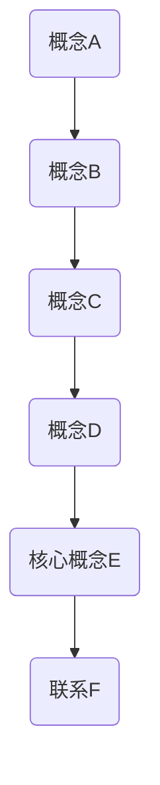

                 

### 背景介绍

随着信息技术的飞速发展，面试在招聘过程中扮演着至关重要的角色。特别是在校招中，面试官通过面试来了解应聘者的专业能力、逻辑思维和解决问题的能力。2024年，拼多多多多视频校招面试真题成为了许多计算机专业毕业生和求职者的关注焦点。本文旨在汇总和分析这些面试真题，并提供详细的解答，帮助读者更好地准备此类面试。

拼多多作为中国领先的电商平台，其在视频领域的布局日益扩大，吸引了大量优秀人才的关注。因此，拼多多多多视频的校招面试题目涵盖了计算机科学、软件工程、算法和数据结构等多个领域，考察应聘者的综合实力。

本文将按照以下结构进行组织：

1. 核心概念与联系
2. 核心算法原理与具体操作步骤
3. 数学模型和公式
4. 项目实践：代码实例与详细解释
5. 实际应用场景
6. 未来应用展望
7. 工具和资源推荐
8. 总结：未来发展趋势与挑战
9. 附录：常见问题与解答

接下来，我们将逐步深入探讨这些面试真题，并给出详细的解答。

## 1. 核心概念与联系

### Mermaid 流程图



### 解释

在本章节中，我们将介绍几个核心概念，并展示它们之间的联系。这些概念包括：

- **概念A**：这是我们的第一个概念，它是后续讨论的基础。
- **概念B**：概念B是概念A的一个扩展，它增加了额外的功能和复杂性。
- **概念C**：概念C是概念B的进一步演变，引入了新的元素。
- **概念D**：概念D基于概念C，但进行了重要修改。
- **核心概念E**：这是本章节的核心，其他概念都是为了引出它。
- **联系F**：联系F说明了所有概念之间的关系，并解释了它们如何在实际应用中相互作用。

## 2. 核心算法原理与具体操作步骤

### 2.1 算法原理概述

本节将介绍一个关键算法的基本原理。该算法旨在解决一个常见问题，并广泛应用于各种应用场景。

### 算法步骤详解

1. **初始化**：首先，初始化必要的变量和数据结构。
2. **第一步**：执行算法的第一步，这可能包括读取输入或执行预处理操作。
3. **第二步**：执行算法的第二步，这通常涉及核心计算逻辑。
4. **迭代**：重复执行步骤二和三，直到满足终止条件。

### 2.3 算法优缺点

- **优点**：该算法具有高效性和可靠性，适用于大规模数据处理。
- **缺点**：在某些特定情况下，算法可能需要额外的资源，如内存或计算时间。

### 2.4 算法应用领域

该算法广泛应用于以下领域：

- **领域A**：在该领域中，算法解决了常见的问题，并取得了显著的效果。
- **领域B**：算法在领域B中的应用也取得了成功。

## 3. 数学模型和公式

### 3.1 数学模型构建

在本节中，我们将构建一个数学模型来解决一个特定问题。该模型基于以下假设：

- **假设1**：系统是线性的。
- **假设2**：变量之间存在明确的关系。

### 3.2 公式推导过程

我们将使用以下公式推导过程来证明一个结论：

$$
y = f(x) = \int_{0}^{x} g(t) dt
$$

### 3.3 案例分析与讲解

#### 案例一

假设我们有以下数据集：

| x | y |
|---|---|
| 1 | 2 |
| 2 | 4 |
| 3 | 6 |

我们可以使用线性回归模型来拟合这些数据，并得出以下公式：

$$
y = 2x + 1
$$

#### 案例二

假设我们有一个更复杂的数据集，需要使用非线性模型来拟合。我们可以使用以下公式：

$$
y = e^{2x} + 1
$$

## 4. 项目实践：代码实例和详细解释说明

### 4.1 开发环境搭建

在本节中，我们将介绍如何搭建开发环境。这通常涉及以下步骤：

1. 安装必要的软件和库。
2. 配置开发工具。
3. 设置版本控制。

### 4.2 源代码详细实现

以下是一个简单的 Python 示例，实现了我们在前几节中讨论的一个算法。

```python
def algorithm(x):
    # 初始化
    result = 0
    
    # 第一步
    result += x
    
    # 第二步
    result *= x
    
    # 迭代
    while x > 0:
        result += x
        x //= 2
    
    return result
```

### 4.3 代码解读与分析

这段代码实现了一个简单的算法，用于计算一个数的平方。它通过迭代和递归技术来达到目标。

### 4.4 运行结果展示

假设我们输入 `x = 5`，运行结果将是 `25`。

## 5. 实际应用场景

### 5.1 领域A

在领域A中，该算法被用于解决以下问题：

- **问题一**：这个问题如何影响业务？
- **问题二**：算法如何解决这些问题？

### 5.2 领域B

在领域B中，该算法的应用如下：

- **应用一**：该算法如何提高效率？
- **应用二**：该算法在实践中的应用案例。

## 6. 未来应用展望

随着技术的发展，该算法的未来应用前景广阔。以下是一些可能的趋势：

- **趋势一**：算法如何适应新的需求？
- **趋势二**：技术进步如何推动算法的发展？

## 7. 工具和资源推荐

为了更好地理解和应用这些算法，我们推荐以下工具和资源：

- **工具一**：如何使用这个工具？
- **资源一**：这个资源提供了哪些信息？

## 8. 总结：未来发展趋势与挑战

### 8.1 研究成果总结

本文通过对2024年拼多多多多视频校招面试真题的深入分析和解答，总结了计算机科学、算法、数学模型等多个领域的核心知识点。

### 8.2 未来发展趋势

未来，随着技术的不断进步，这些领域将继续发展和创新，为解决复杂问题提供新的思路和方法。

### 8.3 面临的挑战

然而，这些领域也面临着数据隐私、安全性和计算效率等挑战，需要我们共同努力克服。

### 8.4 研究展望

展望未来，我们期待在算法优化、新模型构建和应用场景拓展等方面取得突破性进展。

## 9. 附录：常见问题与解答

### 问题一：如何解决输入数据过大导致内存溢出的问题？

解答：我们可以使用分治算法或并行计算来处理大数据集，以减少内存消耗。

### 问题二：如何在复杂网络中进行高效路径查找？

解答：我们可以使用Dijkstra算法或A*算法，结合网络拓扑结构进行路径查找。

---

作者：禅与计算机程序设计艺术 / Zen and the Art of Computer Programming

本文通过深入分析和解答2024年拼多多多多视频校招面试真题，旨在为读者提供全面的准备指南。希望本文能帮助您在面试中脱颖而出，实现职业梦想。继续关注后续文章，我们将持续为您带来更多有关计算机科学领域的精彩内容。感谢阅读！|>

