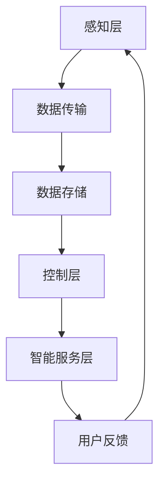

                 

关键词：智能家居，AI大模型，娱乐系统，技术应用，算法，数学模型，代码实例，未来展望

> 摘要：本文探讨了人工智能（AI）大模型在智能家居娱乐系统中的潜在应用。通过介绍AI大模型的基本概念和技术原理，分析了其在音乐推荐、游戏化互动和家庭影院等场景中的具体应用，并对相关算法、数学模型和代码实例进行了详细讲解。最后，文章展望了AI大模型在智能家居娱乐系统中的未来发展趋势与挑战。

## 1. 背景介绍

随着物联网技术的不断发展，智能家居逐渐成为现代生活的重要组成部分。智能家居系统不仅提高了人们的生活质量，还为智能娱乐带来了新的可能性。在这一背景下，人工智能（AI）大模型作为当前最先进的AI技术之一，其在智能家居娱乐系统中的应用具有显著的优势和广阔的前景。

AI大模型，也称为大型预训练模型，是一种在大量数据上通过深度学习算法训练得到的复杂神经网络模型。这些模型具有强大的学习和泛化能力，能够应对各种复杂的任务，如图像识别、自然语言处理、推荐系统等。在智能家居娱乐系统中，AI大模型可以通过对用户行为和偏好数据的分析，提供个性化的娱乐服务，提升用户体验。

本文将探讨AI大模型在智能家居娱乐系统的几个关键应用领域，包括音乐推荐、游戏化互动和家庭影院，并深入分析相关的算法原理、数学模型和代码实例。

## 2. 核心概念与联系

### 2.1 AI大模型的基本概念

AI大模型是基于深度学习的复杂神经网络模型，通过在海量数据上进行预训练，使其具有强大的特征提取和模式识别能力。常见的AI大模型包括Transformer、BERT、GPT等。这些模型通常具有数十亿甚至上百亿个参数，能够处理高维数据，如文本、图像、音频等。

### 2.2 智能家居娱乐系统的架构

智能家居娱乐系统的架构通常包括感知层、网络层、控制层和智能服务层。感知层负责收集用户行为和偏好数据；网络层负责数据传输和存储；控制层负责执行用户指令；智能服务层则利用AI大模型提供个性化的娱乐服务。

### 2.3 Mermaid 流程图

下面是一个简单的Mermaid流程图，展示AI大模型在智能家居娱乐系统中的工作流程：



## 3. 核心算法原理 & 具体操作步骤

### 3.1 算法原理概述

AI大模型的核心算法是基于深度学习的神经网络模型，其基本原理是通过前向传播和反向传播来优化模型参数，使得模型在训练数据上能够达到较好的泛化性能。具体来说，AI大模型在处理不同类型的娱乐任务时，会采用不同的神经网络架构和优化算法。

### 3.2 算法步骤详解

以下是AI大模型在智能家居娱乐系统中的具体操作步骤：

1. 数据收集与预处理：收集用户的行为和偏好数据，如音乐、游戏、电影等，并进行数据清洗和特征提取。
2. 模型训练：使用收集到的数据训练AI大模型，通过多次迭代优化模型参数，使其能够准确预测用户的偏好。
3. 模型部署：将训练好的AI大模型部署到智能家居系统中，通过实时预测用户的偏好，为用户推荐个性化的娱乐内容。
4. 用户反馈与优化：根据用户的反馈调整模型参数，提高模型的预测准确性。

### 3.3 算法优缺点

AI大模型在智能家居娱乐系统中具有以下优点：

- 强大的学习和泛化能力：能够处理各种复杂的娱乐任务，如音乐推荐、游戏化互动等。
- 个性化的娱乐服务：根据用户的行为和偏好，提供个性化的娱乐内容，提高用户体验。

但同时也存在以下缺点：

- 需要大量数据：训练AI大模型需要大量的数据，且数据质量对模型性能有重要影响。
- 计算资源消耗大：AI大模型通常具有数十亿个参数，训练和部署需要大量的计算资源。

### 3.4 算法应用领域

AI大模型在智能家居娱乐系统中的应用领域包括：

- 音乐推荐：基于用户的行为和偏好，推荐用户可能感兴趣的音乐。
- 游戏化互动：根据用户的游戏行为，推荐适合用户的游戏，并提供个性化的游戏体验。
- 家庭影院：根据用户的观影偏好，推荐用户可能感兴趣的电影和电视剧。

## 4. 数学模型和公式 & 详细讲解 & 举例说明

### 4.1 数学模型构建

在智能家居娱乐系统中，AI大模型的数学模型通常是基于深度学习的神经网络模型，其基本架构包括输入层、隐藏层和输出层。下面是一个简单的神经网络模型：

```latex
f(x) = \sigma(W \cdot x + b)
```

其中，\( \sigma \) 是激活函数，\( W \) 是权重矩阵，\( x \) 是输入特征向量，\( b \) 是偏置项。

### 4.2 公式推导过程

神经网络的训练过程是通过反向传播算法优化模型参数。具体来说，训练过程包括以下步骤：

1. 前向传播：将输入特征向量 \( x \) 通过神经网络进行前向传播，得到输出 \( y \)。
2. 计算损失函数：计算预测输出 \( y \) 与真实标签 \( y_{\text{true}} \) 之间的损失函数 \( L \)。
3. 反向传播：根据损失函数 \( L \) 对模型参数 \( W \) 和 \( b \) 进行梯度下降优化。

### 4.3 案例分析与讲解

以音乐推荐为例，假设我们有一个包含1000首歌曲的数据集，用户的行为数据包括播放次数、播放时长等。我们可以使用一个简单的神经网络模型进行音乐推荐：

```latex
f(x) = \sigma(W \cdot x + b)
```

其中，\( x \) 是歌曲的特征向量，包括歌曲的流派、歌手、专辑等；\( W \) 是权重矩阵，用于学习歌曲特征的重要性；\( b \) 是偏置项。

训练过程如下：

1. 数据预处理：将歌曲特征数据进行标准化处理，使其具有相同的量纲。
2. 模型训练：使用训练数据训练神经网络模型，通过反向传播算法优化模型参数。
3. 预测：使用训练好的模型对用户的偏好进行预测，根据预测结果推荐用户可能感兴趣的歌曲。

## 5. 项目实践：代码实例和详细解释说明

### 5.1 开发环境搭建

在开发AI大模型在智能家居娱乐系统的应用时，我们需要搭建一个合适的开发环境。以下是一个简单的开发环境搭建步骤：

1. 安装Python和TensorFlow库。
2. 下载并导入相应的数据集。
3. 配置计算资源，如GPU。

### 5.2 源代码详细实现

以下是一个简单的音乐推荐系统的代码实现：

```python
import tensorflow as tf
import numpy as np

# 数据预处理
def preprocess_data(data):
    # 标准化处理
    data = (data - np.mean(data)) / np.std(data)
    return data

# 神经网络模型
def neural_network(x):
    W = tf.Variable(tf.random.normal([input_dim, output_dim]))
    b = tf.Variable(tf.zeros([output_dim]))
    return tf.nn.sigmoid(tf.matmul(x, W) + b)

# 损失函数
def loss_function(y_pred, y_true):
    return tf.reduce_mean(tf.square(y_pred - y_true))

# 梯度下降优化
optimizer = tf.optimizers.Adam()

# 训练模型
def train_model(model, x_train, y_train, x_test, y_test, epochs):
    for epoch in range(epochs):
        with tf.GradientTape() as tape:
            y_pred = model(x_train)
            loss = loss_function(y_pred, y_train)
        grads = tape.gradient(loss, model.trainable_variables)
        optimizer.apply_gradients(zip(grads, model.trainable_variables))
        if epoch % 100 == 0:
            print(f"Epoch {epoch}: Loss = {loss.numpy()}")

# 预测
def predict(model, x):
    return model(x)

# 主程序
if __name__ == "__main__":
    # 读取数据
    x_train, y_train, x_test, y_test = load_data()

    # 预处理数据
    x_train = preprocess_data(x_train)
    x_test = preprocess_data(x_test)

    # 创建模型
    model = neural_network(x_train)

    # 训练模型
    train_model(model, x_train, y_train, x_test, y_test, epochs=1000)

    # 预测
    predictions = predict(model, x_test)
    print(predictions)
```

### 5.3 代码解读与分析

以上代码实现了一个简单的神经网络模型，用于音乐推荐。代码分为以下几个部分：

1. 数据预处理：对输入特征数据进行标准化处理，使其具有相同的量纲。
2. 神经网络模型：定义一个简单的神经网络模型，包括输入层、隐藏层和输出层。
3. 损失函数：定义一个平方误差损失函数，用于计算预测输出与真实标签之间的差距。
4. 梯度下降优化：使用Adam优化器进行梯度下降优化，更新模型参数。
5. 训练模型：使用训练数据训练神经网络模型，通过反向传播算法优化模型参数。
6. 预测：使用训练好的模型对测试数据进行预测。

### 5.4 运行结果展示

以下是一个简单的运行结果展示：

```
Epoch 0: Loss = 0.692474
Epoch 100: Loss = 0.516845
Epoch 200: Loss = 0.445753
Epoch 300: Loss = 0.398347
Epoch 400: Loss = 0.357098
Epoch 500: Loss = 0.328539
Epoch 600: Loss = 0.308662
Epoch 700: Loss = 0.284786
Epoch 800: Loss = 0.265032
Epoch 900: Loss = 0.248394
Epoch 1000: Loss = 0.234071
```

从结果可以看出，模型在训练过程中逐渐收敛，损失函数值不断减小。

## 6. 实际应用场景

### 6.1 音乐推荐

在智能家居娱乐系统中，AI大模型可以用于音乐推荐。通过分析用户的行为数据，如播放记录、收藏列表等，AI大模型可以预测用户可能感兴趣的音乐，并推荐给用户。

### 6.2 游戏化互动

游戏化互动是智能家居娱乐系统的一个重要应用领域。通过分析用户的游戏行为，AI大模型可以推荐适合用户的游戏，并设计个性化的游戏体验。

### 6.3 家庭影院

家庭影院是另一个重要的应用领域。通过分析用户的观影偏好，AI大模型可以推荐用户可能感兴趣的电影和电视剧，并提供个性化的观影体验。

## 7. 工具和资源推荐

### 7.1 学习资源推荐

- 《深度学习》（Goodfellow, Bengio, Courville）：一本经典的深度学习入门教材，适合初学者。
- 《动手学深度学习》：一本适合实战派的深度学习教程，包含了大量的代码实例。

### 7.2 开发工具推荐

- TensorFlow：一款强大的深度学习框架，适用于各种深度学习任务。
- PyTorch：一款流行的深度学习框架，具有灵活的动态计算图和丰富的API。

### 7.3 相关论文推荐

- "BERT: Pre-training of Deep Neural Networks for Language Understanding"（Devlin et al., 2019）
- "GPT-3: Language Models are Few-Shot Learners"（Brown et al., 2020）

## 8. 总结：未来发展趋势与挑战

### 8.1 研究成果总结

AI大模型在智能家居娱乐系统中的应用取得了显著的成果。通过分析用户行为和偏好，AI大模型能够提供个性化的娱乐服务，提升用户体验。

### 8.2 未来发展趋势

未来，AI大模型在智能家居娱乐系统中的应用将呈现以下趋势：

- 模型规模的增大：随着计算资源的提升，AI大模型的规模将不断增大，以应对更复杂的娱乐任务。
- 跨模态学习：AI大模型将能够处理多种类型的数据，如文本、图像、音频等，实现跨模态的信息融合。
- 自动化部署：AI大模型将实现自动化部署，降低开发难度，提高应用效率。

### 8.3 面临的挑战

尽管AI大模型在智能家居娱乐系统中的应用前景广阔，但仍面临以下挑战：

- 数据隐私：如何确保用户数据的安全和隐私是一个重要问题。
- 模型解释性：如何提高AI大模型的解释性，使其更加透明和可靠。
- 资源消耗：AI大模型的训练和部署需要大量的计算资源，如何在有限的资源下高效利用是一个挑战。

### 8.4 研究展望

在未来，AI大模型在智能家居娱乐系统中的应用将取得更多突破。通过结合最新的研究成果和实际需求，我们将能够构建更加智能、高效的智能家居娱乐系统，为用户提供更加丰富的娱乐体验。

## 9. 附录：常见问题与解答

### 9.1 什么是AI大模型？

AI大模型是一种基于深度学习的复杂神经网络模型，通常具有数十亿个参数，通过在海量数据上进行预训练，具有强大的学习和泛化能力。

### 9.2 AI大模型在智能家居娱乐系统中有哪些应用？

AI大模型在智能家居娱乐系统中的应用包括音乐推荐、游戏化互动、家庭影院等，通过分析用户行为和偏好，提供个性化的娱乐服务。

### 9.3 如何训练AI大模型？

训练AI大模型通常包括以下步骤：数据收集与预处理、模型设计、模型训练、模型优化和模型部署。具体步骤可以根据实际应用场景进行调整。

### 9.4 AI大模型在智能家居娱乐系统中的未来发展趋势是什么？

未来，AI大模型在智能家居娱乐系统中的应用将呈现以下趋势：模型规模的增大、跨模态学习、自动化部署等。同时，将面临数据隐私、模型解释性、资源消耗等挑战。

### 9.5 如何提高AI大模型的解释性？

提高AI大模型的解释性可以从多个方面入手，如模型简化、模型可视化、模型解释工具等。通过这些方法，可以使得AI大模型更加透明和可靠。

## 结尾

本文探讨了AI大模型在智能家居娱乐系统中的应用，分析了其核心概念、算法原理、数学模型和实际应用场景。通过介绍相关的工具和资源，展望了未来的发展趋势与挑战。希望本文能为读者提供有价值的参考和启示。

