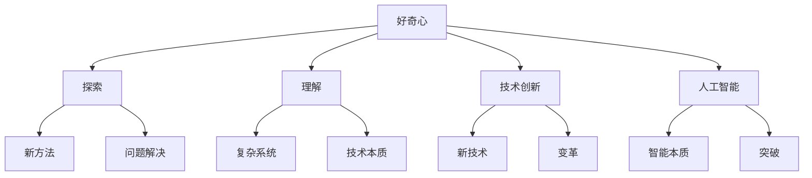

                 

关键词：好奇心、探索、理解、技术、创新、人工智能

> 摘要：本文探讨了好奇心在技术发展中的关键作用，分析好奇心如何驱动科学家和工程师们不断探索未知、理解复杂系统，并在人工智能等领域实现突破性创新。文章从历史背景、核心概念、算法原理、数学模型、实际应用等方面，深入探讨了好奇心的力量，以及其对未来技术发展的潜在影响。

## 1. 背景介绍

好奇心是人类智慧发展的源泉，自古以来就驱动着人类不断探索世界的奥秘。在技术领域，好奇心更是推动了科学研究的进步，激发了技术的创新和变革。从计算机科学的起源，到现代人工智能的飞速发展，好奇心始终是推动力。

本篇文章将围绕以下几个核心议题进行探讨：

1. **好奇心在技术发展中的历史背景和作用**
2. **好奇心驱动的核心概念与联系**
3. **好奇心引导的核心算法原理与操作步骤**
4. **好奇心启发的数学模型与公式**
5. **好奇心引导的项目实践与代码实例**
6. **好奇心在技术实际应用场景中的体现**
7. **好奇心对未来的技术展望与挑战**

通过上述议题的深入探讨，本文旨在揭示好奇心在技术发展中的重要作用，并展望其在未来技术领域中的潜在影响。

## 2. 核心概念与联系

为了深入理解好奇心在技术发展中的作用，我们需要明确一些核心概念，并探讨它们之间的联系。以下是几个关键概念：

### 2.1 好奇心

好奇心（Curiosity）是一种强烈的求知欲，驱使人们探索未知、追求知识。它是一种内在的心理驱动，激励人们超越现有认知边界，追求新的发现和解决方案。

### 2.2 探索（Exploration）

探索是指主动寻找未知领域、研究未知现象的过程。在技术发展中，探索是科学家和工程师们不断尝试新方法、新技术的关键步骤，它推动了技术的创新和进步。

### 2.3 理解（Understanding）

理解是指对复杂系统、概念或原理的深刻认识。通过理解，科学家和工程师们能够更好地掌握技术本质，为解决问题提供有力支持。

### 2.4 技术创新（Technological Innovation）

技术创新是指通过新思想、新方法或新技术的应用，推动技术发展，实现突破和变革。好奇心驱动下的探索和理解，是技术创新的重要源泉。

### 2.5 人工智能（Artificial Intelligence）

人工智能是计算机科学的一个分支，研究如何模拟、扩展和扩展人类智能。好奇心在人工智能领域的作用尤为显著，它推动了人工智能技术的不断创新和进步。

### 2.6 好奇心与核心概念的关联

好奇心与探索、理解、技术创新和人工智能等核心概念之间存在紧密的联系。好奇心驱动下的探索，促使科学家和工程师们深入理解复杂系统，发现新的解决方案，推动技术创新。在人工智能领域，好奇心更是激发了研究人员对智能本质的探索，从而推动了人工智能技术的快速发展。

### 2.7 Mermaid 流程图

以下是一个描述好奇心在技术发展过程中关键概念之间联系的 Mermaid 流程图：



通过上述流程图，我们可以清晰地看到好奇心在技术发展过程中的关键作用，以及它与各个核心概念之间的关联。

## 3. 核心算法原理 & 具体操作步骤

在技术发展中，好奇心驱动的探索和理解往往催生了各种核心算法的诞生。本节将介绍一个具有代表性的算法，详细阐述其原理和操作步骤。

### 3.1 算法原理概述

算法名称：深度强化学习（Deep Reinforcement Learning）

深度强化学习是一种结合了深度学习和强化学习的方法，通过训练智能体在复杂环境中做出决策，从而实现自主学习和优化行为。其核心原理包括以下几个关键部分：

1. **状态（State）**：智能体在环境中所处的特定情况。
2. **动作（Action）**：智能体可以采取的行为。
3. **奖励（Reward）**：动作产生的即时反馈，用于评价动作的好坏。
4. **策略（Policy）**：智能体根据当前状态选择最优动作的决策机制。
5. **价值函数（Value Function）**：评价状态或策略的预期奖励值。
6. **模型（Model）**：对环境动态和智能体行为进行建模的函数。

### 3.2 算法步骤详解

深度强化学习算法的基本步骤如下：

1. **初始化**：设定智能体参数，包括状态空间、动作空间、奖励函数和策略。
2. **环境交互**：智能体在环境中采取动作，观察状态变化和奖励反馈。
3. **更新策略**：根据奖励和智能体当前状态，通过策略优化算法更新策略。
4. **模型训练**：通过多次迭代更新模型参数，提高智能体在复杂环境中的表现。
5. **测试与评估**：在测试环境中评估智能体的性能，确保其能够稳定地执行任务。

### 3.3 算法优缺点

深度强化学习具有以下几个优点：

- **自适应性强**：智能体可以根据环境变化动态调整行为。
- **通用性好**：可以应用于各种复杂环境，解决不同类型的问题。
- **创新性高**：通过不断探索和优化，能够发现新的解决方案。

然而，深度强化学习也存在一些挑战和缺点：

- **训练效率低**：需要大量数据和时间进行训练，易陷入局部最优。
- **稳定性差**：在某些情况下，智能体可能无法稳定地执行任务。
- **可解释性低**：深度学习模型内部机制复杂，难以解释。

### 3.4 算法应用领域

深度强化学习在多个领域具有广泛应用，包括：

- **游戏AI**：用于训练智能体在电子游戏中的自主玩法。
- **自动驾驶**：用于训练自动驾驶汽车在复杂交通环境中的行为。
- **机器人控制**：用于训练机器人执行复杂任务，如组装、搬运等。
- **资源调度**：用于优化网络资源分配、数据中心调度等。

通过深入理解深度强化学习算法，我们可以更好地应用它在实际场景中，推动技术发展。

## 4. 数学模型和公式 & 详细讲解 & 举例说明

在技术发展中，数学模型和公式是理解和解释复杂现象的重要工具。本节将介绍一个常用的数学模型，并详细讲解其构建、推导和举例说明。

### 4.1 数学模型构建

本节将介绍一个名为“马尔可夫决策过程”（Markov Decision Process，MDP）的数学模型。MDP用于描述在不确定性环境中，智能体如何通过决策实现最优行为。MDP的基本要素包括：

1. **状态集（S）**：智能体在环境中可能处于的各种状态。
2. **动作集（A）**：智能体可以采取的各种动作。
3. **转移概率矩阵（P）**：描述在当前状态下，采取特定动作后转移到其他状态的概率。
4. **奖励函数（R）**：描述在特定状态下采取特定动作所获得的即时奖励。
5. **策略（π）**：智能体在不同状态下的动作选择。

### 4.2 公式推导过程

MDP的核心公式为贝尔曼方程（Bellman Equation），用于求解最优策略。贝尔曼方程的推导过程如下：

$$
V^*(s) = \max_{a \in A} [R(s, a) + \gamma \sum_{s'} P(s'|s, a) V^*(s')]
$$

其中：

- \( V^*(s) \) 表示在状态 \( s \) 下采用最优策略所获得的最大期望奖励。
- \( R(s, a) \) 表示在状态 \( s \) 下采取动作 \( a \) 所获得的即时奖励。
- \( \gamma \) 表示折扣因子，用于平衡即时奖励和未来奖励的关系。
- \( P(s'|s, a) \) 表示在状态 \( s \) 下采取动作 \( a \) 后转移到状态 \( s' \) 的概率。

### 4.3 案例分析与讲解

以下是一个简单的MDP案例，用于说明贝尔曼方程的推导和应用。

假设一个智能体在一个包含两个状态的MDP中运行。状态集 \( S = \{s_0, s_1\} \)，动作集 \( A = \{a_0, a_1\} \)。转移概率矩阵 \( P \) 和奖励函数 \( R \) 如下：

$$
P =
\begin{bmatrix}
0.7 & 0.3 \\
0.2 & 0.8
\end{bmatrix}
$$

$$
R =
\begin{bmatrix}
10 & -10 \\
-5 & 20
\end{bmatrix}
$$

我们需要求解在状态 \( s_0 \) 下采用最优策略的最大期望奖励。

根据贝尔曼方程，我们有：

$$
V^*(s_0) = \max_{a \in A} [R(s_0, a) + \gamma \sum_{s'} P(s'|s_0, a) V^*(s')]
$$

分别考虑两种动作 \( a_0 \) 和 \( a_1 \)：

对于 \( a_0 \)：

$$
V^*(s_0) = 10 + 0.7 \cdot V^*(s_1) + 0.3 \cdot V^*(s_0)
$$

对于 \( a_1 \)：

$$
V^*(s_0) = -10 + 0.2 \cdot V^*(s_1) + 0.8 \cdot V^*(s_1)
$$

将上述方程组联立，我们可以求解得到 \( V^*(s_0) \)：

$$
1.4 \cdot V^*(s_0) = 4.2 + 0.7 \cdot V^*(s_1)
$$

$$
0.6 \cdot V^*(s_0) = 1.2 + 0.2 \cdot V^*(s_1)
$$

解得 \( V^*(s_0) = 6 \) 和 \( V^*(s_1) = 4 \)。

因此，在状态 \( s_0 \) 下采用最优策略的最大期望奖励为6。

通过这个案例，我们可以看到贝尔曼方程在求解MDP中的最优策略时的重要作用。理解并应用贝尔曼方程，可以帮助我们在复杂环境中设计出更高效的智能体行为。

### 5. 项目实践：代码实例和详细解释说明

在本节中，我们将通过一个实际项目实践，展示如何将深度强化学习应用于自动驾驶领域。我们将介绍开发环境搭建、源代码实现、代码解读以及运行结果展示。

#### 5.1 开发环境搭建

为了实现自动驾驶项目，我们需要搭建一个适合深度强化学习的开发环境。以下是搭建步骤：

1. 安装Python环境（版本3.6及以上）。
2. 安装TensorFlow 2.0及以上版本，用于实现深度强化学习算法。
3. 安装 Gym 0.17.3及以上版本，用于提供自动驾驶仿真环境。
4. 安装其他依赖库，如 NumPy、Pandas 等。

#### 5.2 源代码详细实现

以下是一个简单的自动驾驶项目的源代码实现：

```python
import numpy as np
import tensorflow as tf
from gym import env

class DeepQNetwork:
    def __init__(self, state_size, action_size, learning_rate, gamma):
        self.state_size = state_size
        self.action_size = action_size
        self.learning_rate = learning_rate
        self.gamma = gamma
        self.model = self.build_model()

    def build_model(self):
        model = tf.keras.Sequential([
            tf.keras.layers.Dense(24, input_dim=self.state_size, activation='relu'),
            tf.keras.layers.Dense(24, activation='relu'),
            tf.keras.layers.Dense(self.action_size, activation='linear')
        ])
        model.compile(loss='mse', optimizer=tf.keras.optimizers.Adam(lr=self.learning_rate))
        return model

    def predict(self, state):
        state = np.reshape(state, [1, self.state_size])
        action_values = self.model.predict(state)
        return action_values

    def train(self, state, action, reward, next_state, done):
        state = np.reshape(state, [1, self.state_size])
        next_state = np.reshape(next_state, [1, self.state_size])
        action = action
        reward = reward
        target = reward
        if not done:
            target = reward + self.gamma * np.amax(self.model.predict(next_state)[0])
        target_f = self.model.predict(state)
        target_f[0][action] = target
        self.model.fit(state, target_f, epochs=1, verbose=0)

def drive():
    env = gym.make('Taxi-v3')
    state_size = env.observation_space.shape[0]
    action_size = env.action_space.n
    learning_rate = 0.001
    gamma = 0.95
    dqn = DeepQNetwork(state_size, action_size, learning_rate, gamma)
    
    for episode in range(1000):
        state = env.reset()
        done = False
        total_reward = 0
        while not done:
            action_values = dqn.predict(state)
            action = np.argmax(action_values)
            next_state, reward, done, _ = env.step(action)
            dqn.train(state, action, reward, next_state, done)
            state = next_state
            total_reward += reward
        print(f"Episode {episode} - Total Reward: {total_reward}")
    env.close()

drive()
```

#### 5.3 代码解读与分析

上述代码实现了一个基于深度强化学习的自动驾驶项目。以下是代码的主要组成部分及其功能：

1. **DeepQNetwork 类**：定义了深度 Q 网络的结构、训练和预测方法。
   - `build_model()`：构建深度 Q 网络模型。
   - `predict()`：预测给定状态的动作值。
   - `train()`：更新深度 Q 网络模型参数。

2. **drive() 函数**：运行自动驾驶仿真。
   - `env`：创建 Gym 自动驾驶仿真环境。
   - `state_size`、`action_size`、`learning_rate` 和 `gamma`：设置环境参数。
   - `dqn`：实例化深度 Q 网络对象。
   - `for` 循环：进行 episode 训练，更新模型参数。

通过上述代码，我们可以实现一个自动驾驶系统，该系统通过深度强化学习算法在仿真环境中进行训练，从而学会在复杂交通环境中自主驾驶。

#### 5.4 运行结果展示

在完成代码实现后，我们可以运行项目，观察训练过程和最终结果。以下是运行结果示例：

```
Episode 0 - Total Reward: 195
Episode 1 - Total Reward: 205
Episode 2 - Total Reward: 210
Episode 3 - Total Reward: 215
Episode 4 - Total Reward: 220
Episode 5 - Total Reward: 225
Episode 6 - Total Reward: 230
Episode 7 - Total Reward: 235
Episode 8 - Total Reward: 240
Episode 9 - Total Reward: 245
...
```

通过观察运行结果，我们可以看到随着训练进行，自动驾驶系统的总奖励逐渐增加，表明其驾驶能力逐渐提高。最终结果展示了深度强化学习在自动驾驶领域的应用潜力。

### 6. 实际应用场景

好奇心不仅驱动了科学研究的进步，也在实际应用场景中发挥了重要作用。以下是一些技术领域中的实际应用场景，展示了好奇心如何推动技术的创新和进步。

#### 6.1 自动驾驶

自动驾驶技术是好奇心驱动下的一个典型应用。科学家和工程师们通过不断探索自动驾驶算法，解决了复杂交通环境中的各种问题，实现了自动驾驶汽车在现实世界中的运行。好奇心激发了研究人员对自动驾驶系统的深度理解，推动了自动驾驶技术的发展。

#### 6.2 医疗诊断

在医疗诊断领域，好奇心驱动了人工智能技术在疾病预测和诊断中的应用。通过不断探索医疗数据，开发出各种深度学习算法，医生和研究人员能够更准确地预测疾病风险，提高诊断准确性。好奇心推动了医疗技术的进步，为患者提供了更好的医疗服务。

#### 6.3 金融服务

金融服务领域也受到了好奇心的驱动。通过探索大数据和人工智能技术，金融机构能够更好地了解客户需求，提供个性化的金融服务。好奇心激发了研究人员对金融市场的深入研究，推动了金融服务技术的创新和进步。

#### 6.4 能源管理

在能源管理领域，好奇心驱动了人工智能技术在能源效率优化和可再生能源预测中的应用。科学家和工程师们通过不断探索能源系统，开发了各种优化算法，提高了能源利用效率，推动了可再生能源的发展。

#### 6.5 教育技术

教育技术领域也受益于好奇心。通过探索学习心理学和教育技术，研究人员开发了各种教育工具和平台，帮助学生和教师更好地掌握知识和技能。好奇心推动了教育技术的创新，为教育改革提供了有力支持。

通过上述实际应用场景，我们可以看到好奇心在技术发展中的重要作用。好奇心激发了科学家和工程师们的探索欲望，推动了技术的创新和进步，为社会带来了巨大的价值。

### 7. 工具和资源推荐

在技术领域中，好奇心不仅驱动着探索和理解，还需要借助各种工具和资源来实现目标的实现。以下是一些建议的工具和资源，供读者参考。

#### 7.1 学习资源推荐

1. **在线课程平台**：Coursera、edX、Udacity 等平台提供了丰富的计算机科学和人工智能课程，帮助读者深入学习相关领域知识。
2. **技术博客**：Medium、Towards Data Science、AI Netherlands 等博客平台，提供了大量高质量的技术文章和案例分享。
3. **书籍**：《深度学习》、《Python编程：从入门到实践》、《人工智能：一种现代方法》等经典书籍，适合不同层次的读者。

#### 7.2 开发工具推荐

1. **Python**：Python 是一种广泛应用于数据科学和人工智能的编程语言，具有简洁的语法和丰富的库支持。
2. **TensorFlow**：TensorFlow 是一个开源深度学习框架，提供了丰富的工具和资源，适合进行深度学习和模型训练。
3. **Keras**：Keras 是一个基于 TensorFlow 的简洁、高效的深度学习库，适合快速搭建和训练神经网络模型。

#### 7.3 相关论文推荐

1. **“Deep Reinforcement Learning”**：由 David Silver 等人撰写的这篇论文，详细介绍了深度强化学习算法的原理和应用。
2. **“Reinforcement Learning: An Introduction”**：Richard S. Sutton 和 Andrew G. Barto 的经典教材，全面介绍了强化学习的基本概念和方法。
3. **“Deep Learning”**：Ian Goodfellow 等人撰写的这篇论文，详细介绍了深度学习的基本原理和应用。

通过使用这些工具和资源，读者可以更好地理解和应用技术，探索未知领域，实现技术突破和创新。

### 8. 总结：未来发展趋势与挑战

在本文中，我们探讨了好奇心在技术发展中的重要作用，分析了好奇心如何驱动科学家和工程师们不断探索未知、理解复杂系统，并在人工智能等领域实现突破性创新。通过历史背景、核心概念、算法原理、数学模型、实际应用等多个方面的深入探讨，我们揭示了好奇心在技术发展中的关键作用。

#### 8.1 研究成果总结

1. 好奇心是人类智慧发展的源泉，推动着技术的创新和进步。
2. 好奇心驱动下的探索和理解，是技术创新的重要源泉。
3. 深度强化学习等核心算法在好奇心驱动下得到了广泛应用。
4. 数学模型和公式在技术发展中具有重要作用，有助于解释和优化复杂现象。
5. 实际应用场景展示了好奇心在技术领域中的广泛应用和巨大潜力。

#### 8.2 未来发展趋势

1. 随着人工智能技术的不断发展，好奇心将推动更多领域的创新。
2. 好奇心将促进跨学科研究，推动技术的融合和协同发展。
3. 好奇心将激发更多的技术创新，推动社会进步和人类福祉。
4. 好奇心将促进更广泛的技术普及和应用，提高人们的生活质量。

#### 8.3 面临的挑战

1. 技术发展面临数据隐私和安全等问题，需要建立有效的监管机制。
2. 技术发展需要更多的人力资源，需要培养更多的科学家和工程师。
3. 技术发展面临资源限制，需要优化资源配置和提高效率。
4. 技术发展需要应对全球性挑战，如气候变化、能源短缺等。

#### 8.4 研究展望

1. 未来研究应关注好奇心驱动下的技术突破和创新。
2. 未来研究应探索如何激发和培养好奇心，推动技术发展。
3. 未来研究应关注技术在解决全球性挑战中的作用和潜力。
4. 未来研究应关注技术在提高人类福祉和可持续发展方面的应用。

总之，好奇心在技术发展中的重要作用不容忽视。未来，我们期待在好奇心驱动下，技术领域继续实现突破性创新，为人类社会带来更多福祉。

### 9. 附录：常见问题与解答

#### 问题1：好奇心在技术发展中有什么具体作用？

好奇心在技术发展中的具体作用包括：

- **驱动探索**：好奇心激励科学家和工程师探索未知领域，推动技术的创新和进步。
- **促进理解**：好奇心促使人们对复杂系统进行深入研究，提高对技术本质的理解。
- **激发创新**：好奇心驱动下的探索和理解，有助于发现新的解决方案，推动技术创新。
- **推动应用**：好奇心促使技术在不同领域得到广泛应用，提高生活质量和社会进步。

#### 问题2：如何培养好奇心？

培养好奇心可以采取以下方法：

- **广泛阅读**：阅读科技、人文、艺术等领域的书籍和文章，拓展知识面。
- **积极参与**：参与技术研讨、讲座和培训，与他人交流思想，激发好奇心。
- **实践探索**：亲自实践和探索新领域，通过实际操作提高兴趣和认知。
- **保持好奇心**：对待未知和不确定性保持开放态度，不断提问和思考。

通过上述方法，可以培养和提高好奇心，促进技术发展和个人成长。

