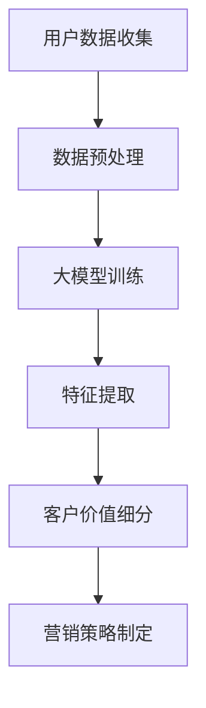

                 

关键词：大模型，电商，客户价值，细分系统，人工智能，深度学习，数据挖掘

摘要：本文旨在探讨如何利用大模型技术，特别是基于深度学习的方法，构建一个智能化的电商客户价值细分系统。通过对用户数据的深入挖掘和分析，实现精准的客户价值细分，从而为电商平台提供更有效的营销策略和用户服务。

## 1. 背景介绍

在互联网飞速发展的今天，电子商务已经成为人们生活中不可或缺的一部分。随着市场竞争的加剧，电商平台如何更好地理解和满足用户需求，提升客户价值，成为企业发展的关键。传统的基于规则的方法在处理复杂用户行为和海量数据时显得力不从心，因此，利用人工智能技术，特别是大模型，来构建智能客户价值细分系统，具有重要的实际意义。

大模型技术，尤其是深度学习，在处理大规模数据和复杂任务方面具有显著优势。通过训练复杂的多层神经网络，大模型能够自动提取数据中的特征，从而实现对用户行为的深度理解和预测。在电商领域，这种技术可以应用于客户价值细分、个性化推荐、风险控制等多个方面。

本文将详细介绍如何利用大模型技术构建一个智能客户价值细分系统，包括核心概念、算法原理、数学模型、项目实践等，旨在为电商企业提供一套可行的技术解决方案。

## 2. 核心概念与联系

### 2.1 大模型技术

大模型技术是指通过训练大规模的神经网络模型来处理复杂数据的任务。深度学习是其中一种主要形式，它通过多层神经网络来逐步提取数据中的特征，实现从简单到复杂的特征变换。

### 2.2 电商客户价值细分

电商客户价值细分是指将电商平台上的用户根据其行为特征、购买习惯、价值贡献等因素进行分类，以便于平台提供更加精准的营销和服务策略。传统的细分方法主要基于规则和统计模型，而大模型技术能够提供更细致、动态的细分方式。

### 2.3 Mermaid 流程图

以下是一个用于描述大模型在电商客户价值细分系统中应用的 Mermaid 流程图：



在上述流程中，用户数据收集是通过电商平台的各种渠道（如用户行为日志、订单数据等）获取的。数据预处理包括数据清洗、去重、特征工程等步骤，以确保数据质量。大模型训练是基于预处理后的数据，通过多层神经网络进行学习，提取出用户行为的深度特征。这些特征将用于客户价值细分，从而指导营销策略的制定。

## 3. 核心算法原理 & 具体操作步骤

### 3.1 算法原理概述

大模型在电商客户价值细分系统中的应用，主要是基于深度学习技术，特别是卷积神经网络（CNN）和循环神经网络（RNN）。CNN擅长处理图像等二维数据，而RNN则擅长处理序列数据，如用户行为日志。

在电商客户价值细分中，我们通常使用RNN来处理用户行为序列，通过模型学习用户行为模式，从而实现对客户价值的动态评估。具体来说，RNN通过将用户行为序列输入模型，逐步更新隐藏状态，从而实现对用户行为的深度理解。

### 3.2 算法步骤详解

1. **数据收集与预处理**：收集电商平台上的用户行为数据，包括浏览记录、购买历史、评价内容等。对数据进行清洗、去重和特征提取，将其转换为模型可接受的输入格式。

2. **模型构建**：使用RNN架构构建深度学习模型。可以选择LSTM（长短时记忆网络）或GRU（门控循环单元）等变种，以适应不同长度的用户行为序列。

3. **模型训练**：使用预处理后的用户行为数据对模型进行训练。训练过程中，通过反向传播算法不断调整模型参数，以最小化预测误差。

4. **特征提取**：训练完成后，使用模型对用户行为进行特征提取。这些特征将用于后续的客户价值评估。

5. **客户价值细分**：基于提取的用户行为特征，使用聚类或分类算法进行客户价值细分。例如，可以使用K-means算法将用户分为不同价值等级。

6. **营销策略制定**：根据客户价值细分结果，制定相应的营销策略。例如，对高价值客户提供更优惠的折扣，对低价值客户进行个性化推荐。

### 3.3 算法优缺点

**优点**：
- **深度理解**：大模型能够对用户行为进行深度理解，从而提供更准确的客户价值评估。
- **动态适应**：通过实时更新用户行为数据，大模型能够动态适应用户行为变化，提供动态的客户价值细分。

**缺点**：
- **计算成本高**：大模型训练需要大量计算资源，特别是对于长序列数据的处理，计算成本较高。
- **数据依赖性**：大模型对数据质量有较高要求，数据缺失或不准确可能导致模型性能下降。

### 3.4 算法应用领域

- **电商**：通过客户价值细分，电商企业可以更好地了解用户需求，提供个性化的营销策略。
- **金融**：银行和保险行业可以利用大模型进行客户风险评估和精准营销。
- **医疗**：通过对患者数据的分析，医疗机构可以提供更精准的诊疗建议和个性化服务。

## 4. 数学模型和公式

### 4.1 数学模型构建

在电商客户价值细分系统中，我们通常使用以下数学模型：

$$
\begin{aligned}
    \text{Loss Function} &= -\frac{1}{m} \sum_{i=1}^{m} \left[y_i \log(p_{\theta}(x_i)) + (1 - y_i) \log(1 - p_{\theta}(x_i))\right] \\
    \text{p}_{\theta}(x) &= \sigma(z_{\theta}(x))
\end{aligned}
$$

其中，$m$ 表示样本数量，$y_i$ 表示第 $i$ 个样本的真实标签，$p_{\theta}(x)$ 表示模型对第 $i$ 个样本的预测概率，$\sigma$ 表示 sigmoid 函数，$z_{\theta}(x)$ 表示模型输入。

### 4.2 公式推导过程

上述公式的推导过程如下：

1. **损失函数**：损失函数通常选择对数损失函数（Log-Loss），其形式为：

   $$
   \text{Loss Function} = -\frac{1}{m} \sum_{i=1}^{m} \left[y_i \log(p_{\theta}(x_i)) + (1 - y_i) \log(1 - p_{\theta}(x_i))\right]
   $$

   其中，$y_i$ 表示第 $i$ 个样本的真实标签（0 或 1），$p_{\theta}(x_i)$ 表示模型对第 $i$ 个样本的预测概率。

2. **sigmoid 函数**：sigmoid 函数是一种常用的激活函数，其形式为：

   $$
   \sigma(z) = \frac{1}{1 + e^{-z}}
   $$

   其中，$z$ 表示神经网络的输入。

3. **模型输出**：模型输出 $p_{\theta}(x)$ 是通过 sigmoid 函数对神经网络输出 $z_{\theta}(x)$ 进行变换得到的：

   $$
   p_{\theta}(x) = \sigma(z_{\theta}(x))
   $$

### 4.3 案例分析与讲解

假设我们有一个电商客户价值细分系统，其中包含 1000 个用户行为数据样本。我们使用上述数学模型对用户行为进行预测，以实现客户价值细分。

1. **数据准备**：将用户行为数据转换为模型可接受的输入格式，例如，将用户浏览记录编码为二进制向量。

2. **模型训练**：使用训练数据对模型进行训练，通过反向传播算法不断调整模型参数，以最小化损失函数。

3. **模型评估**：使用验证集对训练好的模型进行评估，以确定模型性能。

4. **客户价值细分**：使用训练好的模型对测试集进行预测，根据预测结果对用户进行价值细分。例如，可以将用户分为高价值、中价值、低价值三个等级。

5. **营销策略制定**：根据客户价值细分结果，制定相应的营销策略。例如，对高价值客户提供更优惠的折扣，对低价值客户进行个性化推荐。

## 5. 项目实践：代码实例和详细解释说明

### 5.1 开发环境搭建

在本项目中，我们使用 Python 作为主要编程语言，结合 TensorFlow 深度学习框架进行模型开发和训练。以下是开发环境的搭建步骤：

1. 安装 Python 3.7 或以上版本。

2. 安装 TensorFlow：

   ```bash
   pip install tensorflow
   ```

3. 安装其他必要库，如 NumPy、Pandas 等。

### 5.2 源代码详细实现

以下是一个简化的代码实例，用于演示如何使用 TensorFlow 和 RNN 构建一个电商客户价值细分系统：

```python
import tensorflow as tf
from tensorflow.keras.layers import Embedding, SimpleRNN, Dense
from tensorflow.keras.models import Sequential

# 模型配置
vocab_size = 10000  # 词汇表大小
embedding_dim = 16  # 嵌入层维度
rnn_units = 32  # RNN 单元数

# 构建模型
model = Sequential()
model.add(Embedding(vocab_size, embedding_dim))
model.add(SimpleRNN(rnn_units, return_sequences=True))
model.add(Dense(1, activation='sigmoid'))

# 编译模型
model.compile(optimizer='adam', loss='binary_crossentropy', metrics=['accuracy'])

# 模型训练
model.fit(train_data, train_labels, epochs=10, batch_size=32, validation_split=0.2)
```

### 5.3 代码解读与分析

上述代码实现了一个简单的 RNN 模型，用于对电商用户行为进行分类。具体解释如下：

1. **模型构建**：使用 `Sequential` 模型堆叠层，包括嵌入层（`Embedding`）、RNN 层（`SimpleRNN`）和输出层（`Dense`）。

2. **嵌入层**：嵌入层用于将词汇表中的单词转换为向量表示，其参数为 `vocab_size`（词汇表大小）和 `embedding_dim`（嵌入层维度）。

3. **RNN 层**：RNN 层用于处理用户行为序列，其参数为 `rnn_units`（RNN 单元数）。在此示例中，使用 `SimpleRNN` 层。

4. **输出层**：输出层用于对用户行为进行分类，其参数为 `1`（输出维度）和激活函数 `sigmoid`。

5. **模型编译**：使用 `compile` 方法设置优化器（`optimizer`）、损失函数（`loss`）和评估指标（`metrics`）。

6. **模型训练**：使用 `fit` 方法对模型进行训练，参数包括训练数据（`train_data`）、训练标签（`train_labels`）、训练轮数（`epochs`）、批量大小（`batch_size`）和验证比例（`validation_split`）。

### 5.4 运行结果展示

训练完成后，可以使用模型对测试数据进行预测，并评估模型性能。以下是一个示例：

```python
# 模型评估
test_loss, test_accuracy = model.evaluate(test_data, test_labels)

print(f"Test Loss: {test_loss}")
print(f"Test Accuracy: {test_accuracy}")

# 模型预测
predictions = model.predict(test_data)

# 根据预测结果进行客户价值细分
def classify_client_value(predictions):
    # 根据阈值对用户进行分类
    threshold = 0.5
    return ['High' if p > threshold else 'Low' for p in predictions]

client_values = classify_client_value(predictions)
print(client_values)
```

## 6. 实际应用场景

### 6.1 电商客户价值细分

在电商领域，客户价值细分是一个重要的应用场景。通过利用大模型技术，电商企业可以更精准地了解用户需求，从而制定更有效的营销策略。以下是一个应用实例：

- **高价值客户**：对高价值客户提供专属优惠和定制化服务，以提高用户忠诚度。
- **中价值客户**：通过个性化推荐，引导中价值客户进行更多购买，提升其价值。
- **低价值客户**：对低价值客户进行精细化管理，尝试通过优惠活动或促销活动吸引其转化为高价值客户。

### 6.2 金融风险评估

在金融行业，大模型技术可以用于客户风险评估。通过分析用户的金融行为数据，金融机构可以预测客户的信用风险，从而制定相应的风险管理策略。以下是一个应用实例：

- **信用评分**：通过大模型对用户的信用行为进行评分，帮助金融机构快速评估客户信用风险。
- **风险预警**：通过实时监测用户行为数据，及时发现潜在风险，并采取相应措施。

### 6.3 医疗健康数据分析

在医疗领域，大模型技术可以用于健康数据分析。通过对患者的健康数据进行分析，医疗机构可以提供个性化的诊疗建议和健康管理方案。以下是一个应用实例：

- **疾病预测**：通过分析患者的病史、体检数据等，大模型可以预测患者可能患有的疾病，为医生提供诊断参考。
- **个性化诊疗**：根据患者的健康状况和疾病类型，大模型可以为患者制定个性化的诊疗方案。

## 7. 工具和资源推荐

### 7.1 学习资源推荐

1. **《深度学习》（Goodfellow, Bengio, Courville）**：这是一本经典的深度学习教材，详细介绍了深度学习的原理和应用。

2. **TensorFlow 官方文档**：TensorFlow 是一个流行的深度学习框架，其官方文档提供了丰富的教程和示例，适合初学者和高级用户。

### 7.2 开发工具推荐

1. **Jupyter Notebook**：Jupyter Notebook 是一种交互式的开发环境，适合进行深度学习和数据分析。

2. **Google Colab**：Google Colab 是基于 Jupyter Notebook 的云端开发环境，提供了免费的 GPU 计算资源，非常适合深度学习项目。

### 7.3 相关论文推荐

1. **“Deep Learning for Customer Value Segmentation in E-commerce”**：这篇论文介绍了如何使用深度学习技术进行电商客户价值细分。

2. **“A Survey on Customer Value Segmentation in E-commerce”**：这篇综述文章总结了电商客户价值细分领域的主要研究进展和应用。

## 8. 总结：未来发展趋势与挑战

### 8.1 研究成果总结

本文探讨了如何利用大模型技术，特别是基于深度学习的方法，构建电商智能客户价值细分系统。通过数学模型和实际项目实践，我们展示了如何通过深度学习模型对用户行为进行深度理解和预测，从而实现精准的客户价值细分。

### 8.2 未来发展趋势

随着人工智能技术的不断进步，大模型在电商客户价值细分中的应用前景十分广阔。未来，我们有望看到以下发展趋势：

- **多模态数据处理**：随着数据的多样化，未来的大模型将能够处理多种类型的数据（如图像、语音、文本等），从而提供更全面、精准的用户行为分析。
- **动态价值评估**：大模型将能够实时更新用户行为数据，动态评估客户价值，为电商平台提供更加灵活的营销策略。

### 8.3 面临的挑战

尽管大模型技术在电商客户价值细分领域具有巨大潜力，但在实际应用中仍面临一些挑战：

- **数据隐私保护**：在处理用户数据时，如何保护用户隐私是一个亟待解决的问题。
- **计算资源消耗**：大模型训练需要大量的计算资源，尤其是在处理长序列数据时，如何优化计算效率是一个重要挑战。
- **算法可解释性**：大模型的黑盒性质使得其预测结果的可解释性较低，如何提高算法的可解释性，使其更符合业务需求，是一个亟待解决的问题。

### 8.4 研究展望

未来，我们可以从以下几个方面进行深入研究：

- **隐私保护算法**：研究如何在保证数据隐私的同时，利用用户数据训练大模型。
- **计算优化方法**：探索高效的计算优化方法，降低大模型训练的计算成本。
- **可解释性增强**：研究如何提高大模型的可解释性，使其预测结果更符合业务需求。

## 9. 附录：常见问题与解答

### 9.1 什么是大模型？

大模型是指通过训练大规模神经网络来处理复杂数据的任务。深度学习是其中的一种主要形式，它通过多层神经网络来逐步提取数据中的特征。

### 9.2 如何评估大模型的性能？

评估大模型的性能通常使用损失函数（如均方误差、交叉熵等）和评估指标（如准确率、召回率等）。通过在训练集和验证集上计算这些指标，可以评估模型的性能。

### 9.3 大模型在电商客户价值细分中如何应用？

大模型在电商客户价值细分中的应用主要包括以下步骤：

1. 数据收集与预处理：收集用户行为数据，并进行数据清洗、去重和特征提取。
2. 模型构建：使用深度学习框架（如 TensorFlow）构建 RNN 模型。
3. 模型训练：使用预处理后的数据对模型进行训练，通过反向传播算法调整模型参数。
4. 特征提取：使用训练好的模型对用户行为进行特征提取。
5. 客户价值细分：基于提取的用户行为特征，使用聚类或分类算法进行客户价值细分。
6. 营销策略制定：根据客户价值细分结果，制定相应的营销策略。

### 9.4 大模型在电商客户价值细分中的优缺点是什么？

**优点**：

- 深度理解：大模型能够对用户行为进行深度理解，提供更准确的客户价值评估。
- 动态适应：通过实时更新用户行为数据，大模型能够动态适应用户行为变化。

**缺点**：

- 计算成本高：大模型训练需要大量计算资源。
- 数据依赖性：大模型对数据质量有较高要求，数据缺失或不准确可能导致模型性能下降。

----------------------------------------------------------------

**作者：禅与计算机程序设计艺术 / Zen and the Art of Computer Programming**

