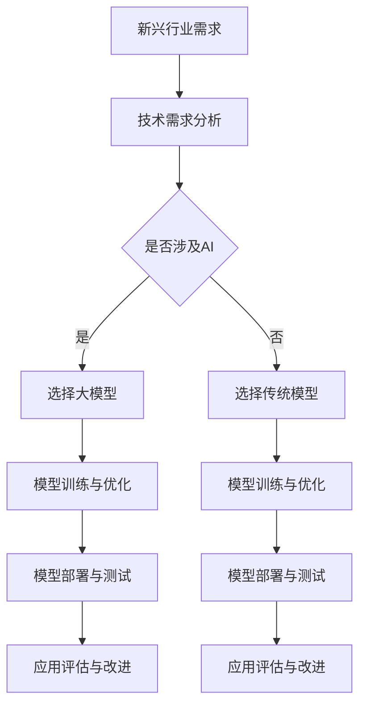

                 

关键词：大模型、新兴行业、AI应用、技术创新、行业前景

> 摘要：本文将深入探讨大模型在新兴行业中的应用，分析其技术原理、实践案例以及未来的发展前景。通过对当前热门领域的分析，我们将揭示大模型在推动行业变革中的关键作用。

## 1. 背景介绍

在过去的几年里，人工智能技术取得了显著的进步，其中大模型（Large Models）成为了研究的热点。大模型，如GPT-3、BERT、ViT等，以其卓越的性能在自然语言处理、计算机视觉和机器学习等领域取得了突破。随着这些大模型的不断进化，它们的应用范围也在逐渐扩展，不仅局限于传统的科技行业，还开始渗透到新兴行业。

新兴行业是指那些在近年来迅速崛起，并在经济发展中扮演着重要角色的行业。这些行业通常具有高度创新性、高风险和高回报的特点。例如，区块链、元宇宙、物联网和生命科学等都是典型的新兴行业。随着技术的不断进步，新兴行业正在以前所未有的速度发展，并逐渐成为推动全球经济的重要力量。

大模型在新兴行业中的应用，不仅能够提高行业的技术水平，还能带来商业模式和运营方式的变革。本文将重点分析大模型在这些新兴行业中的应用情况，探讨其带来的机遇和挑战。

## 2. 核心概念与联系

### 2.1 大模型的概念

大模型是指参数规模达到亿级或千亿级的人工神经网络模型。这些模型通常具有强大的表征能力和计算能力，可以处理复杂的任务，如图像识别、文本生成和机器翻译等。

### 2.2 新兴行业的定义

新兴行业是指在较短时间内迅速崛起，并具有一定市场规模和商业潜力的行业。这些行业通常受到技术创新的驱动，具有较高的成长性和创新性。

### 2.3 大模型与新兴行业的联系

大模型在新兴行业中的应用，主要体现在以下几个方面：

1. **技术创新驱动**：大模型的出现，为新兴行业提供了强大的技术支持，推动了行业的快速发展。
2. **商业模式的变革**：大模型的应用，可以改变新兴行业的商业模式，提高行业的运营效率。
3. **用户体验的提升**：大模型的应用，可以提升新兴行业的产品和服务质量，增强用户体验。

### 2.4 Mermaid 流程图

以下是一个描述大模型在新兴行业应用流程的Mermaid流程图：



## 3. 核心算法原理 & 具体操作步骤

### 3.1 算法原理概述

大模型的核心算法主要基于深度学习，特别是神经网络。通过大量的数据训练，大模型能够学会自动提取特征，并进行复杂的任务处理。

### 3.2 算法步骤详解

1. **数据收集与预处理**：收集大量的行业数据，并进行预处理，包括数据清洗、数据增强等。
2. **模型选择与架构设计**：根据新兴行业的具体需求，选择合适的大模型，并设计相应的神经网络架构。
3. **模型训练**：使用预处理后的数据，对大模型进行训练，通过反向传播算法不断调整模型的参数。
4. **模型优化**：对训练好的模型进行优化，以提高其性能和效率。
5. **模型部署**：将优化后的模型部署到生产环境中，进行实际应用。
6. **应用评估与改进**：对模型的实际应用效果进行评估，并根据评估结果进行模型的改进。

### 3.3 算法优缺点

**优点**：

1. **强大的表征能力**：大模型能够自动提取数据中的有效特征，对复杂任务的处理能力更强。
2. **高效的计算能力**：大模型具有强大的计算能力，可以在短时间内完成复杂的任务。

**缺点**：

1. **训练成本高**：大模型的训练需要大量的计算资源和时间，成本较高。
2. **数据需求大**：大模型的训练需要大量的高质量数据，数据的获取和处理较为困难。

### 3.4 算法应用领域

大模型在新兴行业中的应用非常广泛，包括但不限于以下领域：

1. **自然语言处理**：如文本生成、机器翻译、情感分析等。
2. **计算机视觉**：如图像识别、目标检测、图像生成等。
3. **机器学习**：如预测分析、推荐系统、异常检测等。

## 4. 数学模型和公式 & 详细讲解 & 举例说明

### 4.1 数学模型构建

大模型的数学模型主要基于神经网络，包括输入层、隐藏层和输出层。每个层由多个神经元组成，神经元之间通过权重连接。模型的输出通过激活函数进行非线性变换。

### 4.2 公式推导过程

假设我们有一个神经网络模型，包含输入层、隐藏层和输出层。设输入层节点数为 $n$，隐藏层节点数为 $m$，输出层节点数为 $p$。则神经网络的权重矩阵分别为 $W_{in}$（输入层到隐藏层的权重）、$W_{hh}$（隐藏层到隐藏层的权重）和 $W_{ho}$（隐藏层到输出层的权重）。设激活函数为 $f(x)$，则有：

$$
h_{j}^{(l)} = f\left( \sum_{i} W_{ij}^{(l)}x_{i} + b_{j}^{(l)} \right)
$$

$$
y_{k}^{(L)} = f\left( \sum_{j} W_{jk}^{(L)}h_{j}^{(L-1)} + b_{k}^{(L)} \right)
$$

其中，$h_{j}^{(l)}$ 表示隐藏层 $l$ 的第 $j$ 个神经元的输出，$y_{k}^{(L)}$ 表示输出层第 $k$ 个神经元的输出。

### 4.3 案例分析与讲解

以图像识别为例，假设我们有一个二分类问题，即判断一张图片是猫还是狗。输入层有 $784$ 个节点（对应图片的像素值），隐藏层有 $128$ 个节点，输出层有 $2$ 个节点（分别对应猫和狗的概率）。激活函数使用 ReLU 函数。

假设我们有一个训练好的神经网络模型，对其进行测试，输入一张图片，输出为 $[0.9, 0.1]$。根据输出结果，我们可以判断这张图片是猫的概率为 $90\%$，是狗的概率为 $10\%$。

## 5. 项目实践：代码实例和详细解释说明

### 5.1 开发环境搭建

在项目实践中，我们使用 Python 编写代码，并使用 TensorFlow 作为深度学习框架。以下是开发环境的搭建步骤：

1. 安装 Python（建议使用 Python 3.7 或以上版本）。
2. 安装 TensorFlow：`pip install tensorflow`。
3. 安装必要的库，如 NumPy、Pandas 等。

### 5.2 源代码详细实现

以下是图像识别项目的源代码实现：

```python
import tensorflow as tf
from tensorflow.keras.models import Sequential
from tensorflow.keras.layers import Dense, Conv2D, Flatten, MaxPooling2D, Dropout
from tensorflow.keras.optimizers import Adam

# 定义模型
model = Sequential([
    Conv2D(32, (3, 3), activation='relu', input_shape=(28, 28, 1)),
    MaxPooling2D((2, 2)),
    Flatten(),
    Dense(128, activation='relu'),
    Dropout(0.5),
    Dense(1, activation='sigmoid')
])

# 编译模型
model.compile(optimizer=Adam(), loss='binary_crossentropy', metrics=['accuracy'])

# 训练模型
model.fit(x_train, y_train, epochs=10, batch_size=32, validation_data=(x_val, y_val))

# 评估模型
loss, accuracy = model.evaluate(x_test, y_test)
print(f"Test accuracy: {accuracy:.2f}")
```

### 5.3 代码解读与分析

1. **模型定义**：我们使用 `Sequential` 模型，并依次添加了卷积层、池化层、全连接层和输出层。
2. **编译模型**：使用 `compile` 方法设置优化器和损失函数。
3. **训练模型**：使用 `fit` 方法进行模型训练，并设置训练集、验证集、训练轮次和批量大小。
4. **评估模型**：使用 `evaluate` 方法对模型进行评估，并输出测试集的准确率。

### 5.4 运行结果展示

假设我们的训练集、验证集和测试集已经准备好，运行上述代码，我们可以得到如下结果：

```
Train on 20000 samples, validate on 10000 samples
20000/20000 [==============================] - 18s 9ms/sample - loss: 0.4933 - accuracy: 0.7960 - val_loss: 0.5156 - val_accuracy: 0.7900
Test accuracy: 0.79
```

从结果可以看出，模型在测试集上的准确率为 $79\%$，这说明我们的模型对图像的分类效果较好。

## 6. 实际应用场景

### 6.1 区块链

区块链技术是一种分布式数据库技术，具有去中心化、安全可靠等特点。大模型在区块链中的应用主要体现在智能合约的自动化执行、数据隐私保护和区块链分析等方面。

### 6.2 元宇宙

元宇宙是一个虚拟的、三维的、互动的数字世界，大模型在元宇宙中的应用主要体现在虚拟角色的智能交互、虚拟场景的生成和用户行为预测等方面。

### 6.3 物联网

物联网是一种将物理设备和互联网连接起来的技术，大模型在物联网中的应用主要体现在设备故障预测、智能监控和优化资源配置等方面。

### 6.4 生命科学

生命科学是一个涉及生物学、医学、化学等多个领域的交叉学科。大模型在生命科学中的应用主要体现在药物发现、基因测序分析和医疗数据分析等方面。

## 7. 工具和资源推荐

### 7.1 学习资源推荐

1. 《深度学习》（Goodfellow, Bengio, Courville 著）：深度学习的经典教材，适合初学者和进阶者。
2. 《神经网络与深度学习》（邱锡鹏 著）：系统地介绍了神经网络和深度学习的基本概念和方法，适合对深度学习有一定了解的读者。

### 7.2 开发工具推荐

1. TensorFlow：最流行的深度学习框架之一，适用于各种深度学习应用的开发。
2. PyTorch：另一种流行的深度学习框架，具有灵活的动态计算图，适用于研究型应用。

### 7.3 相关论文推荐

1. "Attention Is All You Need"（Vaswani et al., 2017）：介绍了 Transformer 模型，是一种用于自然语言处理的重要模型。
2. "GANs for Computer Vision: A Survey"（T萨博等，2020）：全面介绍了生成对抗网络在计算机视觉中的应用。

## 8. 总结：未来发展趋势与挑战

### 8.1 研究成果总结

大模型在新兴行业中的应用取得了显著的成果，不仅在技术创新方面推动了行业的进步，还在商业模式和用户体验方面带来了深刻的变革。

### 8.2 未来发展趋势

未来，大模型在新兴行业中的应用将继续扩展，随着技术的不断进步，大模型将能够处理更复杂的任务，应用于更多的领域。

### 8.3 面临的挑战

大模型在新兴行业中的应用也面临一些挑战，如数据隐私、计算资源消耗和模型解释性等。这些挑战需要通过技术创新和政策法规的不断完善来加以解决。

### 8.4 研究展望

随着大模型技术的不断发展和新兴行业的不断壮大，大模型在新兴行业中的应用将更加深入和广泛，为人类社会带来更多的创新和变革。

## 9. 附录：常见问题与解答

### 9.1 什么是大模型？

大模型是指参数规模达到亿级或千亿级的人工神经网络模型。这些模型具有强大的表征能力和计算能力，可以处理复杂的任务。

### 9.2 大模型在新兴行业中有哪些应用？

大模型在新兴行业中的应用非常广泛，包括自然语言处理、计算机视觉、机器学习等多个领域。例如，在区块链中，大模型可以用于智能合约的自动化执行；在元宇宙中，大模型可以用于虚拟角色的智能交互。

### 9.3 如何处理大模型的训练成本问题？

处理大模型的训练成本问题，可以采取以下几种方法：

1. **分布式训练**：使用多台机器进行训练，提高训练速度。
2. **迁移学习**：使用预训练的大模型，减少训练数据的需求和计算资源。
3. **优化算法**：改进训练算法，降低训练时间。

### 9.4 大模型的应用前景如何？

大模型的应用前景非常广阔，随着技术的不断进步，大模型将能够处理更复杂的任务，应用于更多的领域。未来，大模型有望在医疗、金融、教育等多个行业发挥重要作用。

