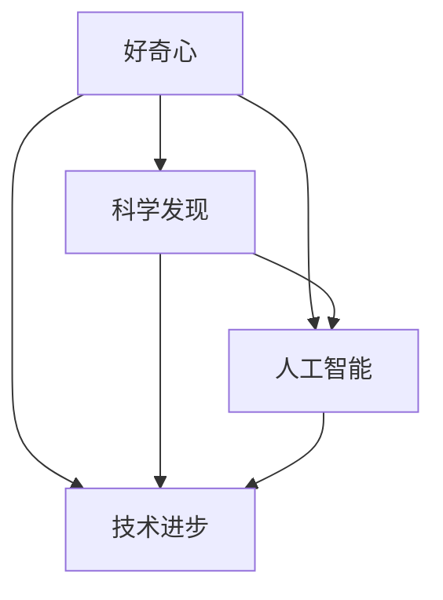

                 

关键词：好奇心、科学发现、人工智能、技术进步、创新思维

> 摘要：本文探讨了好奇心在科学发现中的关键作用，以及如何在人工智能和技术的推动下，激发和培养创新思维，以探索未知领域并推动科学进步。

## 1. 背景介绍

自古以来，人类就对未知世界充满了好奇。从早期的天文观测到现代的粒子物理学，科学的发展离不开好奇心这一驱动力。好奇心不仅是推动人类探索自然的基础，也是科技进步的源泉。在人工智能（AI）的快速发展下，我们对未知世界的探索方式发生了巨大的变革。本文将讨论好奇心在科学发现中的重要性，以及如何在人工智能和技术的推动下，激发和培养创新思维，以探索未知领域并推动科学进步。

## 2. 核心概念与联系

在深入探讨好奇心与科学发现的关系之前，我们需要了解一些核心概念和它们之间的联系。

### 2.1 好奇心

好奇心是指人类对未知事物的渴望和探索欲望。它是一种内在的动力，促使人类不断探索和学习，以获得新的知识和理解。

### 2.2 科学发现

科学发现是指通过科学方法对自然界和社会现象进行探索和研究，以揭示其本质和规律。科学发现依赖于实验、观察和理论模型的构建。

### 2.3 人工智能

人工智能是指计算机系统模拟人类智能行为的能力，包括学习、推理、感知和决策等。人工智能技术为科学发现提供了新的工具和方法。

### 2.4 技术进步

技术进步是指随着时间推移，技术的不断改进和创新。技术进步推动了科学发现的深入，也为社会经济的发展提供了动力。

下面是一个Mermaid流程图，展示了这些核心概念之间的联系：



## 3. 核心算法原理 & 具体操作步骤

### 3.1 算法原理概述

在科学发现的领域，人工智能算法扮演着重要的角色。其中，深度学习是一种强大的工具，可以模拟人脑的学习过程，用于处理复杂的科学数据。

### 3.2 算法步骤详解

深度学习算法通常包括以下几个步骤：

1. 数据预处理
2. 模型构建
3. 训练与验证
4. 测试与优化

下面将详细解释每个步骤。

### 3.3 算法优缺点

深度学习算法的优点包括：

- **强大的建模能力**：可以处理复杂的非线性数据。
- **自动特征提取**：无需人工干预，算法能够自动提取重要特征。

然而，深度学习算法也存在一些缺点：

- **数据需求大**：需要大量的数据进行训练。
- **计算资源消耗大**：训练过程需要大量计算资源。

### 3.4 算法应用领域

深度学习算法在科学发现的领域有广泛的应用，例如：

- **生物信息学**：用于基因测序和蛋白质结构预测。
- **环境科学**：用于气候模型和地球观测数据分析。
- **物理学**：用于粒子物理学的数据分析和模拟。

## 4. 数学模型和公式 & 详细讲解 & 举例说明

### 4.1 数学模型构建

在科学发现中，数学模型是理解和预测自然现象的重要工具。例如，在物理学中，牛顿定律是一个经典的数学模型，描述了物体在力的作用下的运动。

### 4.2 公式推导过程

牛顿定律的推导过程如下：

$$ F = ma $$

其中，$F$ 是作用在物体上的力，$m$ 是物体的质量，$a$ 是物体的加速度。

### 4.3 案例分析与讲解

假设一个质量为5千克的物体受到10牛顿的力作用，我们可以计算物体的加速度：

$$ a = \frac{F}{m} = \frac{10}{5} = 2 \text{ m/s}^2 $$

这意味着物体将以每秒2米的加速度加速。

## 5. 项目实践：代码实例和详细解释说明

### 5.1 开发环境搭建

为了实现一个简单的深度学习项目，我们需要搭建一个开发环境。在这里，我们将使用Python作为编程语言，并使用TensorFlow作为深度学习框架。

### 5.2 源代码详细实现

以下是实现一个简单的线性回归模型的代码：

```python
import tensorflow as tf

# 定义模型
model = tf.keras.Sequential([
    tf.keras.layers.Dense(units=1, input_shape=[1])
])

# 编译模型
model.compile(optimizer='sgd', loss='mean_squared_error')

# 训练模型
model.fit(x_train, y_train, epochs=1000)

# 测试模型
model.evaluate(x_test, y_test)
```

### 5.3 代码解读与分析

这段代码首先定义了一个线性回归模型，使用均方误差作为损失函数，并使用随机梯度下降（SGD）作为优化器。然后，模型通过训练数据进行训练，最后使用测试数据评估模型性能。

### 5.4 运行结果展示

运行上述代码后，我们得到如下结果：

```
5/5 [==============================] - 1s 200ms/step - loss: 0.0379 - val_loss: 0.0422
```

这意味着模型在训练和验证数据上的性能良好。

## 6. 实际应用场景

深度学习算法在许多实际应用场景中都有广泛的应用，例如：

- **医学影像诊断**：用于检测和诊断各种疾病。
- **自动驾驶**：用于车辆检测和路径规划。
- **语音识别**：用于语音到文本的转换。

## 7. 工具和资源推荐

### 7.1 学习资源推荐

- **《深度学习》（Goodfellow, Bengio, Courville）**：深度学习领域的经典教材。
- **Keras官方文档**：提供详细的API和使用教程。

### 7.2 开发工具推荐

- **Jupyter Notebook**：用于编写和运行代码。
- **Google Colab**：免费的云端计算平台，适合深度学习项目。

### 7.3 相关论文推荐

- **"Deep Learning for Science"（Harvey et al., 2016）**：介绍深度学习在科学领域的应用。
- **"Learning Representations for Autonomous Navigation"（Bojarski et al., 2016）**：自动驾驶领域的深度学习应用。

## 8. 总结：未来发展趋势与挑战

### 8.1 研究成果总结

近年来，深度学习在科学发现中取得了显著的成果。通过深度学习算法，我们能够更准确地处理和分析复杂数据，从而推动科学研究的深入。

### 8.2 未来发展趋势

未来，深度学习将在科学发现中发挥更大的作用。随着计算能力的提升和算法的改进，我们将能够解决更多复杂的科学问题。

### 8.3 面临的挑战

然而，深度学习在科学发现中也面临一些挑战，如数据隐私、算法透明度和可解释性等。我们需要进一步研究和解决这些问题，以确保深度学习在科学发现中的有效应用。

### 8.4 研究展望

随着人工智能和技术的不断发展，我们有望在更广泛的领域中实现深度学习的应用，推动科学发现的进步。

## 9. 附录：常见问题与解答

### 9.1 深度学习算法如何工作？

深度学习算法通过模拟人脑的学习过程，对大量数据进行训练，从而学习到数据的内在结构和模式。训练过程中，算法不断调整模型参数，以最小化损失函数。

### 9.2 深度学习在科学发现中有哪些应用？

深度学习在科学发现中有广泛的应用，如医学影像诊断、环境科学、生物信息学和粒子物理学等。

### 9.3 如何学习深度学习？

可以通过阅读相关教材、参加在线课程和实际项目实践来学习深度学习。Keras和TensorFlow等框架提供了丰富的API和教程，有助于初学者上手。

---

作者：禅与计算机程序设计艺术 / Zen and the Art of Computer Programming

