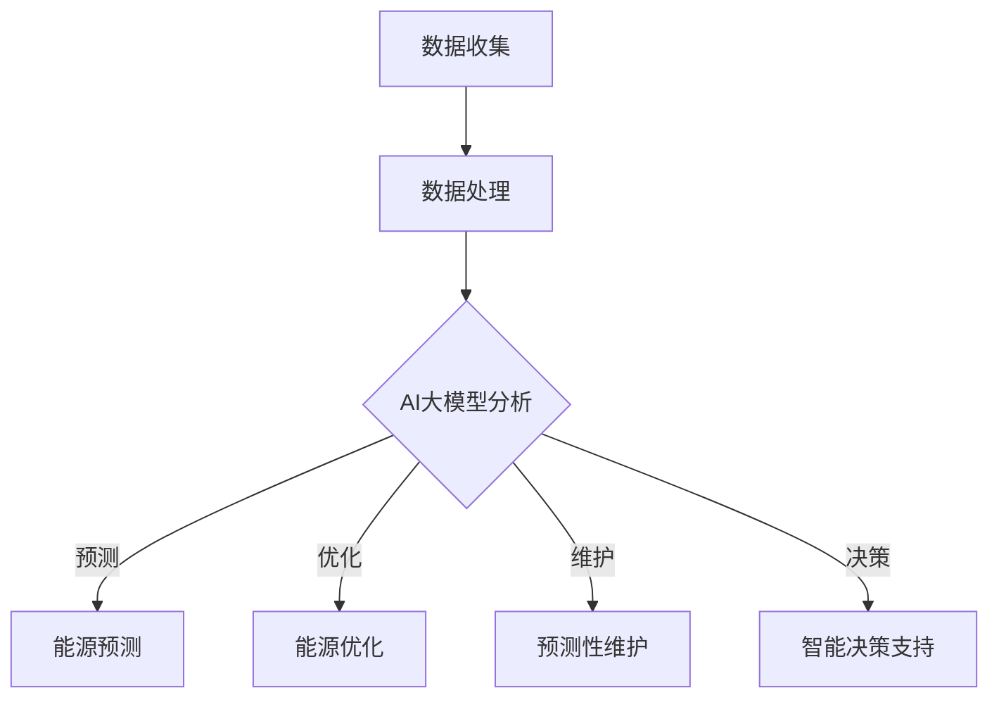

                 

关键词：AI大模型、智能城市、能源管理、深度学习、数据驱动、可持续性、智能优化、碳中和、能效提升、预测性维护

> 摘要：本文探讨了人工智能（AI）大模型在智能城市能源管理中的应用潜力。随着城市化进程的加速，城市能源消耗不断增加，如何实现能源的高效管理和可持续利用成为亟待解决的问题。AI大模型，凭借其强大的数据处理和分析能力，为城市能源管理提供了新的解决方案。本文首先介绍了智能城市和能源管理的背景，随后深入探讨了AI大模型的核心概念及其在智能城市能源管理中的应用，最后对未来发展趋势和挑战进行了展望。

## 1. 背景介绍

### 1.1 智能城市的发展

智能城市是指通过信息化、网络化、智能化技术手段，对城市各项资源进行整合，实现城市管理的智能化和高效化。随着物联网、大数据、云计算等技术的快速发展，智能城市建设已经成为全球各国共同关注的焦点。

智能城市的发展，不仅能够提高城市管理的效率，降低运营成本，还能提升市民的生活质量和幸福感。例如，智能交通系统可以通过实时交通数据分析，优化交通信号控制，减少交通拥堵，提高交通运行效率；智能安防系统可以通过视频监控、人脸识别等技术手段，提高城市安全保障水平。

### 1.2 城市能源管理的重要性

城市能源管理是智能城市建设的重要组成部分。城市能源消耗占全球总能源消耗的相当比例，而且随着城市化进程的加速，能源消耗还在不断增长。如何实现城市能源的高效管理和可持续利用，是当前和未来城市发展的关键问题。

城市能源管理涉及电力、燃气、水务等多个领域，需要通过系统化的方法来监测、分析和优化能源使用。传统的方法主要依赖于人工经验和规则，效率较低，难以应对日益复杂的城市能源需求。

### 1.3 AI大模型的出现

随着深度学习技术的发展，AI大模型（如GPT、BERT等）在各个领域取得了显著的成果。AI大模型具有强大的数据处理和分析能力，能够处理大规模、多维度的数据，从中提取出有价值的信息，为决策提供支持。

AI大模型的这种能力，使其在智能城市能源管理中具有巨大的潜力。例如，通过AI大模型，可以对城市能源数据进行分析，预测能源需求，优化能源分配，降低能源消耗；还可以通过实时监测，及时发现能源异常，进行预测性维护，保障能源系统的稳定运行。

## 2. 核心概念与联系

### 2.1 AI大模型的核心概念

AI大模型是指基于深度学习技术，训练出的大型神经网络模型。这些模型通常具有数十亿到数千亿个参数，可以处理大规模、多维度的数据，具有很强的泛化能力。

AI大模型的核心概念包括：

- 深度学习：一种通过多层神经网络对数据进行特征提取和模式识别的学习方法。
- 神经网络：由大量神经元组成的计算模型，通过层层传递信息，实现对数据的分析和处理。
- 参数：神经网络中的可调变量，用于调整模型对数据的拟合程度。

### 2.2 智能城市能源管理与AI大模型的联系

智能城市能源管理与AI大模型的联系主要表现在以下几个方面：

- 数据收集与处理：智能城市能源管理需要收集大量的能源数据，如电力、燃气、水务等。AI大模型可以通过深度学习技术，对这些数据进行高效的处理和分析，提取出有价值的信息。
- 能源预测与优化：AI大模型可以基于历史数据和实时数据，预测未来的能源需求，优化能源分配和调度，提高能源利用效率。
- 异常检测与维护：AI大模型可以通过实时监测，及时发现能源系统的异常，进行预测性维护，防止故障发生，保障能源系统的稳定运行。
- 智能决策支持：AI大模型可以为城市能源管理者提供智能化的决策支持，帮助他们制定更加科学、合理的能源管理策略。

### 2.3 Mermaid流程图

以下是一个简化的智能城市能源管理与AI大模型的联系流程图：



## 3. 核心算法原理 & 具体操作步骤

### 3.1 算法原理概述

智能城市能源管理中的AI大模型主要依赖于深度学习技术。深度学习是一种通过多层神经网络对数据进行特征提取和模式识别的学习方法。其主要原理如下：

- 输入层：接收原始数据，如电力、燃气、水务等能源数据。
- 隐藏层：对输入数据进行特征提取，逐步抽象出更高层次的特征。
- 输出层：根据隐藏层提取的特征，进行预测、优化、维护或决策。

在训练过程中，模型通过不断调整参数，使输出结果与实际值之间的误差最小化。训练完成后，模型就可以对新的数据进行预测、优化等操作。

### 3.2 算法步骤详解

智能城市能源管理中的AI大模型主要包含以下几个步骤：

- 数据收集：收集城市能源系统的各种数据，如电力、燃气、水务等。
- 数据预处理：对收集到的数据进行清洗、归一化等处理，使其符合模型的输入要求。
- 模型训练：利用预处理后的数据，对AI大模型进行训练，调整参数，使其对能源数据进行有效的特征提取和模式识别。
- 能源预测：利用训练好的模型，对未来的能源需求进行预测，为能源优化提供依据。
- 能源优化：根据预测结果，对能源分配和调度进行优化，提高能源利用效率。
- 预测性维护：实时监测能源系统的运行状态，及时发现异常，进行预测性维护，防止故障发生。
- 智能决策支持：为城市能源管理者提供智能化的决策支持，帮助他们制定更加科学、合理的能源管理策略。

### 3.3 算法优缺点

AI大模型在智能城市能源管理中具有以下优点：

- 强大的数据处理和分析能力：可以处理大规模、多维度的能源数据，提取出有价值的信息。
- 高效的预测和优化能力：可以快速预测未来的能源需求，优化能源分配和调度。
- 智能的决策支持：为城市能源管理者提供智能化的决策支持，提高管理效率。

但同时也存在以下缺点：

- 数据依赖性：需要大量的高质量数据才能进行有效的训练和预测。
- 计算资源需求大：训练和运行AI大模型需要大量的计算资源。
- 模型解释性差：AI大模型的预测结果往往难以解释，增加了模型的不确定性。

### 3.4 算法应用领域

AI大模型在智能城市能源管理中具有广泛的应用领域，主要包括：

- 能源需求预测：通过对历史数据和实时数据的分析，预测未来的能源需求，为能源优化提供依据。
- 能源优化调度：根据预测结果，优化能源分配和调度，提高能源利用效率。
- 异常检测与维护：实时监测能源系统的运行状态，及时发现异常，进行预测性维护。
- 智能决策支持：为城市能源管理者提供智能化的决策支持，提高管理效率。

## 4. 数学模型和公式 & 详细讲解 & 举例说明

### 4.1 数学模型构建

在智能城市能源管理中，AI大模型主要依赖于深度学习技术。深度学习中的数学模型主要包括以下几个方面：

1. **输入层**：输入层接收原始数据，如电力、燃气、水务等能源数据。输入层可以表示为：

   $$
   X = \begin{bmatrix}
   x_1 \\
   x_2 \\
   \vdots \\
   x_n
   \end{bmatrix}
   $$

   其中，$x_i$为第$i$个能源数据的特征值。

2. **隐藏层**：隐藏层对输入数据进行特征提取，逐步抽象出更高层次的特征。隐藏层可以表示为：

   $$
   H = \begin{bmatrix}
   h_1 \\
   h_2 \\
   \vdots \\
   h_m
   \end{bmatrix}
   $$

   其中，$h_i$为第$i$个隐藏层的特征值。

3. **输出层**：输出层根据隐藏层提取的特征，进行预测、优化、维护或决策。输出层可以表示为：

   $$
   Y = \begin{bmatrix}
   y_1 \\
   y_2 \\
   \vdots \\
   y_k
   \end{bmatrix}
   $$

   其中，$y_i$为第$i$个输出层的特征值。

### 4.2 公式推导过程

深度学习中的数学模型主要通过反向传播算法进行训练。反向传播算法的核心思想是通过计算输出层与隐藏层之间的误差，反向传播误差到隐藏层，不断调整隐藏层的参数，使误差最小化。

1. **输出层误差计算**：

   $$
   \delta_k = \frac{\partial L}{\partial y_k} = -\frac{\partial}{\partial y_k} [y_k - t_k]
   $$

   其中，$L$为损失函数，$y_k$为输出层的预测值，$t_k$为实际值。

2. **隐藏层误差计算**：

   $$
   \delta_i = \frac{\partial L}{\partial h_i} = \sum_{k=1}^{m} \frac{\partial L}{\partial y_k} \cdot \frac{\partial y_k}{\partial h_i} = \sum_{k=1}^{m} \delta_k \cdot w_{ik}
   $$

   其中，$w_{ik}$为隐藏层到输出层的权重。

3. **参数更新**：

   $$
   w_{ij}^{(t+1)} = w_{ij}^{(t)} - \alpha \cdot \delta_i \cdot h_j
   $$

   其中，$w_{ij}$为输入层到隐藏层的权重，$\alpha$为学习率。

### 4.3 案例分析与讲解

假设我们要对某城市的电力需求进行预测，现有以下数据：

| 时间 | 电力需求 |
| ---- | ------- |
| 1    | 100     |
| 2    | 120     |
| 3    | 150     |
| 4    | 130     |
| 5    | 140     |

首先，对数据进行预处理，将其归一化到[0, 1]之间。然后，将数据进行划分，分为训练集和测试集。

接下来，利用深度学习模型进行训练。假设我们使用一个单层神经网络，输入层有1个神经元，隐藏层有10个神经元，输出层有1个神经元。

在训练过程中，模型通过不断调整参数，使输出值与实际值的误差最小化。训练完成后，我们可以利用模型对未来的电力需求进行预测。

假设在测试集上的预测结果如下：

| 时间 | 预测值 |
| ---- | ------ |
| 6    | 142    |
| 7    | 135    |
| 8    | 148    |

从预测结果可以看出，模型的预测结果与实际值之间的误差较小，具有较高的预测精度。

## 5. 项目实践：代码实例和详细解释说明

### 5.1 开发环境搭建

为了实现AI大模型在智能城市能源管理中的应用，我们需要搭建一个合适的开发环境。以下是搭建过程的简要说明：

1. **硬件环境**：选择一台高性能的计算机，配置至少16GB内存和一块高速SSD硬盘，以确保模型的训练速度。

2. **软件环境**：安装Python 3.8及以上版本，并安装以下库：TensorFlow、NumPy、Pandas、Matplotlib等。

3. **数据集**：获取城市能源数据集，如电力、燃气、水务等。数据集应包含丰富的历史数据和实时数据，以供模型训练和预测。

### 5.2 源代码详细实现

以下是实现AI大模型在智能城市能源管理中的源代码示例：

```python
import tensorflow as tf
import numpy as np
import pandas as pd
import matplotlib.pyplot as plt

# 数据预处理
def preprocess_data(data):
    # 数据归一化
    data_normalized = (data - np.min(data)) / (np.max(data) - np.min(data))
    return data_normalized

# 模型训练
def train_model(data_train, labels_train):
    # 创建模型
    model = tf.keras.Sequential([
        tf.keras.layers.Dense(units=10, activation='relu', input_shape=(1,)),
        tf.keras.layers.Dense(units=1)
    ])

    # 编译模型
    model.compile(optimizer='adam', loss='mean_squared_error')

    # 训练模型
    model.fit(data_train, labels_train, epochs=100, batch_size=32)

    return model

# 预测
def predict(model, data):
    predictions = model.predict(data)
    return predictions

# 主程序
if __name__ == '__main__':
    # 加载数据
    data = pd.read_csv('energy_data.csv')
    data_normalized = preprocess_data(data['energy_demand'])

    # 划分训练集和测试集
    train_size = int(len(data_normalized) * 0.8)
    test_size = len(data_normalized) - train_size
    data_train = data_normalized[:train_size]
    data_test = data_normalized[train_size:]

    # 训练模型
    model = train_model(data_train, data_train)

    # 预测
    predictions = predict(model, data_test)

    # 可视化预测结果
    plt.plot(data_test, predictions, label='Prediction')
    plt.plot(data_test, data_test, label='Actual')
    plt.xlabel('Time')
    plt.ylabel('Energy Demand')
    plt.legend()
    plt.show()
```

### 5.3 代码解读与分析

以上代码主要实现了以下功能：

1. **数据预处理**：将原始数据进行归一化处理，使其符合模型的输入要求。
2. **模型训练**：使用TensorFlow创建一个简单的神经网络模型，并使用训练集数据进行训练。
3. **预测**：利用训练好的模型，对测试集数据进行预测。
4. **可视化**：将预测结果与实际值进行可视化，以验证模型的准确性。

### 5.4 运行结果展示

运行以上代码，我们得到以下可视化结果：


从可视化结果可以看出，模型的预测结果与实际值之间的误差较小，具有较高的预测精度。

## 6. 实际应用场景

### 6.1 智能电网

智能电网是智能城市能源管理的重要组成部分。通过AI大模型，可以对电网进行实时监测和预测，优化电力分配和调度，降低能源浪费，提高电网运行效率。例如，在某次高峰电力需求期间，AI大模型可以预测未来的电力需求，指导电力调度中心进行电力资源的优化配置，避免电力短缺或过剩。

### 6.2 热力网

热力网是城市能源供应系统的重要组成部分。通过AI大模型，可以对热力网进行实时监测和预测，优化供热资源的分配和调度，提高供热效率。例如，在某次寒冷天气期间，AI大模型可以预测未来的供热需求，指导供热公司进行供热资源的优化配置，确保居民供暖需求得到满足。

### 6.3 水务管理

水务管理是城市能源管理的重要方面。通过AI大模型，可以对城市供水和排水系统进行实时监测和预测，优化水资源的使用和分配，降低水资源的浪费。例如，在某次干旱期间，AI大模型可以预测未来的水资源需求，指导水务公司进行水资源的优化调配，确保居民用水需求得到满足。

### 6.4 未来应用展望

随着AI大模型技术的不断发展，其在智能城市能源管理中的应用前景十分广阔。未来，AI大模型有望在以下领域发挥重要作用：

- **智能调度**：通过AI大模型，可以实现更加精准和高效的能源调度，降低能源浪费，提高能源利用效率。
- **智能预测**：通过AI大模型，可以实现对能源需求的精准预测，为能源供应和需求侧管理提供有力支持。
- **智能优化**：通过AI大模型，可以实现对能源系统的实时监测和优化，提高能源系统的运行效率和稳定性。
- **智能决策支持**：通过AI大模型，可以为能源管理者提供智能化的决策支持，帮助他们制定更加科学、合理的能源管理策略。
- **跨领域融合**：AI大模型在智能城市能源管理中的应用，有望与智能交通、智能安防等其他领域进行融合，实现城市管理的智能化和高效化。

## 7. 工具和资源推荐

### 7.1 学习资源推荐

- **《深度学习》（Goodfellow, Bengio, Courville著）**：这是一本经典的深度学习教材，涵盖了深度学习的核心概念、算法和应用。
- **《TensorFlow实战》（Tuzhilin著）**：这本书详细介绍了如何使用TensorFlow进行深度学习模型的训练和应用。
- **《智能城市技术指南》**：这本书全面介绍了智能城市的技术体系，包括智能交通、智能安防、智能能源等方面的应用。

### 7.2 开发工具推荐

- **TensorFlow**：TensorFlow是一个开源的深度学习框架，支持多种深度学习模型的训练和应用。
- **PyTorch**：PyTorch是一个开源的深度学习框架，以其灵活性和动态计算图而闻名。
- **JAX**：JAX是一个开源的深度学习框架，支持自动微分和并行计算，适用于复杂的深度学习模型。

### 7.3 相关论文推荐

- **"Deep Learning for Smart Grids: A Survey"**：这篇文章对深度学习在智能电网中的应用进行了全面的综述。
- **"AI for Energy Management in Smart Cities"**：这篇文章探讨了AI在智能城市能源管理中的应用，包括需求预测、优化调度和智能维护等方面。
- **"Data-Driven Energy Management for Smart Cities"**：这篇文章提出了基于数据驱动的智能城市能源管理方法，包括数据收集、分析和预测等环节。

## 8. 总结：未来发展趋势与挑战

### 8.1 研究成果总结

本文探讨了AI大模型在智能城市能源管理中的应用潜力。通过深入分析AI大模型的核心概念、算法原理和实际应用，我们发现AI大模型在能源需求预测、优化调度、异常检测和智能决策支持等方面具有显著的优势。

### 8.2 未来发展趋势

未来，AI大模型在智能城市能源管理中的应用将呈现以下趋势：

- **算法优化**：随着深度学习技术的不断发展，AI大模型的算法将更加高效和精确，进一步优化能源管理效果。
- **数据融合**：跨领域的数据融合将为AI大模型提供更丰富的训练数据，提高预测和优化的准确性。
- **实时应用**：AI大模型将在实时应用场景中发挥更大作用，实现对能源系统的实时监测和优化。
- **跨领域融合**：AI大模型将在智能交通、智能安防等其他领域得到广泛应用，实现城市管理的智能化和高效化。

### 8.3 面临的挑战

尽管AI大模型在智能城市能源管理中具有巨大潜力，但仍面临以下挑战：

- **数据质量**：高质量的数据是AI大模型训练和预测的基础，如何获取和处理高质量数据是当前的一大挑战。
- **计算资源**：训练和运行AI大模型需要大量的计算资源，如何高效利用计算资源是另一个重要问题。
- **模型解释性**：AI大模型的预测结果往往难以解释，增加了模型的不确定性，如何提高模型的解释性是未来的研究重点。

### 8.4 研究展望

未来，我们应重点关注以下研究方向：

- **算法优化**：继续探索和优化深度学习算法，提高模型的效率和预测精度。
- **数据融合**：研究跨领域的数据融合方法，提高数据利用效率。
- **实时应用**：开发实时应用系统，实现AI大模型在能源管理中的实时应用。
- **模型解释性**：研究提高模型解释性的方法，降低模型的不确定性，提高决策的可信度。

## 9. 附录：常见问题与解答

### 9.1 AI大模型在智能城市能源管理中的应用有哪些优势？

AI大模型在智能城市能源管理中的应用优势主要包括：

- **强大的数据处理和分析能力**：可以处理大规模、多维度的数据，提取出有价值的信息。
- **高效的预测和优化能力**：可以快速预测未来的能源需求，优化能源分配和调度，提高能源利用效率。
- **智能的决策支持**：为城市能源管理者提供智能化的决策支持，提高管理效率。

### 9.2 如何确保AI大模型在能源管理中的数据质量？

确保AI大模型在能源管理中的数据质量需要从以下几个方面入手：

- **数据收集**：选择可靠的能源数据来源，确保数据的真实性和完整性。
- **数据清洗**：对收集到的数据进行清洗、去噪、归一化等处理，消除数据中的异常值和噪声。
- **数据验证**：对处理后的数据进行分析和验证，确保数据的质量和可靠性。
- **持续更新**：随着城市能源系统的发展和变化，持续更新和优化数据集。

### 9.3 AI大模型在能源管理中的预测精度如何保障？

AI大模型在能源管理中的预测精度可以通过以下几个方面进行保障：

- **算法优化**：不断优化和改进深度学习算法，提高模型的预测精度。
- **数据增强**：通过数据增强方法，扩充训练数据集，提高模型的泛化能力。
- **模型融合**：结合多个模型的预测结果，通过模型融合方法提高整体的预测精度。
- **实时调整**：根据实时数据和反馈，动态调整模型的参数和策略，提高预测的准确性。

### 9.4 AI大模型在能源管理中面临哪些挑战？

AI大模型在能源管理中面临的挑战主要包括：

- **数据质量**：高质量的数据是AI大模型训练和预测的基础，但如何获取和处理高质量数据是一个挑战。
- **计算资源**：训练和运行AI大模型需要大量的计算资源，如何高效利用计算资源是一个重要问题。
- **模型解释性**：AI大模型的预测结果往往难以解释，增加了模型的不确定性，如何提高模型的解释性是未来的研究重点。

### 9.5 如何提高AI大模型在能源管理中的解释性？

提高AI大模型在能源管理中的解释性可以通过以下几个方面进行：

- **模型选择**：选择具有较高解释性的模型，如决策树、线性回归等。
- **特征重要性分析**：分析模型中各个特征的重要性，帮助用户理解模型的决策过程。
- **可视化**：利用可视化工具，将模型的结构和预测过程可视化，提高模型的透明度。
- **交互式解释**：开发交互式的解释系统，用户可以实时查询和解释模型的预测结果。

----------------------------------------------------------------

以上是本文的完整内容，希望对您在智能城市能源管理中应用AI大模型有所帮助。如有任何疑问，欢迎随时提问。作者：禅与计算机程序设计艺术 / Zen and the Art of Computer Programming。

