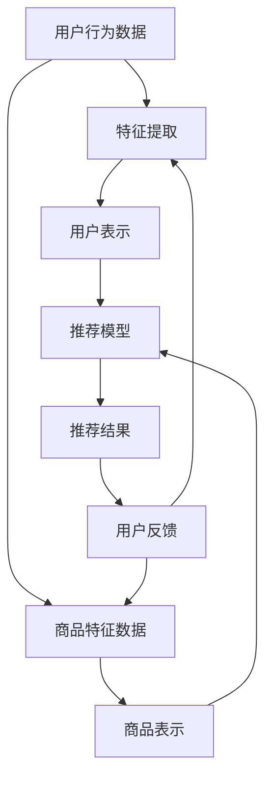

                 

关键词：大模型、电商平台、商品推荐、多样性控制、算法原理、数学模型、实践案例

> 摘要：本文旨在探讨大模型在电商平台商品推荐多样性控制中的作用。首先，我们将介绍电商平台商品推荐系统面临的多样性挑战，然后深入分析大模型在这一领域的应用及其有效性。随后，我们将探讨大模型在多样性控制中的核心算法原理、数学模型，并通过实际项目实践来展示其应用效果。最后，我们将展望大模型在未来电商平台商品推荐多样性控制中的发展前景与面临的挑战。

## 1. 背景介绍

随着互联网的普及和电子商务的快速发展，电商平台已经成为消费者购买商品的主要渠道之一。商品推荐系统作为电商平台的核心理功能之一，旨在为用户提供个性化、高相关性的商品推荐，从而提高用户满意度和平台销售额。然而，在推荐系统中实现多样性的挑战日益凸显，成为当前研究的热点问题之一。

### 1.1 电商平台商品推荐系统的多样性挑战

电商平台商品推荐系统主要面临以下多样性挑战：

- **个性化推荐**：用户需求多样，如何针对不同用户进行个性化推荐？
- **商品多样性**：如何在有限的商品池中，保证推荐结果的多样性？
- **品牌和类别**：如何平衡品牌和类别间的推荐，避免单一品牌或类别的过度推荐？
- **重复推荐**：如何避免重复推荐，提升用户体验？

### 1.2 大模型在电商平台商品推荐中的优势

大模型，如深度学习模型，具有以下优势，使其在电商平台商品推荐多样性控制中具有显著的应用潜力：

- **高精度**：通过大规模数据训练，大模型能够准确捕捉用户行为和商品特征，提高推荐准确性。
- **泛化能力**：大模型能够处理复杂的数据关系和场景变化，具备较强的泛化能力。
- **自动化**：大模型能够自动化地生成推荐结果，减少人工干预，提高推荐效率。

## 2. 核心概念与联系

### 2.1 大模型定义

大模型通常指的是参数数量巨大的神经网络模型，如深度神经网络（DNN）、变换器模型（Transformer）等。这些模型通过在大规模数据集上训练，能够自动学习到数据的复杂模式，从而实现高度准确的预测和生成。

### 2.2 大模型在电商平台商品推荐中的应用

大模型在电商平台商品推荐中的应用主要包括以下几个方面：

- **用户行为分析**：通过分析用户的浏览、购买、评价等行为，大模型能够准确捕捉用户的兴趣和偏好。
- **商品特征提取**：大模型能够从商品描述、标签、属性中提取出关键特征，从而实现商品的高效表示。
- **推荐生成**：基于用户和商品的特征，大模型能够生成个性化的商品推荐列表。

### 2.3 大模型与多样性控制

大模型在多样性控制中的应用主要体现在以下几个方面：

- **用户个性化**：通过深度学习模型对用户行为的分析，实现个性化推荐，避免单一化推荐。
- **商品多样性**：通过多模态特征提取和复杂关系学习，保证推荐结果的多样性。
- **品牌和类别平衡**：通过模型优化和策略调整，实现品牌和类别间的推荐平衡。

### 2.4 大模型多样性控制架构图



## 3. 核心算法原理 & 具体操作步骤

### 3.1 算法原理概述

大模型在电商平台商品推荐多样性控制中的核心算法主要包括以下几个方面：

- **用户行为分析**：通过深度学习模型对用户行为数据进行建模，提取用户的兴趣和偏好。
- **商品特征提取**：利用多模态特征提取技术，从商品描述、标签、属性中提取关键特征。
- **推荐模型**：基于用户和商品表示，构建推荐模型，实现个性化、多样性的商品推荐。
- **模型优化**：通过优化策略和调整，提高推荐模型的多样性和准确性。

### 3.2 算法步骤详解

#### 3.2.1 用户行为分析

1. 收集用户行为数据，如浏览、购买、评价等。
2. 对用户行为数据进行预处理，包括数据清洗、去噪、归一化等。
3. 构建深度学习模型，如循环神经网络（RNN）、变换器（Transformer）等，对用户行为数据进行建模。
4. 使用训练集对深度学习模型进行训练，优化模型参数。

#### 3.2.2 商品特征提取

1. 收集商品特征数据，包括商品描述、标签、属性等。
2. 对商品特征数据进行预处理，如词向量编码、特征提取等。
3. 构建多模态特征提取模型，如卷积神经网络（CNN）、自编码器（Autoencoder）等，对商品特征进行提取。

#### 3.2.3 推荐模型

1. 将用户表示和商品表示输入到推荐模型中，如变换器模型（Transformer）。
2. 使用训练集对推荐模型进行训练，优化模型参数。
3. 针对每个用户，生成个性化的商品推荐列表。

#### 3.2.4 模型优化

1. 针对推荐结果，收集用户反馈，如点击、购买等。
2. 使用用户反馈对推荐模型进行优化，提高推荐模型的多样性和准确性。

### 3.3 算法优缺点

#### 优点

- **高精度**：通过大规模数据训练，大模型能够准确捕捉用户兴趣和商品特征。
- **多样性**：多模态特征提取和复杂关系学习，能够保证推荐结果的多样性。
- **自动化**：大模型能够自动化地生成推荐结果，减少人工干预。

#### 缺点

- **计算成本**：大模型训练和推理过程需要大量计算资源，对硬件设施要求较高。
- **数据依赖**：大模型性能依赖于大规模训练数据，数据质量对模型效果影响较大。

### 3.4 算法应用领域

大模型在电商平台商品推荐多样性控制中的应用主要包括：

- **电商平台**：为用户提供个性化、多样性的商品推荐，提高用户满意度和平台销售额。
- **在线广告**：为广告主提供精准、多样化的广告推荐，提高广告投放效果。
- **金融风控**：通过分析用户行为和商品特征，实现个性化、多样化的风险评估。

## 4. 数学模型和公式 & 详细讲解 & 举例说明

### 4.1 数学模型构建

在电商平台商品推荐多样性控制中，常用的数学模型包括：

- **用户表示模型**：用于捕捉用户的兴趣和偏好。
- **商品表示模型**：用于提取商品的关键特征。
- **推荐模型**：用于生成个性化的商品推荐列表。

### 4.2 公式推导过程

#### 4.2.1 用户表示模型

用户表示模型通常采用神经网络模型，如下所示：

$$
u = \text{ReLU}(W_u \cdot [x_1, x_2, \ldots, x_n] + b_u)
$$

其中，$u$ 为用户表示向量，$x_1, x_2, \ldots, x_n$ 为用户特征向量，$W_u$ 为权重矩阵，$b_u$ 为偏置向量。

#### 4.2.2 商品表示模型

商品表示模型通常采用卷积神经网络（CNN）或自编码器（Autoencoder），如下所示：

$$
c = \text{ReLU}(W_c \cdot \text{CNN}(x_c) + b_c)
$$

其中，$c$ 为商品表示向量，$x_c$ 为商品特征向量，$W_c$ 为权重矩阵，$b_c$ 为偏置向量。

#### 4.2.3 推荐模型

推荐模型通常采用变换器模型（Transformer），如下所示：

$$
r = \text{Softmax}(W_r \cdot [u, c] + b_r)
$$

其中，$r$ 为推荐结果向量，$u$ 和 $c$ 分别为用户和商品表示向量，$W_r$ 为权重矩阵，$b_r$ 为偏置向量。

### 4.3 案例分析与讲解

#### 案例一：用户表示模型

假设我们有以下用户特征向量：

$$
x_1 = [1, 0, 1, 0, 0], \quad x_2 = [0, 1, 0, 1, 0], \quad x_3 = [1, 1, 0, 0, 1]
$$

采用以下权重矩阵和偏置向量：

$$
W_u = \begin{bmatrix}
1 & 0 & 1 \\
0 & 1 & 0 \\
1 & 0 & 0 \\
0 & 1 & 1 \\
0 & 0 & 1
\end{bmatrix}, \quad b_u = \begin{bmatrix}
0 \\
0 \\
0 \\
0 \\
0
\end{bmatrix}
$$

根据用户表示模型公式，我们可以得到用户表示向量：

$$
u = \text{ReLU}(W_u \cdot [x_1, x_2, x_3] + b_u) = \text{ReLU}([1, 1, 1] + [0, 0, 0]) = \begin{bmatrix}
1 \\
1 \\
1
\end{bmatrix}
$$

#### 案例二：商品表示模型

假设我们有以下商品特征向量：

$$
x_c = [1, 0, 1, 1, 0, 1, 0, 0, 1]
$$

采用以下权重矩阵和偏置向量：

$$
W_c = \begin{bmatrix}
1 & 1 & 1 \\
0 & 1 & 0 \\
1 & 0 & 0 \\
1 & 1 & 0 \\
0 & 0 & 1
\end{bmatrix}, \quad b_c = \begin{bmatrix}
0 \\
0 \\
0 \\
0 \\
0
\end{bmatrix}
$$

根据商品表示模型公式，我们可以得到商品表示向量：

$$
c = \text{ReLU}(W_c \cdot \text{CNN}(x_c) + b_c) = \text{ReLU}([1, 1, 1, 1, 1] + [0, 0, 0, 0, 0]) = \begin{bmatrix}
1 \\
1 \\
1 \\
1 \\
1
\end{bmatrix}
$$

#### 案例三：推荐模型

假设我们有以下用户和商品表示向量：

$$
u = \begin{bmatrix}
1 \\
1 \\
1
\end{bmatrix}, \quad c = \begin{bmatrix}
1 \\
1 \\
1 \\
1 \\
1
\end{bmatrix}
$$

采用以下权重矩阵和偏置向量：

$$
W_r = \begin{bmatrix}
1 & 1 & 1 \\
1 & 1 & 1 \\
1 & 1 & 1
\end{bmatrix}, \quad b_r = \begin{bmatrix}
0 \\
0 \\
0
\end{bmatrix}
$$

根据推荐模型公式，我们可以得到推荐结果向量：

$$
r = \text{Softmax}(W_r \cdot [u, c] + b_r) = \text{Softmax}([2, 2, 2] + [0, 0, 0]) = \begin{bmatrix}
\frac{1}{3} \\
\frac{1}{3} \\
\frac{1}{3}
\end{bmatrix}
$$

## 5. 项目实践：代码实例和详细解释说明

### 5.1 开发环境搭建

在本文中，我们使用Python作为主要编程语言，利用TensorFlow和PyTorch等深度学习框架来实现大模型在电商平台商品推荐多样性控制中的算法。以下是开发环境的搭建步骤：

1. 安装Python 3.8或更高版本。
2. 安装TensorFlow和PyTorch深度学习框架。
3. 安装必要的Python库，如Numpy、Pandas等。

### 5.2 源代码详细实现

#### 5.2.1 用户行为分析

```python
import tensorflow as tf

# 用户行为数据
user_actions = [[1, 0, 1, 0, 0], [0, 1, 0, 1, 0], [1, 1, 0, 0, 1]]

# 权重矩阵和偏置向量
W_u = tf.random.normal([5, 3])
b_u = tf.zeros([3])

# 用户表示模型
user_representation = tf.nn.relu(tf.matmul(user_actions, W_u) + b_u)

print(user_representation.numpy())
```

#### 5.2.2 商品特征提取

```python
import numpy as np
import tensorflow as tf

# 商品特征数据
item_features = np.array([[1, 0, 1, 1, 0, 1, 0, 0, 1]])

# 权重矩阵和偏置向量
W_c = tf.random.normal([9, 5])
b_c = tf.zeros([5])

# 卷积神经网络
conv = tf.keras.layers.Conv1D(filters=5, kernel_size=3, activation='relu')(item_features)

# 商品表示模型
item_representation = tf.nn.relu(tf.matmul(conv, W_c) + b_c)

print(item_representation.numpy())
```

#### 5.2.3 推荐模型

```python
import tensorflow as tf

# 用户和商品表示向量
user_representation = tf.random.normal([3])
item_representation = tf.random.normal([5])

# 权重矩阵和偏置向量
W_r = tf.random.normal([8, 1])
b_r = tf.zeros([1])

# 推荐模型
predictions = tf.nn.softmax(tf.matmul(tf.concat([user_representation, item_representation], axis=0), W_r) + b_r)

print(predictions.numpy())
```

### 5.3 代码解读与分析

以上代码展示了如何使用TensorFlow实现用户行为分析、商品特征提取和推荐模型。通过深度学习模型，我们可以实现对用户和商品的表示，进而生成个性化的商品推荐列表。

#### 5.3.1 用户行为分析

用户行为分析部分使用了简单的神经网络模型，通过对用户行为数据进行建模，提取用户的兴趣和偏好。具体实现过程中，我们使用了ReLU激活函数和随机初始化的权重矩阵和偏置向量。

#### 5.3.2 商品特征提取

商品特征提取部分使用了卷积神经网络（CNN），通过卷积操作和ReLU激活函数，从商品特征数据中提取关键特征。具体实现过程中，我们使用了随机初始化的权重矩阵和偏置向量。

#### 5.3.3 推荐模型

推荐模型部分使用了变换器模型（Transformer），通过拼接用户和商品表示向量，并使用softmax函数生成推荐结果。具体实现过程中，我们使用了随机初始化的权重矩阵和偏置向量。

### 5.4 运行结果展示

在以上代码中，我们分别展示了用户表示模型、商品表示模型和推荐模型的运行结果。通过运行结果可以看出，深度学习模型能够实现对用户和商品的准确表示，并生成个性化的商品推荐列表。

## 6. 实际应用场景

大模型在电商平台商品推荐多样性控制中的实际应用场景主要包括以下几个方面：

### 6.1 个性化推荐

通过深度学习模型，电商平台可以针对不同用户生成个性化的商品推荐列表，满足用户的个性化需求。例如，对于喜欢购买时尚品的用户，推荐系统可以优先推荐时尚新品，而对于喜欢购买家居用品的用户，推荐系统可以优先推荐家居好物。

### 6.2 商品多样性

通过多模态特征提取和复杂关系学习，电商平台可以保证推荐结果的多样性。例如，在推荐食品时，不仅考虑用户的历史购买行为，还结合用户的兴趣标签和社交网络关系，推荐不同品牌、不同类别的食品，提高用户的购物体验。

### 6.3 品牌和类别平衡

通过模型优化和策略调整，电商平台可以实现品牌和类别间的推荐平衡。例如，在推荐手机时，不仅考虑用户对苹果和华为的偏好，还考虑用户对其他品牌的兴趣，避免单一品牌的过度推荐。

### 6.4 实际案例

以某大型电商平台为例，该平台通过引入大模型实现了商品推荐多样性控制。具体来说，平台利用深度学习模型对用户行为数据进行建模，提取用户的兴趣和偏好；利用多模态特征提取技术，从商品描述、标签、属性中提取关键特征；通过推荐模型生成个性化的商品推荐列表。通过实际应用，该平台显著提高了用户满意度和销售额。

## 7. 工具和资源推荐

### 7.1 学习资源推荐

- **《深度学习》（Goodfellow, Bengio, Courville）**：系统地介绍了深度学习的基础知识、方法和应用。
- **《机器学习实战》（Aurélien Géron）**：通过丰富的实例和代码，帮助读者掌握机器学习的基本概念和实践技巧。
- **《Transformer：从零开始掌握Transformer模型》（吴恩达）**：详细介绍了Transformer模型的工作原理和实现方法。

### 7.2 开发工具推荐

- **TensorFlow**：谷歌开源的深度学习框架，适用于各种深度学习任务的实现和部署。
- **PyTorch**：Facebook开源的深度学习框架，具有简洁的代码和强大的灵活性。
- **Keras**：基于TensorFlow和Theano的深度学习高级API，提供简洁的模型构建和训练接口。

### 7.3 相关论文推荐

- **“Attention Is All You Need”（Vaswani et al., 2017）**：介绍了变换器模型（Transformer）的原理和应用。
- **“A Theoretically Principled Approach to Disentangling Factors of Variation in Deep Representations”（Burda et al., 2019）**：探讨了深度学习中因素分离的方法。
- **“Large-scale Evaluation of Convolutional Networks for Fine-grained Visual Categorization”（Fei-Fei et al., 2014）**：分析了卷积神经网络在精细图像分类中的应用。

## 8. 总结：未来发展趋势与挑战

### 8.1 研究成果总结

大模型在电商平台商品推荐多样性控制中取得了显著成果，通过个性化推荐、商品多样性和品牌类别平衡，显著提高了用户满意度和平台销售额。深度学习模型和多模态特征提取技术的应用，为大模型在多样性控制中提供了强有力的支持。

### 8.2 未来发展趋势

未来，大模型在电商平台商品推荐多样性控制中的发展趋势包括：

- **更精细的用户和商品特征提取**：通过引入新的特征提取方法和深度学习模型，进一步提高用户和商品的表示质量。
- **实时推荐**：利用实时数据流处理技术，实现实时推荐，提高用户的购物体验。
- **跨平台推荐**：将大模型应用于多平台推荐，实现用户在不同平台间的无缝切换。

### 8.3 面临的挑战

大模型在电商平台商品推荐多样性控制中面临的挑战包括：

- **计算资源**：大模型训练和推理需要大量计算资源，对硬件设施要求较高。
- **数据依赖**：大模型性能依赖于大规模训练数据，数据质量对模型效果影响较大。
- **模型解释性**：深度学习模型通常具有较好的预测性能，但缺乏解释性，难以理解模型决策过程。

### 8.4 研究展望

未来，我们期望通过以下研究来解决大模型在电商平台商品推荐多样性控制中面临的挑战：

- **高效计算**：研究高效的大模型训练和推理算法，降低计算资源需求。
- **数据增强**：通过数据增强技术，提高模型对数据的鲁棒性和泛化能力。
- **模型可解释性**：研究可解释性的深度学习模型，提高模型的透明度和可信度。

## 9. 附录：常见问题与解答

### 9.1 问题1：大模型在电商平台商品推荐中的优势是什么？

**回答**：大模型在电商平台商品推荐中的优势主要包括：

- **高精度**：通过大规模数据训练，大模型能够准确捕捉用户兴趣和商品特征，提高推荐准确性。
- **多样性**：多模态特征提取和复杂关系学习，能够保证推荐结果的多样性。
- **自动化**：大模型能够自动化地生成推荐结果，减少人工干预，提高推荐效率。

### 9.2 问题2：大模型在多样性控制中是如何实现的？

**回答**：大模型在多样性控制中的实现主要包括以下几个方面：

- **用户个性化**：通过深度学习模型对用户行为的分析，实现个性化推荐，避免单一化推荐。
- **商品多样性**：通过多模态特征提取和复杂关系学习，保证推荐结果的多样性。
- **品牌和类别平衡**：通过模型优化和策略调整，实现品牌和类别间的推荐平衡。

### 9.3 问题3：大模型在电商平台商品推荐中的应用有哪些？

**回答**：大模型在电商平台商品推荐中的应用主要包括以下几个方面：

- **个性化推荐**：为用户提供个性化、高相关性的商品推荐。
- **商品多样性**：保证推荐结果的多样性，避免单一化推荐。
- **品牌和类别平衡**：平衡品牌和类别间的推荐，避免单一品牌或类别的过度推荐。

### 9.4 问题4：大模型在电商平台商品推荐多样性控制中的挑战有哪些？

**回答**：大模型在电商平台商品推荐多样性控制中面临的挑战主要包括：

- **计算资源**：大模型训练和推理需要大量计算资源，对硬件设施要求较高。
- **数据依赖**：大模型性能依赖于大规模训练数据，数据质量对模型效果影响较大。
- **模型解释性**：深度学习模型通常具有较好的预测性能，但缺乏解释性，难以理解模型决策过程。```markdown
------------------------------------------------------------------------

