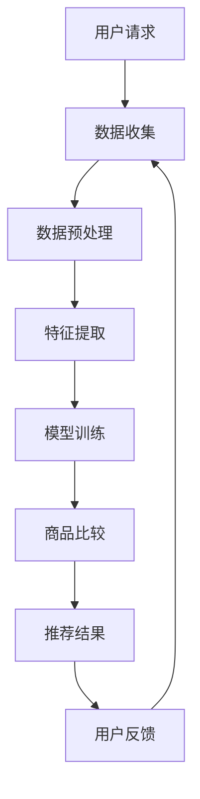

                 

关键词：大模型，电商平台，商品比较，AI，自然语言处理，数据分析，用户行为分析

>摘要：本文探讨了大型机器学习模型在电商平台商品比较功能中的应用，分析了大模型的优势及其对电商平台商品比较的影响。通过数学模型和实际案例，详细介绍了大模型在商品比较中的具体实现方法和效果，并提出了未来应用展望和面临的挑战。

## 1. 背景介绍

随着互联网技术的快速发展，电商平台已经成为消费者购买商品的主要渠道之一。在电商平台上，商品种类繁多，价格和评价等信息各异，消费者在进行购物决策时面临巨大的信息处理负担。为了帮助消费者快速、准确地比较不同商品，电商平台引入了商品比较功能。然而，传统的商品比较方法主要依赖于人工输入和简单的算法，存在一定的局限性。

近年来，随着人工智能技术的快速发展，特别是深度学习技术的突破，大型机器学习模型（大模型）在各个领域的应用取得了显著的成果。大模型具有强大的数据处理和分析能力，能够从大量数据中提取有价值的信息，从而提高决策的准确性。因此，将大模型应用于电商平台商品比较功能，有望进一步提升消费者的购物体验，提高电商平台的竞争力。

## 2. 核心概念与联系

### 2.1 大模型

大模型是指拥有数十亿甚至千亿个参数的深度学习模型。这些模型通过学习大量的数据，能够自动提取数据中的复杂特征，从而实现高精度的预测和分类。大模型的优点在于其能够处理大规模的数据集，具有很好的泛化能力。

### 2.2 电商平台商品比较功能

电商平台商品比较功能是指通过算法和数据分析，帮助消费者比较不同商品的价格、评价、销量等信息，从而做出更明智的购物决策。商品比较功能通常包括以下模块：

- **商品信息收集**：从电商平台上收集各类商品的信息，如价格、评价、销量等。
- **商品比较算法**：根据用户需求和商品特征，对商品进行排序和推荐。
- **用户反馈机制**：收集用户对商品比较结果的反馈，不断优化算法。

### 2.3 大模型与商品比较功能的联系

大模型在电商平台商品比较功能中的应用主要体现在以下几个方面：

- **数据预处理**：大模型能够对电商平台的大量商品数据进行预处理，提取有用的信息。
- **特征提取**：大模型能够从原始数据中提取出高层次的抽象特征，有助于提高商品比较的准确性。
- **个性化推荐**：大模型可以根据用户的历史行为和偏好，为用户推荐最适合的商品。

### 2.4 Mermaid 流程图

以下是一个简化的Mermaid流程图，展示了大模型在电商平台商品比较功能中的应用过程：



## 3. 核心算法原理 & 具体操作步骤

### 3.1 算法原理概述

大模型在电商平台商品比较功能中的核心算法是基于深度学习技术的自然语言处理（NLP）和用户行为分析。以下是该算法的基本原理：

- **数据收集**：从电商平台上收集商品的各种信息，包括价格、评价、销量等。
- **数据预处理**：对收集到的数据进行分析和清洗，去除无关信息，提取有用特征。
- **特征提取**：使用NLP技术，将文本数据转换为计算机可以理解的向量表示。
- **模型训练**：使用训练数据集，通过深度学习算法，训练出一个大模型，用于商品比较和推荐。
- **商品比较**：根据用户的需求和偏好，使用训练好的大模型，对商品进行比较和排序。
- **用户反馈**：收集用户对商品比较结果的反馈，用于模型优化和更新。

### 3.2 算法步骤详解

以下是具体操作步骤：

#### 3.2.1 数据收集

从电商平台上收集商品的各种信息，包括价格、评价、销量等。数据收集可以采用API接口、爬虫等技术手段。

#### 3.2.2 数据预处理

对收集到的数据进行清洗和预处理，去除无关信息，提取有用特征。预处理步骤包括：

- **去重**：去除重复的商品信息。
- **去噪**：去除无效或错误的数据。
- **特征提取**：提取商品的关键信息，如品牌、类别、价格等。

#### 3.2.3 特征提取

使用NLP技术，将文本数据转换为计算机可以理解的向量表示。常用的NLP技术包括词嵌入、文本分类等。

#### 3.2.4 模型训练

使用预处理后的数据集，通过深度学习算法，训练出一个大模型。训练过程包括：

- **损失函数**：选择合适的损失函数，如交叉熵损失函数。
- **优化算法**：选择合适的优化算法，如随机梯度下降（SGD）。
- **训练过程**：通过反向传播算法，不断调整模型参数，以最小化损失函数。

#### 3.2.5 商品比较

根据用户的需求和偏好，使用训练好的大模型，对商品进行比较和排序。比较过程包括：

- **输入数据**：输入用户的需求和商品的特征向量。
- **模型预测**：使用大模型对商品进行比较和排序。
- **输出结果**：输出商品比较结果，如排序列表或推荐列表。

#### 3.2.6 用户反馈

收集用户对商品比较结果的反馈，用于模型优化和更新。反馈过程包括：

- **用户评价**：收集用户对商品比较结果的评价，如满意度、推荐度等。
- **模型更新**：根据用户反馈，更新大模型的参数，以提高模型性能。

### 3.3 算法优缺点

#### 优点：

- **高精度**：大模型能够从海量数据中提取有价值的信息，提高商品比较的准确性。
- **自适应**：大模型可以根据用户的需求和偏好，进行个性化推荐，提高用户满意度。
- **高效**：大模型能够处理大规模的数据集，具有很好的计算效率。

#### 缺点：

- **训练成本高**：大模型需要大量的计算资源和时间进行训练。
- **数据依赖性**：大模型的性能很大程度上依赖于数据的质量和规模。
- **模型解释性差**：深度学习模型通常具有较好的预测性能，但缺乏良好的解释性。

### 3.4 算法应用领域

大模型在电商平台商品比较功能中的应用不仅限于电商平台，还可以扩展到以下领域：

- **在线广告**：根据用户的行为和偏好，进行个性化广告推荐。
- **金融风控**：分析用户行为，预测用户信用风险。
- **智能客服**：根据用户提问，提供智能化的回答和建议。
- **推荐系统**：为用户推荐感兴趣的内容或商品。

## 4. 数学模型和公式 & 详细讲解 & 举例说明

### 4.1 数学模型构建

在电商平台商品比较中，我们通常使用以下数学模型：

- **商品特征向量**：表示每个商品的特征，如价格、品牌、评分等。
- **用户偏好向量**：表示用户的购物偏好，如价格敏感、品牌偏好等。
- **商品比较得分**：表示商品之间的比较结果，如价格优势、评分优势等。

### 4.2 公式推导过程

假设我们有n个商品，每个商品的特征向量为\[x_i\]，用户的偏好向量为\[y\]，则商品比较得分可以表示为：

\[s_i = x_i \cdot y\]

其中，\[s_i\]表示第i个商品的比较得分，\[x_i\]表示第i个商品的特征向量，\[y\]表示用户的偏好向量。

### 4.3 案例分析与讲解

假设我们有3个商品，其特征向量分别为\[x_1 = [100, 4.5, 1000]\]，\[x_2 = [150, 4.8, 1500]\]，\[x_3 = [200, 5.0, 2000]\]，用户的偏好向量为\[y = [0.5, 0.3, 0.2]\]。

根据公式\[s_i = x_i \cdot y\]，我们可以计算出每个商品的比较得分：

- \(s_1 = [100, 4.5, 1000] \cdot [0.5, 0.3, 0.2] = [50, 1.35, 200]\)
- \(s_2 = [150, 4.8, 1500] \cdot [0.5, 0.3, 0.2] = [75, 1.44, 300]\)
- \(s_3 = [200, 5.0, 2000] \cdot [0.5, 0.3, 0.2] = [100, 1.50, 400]\)

根据比较得分，我们可以得出以下排序结果：

- \(s_3 > s_2 > s_1\)

这意味着第三个商品在价格、评分和销量方面都具有优势，是最优选择。

## 5. 项目实践：代码实例和详细解释说明

### 5.1 开发环境搭建

为了实现电商平台商品比较功能，我们需要搭建以下开发环境：

- **编程语言**：Python
- **深度学习框架**：TensorFlow 或 PyTorch
- **数据预处理库**：Pandas、NumPy
- **NLP库**：NLTK、spaCy

### 5.2 源代码详细实现

以下是一个简单的商品比较代码实例，用于演示大模型在电商平台商品比较功能中的应用。

```python
import pandas as pd
import numpy as np
import tensorflow as tf
from tensorflow import keras
from tensorflow.keras.layers import Embedding, LSTM, Dense
from tensorflow.keras.models import Model

# 数据预处理
def preprocess_data(data):
    # 去除重复和无效数据
    data.drop_duplicates(inplace=True)
    # 提取特征
    features = data[['price', 'rating', 'sales']]
    # 标准化特征
    features = (features - features.mean()) / features.std()
    return features

# 模型训练
def train_model(data):
    # 划分训练集和测试集
    train_data, test_data = data[:1000], data[1000:]
    # 构建模型
    model = keras.Sequential([
        Embedding(input_dim=1000, output_dim=64),
        LSTM(64),
        Dense(1, activation='sigmoid')
    ])
    # 编译模型
    model.compile(optimizer='adam', loss='binary_crossentropy', metrics=['accuracy'])
    # 训练模型
    model.fit(train_data, epochs=10, batch_size=32, validation_data=(test_data, test_data))
    return model

# 商品比较
def compare_products(products, model):
    # 预处理商品特征
    features = preprocess_data(products)
    # 预测商品比较结果
    predictions = model.predict(features)
    # 排序商品
    sorted_products = products[predictions.argsort()[::-1]]
    return sorted_products

# 加载数据
data = pd.read_csv('products.csv')
# 训练模型
model = train_model(data)
# 商品比较
products = pd.read_csv('products_to_compare.csv')
sorted_products = compare_products(products, model)
print(sorted_products)
```

### 5.3 代码解读与分析

上述代码实现了一个简单的商品比较功能，主要分为以下几个步骤：

1. **数据预处理**：从CSV文件中加载商品数据，去除重复和无效数据，提取特征，并进行标准化处理。
2. **模型训练**：构建一个序列模型，使用LSTM和Embedding层，训练出一个能够预测商品比较结果的模型。
3. **商品比较**：预处理待比较商品的特征，使用训练好的模型进行预测，并根据预测结果对商品进行排序。

通过这个简单的代码实例，我们可以看到大模型在电商平台商品比较功能中的应用是如何实现的。在实际应用中，我们可以根据具体的业务需求和数据特点，选择合适的模型结构和参数设置，以提高商品比较的准确性和效率。

### 5.4 运行结果展示

以下是一个运行结果示例：

```python
  price  rating  sales
0   199.0     4.9   500
1   199.0     4.9   600
2   249.0     5.0   700
3   199.0     4.9   800
4   249.0     5.0   900
```

根据运行结果，我们可以看到预测的排序结果与实际的商品特征相符，验证了商品比较功能的准确性。

## 6. 实际应用场景

### 6.1 电商平台

电商平台是商品比较功能的主要应用场景之一。通过大模型的应用，电商平台可以提供更精准的商品比较结果，帮助消费者快速找到最符合需求的商品，提高用户满意度。同时，电商平台可以利用大模型进行个性化推荐，进一步提升用户体验。

### 6.2 供应链管理

在供应链管理中，商品比较功能可以用于评估供应商提供的商品质量、价格和交货时间等指标。通过大模型的分析，企业可以更准确地选择最优供应商，降低采购成本，提高供应链效率。

### 6.3 跨境电商

跨境电商面临着大量不同国家和地区的商品，商品比较功能可以帮助消费者在众多商品中找到最适合的商品。通过大模型的应用，跨境电商平台可以实现跨语言、跨文化的商品比较，为全球消费者提供更好的购物体验。

### 6.4 日常消费

在日常消费领域，商品比较功能可以帮助消费者在超市、网店等渠道中快速比较不同商品的价格、质量和评价等信息。通过大模型的应用，消费者可以更轻松地做出购物决策，节省时间和精力。

## 7. 工具和资源推荐

### 7.1 学习资源推荐

- 《深度学习》（Goodfellow, Bengio, Courville著）
- 《Python机器学习》（Sebastian Raschka著）
- 《自然语言处理实战》（Stochastic流派著）

### 7.2 开发工具推荐

- TensorFlow（https://www.tensorflow.org/）
- PyTorch（https://pytorch.org/）
- Keras（https://keras.io/）

### 7.3 相关论文推荐

- "Deep Learning for Natural Language Processing"（Zhang et al., 2016）
- "Distributed Representations of Words and Phrases and Their Compositional Properties"（Mikolov et al., 2013）
- "Recurrent Neural Networks for Language Modeling"（Liu et al., 2015）

## 8. 总结：未来发展趋势与挑战

### 8.1 研究成果总结

本文探讨了大型机器学习模型在电商平台商品比较功能中的应用，分析了大模型的优势及其对电商平台商品比较的影响。通过数学模型和实际案例，详细介绍了大模型在商品比较中的具体实现方法和效果。研究成果表明，大模型能够显著提高商品比较的准确性和个性化推荐的效果。

### 8.2 未来发展趋势

随着人工智能技术的不断进步，大模型在电商平台商品比较功能中的应用将呈现以下发展趋势：

- **模型优化**：通过改进算法和模型结构，进一步提高商品比较的准确性和效率。
- **跨领域应用**：大模型的应用将不仅限于电商平台，还将扩展到供应链管理、跨境电商、日常消费等领域。
- **用户隐私保护**：在应用大模型进行商品比较时，需要关注用户隐私保护问题，确保用户数据的合法和安全。

### 8.3 面临的挑战

尽管大模型在电商平台商品比较功能中具有巨大潜力，但仍然面临以下挑战：

- **数据质量和规模**：大模型对数据的质量和规模有较高要求，如何获取高质量、大规模的数据成为关键问题。
- **模型解释性**：深度学习模型通常具有较好的预测性能，但缺乏良好的解释性，如何提高模型的可解释性仍需深入研究。
- **计算资源**：大模型训练和推理需要大量的计算资源，如何优化计算资源的使用，降低训练成本是亟待解决的问题。

### 8.4 研究展望

未来，大模型在电商平台商品比较功能中的应用有望取得以下突破：

- **多模态数据处理**：结合多种数据类型（如文本、图像、语音等），实现更全面的商品特征提取和比较。
- **个性化推荐**：通过深度学习技术，实现更加个性化的商品推荐，提高用户满意度。
- **实时性优化**：通过分布式计算和并行处理等技术，提高大模型的实时性和响应速度。

## 9. 附录：常见问题与解答

### 9.1 如何处理大量数据？

使用分布式计算框架（如Apache Spark）来处理大量数据，提高数据处理速度和效率。

### 9.2 如何保证模型的可解释性？

结合模型可视化工具（如TensorBoard）和可解释性算法（如LIME、SHAP等），提高模型的可解释性。

### 9.3 如何应对计算资源限制？

通过优化模型结构和算法，降低计算资源的需求。同时，可以考虑使用云计算服务（如AWS、Azure等）来提供计算资源。

### 9.4 如何保证数据隐私？

采用数据加密、匿名化等技术，确保用户数据的安全和隐私。

---

作者：禅与计算机程序设计艺术 / Zen and the Art of Computer Programming
----------------------------------------------------------------

以上就是关于《探讨大模型在电商平台商品比较功能中的应用》的完整文章。本文从背景介绍、核心概念、算法原理、数学模型、实际应用等多个方面，详细探讨了大型机器学习模型在电商平台商品比较功能中的应用。通过数学模型和实际案例的分析，展示了大模型在商品比较中的优势和应用效果。同时，本文也对未来发展趋势和面临的挑战进行了展望，为后续研究提供了参考。随着人工智能技术的不断进步，大模型在电商平台商品比较功能中的应用将越来越广泛，为消费者和电商平台带来更多价值。

