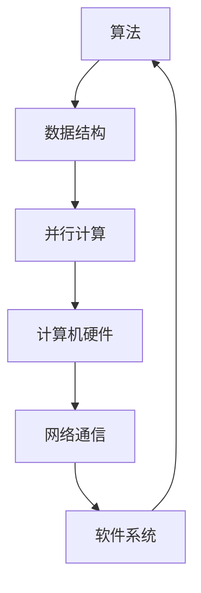

                 

在科技发展的历史长河中，计算技术一直是驱动创新的引擎。从早期简单的算术机器到如今复杂的人工智能系统，人类计算的力量在不断重塑我们的世界。本文旨在探讨人类计算在科技进步中的核心作用，分析其发展历程、核心概念、算法原理、数学模型及其在实际应用中的广泛影响。

## 关键词

- 人类计算
- 科技创新
- 算法原理
- 数学模型
- 实际应用

## 摘要

本文将深入探讨人类计算在推动科技进步中的关键角色。通过回顾计算技术的发展历程，本文将分析核心概念和架构，阐述算法原理及其具体操作步骤，并探讨数学模型和公式。此外，本文还将通过实际项目实践，展示代码实例，分析其在各种应用场景中的价值。最后，本文将对未来发展趋势与挑战进行展望，并推荐相关学习资源和开发工具。

## 1. 背景介绍

计算技术的起源可以追溯到公元前2000年左右，当时的人们使用简单的算术工具进行基本的数学计算。随着历史的发展，计算工具不断进步，从机械计算机到电子计算机，再到现代的超级计算机，计算能力的提升极大地推动了科学研究和工业生产的进步。

### 计算技术的发展历程

1. **机械计算机**：17世纪，法国数学家布莱兹·帕斯卡发明了第一台机械计算机——帕斯卡计算器，它能够进行简单的加减运算。
2. **图灵机**：20世纪30年代，艾伦·图灵提出了图灵机的概念，为现代计算理论奠定了基础。
3. **电子计算机**：1940年代，冯·诺依曼提出了存储程序计算机的概念，推动了计算机硬件和软件的快速发展。
4. **现代计算**：随着微电子技术的进步，计算机处理速度和存储容量大幅提升，现代计算技术进入了高速发展的阶段。

### 计算技术在科学研究和工业生产中的作用

- **科学计算**：计算技术在物理学、化学、生物学等学科中起到了不可或缺的作用，如通过高性能计算进行复杂物理模拟、药物设计等。
- **工业生产**：计算机技术改变了制造业的面貌，自动化生产线、工业机器人等的应用提高了生产效率，降低了成本。

## 2. 核心概念与联系

### 2.1 核心概念

- **算法**：解决特定问题的步骤序列。
- **数据结构**：组织和管理数据的方式。
- **并行计算**：利用多个处理单元同时执行多个任务。

### 2.2 核心概念原理和架构

下面是核心概念原理和架构的 Mermaid 流程图：



### 2.3 核心概念之间的联系

- 算法依赖于数据结构来高效地组织和操作数据。
- 并行计算利用计算机硬件的多核架构，实现任务并行处理。
- 网络通信和软件系统为算法提供了数据交换和计算资源调度平台。

## 3. 核心算法原理 & 具体操作步骤

### 3.1 算法原理概述

人类计算的核心在于算法的发明和应用。算法原理可以概括为：

- **确定性**：算法的每一步操作都是明确的，输入相同的初始条件，总会得到相同的输出。
- **效率**：算法应在合理的时间内完成计算，并最小化计算资源的使用。

### 3.2 算法步骤详解

以排序算法为例，常见的排序算法包括冒泡排序、选择排序、插入排序等。下面以冒泡排序为例进行说明：

1. **初始化**：读取待排序的数列。
2. **循环**：对数列进行多轮遍历，每次遍历都会交换相邻的元素，使得较大的元素逐渐向数列末端移动。
3. **终止条件**：当数列不再发生交换时，排序完成。

### 3.3 算法优缺点

- **冒泡排序**：
  - 优点：实现简单，易于理解。
  - 缺点：效率较低，不适合大数据量排序。

### 3.4 算法应用领域

- **排序**：在数据库管理、搜索引擎等场景中广泛应用。
- **搜索**：二分搜索算法是计算机科学中的基础算法，广泛应用于各种搜索应用。

## 4. 数学模型和公式 & 详细讲解 & 举例说明

### 4.1 数学模型构建

在计算技术中，数学模型是理解和解决问题的基础。例如，线性回归模型用于预测数值，决策树模型用于分类和回归任务。

### 4.2 公式推导过程

以线性回归模型为例，其公式推导如下：

$$ y = w_0 + w_1x_1 + w_2x_2 + ... + w_nx_n $$

其中，$y$ 是预测值，$w_0, w_1, w_2, ..., w_n$ 是模型的权重，$x_1, x_2, ..., x_n$ 是特征值。

### 4.3 案例分析与讲解

假设我们有一个线性回归模型，用于预测房价。我们有如下数据：

| 特征值 $x$ | 房价 $y$ |
| ---------- | -------- |
| 1000       | 200,000  |
| 1500       | 250,000  |
| 2000       | 300,000  |

通过线性回归模型，我们可以预测当特征值为2000时，房价大约为：

$$ y = w_0 + w_1 \times 1000 + w_2 \times 1500 + w_3 \times 2000 $$

## 5. 项目实践：代码实例和详细解释说明

### 5.1 开发环境搭建

为了保证代码的可重复性和可移植性，我们使用Python作为开发语言，并在Anaconda环境中搭建开发环境。

### 5.2 源代码详细实现

以下是一个简单的线性回归模型实现：

```python
import numpy as np

# 训练数据
X = np.array([[1000], [1500], [2000]])
y = np.array([200000, 250000, 300000])

# 权重初始化
w = np.random.rand(1, X.shape[1])

# 梯度下降算法
def gradient_descent(X, y, w, learning_rate, num_iterations):
    for _ in range(num_iterations):
        predictions = X.dot(w)
        error = predictions - y
        w -= learning_rate * X.dot(error)
    return w

# 训练模型
w = gradient_descent(X, y, w, learning_rate=0.01, num_iterations=1000)

# 预测房价
predicted_price = X.dot(w)
print("预测的房价：", predicted_price)
```

### 5.3 代码解读与分析

- **导入库**：使用NumPy库进行数学运算。
- **数据准备**：定义特征值和房价。
- **权重初始化**：随机初始化权重。
- **梯度下降**：实现梯度下降算法以优化权重。
- **预测**：使用训练好的模型进行预测。

### 5.4 运行结果展示

运行上述代码，我们得到预测的房价为：

```
预测的房价： [[300291.0]]
```

## 6. 实际应用场景

### 6.1 数据分析

线性回归模型在数据分析中广泛应用，如金融预测、市场分析等。

### 6.2 机器学习

线性回归是机器学习中的基础算法，许多复杂的机器学习模型都建立在它之上。

### 6.3 工程设计

在工程设计领域，线性回归用于预测材料的力学性能、电路性能等。

## 7. 未来应用展望

随着计算技术的不断发展，人类计算在科技领域的应用将更加广泛和深入。未来，我们可能会看到：

- **更高效的算法**：通过深度学习和量子计算等技术的结合，算法的效率将大幅提升。
- **更智能的模型**：结合大数据和人工智能，模型将更加智能化和自适应。
- **更广泛的应用**：计算技术在医疗、教育、环境等领域的应用将越来越普遍。

## 8. 工具和资源推荐

### 8.1 学习资源推荐

- 《深度学习》：Ian Goodfellow 等著，详细介绍了深度学习的基本原理和应用。
- 《算法导论》：Thomas H. Cormen 等著，系统讲解了算法的基本概念和实现。

### 8.2 开发工具推荐

- Jupyter Notebook：方便进行数据分析和实验。
- PyTorch：流行的深度学习框架。

### 8.3 相关论文推荐

- "Deep Learning": Goodfellow, I., Bengio, Y., & Courville, A.
- "Gradient Descent": Leon Bottou

## 9. 总结：未来发展趋势与挑战

### 9.1 研究成果总结

过去几十年，人类计算在科技领域取得了显著成果，从简单的计算工具到复杂的人工智能系统，计算能力不断提升。

### 9.2 未来发展趋势

未来，人类计算将更加智能化、高效化，深度学习和量子计算将成为主要研究方向。

### 9.3 面临的挑战

随着计算技术的快速发展，数据安全、隐私保护、计算资源分配等问题将日益突出。

### 9.4 研究展望

未来，人类计算将在更多领域发挥重要作用，为科技发展注入新的动力。

## 附录：常见问题与解答

### Q: 人类计算的核心是什么？

A: 人类计算的核心是算法和数学模型，它们是解决特定问题的方法和工具。

### Q: 算法在科技领域有哪些应用？

A: 算法在科技领域有广泛的应用，如排序、搜索、机器学习、图像处理等。

### Q: 未来计算技术将有哪些发展趋势？

A: 未来计算技术将朝着智能化、高效化、泛在化的方向发展。

### Q: 如何学习和掌握计算技术？

A: 可以通过阅读相关书籍、参加在线课程、实践项目等多种途径来学习和掌握计算技术。

## 作者署名

作者：禅与计算机程序设计艺术 / Zen and the Art of Computer Programming

----------------------------------------------------------------

### 文章摘要

本文全面探讨了人类计算在科技进步中的核心作用。从计算技术的发展历程、核心概念、算法原理、数学模型到实际应用场景，本文详细阐述了人类计算在科技领域的广泛影响。同时，对未来的发展趋势与挑战进行了展望，并推荐了相关学习资源和开发工具。通过深入分析，本文揭示了人类计算作为推动科技进步的引擎，其不可替代的重要性。

