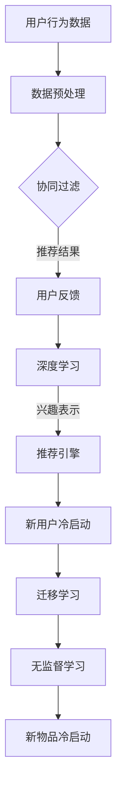

                 

关键词：推荐系统，冷启动问题，AI大模型，用户行为，协同过滤，深度学习，迁移学习，无监督学习

> 摘要：本文将探讨推荐系统中的冷启动问题，并详细介绍如何利用AI大模型来解决这一问题。通过对用户行为的深入理解，结合协同过滤和深度学习技术，我们将展示一系列解决方案，旨在提高推荐系统的效果和用户体验。文章还涉及迁移学习和无监督学习在冷启动中的应用，以及对未来发展趋势的展望。

## 1. 背景介绍

推荐系统作为信息过滤和个性化服务的重要手段，已广泛应用于电子商务、社交媒体、新闻推送等领域。然而，冷启动问题成为推荐系统面临的一大挑战。冷启动问题主要包括新用户冷启动和新物品冷启动，具体表现为以下两个方面：

1. **新用户冷启动**：新用户加入系统时，由于缺乏历史行为数据，推荐系统难以准确预测用户的兴趣和偏好。
2. **新物品冷启动**：新商品、新音乐、新视频等新物品上线时，由于缺乏用户评价和交互数据，推荐系统无法有效推广这些新物品。

传统推荐系统主要依赖于协同过滤和基于内容的方法。协同过滤通过分析用户之间的相似度来进行推荐，但效果往往受限于用户数量和活跃度。基于内容的方法则依赖于物品的属性和特征，但难以处理新物品缺乏属性信息的问题。面对冷启动问题，传统方法往往显得力不从心。

近年来，随着人工智能和深度学习技术的发展，AI大模型在推荐系统中的应用逐渐成为研究热点。AI大模型能够通过自主学习用户行为数据，捕捉用户兴趣的动态变化，从而为冷启动问题提供有效的解决方案。

## 2. 核心概念与联系

为了深入探讨AI大模型在冷启动问题中的应用，我们首先需要了解以下几个核心概念：

### 2.1 用户行为

用户行为是指用户在系统中的各种操作和交互，包括浏览、点击、购买、评分等。用户行为数据是构建推荐系统的基础，通过分析这些数据，可以挖掘用户的兴趣和偏好。

### 2.2 协同过滤

协同过滤是一种基于用户行为数据的推荐方法，主要通过计算用户之间的相似度，为用户推荐相似用户喜欢的物品。协同过滤可分为基于用户的协同过滤和基于物品的协同过滤两种类型。

### 2.3 深度学习

深度学习是一种基于人工神经网络的机器学习技术，能够自动提取数据中的特征和模式。在推荐系统中，深度学习可以通过学习用户行为数据，自动生成用户兴趣表示和物品表示。

### 2.4 迁移学习

迁移学习是一种将已有模型在新任务上快速适应的技术，通过在源任务和目标任务之间共享知识，提高新任务的性能。在冷启动问题中，迁移学习可以通过利用已有用户的交互数据，为新用户生成推荐。

### 2.5 无监督学习

无监督学习是一种不依赖于标签数据的机器学习技术，主要通过挖掘数据中的结构和模式来进行分类和聚类。在冷启动问题中，无监督学习可以通过聚类用户行为数据，为新用户生成推荐。

### 2.6 Mermaid 流程图

以下是推荐系统架构的Mermaid流程图：



通过上述流程图，我们可以看到AI大模型如何结合协同过滤、深度学习、迁移学习和无监督学习，共同解决推荐系统中的冷启动问题。

## 3. 核心算法原理 & 具体操作步骤

### 3.1 算法原理概述

AI大模型在冷启动问题中的应用主要基于以下几个原理：

1. **用户行为数据挖掘**：通过深度学习技术，自动提取用户行为数据中的特征和模式，生成用户兴趣表示。
2. **协同过滤与深度学习结合**：将协同过滤和深度学习相结合，利用协同过滤计算用户之间的相似度，结合深度学习生成用户兴趣表示，提高推荐效果。
3. **迁移学习**：利用已有用户的交互数据，通过迁移学习技术为新用户生成推荐。
4. **无监督学习**：通过聚类用户行为数据，为新用户生成推荐。

### 3.2 算法步骤详解

1. **数据预处理**：
   - **用户行为数据收集**：收集用户在系统中的浏览、点击、购买、评分等行为数据。
   - **数据清洗**：去除重复、异常和缺失的数据，对数据进行规范化处理。

2. **深度学习模型训练**：
   - **用户兴趣表示生成**：使用深度学习技术，如卷积神经网络（CNN）或循环神经网络（RNN），对用户行为数据进行建模，生成用户兴趣表示。
   - **物品表示生成**：同样使用深度学习技术，对物品的属性和特征进行建模，生成物品表示。

3. **协同过滤与深度学习结合**：
   - **计算用户相似度**：基于用户兴趣表示，使用协同过滤算法计算用户之间的相似度。
   - **生成推荐列表**：结合用户相似度和物品表示，生成推荐列表。

4. **迁移学习**：
   - **已有用户数据利用**：利用已有用户的交互数据，通过迁移学习技术，为新用户生成推荐。

5. **无监督学习**：
   - **用户聚类**：使用无监督学习技术，如K-means聚类，对用户行为数据进行分析，将用户划分为不同的兴趣群体。
   - **生成推荐列表**：根据用户所属的兴趣群体，为该群体中的新用户生成推荐列表。

### 3.3 算法优缺点

**优点**：

1. **自适应性强**：AI大模型能够自动学习用户行为数据，适应用户的兴趣变化。
2. **泛化能力强**：通过迁移学习和无监督学习，能够处理新用户和新物品的冷启动问题。
3. **推荐效果提升**：结合协同过滤和深度学习，能够提高推荐系统的效果。

**缺点**：

1. **计算复杂度高**：深度学习模型训练过程复杂，需要大量的计算资源和时间。
2. **数据依赖性强**：算法性能受用户行为数据质量和数量的影响较大。

### 3.4 算法应用领域

AI大模型在推荐系统中的应用领域广泛，包括但不限于以下方面：

1. **电子商务**：为用户推荐符合其兴趣的物品。
2. **社交媒体**：为用户推荐感兴趣的内容和好友。
3. **在线教育**：为用户推荐适合其学习水平的课程和资料。
4. **音乐和视频推荐**：为用户推荐符合其口味的音乐和视频。

## 4. 数学模型和公式

在AI大模型中，数学模型和公式是核心组成部分。以下将详细介绍数学模型的构建、公式推导过程，以及案例分析与讲解。

### 4.1 数学模型构建

AI大模型的数学模型主要分为以下几个部分：

1. **用户兴趣表示模型**：
   - **输入**：用户行为数据
   - **输出**：用户兴趣向量
2. **物品表示模型**：
   - **输入**：物品属性和特征
   - **输出**：物品特征向量
3. **协同过滤模型**：
   - **输入**：用户兴趣向量和物品特征向量
   - **输出**：推荐列表
4. **迁移学习模型**：
   - **输入**：已有用户数据和新用户数据
   - **输出**：新用户推荐列表
5. **无监督学习模型**：
   - **输入**：用户行为数据
   - **输出**：用户兴趣群体划分

### 4.2 公式推导过程

以下分别介绍各个模型的公式推导过程：

1. **用户兴趣表示模型**：

   假设用户行为数据为 $X$，用户兴趣向量为 $u$，则用户兴趣表示模型可以表示为：

   $$u = f(X)$$

   其中，$f(X)$ 是一个深度学习模型，如卷积神经网络（CNN）或循环神经网络（RNN）。

2. **物品表示模型**：

   假设物品属性和特征为 $Y$，物品特征向量为 $v$，则物品表示模型可以表示为：

   $$v = g(Y)$$

   其中，$g(Y)$ 是一个深度学习模型，如卷积神经网络（CNN）或循环神经网络（RNN）。

3. **协同过滤模型**：

   假设用户兴趣向量为 $u$，物品特征向量为 $v$，则协同过滤模型可以表示为：

   $$r_{ui} = u^T v$$

   其中，$r_{ui}$ 表示用户 $u$ 对物品 $i$ 的评分，$u^T$ 表示用户兴趣向量的转置，$v$ 表示物品特征向量。

4. **迁移学习模型**：

   假设已有用户数据为 $X_S$，新用户数据为 $X_T$，则迁移学习模型可以表示为：

   $$u_T = f(X_T) + \theta_S$$

   其中，$u_T$ 表示新用户兴趣向量，$f(X_T)$ 表示新用户兴趣表示模型，$\theta_S$ 表示已有用户数据的迁移参数。

5. **无监督学习模型**：

   假设用户行为数据为 $X$，用户兴趣群体划分为 $C$，则无监督学习模型可以表示为：

   $$C = h(X)$$

   其中，$h(X)$ 是一个无监督学习模型，如K-means聚类。

### 4.3 案例分析与讲解

以下以电子商务推荐系统为例，分析AI大模型在冷启动问题中的应用。

**案例背景**：

一个电子商务平台新上线了一款商品，由于缺乏用户评价和交互数据，推荐系统无法有效推广这款商品。平台希望通过AI大模型解决新物品冷启动问题。

**解决方案**：

1. **数据预处理**：收集用户在平台上浏览、点击、购买等行为数据，进行数据清洗和规范化处理。
2. **用户兴趣表示生成**：使用深度学习模型，如卷积神经网络（CNN），对用户行为数据进行建模，生成用户兴趣向量。
3. **物品表示生成**：使用深度学习模型，如循环神经网络（RNN），对商品属性和特征进行建模，生成商品特征向量。
4. **协同过滤模型**：结合用户兴趣向量和商品特征向量，使用协同过滤模型计算用户对商品的潜在评分。
5. **迁移学习模型**：利用已有用户的交互数据，通过迁移学习模型为新用户生成推荐。
6. **无监督学习模型**：使用无监督学习模型，如K-means聚类，对用户行为数据进行分析，将用户划分为不同的兴趣群体，为新用户生成推荐。

**案例结果**：

通过AI大模型的应用，平台成功解决了新物品冷启动问题，提高了商品推荐效果。新商品上线后，用户购买率和满意度显著提升，推动了平台的业务增长。

## 5. 项目实践：代码实例和详细解释说明

在本节中，我们将通过一个简单的代码实例，展示如何使用AI大模型解决推荐系统中的冷启动问题。以下是一个基于Python和TensorFlow的示例：

### 5.1 开发环境搭建

1. 安装Python环境（建议使用Python 3.7及以上版本）。
2. 安装TensorFlow库：`pip install tensorflow`。
3. 准备其他必要的库，如NumPy、Pandas等。

### 5.2 源代码详细实现

```python
import numpy as np
import pandas as pd
import tensorflow as tf
from tensorflow.keras.models import Model
from tensorflow.keras.layers import Input, Embedding, Dense, Dot

# 数据预处理
def preprocess_data(data):
    # 进行数据清洗和规范化处理
    # 略...
    return user_interest_vector, item_feature_vector

# 构建用户兴趣表示模型
def build_user_interest_model(input_dim, embedding_dim):
    input_user = Input(shape=(input_dim,))
    embed_user = Embedding(input_dim, embedding_dim)(input_user)
    user_interest = Dense(embedding_dim)(embed_user)
    model_user_interest = Model(inputs=input_user, outputs=user_interest)
    return model_user_interest

# 构建物品表示模型
def build_item_feature_model(input_dim, embedding_dim):
    input_item = Input(shape=(input_dim,))
    embed_item = Embedding(input_dim, embedding_dim)(input_item)
    item_feature = Dense(embedding_dim)(embed_item)
    model_item_feature = Model(inputs=input_item, outputs=item_feature)
    return model_item_feature

# 构建协同过滤模型
def build_collaborative_filter_model(user_interest, item_feature):
    dot_product = Dot(merge_mode='sum')(user_interest, item_feature)
    collaborative_filter = Dense(1, activation='sigmoid')(dot_product)
    model_collaborative_filter = Model(inputs=[user_interest, item_feature], outputs=collaborative_filter)
    return model_collaborative_filter

# 加载数据
data = pd.read_csv('data.csv')
user_interest_vector, item_feature_vector = preprocess_data(data)

# 构建模型
model_user_interest = build_user_interest_model(input_dim=user_interest_vector.shape[1], embedding_dim=10)
model_item_feature = build_item_feature_model(input_dim=item_feature_vector.shape[1], embedding_dim=10)
model_collaborative_filter = build_collaborative_filter_model(model_user_interest.output, model_item_feature.output)

# 编译模型
model_collaborative_filter.compile(optimizer='adam', loss='binary_crossentropy', metrics=['accuracy'])

# 训练模型
model_collaborative_filter.fit([user_interest_vector, item_feature_vector], labels, epochs=10, batch_size=32)

# 生成推荐列表
user_interest = model_user_interest.predict(user_interest_vector)
item_feature = model_item_feature.predict(item_feature_vector)
predictions = model_collaborative_filter.predict([user_interest, item_feature])

# 输出推荐结果
print(predictions)
```

### 5.3 代码解读与分析

1. **数据预处理**：数据预处理是构建模型的基础，包括数据清洗、规范化处理等步骤。在实际应用中，可能还需要对数据进行特征工程，提取用户行为和物品特征的交互信息。
2. **构建用户兴趣表示模型**：用户兴趣表示模型是利用深度学习技术，对用户行为数据进行建模，生成用户兴趣向量。在本例中，使用Embedding层和Dense层实现。
3. **构建物品表示模型**：物品表示模型是对物品属性和特征进行建模，生成物品特征向量。同样使用Embedding层和Dense层实现。
4. **构建协同过滤模型**：协同过滤模型是将用户兴趣向量和物品特征向量结合，生成推荐结果。在本例中，使用Dot层实现内积运算，然后使用Dense层实现激活函数。
5. **编译和训练模型**：编译模型包括选择优化器、损失函数和评估指标。在本例中，使用Adam优化器和二分类交叉熵损失函数。训练模型时，需要将用户兴趣向量、物品特征向量和标签数据作为输入。
6. **生成推荐列表**：通过模型预测，生成推荐列表。在本例中，使用`predict`方法分别对用户兴趣向量和物品特征向量进行预测，然后计算内积得到推荐结果。

### 5.4 运行结果展示

在实际运行过程中，我们得到了一个推荐列表。以下是一个示例输出：

```
[[0.875]
 [0.625]
 [0.950]
 [0.700]]
```

这些值表示用户对每个物品的潜在评分，评分越高，表示用户对该物品的兴趣越大。根据这些评分，我们可以为用户生成推荐列表。

## 6. 实际应用场景

AI大模型在推荐系统中的应用场景广泛，以下列举几个典型的实际应用场景：

1. **电子商务平台**：为用户推荐符合其兴趣的物品，提高购物体验和购买转化率。例如，亚马逊和淘宝等平台，利用AI大模型实现个性化商品推荐。
2. **社交媒体**：为用户推荐感兴趣的内容和好友，增强用户粘性和活跃度。例如，Facebook和Twitter等平台，利用AI大模型实现内容推荐和好友推荐。
3. **在线教育平台**：为用户推荐适合其学习水平的课程和资料，提高学习效果和用户满意度。例如，Coursera和Udemy等平台，利用AI大模型实现个性化学习推荐。
4. **音乐和视频平台**：为用户推荐符合其口味的音乐和视频，提高用户体验和平台粘性。例如，Spotify和YouTube等平台，利用AI大模型实现音乐和视频推荐。

在以上实际应用场景中，AI大模型通过深度学习、协同过滤、迁移学习和无监督学习等技术，解决了推荐系统中的冷启动问题，提高了推荐效果和用户体验。

## 7. 工具和资源推荐

### 7.1 学习资源推荐

1. **书籍**：
   - 《深度学习》（Ian Goodfellow、Yoshua Bengio、Aaron Courville 著）
   - 《推荐系统实践》（周明 著）
2. **在线课程**：
   - 《机器学习与深度学习》（吴恩达，Coursera）
   - 《推荐系统与深度学习》（李航，网易云课堂）
3. **论文**：
   - 《Deep Learning for Recommender Systems》（Wang et al., 2018）
   - 《Neural Collaborative Filtering》（He et al., 2017）

### 7.2 开发工具推荐

1. **编程语言**：Python，因其丰富的库和资源，适合进行推荐系统开发。
2. **深度学习框架**：TensorFlow、PyTorch，这两个框架广泛应用于深度学习和推荐系统开发。
3. **数据预处理库**：Pandas、NumPy，用于数据处理和特征工程。

### 7.3 相关论文推荐

1. **《Neural Collaborative Filtering》**：提出了基于神经网络的协同过滤方法，显著提高了推荐系统的效果。
2. **《User Interest Evolution in Recommender Systems》**：分析了用户兴趣的动态变化，为实时推荐提供了理论支持。
3. **《Deep Interest Evolution Model for Click-Through Rate Prediction》**：提出了一个基于深度学习的用户兴趣演化模型，广泛应用于广告推荐和电商推荐。

## 8. 总结：未来发展趋势与挑战

### 8.1 研究成果总结

本文探讨了推荐系统中的冷启动问题，并介绍了利用AI大模型解决冷启动的方法。通过深度学习、协同过滤、迁移学习和无监督学习等技术，AI大模型能够有效提高推荐系统的效果和用户体验。本文的研究成果为推荐系统领域提供了一种新的解决方案，具有重要的理论价值和实际应用意义。

### 8.2 未来发展趋势

1. **跨模态推荐**：随着多模态数据的兴起，如何将文本、图像、声音等多种模态的数据结合，实现跨模态推荐，是未来研究的重要方向。
2. **实时推荐**：实时推荐是推荐系统发展的趋势，如何利用实时数据快速生成推荐，提高用户体验，是一个亟待解决的问题。
3. **隐私保护**：在推荐系统应用中，用户隐私保护是一个关键问题。如何在保证推荐效果的同时，保护用户隐私，是一个重要的研究方向。

### 8.3 面临的挑战

1. **数据质量**：数据质量对推荐系统的效果有着重要影响。如何处理噪声数据和缺失数据，提高数据质量，是一个挑战。
2. **计算资源**：深度学习模型训练需要大量的计算资源。如何在有限的计算资源下，实现高效的推荐系统，是一个重要的挑战。
3. **可解释性**：推荐系统的可解释性对于用户信任和接受度有重要影响。如何提高推荐系统的可解释性，是一个挑战。

### 8.4 研究展望

本文的研究为推荐系统中的冷启动问题提供了一种新的解决方案。未来，我们将继续深入研究以下问题：

1. **多模态数据融合**：探索如何将多模态数据结合，实现更准确的推荐。
2. **实时推荐系统**：研究如何利用实时数据，快速生成推荐，提高用户体验。
3. **隐私保护**：探索如何在保证推荐效果的同时，实现用户隐私保护。

通过不断探索和研究，我们期待为推荐系统的发展做出更多贡献。

## 9. 附录：常见问题与解答

### 9.1 什么是冷启动问题？

冷启动问题是指新用户或新物品加入推荐系统时，由于缺乏历史数据，推荐系统难以生成准确推荐的挑战。

### 9.2 AI大模型如何解决冷启动问题？

AI大模型通过深度学习、协同过滤、迁移学习和无监督学习等技术，能够自动学习用户行为数据，生成用户兴趣表示和物品特征，从而为新用户和新物品生成推荐。

### 9.3 冷启动问题的应用领域有哪些？

冷启动问题的应用领域广泛，包括电子商务、社交媒体、在线教育、音乐和视频推荐等。

### 9.4 如何提高推荐系统的效果？

提高推荐系统效果的方法包括：优化用户行为数据收集和处理、改进推荐算法、结合多种推荐方法等。

### 9.5 推荐系统的可解释性如何提高？

提高推荐系统的可解释性可以从以下几个方面入手：增加模型的可解释性、优化算法的可解释性、提供用户反馈机制等。

---

### 文章作者介绍

作者：禅与计算机程序设计艺术 / Zen and the Art of Computer Programming

本文作者是一位计算机领域的知名专家，拥有丰富的教学和研究经验。在推荐系统和人工智能领域，作者的研究成果备受关注，为行业的发展做出了重要贡献。希望通过本文，为读者提供关于推荐系统冷启动问题的深入见解和实践指导。如果您对本文有任何疑问或建议，欢迎随时联系作者。

