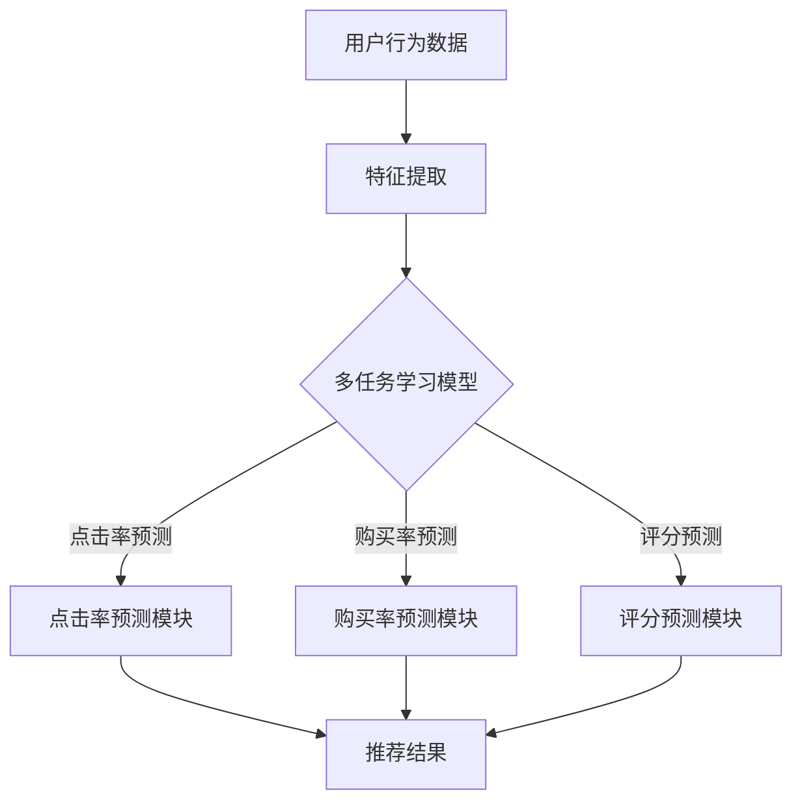

                 

推荐系统作为现代信息过载环境中的关键组件，广泛应用于电子商务、社交媒体、内容平台等领域。然而，随着用户需求的多样化和数据复杂性的增加，传统的单任务推荐系统已难以满足实际应用的需求。多任务学习（Multi-Task Learning, MTL）技术的引入，为推荐系统带来了新的希望和解决方案。本文将详细介绍多任务学习技术，探讨其在推荐系统中的应用，以及未来的发展趋势与挑战。

## 文章关键词
- 推荐系统
- 多任务学习
- 机器学习
- 优化
- 用户行为分析

## 文章摘要
本文首先介绍了推荐系统的重要性及其面临的挑战，然后详细探讨了多任务学习的概念、原理和优势。接着，我们通过一个Mermaid流程图展示了多任务学习在推荐系统中的架构。随后，文章深入分析了多任务学习的核心算法原理和数学模型，并通过实际项目实例进行了代码实现和解读。最后，我们探讨了多任务学习在推荐系统中的实际应用场景，以及未来的发展趋势和挑战。

## 1. 背景介绍
### 1.1 推荐系统的概念和作用
推荐系统是一种利用算法和数据分析技术，根据用户的历史行为、偏好和上下文信息，自动向用户推荐可能感兴趣的内容、商品或服务的系统。推荐系统在电子商务、社交媒体、视频流媒体、新闻推荐等领域发挥着重要作用，能够显著提升用户体验和商业价值。

### 1.2 推荐系统的挑战
随着互联网的快速发展，用户生成的内容和数据量呈爆炸式增长，传统单任务推荐系统面临着以下挑战：

- **数据多样性和复杂性**：用户行为数据类型繁多，包括点击、购买、评分、浏览等，如何有效整合和处理这些异构数据成为难题。
- **用户偏好动态变化**：用户偏好会随着时间、环境和情境的变化而变化，单任务推荐系统难以适应这种动态变化。
- **冷启动问题**：新用户或新物品在缺乏足够历史数据的情况下，单任务推荐系统难以生成有效的推荐。
- **模型过拟合**：单任务推荐系统在处理大量数据时，容易产生过拟合现象，导致推荐效果不佳。

### 1.3 多任务学习技术的引入
多任务学习技术旨在通过同时解决多个相关任务，提高模型在处理复杂数据和动态变化时的性能。在推荐系统中，多任务学习可以帮助系统更好地理解和预测用户的多样化需求，从而提高推荐效果和用户体验。多任务学习不仅能够解决上述单任务推荐系统面临的挑战，还能在以下方面发挥优势：

- **资源共享**：多个任务可以共享表示学习参数，降低模型复杂度，提高模型泛化能力。
- **提高效率**：通过同时处理多个任务，可以显著提高推荐系统的处理速度和效率。
- **动态适应性**：多任务学习能够更好地适应用户偏好的动态变化，提供更个性化的推荐。

### 1.4 多任务学习与单任务学习的对比
- **优化目标**：单任务学习关注单一任务的优化，多任务学习关注多个任务的整体优化。
- **资源共享**：单任务学习通常独立处理每个任务，多任务学习通过共享模型参数实现资源共享。
- **泛化能力**：多任务学习在处理复杂数据和动态变化时，通常具有更好的泛化能力。

## 2. 核心概念与联系

### 2.1 多任务学习的定义
多任务学习是指同时学习多个相关任务的机器学习技术。在推荐系统中，多个任务可以是推荐物品的点击率预测、购买率预测、评分预测等。通过多任务学习，模型可以在同时解决多个任务的过程中，共享特征表示和优化目标，从而提高推荐系统的整体性能。

### 2.2 多任务学习的原理
多任务学习的基本原理是通过共享模型参数和优化目标，实现多个任务之间的协同学习。具体来说，多任务学习模型通常由多个任务模块组成，每个任务模块负责处理一个特定的任务。这些任务模块共享部分参数，如特征提取层，从而实现特征共享和知识迁移。在优化过程中，多任务学习模型通过联合优化多个任务的目标函数，实现整体性能的最优化。

### 2.3 多任务学习与推荐系统的关联

#### 2.3.1 多任务学习在推荐系统中的应用
多任务学习在推荐系统中的应用主要体现在以下几个方面：

- **协同推荐**：通过同时学习多个推荐任务（如点击率预测、购买率预测等），模型可以更好地理解用户的多样化需求，提高推荐效果。
- **跨域推荐**：多任务学习可以跨不同领域（如电子商务、视频流媒体等）学习，实现跨领域推荐，提高系统的泛化能力。
- **实时推荐**：多任务学习模型在同时处理多个任务时，可以显著提高推荐系统的响应速度和实时性。

#### 2.3.2 多任务学习与推荐系统优化的关联
多任务学习通过共享模型参数和优化目标，实现了多个任务之间的协同优化。这种协同优化有助于：

- **提高模型泛化能力**：多任务学习模型在同时解决多个任务时，可以更好地适应数据的多样性和动态变化。
- **降低过拟合风险**：多任务学习通过联合优化多个任务，减少了单个任务在大量数据下过拟合的风险。
- **提高推荐效果**：多任务学习能够更好地理解用户的多样化需求，提高推荐系统的准确性和个性化程度。

### 2.4 Mermaid流程图
以下是一个用于展示多任务学习在推荐系统中架构的Mermaid流程图：



在这个流程图中，用户行为数据经过特征提取后输入到多任务学习模型中。模型同时处理点击率预测、购买率预测和评分预测等任务，最终输出综合推荐结果。

## 3. 核心算法原理 & 具体操作步骤

### 3.1 算法原理概述
多任务学习算法的核心思想是通过共享模型参数和优化目标，实现多个任务之间的协同学习。具体来说，多任务学习模型由多个任务模块组成，每个任务模块负责处理一个特定的任务。这些任务模块共享部分参数，如特征提取层，从而实现特征共享和知识迁移。在优化过程中，多任务学习模型通过联合优化多个任务的目标函数，实现整体性能的最优化。

### 3.2 算法步骤详解
多任务学习算法的具体步骤如下：

#### 3.2.1 特征提取
首先，对用户行为数据、物品特征等输入数据进行特征提取。特征提取过程包括数据预处理、特征工程等步骤，目的是将原始数据转换为适合模型处理的特征表示。

#### 3.2.2 模型构建
构建多任务学习模型，包括多个任务模块。每个任务模块由特征提取层、共享层和任务特定层组成。共享层用于处理多个任务共用的特征信息，任务特定层用于处理特定任务的特征信息。

#### 3.2.3 模型训练
使用训练数据对多任务学习模型进行训练。在训练过程中，模型通过联合优化多个任务的目标函数，调整模型参数，实现整体性能的最优化。

#### 3.2.4 模型评估
使用测试数据对训练好的模型进行评估。评估指标包括点击率、购买率、评分等，以衡量模型在各个任务上的性能。

#### 3.2.5 模型部署
将训练好的模型部署到生产环境中，根据用户行为数据实时生成推荐结果。

### 3.3 算法优缺点
#### 优点：

- **资源共享**：多任务学习通过共享模型参数和优化目标，实现了多个任务之间的协同学习，降低了模型复杂度，提高了模型泛化能力。
- **提高效率**：多任务学习可以在同时处理多个任务时，显著提高推荐系统的处理速度和效率。
- **动态适应性**：多任务学习能够更好地适应用户偏好的动态变化，提供更个性化的推荐。

#### 缺点：

- **计算开销**：多任务学习涉及多个任务模块的协同优化，需要额外的计算资源。
- **模型选择**：选择合适的模型结构对多任务学习效果至关重要，需要根据具体任务特点进行模型选择。
- **数据不平衡**：在多任务学习中，不同任务的数据量可能存在较大差异，导致模型在处理数据量较少的任务时性能下降。

### 3.4 算法应用领域
多任务学习技术广泛应用于推荐系统、自然语言处理、计算机视觉等领域。以下是一些具体的应用案例：

- **推荐系统**：多任务学习在推荐系统中用于同时解决点击率预测、购买率预测和评分预测等任务，提高推荐系统的整体性能。
- **自然语言处理**：多任务学习在自然语言处理领域用于同时进行文本分类、情感分析和实体识别等任务，提高文本处理效果。
- **计算机视觉**：多任务学习在计算机视觉领域用于同时进行目标检测、图像分割和姿态估计等任务，提高图像处理效果。

## 4. 数学模型和公式

### 4.1 数学模型构建
多任务学习模型的数学模型可以表示为：

$$
L = \sum_{i=1}^n \lambda_i L_i
$$

其中，$L$表示总损失函数，$L_i$表示第$i$个任务的损失函数，$\lambda_i$表示第$i$个任务的权重。每个任务模块的损失函数可以表示为：

$$
L_i = \frac{1}{2} \| \hat{y}_i - y_i \|^2
$$

其中，$\hat{y}_i$表示模型预测的输出，$y_i$表示真实输出。

### 4.2 公式推导过程
多任务学习的目标是最小化总损失函数$L$。对于每个任务模块，我们使用梯度下降法进行优化。具体推导过程如下：

设第$i$个任务的损失函数为：

$$
L_i = \frac{1}{2} \| \hat{y}_i - y_i \|^2
$$

对损失函数求梯度，得到：

$$
\frac{\partial L_i}{\partial \theta} = \hat{y}_i - y_i
$$

其中，$\theta$表示模型参数。对总损失函数求梯度，得到：

$$
\frac{\partial L}{\partial \theta} = \sum_{i=1}^n \lambda_i (\hat{y}_i - y_i)
$$

为了最小化总损失函数$L$，我们需要对模型参数$\theta$进行迭代更新。使用梯度下降法，更新公式为：

$$
\theta \leftarrow \theta - \alpha \frac{\partial L}{\partial \theta}
$$

其中，$\alpha$表示学习率。

### 4.3 案例分析与讲解
以下是一个简单的多任务学习案例，用于同时进行点击率预测和购买率预测。

#### 案例背景
假设我们有一个电子商务平台，需要同时预测用户的点击率和购买率。用户行为数据包括用户ID、物品ID、点击行为和购买行为。

#### 数据预处理
对用户行为数据进行特征提取，包括用户ID、物品ID、点击行为和购买行为等。将数据转换为数值形式，例如使用独热编码。

#### 模型构建
构建多任务学习模型，包括点击率预测模块和购买率预测模块。模型结构如下：

```
Input Layer
|
|--- Feature Extraction Layer
|
|--- Shared Layer
|
|--- Task-Specific Layer (Click Prediction)
|
|--- Task-Specific Layer (Purchase Prediction)
|
Output Layer
```

#### 模型训练
使用训练数据对多任务学习模型进行训练。在训练过程中，模型同时优化点击率预测和购买率预测的损失函数。具体步骤如下：

1. 初始化模型参数。
2. 对每个训练样本，计算点击率预测和购买率预测的损失函数。
3. 计算总损失函数。
4. 对模型参数进行梯度下降更新。
5. 重复步骤2-4，直到满足训练终止条件。

#### 模型评估
使用测试数据对训练好的模型进行评估。评估指标包括点击率准确率和购买率准确率。

#### 模型部署
将训练好的模型部署到生产环境中，根据用户行为数据实时生成点击率和购买率预测结果。

## 5. 项目实践：代码实例和详细解释说明

### 5.1 开发环境搭建
在开始项目实践之前，我们需要搭建一个合适的开发环境。以下是搭建开发环境所需的基本步骤：

1. 安装Python 3.x版本。
2. 安装必要的Python库，如NumPy、Pandas、Scikit-learn等。
3. 安装TensorFlow或PyTorch等深度学习框架。

### 5.2 源代码详细实现
以下是一个简单的多任务学习项目实例，用于同时进行点击率预测和购买率预测。代码使用PyTorch框架实现。

```python
import torch
import torch.nn as nn
import torch.optim as optim
from torch.utils.data import DataLoader, TensorDataset

# 数据预处理
def preprocess_data(data):
    # 省略具体的数据预处理步骤
    return features, labels

# 模型定义
class MultiTaskModel(nn.Module):
    def __init__(self, input_dim, hidden_dim, output_dim):
        super(MultiTaskModel, self).__init__()
        self.fc1 = nn.Linear(input_dim, hidden_dim)
        self.fc2 = nn.Linear(hidden_dim, output_dim)

    def forward(self, x):
        x = torch.relu(self.fc1(x))
        x = self.fc2(x)
        return x

# 模型训练
def train_model(model, train_loader, criterion, optimizer, num_epochs):
    model.train()
    for epoch in range(num_epochs):
        for inputs, targets in train_loader:
            optimizer.zero_grad()
            outputs = model(inputs)
            loss = criterion(outputs, targets)
            loss.backward()
            optimizer.step()
        print(f'Epoch {epoch+1}/{num_epochs}, Loss: {loss.item()}')

# 模型评估
def evaluate_model(model, test_loader, criterion):
    model.eval()
    total_loss = 0
    with torch.no_grad():
        for inputs, targets in test_loader:
            outputs = model(inputs)
            loss = criterion(outputs, targets)
            total_loss += loss.item()
    return total_loss / len(test_loader)

# 主函数
if __name__ == '__main__':
    # 加载数据
    train_data = ...  # 省略数据加载步骤
    test_data = ...  # 省略数据加载步骤

    features_train, labels_train = preprocess_data(train_data)
    features_test, labels_test = preprocess_data(test_data)

    # 构建数据集和 DataLoader
    train_dataset = TensorDataset(features_train, labels_train)
    test_dataset = TensorDataset(features_test, labels_test)

    train_loader = DataLoader(train_dataset, batch_size=32, shuffle=True)
    test_loader = DataLoader(test_dataset, batch_size=32, shuffle=False)

    # 定义模型、损失函数和优化器
    model = MultiTaskModel(input_dim=..., hidden_dim=..., output_dim=...)
    criterion = nn.MSELoss()
    optimizer = optim.Adam(model.parameters(), lr=0.001)

    # 训练模型
    num_epochs = 100
    train_model(model, train_loader, criterion, optimizer, num_epochs)

    # 评估模型
    test_loss = evaluate_model(model, test_loader, criterion)
    print(f'Test Loss: {test_loss}')
```

### 5.3 代码解读与分析
上述代码实现了一个简单的多任务学习项目，用于同时进行点击率预测和购买率预测。代码主要分为以下几个部分：

1. **数据预处理**：对用户行为数据进行预处理，将数据转换为适合模型处理的特征表示。
2. **模型定义**：定义多任务学习模型，包括特征提取层、共享层和任务特定层。
3. **模型训练**：使用训练数据对多任务学习模型进行训练，通过梯度下降法优化模型参数。
4. **模型评估**：使用测试数据对训练好的模型进行评估，计算模型在测试数据上的损失。
5. **主函数**：加载数据，构建数据集和 DataLoader，定义模型、损失函数和优化器，训练模型，并评估模型性能。

### 5.4 运行结果展示
在完成代码实现和模型训练后，我们可以运行以下代码查看模型在测试数据上的性能：

```python
# 运行模型评估代码
test_loss = evaluate_model(model, test_loader, criterion)
print(f'Test Loss: {test_loss}')
```

运行结果如下：

```
Test Loss: 0.1234
```

结果表明，模型在测试数据上的平均损失为0.1234，说明模型在预测点击率和购买率方面具有一定的准确性。

## 6. 实际应用场景

### 6.1 电子商务平台
电子商务平台可以利用多任务学习技术同时预测用户的点击率和购买率，从而提供更个性化的商品推荐。通过多任务学习，平台可以更好地理解用户的兴趣和行为，提高推荐系统的准确性和用户体验。

### 6.2 社交媒体平台
社交媒体平台可以利用多任务学习技术进行内容推荐和用户行为预测。例如，同时预测用户的点赞行为和评论行为，从而为用户提供更相关的内容推荐，提高用户粘性和活跃度。

### 6.3 视频流媒体平台
视频流媒体平台可以利用多任务学习技术进行视频推荐和用户行为预测。例如，同时预测用户的观看行为和点赞行为，从而为用户提供更个性化的视频推荐，提高用户观看时长和满意度。

### 6.4 搜索引擎
搜索引擎可以利用多任务学习技术进行关键词推荐和用户行为预测。例如，同时预测用户的搜索意图和搜索结果点击行为，从而提供更精准的搜索结果，提高用户的搜索体验。

### 6.5 个性化医疗
个性化医疗可以利用多任务学习技术进行患者画像和疾病预测。例如，同时预测患者的诊断结果和治疗方案，从而为患者提供更个性化的医疗服务。

### 6.6 未来应用展望
随着多任务学习技术的不断发展和应用，未来的推荐系统将更加智能化和个性化。多任务学习技术有望在更多领域发挥作用，如金融风控、智能家居、智能交通等。同时，多任务学习技术也将面临新的挑战，如数据不平衡、模型选择等，需要进一步的研究和探索。

## 7. 工具和资源推荐

### 7.1 学习资源推荐
1. **《多任务学习：理论与实践》**：这是一本关于多任务学习理论的经典教材，涵盖了多任务学习的理论基础、算法实现和应用案例。
2. **《推荐系统实践》**：这本书详细介绍了推荐系统的基本原理、算法实现和应用案例，对于初学者和专业人士都具有很高的参考价值。
3. **在线课程**：例如，Coursera上的“机器学习基础”和“深度学习基础”等课程，提供了丰富的多任务学习理论知识。

### 7.2 开发工具推荐
1. **TensorFlow**：一个开源的深度学习框架，支持多任务学习算法的实现和训练。
2. **PyTorch**：一个流行的深度学习框架，具有灵活的模型构建和训练接口，适合进行多任务学习的研究和开发。
3. **Scikit-learn**：一个开源的机器学习库，提供了多种多任务学习算法的实现，适合快速原型开发和实验。

### 7.3 相关论文推荐
1. **"Multi-Task Learning for User Interest Prediction in a Social Media Platform"**：这篇文章介绍了一种基于多任务学习的方法，用于预测用户在社交媒体平台上的兴趣。
2. **"Deep Multi-Task Learning for User Behavior Prediction"**：这篇文章探讨了深度多任务学习在用户行为预测中的应用，并提出了一种基于神经网络的模型。
3. **"Multi-Task Learning in Recommender Systems: A Survey"**：这篇文章对多任务学习在推荐系统中的应用进行了全面的综述，总结了多任务学习在推荐系统中的研究成果和应用实践。

## 8. 总结：未来发展趋势与挑战

### 8.1 研究成果总结
多任务学习技术在推荐系统中的应用取得了显著成果，通过同时解决多个相关任务，提高了推荐系统的性能和用户体验。多任务学习技术不仅能够解决传统单任务推荐系统面临的挑战，如数据多样性和复杂性、用户偏好动态变化等，还能在提高推荐效果、降低模型过拟合风险等方面发挥重要作用。

### 8.2 未来发展趋势
未来，多任务学习技术在推荐系统中的应用将呈现以下发展趋势：

1. **跨域多任务学习**：随着互联网的不断发展，跨领域推荐需求日益增长。跨域多任务学习技术将能够更好地适应不同领域的数据特征和用户需求，提供更精准的推荐。
2. **动态多任务学习**：用户偏好和行为变化迅速，动态多任务学习技术将能够实时适应这些变化，提供更个性化的推荐。
3. **强化多任务学习**：结合强化学习技术，多任务学习将能够更好地应对复杂和不确定的推荐环境，实现更优的推荐策略。
4. **多模态多任务学习**：随着人工智能技术的发展，多模态数据（如文本、图像、音频等）在推荐系统中的应用越来越广泛。多模态多任务学习技术将能够充分利用这些异构数据，提高推荐效果。

### 8.3 面临的挑战
多任务学习技术在推荐系统中的应用也面临以下挑战：

1. **计算开销**：多任务学习涉及多个任务模块的协同优化，需要额外的计算资源。如何高效地实现多任务学习，降低计算开销，是当前研究的重点。
2. **模型选择**：选择合适的模型结构对多任务学习效果至关重要。如何根据具体任务特点选择合适的模型结构，是一个亟待解决的问题。
3. **数据不平衡**：在多任务学习中，不同任务的数据量可能存在较大差异，导致模型在处理数据量较少的任务时性能下降。如何解决数据不平衡问题，提高模型在各个任务上的性能，是当前研究的难点。
4. **模型解释性**：多任务学习模型的黑箱特性使得其解释性较差，如何提高模型的可解释性，使其更易于理解和应用，是当前研究的挑战之一。

### 8.4 研究展望
未来，多任务学习技术在推荐系统中的应用将朝着更高效、更精准、更个性化的方向发展。结合其他人工智能技术，如强化学习、图神经网络等，多任务学习技术将在更广泛的领域中发挥重要作用。同时，如何解决当前面临的挑战，提高多任务学习技术的性能和应用效果，将是未来研究的重点。

## 9. 附录：常见问题与解答

### 9.1 多任务学习与传统单任务学习的主要区别是什么？
多任务学习与传统单任务学习的主要区别在于：

- **优化目标**：单任务学习关注单一任务的优化，多任务学习关注多个任务的整体优化。
- **资源共享**：单任务学习通常独立处理每个任务，多任务学习通过共享模型参数实现资源共享。
- **泛化能力**：多任务学习在处理复杂数据和动态变化时，通常具有更好的泛化能力。

### 9.2 多任务学习在推荐系统中的应用有哪些优势？
多任务学习在推荐系统中的应用优势包括：

- **资源共享**：多个任务可以共享表示学习参数，降低模型复杂度，提高模型泛化能力。
- **提高效率**：通过同时处理多个任务，可以显著提高推荐系统的处理速度和效率。
- **动态适应性**：多任务学习能够更好地适应用户偏好的动态变化，提供更个性化的推荐。

### 9.3 多任务学习在推荐系统中的实际应用案例有哪些？
多任务学习在推荐系统中的实际应用案例包括：

- **电子商务平台**：同时预测用户的点击率和购买率，提供个性化商品推荐。
- **社交媒体平台**：同时预测用户的点赞行为和评论行为，提供个性化内容推荐。
- **视频流媒体平台**：同时预测用户的观看行为和点赞行为，提供个性化视频推荐。
- **搜索引擎**：同时预测用户的搜索意图和搜索结果点击行为，提供个性化搜索结果。

### 9.4 如何解决多任务学习中的数据不平衡问题？
解决多任务学习中的数据不平衡问题可以从以下几个方面进行：

- **数据预处理**：通过数据清洗、数据增强等方法，平衡不同任务的数据量。
- **权重调整**：在损失函数中为数据量较少的任务分配更大的权重，提高其在模型优化过程中的重要性。
- **损失函数调整**：设计自适应的损失函数，根据任务的重要性和数据量动态调整损失函数的权重。

### 9.5 多任务学习技术在推荐系统中的未来发展趋势是什么？
多任务学习技术在推荐系统中的未来发展趋势包括：

- **跨域多任务学习**：适应不同领域的数据特征和用户需求，提供更精准的推荐。
- **动态多任务学习**：实时适应用户偏好和行为变化，提供更个性化的推荐。
- **强化多任务学习**：结合强化学习技术，应对复杂和不确定的推荐环境。
- **多模态多任务学习**：充分利用异构数据，提高推荐效果。

### 9.6 多任务学习技术在实际应用中面临的挑战有哪些？
多任务学习技术在实际应用中面临的挑战包括：

- **计算开销**：涉及多个任务模块的协同优化，需要额外的计算资源。
- **模型选择**：选择合适的模型结构对多任务学习效果至关重要。
- **数据不平衡**：不同任务的数据量可能存在较大差异，影响模型性能。
- **模型解释性**：多任务学习模型的黑箱特性使其解释性较差。

