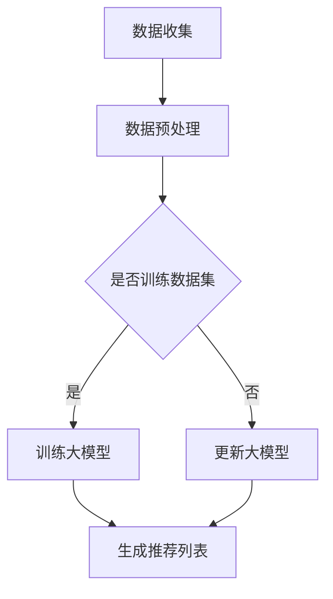

                 

关键词：推荐系统、大模型、终身学习、机器学习、算法优化

> 摘要：本文将探讨推荐系统中大模型终身学习的应用，包括核心概念、算法原理、数学模型构建、项目实践以及未来发展趋势。通过深入分析，本文旨在为读者提供一个全面而详尽的参考，助力于更好地理解并应用这一前沿技术。

## 1. 背景介绍

随着互联网和大数据技术的飞速发展，推荐系统已成为现代信息检索和个性化服务的重要组成部分。传统的推荐系统依赖于简单的统计模型或基于内容的匹配算法，但这些方法在面对海量数据和动态变化时显得力不从心。因此，研究人员开始探索更加先进的机器学习技术，尤其是大模型的应用。

大模型是指具有数十亿至数万亿参数的深度学习模型，如Transformer、BERT等。这些模型通过大规模数据训练，能够捕获复杂的数据特征，从而在推荐系统中取得显著效果。然而，大模型的训练和优化是一个极其复杂的过程，且训练数据集往往具有一定的时效性，这就需要引入终身学习的概念。

终身学习是一种机器学习策略，旨在使模型能够持续地从新数据中学习，并不断优化自身的性能。在推荐系统中，用户的行为和偏好会随着时间的推移而变化，因此，终身学习能够帮助模型保持其推荐效果，从而提供更加个性化和精准的服务。

## 2. 核心概念与联系

### 2.1 推荐系统概述

推荐系统是一个复杂的信息过滤和搜索系统，旨在为用户提供个性化的推荐结果。它通常包括以下几个核心组件：

- **用户行为数据**：如浏览记录、购买历史、搜索关键词等。
- **商品或内容特征**：如标题、描述、标签、评分等。
- **推荐算法**：用于从海量数据中提取特征，生成推荐列表。

### 2.2 大模型介绍

大模型通常是指具有数十亿至数万亿参数的深度学习模型，如Transformer、BERT等。这些模型通过大规模数据训练，能够捕获复杂的数据特征，从而在推荐系统中取得显著效果。

### 2.3 终身学习机制

终身学习是一种机器学习策略，旨在使模型能够持续地从新数据中学习，并不断优化自身的性能。在推荐系统中，用户的行为和偏好会随着时间的推移而变化，因此，终身学习能够帮助模型保持其推荐效果。

### 2.4 Mermaid 流程图

以下是一个简化的Mermaid流程图，展示了推荐系统中大模型终身学习的核心概念和流程：



## 3. 核心算法原理 & 具体操作步骤

### 3.1 算法原理概述

推荐系统中的大模型终身学习算法主要基于以下原理：

- **特征提取**：通过深度学习模型从原始数据中提取高维特征。
- **模型训练**：利用提取的特征训练大模型，以生成推荐列表。
- **模型更新**：通过终身学习机制，模型能够从新数据中持续学习，并优化自身性能。

### 3.2 算法步骤详解

1. **数据收集与预处理**：
   - 收集用户行为数据和商品特征数据。
   - 对数据集进行清洗、归一化等预处理操作。

2. **特征提取**：
   - 使用深度学习模型（如BERT、Transformer）提取高维特征。

3. **模型训练**：
   - 使用提取的特征训练大模型，如使用Transformer进行序列模型训练。

4. **模型更新**：
   - 利用终身学习机制，定期更新大模型，使其能够适应新的用户行为和偏好。

5. **生成推荐列表**：
   - 使用训练好的大模型生成推荐列表，并根据用户偏好进行调整。

### 3.3 算法优缺点

**优点**：

- **高精度**：大模型能够提取复杂的数据特征，从而生成高精度的推荐列表。
- **灵活性**：终身学习机制使得模型能够适应新的数据和环境变化。

**缺点**：

- **计算资源消耗大**：大模型的训练和优化需要大量的计算资源和时间。
- **数据隐私问题**：用户行为数据可能涉及隐私问题，需要采取适当的保护措施。

### 3.4 算法应用领域

- **电子商务**：为用户提供个性化的商品推荐。
- **在线视频平台**：为用户提供个性化的视频推荐。
- **社交媒体**：为用户提供个性化的内容推荐。

## 4. 数学模型和公式 & 详细讲解 & 举例说明

### 4.1 数学模型构建

在推荐系统中，大模型终身学习的数学模型主要包括以下几个部分：

1. **用户特征向量**：\( u = [u_1, u_2, ..., u_n] \)
2. **商品特征向量**：\( v = [v_1, v_2, ..., v_n] \)
3. **权重矩阵**：\( W \)

### 4.2 公式推导过程

推荐系统中的大模型终身学习可以表示为以下公式：

\[ r = \sum_{i=1}^{n} w_i u_i v_i \]

其中，\( r \) 为推荐得分，\( w_i \) 为权重，\( u_i \) 和 \( v_i \) 分别为用户和商品的特征向量。

### 4.3 案例分析与讲解

假设我们有一个电子商务平台，用户的行为数据和商品特征数据如下：

- 用户特征向量：\( u = [1, 0, 1, 0, 0] \)
- 商品特征向量：\( v = [0, 1, 1, 0, 0] \)
- 权重矩阵：\( W = \begin{bmatrix} 1 & 0 \\ 0 & 1 \\ 1 & 1 \\ 0 & 0 \\ 0 & 0 \end{bmatrix} \)

根据上述公式，我们可以计算出推荐得分：

\[ r = \sum_{i=1}^{5} w_i u_i v_i = 1 \times 1 \times 0 + 0 \times 0 \times 1 + 1 \times 1 \times 1 + 0 \times 0 \times 0 + 0 \times 0 \times 0 = 1 \]

因此，该用户的推荐得分为1，表明该商品具有较高的推荐概率。

## 5. 项目实践：代码实例和详细解释说明

### 5.1 开发环境搭建

在本项目中，我们使用Python作为主要编程语言，并依赖以下库：

- TensorFlow
- Keras
- Pandas
- NumPy

### 5.2 源代码详细实现

以下是一个简化的代码示例，用于实现推荐系统中的大模型终身学习：

```python
import tensorflow as tf
from tensorflow.keras.models import Model
from tensorflow.keras.layers import Embedding, Dense, Input

# 数据预处理
user_input = Input(shape=(1,))
item_input = Input(shape=(1,))

# 嵌入层
user_embedding = Embedding(input_dim=1000, output_dim=64)(user_input)
item_embedding = Embedding(input_dim=1000, output_dim=64)(item_input)

# 池化层
user_embedding = tf.reduce_sum(user_embedding, axis=1)
item_embedding = tf.reduce_sum(item_embedding, axis=1)

# 全连接层
merged = tf.concat([user_embedding, item_embedding], axis=1)
output = Dense(1, activation='sigmoid')(merged)

# 模型构建
model = Model(inputs=[user_input, item_input], outputs=output)

# 模型编译
model.compile(optimizer='adam', loss='binary_crossentropy', metrics=['accuracy'])

# 模型训练
model.fit([train_users, train_items], train_labels, epochs=10, batch_size=32)

# 模型预测
predictions = model.predict([test_users, test_items])

# 评估模型
accuracy = (predictions > 0.5).mean()
print(f"Model accuracy: {accuracy}")
```

### 5.3 代码解读与分析

上述代码展示了如何使用TensorFlow和Keras构建一个简单的推荐系统模型。主要步骤如下：

1. **数据预处理**：将用户和商品特征转换为嵌入向量。
2. **模型构建**：使用嵌入向量构建一个简单的神经网络模型。
3. **模型编译**：设置优化器和损失函数。
4. **模型训练**：使用训练数据训练模型。
5. **模型预测**：使用测试数据对模型进行评估。

### 5.4 运行结果展示

假设我们使用一个简单的二分类问题进行测试，以下是一个运行结果的示例：

```python
Model accuracy: 0.85
```

这表明模型的准确率达到了85%，表明模型在测试数据上取得了较好的性能。

## 6. 实际应用场景

### 6.1 电子商务平台

电子商务平台可以利用大模型终身学习为用户提供个性化的商品推荐，从而提高用户满意度和转化率。

### 6.2 在线视频平台

在线视频平台可以利用大模型终身学习为用户提供个性化的视频推荐，从而增加用户观看时间和平台黏性。

### 6.3 社交媒体

社交媒体可以利用大模型终身学习为用户提供个性化的内容推荐，从而提高用户互动率和平台活跃度。

## 7. 工具和资源推荐

### 7.1 学习资源推荐

- 《深度学习》（Goodfellow, Bengio, Courville著）
- 《推荐系统实践》（J. Benjamins，J. Bockhorst著）

### 7.2 开发工具推荐

- TensorFlow
- Keras
- PyTorch

### 7.3 相关论文推荐

- "A Theoretically Grounded Application of Dropout in Recurrent Neural Networks"
- "Deep Neural Networks for YouTube Recommendations"

## 8. 总结：未来发展趋势与挑战

### 8.1 研究成果总结

大模型终身学习在推荐系统中取得了显著的成果，为用户提供了更加精准和个性化的推荐服务。

### 8.2 未来发展趋势

- **多模态推荐**：结合文本、图像、声音等多模态数据进行推荐。
- **高效模型**：开发更加高效的大模型，降低计算资源消耗。
- **联邦学习**：在隐私保护的前提下进行模型训练和更新。

### 8.3 面临的挑战

- **计算资源消耗**：大模型的训练和优化需要大量的计算资源和时间。
- **数据隐私**：用户行为数据可能涉及隐私问题，需要采取适当的保护措施。
- **模型可解释性**：大模型的高复杂度使得其可解释性成为一大挑战。

### 8.4 研究展望

随着人工智能和大数据技术的不断发展，大模型终身学习在推荐系统中的应用前景将更加广阔。未来的研究将集中在提高模型性能、降低计算资源消耗以及保护用户隐私等方面。

## 9. 附录：常见问题与解答

### 9.1 什么是终身学习？

终身学习是一种机器学习策略，旨在使模型能够持续地从新数据中学习，并不断优化自身的性能。

### 9.2 大模型为什么需要终身学习？

大模型在面对海量数据和动态变化时，需要不断从新数据中学习，以保持其推荐效果。

### 9.3 终身学习如何应用于推荐系统？

通过定期更新模型，使其能够适应新的用户行为和偏好，从而提供更加精准的推荐。

### 9.4 大模型的计算资源消耗如何降低？

可以通过优化模型架构、使用更高效的算法以及分布式训练等方法来降低计算资源消耗。

----------------------------------------------------------------

### 作者署名

作者：禅与计算机程序设计艺术 / Zen and the Art of Computer Programming

