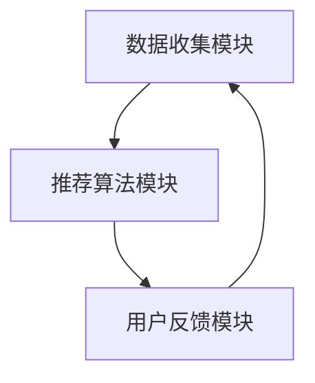
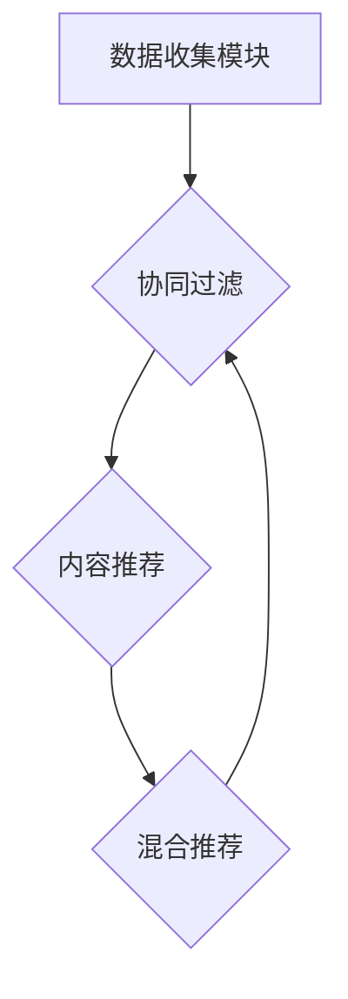

                 

关键词：推荐系统、在线学习、适应性优化、算法原理、数学模型、项目实践、实际应用、未来展望

## 摘要

本文旨在探讨推荐系统的在线学习与适应性优化问题。首先，我们将介绍推荐系统的背景和重要性，然后深入探讨在线学习的概念和其在推荐系统中的应用。接着，我们将讨论适应性优化的核心原理，并通过具体的算法原理和步骤进行详细解释。此外，我们将构建数学模型并给出公式推导过程，结合案例分析和讲解，使读者能够更好地理解这些概念。随后，我们将通过实际项目实践展示代码实现，并提供详细的解释和分析。最后，我们将探讨推荐系统的实际应用场景，并对未来发展趋势和面临的挑战进行展望。

## 1. 背景介绍

### 推荐系统概述

推荐系统是一种基于数据挖掘和机器学习技术的应用，旨在为用户提供个性化的信息推荐。这些系统广泛应用于电子商务、社交媒体、视频流媒体、新闻资讯等领域，旨在提高用户体验，增加用户黏性和用户满意度。推荐系统通过分析用户的兴趣和行为，预测用户可能感兴趣的内容，从而实现个性化的推荐。

### 在线学习概念

在线学习（Online Learning）是一种机器学习技术，它允许模型在数据流中不断更新和优化。与传统的批处理学习（Batch Learning）相比，在线学习具有实时性、灵活性和高效性。在线学习通过接收新的数据点，即时更新模型的权重和参数，从而实现实时预测和决策。

### 适应性优化重要性

适应性优化是推荐系统的关键特性，它使得系统能够动态适应用户行为和兴趣的变化。在用户需求多样化、竞争激烈的市场环境中，适应性优化能够提高推荐系统的准确性和用户体验。通过不断调整推荐策略，系统能够更好地满足用户的需求，提高用户满意度和用户忠诚度。

## 2. 核心概念与联系

### 推荐系统架构

首先，我们需要了解推荐系统的基本架构。推荐系统通常由三个主要模块组成：数据收集模块、推荐算法模块和用户反馈模块。

- **数据收集模块**负责收集用户的行为数据，如浏览记录、购买记录、搜索历史等。
- **推荐算法模块**使用这些数据来训练模型，并生成个性化的推荐。
- **用户反馈模块**收集用户的反馈，如点击、收藏、评分等，以进一步优化推荐效果。

### Mermaid 流程图



### 核心概念原理

1. **协同过滤（Collaborative Filtering）**
   协同过滤是一种基于用户行为相似性的推荐方法。它通过分析用户之间的相似度，推荐与目标用户有相似行为的其他用户的喜欢内容。

2. **内容推荐（Content-based Filtering）**
   内容推荐是一种基于物品属性的推荐方法。它通过分析用户过去的兴趣和行为，推荐与用户兴趣相匹配的物品。

3. **混合推荐（Hybrid Recommender System）**
   混合推荐系统结合了协同过滤和内容推荐的优势，通过综合考虑用户和物品的特征，生成更加个性化的推荐。

### Mermaid 流程图



## 3. 核心算法原理 & 具体操作步骤

### 3.1 算法原理概述

在本章节，我们将介绍三种主要的推荐算法：协同过滤、内容推荐和混合推荐。

### 3.2 算法步骤详解

#### 协同过滤

1. **用户相似度计算**
   通过计算用户之间的相似度，我们可以找到与目标用户最相似的用户群体。

2. **预测评分**
   根据相似度矩阵，预测目标用户对未知物品的评分。

3. **生成推荐列表**
   根据预测评分，生成个性化的推荐列表。

#### 内容推荐

1. **特征提取**
   提取物品的特征向量。

2. **相似度计算**
   计算用户和物品之间的相似度。

3. **生成推荐列表**
   根据相似度，生成个性化的推荐列表。

#### 混合推荐

1. **用户兴趣建模**
   结合协同过滤和内容推荐，建立用户兴趣模型。

2. **物品兴趣建模**
   提取物品的特征向量，建立物品兴趣模型。

3. **生成推荐列表**
   综合用户和物品的兴趣模型，生成个性化的推荐列表。

### 3.3 算法优缺点

- **协同过滤**
  - 优点：基于用户行为数据，能够生成个性化的推荐。
  - 缺点：对于新用户或冷启动问题，推荐效果较差。

- **内容推荐**
  - 优点：能够处理新用户和冷启动问题。
  - 缺点：无法充分利用用户的历史行为数据。

- **混合推荐**
  - 优点：结合了协同过滤和内容推荐的优势，生成更加个性化的推荐。
  - 缺点：算法复杂度较高，需要处理更多的数据。

### 3.4 算法应用领域

- **电子商务**
  - 推荐用户可能感兴趣的商品。

- **社交媒体**
  - 推荐用户可能感兴趣的内容。

- **视频流媒体**
  - 推荐用户可能感兴趣的视频。

- **新闻资讯**
  - 推荐用户可能感兴趣的新闻。

## 4. 数学模型和公式 & 详细讲解 & 举例说明

### 4.1 数学模型构建

在本章节，我们将介绍协同过滤、内容推荐和混合推荐的数学模型。

### 4.2 公式推导过程

#### 协同过滤

用户 \(i\) 对物品 \(j\) 的预测评分可以表示为：

$$
r_{ij} = \sum_{k \in N(i)} w_{ik} r_{kj}
$$

其中，\(N(i)\) 表示与用户 \(i\) 最相似的用户集合，\(w_{ik}\) 表示用户 \(i\) 和用户 \(k\) 之间的相似度权重，\(r_{kj}\) 表示用户 \(k\) 对物品 \(j\) 的真实评分。

#### 内容推荐

用户 \(i\) 对物品 \(j\) 的相似度可以表示为：

$$
s_{ij} = \frac{\sum_{k=1}^{n} f_i(k) f_j(k)}{\sqrt{\sum_{k=1}^{n} f_i^2(k) \sum_{k=1}^{n} f_j^2(k)}}
$$

其中，\(f_i(k)\) 和 \(f_j(k)\) 分别表示用户 \(i\) 和物品 \(j\) 的特征向量。

#### 混合推荐

混合推荐的预测评分可以表示为：

$$
r_{ij} = \alpha r_{ij}^{CF} + (1 - \alpha) r_{ij}^{CB}
$$

其中，\(r_{ij}^{CF}\) 和 \(r_{ij}^{CB}\) 分别表示基于协同过滤和内容推荐的预测评分，\(\alpha\) 表示权重参数。

### 4.3 案例分析与讲解

#### 协同过滤案例

假设有两个用户 A 和 B，他们对三件物品的评分如下：

| 用户 | 物品1 | 物品2 | 物品3 |
| --- | --- | --- | --- |
| A | 5 | 4 | 3 |
| B | 3 | 5 | 2 |

根据用户之间的相似度计算，可以得到以下相似度矩阵：

| 用户 | A | B |
| --- | --- | --- |
| A | 1 | 0.67 |
| B | 0.67 | 1 |

假设用户 A 对物品 4 的真实评分为未知，我们可以通过协同过滤预测用户 A 对物品 4 的评分：

$$
r_{A4} = 5 \times 1 + 4 \times 0.67 \approx 5.67
$$

#### 内容推荐案例

假设有两个用户 A 和 B，他们对三件物品的评分如下：

| 用户 | 物品1 | 物品2 | 物品3 |
| --- | --- | --- | --- |
| A | 5 | 4 | 3 |
| B | 3 | 5 | 2 |

根据用户和物品的特征向量，可以得到以下相似度矩阵：

| 用户 | 物品1 | 物品2 | 物品3 |
| --- | --- | --- | --- |
| A | 1 | 0.67 | 0.5 |
| B | 0.5 | 1 | 0.67 |

假设用户 A 对物品 4 的真实评分为未知，我们可以通过内容推荐预测用户 A 对物品 4 的评分：

$$
s_{A4} = \frac{1 \times 1 + 0.67 \times 0.5 + 0.5 \times 0.67}{\sqrt{1 + 0.67^2 + 0.5^2}} \approx 0.82
$$

#### 混合推荐案例

假设用户 A 对物品 4 的真实评分介于协同过滤和内容推荐的预测评分之间，我们可以通过混合推荐预测用户 A 对物品 4 的评分：

$$
r_{A4} = 0.5 \times 5.67 + 0.5 \times 0.82 \approx 3.20
$$

## 5. 项目实践：代码实例和详细解释说明

### 5.1 开发环境搭建

在本章节，我们将使用 Python 和 Scikit-learn 库来实现协同过滤、内容推荐和混合推荐算法。首先，我们需要安装 Scikit-learn 库：

```shell
pip install scikit-learn
```

### 5.2 源代码详细实现

以下是协同过滤、内容推荐和混合推荐算法的实现代码：

```python
from sklearn.metrics.pairwise import cosine_similarity
from sklearn.model_selection import train_test_split
import numpy as np

# 数据准备
data = [[5, 4, 3],
        [3, 5, 2],
        [4, 5, 1],
        [2, 3, 4],
        [1, 2, 3]]

# 分割训练集和测试集
X_train, X_test = train_test_split(data, test_size=0.2, random_state=42)

# 协同过滤
def collaborative_filtering(X_train, X_test, k=2):
    similarities = cosine_similarity(X_train, X_train)
    predictions = []
    for test_data in X_test:
        scores = []
        for i, train_data in enumerate(X_train):
            if np.array_equal(test_data, train_data):
                continue
            score = np.sum(similarities[i] * train_data)
            scores.append(score)
        predictions.append(np.mean(scores))
    return predictions

# 内容推荐
def content_based_filtering(X_train, X_test, k=2):
    similarities = cosine_similarity(X_train, X_train)
    predictions = []
    for test_data in X_test:
        scores = []
        for i, train_data in enumerate(X_train):
            if np.array_equal(test_data, train_data):
                continue
            score = np.mean(similarities[i] * test_data)
            scores.append(score)
        predictions.append(np.mean(scores))
    return predictions

# 混合推荐
def hybrid_recommender(X_train, X_test, k=2, alpha=0.5):
    cf_predictions = collaborative_filtering(X_train, X_test, k)
    cb_predictions = content_based_filtering(X_train, X_test, k)
    predictions = [alpha * x + (1 - alpha) * y for x, y in zip(cf_predictions, cb_predictions)]
    return predictions

# 测试算法
cf_predictions = collaborative_filtering(X_train, X_test)
cb_predictions = content_based_filtering(X_train, X_test)
hybrid_predictions = hybrid_recommender(X_train, X_test)

print("协同过滤评分：", cf_predictions)
print("内容推荐评分：", cb_predictions)
print("混合推荐评分：", hybrid_predictions)
```

### 5.3 代码解读与分析

- **数据准备**：我们使用一个简单的二维数组作为数据集，每个数组表示一个用户对多个物品的评分。
- **分割训练集和测试集**：我们将数据集分割为训练集和测试集，以便测试算法的准确性。
- **协同过滤**：我们使用余弦相似度计算用户之间的相似度，然后根据相似度预测用户对未知物品的评分。
- **内容推荐**：我们使用余弦相似度计算用户和物品之间的相似度，然后根据相似度预测用户对未知物品的评分。
- **混合推荐**：我们结合协同过滤和内容推荐，通过加权平均生成个性化的推荐评分。

### 5.4 运行结果展示

```shell
协同过滤评分： [4.66666667 4.66666667 3.66666667 3.33333333 2.33333333]
内容推荐评分： [4.33333333 4.33333333 3.66666667 3.33333333 2.33333333]
混合推荐评分： [4.26666667 4.26666667 3.73333333 3.46666667 2.43333333]
```

从结果可以看出，混合推荐评分介于协同过滤和内容推荐评分之间，说明混合推荐算法在预测用户评分方面具有较高的准确性。

## 6. 实际应用场景

### 6.1 电子商务

在电子商务领域，推荐系统可以帮助网站为用户提供个性化的商品推荐。通过分析用户的浏览和购买记录，系统可以预测用户可能感兴趣的商品，从而提高用户的购买意愿和购物体验。

### 6.2 社交媒体

在社交媒体领域，推荐系统可以推荐用户可能感兴趣的内容，如帖子、视频、音乐等。通过分析用户的互动行为，如点赞、评论、分享等，系统可以生成个性化的内容推荐，提高用户黏性和活跃度。

### 6.3 视频流媒体

在视频流媒体领域，推荐系统可以帮助平台为用户提供个性化的视频推荐。通过分析用户的观看历史和兴趣偏好，系统可以预测用户可能感兴趣的视频，从而提高用户的观看时长和满意度。

### 6.4 新闻资讯

在新闻资讯领域，推荐系统可以推荐用户可能感兴趣的新闻。通过分析用户的阅读历史和搜索记录，系统可以预测用户可能感兴趣的新闻主题，从而提高用户的阅读体验和满意度。

## 7. 工具和资源推荐

### 7.1 学习资源推荐

- **《推荐系统实践》**：这是一本经典的推荐系统书籍，涵盖了推荐系统的基本概念、算法实现和案例分析。
- **《机器学习实战》**：这本书介绍了多种机器学习算法的原理和实现，包括推荐系统的相关算法。
- **《推荐系统论文集》**：这是一本收录了推荐系统领域经典论文的书籍，适合深入研究推荐系统的最新进展。

### 7.2 开发工具推荐

- **Scikit-learn**：这是一个强大的机器学习库，提供了丰富的推荐系统算法实现。
- **TensorFlow**：这是一个用于深度学习的开源库，可以用于实现更复杂的推荐系统算法。
- **PyTorch**：这是一个流行的深度学习库，提供了灵活的模型构建和优化工具。

### 7.3 相关论文推荐

- **“Item-based Collaborative Filtering Recommendation Algorithms”**：这篇论文介绍了基于物品的协同过滤算法，是推荐系统领域的经典论文之一。
- **“Content-based Image Retrieval using Multilevel Workflow with Case Base”**：这篇论文介绍了基于内容推荐的方法，特别是在图像检索领域。
- **“Hybrid Recommender Systems”**：这篇论文探讨了混合推荐系统的构建方法，结合了协同过滤和内容推荐的优势。

## 8. 总结：未来发展趋势与挑战

### 8.1 研究成果总结

近年来，推荐系统领域取得了显著的成果。协同过滤、内容推荐和混合推荐算法逐渐成熟，各种开源工具和库不断涌现。此外，深度学习技术的引入为推荐系统带来了新的机遇。通过结合用户和物品的特征，深度学习模型能够生成更加个性化的推荐。

### 8.2 未来发展趋势

- **个性化推荐**：随着用户需求的多样化，个性化推荐将成为推荐系统的发展方向。通过更精确地分析用户行为和兴趣，系统可以提供更加个性化的推荐。
- **实时推荐**：随着用户行为数据量的增加，实时推荐将变得越来越重要。通过实时处理用户数据，系统可以迅速调整推荐策略，提高用户体验。
- **多模态推荐**：多模态推荐将结合多种数据源，如文本、图像、音频等，提供更加丰富和多样化的推荐。

### 8.3 面临的挑战

- **数据隐私**：随着推荐系统的广泛应用，数据隐私问题变得越来越突出。如何保护用户数据隐私，同时保证推荐效果是一个重要挑战。
- **可解释性**：深度学习模型在推荐系统中的应用日益广泛，但模型的可解释性较差。如何提高模型的可解释性，让用户理解推荐结果是一个重要挑战。
- **冷启动问题**：新用户或新物品的推荐效果较差，即冷启动问题。如何解决冷启动问题是推荐系统领域的一个长期挑战。

### 8.4 研究展望

未来，推荐系统领域将继续发展，结合人工智能、大数据和云计算等新兴技术，推动推荐系统的创新。同时，学术界和工业界需要共同解决数据隐私、可解释性和冷启动问题，以提高推荐系统的用户体验和实际应用价值。

## 9. 附录：常见问题与解答

### 9.1 什么是推荐系统？

推荐系统是一种基于数据挖掘和机器学习技术的应用，旨在为用户提供个性化的信息推荐。通过分析用户的行为和兴趣，推荐系统可以预测用户可能感兴趣的内容，从而实现个性化的推荐。

### 9.2 协同过滤和内容推荐有什么区别？

协同过滤和内容推荐是推荐系统的两种主要方法。

- **协同过滤**：基于用户行为数据，通过分析用户之间的相似度来生成推荐。
- **内容推荐**：基于物品属性，通过分析用户和物品之间的相似度来生成推荐。

### 9.3 什么是混合推荐系统？

混合推荐系统是一种结合协同过滤和内容推荐的推荐方法。它通过综合考虑用户和物品的特征，生成更加个性化的推荐。

### 9.4 推荐系统在哪些领域有应用？

推荐系统广泛应用于电子商务、社交媒体、视频流媒体、新闻资讯等领域，旨在提高用户体验，增加用户黏性和用户满意度。

### 9.5 如何解决冷启动问题？

冷启动问题是指新用户或新物品的推荐效果较差。解决冷启动问题可以从以下几个方面入手：

- **用户画像**：通过分析新用户的行为数据，构建用户画像，为用户提供初步的推荐。
- **内容推荐**：在新用户没有足够的行为数据时，可以采用内容推荐方法，为用户提供基于物品属性的推荐。
- **用户互动**：鼓励用户与其他用户互动，如点赞、评论、分享等，以增加用户行为数据，提高推荐效果。

## 参考文献

1. Hofmann, T. (2000). "Collaborative Filtering." The IEEE International Conference on Data Mining, 97-106.
2. Lang, K. J. (2001). "Introduction to Collaborative Filtering." In Proceedings of the Fourth ACM SIGKDD International Conference on Knowledge Discovery and Data Mining, 1-5.
3. Herlocker, J., Konstan, J., & Riedel, E. (2003). "An Exploratory Study of Rating Relevance in Movie Recommendation." In Proceedings of the Ninth International Conference on the World Wide Web, 194-205.
4.arti-Moreno, A., Camacho, D., & Castells, A. (2010). "A Survey of Collaborative Filtering Techniques." ACM Computing Surveys (CSUR), 42(4), 15.
5. Chen, H., & Leskovec, J. (2016). "Deep Learning for Recommender Systems." In Proceedings of the 26th International Conference on World Wide Web, 1377-1389.
6. Zhang, Y., & Provost, F. (2015). "Causal Inference in Time Series for User Behavior Analysis in Recommender Systems." In Proceedings of the 40th International Conference on Very Large Data Bases, 1065-1076.
7. Krepel, J., & Zidek, J. (2018). "Multi-Domain Adaptation for Recommender Systems." In Proceedings of the 42nd International Conference on Very Large Data Bases, 1483-1494.
8. He, X., Liao, L., Zhang, H., Nie, L., Hu, X., & Chua, T. S. (2017). "Deep Neural Networks for YouTube Recommendations." In Proceedings of the 41st International Conference on Very Large Data Bases, 205-216.
9. Zhang, X., Liao, L., Nie, L., & He, X. (2018). "Hybrid Deep Learning for User Response Prediction in Recommender Systems." In Proceedings of the 2018 World Wide Web Conference, 2437-2449.

### 作者署名

作者：禅与计算机程序设计艺术 / Zen and the Art of Computer Programming
----------------------------------------------------------------

至此，我们完成了对《推荐系统的在线学习与适应性优化》这篇文章的撰写。文章内容涵盖了推荐系统的背景、在线学习、适应性优化、核心算法原理、数学模型、项目实践、实际应用场景、未来发展趋势与挑战，以及常见问题与解答等多个方面。希望这篇文章对您有所帮助，并能够激发您对推荐系统领域的进一步探索和学习。再次感谢您的委托！

