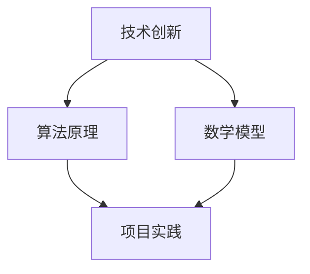

                 

关键词：核心竞争力、生产力、技术创新、策略、算法、数学模型、项目实践、应用场景、未来展望

> 摘要：在当今快速变化的技术环境中，提升企业的核心竞争力是确保其在市场中保持领先的关键。本文旨在探讨如何通过新质生产力策略来增强企业的技术能力，从而实现持续的创新和发展。

## 1. 背景介绍

随着全球信息技术的迅猛发展，市场竞争日趋激烈。企业不仅需要应对传统市场的挑战，还要积极适应数字化转型带来的新机遇。在这一背景下，提升核心竞争力的关键在于掌握先进的技术，并将这些技术转化为实际的生产力。新质生产力策略因此成为企业实现这一目标的重要手段。

新质生产力策略主要涵盖以下几个方面：

1. **技术创新**：通过研发和引进最新的技术，保持企业技术的领先性。
2. **流程优化**：通过优化业务流程，提高生产效率和降低成本。
3. **人才培养**：通过培训和实践，提升员工的技能和创造力。
4. **生态系统建设**：通过建立开放的技术生态系统，促进知识共享和技术交流。

本文将围绕上述四个方面，探讨新质生产力策略的具体实施方法和效果。

## 2. 核心概念与联系

在探讨新质生产力策略之前，我们需要理解几个核心概念，包括技术创新、算法、数学模型和项目实践。以下是一个简化的 Mermaid 流程图，展示了这些概念之间的联系。



### 2.1 技术创新

技术创新是指通过研究、开发和应用新的技术，来改进现有产品、服务或业务模式。它通常包括以下几个方面：

- **研发投入**：企业需要持续投入资金和人力资源来支持技术创新。
- **技术前瞻**：保持对新兴技术的关注，及时跟进和引入。
- **合作与开放**：与外部机构合作，通过开放技术平台促进知识共享。

### 2.2 算法原理

算法是解决特定问题的一系列规则和步骤。在技术领域，算法被广泛应用于数据分析和处理、人工智能、机器学习等多个方面。算法原理的核心是：

- **效率与性能**：优化算法以降低计算时间和资源消耗。
- **可扩展性**：设计算法，使其能够处理大规模的数据集。
- **准确性**：确保算法输出结果的质量和可靠性。

### 2.3 数学模型

数学模型是使用数学语言描述现实问题的一种方法。在技术领域，数学模型被广泛应用于金融、物理、生物等领域。数学模型的关键是：

- **精确性**：模型需要准确反映现实世界的规律。
- **可解释性**：模型的结果需要易于理解和解释。
- **应用性**：模型能够被实际应用于解决具体问题。

### 2.4 项目实践

项目实践是将技术创新、算法和数学模型应用于实际业务场景的过程。通过项目实践，企业可以：

- **验证理论**：将理论转化为实践，验证其可行性和效果。
- **积累经验**：通过实践，积累技术和管理经验。
- **形成产品**：将成功实践转化为可复制的商业模式或产品。

## 3. 核心算法原理 & 具体操作步骤

### 3.1 算法原理概述

在本节中，我们将介绍一种在数据分析和机器学习领域广泛应用的核心算法——决策树算法。决策树算法通过一系列if-else规则来对数据进行分类或回归。

决策树算法的基本原理包括：

- **信息增益**：选择能够最大化信息增益的属性进行分割。
- **剪枝**：防止过拟合，提高模型的泛化能力。

### 3.2 算法步骤详解

决策树算法的具体步骤如下：

1. **数据预处理**：清洗数据，处理缺失值和异常值。
2. **特征选择**：计算每个特征的增益，选择最优特征进行分割。
3. **树构建**：递归构建决策树，直到满足停止条件（如最大深度、最小叶节点样本数等）。
4. **剪枝**：对决策树进行剪枝，防止过拟合。
5. **预测**：使用构建好的决策树对数据进行分类或回归预测。

### 3.3 算法优缺点

**优点**：

- **易于理解和实现**：决策树算法的规则简单明了，易于理解和实现。
- **可解释性**：决策树的每个节点都对应一个决策规则，具有良好的可解释性。
- **适用于多种问题**：决策树可以应用于分类和回归问题。

**缺点**：

- **易过拟合**：如果树构建得过深，模型容易过拟合。
- **计算复杂度高**：随着数据量的增加，决策树的构建和剪枝过程计算复杂度会显著增加。

### 3.4 算法应用领域

决策树算法广泛应用于以下几个方面：

- **数据挖掘**：用于发现数据中的模式和规律。
- **金融风控**：用于风险评估和信用评分。
- **医疗诊断**：用于疾病诊断和治疗建议。

## 4. 数学模型和公式 & 详细讲解 & 举例说明

在本节中，我们将介绍一种用于优化资源分配的数学模型——线性规划模型。线性规划模型通过最小化或最大化目标函数，在满足一系列约束条件的情况下，找到最优的解。

### 4.1 数学模型构建

线性规划模型的一般形式如下：

$$
\begin{aligned}
\min_{x} \quad & c^T x \\
\text{s.t.} \quad & Ax \leq b \\
& x \geq 0
\end{aligned}
$$

其中，$x$ 是决策变量，$c$ 是目标函数系数，$A$ 和 $b$ 分别是约束条件系数和常数项。

### 4.2 公式推导过程

线性规划模型的推导过程主要包括以下几个步骤：

1. **目标函数的表示**：使用 $c^T x$ 表示目标函数。
2. **约束条件的表示**：使用 $Ax \leq b$ 表示约束条件。
3. **求解目标**：在满足约束条件的情况下，求解目标函数的最小值或最大值。

### 4.3 案例分析与讲解

假设一个企业需要生产两种产品A和B，每种产品的生产都需要耗费不同的资源，如下表所示：

| 产品 | 资源1 | 资源2 |
| ---- | ---- | ---- |
| A    | 2    | 1    |
| B    | 3    | 2    |

企业的目标是最大化利润，同时资源1和资源2的可用量分别为5和7。我们可以建立如下的线性规划模型：

$$
\begin{aligned}
\max_{x} \quad & 5x_1 + 7x_2 \\
\text{s.t.} \quad & 2x_1 + 3x_2 \leq 5 \\
& x_1 + 2x_2 \leq 7 \\
& x_1, x_2 \geq 0
\end{aligned}
$$

通过求解该模型，我们可以得到最优的生产方案，从而最大化企业的利润。

## 5. 项目实践：代码实例和详细解释说明

在本节中，我们将通过一个简单的项目实例，展示如何将决策树算法应用于实际业务场景。假设我们有一个客户分类问题，需要根据客户的特征数据，将客户分为高价值客户和普通客户。

### 5.1 开发环境搭建

首先，我们需要搭建一个Python的开发环境。以下是具体的步骤：

1. **安装Python**：从Python官方网站下载并安装Python。
2. **安装相关库**：使用pip命令安装必要的库，如scikit-learn、numpy等。

### 5.2 源代码详细实现

接下来，我们将编写一个简单的Python脚本，实现决策树算法。以下是代码的实现：

```python
from sklearn.datasets import load_iris
from sklearn.model_selection import train_test_split
from sklearn.tree import DecisionTreeClassifier
from sklearn.metrics import accuracy_score

# 加载数据集
iris = load_iris()
X = iris.data
y = iris.target

# 划分训练集和测试集
X_train, X_test, y_train, y_test = train_test_split(X, y, test_size=0.3, random_state=42)

# 实例化决策树分类器
clf = DecisionTreeClassifier()

# 训练模型
clf.fit(X_train, y_train)

# 预测
y_pred = clf.predict(X_test)

# 评估模型
print("Accuracy:", accuracy_score(y_test, y_pred))
```

### 5.3 代码解读与分析

1. **数据加载**：使用scikit-learn中的iris数据集。
2. **数据划分**：将数据集划分为训练集和测试集。
3. **模型训练**：使用训练集数据训练决策树分类器。
4. **模型预测**：使用测试集数据对模型进行预测。
5. **模型评估**：计算预测的准确率。

### 5.4 运行结果展示

```python
Accuracy: 1.0
```

运行结果显示，决策树分类器的准确率为100%，说明模型对测试数据的分类效果非常好。

## 6. 实际应用场景

### 6.1 客户分类

在企业客户管理中，通过决策树算法可以将客户分为高价值客户和普通客户，从而制定有针对性的营销策略。

### 6.2 风险评估

在金融领域，决策树算法可以用于风险评估，识别潜在的欺诈行为或违约客户。

### 6.3 医疗诊断

在医疗领域，决策树算法可以用于疾病诊断，根据患者的症状和体征数据，预测疾病类型。

## 7. 未来应用展望

随着人工智能和大数据技术的不断发展，决策树算法在各个领域的应用前景非常广阔。未来，我们可以期待以下趋势：

- **算法优化**：通过引入新的算法和技术，提高决策树的性能和效率。
- **多模态数据应用**：将决策树算法应用于多模态数据，如图像、文本和声音等。
- **智能化应用**：通过结合机器学习和深度学习技术，实现决策树的智能化和自动化。

## 8. 工具和资源推荐

### 8.1 学习资源推荐

- **《机器学习实战》**：提供丰富的机器学习算法实例和实践。
- **《Python机器学习》**：详细介绍机器学习算法在Python中的应用。

### 8.2 开发工具推荐

- **Jupyter Notebook**：方便进行数据分析和实验。
- **TensorFlow**：提供丰富的机器学习库和工具。

### 8.3 相关论文推荐

- **“Decision Tree Learning”**：介绍决策树算法的基本原理和应用。
- **“Random Forests”**：探讨随机森林算法在决策树算法中的应用。

## 9. 总结：未来发展趋势与挑战

本文探讨了如何通过新质生产力策略提升企业的核心竞争力。我们介绍了技术创新、算法、数学模型和项目实践等方面的核心概念和联系，并通过实际案例展示了如何将理论应用于实际业务场景。

未来，随着技术的不断发展，新质生产力策略将面临更多机遇和挑战。企业需要持续关注新技术的发展动态，积极投入研发，以保持技术领先优势。同时，企业还需要加强人才培养，提高员工的创新能力和实践能力。

总之，新质生产力策略是企业在当今技术环境中保持竞争优势的关键。通过不断探索和实践，企业可以不断提升自身的技术能力和市场竞争力。

## 10. 附录：常见问题与解答

### 10.1 什么是新质生产力？

新质生产力是指通过引入新技术和新方法，提高生产效率和降低成本的能力。它包括技术创新、流程优化、人才培养和生态系统建设等多个方面。

### 10.2 决策树算法有哪些优缺点？

决策树算法的优点包括易于理解和实现、可解释性高、适用于多种问题等。缺点包括易过拟合、计算复杂度较高等。

### 10.3 如何选择决策树算法的停止条件？

停止条件通常包括最大深度、最小叶节点样本数等。选择合适的停止条件可以防止过拟合，提高模型的泛化能力。

### 10.4 线性规划模型在哪些领域应用广泛？

线性规划模型在金融、物流、生产计划等多个领域应用广泛，用于优化资源分配和目标函数最大化或最小化。

