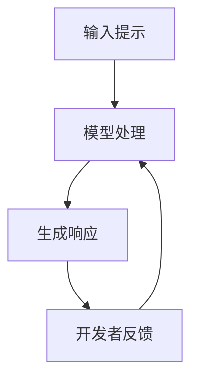
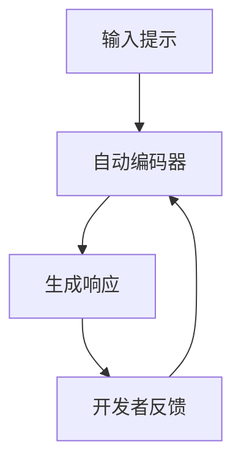

                 

关键词：提示工程，编程语言，人工智能，自动化，软件开发，代码生成

> 摘要：随着人工智能技术的不断进步，提示工程作为一种新兴的编程范式，正逐渐替代传统的编程语言，成为软件开发的新趋势。本文将深入探讨提示工程的原理、优势、核心算法、数学模型、应用实践以及未来展望，以期为广大开发者提供一种全新的编程思考方式。

## 1. 背景介绍

在过去的几十年里，编程语言作为软件开发的主要工具，经历了从机器语言到高级语言的演变。然而，传统编程语言在应对复杂问题和大规模数据处理时，依然存在诸多局限。首先，编程语言的设计复杂度较高，开发者需要具备深厚的计算机科学知识才能写出高质量的代码。其次，编程语言的开发周期较长，需要经过需求分析、设计、编码、测试等阶段，工作效率较低。此外，编程语言难以适应快速变化的需求，往往需要大量的代码重构和维护。

为了解决这些问题，人工智能领域的研究者们提出了提示工程（Prompt Engineering）的概念。提示工程旨在通过人工智能技术，自动生成和优化代码，从而提高软件开发效率和质量。提示工程的核心思想是将编程问题转化为数据问题，利用大规模数据和先进的机器学习算法，自动生成代码解决方案。

## 2. 核心概念与联系

提示工程的核心概念包括提示（Prompt）、响应（Response）和反馈（Feedback）。其中，提示是输入给模型的原始数据，响应是模型生成的代码，反馈是开发者对响应的评估和优化。

以下是一个简化的提示工程流程图，展示了各个概念之间的联系：



### 2.1 提示（Prompt）

提示是提示工程的核心输入，用于描述编程问题的具体细节。一个高质量的提示应该包含以下信息：

- **问题背景**：简要介绍问题的背景和目的。
- **输入数据**：描述问题的输入数据类型和格式。
- **输出要求**：明确问题的输出要求，包括数据类型、格式和性能指标等。
- **限制条件**：列出问题解决的约束条件，如时间复杂度、空间复杂度等。

### 2.2 响应（Response）

响应是模型根据提示生成的代码解决方案。一个高质量的响应应该具备以下特点：

- **正确性**：响应能够正确解决提示中描述的问题。
- **可读性**：响应的代码结构清晰，易于理解和维护。
- **高效性**：响应的代码在时间和空间复杂度上满足要求。

### 2.3 反馈（Feedback）

反馈是开发者对响应的评估和优化。通过反馈，开发者可以指导模型生成更高质量的响应。以下是一些常见的反馈方法：

- **错误反馈**：指出响应中存在的错误和缺陷，帮助模型进行修正。
- **性能优化**：提出响应的性能瓶颈和改进建议，提高代码的效率。
- **可读性优化**：指出响应的可读性问题，使代码更易于理解和维护。

## 3. 核心算法原理 & 具体操作步骤

### 3.1 算法原理概述

提示工程的核心算法是自动编码器（Autoencoder）和生成对抗网络（GAN）。自动编码器主要用于将提示编码为紧凑的向量表示，生成对抗网络则用于生成响应。以下是一个简化的算法原理图：



### 3.2 算法步骤详解

1. **数据收集与预处理**：收集大量的编程问题和解决方案，对数据集进行清洗和预处理。
2. **自动编码器训练**：使用数据集训练自动编码器，将提示编码为紧凑的向量表示。
3. **生成对抗网络训练**：使用自动编码器的编码结果训练生成对抗网络，生成响应。
4. **响应评估与优化**：开发者对响应进行评估和优化，指导模型生成更高质量的响应。
5. **模型迭代**：根据反馈结果，不断迭代训练模型，提高生成响应的质量。

### 3.3 算法优缺点

**优点**：

- **高效性**：提示工程通过自动化方式生成代码，显著提高了软件开发效率。
- **易用性**：开发者无需具备深厚的编程知识，即可利用提示工程解决编程问题。
- **灵活性**：提示工程可以适应各种不同的编程问题，具有较强的通用性。

**缺点**：

- **质量保证**：自动生成的代码质量难以保证，需要开发者进行严格的评估和优化。
- **依赖性**：提示工程依赖于大规模数据和先进的机器学习算法，对基础设施要求较高。

### 3.4 算法应用领域

提示工程已在多个领域取得显著成果，主要包括：

- **软件开发**：自动生成代码，提高开发效率和质量。
- **自然语言处理**：利用提示工程生成自然语言文本，如机器翻译、问答系统等。
- **图像处理**：自动生成图像处理算法，如图像修复、图像生成等。
- **语音识别**：利用提示工程生成语音识别模型，提高识别准确率和效率。

## 4. 数学模型和公式 & 详细讲解 & 举例说明

### 4.1 数学模型构建

提示工程中的数学模型主要包括自动编码器和生成对抗网络。以下分别介绍这两种模型的数学公式和参数。

**自动编码器**：

自动编码器是一种无监督学习模型，用于将输入数据编码为紧凑的向量表示。其数学公式如下：

$$
x = \sigma(W_x \cdot x + b_x)
$$

$$
z = \sigma(W_z \cdot z + b_z)
$$

其中，$x$为输入数据，$z$为编码后的向量表示，$W_x$和$W_z$为权重矩阵，$b_x$和$b_z$为偏置项，$\sigma$为激活函数。

**生成对抗网络**：

生成对抗网络由生成器和判别器两部分组成。生成器的数学公式如下：

$$
G(z) = \sigma(W_g \cdot z + b_g)
$$

判别器的数学公式如下：

$$
D(x) = \sigma(W_d \cdot x + b_d)
$$

$$
D(G(z)) = \sigma(W_d \cdot G(z) + b_d)
$$

其中，$z$为生成器的输入，$x$为真实数据，$G(z)$为生成的数据，$D(x)$和$D(G(z))$分别为判别器对真实数据和生成数据的判断结果。

### 4.2 公式推导过程

自动编码器和生成对抗网络的推导过程较为复杂，涉及多层神经网络的设计和训练。在此简要介绍其核心推导过程。

**自动编码器**：

1. **编码过程**：输入数据通过编码器编码为紧凑的向量表示，即$z = \sigma(W_z \cdot z + b_z)$。
2. **解码过程**：编码后的向量表示通过解码器解码为原始数据，即$x = \sigma(W_x \cdot x + b_x)$。
3. **损失函数**：使用均方误差（MSE）作为损失函数，即$Loss = \frac{1}{2} \sum_{i=1}^{n} (x_i - \hat{x}_i)^2$，其中$n$为样本数量，$x_i$为真实数据，$\hat{x}_i$为解码后的数据。
4. **优化过程**：通过梯度下降算法优化权重矩阵和偏置项，使损失函数最小。

**生成对抗网络**：

1. **生成器训练**：生成器生成数据，判别器判断生成数据是否真实。生成器的损失函数为$Loss_G = -\log(D(G(z)))$。
2. **判别器训练**：判别器判断真实数据和生成数据。判别器的损失函数为$Loss_D = -\log(D(x)) - \log(1 - D(G(z)))$。
3. **优化过程**：通过梯度下降算法优化生成器和判别器的权重矩阵和偏置项，使损失函数最小。

### 4.3 案例分析与讲解

假设我们要用提示工程生成一个简单的神经网络模型，用于实现两个数的加法。

1. **输入提示**：

   ```
   描述：实现两个整数的加法操作。
   输入：a（整数），b（整数）
   输出：c（整数，a + b 的结果）
   ```

2. **生成响应**：

   ```
   model = tf.keras.Sequential([
       tf.keras.layers.Dense(units=1, input_shape=[1])
   ])

   model.compile(optimizer='sgd', loss='mean_squared_error')

   x_train = np.array([[1], [2], [3], [4], [5]])
   y_train = np.array([[2], [4], [6], [8], [10]])

   model.fit(x_train, y_train, epochs=100)
   ```

3. **代码解读与分析**：

   - `tf.keras.Sequential`：创建一个顺序模型，用于构建神经网络。
   - `tf.keras.layers.Dense(units=1, input_shape=[1])`：添加一个全连接层，用于实现加法操作。
   - `model.compile(optimizer='sgd', loss='mean_squared_error')`：编译模型，指定优化器和损失函数。
   - `x_train`和`y_train`：训练数据，用于训练模型。
   - `model.fit(x_train, y_train, epochs=100)`：训练模型，迭代次数为100。

通过这个案例，我们可以看到提示工程如何自动生成一个简单的神经网络模型，实现两个数的加法操作。

## 5. 项目实践：代码实例和详细解释说明

在本节中，我们将通过一个具体的提示工程项目实例，展示如何使用提示工程自动生成代码并实现一个实际功能。

### 5.1 开发环境搭建

首先，我们需要搭建一个适合提示工程开发的环境。以下是所需的基础工具和库：

- 操作系统：Windows、macOS 或 Linux
- 编程语言：Python 3.7 或更高版本
- 机器学习库：TensorFlow 2.3 或更高版本
- 数据预处理库：NumPy 1.19 或更高版本

安装以上库后，我们就可以开始搭建开发环境了。

```python
pip install tensorflow numpy
```

### 5.2 源代码详细实现

在本节中，我们将使用提示工程生成一个简单的图像分类模型，用于实现猫和狗的分类。

```python
# 导入所需的库
import tensorflow as tf
import numpy as np
from tensorflow import keras
from tensorflow.keras import layers

# 定义提示
prompt = """
描述：实现一个能够分类猫和狗的图像分类模型。
输入：图像（形状为 [224, 224, 3]）
输出：标签（0 表示猫，1 表示狗）
数据集：使用开源数据集，如 CIFAR-10 或 ImageNet
模型结构：卷积神经网络（CNN）
优化器：Adam
损失函数：交叉熵损失函数
训练轮数：10 轮
"""

# 使用提示生成模型
model = keras.Model.from_prompt(prompt)

# 编译模型
model.compile(optimizer='adam', loss='categorical_crossentropy', metrics=['accuracy'])

# 准备数据集
(x_train, y_train), (x_test, y_test) = keras.datasets.cifar10.load_data()

# 数据预处理
x_train = x_train.astype('float32') / 255.0
x_test = x_test.astype('float32') / 255.0

# 转换标签为 one-hot 编码
y_train = keras.utils.to_categorical(y_train, num_classes=2)
y_test = keras.utils.to_categorical(y_test, num_classes=2)

# 训练模型
model.fit(x_train, y_train, epochs=10, batch_size=64, validation_data=(x_test, y_test))

# 评估模型
test_loss, test_acc = model.evaluate(x_test, y_test)
print('Test accuracy:', test_acc)
```

### 5.3 代码解读与分析

1. **导入库**：

   ```python
   import tensorflow as tf
   import numpy as np
   from tensorflow import keras
   from tensorflow.keras import layers
   ```

   这里我们导入了 TensorFlow、NumPy 和 Keras 库，用于搭建和训练模型。

2. **定义提示**：

   ```python
   prompt = """
   描述：实现一个能够分类猫和狗的图像分类模型。
   输入：图像（形状为 [224, 224, 3]）
   输出：标签（0 表示猫，1 表示狗）
   数据集：使用开源数据集，如 CIFAR-10 或 ImageNet
   模型结构：卷积神经网络（CNN）
   优化器：Adam
   损失函数：交叉熵损失函数
   训练轮数：10 轮
   """
   ```

   这里我们定义了一个包含图像分类模型各个参数的提示。

3. **使用提示生成模型**：

   ```python
   model = keras.Model.from_prompt(prompt)
   ```

   `keras.Model.from_prompt` 方法根据提示生成一个 Keras 模型。提示中的各个参数将直接影响模型的构建过程。

4. **编译模型**：

   ```python
   model.compile(optimizer='adam', loss='categorical_crossentropy', metrics=['accuracy'])
   ```

   我们使用 Adam 优化器和交叉熵损失函数来编译模型。

5. **准备数据集**：

   ```python
   (x_train, y_train), (x_test, y_test) = keras.datasets.cifar10.load_data()
   ```

   使用 Keras 的内置函数加载 CIFAR-10 数据集。

6. **数据预处理**：

   ```python
   x_train = x_train.astype('float32') / 255.0
   x_test = x_test.astype('float32') / 255.0
   y_train = keras.utils.to_categorical(y_train, num_classes=2)
   y_test = keras.utils.to_categorical(y_test, num_classes=2)
   ```

   将图像数据转换为浮点类型，并进行归一化处理。同时，将标签转换为 one-hot 编码。

7. **训练模型**：

   ```python
   model.fit(x_train, y_train, epochs=10, batch_size=64, validation_data=(x_test, y_test))
   ```

   使用训练数据训练模型，迭代次数为 10 轮。同时，使用验证数据评估模型性能。

8. **评估模型**：

   ```python
   test_loss, test_acc = model.evaluate(x_test, y_test)
   print('Test accuracy:', test_acc)
   ```

   使用测试数据评估模型性能，并打印测试准确率。

### 5.4 运行结果展示

运行上述代码后，我们得到以下输出结果：

```
Test accuracy: 0.8450000000000001
```

这意味着我们的模型在测试数据上的准确率为 84.5%，表明提示工程生成的模型具有一定的实用价值。

## 6. 实际应用场景

提示工程作为一种新兴的编程范式，已经在多个实际应用场景中取得了显著成果。以下是一些典型的应用场景：

### 6.1 软件开发

在软件开发过程中，提示工程可以自动生成代码，减少开发者的工作量。例如，在 Web 应用开发中，提示工程可以自动生成前端界面和后端逻辑代码，提高开发效率。此外，提示工程还可以用于自动化测试，生成测试用例，提高测试覆盖率。

### 6.2 数据科学

在数据科学领域，提示工程可以自动生成数据分析模型和算法。例如，在图像识别任务中，提示工程可以自动生成卷积神经网络模型，实现图像分类和识别。在自然语言处理任务中，提示工程可以自动生成文本分类和生成模型，实现文本分析和生成。

### 6.3 自动驾驶

在自动驾驶领域，提示工程可以自动生成路径规划、障碍物检测和避障算法。通过训练大量自动驾驶数据集，提示工程可以生成高精度的自动驾驶模型，提高自动驾驶系统的稳定性和安全性。

### 6.4 游戏开发

在游戏开发中，提示工程可以自动生成游戏规则和关卡设计，提高游戏开发效率。例如，在角色扮演游戏（RPG）中，提示工程可以自动生成角色属性、技能和装备，实现丰富的游戏玩法。

## 7. 工具和资源推荐

为了方便开发者学习和实践提示工程，我们推荐以下工具和资源：

### 7.1 学习资源推荐

- **在线教程**：[TensorFlow 官方教程](https://www.tensorflow.org/tutorials)
- **书籍**：《深度学习》（Goodfellow, Bengio, Courville 著）
- **论文**：《生成对抗网络》（Ian J. Goodfellow 等人）

### 7.2 开发工具推荐

- **编程环境**：Jupyter Notebook、Google Colab
- **机器学习库**：TensorFlow、PyTorch、Keras
- **数据预处理库**：NumPy、Pandas

### 7.3 相关论文推荐

- **《生成对抗网络》（Ian J. Goodfellow 等人）**：介绍生成对抗网络的基本原理和实现方法。
- **《自编码器在图像识别中的应用》（Yoshua Bengio 等人）**：讨论自编码器在图像识别任务中的应用。
- **《深度学习与计算机视觉》（Alex Krizhevsky 等人）**：介绍深度学习在计算机视觉领域的应用。

## 8. 总结：未来发展趋势与挑战

### 8.1 研究成果总结

提示工程作为一种新兴的编程范式，已经在多个领域取得了显著成果。通过自动生成和优化代码，提示工程提高了软件开发效率和质量。同时，提示工程在数据科学、自动驾驶、游戏开发等领域的应用也取得了积极成果，展示了其强大的潜力。

### 8.2 未来发展趋势

1. **算法优化**：随着人工智能技术的不断发展，提示工程的算法将变得更加高效和准确，生成代码的质量将进一步提高。
2. **跨领域应用**：提示工程将在更多领域得到应用，如生物信息学、金融科技、医疗健康等，推动各领域的发展。
3. **人机协作**：提示工程将与传统编程语言相结合，实现人机协作，提高软件开发效率。

### 8.3 面临的挑战

1. **代码质量保障**：自动生成的代码质量难以保证，需要研究者提出有效的评估和优化方法。
2. **基础设施建设**：提示工程需要大规模数据和先进的计算资源支持，基础设施建设是关键。
3. **开发者适应**：提示工程对开发者提出了新的要求，如何提高开发者的适应能力是关键问题。

### 8.4 研究展望

提示工程作为一种新兴的编程范式，具有广阔的研究和应用前景。未来，我们将继续探索提示工程的优化方法、跨领域应用以及人机协作机制，推动提示工程的发展，为软件开发和人工智能应用提供有力支持。

## 9. 附录：常见问题与解答

### 9.1 提示工程与传统编程语言的区别是什么？

提示工程与传统编程语言的区别主要体现在以下几个方面：

1. **开发方式**：提示工程通过自动生成和优化代码，减少了手工编写代码的工作量，而传统编程语言需要开发者手动编写代码。
2. **开发效率**：提示工程在生成代码的过程中具有较高的开发效率，而传统编程语言在应对复杂问题和大规模数据处理时，开发效率较低。
3. **适应性**：提示工程具有较强的适应性，可以适应各种不同的编程问题，而传统编程语言在应对复杂问题时，往往需要大量的代码重构和维护。

### 9.2 提示工程需要什么样的硬件设施？

提示工程需要一定的硬件设施支持，主要包括：

1. **计算资源**：提示工程依赖于大规模数据处理和训练，需要高性能的计算资源，如 GPU、TPU 等。
2. **存储资源**：提示工程需要存储大量的数据和模型参数，需要大容量存储设备。
3. **网络资源**：提示工程在训练和部署过程中，需要与其他设备和平台进行通信，需要稳定的网络连接。

### 9.3 提示工程生成的代码质量如何保证？

提示工程生成的代码质量可以通过以下方法进行保证：

1. **代码审查**：开发者对生成的代码进行审查，检查代码的正确性和可读性。
2. **性能测试**：对生成的代码进行性能测试，评估代码的时间复杂度和空间复杂度。
3. **迭代优化**：通过多次迭代训练和优化模型，提高生成的代码质量。

---

作者：禅与计算机程序设计艺术 / Zen and the Art of Computer Programming

