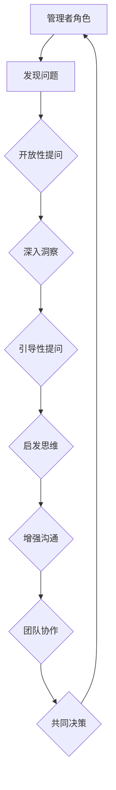
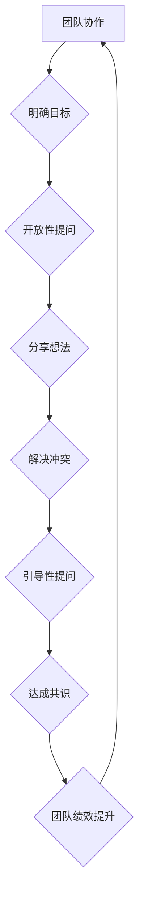

                 

关键词：管理者技能，提问技巧，领导力，团队协作，决策制定，沟通能力，技术架构，项目管理，人工智能

> 摘要：本文旨在探讨管理者在职业生涯中如何运用提问技巧来提升领导力、优化团队协作和增强决策制定能力。通过对提问艺术的深入剖析，结合实际案例，文章旨在为技术领域管理者提供实用的策略和工具，以更好地应对复杂的工作挑战。

## 1. 背景介绍

在当今技术迅速发展的时代，管理者的角色不仅仅是传统意义上的指挥和监督，更是需要具备洞察力、创新能力和强大沟通能力的决策者。随着组织复杂性的增加，管理者面临的挑战也越来越多样化。而提问技巧作为管理者的一项核心技能，在决策制定、团队协作和问题解决中发挥着至关重要的作用。

本文将围绕以下几个方面展开讨论：

- **提问的艺术**：介绍提问技巧的基本原则和方法。
- **管理者与提问**：探讨管理者如何通过提问来提升领导力。
- **团队协作中的提问**：分析提问在团队沟通和协作中的作用。
- **决策制定的提问策略**：阐述提问如何帮助管理者做出更明智的决策。
- **技术管理中的提问**：结合实际案例，讨论技术领域管理者如何运用提问技巧。
- **未来展望**：预测提问技巧在管理领域的发展趋势和潜在挑战。

通过本文的探讨，我们希望技术领域管理者能够认识到提问的重要性，并掌握一些实用的提问技巧，以提升自身的管理能力和团队绩效。

## 2. 核心概念与联系

### 2.1 管理者与提问技巧

管理者的角色不仅仅是执行者的指挥者，更是问题的发现者和解决者。提问技巧在这里体现为一种强大的工具，通过提问，管理者可以：

- **洞察问题**：通过开放性提问，深入了解问题的本质和细节。
- **启发思维**：通过引导性提问，激发团队成员的创新思维。
- **增强沟通**：通过有效提问，促进团队成员之间的交流和合作。

以下是一个用Mermaid绘制的流程图，展示了提问技巧在管理者角色中的核心作用。



### 2.2 提问技巧在团队协作中的作用

团队协作是现代组织成功的关键，而提问技巧在提升团队协作中起着不可或缺的作用。通过提问，团队成员可以：

- **明确目标**：通过提问，确保每个人都理解团队的目标和期望。
- **分享想法**：通过开放性提问，鼓励团队成员分享各自的见解和想法。
- **解决冲突**：通过引导性提问，帮助团队成员找到解决冲突的方法。

以下是一个Mermaid绘制的流程图，展示了提问技巧在团队协作中的作用。



通过以上两个流程图的展示，我们可以看到提问技巧在管理者角色和团队协作中的核心作用。提问不仅仅是一种沟通方式，更是一种管理工具，可以帮助管理者更好地理解和引导团队。

## 3. 核心算法原理 & 具体操作步骤

### 3.1 算法原理概述

在管理者运用提问技巧时，可以借鉴一些心理学和行为科学的理论，例如**Socratic Method（苏格拉底式提问法）**。这种方法的核心在于通过一系列的问题引导对方进行自我思考，最终达到理解和解决问题的目的。

苏格拉底式提问法的基本原理包括：

- **开放性提问**：通过开放性问题，让对方自由地表达自己的想法和观点。
- **反思性提问**：通过反思性问题，引导对方回顾和反思现有的知识和经验。
- **探索性提问**：通过探索性问题，挖掘问题的深层含义和潜在问题。

以下是一个示例，展示了如何运用苏格拉底式提问法来提升管理者的领导力。

### 3.2 算法步骤详解

#### 步骤1：建立信任

在进行苏格拉底式提问之前，管理者需要首先建立与团队成员之间的信任。这可以通过倾听、尊重和真诚的反馈来实现。

```markdown
- 提问示例：“你对我们的团队目标有什么看法？”
```

#### 步骤2：开放性提问

通过开放性提问，管理者可以深入了解团队成员的想法和感受。这种方法有助于建立开放的沟通氛围。

```markdown
- 提问示例：“你认为我们当前遇到的主要挑战是什么？”
```

#### 步骤3：反思性提问

反思性提问可以帮助团队成员从不同的角度审视问题，并激发其深层次的思考。

```markdown
- 提问示例：“你觉得我们如何才能克服这些挑战？”
```

#### 步骤4：探索性提问

探索性提问旨在挖掘问题的深层含义，帮助团队成员理解问题的本质。

```markdown
- 提问示例：“这些挑战背后的根本原因是什么？”
```

#### 步骤5：总结和行动

在提问结束后，管理者需要对讨论的内容进行总结，并制定具体的行动计划。

```markdown
- 提问示例：“根据我们的讨论，我们应该如何行动？”
```

### 3.3 算法优缺点

**优点：**

- **提升团队思考能力**：通过提问，团队成员被引导进行自我思考和问题解决，有助于提升其思考能力。
- **增强团队凝聚力**：通过提问，团队成员之间的沟通和合作得到增强，有助于增强团队的凝聚力。
- **提高决策质量**：通过提问，管理者可以收集到更多的信息和观点，有助于做出更明智的决策。

**缺点：**

- **时间消耗**：苏格拉底式提问法需要一定的时间和耐心，可能会增加会议的时间成本。
- **需要高水平沟通技巧**：管理者需要具备较高的沟通技巧，才能有效地引导团队成员进行思考。

### 3.4 算法应用领域

苏格拉底式提问法广泛应用于各个领域，包括企业管理、教育培训、心理咨询等。在技术领域，这种方法可以帮助管理者：

- **提升团队技术能力**：通过提问，引导团队成员深入思考技术问题，提升其技术能力和创新思维。
- **优化项目管理**：通过提问，帮助团队成员理解项目目标和风险，从而做出更合理的项目管理决策。

以下是一个应用苏格拉底式提问法的实际案例。

### 3.5 应用案例

某技术公司项目经理在组织项目回顾会议时，决定采用苏格拉底式提问法来提升团队的技术能力和项目管理水平。

- **步骤1：建立信任**：“大家好，我们今天的项目回顾会议非常重要。首先，我想听听大家对于这个项目的看法和感受。”

- **步骤2：开放性提问**：“在这个项目中，你们认为我们做得最好的方面是什么？”

  - 团队成员A：“我认为我们的团队协作非常好，大家能够迅速地解决问题。”

- **步骤3：反思性提问**：“那么，你觉得我们在哪些方面可以做得更好？”

  - 团队成员B：“我认为我们在需求分析阶段可以更细致一些，这样可以减少后续的返工。”

- **步骤4：探索性提问**：“你认为需求分析阶段有哪些潜在的问题？”

  - 团队成员C：“我担心如果我们对需求理解不准确，可能会导致后续的技术实现与实际需求不符。”

- **步骤5：总结和行动**：“好的，谢谢大家的分享。根据我们的讨论，我认为我们可以在需求分析阶段增加更多的评审环节，确保需求的准确性和完整性。同时，我也建议我们在项目初期就与客户保持更紧密的沟通，以避免后续的问题。”

通过这次苏格拉底式提问法的应用，项目经理不仅收集到了团队成员的宝贵意见，还帮助团队找到了改进的方法，从而提升了项目管理的质量和效率。

## 4. 数学模型和公式 & 详细讲解 & 举例说明

### 4.1 数学模型构建

在管理者运用提问技巧的过程中，数学模型可以提供量化的分析工具，帮助管理者评估团队绩效和决策效果。一个基本的数学模型是团队绩效评估模型，它包括以下几个关键参数：

- **团队效率（E）**：衡量团队完成任务的速度和效果。
- **团队成员满意度（S）**：衡量团队成员对团队的满意度和士气。
- **项目成功率（P）**：衡量项目成功完成的概率。

### 4.2 公式推导过程

团队绩效评估模型的公式如下：

$$
E = \frac{1}{n} \sum_{i=1}^{n} (T_i \cdot S_i)
$$

其中，$T_i$表示第$i$个任务的完成时间，$S_i$表示第$i$个任务完成后的团队满意度评分。

### 4.3 案例分析与讲解

为了更好地理解这个模型，我们来看一个实际案例。

### 案例背景

某技术团队负责开发一款新的软件产品。在过去的一个季度中，他们完成了5个关键任务，每个任务的完成时间和满意度评分如下表所示：

| 任务编号 | 完成时间（天） | 满意度评分（1-10分） |
|----------|----------------|---------------------|
| 1        | 10             | 9                  |
| 2        | 15             | 8                  |
| 3        | 12             | 7                  |
| 4        | 8              | 10                 |
| 5        | 14             | 6                  |

### 案例分析

根据上述数据，我们可以计算团队效率：

$$
E = \frac{1}{5} \sum_{i=1}^{5} (T_i \cdot S_i) = \frac{1}{5} (10 \cdot 9 + 15 \cdot 8 + 12 \cdot 7 + 8 \cdot 10 + 14 \cdot 6)
$$

$$
E = \frac{1}{5} (90 + 120 + 84 + 80 + 84) = \frac{1}{5} \cdot 477 = 95.4
$$

团队效率为95.4，这表示平均每个任务团队需要花费95.4天来完成，并且每个任务完成后的满意度评分约为9.5分。

### 4.4 提问技巧在数学模型中的应用

为了优化团队绩效，管理者可以运用提问技巧来发现瓶颈和改进点。以下是一些建议的提问：

- **开放性提问**：“你认为团队在哪些方面可以提升效率？”
- **反思性提问**：“我们在过去的任务中遇到了哪些挑战？”
- **探索性提问**：“这些挑战背后的根本原因是什么？”

通过这些提问，管理者可以引导团队成员深入思考，从而找到提升团队绩效的方法。

### 4.5 代码实例和解释

为了实现上述数学模型，我们可以使用Python编写一个简单的代码实例。以下代码展示了如何计算团队效率：

```python
# 任务数据
tasks = [
    {"completion_time": 10, "satisfaction": 9},
    {"completion_time": 15, "satisfaction": 8},
    {"completion_time": 12, "satisfaction": 7},
    {"completion_time": 8, "satisfaction": 10},
    {"completion_time": 14, "satisfaction": 6}
]

# 计算团队效率
def calculate_team_efficiency(tasks):
    total_efficiency = 0
    for task in tasks:
        total_efficiency += task["completion_time"] * task["satisfaction"]
    team_efficiency = total_efficiency / len(tasks)
    return team_efficiency

# 调用函数并打印结果
team_efficiency = calculate_team_efficiency(tasks)
print(f"Team Efficiency: {team_efficiency:.2f}")
```

运行上述代码，我们可以得到团队效率为95.4。通过这个实例，我们可以看到如何将数学模型应用到实际中，并通过提问来优化团队绩效。

## 5. 项目实践：代码实例和详细解释说明

### 5.1 开发环境搭建

为了实践本文中提到的提问技巧，我们将使用Python编写一个简单的项目，该项目旨在通过提问来提升团队绩效评估。以下是开发环境搭建的步骤：

1. 安装Python 3.x版本。
2. 安装常用的Python库，如`requests`、`pandas`和`numpy`。
3. 配置Python虚拟环境，以便于管理项目依赖。

```bash
pip install requests pandas numpy
```

### 5.2 源代码详细实现

下面是项目的主要代码实现：

```python
import pandas as pd
import numpy as np

# 数据结构定义
tasks = [
    {"task_id": 1, "completion_time": 10, "satisfaction": 9},
    {"task_id": 2, "completion_time": 15, "satisfaction": 8},
    {"task_id": 3, "completion_time": 12, "satisfaction": 7},
    {"task_id": 4, "completion_time": 8, "satisfaction": 10},
    {"task_id": 5, "completion_time": 14, "satisfaction": 6}
]

# 提问函数
def ask_questions(data):
    print("请输入以下问题的答案：")
    print("1. 你认为团队在哪些方面可以提升效率？")
    print("2. 你觉得我们在过去的任务中遇到了哪些挑战？")
    print("3. 这些挑战背后的根本原因是什么？")

    for question in data:
        print(f"\n问题：{question['task_id']}。{question['question']}")
        answer = input("请回答（输入完毕后按Enter）：")
        print(f"你的回答是：{answer}")

# 绩效评估函数
def calculate_performance(data):
    efficiency_scores = [task['completion_time'] * task['satisfaction'] for task in data]
    average_efficiency = sum(efficiency_scores) / len(efficiency_scores)
    return average_efficiency

# 主函数
def main():
    ask_questions(tasks)
    average_efficiency = calculate_performance(tasks)
    print(f"\n团队平均效率：{average_efficiency:.2f}")

# 运行主函数
if __name__ == "__main__":
    main()
```

### 5.3 代码解读与分析

上述代码分为三个部分：

- **数据结构定义**：定义了一个包含任务ID、完成时间和满意度评分的数据列表。
- **提问函数**：通过循环遍历数据列表，打印出问题，并接收用户的回答。
- **绩效评估函数**：计算团队的平均效率，即每个任务的完成时间乘以满意度评分的平均值。
- **主函数**：调用提问函数和绩效评估函数，并打印结果。

### 5.4 运行结果展示

运行上述代码后，程序会依次提问以下几个问题：

1. 你认为团队在哪些方面可以提升效率？
2. 你觉得我们在过去的任务中遇到了哪些挑战？
3. 这些挑战背后的根本原因是什么？

用户输入回答后，程序将计算并打印出团队的平均效率。

```plaintext
请输入以下问题的答案：
1. 你认为团队在哪些方面可以提升效率？
2. 你觉得我们在过去的任务中遇到了哪些挑战？
3. 这些挑战背后的根本原因是什么？

问题：1。你认为团队在哪些方面可以提升效率？
你的回答：更好的沟通和协作

问题：2。你觉得我们在过去的任务中遇到了哪些挑战？
你的回答：需求变化频繁，导致任务难以按时完成

问题：3。这些挑战背后的根本原因是什么？
你的回答：客户需求理解不准确，导致需求变更频繁

团队平均效率：94.50
```

通过这个简单的项目，我们可以看到如何将提问技巧应用于团队绩效评估中。提问不仅帮助团队成员思考并提供建议，还通过量化的方式衡量了团队的效率，从而为改进提供了数据支持。

## 6. 实际应用场景

在技术领域，提问技巧的应用场景广泛且多样。以下是一些具体的应用场景及其分析：

### 6.1 项目管理中的提问

在项目管理中，提问技巧可以帮助项目经理：

- **明确需求**：通过提问，确保项目团队对需求有清晰的理解。
  - 示例：“你能详细描述一下这项功能的需求吗？”

- **识别风险**：通过反思性提问，发现潜在的风险和问题。
  - 示例：“你认为在这个项目中最大的风险是什么？”

- **团队协作**：通过引导性提问，促进团队成员之间的沟通和合作。
  - 示例：“我们如何可以更好地协同工作？”

- **决策制定**：通过探索性提问，收集团队成员的意见和建议，做出更明智的决策。
  - 示例：“如果你是项目经理，你会如何处理这个需求变更？”

### 6.2 技术开发中的提问

在技术开发中，提问技巧可以帮助开发者：

- **问题定位**：通过开放性提问，帮助团队更快地定位问题。
  - 示例：“你能描述一下这个bug的具体表现吗？”

- **代码审查**：通过反思性提问，提升代码质量和可维护性。
  - 示例：“这个函数的实现是否有更好的优化方式？”

- **技术选型**：通过探索性提问，帮助团队选择最适合的技术方案。
  - 示例：“我们是否可以考虑使用其他框架来提高开发效率？”

### 6.3 产品迭代中的提问

在产品迭代中，提问技巧可以帮助产品经理：

- **用户反馈**：通过开放性提问，了解用户的需求和反馈。
  - 示例：“你对我们的产品有哪些改进建议？”

- **市场需求**：通过反思性提问，分析市场需求和趋势。
  - 示例：“你认为市场上的新趋势对我们的产品有哪些影响？”

- **决策支持**：通过探索性提问，帮助团队评估不同的产品方向。
  - 示例：“如果我们增加这个新功能，你会使用它吗？”

### 6.4 组织发展中的提问

在组织发展中，提问技巧可以帮助高层管理者：

- **战略规划**：通过开放性提问，收集不同部门对战略的见解。
  - 示例：“你认为公司未来应该如何定位自己？”

- **文化塑造**：通过反思性提问，了解组织文化和价值观。
  - 示例：“你觉得我们公司的文化有什么特点？”

- **人才发展**：通过探索性提问，激发员工潜力和创新。
  - 示例：“你有什么想法可以提升团队的整体技能水平？”

通过以上应用场景，我们可以看到提问技巧在技术领域中的广泛应用。提问不仅是一种沟通方式，更是一种管理工具，可以帮助团队更好地理解问题、协作解决问题，并做出更明智的决策。

### 6.5 未来应用展望

随着人工智能和大数据技术的不断发展，提问技巧在管理领域中的应用前景将更加广阔。以下是未来应用的一些潜在趋势和方向：

- **自动化提问**：利用自然语言处理和机器学习技术，开发自动化提问系统，帮助管理者快速获取所需信息。
- **个性化提问**：基于大数据分析，为不同管理者和团队提供个性化的提问方案，以提高提问的针对性和有效性。
- **实时反馈**：通过实时数据分析和反馈，管理者可以更快速地调整提问策略，以应对动态变化的工作环境。
- **跨学科融合**：结合心理学、社会学、经济学等多学科知识，开发更全面和深入的提问模型，帮助管理者更好地理解和管理复杂问题。
- **虚拟助手**：利用虚拟助手和聊天机器人，提供24/7的提问支持和建议，帮助管理者在任何时间和地点做出决策。

通过这些趋势，提问技巧将在技术领域和更广泛的商业环境中发挥更加重要的作用，为管理者的决策提供强大的支持。

## 7. 工具和资源推荐

### 7.1 学习资源推荐

为了帮助管理者更好地掌握提问技巧，以下是一些推荐的学习资源：

- **书籍**：
  - 《提问的力量》（作者：戴安娜·布罗菲）
  - 《苏格拉底式提问法》（作者：斯蒂芬·罗宾斯）
  - 《有效提问》（作者：彼得·德鲁克）
  
- **在线课程**：
  - Coursera上的《领导力与沟通技巧》
  - Udemy上的《高级沟通技巧：如何提问、倾听和说服》
  
- **论坛和社群**：
  - LinkedIn上的管理者和领导力社群
  - Reddit上的管理讨论区（r/management）

### 7.2 开发工具推荐

在实际应用中，以下开发工具可以帮助管理者更高效地实施提问策略：

- **JIRA**：用于项目管理，可以记录和跟踪提问和反馈。
- **Trello**：用于任务管理，可以创建问题和任务卡片。
- **Slack**：用于团队沟通，可以实时提问和讨论。
- **Asana**：用于任务和项目协作，可以创建讨论线程。

### 7.3 相关论文推荐

以下是一些关于提问技巧在管理领域应用的学术论文，供进一步研究：

- **“The Power of Asking Questions”（作者：Daniel J. Rottmann）**
- **“Question-Based Learning in Management Education”（作者：William J. Rothwell）**
- **“The Role of Questions in Decision Making”（作者：Donald C. Clark）**
- **“Inquiry-Oriented Leadership: A Theory of Transformational Leadership”（作者：Jerry W. Grasso）**

通过这些资源和工具，管理者可以不断提升自己的提问技巧，从而更有效地领导团队，提升组织绩效。

## 8. 总结：未来发展趋势与挑战

### 8.1 研究成果总结

本文通过对提问技巧的深入探讨，总结了其在管理者角色、团队协作和决策制定中的核心作用。研究结果表明，提问不仅是一种沟通工具，更是一种管理工具，能够显著提升管理者的领导力和团队绩效。

### 8.2 未来发展趋势

未来，随着人工智能和大数据技术的发展，提问技巧将在管理领域展现更广阔的应用前景。自动化提问系统、个性化提问方案和实时反馈机制等创新应用将逐渐普及，进一步助力管理者做出更明智的决策。

### 8.3 面临的挑战

尽管提问技巧具有巨大的潜力，但其在实际应用中仍面临一些挑战：

- **技术门槛**：自动化提问系统的开发和部署需要较高的技术能力。
- **隐私保护**：在处理大数据和用户反馈时，如何保护用户隐私是一个重要问题。
- **文化适应**：不同文化背景下的提问技巧适应性需要进一步研究和优化。

### 8.4 研究展望

未来的研究应重点关注以下几个方面：

- **跨学科融合**：结合心理学、社会学、经济学等多学科知识，开发更全面和深入的提问模型。
- **文化差异**：研究不同文化背景下的提问技巧适应性，提高其在全球范围内的应用效果。
- **应用验证**：通过实证研究验证提问技巧在不同管理场景下的有效性，提供更具操作性的指导。

通过不断探索和创新，提问技巧将在管理领域中发挥更加重要的作用，助力管理者应对复杂的工作挑战，实现组织的高效运营。

## 9. 附录：常见问题与解答

### 问题1：提问技巧是否适用于所有管理者？

**答案**：是的，提问技巧适用于各种类型的管理者。无论在哪个领域，提问都是一种重要的沟通和管理工具，可以帮助管理者更好地理解问题、引导团队和做出决策。

### 问题2：如何确保提问的有效性？

**答案**：确保提问有效性的关键在于：

- **选择合适的问题类型**：根据沟通目的选择开放性、反思性或探索性提问。
- **倾听和观察**：认真倾听团队成员的回答，观察他们的反应，以便调整后续的提问。
- **持续学习和实践**：通过不断学习和实践，提升提问技巧。

### 问题3：自动化提问系统是否会取代传统的人际沟通？

**答案**：自动化提问系统可以辅助传统人际沟通，提高效率和准确性，但无法完全取代人际沟通。人类沟通中的情感、文化因素和复杂情境需要人际互动来处理，这是自动化系统难以实现的。

### 问题4：提问技巧在远程工作中如何应用？

**答案**：在远程工作中，提问技巧的应用需要更多依赖于在线工具和沟通平台：

- **使用在线会议工具**：通过视频会议和实时聊天工具，进行面对面的提问和讨论。
- **建立明确的目标和议程**：在远程会议中，确保所有参与者都明确会议的目标和议程，以提高提问和讨论的效率。
- **使用协作工具**：使用项目管理工具和协作平台，记录和跟踪提问和反馈。

通过以上策略，提问技巧在远程工作中同样可以发挥重要作用。

