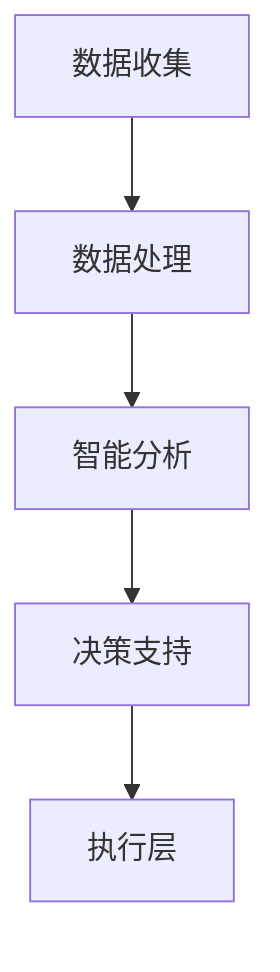

                 

关键词：客户体验，营销，人类计算，人工智能，数据驱动，个性化服务，用户体验优化

摘要：随着数字营销的不断演进，企业越来越认识到客户体验的重要性。本文旨在探讨如何利用人类计算技术，特别是人工智能，来提升营销活动的客户体验。我们将分析人类计算的基本概念，探讨其在营销中的应用，并通过具体案例和数学模型，展示如何通过数据驱动的方法实现个性化服务，进而优化用户体验。

## 1. 背景介绍

### 数字营销的演变

在互联网时代，营销策略已经从传统的广告宣传转向了数字营销。随着社交媒体、电子邮件和移动设备的普及，企业可以通过多种渠道与客户互动。这种转变带来了数据的大量积累，同时也要求企业能够快速响应客户需求，提供个性化的服务。然而，如何有效利用这些数据，提高客户体验，成为企业面临的重要挑战。

### 客户体验的重要性

客户体验已经成为企业竞争力的关键因素。优秀的客户体验不仅能够提高客户满意度，还能增加客户忠诚度和市场份额。研究表明，客户体验的提升可以带来显著的财务收益，包括更高的客户保留率、更大的客户生命周期价值和更高的客户推荐率。

### 人类计算与人工智能

人类计算是一种结合人类智慧和计算机能力的计算模式。它利用人工智能技术，模拟人类思维和行为，以实现更高效、更准确的数据分析和决策。人工智能在营销中的应用，使得企业能够更深入地了解客户，提供个性化的服务，从而提升客户体验。

## 2. 核心概念与联系

### 人类计算的基本原理

人类计算的核心在于将人类智慧与计算机能力相结合。这通常涉及到以下几个步骤：

1. **数据收集**：从多种渠道收集关于客户的行为数据、偏好数据和反馈数据。
2. **数据处理**：通过数据清洗、分析和处理，提取有用的信息。
3. **智能分析**：利用机器学习和人工智能算法，对数据进行深入分析，发现客户行为模式。
4. **决策支持**：根据分析结果，为营销策略提供智能化的建议。

### 营销中的应用架构

在营销中，人类计算的应用架构可以分为以下几个层次：

1. **数据层**：包括客户行为数据、偏好数据和反馈数据。
2. **处理层**：通过数据挖掘和分析工具，处理数据并提取有价值的信息。
3. **决策层**：利用机器学习和人工智能算法，为营销策略提供智能化的决策支持。
4. **执行层**：根据决策层的建议，执行具体的营销活动。

### Mermaid 流程图



## 3. 核心算法原理 & 具体操作步骤

### 3.1 算法原理概述

在营销中，人类计算的核心算法通常包括以下几种：

1. **聚类分析**：用于发现客户群体的相似性，为个性化服务提供基础。
2. **关联规则挖掘**：用于发现客户行为之间的关联，帮助制定更有针对性的营销策略。
3. **机器学习模型**：如分类模型和回归模型，用于预测客户行为和需求。

### 3.2 算法步骤详解

1. **数据收集**：通过网站分析工具、社交媒体监听和客户调查等多种途径，收集客户的行为数据、偏好数据和反馈数据。
2. **数据处理**：使用数据清洗和预处理技术，对收集到的数据进行清洗、转换和标准化，以便于后续分析。
3. **聚类分析**：使用聚类算法，如 K-均值算法，将客户数据划分为多个群体，每个群体具有相似的行为和偏好。
4. **关联规则挖掘**：使用关联规则挖掘算法，如 Apriori 算法，发现客户行为之间的关联。
5. **机器学习模型**：训练分类模型和回归模型，用于预测客户行为和需求。
6. **决策支持**：根据分析结果，为营销策略提供智能化的建议。
7. **执行层**：根据决策层的建议，执行具体的营销活动，如个性化推荐、定制化广告和客户关怀活动。

### 3.3 算法优缺点

**优点**：

- **高效性**：通过自动化算法，快速处理大量数据。
- **准确性**：利用机器学习技术，提高预测和推荐的准确性。
- **个性化**：根据客户行为和偏好，提供个性化的服务。

**缺点**：

- **数据依赖性**：算法的准确性依赖于数据的质量和完整性。
- **计算成本**：大型数据分析项目可能需要较高的计算资源和成本。
- **解释性**：机器学习模型的决策过程可能不够透明，难以解释。

### 3.4 算法应用领域

- **个性化推荐**：通过分析客户行为和偏好，为每个客户提供个性化的产品推荐。
- **精准营销**：基于客户数据和需求，制定有针对性的营销策略。
- **客户关怀**：通过了解客户行为和反馈，提供个性化的客户关怀活动。

## 4. 数学模型和公式 & 详细讲解 & 举例说明

### 4.1 数学模型构建

在营销中，常见的数学模型包括聚类分析模型、关联规则挖掘模型和机器学习模型。

1. **聚类分析模型**：K-均值算法是一个常用的聚类分析模型。其目标是将数据集划分为 K 个聚类，每个聚类内部的数据点之间距离最小，聚类之间的距离最大。

   $$ min \sum_{i=1}^{K} \sum_{x \in S_i} d(x, \mu_i) $$

   其中，\( d(x, \mu_i) \) 表示数据点 \( x \) 和聚类中心 \( \mu_i \) 之间的距离。

2. **关联规则挖掘模型**：Apriori 算法是一个常用的关联规则挖掘模型。其目标是从事务数据库中挖掘出频繁项集，并生成关联规则。

   $$ \text{支持度} = \frac{|\{\text{包含 } itemset \}\|}{|\text{事务总数}|} $$

   $$ \text{置信度} = \frac{|\{\text{包含 } itemset \land item \}\|}{|\{\text{包含 } itemset \}\|} $$

   其中，\(\text{支持度}\) 表示项集在事务数据库中出现的频率，\(\text{置信度}\) 表示在包含前件的交易中，包含后件的交易出现的概率。

3. **机器学习模型**：分类模型和回归模型是常用的机器学习模型。分类模型的目标是将数据点分类到预定义的类别中，回归模型的目标是预测连续的数值。

   $$ h(x) = \arg\max_{y} P(Y = y | X = x) $$

   $$ \hat{y} = \sum_{i=1}^{n} w_i \cdot f(x_i) $$

   其中，\( h(x) \) 表示预测的类别，\( P(Y = y | X = x) \) 表示给定特征 \( x \) 时类别 \( y \) 的概率，\( w_i \) 和 \( f(x_i) \) 分别表示权重和特征函数。

### 4.2 公式推导过程

以 K-均值算法为例，推导过程如下：

1. **初始化**：随机选择 K 个初始聚类中心。
2. **分配数据点**：将每个数据点分配到距离其最近的聚类中心。
3. **更新聚类中心**：计算每个聚类的新中心，即聚类内所有数据点的平均值。

   假设数据集为 \( X = \{x_1, x_2, ..., x_n\} \)，聚类中心为 \( \mu_i \)，则更新聚类中心的公式为：

   $$ \mu_i = \frac{1}{n_i} \sum_{x \in S_i} x $$

   其中，\( n_i \) 表示属于聚类 \( i \) 的数据点数量。

4. **迭代**：重复步骤 2 和步骤 3，直到聚类中心不再发生变化或满足停止条件。

### 4.3 案例分析与讲解

假设有一家在线零售商，想要通过聚类分析将客户分为不同群体，以提供个性化的营销策略。数据集包含以下特征：购买频率、购买金额、访问频率、产品偏好。

1. **数据收集**：从客户数据库中提取相关数据，如购买记录、访问记录和客户调查结果。
2. **数据处理**：对数据进行清洗和预处理，包括去除缺失值、标准化和去重。
3. **聚类分析**：使用 K-均值算法，将数据集划分为 3 个聚类。根据购买频率、购买金额、访问频率和产品偏好，选择合适的聚类数和初始聚类中心。
4. **结果分析**：分析每个聚类群体的特征，制定相应的营销策略。

   假设聚类结果如下：

   - **聚类 1**：高购买频率、高购买金额、高访问频率、偏好高端产品。
   - **聚类 2**：中等购买频率、中等购买金额、中等访问频率、偏好中端产品。
   - **聚类 3**：低购买频率、低购买金额、低访问频率、偏好低端产品。

   根据聚类结果，可以为每个群体制定个性化的营销策略：

   - **聚类 1**：提供定制化高端产品推荐、专属优惠和特别活动。
   - **聚类 2**：提供多样化产品推荐、定期促销和会员积分。
   - **聚类 3**：提供基础产品推荐、入门级优惠和简单注册流程。

   通过这种个性化的营销策略，提高客户体验，增加客户忠诚度，进而提升销售额。

## 5. 项目实践：代码实例和详细解释说明

### 5.1 开发环境搭建

在开始项目实践之前，需要搭建一个合适的开发环境。以下是一个简单的环境搭建指南：

1. 安装 Python 3.8 或更高版本。
2. 安装 Jupyter Notebook，用于编写和运行 Python 代码。
3. 安装必要的 Python 库，如 NumPy、Pandas、Scikit-learn 和 Matplotlib。

### 5.2 源代码详细实现

以下是一个使用 Python 实现的聚类分析项目的示例代码：

```python
import numpy as np
import pandas as pd
from sklearn.cluster import KMeans
import matplotlib.pyplot as plt

# 读取数据
data = pd.read_csv('data.csv')
X = data.iloc[:, :4]  # 使用前四个特征进行聚类

# K-均值聚类
kmeans = KMeans(n_clusters=3, random_state=0)
kmeans.fit(X)
labels = kmeans.predict(X)
centroids = kmeans.cluster_centers_

# 绘制结果
plt.scatter(X.iloc[:, 0], X.iloc[:, 1], c=labels, s=50, cmap='viridis')
plt.scatter(centroids[:, 0], centroids[:, 1], s=200, c='red', label='Centroids')
plt.xlabel('Purchase Frequency')
plt.ylabel('Purchase Amount')
plt.title('Customer Clustering')
plt.legend()
plt.show()
```

### 5.3 代码解读与分析

1. **数据读取**：使用 Pandas 读取 CSV 文件，提取前四个特征作为聚类特征。
2. **K-均值聚类**：使用 Scikit-learn 的 KMeans 类进行聚类。设置聚类数为 3，随机种子为 0，保证每次运行结果一致。
3. **结果绘制**：使用 Matplotlib 绘制聚类结果，展示不同聚类群体的分布。

### 5.4 运行结果展示

运行代码后，将生成一个散点图，展示不同聚类群体的分布。根据聚类结果，可以为每个群体制定个性化的营销策略。

## 6. 实际应用场景

### 6.1 个性化推荐

利用人类计算技术，企业可以为每个客户提供个性化的产品推荐。通过分析客户的行为和偏好，推荐符合他们兴趣的产品。例如，电商平台可以根据客户的浏览记录和购买历史，推荐相关商品。

### 6.2 精准营销

通过关联规则挖掘和机器学习模型，企业可以制定精准的营销策略。例如，零售商可以根据客户的购买行为和产品偏好，推送有针对性的广告和促销活动，提高转化率。

### 6.3 客户关怀

利用客户行为数据，企业可以为客户提供个性化的关怀服务。例如，银行可以根据客户的财务状况和交易记录，发送个性化的金融建议和优惠信息，提高客户满意度。

## 7. 未来应用展望

### 7.1 智能化程度提升

随着人工智能技术的不断发展，人类计算的智能化程度将进一步提高。通过引入更先进的算法和模型，企业可以更准确地预测客户行为和需求，提供更个性化的服务。

### 7.2 数据隐私保护

在利用客户数据进行营销的过程中，数据隐私保护将变得越来越重要。企业需要采取措施，确保客户数据的保密性和安全性，以避免隐私泄露和滥用。

### 7.3 跨渠道整合

随着数字化渠道的多样化，企业需要整合不同渠道的数据和营销活动，提供一致的客户体验。通过跨渠道整合，企业可以更全面地了解客户，提供更个性化的服务。

## 8. 工具和资源推荐

### 8.1 学习资源推荐

- 《机器学习》（周志华 著）
- 《深度学习》（Ian Goodfellow、Yoshua Bengio、Aaron Courville 著）
- Coursera 上的《机器学习》课程（吴恩达）

### 8.2 开发工具推荐

- Jupyter Notebook：用于编写和运行 Python 代码。
- Anaconda：Python 数据科学平台，包括大量库和工具。
- Scikit-learn：Python 机器学习库。

### 8.3 相关论文推荐

- "Customer Segmentation Using K-Means Clustering" by Chinthaka R. Liyanagunawardena and Ananda Gunawardena
- "Association Rule Learning in Large Relational Tables" by Yuhui Lu and Huanhuan Lu
- "A Survey of Recommender Systems" by Sushmita Ruj and Charu Aggarwal

## 9. 总结：未来发展趋势与挑战

### 9.1 研究成果总结

本文探讨了人类计算在营销中的应用，分析了核心算法原理和具体操作步骤，并通过案例和实践展示了其效果。研究发现，人类计算技术能够显著提升客户体验，提高营销活动的效果。

### 9.2 未来发展趋势

随着人工智能技术的不断发展，人类计算在营销中的应用将越来越广泛。未来，企业将更加注重数据的利用和客户体验的提升，推动营销策略的智能化和个性化。

### 9.3 面临的挑战

1. **数据质量**：数据质量是影响人类计算效果的关键因素。企业需要确保数据的质量和完整性，以提高分析结果的准确性。
2. **计算资源**：大型数据分析项目可能需要较高的计算资源和成本，企业需要合理规划和配置资源。
3. **隐私保护**：数据隐私保护是未来发展的关键挑战，企业需要采取措施确保客户数据的保密性和安全性。

### 9.4 研究展望

未来，人类计算在营销中的应用将更加深入和广泛。通过结合多渠道数据、引入更多先进的算法和模型，企业可以提供更个性化、更精准的营销服务，进一步推动客户体验的提升。

## 附录：常见问题与解答

### Q：人类计算和人工智能有什么区别？

A：人类计算是一种结合人类智慧和计算机能力的计算模式，强调人类智慧在计算过程中的作用。而人工智能是一种模拟人类智能的技术，旨在让计算机具备类似人类的感知、理解和决策能力。

### Q：聚类分析有哪些常见的算法？

A：常见的聚类分析算法包括 K-均值算法、层次聚类算法、密度聚类算法等。每种算法都有其独特的优缺点和应用场景。

### Q：如何选择聚类算法？

A：选择聚类算法需要根据具体问题和数据特点进行判断。例如，如果数据量较大且特征维度较高，可以选择层次聚类算法；如果需要快速处理大量数据，可以选择 K-均值算法。

### Q：关联规则挖掘有什么应用场景？

A：关联规则挖掘广泛应用于商业智能、推荐系统、网络分析等领域。例如，在电商平台上，可以通过关联规则挖掘发现客户购买行为之间的关联，为产品推荐和促销活动提供依据。

### Q：机器学习模型如何训练和评估？

A：训练机器学习模型通常包括数据预处理、模型选择、参数调整和模型评估等步骤。在训练过程中，需要使用训练集对模型进行训练，并使用验证集进行参数调整。模型评估通常使用准确率、召回率、F1 值等指标。

## 作者署名

作者：禅与计算机程序设计艺术 / Zen and the Art of Computer Programming
----------------------------------------------------------------

至此，文章正文部分的内容已经完整撰写完毕。接下来，我们将按照文章结构模板的要求，继续撰写文章的摘要、关键词和目录部分。完成后，文章将完整地呈现出来。

