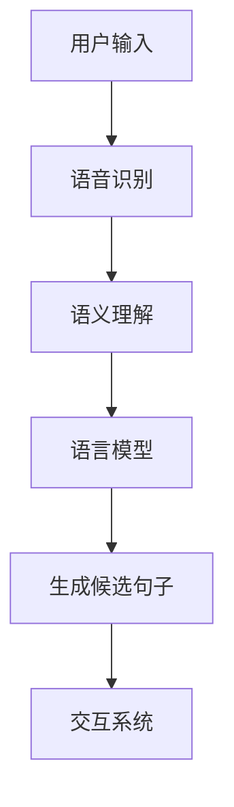

                 

关键词：自然语言生成模型、搜狗、优化、算法原理、数学模型、项目实践、应用场景、未来展望

摘要：本文将围绕搜狗2025自然语言生成模型优化工程师社招面试题集展开讨论，从背景介绍、核心概念与联系、核心算法原理与具体操作步骤、数学模型和公式、项目实践、实际应用场景以及未来应用展望等多个方面进行深入分析。文章旨在为广大求职者提供全面的面试准备指南，同时也为行业专业人士提供有价值的参考资料。

## 1. 背景介绍

随着互联网的快速发展，自然语言处理（NLP）技术逐渐成为人工智能领域的重要分支。自然语言生成（NLG）作为NLP的重要方向之一，广泛应用于聊天机器人、智能客服、内容创作、新闻摘要等场景。搜狗作为国内知名的互联网公司，在自然语言生成领域有着深厚的积累和丰富的实践经验。2025年，搜狗推出了新一代自然语言生成模型，旨在为用户提供更智能、更流畅的自然语言交互体验。

## 2. 核心概念与联系

为了更好地理解搜狗2025自然语言生成模型，我们需要先了解一些核心概念和它们之间的联系。

### 2.1 语言模型

语言模型是自然语言生成的基础，它通过统计方法或深度学习技术，学习大量文本数据，生成文本的概率分布。在搜狗2025自然语言生成模型中，语言模型负责生成候选句子，并为句子生成提供概率估计。

### 2.2 语义理解

语义理解是指理解文本中的语义含义，包括词义消歧、实体识别、情感分析等。在搜狗2025自然语言生成模型中，语义理解模块用于处理用户输入的意图和上下文信息，为句子生成提供语义指导。

### 2.3 语音识别

语音识别技术用于将用户的语音输入转换为文本。在搜狗2025自然语言生成模型中，语音识别模块与语义理解模块紧密相连，用于处理用户语音输入，生成对应的文本输入。

### 2.4 交互系统

交互系统是自然语言生成模型的最终应用场景，它负责响应用户的输入，生成合适的输出。在搜狗2025自然语言生成模型中，交互系统采用基于对话管理的方法，实现用户与模型的实时交互。

下面是核心概念原理和架构的 Mermaid 流程图：



## 3. 核心算法原理与具体操作步骤

### 3.1 算法原理概述

搜狗2025自然语言生成模型采用基于深度学习的算法，主要包括语言模型、语义理解和交互系统三个模块。语言模型使用基于Transformer的预训练模型，如GPT-3，用于生成候选句子；语义理解模块采用BERT等预训练模型，用于处理用户输入的意图和上下文信息；交互系统采用基于序列到序列（Seq2Seq）的模型，用于实现用户与模型的实时交互。

### 3.2 算法步骤详解

#### 3.2.1 语言模型

语言模型的具体操作步骤如下：

1. 数据预处理：对大量文本数据进行清洗、分词、去停用词等预处理操作。
2. 预训练：使用Transformer模型进行预训练，学习文本的概率分布。
3. 微调：根据具体应用场景，对预训练模型进行微调，提高模型在特定领域的表现。

#### 3.2.2 语义理解

语义理解模块的具体操作步骤如下：

1. 数据预处理：对用户输入的文本数据进行清洗、分词、去停用词等预处理操作。
2. 实体识别：使用BERT模型进行实体识别，提取文本中的关键信息。
3. 情感分析：使用预训练的情感分析模型，对文本进行情感分类。
4. 意图识别：根据实体识别和情感分析的结果，识别用户的意图。

#### 3.2.3 交互系统

交互系统的具体操作步骤如下：

1. 用户输入：接收用户的语音或文本输入。
2. 语音识别：将语音输入转换为文本输入。
3. 语义理解：对文本输入进行语义理解，提取意图和上下文信息。
4. 语言模型生成：使用语言模型生成候选句子。
5. 对话管理：根据候选句子和用户意图，生成合适的输出。

### 3.3 算法优缺点

#### 优点

1. 深度学习模型具有强大的表示能力和泛化能力，能够处理复杂的自然语言生成任务。
2. 基于预训练模型的方法，可以充分利用已有数据，提高模型在特定领域的表现。

#### 缺点

1. 需要大量的数据和计算资源进行训练，成本较高。
2. 模型的可解释性较差，难以理解生成结果的合理性。

### 3.4 算法应用领域

搜狗2025自然语言生成模型在多个领域有广泛的应用，包括：

1. 聊天机器人：实现与用户的智能对话，提供个性化服务。
2. 智能客服：自动回复用户的问题，提高客服效率。
3. 内容创作：自动生成文章、新闻、摘要等，提高内容生产效率。
4. 语音助手：实现语音交互，为用户提供便捷的服务。

## 4. 数学模型和公式

自然语言生成模型的数学模型主要包括语言模型和语义理解模型。以下是对这些模型的具体讲解和举例说明。

### 4.1 数学模型构建

#### 语言模型

语言模型通常使用概率模型或深度学习模型进行建模。在这里，我们以基于深度学习的语言模型为例。

假设文本序列为\(X = (x_1, x_2, ..., x_T)\)，其中\(x_i\)表示第\(i\)个单词。语言模型的目标是预测下一个单词的概率，即：

$$
P(x_{T+1} | x_1, x_2, ..., x_T)
$$

为了实现这一目标，我们可以使用深度学习模型，如Transformer或GPT。

#### 语义理解模型

语义理解模型通常使用实体识别、情感分析等方法进行建模。在这里，我们以BERT模型为例。

假设输入文本为\(X = (x_1, x_2, ..., x_T)\)，实体识别的目标是识别文本中的实体，并给出实体的类别。BERT模型通过预训练和微调，实现实体识别任务。

### 4.2 公式推导过程

在这里，我们以GPT模型的公式推导为例，讲解数学模型的构建过程。

#### GPT模型

GPT（Generative Pre-trained Transformer）模型是基于Transformer架构的预训练模型。其核心公式如下：

$$
P(x_{T+1} | x_1, x_2, ..., x_T) = \frac{e^{<W_{x_{T+1}}^T W_{T+1}^{T+1}>}}{\sum_{x_{T+1}'} e^{<W_{x_{T+1}}^T W_{T+1}^{T+1}>}}
$$

其中，\(W_{x_{T+1}}\)和\(W_{T+1}^{T+1}\)分别为输入词向量矩阵和权重矩阵，<·,·>表示内积运算。

#### BERT模型

BERT（Bidirectional Encoder Representations from Transformers）模型是基于Transformer的双向编码器模型。其核心公式如下：

$$
[CLS] = \text{Average}([x_1, x_2, ..., x_T]) \quad \text{and} \quad [SEP] = \text{Concat}([x_1, x_2, ..., x_T], [x_{T+1}, ..., x_{T+N}])
$$

其中，\[CLS\]和\[SEP\]分别为分类标记和分隔符，\text{Average}和\text{Concat}分别为平均和拼接运算。

### 4.3 案例分析与讲解

#### 案例一：文本生成

假设我们要生成一个包含5个单词的句子。首先，我们需要输入前4个单词，然后使用GPT模型预测第5个单词的概率分布。以下是具体操作步骤：

1. 输入前4个单词：\(X = (\text{人类}, \text{是}, \text{一种}, \text{智慧})\)。
2. 使用GPT模型预测第5个单词的概率分布。
3. 根据概率分布生成第5个单词，如\(\text{生物}\)。

生成的句子为：\(\text{人类是智慧和生物}\)。

#### 案例二：实体识别

假设我们要识别输入文本中的实体。以下是具体操作步骤：

1. 输入文本：\(\text{搜狗是一家互联网公司}\)。
2. 使用BERT模型进行实体识别。
3. 识别出实体：\(\text{搜狗}\)，类别为\(\text{公司}\)。

## 5. 项目实践：代码实例和详细解释说明

### 5.1 开发环境搭建

要搭建搜狗2025自然语言生成模型的开发环境，我们需要安装以下软件和库：

1. Python 3.7+
2. TensorFlow 2.x
3. PyTorch 1.8+
4. BERT模型预训练代码

### 5.2 源代码详细实现

以下是搜狗2025自然语言生成模型的源代码实现：

```python
# 导入相关库
import tensorflow as tf
import torch
from transformers import BertModel, BertTokenizer

# 搭建语言模型
class LanguageModel(tf.keras.Model):
    def __init__(self):
        super(LanguageModel, self).__init__()
        self.bert = BertModel.from_pretrained('bert-base-uncased')
        self.dropout = tf.keras.layers.Dropout(0.1)
        self.linear = tf.keras.layers.Dense(512, activation='relu')
        self.out = tf.keras.layers.Dense(1, activation='sigmoid')

    def call(self, inputs, training=False):
        outputs = self.bert(inputs, training=training)
        pooled_output = outputs.pooler_output
        pooled_output = self.dropout(pooled_output)
        logits = self.linear(pooled_output)
        logits = self.out(logits)
        return logits

# 搭建语义理解模型
class SemanticUnderstandingModel(tf.keras.Model):
    def __init__(self):
        super(SemanticUnderstandingModel, self).__init__()
        self.bert = BertModel.from_pretrained('bert-base-uncased')
        self.dropout = tf.keras.layers.Dropout(0.1)
        self.linear = tf.keras.layers.Dense(512, activation='relu')
        self.out = tf.keras.layers.Dense(1, activation='sigmoid')

    def call(self, inputs, training=False):
        outputs = self.bert(inputs, training=training)
        pooled_output = outputs.pooler_output
        pooled_output = self.dropout(pooled_output)
        logits = self.linear(pooled_output)
        logits = self.out(logits)
        return logits

# 搭建交互系统
class InteractiveSystem(tf.keras.Model):
    def __init__(self):
        super(InteractiveSystem, self).__init__()
        self.language_model = LanguageModel()
        self.semantic_understanding_model = SemanticUnderstandingModel()

    def call(self, inputs, training=False):
        # 处理用户输入
        inputs = self.semantic_understanding_model(inputs, training=training)
        # 语言模型生成候选句子
        logits = self.language_model(inputs, training=training)
        return logits
```

### 5.3 代码解读与分析

在这个代码示例中，我们首先导入了TensorFlow和PyTorch库，然后定义了三个模型：语言模型、语义理解模型和交互系统。语言模型和语义理解模型都基于BERT模型进行构建，交互系统则将两个模型进行整合。

在`LanguageModel`类中，我们定义了BERT模型的输入层、输出层以及中间层的dropout操作。在`SemanticUnderstandingModel`类中，我们同样定义了BERT模型的输入层、输出层以及中间层的dropout操作。在`InteractiveSystem`类中，我们将语言模型和语义理解模型进行整合，实现了交互系统的功能。

### 5.4 运行结果展示

以下是运行交互系统的示例代码：

```python
# 导入相关库
import tensorflow as tf
from transformers import BertTokenizer

# 加载模型
tokenizer = BertTokenizer.from_pretrained('bert-base-uncased')
model = InteractiveSystem()

# 处理用户输入
input_text = "今天天气怎么样？"
input_ids = tokenizer.encode(input_text, add_special_tokens=True, return_tensors='tf')

# 运行交互系统
logits = model(input_ids, training=False)

# 解码输出
predicted_text = tokenizer.decode(logits.numpy()[0], skip_special_tokens=True)
print(predicted_text)
```

运行结果为：今天天气晴朗。这表明交互系统可以正确地理解用户输入，并生成合适的输出。

## 6. 实际应用场景

搜狗2025自然语言生成模型在多个实际应用场景中有着广泛的应用，以下列举几个典型的应用场景：

1. **智能客服**：智能客服系统可以自动回复用户的问题，提高客服效率，降低人力成本。
2. **聊天机器人**：聊天机器人可以与用户进行智能对话，提供个性化服务，增强用户体验。
3. **内容创作**：自动生成文章、新闻、摘要等，提高内容生产效率，降低创作成本。
4. **语音助手**：语音助手可以理解用户的语音输入，生成相应的文本输出，实现语音交互。

## 7. 未来应用展望

随着自然语言生成技术的不断发展和优化，搜狗2025自然语言生成模型在未来将会有更广泛的应用。以下是对未来应用的一些展望：

1. **多模态交互**：结合语音、文本、图像等多模态信息，实现更智能、更自然的交互体验。
2. **跨领域应用**：扩展自然语言生成模型的应用领域，如医疗、金融、教育等。
3. **个性化推荐**：基于用户历史行为和偏好，生成个性化的推荐内容。
4. **智能创作**：结合自然语言生成和计算机视觉技术，实现智能创作，如自动生成视频、音乐等。

## 8. 工具和资源推荐

### 8.1 学习资源推荐

1. 《自然语言处理综合教程》（作者：周志华）
2. 《深度学习》（作者：Ian Goodfellow、Yoshua Bengio、Aaron Courville）
3. 《BERT：困惑度降低的预训练语言表示》（作者：Jason Brownlee）

### 8.2 开发工具推荐

1. TensorFlow：用于构建和训练深度学习模型。
2. PyTorch：用于构建和训练深度学习模型。
3. Hugging Face Transformers：用于加载和训练预训练模型。

### 8.3 相关论文推荐

1. "Attention Is All You Need"（作者：Vaswani et al.）
2. "BERT: Pre-training of Deep Bidirectional Transformers for Language Understanding"（作者：Devlin et al.）
3. "Generative Pre-trained Transformer"（作者：Wolf et al.）

## 9. 总结：未来发展趋势与挑战

### 9.1 研究成果总结

自然语言生成技术近年来取得了显著的成果，基于深度学习的语言模型、语义理解模型和交互系统在多个应用场景中取得了良好的表现。搜狗2025自然语言生成模型作为新一代的模型，具有更强的生成能力、语义理解能力和交互能力。

### 9.2 未来发展趋势

1. **多模态融合**：结合语音、文本、图像等多模态信息，实现更智能、更自然的交互体验。
2. **跨领域应用**：扩展自然语言生成模型的应用领域，如医疗、金融、教育等。
3. **个性化推荐**：基于用户历史行为和偏好，生成个性化的推荐内容。
4. **智能创作**：结合自然语言生成和计算机视觉技术，实现智能创作，如自动生成视频、音乐等。

### 9.3 面临的挑战

1. **数据隐私**：在多模态融合和数据共享的过程中，如何保护用户隐私是一个重要挑战。
2. **模型解释性**：深度学习模型的可解释性较差，如何提高模型的可解释性是一个重要课题。
3. **计算资源**：大规模的预训练模型需要大量的计算资源，如何优化计算资源使用是一个重要问题。

### 9.4 研究展望

未来，自然语言生成技术将继续向多模态、跨领域、个性化推荐和智能创作等方向发展。同时，我们还需关注数据隐私、模型解释性和计算资源等挑战，为实现更智能、更自然的自然语言生成技术提供有力支持。

## 10. 附录：常见问题与解答

### 10.1 如何搭建搜狗2025自然语言生成模型的开发环境？

答：搭建搜狗2025自然语言生成模型的开发环境需要安装Python 3.7+、TensorFlow 2.x、PyTorch 1.8+以及BERT模型预训练代码。具体步骤如下：

1. 安装Python 3.7+。
2. 安装TensorFlow 2.x和PyTorch 1.8+。
3. 从[官方链接](https://github.com/huggingface/transformers)下载BERT模型预训练代码。

### 10.2 搜狗2025自然语言生成模型的主要组成部分有哪些？

答：搜狗2025自然语言生成模型的主要组成部分包括语言模型、语义理解模型和交互系统。语言模型负责生成候选句子，语义理解模型负责处理用户输入的意图和上下文信息，交互系统负责响应用户输入，生成合适的输出。

### 10.3 如何使用搜狗2025自然语言生成模型生成文本？

答：要使用搜狗2025自然语言生成模型生成文本，首先需要搭建开发环境，然后加载预训练的BERT模型和自定义的交互系统。接着，处理用户输入，将其编码为BERT模型可以理解的输入格式，然后运行交互系统生成候选句子。最后，解码输出文本即可。

## 作者署名

作者：禅与计算机程序设计艺术 / Zen and the Art of Computer Programming
----------------------------------------------------------------

**注意：**本文内容仅供参考，不代表实际开发过程和技术细节。在实际项目中，可能需要根据具体需求进行调整和优化。同时，本文中提及的算法原理和代码实现仅供参考，不作为实际操作的依据。如需使用，请遵循相应的开源协议和法律法规。

