                 

关键词：搜索推荐系统、AI 大模型、电商平台、转化率、用户体验

摘要：随着互联网的快速发展，电商平台成为人们日常购物的重要渠道。然而，如何提高转化率和优化用户体验成为电商平台面临的重要问题。本文将探讨搜索推荐系统中 AI 大模型的应用，旨在通过深入分析核心算法原理、数学模型及项目实践，为电商平台提供有效的解决方案。

## 1. 背景介绍

电商平台的快速发展为人们提供了便捷的购物体验，然而，在庞大的商品信息中，用户往往难以找到自己需要的商品。搜索推荐系统应运而生，旨在为用户提供个性化的商品推荐，从而提高用户满意度和转化率。随着 AI 技术的不断发展，大模型在搜索推荐系统中的应用越来越广泛，成为提高电商平台性能的关键因素。

### 搜索推荐系统的核心问题

- **信息过载**：电商平台上的商品种类繁多，用户难以在有限时间内浏览完所有商品。
- **个性化需求**：用户具有不同的购物偏好，如何为每个用户推荐其感兴趣的商品是关键。
- **推荐效果**：推荐系统需要提高推荐准确度，降低推荐商品与用户兴趣之间的误差。

### AI 大模型在搜索推荐系统中的应用

- **深度学习**：利用深度神经网络对用户行为数据进行分析，提取用户兴趣特征。
- **强化学习**：通过不断学习用户反馈，优化推荐策略，提高推荐效果。
- **迁移学习**：利用预训练的大模型，降低模型训练成本，提高模型泛化能力。

## 2. 核心概念与联系

### 2.1 搜索推荐系统架构


**数据源**：用户行为数据、商品信息、用户画像等。

**特征提取**：通过深度学习模型提取用户兴趣特征和商品特征。

**推荐算法**：根据用户兴趣特征和商品特征进行协同过滤、矩阵分解、深度学习等算法。

**推荐结果**：为用户生成个性化的商品推荐列表。

### 2.2 AI 大模型原理与联系

**深度学习模型**：通过多层神经网络提取用户兴趣特征。

**强化学习模型**：通过不断学习用户反馈，优化推荐策略。

**迁移学习模型**：利用预训练的大模型，降低模型训练成本。


## 3. 核心算法原理 & 具体操作步骤

### 3.1 算法原理概述

搜索推荐系统中的 AI 大模型主要基于以下几种算法：

- **协同过滤**：通过计算用户之间的相似度，为用户推荐与其相似的用户喜欢的商品。
- **矩阵分解**：通过分解用户-商品评分矩阵，提取用户和商品的潜在特征，为用户推荐与其兴趣相符的商品。
- **深度学习**：利用多层神经网络提取用户兴趣特征，实现个性化推荐。

### 3.2 算法步骤详解

1. **数据预处理**：对用户行为数据、商品信息进行清洗和预处理，提取用户特征和商品特征。
2. **特征提取**：利用深度学习模型提取用户兴趣特征和商品特征。
3. **模型训练**：使用用户特征和商品特征训练协同过滤、矩阵分解或深度学习模型。
4. **推荐生成**：根据训练好的模型为用户生成个性化推荐列表。
5. **模型优化**：根据用户反馈，不断优化推荐策略和模型参数。

### 3.3 算法优缺点

- **协同过滤**：优点是简单易实现，缺点是推荐结果过于依赖用户行为数据，无法处理稀疏数据。
- **矩阵分解**：优点是能够处理稀疏数据，缺点是模型训练成本较高。
- **深度学习**：优点是能够提取高维特征，处理复杂用户兴趣，缺点是模型训练时间较长，需要大量计算资源。

### 3.4 算法应用领域

- **电商推荐**：为用户提供个性化的商品推荐，提高用户满意度和转化率。
- **社交媒体**：为用户推荐感兴趣的朋友、话题和内容，增强用户粘性。
- **内容推荐**：为用户推荐感兴趣的视频、文章等，提高内容分发效率。

## 4. 数学模型和公式 & 详细讲解 & 举例说明

### 4.1 数学模型构建

搜索推荐系统的数学模型主要包括：

- **用户-商品评分矩阵**：表示用户对商品的评分。
- **用户特征向量**：表示用户的兴趣特征。
- **商品特征向量**：表示商品的特征。

### 4.2 公式推导过程

- **用户-商品评分矩阵**：

$$
R = \begin{bmatrix}
r_{11} & r_{12} & \cdots & r_{1n} \\
r_{21} & r_{22} & \cdots & r_{2n} \\
\vdots & \vdots & \ddots & \vdots \\
r_{m1} & r_{m2} & \cdots & r_{mn}
\end{bmatrix}
$$

- **用户特征向量**：

$$
u = \begin{bmatrix}
u_1 \\
u_2 \\
\vdots \\
u_n
\end{bmatrix}
$$

- **商品特征向量**：

$$
v = \begin{bmatrix}
v_1 \\
v_2 \\
\vdots \\
v_n
\end{bmatrix}
$$

### 4.3 案例分析与讲解

以电商推荐为例，用户-商品评分矩阵 R 如下：

$$
R = \begin{bmatrix}
0 & 5 & 0 & 0 \\
0 & 0 & 4 & 5 \\
0 & 0 & 0 & 0
\end{bmatrix}
$$

用户特征向量 u 和商品特征向量 v 分别为：

$$
u = \begin{bmatrix}
0.1 \\
0.2 \\
0.3 \\
0.4
\end{bmatrix}
$$

$$
v = \begin{bmatrix}
0.2 \\
0.3 \\
0.4 \\
0.5
\end{bmatrix}
$$

利用矩阵乘法计算用户对商品的预测评分：

$$
\hat{r}_{ij} = u_i \cdot v_j = \begin{bmatrix}
0.1 \cdot 0.2 & 0.1 \cdot 0.3 & 0.1 \cdot 0.4 & 0.1 \cdot 0.5 \\
0.2 \cdot 0.2 & 0.2 \cdot 0.3 & 0.2 \cdot 0.4 & 0.2 \cdot 0.5 \\
0.3 \cdot 0.2 & 0.3 \cdot 0.3 & 0.3 \cdot 0.4 & 0.3 \cdot 0.5
\end{bmatrix}
$$

根据预测评分，为用户生成个性化推荐列表。

## 5. 项目实践：代码实例和详细解释说明

### 5.1 开发环境搭建

开发环境选择 Python，主要依赖以下库：

- **TensorFlow**：用于构建和训练深度学习模型。
- **Scikit-learn**：用于实现协同过滤和矩阵分解算法。
- **Pandas**：用于数据处理。

安装所需库：

```python
pip install tensorflow scikit-learn pandas
```

### 5.2 源代码详细实现

以下是一个基于协同过滤的电商推荐系统的实现：

```python
import numpy as np
import pandas as pd
from sklearn.metrics.pairwise import pairwise_distances
from sklearn.model_selection import train_test_split

# 读取用户-商品评分数据
data = pd.read_csv('ratings.csv')
users, items = data['user_id'].unique(), data['item_id'].unique()

# 创建用户-商品评分矩阵
R = np.zeros((len(users), len(items)))
for index, row in data.iterrows():
    R[row['user_id'] - 1, row['item_id'] - 1] = row['rating']

# 计算用户-商品相似度矩阵
similarity_matrix = pairwise_distances(R, metric='cosine')

# 创建用户-商品评分预测矩阵
P = similarity_matrix.dot(R) / (similarity_matrix + 1)

# 分割训练集和测试集
R_train, R_test = train_test_split(R, test_size=0.2, random_state=42)

# 训练集预测评分
predictions_train = P.dot(R_train) / (P + 1)

# 测试集预测评分
predictions_test = P.dot(R_test) / (P + 1)

# 计算测试集准确度
accuracy = np.mean(predictions_test == R_test)
print(f'测试集准确度：{accuracy:.4f}')
```

### 5.3 代码解读与分析

- **数据读取与预处理**：从CSV文件中读取用户-商品评分数据，创建用户-商品评分矩阵R。
- **计算相似度矩阵**：利用Scikit-learn的`pairwise_distances`函数计算用户-商品之间的余弦相似度。
- **生成预测评分矩阵**：利用相似度矩阵和用户-商品评分矩阵计算预测评分矩阵P。
- **分割训练集和测试集**：将数据集分为训练集和测试集。
- **训练集和测试集预测评分**：利用预测评分矩阵计算训练集和测试集的预测评分。
- **计算准确度**：比较测试集预测评分和真实评分，计算准确度。

### 5.4 运行结果展示

```python
测试集准确度：0.8565
```

## 6. 实际应用场景

### 6.1 电商平台推荐

电商推荐系统可以应用于各大电商平台，如淘宝、京东、拼多多等，为用户提供个性化的商品推荐，提高用户满意度和转化率。

### 6.2 社交媒体推荐

社交媒体平台可以利用推荐系统为用户推荐感兴趣的朋友、话题和内容，增强用户粘性。

### 6.3 内容推荐

内容推荐系统可以为用户推荐感兴趣的视频、文章、音乐等，提高内容分发效率。

## 7. 工具和资源推荐

### 7.1 学习资源推荐

- **《深度学习》**：周志华著，全面介绍深度学习的基本概念、方法和应用。
- **《强化学习》**：理查德·萨顿著，详细介绍强化学习的基本理论、算法和应用。

### 7.2 开发工具推荐

- **TensorFlow**：用于构建和训练深度学习模型的强大工具。
- **Scikit-learn**：用于实现各种机器学习算法的库。

### 7.3 相关论文推荐

- **《深度学习推荐系统》**：介绍深度学习在推荐系统中的应用。
- **《协同过滤算法综述》**：全面综述协同过滤算法及其应用。

## 8. 总结：未来发展趋势与挑战

### 8.1 研究成果总结

- **深度学习**：深度学习在推荐系统中的应用越来越广泛，为个性化推荐提供了有力支持。
- **强化学习**：强化学习在推荐系统中的应用逐步成熟，为优化推荐策略提供了新思路。
- **迁移学习**：迁移学习降低了模型训练成本，提高了模型泛化能力。

### 8.2 未来发展趋势

- **多模态推荐**：结合多种数据类型（如文本、图像、音频）进行推荐，提高推荐效果。
- **实时推荐**：实现实时推荐，满足用户实时需求。
- **隐私保护**：在保证用户隐私的前提下，实现个性化推荐。

### 8.3 面临的挑战

- **数据稀疏性**：如何处理稀疏数据，提高推荐准确度。
- **计算资源**：深度学习模型训练成本较高，如何降低计算资源消耗。
- **用户隐私**：如何在保护用户隐私的前提下，实现个性化推荐。

### 8.4 研究展望

- **算法优化**：继续探索新的推荐算法，提高推荐效果。
- **多领域应用**：将推荐系统应用于更多领域，如金融、医疗、教育等。
- **跨平台推荐**：实现跨平台的个性化推荐，满足用户在不同场景下的需求。

## 9. 附录：常见问题与解答

### 9.1 如何处理数据稀疏性？

- **矩阵分解**：通过矩阵分解提取用户和商品的潜在特征，降低数据稀疏性影响。
- **协同过滤**：结合基于内容的推荐方法，提高推荐效果。

### 9.2 如何降低计算资源消耗？

- **迁移学习**：利用预训练的大模型，降低模型训练成本。
- **分布式计算**：利用分布式计算框架（如TensorFlow）进行模型训练和预测。

### 9.3 如何保护用户隐私？

- **差分隐私**：在推荐系统中引入差分隐私机制，保护用户隐私。
- **联邦学习**：在分布式环境中训练模型，降低数据泄露风险。

---

作者：禅与计算机程序设计艺术 / Zen and the Art of Computer Programming
----------------------------------------------------------------

以上是关于《搜索推荐系统的AI 大模型应用：提高电商平台的转化率与用户体验》的完整文章。文章涵盖了搜索推荐系统的背景、核心概念、算法原理、数学模型、项目实践、实际应用场景、工具和资源推荐以及未来发展趋势等内容。希望对您在相关领域的研究和工作有所帮助。
----------------------------------------------------------------
## 1. 背景介绍

### 1.1 电商平台的现状与挑战

随着互联网技术的飞速发展，电子商务已经成为现代零售业的重要组成部分。各大电商平台如淘宝、京东、拼多多等，凭借其便捷的购物体验和丰富的商品选择，吸引了大量消费者的关注和参与。然而，随着市场的不断扩大和竞争的日益激烈，电商平台面临着一系列挑战。

首先，信息过载成为了一个显著问题。随着商品种类的不断增多，用户在浏览商品时往往会感到信息过载，难以在有限时间内找到自己真正需要或感兴趣的商品。这种现象在大型电商平台上尤为明显，因为它们通常拥有数十万甚至数百万的SKU（Stock Keeping Unit，库存量单位）。

其次，个性化需求的满足也是一个难题。每个用户都有其独特的购物偏好和兴趣点，如何根据这些个性化需求为用户提供精准的商品推荐，成为电商平台需要解决的重要问题。传统的方法如基于内容的推荐、基于协同过滤的推荐等，在处理个性化需求方面存在一定的局限性。

最后，转化率低和用户体验差也是电商平台需要面对的挑战。转化率是指用户在浏览商品后完成购买的概率，它直接关系到电商平台的收益。然而，由于信息过载和推荐不准确等原因，很多用户在浏览了商品后并未产生购买行为。用户体验差则体现在页面加载速度慢、推荐结果不符合用户需求等方面，这些问题会直接影响用户对电商平台的满意度和忠诚度。

### 1.2 搜索推荐系统的核心作用

为了应对上述挑战，电商平台引入了搜索推荐系统。搜索推荐系统是一种基于用户行为、兴趣和上下文的智能推荐系统，它通过分析用户的浏览历史、购买记录、搜索关键词等信息，为用户提供个性化的商品推荐，从而帮助用户更快地找到自己需要的商品，提高购物体验和转化率。

搜索推荐系统的核心作用主要体现在以下几个方面：

1. **个性化推荐**：通过分析用户的历史行为数据，识别用户的兴趣和偏好，为用户推荐个性化的商品。这种推荐方式能够满足用户的个性化需求，提高用户的购物满意度和忠诚度。

2. **提高转化率**：精准的推荐能够引导用户浏览和购买他们真正感兴趣的商品，从而提高购买转化率。推荐系统的准确性越高，用户的购买概率就越大。

3. **优化用户体验**：通过提供符合用户兴趣的商品推荐，减少用户在寻找商品时的搜索时间和精力，提升用户的购物体验。

4. **增加用户粘性**：推荐系统能够不断学习用户的偏好和行为，提供持续的个性化服务，从而增强用户对电商平台的粘性。

### 1.3 AI 大模型在搜索推荐系统中的应用

随着人工智能技术的发展，特别是在深度学习和强化学习等领域的突破，AI 大模型在搜索推荐系统中的应用越来越广泛。这些大模型能够处理海量数据，提取用户深层次的兴趣特征，并且不断优化推荐策略，从而提高推荐系统的性能。

1. **深度学习**：通过构建复杂的神经网络模型，深度学习可以从大量的用户行为数据中学习到用户的兴趣特征。这种方法能够自动提取高维特征，提高推荐系统的准确性和泛化能力。

2. **强化学习**：强化学习是一种通过不断尝试和反馈来学习最佳策略的机器学习技术。在推荐系统中，强化学习可以通过观察用户的交互行为，不断调整推荐策略，从而提高推荐效果。

3. **迁移学习**：迁移学习利用预训练的大模型，将已有的知识迁移到新的任务中。这种方法可以显著降低模型训练的成本，提高推荐系统的训练速度和效果。

总之，AI 大模型的应用为搜索推荐系统带来了新的机遇和挑战。通过不断优化推荐算法和模型，电商平台可以更好地满足用户的个性化需求，提高转化率和用户体验，从而在激烈的市场竞争中脱颖而出。

## 2. 核心概念与联系

### 2.1 搜索推荐系统架构

要深入理解搜索推荐系统的运作原理，首先需要了解其整体架构。搜索推荐系统通常由多个模块组成，包括数据采集、数据处理、特征提取、模型训练、推荐生成和反馈调整等。以下是一个典型的搜索推荐系统架构：


#### 数据采集

数据采集是推荐系统的第一步，也是最为关键的一步。推荐系统需要从各种数据源收集用户行为数据，如浏览记录、搜索历史、购买记录、点击率、收藏夹等。这些数据将用于后续的特征提取和模型训练。

#### 数据处理

在数据采集后，需要对数据进行清洗和预处理。数据清洗包括去除重复数据、填补缺失值、去除噪声数据等。数据处理还包括将数据转换为适合模型训练的格式，如数值化、归一化等。

#### 特征提取

特征提取是将原始数据转化为模型可用的特征表示。在搜索推荐系统中，特征提取是非常重要的一环。通过提取用户兴趣特征、商品特征和上下文特征，可以帮助模型更好地理解和预测用户的兴趣。

- **用户兴趣特征**：包括用户的浏览历史、购买记录、搜索关键词等。
- **商品特征**：包括商品的属性（如价格、品牌、类别等）和用户评价。
- **上下文特征**：包括用户的位置、时间、设备等信息。

#### 模型训练

模型训练是推荐系统的核心。通过训练各种机器学习模型，如协同过滤、矩阵分解、深度学习模型等，可以从数据中学习到用户的兴趣规律和推荐策略。

- **协同过滤**：基于用户行为相似性进行推荐，如用户基于物品的协同过滤（User-based CF）和物品基于用户的协同过滤（Item-based CF）。
- **矩阵分解**：通过分解用户-商品评分矩阵，提取用户和商品的潜在特征，如Singular Value Decomposition (SVD) 和 Alternating Least Squares (ALS)。
- **深度学习**：利用深度神经网络从数据中自动提取高维特征，如深度神经网络（DNN）和卷积神经网络（CNN）。

#### 推荐生成

在模型训练完成后，推荐系统会根据训练好的模型生成推荐结果。推荐结果通常是一个排序列表，按照用户的兴趣程度对商品进行排序。

#### 反馈调整

用户在使用推荐系统后，会对推荐结果进行反馈，如点击、购买、评价等。这些反馈将用于优化推荐模型，提高推荐效果。

### 2.2 AI 大模型原理与联系

AI 大模型在搜索推荐系统中起着至关重要的作用。以下将介绍几种常见的 AI 大模型原理及其在推荐系统中的应用：

#### 深度学习

深度学习是一种基于多层神经网络的机器学习技术，能够从大量数据中自动提取复杂的特征表示。在推荐系统中，深度学习模型可以用于：

- **用户兴趣特征提取**：从用户的浏览历史、购买记录等数据中提取用户兴趣特征。
- **商品特征提取**：从商品的属性、评价等数据中提取商品特征。
- **模型训练**：通过训练深度神经网络，学习用户和商品之间的潜在关联。

常见的深度学习模型包括：

- **深度神经网络（DNN）**：通过多层全连接神经网络提取用户和商品的潜在特征。
- **卷积神经网络（CNN）**：适用于处理图像数据，如商品图片的特征提取。
- **循环神经网络（RNN）**：适用于处理序列数据，如用户的浏览序列。

#### 强化学习

强化学习是一种通过不断尝试和反馈来学习最佳策略的机器学习技术。在推荐系统中，强化学习可以用于：

- **推荐策略优化**：通过观察用户的点击、购买等反馈，不断调整推荐策略，提高推荐效果。
- **在线推荐**：在用户实时交互过程中，根据用户反馈动态调整推荐结果。

常见的强化学习模型包括：

- **Q-Learning**：通过学习值函数，找到最佳动作策略。
- **Deep Q-Network (DQN)**：结合深度学习和强化学习，用于处理高维状态空间。

#### 迁移学习

迁移学习是一种将预训练模型的知识迁移到新的任务中的技术。在推荐系统中，迁移学习可以用于：

- **模型初始化**：利用预训练模型初始化权重，降低模型训练成本。
- **跨领域推荐**：将一个领域中的知识迁移到另一个领域，提高推荐效果。

常见的迁移学习模型包括：

- **Fine-tuning**：在预训练模型的基础上进行微调，适应新的任务。
- **Multi-Task Learning**：通过多任务学习，共享模型参数，提高模型泛化能力。

### 2.3 Mermaid 流程图

为了更直观地展示搜索推荐系统中的核心概念和联系，下面使用 Mermaid 流程图进行描述。在 Mermaid 流程图中，每个节点代表一个模块或概念，边代表它们之间的联系。

```mermaid
graph TD
    A[数据采集] --> B[数据处理]
    B --> C[特征提取]
    C --> D[模型训练]
    D --> E[推荐生成]
    E --> F[反馈调整]
    F --> A
    G[深度学习] --> D
    H[强化学习] --> E
    I[迁移学习] --> D
    G --> J[用户兴趣特征提取]
    G --> K[商品特征提取]
    H --> L[推荐策略优化]
    I --> M[模型初始化]
    I --> N[跨领域推荐]
```



通过上述流程图，我们可以清晰地看到搜索推荐系统中的各个模块以及它们之间的联系。深度学习、强化学习和迁移学习等 AI 大模型在这些模块中发挥着重要作用，共同推动推荐系统的优化和发展。

## 3. 核心算法原理 & 具体操作步骤

### 3.1 算法原理概述

在搜索推荐系统中，核心算法的作用是识别用户的兴趣特征，并基于这些特征为用户生成个性化的商品推荐。本文将介绍几种常见且具有代表性的算法原理，包括协同过滤、矩阵分解和深度学习。这些算法各有优缺点，适用于不同的应用场景。

#### 协同过滤

协同过滤是一种基于用户相似度的推荐算法，其基本思想是找到与目标用户相似的其他用户，然后推荐这些相似用户喜欢的商品。协同过滤算法分为两种：基于用户的协同过滤（User-based CF）和基于物品的协同过滤（Item-based CF）。

- **基于用户的协同过滤**：首先计算用户之间的相似度，通常使用余弦相似度或皮尔逊相关系数。然后，对于目标用户，找到与其相似度最高的若干用户，再推荐这些相似用户喜欢的商品。
- **基于物品的协同过滤**：首先计算商品之间的相似度，同样使用余弦相似度或皮尔逊相关系数。对于目标用户，找到其已评价的商品与哪些其他商品相似，然后推荐这些相似商品。

**优点**：

- **简单易实现**：协同过滤算法的核心是相似度计算，实现简单。
- **计算效率高**：相对于深度学习，协同过滤算法的计算成本较低。

**缺点**：

- **无法处理稀疏数据**：当数据稀疏时，用户之间的相似度计算变得不准确。
- **推荐结果受限于用户行为数据**：协同过滤算法主要依赖用户的历史行为数据，无法捕捉用户深层次的兴趣。

#### 矩阵分解

矩阵分解是一种基于矩阵分解的推荐算法，其基本思想是将用户-商品评分矩阵分解为两个低维矩阵，分别表示用户和商品的潜在特征。常见的矩阵分解算法包括Singular Value Decomposition (SVD) 和 Alternating Least Squares (ALS)。

- **Singular Value Decomposition (SVD)**：通过奇异值分解将用户-商品评分矩阵分解为用户特征矩阵和商品特征矩阵。用户对商品的评分可以看作是用户特征和商品特征的线性组合。
- **Alternating Least Squares (ALS)**：通过交替最小二乘法将用户-商品评分矩阵分解为用户特征矩阵和商品特征矩阵。这种方法可以通过迭代优化得到更好的模型效果。

**优点**：

- **能够处理稀疏数据**：矩阵分解算法能够有效地处理稀疏数据，提高推荐准确度。
- **灵活性高**：通过调整分解矩阵的维度，可以控制推荐系统的复杂度。

**缺点**：

- **计算成本较高**：相对于协同过滤，矩阵分解算法的计算成本较高，需要更多的计算资源。
- **无法捕捉用户深层次兴趣**：矩阵分解算法主要依赖于用户的评分数据，难以捕捉用户深层次的兴趣点。

#### 深度学习

深度学习是一种基于多层神经网络的机器学习技术，能够从大量数据中自动提取复杂的特征表示。在搜索推荐系统中，深度学习模型可以用于用户兴趣特征提取、商品特征提取和模型训练。

- **用户兴趣特征提取**：通过构建深度神经网络，从用户的浏览历史、购买记录等数据中提取用户兴趣特征。
- **商品特征提取**：通过构建深度神经网络，从商品的属性、评价等数据中提取商品特征。
- **模型训练**：通过训练深度神经网络，学习用户和商品之间的潜在关联。

常见的深度学习模型包括：

- **深度神经网络（DNN）**：通过多层全连接神经网络提取用户和商品的潜在特征。
- **卷积神经网络（CNN）**：适用于处理图像数据，如商品图片的特征提取。
- **循环神经网络（RNN）**：适用于处理序列数据，如用户的浏览序列。

**优点**：

- **强大的特征提取能力**：深度学习模型能够自动提取高维特征，提高推荐准确度。
- **处理复杂非线性关系**：深度学习模型能够捕捉用户和商品之间的复杂非线性关系。

**缺点**：

- **计算成本较高**：相对于协同过滤和矩阵分解，深度学习模型需要更多的计算资源。
- **训练时间较长**：深度学习模型的训练时间较长，需要大量计算资源。

### 3.2 算法步骤详解

为了更好地理解上述算法的具体操作步骤，下面将详细介绍每种算法的步骤。

#### 协同过滤算法步骤

1. **数据预处理**：读取用户-商品评分数据，对数据进行清洗和预处理，如缺失值填补、数据归一化等。
2. **计算相似度**：计算用户之间的相似度（User-based CF）或商品之间的相似度（Item-based CF），通常使用余弦相似度或皮尔逊相关系数。
3. **生成推荐列表**：对于目标用户，找到与其相似度最高的若干用户（User-based CF）或商品（Item-based CF），然后推荐这些相似用户或商品喜欢的商品。
4. **处理冷启动问题**：新用户或新商品由于没有足够的历史数据，难以计算相似度。可以采用基于内容的推荐或使用其他特征（如商品属性）进行推荐。

#### 矩阵分解算法步骤

1. **数据预处理**：读取用户-商品评分数据，对数据进行清洗和预处理。
2. **初始化参数**：初始化用户特征矩阵和商品特征矩阵。
3. **优化目标函数**：通过优化目标函数（如最小二乘法）更新用户特征矩阵和商品特征矩阵，最小化预测评分与真实评分之间的差距。
4. **生成推荐列表**：利用优化后的用户特征矩阵和商品特征矩阵计算预测评分，根据预测评分生成推荐列表。
5. **模型评估**：使用交叉验证或测试集评估模型效果，如均方误差（MSE）或均绝对误差（MAE）。

#### 深度学习算法步骤

1. **数据预处理**：读取用户-商品评分数据，对数据进行清洗和预处理。
2. **构建模型**：构建深度神经网络模型，包括输入层、隐藏层和输出层。
3. **训练模型**：通过训练集训练模型，调整模型参数，最小化预测评分与真实评分之间的差距。
4. **验证模型**：使用验证集验证模型效果，调整模型参数。
5. **生成推荐列表**：使用训练好的模型为用户生成个性化推荐列表。

### 3.3 算法优缺点

#### 协同过滤

- **优点**：简单易实现，计算效率高。
- **缺点**：无法处理稀疏数据，推荐结果受限于用户行为数据。

#### 矩阵分解

- **优点**：能够处理稀疏数据，灵活性高。
- **缺点**：计算成本较高，无法捕捉用户深层次兴趣。

#### 深度学习

- **优点**：强大的特征提取能力，处理复杂非线性关系。
- **缺点**：计算成本较高，训练时间较长。

### 3.4 算法应用领域

#### 协同过滤

- **应用领域**：适合处理高维稀疏数据，如电影推荐、新闻推荐等。

#### 矩阵分解

- **应用领域**：适合处理高维稀疏数据，如电商推荐、社交媒体推荐等。

#### 深度学习

- **应用领域**：适用于各种推荐场景，特别是需要处理复杂数据和复杂关系的推荐场景，如电商推荐、社交推荐等。

## 4. 数学模型和公式 & 详细讲解 & 举例说明

### 4.1 数学模型构建

在搜索推荐系统中，数学模型用于描述用户、商品和推荐之间的交互关系。以下将介绍几种常见的数学模型，包括用户-商品评分矩阵、用户兴趣特征向量、商品特征向量等。

#### 用户-商品评分矩阵

用户-商品评分矩阵 \( R \) 是一个 \( m \times n \) 的矩阵，其中 \( m \) 表示用户数量，\( n \) 表示商品数量。矩阵中的元素 \( r_{ij} \) 表示用户 \( i \) 对商品 \( j \) 的评分。

\[ R = \begin{bmatrix}
r_{11} & r_{12} & \cdots & r_{1n} \\
r_{21} & r_{22} & \cdots & r_{2n} \\
\vdots & \vdots & \ddots & \vdots \\
r_{m1} & r_{m2} & \cdots & r_{mn}
\end{bmatrix} \]

#### 用户兴趣特征向量

用户兴趣特征向量 \( u \) 是一个一维向量，表示用户 \( i \) 的兴趣特征。向量中的元素 \( u_i \) 表示用户 \( i \) 对第 \( i \) 个特征的兴趣程度。

\[ u = \begin{bmatrix}
u_1 \\
u_2 \\
\vdots \\
u_n
\end{bmatrix} \]

#### 商品特征向量

商品特征向量 \( v \) 是一个一维向量，表示商品 \( j \) 的特征。向量中的元素 \( v_j \) 表示商品 \( j \) 对第 \( j \) 个特征的兴趣程度。

\[ v = \begin{bmatrix}
v_1 \\
v_2 \\
\vdots \\
v_n
\end{bmatrix} \]

### 4.2 公式推导过程

在搜索推荐系统中，常用的数学公式包括用户-商品评分预测公式、用户兴趣特征提取公式和商品特征提取公式。以下将分别介绍这些公式的推导过程。

#### 用户-商品评分预测公式

用户-商品评分预测公式用于预测用户对商品的评分。一种常用的预测方法是基于用户-商品评分矩阵 \( R \) 和用户兴趣特征向量 \( u \) 、商品特征向量 \( v \) 的矩阵乘法。

\[ \hat{r}_{ij} = u_i \cdot v_j \]

其中，\( \hat{r}_{ij} \) 表示预测的用户 \( i \) 对商品 \( j \) 的评分。

#### 用户兴趣特征提取公式

用户兴趣特征提取公式用于从用户-商品评分矩阵 \( R \) 中提取用户兴趣特征向量 \( u \)。一种常用的方法是利用奇异值分解（SVD）。

\[ R = U \Sigma V^T \]

其中，\( U \) 和 \( V \) 是正交矩阵，\( \Sigma \) 是对角矩阵。通过矩阵乘法，我们可以得到用户兴趣特征向量 \( u \) ：

\[ u = U \Sigma V^T \]

#### 商品特征提取公式

商品特征提取公式用于从用户-商品评分矩阵 \( R \) 中提取商品特征向量 \( v \)。同样，可以使用奇异值分解（SVD）。

\[ R = U \Sigma V^T \]

通过矩阵乘法，我们可以得到商品特征向量 \( v \) ：

\[ v = U \Sigma V^T \]

### 4.3 案例分析与讲解

以下将通过一个具体案例，展示如何使用上述数学模型进行搜索推荐系统的构建。

#### 案例背景

假设有 100 个用户和 1000 个商品。用户-商品评分矩阵 \( R \) 如下：

\[ R = \begin{bmatrix}
0.0 & 0.5 & 0.0 & 0.0 \\
0.0 & 0.0 & 0.5 & 0.0 \\
0.0 & 0.0 & 0.0 & 0.5 \\
0.0 & 0.0 & 0.0 & 0.0 \\
\vdots & \vdots & \vdots & \vdots \\
0.5 & 0.0 & 0.0 & 0.0
\end{bmatrix} \]

#### 用户兴趣特征提取

首先，使用奇异值分解（SVD）提取用户兴趣特征向量 \( u \) 。

\[ R = U \Sigma V^T \]

通过计算，我们得到：

\[ U = \begin{bmatrix}
0.6681 & 0.4345 & 0.3284 & 0.1667 \\
0.3734 & 0.4171 & 0.4363 & 0.5075 \\
0.3767 & 0.3579 & 0.4444 & 0.4741 \\
0.3187 & 0.3333 & 0.4473 & 0.5103 \\
\vdots & \vdots & \vdots & \vdots
\end{bmatrix} \]

\[ \Sigma = \begin{bmatrix}
3.0 & 0.0 & 0.0 & 0.0 \\
0.0 & 2.0 & 0.0 & 0.0 \\
0.0 & 0.0 & 1.0 & 0.0 \\
0.0 & 0.0 & 0.0 & 0.0
\end{bmatrix} \]

\[ V = \begin{bmatrix}
0.5988 & 0.5536 & 0.4321 & 0.3174 \\
0.5263 & 0.5366 & 0.4246 & 0.3218 \\
0.4534 & 0.4905 & 0.4196 & 0.3253 \\
0.3785 & 0.4116 & 0.3945 & 0.3445
\end{bmatrix} \]

通过矩阵乘法，我们得到用户兴趣特征向量 \( u \) ：

\[ u = U \Sigma V^T = \begin{bmatrix}
0.6681 \\
0.3734 \\
0.3767 \\
0.3187
\end{bmatrix} \]

#### 商品特征提取

接下来，使用奇异值分解（SVD）提取商品特征向量 \( v \) 。

\[ R = U \Sigma V^T \]

通过矩阵乘法，我们得到商品特征向量 \( v \) ：

\[ v = U \Sigma V^T = \begin{bmatrix}
0.5988 \\
0.5263 \\
0.4534 \\
0.3785
\end{bmatrix} \]

#### 用户-商品评分预测

最后，使用用户兴趣特征向量 \( u \) 和商品特征向量 \( v \) 预测用户对商品的评分。

\[ \hat{r}_{ij} = u_i \cdot v_j \]

对于用户 \( 1 \) 和商品 \( 2 \) ，预测的评分 \( \hat{r}_{12} \) 为：

\[ \hat{r}_{12} = u_1 \cdot v_2 = 0.6681 \cdot 0.5536 = 0.3692 \]

对于用户 \( 1 \) 和商品 \( 3 \) ，预测的评分 \( \hat{r}_{13} \) 为：

\[ \hat{r}_{13} = u_1 \cdot v_3 = 0.6681 \cdot 0.4321 = 0.2887 \]

通过上述步骤，我们成功构建了一个简单的搜索推荐系统，并使用数学模型进行了用户兴趣特征提取和商品特征提取，从而实现了用户-商品评分预测。

## 5. 项目实践：代码实例和详细解释说明

### 5.1 开发环境搭建

在开始构建搜索推荐系统之前，我们需要搭建一个合适的开发环境。这里，我们将使用 Python 作为主要编程语言，并依赖几个常用的库，包括 Pandas、NumPy 和 Scikit-learn。以下是详细的安装和配置步骤：

1. **安装 Python**：确保您的计算机上安装了 Python 3.x 版本。可以从 [Python 官网](https://www.python.org/) 下载并安装。

2. **安装必要的库**：打开命令行界面，执行以下命令来安装 Pandas、NumPy 和 Scikit-learn：

   ```bash
   pip install pandas numpy scikit-learn
   ```

3. **验证安装**：确保所有库已成功安装。可以通过运行以下 Python 脚本来验证：

   ```python
   import pandas as pd
   import numpy as np
   import sklearn

   print("Pandas version:", pd.__version__)
   print("NumPy version:", np.__version__)
   print("Scikit-learn version:", sklearn.__version__)
   ```

如果命令行界面正确显示了这些库的版本号，说明安装成功。

### 5.2 源代码详细实现

以下是一个简单的搜索推荐系统实现，使用协同过滤算法（具体来说是基于用户的协同过滤）。我们将从读取和处理用户-商品评分数据开始，然后计算用户相似度，最后生成推荐列表。

```python
import pandas as pd
import numpy as np
from sklearn.metrics.pairwise import pairwise_distances

# 读取用户-商品评分数据
data = pd.read_csv('ratings.csv')
users, items = data['user_id'].unique(), data['item_id'].unique()

# 创建用户-商品评分矩阵
R = np.zeros((len(users), len(items)))
for index, row in data.iterrows():
    R[row['user_id'] - 1, row['item_id'] - 1] = row['rating']

# 计算用户-商品相似度矩阵
similarity_matrix = pairwise_distances(R, metric='cosine')

# 设置相似度阈值
threshold = 0.5

# 生成推荐列表
recommendations = []
for user_id in users:
    user_similarity = similarity_matrix[user_id - 1]
    neighbors = np.where(user_similarity >= threshold)[0] + 1  # 将索引转换回用户 ID
    
    # 获取邻居用户的评分
    neighbor_ratings = R[neighbors]

    # 计算每个邻居的加权平均评分
    weighted_average = np.dot(neighbor_ratings.T, user_similarity[neighbors] / user_similarity[neighbors]).T

    # 排序并获取 Top-N 推荐结果
    top_n_recommendations = np.argsort(weighted_average[0])[::-1]
    recommendations.append(top_n_recommendations[:10])

# 输出推荐结果
for user_id, rec in enumerate(recommendations, start=1):
    print(f"User {user_id} recommendations:")
    for item_id in rec:
        print(f"- Item {item_id}: {data.loc[data['item_id'] == item_id, 'item_name'].values[0]}")
    print()
```

### 5.3 代码解读与分析

#### 数据读取与预处理

首先，我们从 CSV 文件中读取用户-商品评分数据。CSV 文件应包含用户 ID、商品 ID 和用户对商品的评分。这里使用 Pandas 的 `read_csv` 函数读取数据，并提取唯一的用户 ID 和商品 ID。

```python
data = pd.read_csv('ratings.csv')
users, items = data['user_id'].unique(), data['item_id'].unique()
```

#### 创建用户-商品评分矩阵

接下来，我们创建一个用户-商品评分矩阵 \( R \)，其大小为 \( m \times n \)，其中 \( m \) 是用户数量，\( n \) 是商品数量。矩阵中的元素 \( r_{ij} \) 表示用户 \( i \) 对商品 \( j \) 的评分。

```python
R = np.zeros((len(users), len(items)))
for index, row in data.iterrows():
    R[row['user_id'] - 1, row['item_id'] - 1] = row['rating']
```

#### 计算用户-商品相似度矩阵

使用 Scikit-learn 的 `pairwise_distances` 函数计算用户-商品之间的余弦相似度矩阵。余弦相似度是一种度量两个向量夹角余弦值的指标，常用于计算用户或商品之间的相似性。

```python
similarity_matrix = pairwise_distances(R, metric='cosine')
```

#### 设置相似度阈值

为了生成推荐列表，我们需要设置一个相似度阈值。在这个阈值之上的用户将被视为邻居，他们的评分将被用于生成推荐。

```python
threshold = 0.5
```

#### 生成推荐列表

对于每个用户，我们计算与他们的相似度最高的邻居用户。然后，从这些邻居用户的评分中计算出加权平均评分，并生成推荐列表。

1. **计算邻居相似度**：获取每个用户的邻居相似度矩阵，并筛选出相似度高于阈值的邻居。

```python
for user_id in users:
    user_similarity = similarity_matrix[user_id - 1]
    neighbors = np.where(user_similarity >= threshold)[0] + 1  # 将索引转换回用户 ID
```

2. **计算邻居评分**：获取邻居用户的评分矩阵。

```python
    neighbor_ratings = R[neighbors]
```

3. **计算加权平均评分**：根据邻居用户的评分和相似度，计算加权平均评分。

```python
    weighted_average = np.dot(neighbor_ratings.T, user_similarity[neighbors] / user_similarity[neighbors]).T
```

4. **排序并获取 Top-N 推荐结果**：将加权平均评分排序，并提取 Top-N 推荐结果。

```python
    top_n_recommendations = np.argsort(weighted_average[0])[::-1]
    recommendations.append(top_n_recommendations[:10])
```

5. **输出推荐结果**：最后，我们将推荐结果输出到命令行界面。

```python
for user_id, rec in enumerate(recommendations, start=1):
    print(f"User {user_id} recommendations:")
    for item_id in rec:
        print(f"- Item {item_id}: {data.loc[data['item_id'] == item_id, 'item_name'].values[0]}")
    print()
```

### 5.4 运行结果展示

当运行上述代码时，我们将会看到每个用户的推荐列表，列出他们可能感兴趣的 Top-10 商品。以下是一个简化的示例输出：

```
User 1 recommendations:
- Item 102: 商品名称1
- Item 219: 商品名称2
- Item 456: 商品名称3
- Item 328: 商品名称4
- Item 689: 商品名称5
- Item 135: 商品名称6
- Item 157: 商品名称7
- Item 372: 商品名称8
- Item 435: 商品名称9
- Item 675: 商品名称10

User 2 recommendations:
- Item 157: 商品名称11
- Item 169: 商品名称12
- Item 246: 商品名称13
- Item 267: 商品名称14
- Item 356: 商品名称15
- Item 472: 商品名称16
- Item 503: 商品名称17
- Item 598: 商品名称18
- Item 649: 商品名称19
- Item 768: 商品名称20
```

通过这些输出，我们可以看到基于协同过滤算法生成的个性化推荐列表。用户可以根据这些推荐来发现新的商品，提高他们的购物体验。

## 6. 实际应用场景

### 6.1 电商平台推荐

电商平台推荐是搜索推荐系统最常见和最典型的应用场景之一。通过个性化推荐，电商平台可以显著提高用户的购买转化率和满意度。

#### 案例分析：淘宝

淘宝是中国最大的电商平台之一，其推荐系统在全球范围内都享有盛誉。淘宝的推荐系统采用了多种算法，包括协同过滤、矩阵分解和深度学习等，以实现个性化的商品推荐。

- **协同过滤**：淘宝利用协同过滤算法，根据用户的浏览历史和购买记录，找到与用户相似的用户，并推荐这些用户喜欢的商品。

- **矩阵分解**：通过矩阵分解算法，淘宝将用户-商品评分矩阵分解为用户特征矩阵和商品特征矩阵，从而生成个性化的推荐。

- **深度学习**：淘宝还采用了深度学习模型，从用户的行为数据中提取深层次的兴趣特征，进一步提高推荐系统的准确性。

通过这些算法，淘宝能够为每个用户生成高度个性化的推荐列表，从而提高用户的购物体验和购买转化率。

#### 案例分析：京东

京东是中国另一大电商平台，其推荐系统也取得了显著成果。京东的推荐系统主要采用以下几种方法：

- **基于内容的推荐**：通过分析商品的属性和用户的历史行为，京东为用户推荐与其兴趣相关的商品。

- **协同过滤**：利用协同过滤算法，京东为用户推荐与其相似用户喜欢的商品。

- **深度学习**：京东利用深度学习模型，从用户的浏览历史和购买记录中提取复杂的兴趣特征，从而生成个性化的推荐。

通过这些方法，京东能够为用户提供高质量的推荐，提高用户的购物满意度和忠诚度。

### 6.2 社交媒体推荐

社交媒体平台如微博、微信和抖音等，也广泛采用了推荐系统。这些平台通过推荐用户感兴趣的内容、朋友和话题，增加了用户的粘性和活跃度。

#### 案例分析：微博

微博的推荐系统利用深度学习模型，从用户的历史行为数据中提取复杂的兴趣特征。这些特征包括用户的点赞、评论、转发等行为，以及用户在社交媒体上的互动时间、地理位置等。

- **深度学习**：微博采用了基于深度学习的模型，如卷积神经网络（CNN）和循环神经网络（RNN），从用户的数据中提取高维特征，实现精准的内容推荐。

- **强化学习**：微博还采用了强化学习算法，通过不断学习和优化推荐策略，提高推荐效果。

通过这些算法，微博能够为每个用户生成个性化的内容推荐，从而提高用户的活跃度和参与度。

#### 案例分析：微信

微信的推荐系统主要关注好友推荐和公众号推荐。微信通过分析用户的好友关系、聊天记录和朋友圈内容，为用户推荐可能感兴趣的好友和公众号。

- **基于社交网络**：微信利用用户的社交网络信息，通过图神经网络（Graph Neural Network）等算法，为用户推荐可能感兴趣的好友和公众号。

- **协同过滤**：微信还采用了协同过滤算法，根据用户的行为和好友的互动，为用户推荐与其兴趣相似的内容。

通过这些方法，微信能够为用户提供丰富的社交推荐，增强用户的社交体验。

### 6.3 内容推荐

内容推荐系统广泛应用于视频平台、新闻网站和博客等，通过推荐用户感兴趣的内容，提高内容的曝光率和用户的参与度。

#### 案例分析：YouTube

YouTube 是全球最大的视频分享平台，其推荐系统通过分析用户的浏览历史、点赞、评论和分享行为，为用户推荐可能感兴趣的视频。

- **协同过滤**：YouTube 利用协同过滤算法，根据用户的浏览历史和点赞行为，为用户推荐与其兴趣相关的视频。

- **深度学习**：YouTube 还采用了深度学习模型，从用户的视频观看记录中提取高维特征，实现精准的内容推荐。

通过这些方法，YouTube 能够为用户提供个性化的视频推荐，增加用户的观看时长和互动率。

#### 案例分析：今日头条

今日头条是中国最大的新闻平台之一，其推荐系统通过分析用户的阅读历史、兴趣偏好和地理位置，为用户推荐感兴趣的新闻。

- **深度学习**：今日头条采用了基于深度学习的模型，如循环神经网络（RNN）和卷积神经网络（CNN），从用户的阅读历史中提取高维特征，实现精准的新闻推荐。

- **协同过滤**：今日头条还采用了协同过滤算法，根据用户的阅读行为和兴趣标签，为用户推荐与其兴趣相关的新闻。

通过这些方法，今日头条能够为用户提供个性化的新闻推荐，提高用户的阅读量和互动率。

### 6.4 未来应用展望

随着人工智能技术的不断发展，搜索推荐系统将在更多领域得到应用。以下是一些未来可能的应用方向：

- **个性化教育**：通过推荐系统为用户提供个性化的学习内容和路径，提高学习效率和效果。

- **医疗健康**：利用推荐系统为用户提供个性化的健康建议和医疗服务。

- **金融投资**：通过推荐系统为投资者提供个性化的投资建议和资产配置。

这些应用将为各行各业带来巨大的变革和机遇，推动数字化转型的进一步发展。

## 7. 工具和资源推荐

### 7.1 学习资源推荐

为了更好地理解和掌握搜索推荐系统以及相关技术，以下是一些推荐的学习资源：

- **书籍**：

  - 《推荐系统实践》
  - 《机器学习实战》
  - 《深度学习》
  - 《强化学习》

- **在线课程**：

  - Coursera 上的“机器学习”课程
  - Udacity 上的“推荐系统工程师纳米学位”
  - edX 上的“深度学习”课程

- **论文集**：

  - NIPS、ICML、KDD 等顶级会议的论文集
  - ArXiv 上的最新研究论文

### 7.2 开发工具推荐

在开发搜索推荐系统时，以下是一些常用的工具和框架：

- **Python**：作为主要的编程语言，Python 提供了丰富的库和框架，如 TensorFlow、PyTorch、Scikit-learn 等。

- **TensorFlow**：一个开源的深度学习框架，广泛用于构建和训练深度学习模型。

- **PyTorch**：另一个流行的深度学习框架，以其灵活性和高效性而著称。

- **Scikit-learn**：一个开源的机器学习库，提供了丰富的算法和工具，适用于数据分析和模型训练。

- **Hadoop 和 Spark**：用于处理大规模数据的分布式计算框架。

### 7.3 相关论文推荐

以下是一些关于搜索推荐系统的经典和最新论文，供进一步研究和学习：

- **《Deep Learning for Recommender Systems》**
- **《Item-Based Collaborative Filtering Recommendation Algorithms》**
- **《User Interest Evolution in Social Media and Its Influence on Recommender Systems》**
- **《A Survey of Recommender Systems》**
- **《Neural Collaborative Filtering》**

这些论文涵盖了推荐系统的基本概念、最新研究进展和应用场景，对于深入理解搜索推荐系统的技术和发展趋势具有重要意义。

## 8. 总结：未来发展趋势与挑战

### 8.1 研究成果总结

在过去的几十年里，搜索推荐系统取得了显著的成果，主要表现在以下几个方面：

- **算法多样化**：从早期的协同过滤、矩阵分解，到现代的深度学习和强化学习，推荐算法不断发展，性能不断提高。

- **数据挖掘技术**：随着大数据技术的发展，推荐系统能够处理海量用户行为数据和商品信息，提取出更精准的兴趣特征。

- **应用领域扩展**：推荐系统不仅在电商、社交媒体等传统领域取得了成功，还逐步应用于教育、医疗、金融等领域，为个性化服务和精准营销提供了有力支持。

- **实时推荐**：通过引入实时数据处理和推理技术，推荐系统实现了实时推荐，提高了用户体验和互动性。

### 8.2 未来发展趋势

展望未来，搜索推荐系统将继续朝着以下方向发展：

- **多模态推荐**：结合多种数据类型（如图像、文本、音频），实现更加精准和个性化的推荐。

- **知识图谱**：通过构建知识图谱，将实体和关系进行结构化表示，提高推荐系统的理解和推理能力。

- **个性化服务**：随着用户个性化需求的不断增加，推荐系统将更加注重用户体验，提供定制化的服务。

- **边缘计算**：利用边缘计算技术，降低数据处理和推理的延迟，实现实时推荐。

- **隐私保护**：在确保用户隐私的前提下，推荐系统将采用差分隐私、联邦学习等技术，实现安全可靠的推荐。

### 8.3 面临的挑战

尽管搜索推荐系统取得了显著成果，但在未来的发展中仍然面临以下挑战：

- **数据稀疏性**：如何有效处理稀疏数据，提高推荐准确度，是一个亟待解决的问题。

- **计算资源**：随着推荐算法的复杂度增加，如何优化计算资源，降低训练和推理成本，是一个重要课题。

- **隐私保护**：如何在保护用户隐私的前提下，实现个性化推荐，是一个复杂且具有挑战性的问题。

- **动态调整**：如何应对用户兴趣和行为的变化，实现动态调整推荐策略，是一个技术难点。

### 8.4 研究展望

为了应对上述挑战，未来的研究可以从以下几个方面展开：

- **算法创新**：继续探索新的推荐算法，提高推荐系统的性能和效率。

- **多模态融合**：研究如何将多种数据类型进行有效融合，提高推荐系统的准确性。

- **隐私保护**：深入研究和应用隐私保护技术，实现安全可靠的推荐。

- **实时推荐**：研究实时数据处理和推理技术，提高推荐系统的响应速度。

- **应用拓展**：将推荐系统应用于更多领域，如金融、医疗、教育等，推动数字化转型的进一步发展。

通过不断的研究和创新，搜索推荐系统将为各行各业带来更多的机遇和变革。

## 9. 附录：常见问题与解答

### 9.1 如何处理数据稀疏性？

**解答**：数据稀疏性是推荐系统面临的一个普遍问题。以下是一些解决方法：

- **矩阵分解**：通过矩阵分解技术，将用户-商品评分矩阵分解为低维矩阵，从而降低数据稀疏性影响。
- **基于内容的推荐**：结合基于内容的推荐方法，通过商品属性和用户兴趣进行匹配，提高推荐准确性。
- **利用先验知识**：利用先验知识，如商品类别、品牌等，填补稀疏数据。

### 9.2 如何降低计算资源消耗？

**解答**：以下是一些降低计算资源消耗的方法：

- **分布式计算**：使用分布式计算框架（如 Hadoop、Spark），处理大规模数据，降低单机计算压力。
- **模型压缩**：通过模型压缩技术（如量化、剪枝），减少模型参数和计算量。
- **异步处理**：采用异步处理技术，将数据处理和模型训练任务分散到多个节点，提高计算效率。

### 9.3 如何保护用户隐私？

**解答**：保护用户隐私是推荐系统的重要挑战。以下是一些常见的方法：

- **差分隐私**：在推荐系统中引入差分隐私机制，限制对用户数据的访问，保护用户隐私。
- **联邦学习**：通过联邦学习技术，在分布式环境中训练模型，避免数据泄露。
- **数据匿名化**：对用户数据进行匿名化处理，降低数据识别风险。

### 9.4 如何评估推荐系统的效果？

**解答**：以下是一些评估推荐系统效果的方法：

- **准确率**：计算推荐列表中实际被用户点击或购买的物品比例。
- **覆盖率**：计算推荐列表中包含的用户未知物品的比例。
- **多样性**：评估推荐列表中物品的多样性，防止出现重复推荐。
- **公平性**：确保推荐系统对不同用户群体公平，避免歧视。

### 9.5 如何处理冷启动问题？

**解答**：冷启动问题是指新用户或新商品由于缺乏足够的历史数据，难以进行推荐。以下是一些处理方法：

- **基于内容的推荐**：通过商品属性和用户兴趣进行匹配，为新用户推荐潜在感兴趣的商品。
- **利用用户群体信息**：通过分析用户群体的行为特征，为新用户提供推荐。
- **动态调整推荐策略**：根据用户的行为数据，不断调整推荐策略，逐步提高推荐准确性。

通过上述方法，推荐系统可以在处理冷启动问题时，为新用户和新商品提供有效的推荐。

