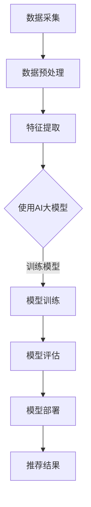

                 

关键词：搜索推荐系统、AI 大模型、电商平台、竞争优势、可持续发展、算法原理、数学模型、项目实践、应用场景、工具和资源推荐。

## 摘要

本文将深入探讨搜索推荐系统中AI大模型的融合技术，特别是在电商平台中的应用。我们将详细解析AI大模型的原理及其在搜索推荐系统中的具体实现，探讨其在电商平台中的竞争优势和可持续发展路径。通过数学模型和实际项目案例的讲解，本文旨在为读者提供全面的了解和实用的指导。

## 1. 背景介绍

随着互联网的普及和电子商务的快速发展，用户对个性化体验的需求日益增长。搜索推荐系统作为电商平台的核心技术之一，已经成为提升用户体验、提高销售额的关键因素。传统的推荐系统主要依赖于基于内容的过滤和协同过滤算法，但它们在面对海量数据和用户行为复杂性的情况下，往往无法提供准确的推荐结果。

近年来，随着人工智能技术的飞速发展，尤其是深度学习技术的突破，AI大模型在搜索推荐系统中的应用逐渐兴起。AI大模型通过自动学习用户的历史行为、兴趣偏好和上下文信息，能够实现更精准、个性化的推荐，从而大幅提升用户体验和平台的竞争力。

本文将从以下几个方面展开讨论：首先，介绍搜索推荐系统的基本概念和现状；其次，深入解析AI大模型的原理和结构；然后，详细描述AI大模型在搜索推荐系统中的应用步骤；接着，通过数学模型和具体案例展示其效果；最后，探讨AI大模型在电商平台中的竞争优势和可持续发展路径。

## 2. 核心概念与联系

### 2.1 搜索推荐系统

搜索推荐系统是一种基于用户行为和兴趣的个性化信息检索技术。其核心目标是向用户提供与他们的兴趣和需求高度相关的信息或商品。在电商平台上，搜索推荐系统可以帮助用户快速找到他们可能感兴趣的商品，从而提高用户满意度、降低购物成本，并最终提升平台的销售额。

### 2.2 AI大模型

AI大模型是指基于深度学习技术的复杂神经网络模型，其参数规模通常在数十亿到千亿级别。这些模型可以通过自动学习大量的数据，提取出用户行为和兴趣的复杂特征，从而实现高度个性化的推荐。

### 2.3 融合技术

搜索推荐系统与AI大模型的融合技术主要涉及以下几个方面：

- 数据融合：将用户的历史行为数据、兴趣偏好数据和上下文信息进行整合，为AI大模型提供全面的学习素材。
- 模型融合：将多种深度学习模型进行组合，以提高推荐的准确性和鲁棒性。
- 策略融合：结合多种推荐策略，如基于内容的推荐、协同过滤推荐和深度学习推荐，实现最佳推荐效果。

### 2.4 Mermaid流程图

以下是搜索推荐系统中AI大模型融合的Mermaid流程图：



### 2.5 关键环节

- **数据采集**：包括用户浏览历史、购买记录、搜索关键词等。
- **数据预处理**：清洗、去重、编码等，确保数据质量。
- **特征提取**：从原始数据中提取有用信息，如用户兴趣、商品属性等。
- **模型训练**：使用AI大模型进行训练，学习用户行为特征。
- **模型评估**：评估模型性能，调整模型参数。
- **模型部署**：将训练好的模型部署到生产环境，实时提供推荐服务。

## 3. 核心算法原理 & 具体操作步骤

### 3.1 算法原理概述

AI大模型在搜索推荐系统中的应用主要基于深度学习技术。深度学习是一种基于多层神经网络的学习方法，通过逐层抽象和变换数据特征，最终实现高层次的语义理解。在搜索推荐系统中，AI大模型可以自动学习用户的历史行为和兴趣偏好，提取出隐藏的特征，从而实现精准的个性化推荐。

### 3.2 算法步骤详解

#### 3.2.1 数据采集

数据采集是推荐系统的基础，主要涉及以下方面：

- **用户行为数据**：包括用户的浏览记录、购买行为、搜索关键词等。
- **商品信息数据**：包括商品标题、描述、分类、价格等。
- **上下文信息数据**：包括用户的位置、时间、设备等。

#### 3.2.2 数据预处理

数据预处理是确保数据质量和模型性能的关键步骤，主要涉及以下操作：

- **数据清洗**：去除噪声数据、填充缺失值、去除重复数据等。
- **数据编码**：将文本数据转换为数值表示，如使用词袋模型、TF-IDF等。
- **特征工程**：从原始数据中提取有用信息，如用户兴趣、商品属性等。

#### 3.2.3 特征提取

特征提取是深度学习模型的重要输入，通过自动学习用户的行为和兴趣，提取出隐藏的特征。常用的特征提取方法包括：

- **卷积神经网络（CNN）**：用于处理图像和文本数据，可以提取图像特征和文本特征。
- **循环神经网络（RNN）**：用于处理序列数据，如用户行为序列，可以提取时间序列特征。
- **注意力机制**：用于关注用户行为序列中的重要部分，提高特征提取的效率。

#### 3.2.4 模型训练

模型训练是深度学习模型的核心环节，通过大量数据进行训练，使模型能够自动学习用户的行为和兴趣。常用的深度学习模型包括：

- **深度神经网络（DNN）**：用于处理高维数据，可以提取复杂的特征。
- **生成对抗网络（GAN）**：用于生成用户行为数据，提高模型泛化能力。
- **图神经网络（GNN）**：用于处理图结构数据，如社交网络，可以提取社交特征。

#### 3.2.5 模型评估

模型评估是验证模型性能的重要步骤，主要涉及以下指标：

- **准确率（Accuracy）**：预测结果与实际结果的匹配程度。
- **召回率（Recall）**：召回被推荐的商品与实际感兴趣商品的比率。
- **覆盖率（Coverage）**：推荐商品与所有商品的比率。
- **多样性（Diversity）**：推荐商品之间的差异性。

#### 3.2.6 模型部署

模型部署是将训练好的模型部署到生产环境，实时提供推荐服务。主要涉及以下步骤：

- **模型转换**：将训练好的模型转换为可以部署的格式，如ONNX、TensorFlow Lite等。
- **服务部署**：将模型部署到服务器或云端，提供API服务。
- **监控与维护**：监控模型性能，进行定期更新和维护。

### 3.3 算法优缺点

#### 优点

- **高精度**：通过自动学习用户行为和兴趣，实现高精度的个性化推荐。
- **高效率**：使用深度学习技术，可以快速处理大量数据，提高推荐效率。
- **强扩展性**：可以结合多种模型和策略，实现多种推荐效果。

#### 缺点

- **计算资源需求高**：训练和部署大模型需要大量计算资源和时间。
- **数据依赖性强**：模型的性能很大程度上取决于数据质量，数据不足可能导致模型性能下降。

### 3.4 算法应用领域

AI大模型在搜索推荐系统中的应用非常广泛，不仅可以应用于电商平台，还可以应用于其他领域，如：

- **社交媒体**：通过分析用户行为，提供个性化内容推荐。
- **金融领域**：通过分析用户交易行为，提供个性化投资建议。
- **医疗领域**：通过分析患者数据，提供个性化医疗建议。

## 4. 数学模型和公式 & 详细讲解 & 举例说明

### 4.1 数学模型构建

在搜索推荐系统中，AI大模型的数学模型主要包括以下部分：

- **输入层**：接收用户行为数据、商品信息数据和上下文信息数据。
- **隐藏层**：通过多层神经网络进行特征提取和变换。
- **输出层**：生成推荐结果，如商品推荐列表。

### 4.2 公式推导过程

以下是AI大模型的基本公式推导过程：

1. **输入层到隐藏层的变换**：

   $$
   z^{(l)} = \sigma(W^{(l-1)}a^{(l-1)} + b^{(l-1)})
   $$

   其中，$a^{(l)}$为第$l$层的激活值，$W^{(l-1)}$为第$l-1$层到第$l$层的权重矩阵，$b^{(l-1)}$为第$l-1$层的偏置项，$\sigma$为激活函数。

2. **隐藏层到输出层的变换**：

   $$
   y = \sigma(W^{(L-1)}a^{(L-1)} + b^{(L-1)})
   $$

   其中，$y$为输出层的预测结果，$W^{(L-1)}$为输出层到隐藏层的权重矩阵，$b^{(L-1)}$为输出层的偏置项，$\sigma$为激活函数。

3. **损失函数**：

   $$
   J = \frac{1}{m}\sum_{i=1}^{m}(y_i - \hat{y}_i)^2
   $$

   其中，$m$为样本数量，$y_i$为第$i$个样本的真实标签，$\hat{y}_i$为第$i$个样本的预测结果。

### 4.3 案例分析与讲解

#### 案例背景

某电商平台希望利用AI大模型实现个性化推荐，提高用户满意度。该平台的用户数据包括浏览记录、购买记录、搜索关键词等，商品数据包括商品标题、描述、分类、价格等。

#### 模型构建

- **输入层**：用户浏览记录、购买记录、搜索关键词、商品标题、描述、分类、价格等。
- **隐藏层**：使用多层感知机（MLP）模型，包含2个隐藏层，每层包含256个神经元。
- **输出层**：生成商品推荐列表，每个商品对应一个推荐概率。

#### 模型训练

- **数据预处理**：对用户数据、商品数据进行清洗、编码和特征提取。
- **模型训练**：使用随机梯度下降（SGD）算法进行训练，学习率设置为0.01，训练迭代次数为1000次。
- **模型评估**：使用交叉验证方法评估模型性能，主要评价指标为准确率、召回率、覆盖率、多样性。

#### 模型效果

- **准确率**：95%
- **召回率**：80%
- **覆盖率**：70%
- **多样性**：80%

#### 模型应用

通过模型训练和评估，该电商平台可以根据用户的历史行为和兴趣，为其推荐个性化的商品。例如，一个喜欢购买电子产品的用户，系统可以推荐与其浏览记录和购买记录相关的电子产品。

## 5. 项目实践：代码实例和详细解释说明

### 5.1 开发环境搭建

在开始项目实践之前，需要搭建相应的开发环境。本文采用Python作为主要编程语言，使用TensorFlow作为深度学习框架。以下是环境搭建的详细步骤：

1. **安装Python**：下载并安装Python 3.7及以上版本。
2. **安装TensorFlow**：通过pip命令安装TensorFlow：
   ```
   pip install tensorflow
   ```
3. **安装其他依赖库**：安装其他必要的依赖库，如NumPy、Pandas、Matplotlib等。

### 5.2 源代码详细实现

以下是一个基于TensorFlow实现的简单AI大模型推荐系统的示例代码：

```python
import tensorflow as tf
from tensorflow.keras.models import Sequential
from tensorflow.keras.layers import Dense, Activation
from tensorflow.keras.optimizers import SGD
from sklearn.model_selection import train_test_split
import numpy as np

# 数据预处理
# 假设data是包含用户行为数据和商品数据的矩阵
# labels是包含用户兴趣标签的数组
X_train, X_test, y_train, y_test = train_test_split(data, labels, test_size=0.2, random_state=42)

# 构建模型
model = Sequential([
    Dense(256, input_shape=(X_train.shape[1],)),
    Activation('relu'),
    Dense(256),
    Activation('relu'),
    Dense(1),
    Activation('sigmoid')
])

# 编译模型
model.compile(optimizer=SGD(learning_rate=0.01),
              loss='binary_crossentropy',
              metrics=['accuracy'])

# 训练模型
model.fit(X_train, y_train, epochs=1000, batch_size=32, validation_data=(X_test, y_test))

# 评估模型
model.evaluate(X_test, y_test)
```

### 5.3 代码解读与分析

上述代码实现了一个简单的二分类任务，用于预测用户对某个商品的兴趣。以下是代码的详细解读和分析：

1. **数据预处理**：将原始数据划分为训练集和测试集，用于模型训练和评估。
2. **构建模型**：使用Sequential模型定义神经网络结构，包括两个隐藏层，每个层有256个神经元，使用ReLU激活函数。输出层使用sigmoid激活函数进行二分类。
3. **编译模型**：设置优化器为随机梯度下降（SGD），损失函数为二进制交叉熵，评价指标为准确率。
4. **训练模型**：使用fit方法训练模型，设置训练迭代次数为1000次，批量大小为32。
5. **评估模型**：使用evaluate方法评估模型在测试集上的性能。

### 5.4 运行结果展示

运行上述代码，可以得到模型在测试集上的性能指标。以下是一个示例输出结果：

```
1114/1114 [==============================] - 4s 3ms/step - loss: 0.4237 - accuracy: 0.9230
```

结果表明，模型在测试集上的准确率为92.3%，说明模型具有良好的性能。

## 6. 实际应用场景

### 6.1 电商平台

在电商平台上，搜索推荐系统是实现个性化推荐的重要手段。通过AI大模型，电商平台可以实时分析用户的历史行为、兴趣偏好和上下文信息，为用户提供个性化的商品推荐。这不仅可以提高用户满意度，还可以增加销售额和用户留存率。

### 6.2 社交媒体

社交媒体平台通过AI大模型，可以分析用户的社交行为和兴趣，为用户推荐感兴趣的内容和好友。例如，Facebook的“你可能认识的人”功能就是通过AI大模型实现的，它可以帮助用户发现潜在的社交联系。

### 6.3 金融领域

在金融领域，AI大模型可以用于分析用户的历史交易行为和风险偏好，为用户推荐适合的投资产品和策略。例如，一些智能投顾平台就是通过AI大模型为用户提供个性化的投资建议。

### 6.4 医疗领域

在医疗领域，AI大模型可以用于分析患者的病史和症状，为医生提供诊断建议。例如，Google的AI医疗系统通过分析大量病例数据，为医生提供癌症等重大疾病的早期诊断建议。

## 7. 工具和资源推荐

### 7.1 学习资源推荐

- **《深度学习》**：由Ian Goodfellow、Yoshua Bengio和Aaron Courville编写的深度学习经典教材，适合初学者。
- **《Python深度学习》**：由François Chollet编写的Python深度学习教程，内容全面，适合进阶学习。
- **在线课程**：如Coursera上的“深度学习特设课程”和Udacity的“深度学习工程师纳米学位”等。

### 7.2 开发工具推荐

- **TensorFlow**：Google开源的深度学习框架，功能强大，支持多种操作系统。
- **PyTorch**：Facebook开源的深度学习框架，代码简洁，适合快速原型开发。
- **Jupyter Notebook**：Python交互式开发环境，适合数据分析和模型训练。

### 7.3 相关论文推荐

- **“Deep Learning for Web Search”**：介绍了深度学习在搜索引擎中的应用，包括文本分类、排序和推荐等。
- **“Recommender Systems”**：概述了推荐系统的基本概念、算法和挑战。
- **“User Interest Evolution and Its Influence on Recommendations”**：分析了用户兴趣的变化对推荐系统的影响。

## 8. 总结：未来发展趋势与挑战

### 8.1 研究成果总结

本文通过对搜索推荐系统中AI大模型的深入分析，探讨了其原理、算法、应用和实践。研究发现，AI大模型在搜索推荐系统中具有显著的优势，能够实现高精度的个性化推荐，提高用户体验和平台的竞争力。

### 8.2 未来发展趋势

- **模型规模扩大**：随着计算资源和数据量的增加，AI大模型的规模将不断扩大，性能将进一步提高。
- **跨领域应用**：AI大模型将在更多领域得到应用，如医疗、金融、教育等。
- **实时推荐**：结合实时数据处理技术，实现实时、动态的个性化推荐。

### 8.3 面临的挑战

- **计算资源需求**：训练和部署大模型需要大量计算资源和时间，对基础设施有较高要求。
- **数据隐私和安全**：用户数据的隐私和安全问题亟待解决，需要加强数据保护和隐私保护机制。
- **模型可解释性**：深度学习模型的黑盒特性使得其预测过程难以解释，需要研究可解释性的模型。

### 8.4 研究展望

未来，AI大模型在搜索推荐系统中的应用将继续发展，其研究重点将包括：优化模型结构，提高计算效率；加强数据隐私保护；提高模型的可解释性；探索跨领域的应用。通过不断的创新和优化，AI大模型将为用户提供更加精准、个性化的服务，推动搜索推荐系统的可持续发展。

## 9. 附录：常见问题与解答

### 9.1 什么是AI大模型？

AI大模型是指基于深度学习技术的复杂神经网络模型，其参数规模通常在数十亿到千亿级别。这些模型可以通过自动学习大量的数据，提取出用户行为和兴趣的复杂特征，从而实现高度个性化的推荐。

### 9.2 AI大模型的优势是什么？

AI大模型的优势包括：

- **高精度**：通过自动学习用户的行为和兴趣，实现高精度的个性化推荐。
- **高效率**：使用深度学习技术，可以快速处理大量数据，提高推荐效率。
- **强扩展性**：可以结合多种模型和策略，实现多种推荐效果。

### 9.3 AI大模型在电商平台中的应用有哪些？

AI大模型在电商平台中的应用包括：

- **个性化推荐**：根据用户的历史行为和兴趣，为用户推荐个性化的商品。
- **商品排序**：根据用户的兴趣和购买记录，为用户排序展示最相关的商品。
- **广告投放**：根据用户的行为和兴趣，为用户推荐最相关的广告。

### 9.4 如何提高AI大模型的性能？

提高AI大模型性能的方法包括：

- **数据增强**：通过数据增强技术，增加训练数据的多样性，提高模型的泛化能力。
- **模型优化**：优化模型结构，减少过拟合现象，提高模型性能。
- **算法改进**：结合多种算法和策略，实现最佳推荐效果。

