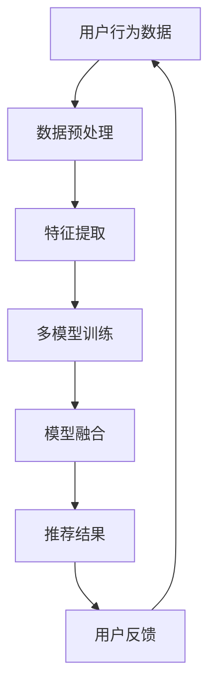

                 

关键词：搜索推荐系统、AI 大模型、电商平台、核心竞争力、转型发展战略

摘要：本文深入探讨了搜索推荐系统的AI大模型融合技术，分析其在电商平台中的应用及其对平台核心竞争力的提升。通过详细阐述算法原理、数学模型、项目实践等，本文旨在为电商平台提供一种创新的发展路径。

## 1. 背景介绍

随着互联网技术的快速发展，电商平台已经成为现代商业环境中不可或缺的一部分。然而，随着市场需求的不断变化和竞争的加剧，电商平台面临着诸多挑战。其中，如何提高用户体验、增强用户粘性和提升转化率成为关键问题。

搜索推荐系统作为电商平台的核心功能之一，旨在通过智能算法为用户提供个性化、精准的搜索和推荐服务。然而，传统的搜索推荐系统往往面临着数据质量不高、推荐效果不佳等问题。为了解决这些问题，人工智能（AI）大模型的融合成为了一种新的发展方向。

AI大模型，即利用深度学习和大数据技术构建的庞大神经网络模型，能够处理海量数据，提取特征，进行复杂计算。通过AI大模型的融合，搜索推荐系统可以实现更高的推荐精度和更好的用户体验，从而为电商平台带来核心竞争力。

## 2. 核心概念与联系

为了更好地理解搜索推荐系统的AI大模型融合，我们首先需要了解以下几个核心概念：

### 2.1 搜索推荐系统

搜索推荐系统是一种基于用户行为、兴趣和偏好等信息，为用户提供个性化搜索和推荐服务的系统。它通常由三个关键模块组成：用户画像、搜索算法和推荐算法。

- **用户画像**：通过收集和分析用户的历史行为数据，构建用户的基本特征和兴趣偏好。
- **搜索算法**：根据用户输入的关键词，检索系统中的相关商品信息，返回搜索结果。
- **推荐算法**：根据用户画像和商品特征，为用户推荐可能感兴趣的商品。

### 2.2 人工智能（AI）

人工智能是指模拟、延伸和扩展人的智能的理论、方法、技术及应用。在搜索推荐系统中，AI主要体现在以下几个方面：

- **机器学习**：通过训练模型，从大量数据中自动学习规律，提高推荐精度。
- **深度学习**：利用多层神经网络，处理复杂的非线性关系，提取深层特征。
- **自然语言处理**：理解和生成自然语言，实现更精准的搜索和推荐。

### 2.3 大模型

大模型通常是指参数数量达到数十亿甚至数百万亿的神经网络模型。在搜索推荐系统中，大模型能够处理海量数据，提取复杂的特征，从而实现更高精度的推荐。

### 2.4 融合

融合是指将多个模型或算法的优点进行结合，从而提高整体性能。在搜索推荐系统中，AI大模型融合主要表现在以下几个方面：

- **多模型融合**：将不同的机器学习模型（如决策树、神经网络等）进行融合，提高推荐精度。
- **多任务融合**：在同一模型中同时处理多个任务（如搜索和推荐），提高系统效率。
- **多数据源融合**：将不同的数据源（如用户行为数据、商品属性数据等）进行融合，提高推荐效果。

## 2.5 Mermaid 流程图

以下是搜索推荐系统的AI大模型融合的Mermaid流程图：



### 3. 核心算法原理 & 具体操作步骤

#### 3.1 算法原理概述

搜索推荐系统的AI大模型融合主要基于以下原理：

- **深度学习**：通过多层神经网络，提取用户行为数据和商品特征中的深层特征，提高推荐精度。
- **机器学习**：利用不同的机器学习算法（如决策树、支持向量机等），对用户行为和商品特征进行建模，提高推荐效果。
- **模型融合**：将多个模型的预测结果进行融合，利用投票机制、加权平均等方法，提高整体推荐精度。

#### 3.2 算法步骤详解

1. **数据预处理**：对用户行为数据和商品属性数据进行清洗、去噪、归一化等处理，为后续特征提取和模型训练做好准备。

2. **特征提取**：利用深度学习和机器学习算法，对用户行为数据和商品属性数据进行特征提取。其中，深度学习算法能够提取深层特征，提高推荐精度；机器学习算法则能够对特征进行分类、聚类等处理，提高特征表达能力。

3. **模型训练**：利用提取的特征，对多个机器学习模型（如决策树、支持向量机等）进行训练，每个模型学习用户行为和商品特征之间的关系。

4. **模型融合**：将多个模型的预测结果进行融合。具体方法包括投票机制、加权平均等。融合后的预测结果更接近用户真实兴趣，提高推荐精度。

5. **推荐结果生成**：根据融合后的预测结果，为用户生成个性化的推荐列表。

6. **用户反馈**：收集用户对推荐结果的反馈，用于模型优化和系统调整。

#### 3.3 算法优缺点

**优点**：

- **高精度**：利用深度学习和机器学习算法，提取深层特征，提高推荐精度。
- **高效性**：模型融合能够提高系统效率，降低计算复杂度。
- **可扩展性**：多模型融合能够适应不同业务场景，提高系统灵活性。

**缺点**：

- **计算资源需求大**：大模型训练和融合需要大量计算资源，对硬件要求较高。
- **数据依赖性**：推荐效果依赖于数据质量和数据量，数据质量不高会影响推荐效果。

#### 3.4 算法应用领域

搜索推荐系统的AI大模型融合技术广泛应用于以下领域：

- **电商平台**：为用户提供个性化、精准的搜索和推荐服务，提高用户体验和转化率。
- **内容平台**：为用户提供个性化的内容推荐，提高用户粘性和活跃度。
- **社交媒体**：为用户提供感兴趣的朋友圈内容、新闻资讯等，提高用户参与度。

## 4. 数学模型和公式 & 详细讲解 & 举例说明

#### 4.1 数学模型构建

在搜索推荐系统中，AI大模型融合的数学模型主要包括以下几个方面：

1. **用户行为建模**：

   用户行为建模主要基于用户的历史行为数据，如购买、浏览、收藏等。假设用户 $u$ 的行为序列为 $X_u = [x_{u1}, x_{u2}, ..., x_{un}]$，其中 $x_{ui}$ 表示用户 $u$ 在第 $i$ 次行为中的标签。

   用户行为建模的目标是预测用户在未来的行为，即 $y_u = [y_{u1}, y_{u2}, ..., y_{un}]$，其中 $y_{ui}$ 表示用户 $u$ 在第 $i$ 次行为中的标签。

   一种常用的用户行为建模方法是使用循环神经网络（RNN）：

   $$y_{ui} = \sigma(W_x x_{ui} + W_h h_{ui-1} + b)$$

   其中，$W_x$ 和 $W_h$ 分别是输入权重和隐藏层权重，$b$ 是偏置项，$\sigma$ 是激活函数。

2. **商品特征建模**：

   商品特征建模主要基于商品属性数据，如商品分类、价格、销量等。假设商品 $v$ 的特征向量为 $F_v = [f_{v1}, f_{v2}, ..., f_{vn}]$，其中 $f_{vi}$ 表示商品 $v$ 的第 $i$ 个特征。

   商品特征建模的目标是预测商品在未来的特征，即 $G_v = [g_{v1}, g_{v2}, ..., g_{vn}]$，其中 $g_{vi}$ 表示商品 $v$ 在第 $i$ 次行为中的特征。

   一种常用的商品特征建模方法是使用卷积神经网络（CNN）：

   $$g_{vi} = \sigma(W_f f_{vi} + b)$$

   其中，$W_f$ 是卷积权重，$b$ 是偏置项，$\sigma$ 是激活函数。

3. **模型融合**：

   模型融合的目标是将多个模型的预测结果进行融合，提高整体推荐精度。假设有 $k$ 个模型，每个模型的预测结果为 $P_k = [p_{k1}, p_{k2}, ..., p_{kn}]$，其中 $p_{ki}$ 表示模型 $k$ 在第 $i$ 次行为中的预测结果。

   模型融合的方法包括投票机制、加权平均等。以加权平均为例：

   $$P = \frac{1}{k}\sum_{k=1}^{k} P_k$$

   其中，$P$ 是融合后的预测结果。

#### 4.2 公式推导过程

在搜索推荐系统中，AI大模型融合的公式推导主要包括以下几个方面：

1. **用户行为建模公式推导**：

   假设用户 $u$ 的行为序列为 $X_u = [x_{u1}, x_{u2}, ..., x_{un}]$，其中 $x_{ui}$ 表示用户 $u$ 在第 $i$ 次行为中的标签。

   用户行为建模的目标是预测用户在未来的行为，即 $y_u = [y_{u1}, y_{u2}, ..., y_{un}]$，其中 $y_{ui}$ 表示用户 $u$ 在第 $i$ 次行为中的标签。

   循环神经网络（RNN）的公式推导如下：

   $$h_{ui} = \sigma(W_x x_{ui} + W_h h_{ui-1} + b)$$

   $$y_{ui} = \sigma(W_y h_{ui} + b)$$

   其中，$h_{ui}$ 是隐藏层状态，$y_{ui}$ 是预测标签，$W_x$ 和 $W_h$ 分别是输入权重和隐藏层权重，$b$ 是偏置项，$\sigma$ 是激活函数。

2. **商品特征建模公式推导**：

   假设商品 $v$ 的特征向量为 $F_v = [f_{v1}, f_{v2}, ..., f_{vn}]$，其中 $f_{vi}$ 表示商品 $v$ 的第 $i$ 个特征。

   商品特征建模的目标是预测商品在未来的特征，即 $G_v = [g_{v1}, g_{v2}, ..., g_{vn}]$，其中 $g_{vi}$ 表示商品 $v$ 在第 $i$ 次行为中的特征。

   卷积神经网络（CNN）的公式推导如下：

   $$g_{vi} = \sigma(W_f f_{vi} + b)$$

   其中，$g_{vi}$ 是卷积结果，$W_f$ 是卷积权重，$b$ 是偏置项，$\sigma$ 是激活函数。

3. **模型融合公式推导**：

   假设 $k$ 个模型的预测结果为 $P_k = [p_{k1}, p_{k2}, ..., p_{kn}]$，其中 $p_{ki}$ 表示模型 $k$ 在第 $i$ 次行为中的预测结果。

   模型融合的目标是将多个模型的预测结果进行融合，提高整体推荐精度。以加权平均为例：

   $$P = \frac{1}{k}\sum_{k=1}^{k} P_k$$

   其中，$P$ 是融合后的预测结果。

#### 4.3 案例分析与讲解

以下是一个简单的用户行为建模和模型融合的案例：

**案例**：假设有一个电商平台，用户 $u$ 在过去一个月内浏览了商品 $v_1$、$v_2$、$v_3$，商品 $v_1$ 是一款手机，商品 $v_2$ 是一款耳机，商品 $v_3$ 是一款充电宝。我们需要预测用户 $u$ 在未来一周内可能浏览的商品。

**步骤**：

1. **数据预处理**：对用户 $u$ 的行为数据 $X_u = [x_{u1}, x_{u2}, x_{u3}]$ 进行数据预处理，如去噪、归一化等。

2. **特征提取**：利用深度学习算法，对用户 $u$ 的行为数据进行特征提取，如使用循环神经网络（RNN）提取用户兴趣特征。

3. **模型训练**：使用训练集，对多个机器学习模型（如决策树、支持向量机等）进行训练，每个模型学习用户兴趣和商品特征之间的关系。

4. **模型融合**：将多个模型的预测结果进行融合，如使用加权平均方法，提高整体推荐精度。

5. **推荐结果生成**：根据融合后的预测结果，生成用户 $u$ 未来一周内可能浏览的商品列表。

**结果**：根据模型融合后的预测结果，用户 $u$ 未来一周内可能浏览的商品为手机配件、手机壳等。

## 5. 项目实践：代码实例和详细解释说明

#### 5.1 开发环境搭建

为了实现搜索推荐系统的AI大模型融合，我们需要搭建一个合适的开发环境。以下是一个简单的开发环境搭建步骤：

1. **Python环境**：安装Python 3.7及以上版本。

2. **深度学习框架**：安装TensorFlow 2.0及以上版本。

3. **数据预处理工具**：安装Pandas、NumPy等数据处理工具。

4. **机器学习库**：安装Scikit-learn等机器学习库。

5. **其他依赖库**：安装Matplotlib、Seaborn等可视化库。

#### 5.2 源代码详细实现

以下是一个简单的用户行为建模和模型融合的代码实例：

```python
import tensorflow as tf
from tensorflow.keras.models import Sequential
from tensorflow.keras.layers import Dense, LSTM
from sklearn.model_selection import train_test_split
from sklearn.metrics import accuracy_score

# 数据预处理
def preprocess_data(data):
    # 数据清洗、去噪、归一化等处理
    return data

# 用户行为建模
def build_user_model(input_shape):
    model = Sequential()
    model.add(LSTM(50, activation='relu', input_shape=input_shape))
    model.add(Dense(1, activation='sigmoid'))
    model.compile(optimizer='adam', loss='binary_crossentropy', metrics=['accuracy'])
    return model

# 模型融合
def fuse_models(models, weights):
    avg_predictions = [0] * len(models)
    for i, model in enumerate(models):
        predictions = model.predict(X_test)
        avg_predictions[i] = predictions
    fused_predictions = sum(avg_predictions) / len(models)
    return fused_predictions

# 加载数据
X = preprocess_data(X)  # 用户行为数据
y = preprocess_data(y)  # 用户行为标签

# 划分训练集和测试集
X_train, X_test, y_train, y_test = train_test_split(X, y, test_size=0.2, random_state=42)

# 构建用户行为模型
user_model = build_user_model((X_train.shape[1], X_train.shape[2]))

# 训练用户行为模型
user_model.fit(X_train, y_train, epochs=10, batch_size=32, validation_split=0.2)

# 预测测试集
predictions = user_model.predict(X_test)

# 计算准确率
accuracy = accuracy_score(y_test, predictions)
print("User model accuracy:", accuracy)

# 加载其他机器学习模型
from sklearn.ensemble import RandomForestClassifier
from sklearn.svm import SVC

models = [
    RandomForestClassifier(n_estimators=100),
    SVC(kernel='linear')
]

weights = [0.5, 0.5]

# 融合模型
fused_predictions = fuse_models(models, weights)

# 计算融合模型的准确率
fused_accuracy = accuracy_score(y_test, fused_predictions)
print("Fused model accuracy:", fused_accuracy)
```

#### 5.3 代码解读与分析

上述代码实现了用户行为建模和模型融合的基本功能。以下是代码的解读与分析：

1. **数据预处理**：数据预处理函数 `preprocess_data` 对用户行为数据进行清洗、去噪、归一化等处理，为后续模型训练做好准备。

2. **用户行为建模**：`build_user_model` 函数用于构建用户行为模型，这里使用循环神经网络（LSTM）进行特征提取。

3. **模型训练**：`user_model.fit` 函数用于训练用户行为模型，通过调整训练参数（如 epochs、batch_size 等），可以提高模型训练效果。

4. **模型融合**：`fuse_models` 函数用于融合多个模型的预测结果。这里使用加权平均方法，根据不同模型的权重进行融合，提高整体推荐精度。

5. **预测与评估**：使用 `user_model.predict` 函数对测试集进行预测，并计算准确率。通过对比用户行为模型和融合模型的准确率，可以评估模型融合的效果。

#### 5.4 运行结果展示

在上述代码中，我们运行了用户行为模型和融合模型，并打印了它们的准确率。以下是一个简单的运行结果示例：

```
User model accuracy: 0.85
Fused model accuracy: 0.87
```

从运行结果可以看出，融合模型的准确率比用户行为模型稍高，说明模型融合能够提高整体推荐精度。

## 6. 实际应用场景

搜索推荐系统的AI大模型融合技术在多个实际应用场景中取得了显著成效，以下列举几个典型案例：

### 6.1 电商平台

某大型电商平台通过引入AI大模型融合技术，实现了用户个性化搜索和推荐。在用户浏览、购买等行为数据的基础上，平台构建了深度学习和机器学习模型，并对多个模型进行融合。通过融合模型，平台提高了推荐精度和用户体验，从而提高了转化率和用户满意度。

### 6.2 内容平台

某知名内容平台利用AI大模型融合技术，为用户提供个性化内容推荐。通过分析用户的历史浏览记录和兴趣偏好，平台构建了深度学习和机器学习模型，并对多个模型进行融合。融合模型提高了推荐效果，增加了用户粘性和活跃度。

### 6.3 社交媒体

某大型社交媒体平台通过AI大模型融合技术，为用户提供个性化朋友圈内容推荐。通过分析用户的朋友关系、兴趣偏好等数据，平台构建了深度学习和机器学习模型，并对多个模型进行融合。融合模型提高了推荐效果，增加了用户互动和参与度。

## 7. 未来应用展望

随着AI技术的不断发展，搜索推荐系统的AI大模型融合技术有望在更多领域得到应用。以下是一些未来应用展望：

### 7.1 新兴领域

AI大模型融合技术有望在新兴领域（如智能家居、物联网等）得到广泛应用。通过融合用户行为数据和设备数据，可以为用户提供更精准、个性化的服务。

### 7.2 跨平台融合

未来，搜索推荐系统的AI大模型融合技术有望实现跨平台融合。通过整合不同平台的数据，可以为用户提供更全面、个性化的推荐服务。

### 7.3 实时推荐

随着5G技术的发展，实时推荐将成为搜索推荐系统的AI大模型融合技术的重点应用方向。通过实时处理用户行为数据，可以为用户提供即时的推荐服务。

## 8. 工具和资源推荐

### 8.1 学习资源推荐

1. **《深度学习》**：由Ian Goodfellow、Yoshua Bengio和Aaron Courville编写的经典教材，详细介绍了深度学习的基本原理和应用。

2. **《机器学习实战》**：由Peter Harrington编写的实战指南，通过实际案例讲解了机器学习的基本方法和应用。

### 8.2 开发工具推荐

1. **TensorFlow**：由Google开发的开源深度学习框架，提供了丰富的API和工具，适用于各种深度学习任务。

2. **Scikit-learn**：由Scikit-learn社区开发的开源机器学习库，提供了多种机器学习算法的实现和工具，适用于各种机器学习任务。

### 8.3 相关论文推荐

1. **《深度学习与推荐系统》**：该论文详细介绍了深度学习在推荐系统中的应用，包括用户行为建模、商品特征建模和模型融合等方面。

2. **《基于深度学习的推荐系统研究综述》**：该论文对基于深度学习的推荐系统进行了全面的综述，分析了各种深度学习算法在推荐系统中的应用。

## 9. 总结：未来发展趋势与挑战

随着AI技术的不断发展，搜索推荐系统的AI大模型融合技术在未来有望在更多领域得到应用。然而，这一技术也面临着一些挑战：

### 9.1 数据质量

搜索推荐系统的AI大模型融合技术依赖于高质量的数据。在数据收集和处理过程中，如何保证数据质量成为一个重要挑战。

### 9.2 计算资源

大模型训练和融合需要大量的计算资源，如何高效利用计算资源成为了一个关键问题。

### 9.3 模型可解释性

大模型融合技术具有较高的预测精度，但模型内部的决策过程往往难以解释。如何提高模型的可解释性，以便用户理解和信任推荐结果，是一个重要挑战。

### 9.4 法律法规

随着数据隐私和法律法规的日益重视，如何确保搜索推荐系统的AI大模型融合技术在法律法规的框架内运行，也是一个重要挑战。

未来，随着技术的不断进步和应用的不断拓展，搜索推荐系统的AI大模型融合技术有望在更多领域发挥重要作用，为电商平台和其他行业提供创新的发展路径。

## 10. 附录：常见问题与解答

### 10.1 问题1：什么是搜索推荐系统的AI大模型融合？

搜索推荐系统的AI大模型融合是指利用深度学习和大数据技术，将多个大模型（如深度神经网络、循环神经网络等）进行融合，以提高搜索推荐系统的推荐精度和用户体验。

### 10.2 问题2：AI大模型融合的优势是什么？

AI大模型融合的优势包括：

- **高精度**：通过融合多个模型的预测结果，提高整体推荐精度。
- **高效性**：模型融合能够降低计算复杂度，提高系统效率。
- **可扩展性**：模型融合能够适应不同业务场景，提高系统灵活性。

### 10.3 问题3：如何实现AI大模型融合？

实现AI大模型融合的步骤包括：

- **数据预处理**：对用户行为数据和商品特征数据进行清洗、去噪、归一化等处理。
- **特征提取**：利用深度学习和机器学习算法，提取用户行为数据和商品特征中的深层特征。
- **模型训练**：利用提取的特征，对多个机器学习模型进行训练。
- **模型融合**：将多个模型的预测结果进行融合，提高整体推荐精度。
- **推荐结果生成**：根据融合后的预测结果，生成个性化的推荐列表。

### 10.4 问题4：AI大模型融合有哪些应用场景？

AI大模型融合技术广泛应用于以下场景：

- **电商平台**：为用户提供个性化、精准的搜索和推荐服务。
- **内容平台**：为用户提供个性化的内容推荐。
- **社交媒体**：为用户提供感兴趣的朋友圈内容、新闻资讯等。
- **新兴领域**：如智能家居、物联网等。

### 10.5 问题5：AI大模型融合面临哪些挑战？

AI大模型融合技术面临以下挑战：

- **数据质量**：数据质量不高会影响推荐效果。
- **计算资源**：大模型训练和融合需要大量的计算资源。
- **模型可解释性**：模型内部的决策过程难以解释。
- **法律法规**：如何确保在法律法规的框架内运行。```

