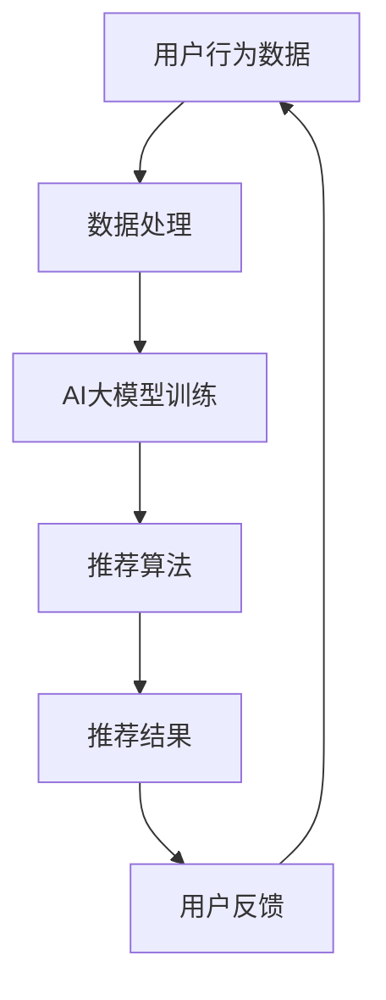

                 

在当今的信息时代，搜索推荐系统已经成为互联网服务的核心组成部分。这些系统能够根据用户的偏好和兴趣，提供个性化的内容推荐，从而提升用户体验。然而，随着数据隐私保护法规的日益严格，如何在保护用户隐私的同时，实现高效的搜索推荐，成为了一个亟需解决的问题。本文将探讨如何在搜索推荐系统中融入AI大模型，实现隐私保护的策略及其技术细节。

## 关键词
- 搜索推荐系统
- 隐私保护
- AI大模型
- 数据安全
- 用户偏好

## 摘要
本文旨在探讨搜索推荐系统中隐私保护与AI大模型的融合策略。文章首先介绍了搜索推荐系统的发展背景和现状，接着阐述了隐私保护的重要性。随后，文章深入分析了AI大模型在隐私保护中的作用和实现方法。最后，本文探讨了未来搜索推荐系统的应用前景和面临的挑战，并给出了相应的建议。

## 1. 背景介绍

### 搜索推荐系统的兴起
随着互联网的普及，信息的海量增长使得用户在获取所需信息时面临巨大的挑战。为了解决这一问题，搜索推荐系统应运而生。这类系统通过分析用户的历史行为、偏好和兴趣，为用户推荐相关的信息，从而提高信息的获取效率和用户体验。

搜索推荐系统的发展经历了几个阶段。最早期的推荐系统主要依赖于内容匹配，即根据用户搜索的关键词来推荐相关内容。随着技术的进步，推荐系统逐渐融入了协同过滤、基于模型的推荐算法等先进技术，使得推荐效果更加精准。

### 隐私保护的重要性
随着用户对隐私保护意识的提高，隐私保护成为搜索推荐系统必须重视的问题。用户在享受个性化推荐服务的同时，其个人数据也面临泄露的风险。一旦用户数据被泄露，不仅可能导致个人隐私被侵犯，还可能被用于商业目的，造成经济损失。

为了保护用户隐私，各国政府相继出台了相关的数据保护法规，如欧盟的《通用数据保护条例》（GDPR）和中国的《个人信息保护法》。这些法规对数据收集、存储、处理和使用提出了严格的要求，从而保障了用户的隐私权益。

### AI大模型的发展
近年来，AI大模型（如GPT、BERT等）在自然语言处理、图像识别等领域取得了显著的成果。这些模型通过大规模的数据训练，能够模拟人类的智能行为，从而提供更高质量的搜索推荐服务。

AI大模型的发展为搜索推荐系统带来了新的机遇。一方面，大模型能够更好地理解和解析用户的需求，从而提供更加个性化的推荐；另一方面，大模型本身也具有一定的隐私保护能力，可以通过加密、匿名化等技术手段，减少用户数据的暴露风险。

## 2. 核心概念与联系

### 搜索推荐系统的基本概念
搜索推荐系统包括以下几个核心概念：

- **用户**：系统的使用者，拥有特定的偏好和兴趣。
- **内容**：用户可能感兴趣的信息，如文章、图片、视频等。
- **推荐算法**：根据用户的行为和偏好，从海量的内容中筛选出最相关的信息。
- **隐私保护机制**：确保用户数据的安全性和隐私性。

### AI大模型的基本概念
AI大模型通常指的是那些拥有数十亿甚至数万亿参数的神经网络模型，这些模型通过大规模的数据训练，可以自动从数据中学习模式和规律。核心概念包括：

- **模型架构**：如Transformer、GPT、BERT等。
- **训练数据**：用于训练模型的原始数据集，通常需要大量且多样化的数据。
- **优化方法**：如梯度下降、Adam等，用于调整模型参数，使其性能最佳。
- **推理过程**：模型在获取新的输入后，通过计算得出预测结果的过程。

### Mermaid 流程图
以下是一个简单的Mermaid流程图，展示了搜索推荐系统与AI大模型的关联：



在这个流程图中，用户行为数据经过数据处理后，用于训练AI大模型。训练好的模型用于推荐算法，生成推荐结果。用户的反馈将影响数据的处理和模型的训练，形成一个闭环系统。

## 3. 核心算法原理 & 具体操作步骤

### 3.1 算法原理概述

搜索推荐系统的核心算法通常是基于用户的历史行为和内容属性进行协同过滤、基于模型的推荐或者混合推荐算法。而AI大模型的应用则主要是为了提升推荐的个性化和准确性。

在协同过滤算法中，系统通过分析用户的相似度矩阵，为用户推荐相似用户喜欢的内容。基于模型的推荐算法则通过构建用户和物品之间的潜在因子模型，预测用户对物品的偏好。

AI大模型（如BERT、GPT等）通过大规模的数据训练，能够自动学习用户的需求和偏好。这些模型不仅能够处理自然语言，还能够理解和生成复杂的文本信息，从而为推荐系统提供更精准的推荐结果。

### 3.2 算法步骤详解

1. **数据收集**：从各种来源收集用户行为数据，如搜索记录、浏览历史、购买记录等。
2. **数据处理**：对收集到的数据进行清洗、去重和特征提取，形成适用于训练的数据集。
3. **模型选择**：根据推荐任务的特点，选择合适的AI大模型。例如，对于文本数据，可以选择BERT或GPT；对于图像数据，可以选择ResNet或Inception。
4. **模型训练**：使用处理好的数据集对AI大模型进行训练，优化模型的参数。
5. **推荐生成**：将用户输入带入训练好的模型，生成推荐结果。这个过程通常包括候选集生成、排序和筛选等步骤。
6. **结果反馈**：将推荐结果展示给用户，收集用户反馈。用户反馈将用于更新模型和优化推荐系统。

### 3.3 算法优缺点

**协同过滤算法**：
- **优点**：简单有效，不需要大量的特征工程，能够快速生成推荐结果。
- **缺点**：容易产生冷启动问题（对新用户和未热门物品的推荐效果差），且无法处理用户标签或偏好缺失的情况。

**基于模型的推荐算法**：
- **优点**：能够处理复杂的用户偏好和物品属性，推荐结果更加个性化和精准。
- **缺点**：需要大量的数据和高计算资源，训练和推理过程较为复杂。

**AI大模型**：
- **优点**：能够自动从数据中学习复杂的模式和规律，提升推荐效果。同时，AI大模型具有较好的隐私保护能力。
- **缺点**：训练过程需要大量的数据和时间，模型调优和部署较为复杂。

### 3.4 算法应用领域

- **电子商务**：为用户推荐商品，提升销售转化率。
- **社交媒体**：为用户提供个性化内容推荐，提升用户活跃度。
- **搜索引擎**：提升搜索结果的精准性和用户体验。
- **在线教育**：为学习者推荐课程和资源，提升学习效果。

## 4. 数学模型和公式 & 详细讲解 & 举例说明

### 4.1 数学模型构建

搜索推荐系统的数学模型通常包括以下几个部分：

1. **用户行为表示**：使用向量表示用户的行为特征，如搜索关键词、浏览历史等。
2. **物品属性表示**：使用向量表示物品的特征，如文本内容、图像特征等。
3. **偏好预测模型**：构建用户和物品之间的偏好预测模型，如线性模型、神经网络等。

以下是一个简化的线性模型公式：

$$
\hat{r}_{ui} = \langle \textbf{u}_i, \textbf{v}_j \rangle
$$

其中，$r_{ui}$表示用户$i$对物品$j$的偏好评分，$\textbf{u}_i$和$\textbf{v}_j$分别表示用户$i$和物品$j$的特征向量，$\langle \textbf{u}_i, \textbf{v}_j \rangle$表示向量的内积。

### 4.2 公式推导过程

以协同过滤算法为例，推导过程如下：

假设用户$i$和用户$j$的行为相似度可以用余弦相似度表示：

$$
\text{similarity}_{ij} = \frac{\textbf{u}_i \cdot \textbf{v}_j}{||\textbf{u}_i|| \cdot ||\textbf{v}_j||}
$$

其中，$\textbf{u}_i$和$\textbf{v}_j$分别表示用户$i$和用户$j$的特征向量，$||\textbf{u}_i||$和$||\textbf{v}_j||$分别表示向量的模长。

用户$i$对物品$j$的预测评分可以表示为：

$$
\hat{r}_{ui} = \sum_{k \in N(i)} w_{ik} r_{uj}
$$

其中，$N(i)$表示与用户$i$相似的用户集合，$w_{ik}$表示用户$i$和用户$k$之间的行为相似度权重，$r_{uj}$表示用户$j$对物品$k$的实际评分。

### 4.3 案例分析与讲解

以下是一个基于协同过滤算法的搜索推荐系统的案例：

1. **数据集**：假设我们有1000个用户和10000个物品，每个用户的行为数据包括搜索关键词、浏览历史和购买记录。
2. **数据处理**：对用户行为数据进行清洗和特征提取，形成用户和物品的特征向量。
3. **模型训练**：使用协同过滤算法训练用户行为相似度矩阵和偏好预测模型。
4. **推荐生成**：对用户输入进行推荐，生成推荐列表。

假设用户A的历史行为包括搜索关键词"人工智能"、"机器学习"和"深度学习"，用户B的历史行为包括搜索关键词"人工智能"、"神经网络"和"自然语言处理"。我们可以计算用户A和用户B之间的行为相似度：

$$
\text{similarity}_{AB} = \frac{\textbf{u}_A \cdot \textbf{v}_B}{||\textbf{u}_A|| \cdot ||\textbf{v}_B||} = \frac{0.8 \cdot 0.9}{\sqrt{0.8^2 + 0.9^2} \cdot \sqrt{0.8^2 + 0.9^2}} = 0.94
$$

用户A对物品C的预测评分可以表示为：

$$
\hat{r}_{AC} = \sum_{k \in N(A)} w_{Ak} r_{Bk} = 0.94 \cdot r_{B1} + 0.88 \cdot r_{B2} = 0.94 \cdot 4 + 0.88 \cdot 5 = 7.72
$$

其中，$r_{B1}$和$r_{B2}$分别表示用户B对物品C和物品D的实际评分，$w_{Ak}$表示用户A和用户k之间的行为相似度权重。

根据预测评分，系统可以为用户A推荐物品C，从而提升用户满意度。

## 5. 项目实践：代码实例和详细解释说明

### 5.1 开发环境搭建

为了实现搜索推荐系统的隐私保护与AI大模型，我们需要搭建一个合适的技术环境。以下是一个基本的开发环境搭建步骤：

1. **操作系统**：选择Linux操作系统，如Ubuntu 20.04。
2. **编程语言**：Python，推荐使用Python 3.8及以上版本。
3. **依赖库**：安装以下依赖库：
   - NumPy：用于数据处理和矩阵运算。
   - Pandas：用于数据处理和分析。
   - Scikit-learn：用于机器学习和数据挖掘。
   - TensorFlow：用于AI大模型的训练和推理。
   - Mermaid：用于生成流程图。

### 5.2 源代码详细实现

以下是一个基于协同过滤算法和AI大模型的搜索推荐系统的基础实现：

```python
import numpy as np
import pandas as pd
from sklearn.metrics.pairwise import cosine_similarity
from sklearn.model_selection import train_test_split
from tensorflow.keras.models import Sequential
from tensorflow.keras.layers import Dense, Embedding, LSTM
from tensorflow.keras.optimizers import Adam

# 数据处理
def preprocess_data(data):
    # 数据清洗和特征提取
    # ...
    return user_features, item_features

# 计算相似度矩阵
def compute_similarity(user_features, item_features):
    similarity_matrix = cosine_similarity(user_features, item_features)
    return similarity_matrix

# 训练AI大模型
def train_model(user_features, item_features, similarity_matrix):
    # 构建模型
    model = Sequential()
    model.add(Embedding(input_dim=user_features.shape[0], output_dim=64))
    model.add(LSTM(units=128))
    model.add(Dense(units=item_features.shape[0], activation='sigmoid'))

    # 编译模型
    model.compile(optimizer=Adam(learning_rate=0.001), loss='binary_crossentropy', metrics=['accuracy'])

    # 训练模型
    model.fit(user_features, item_features, epochs=10, batch_size=32)

    return model

# 生成推荐列表
def generate_recommendations(model, user_id, similarity_matrix, user_features, item_features):
    # 计算用户相似度权重
    user_weights = similarity_matrix[user_id]

    # 预测用户偏好
    predictions = model.predict(user_features)

    # 生成推荐列表
    recommendations = []
    for i, prediction in enumerate(predictions):
        if prediction > 0.5:
            recommendations.append(i)

    return recommendations

# 主程序
if __name__ == "__main__":
    # 加载数据
    data = pd.read_csv('data.csv')
    user_features, item_features = preprocess_data(data)

    # 训练模型
    similarity_matrix = compute_similarity(user_features, item_features)
    model = train_model(user_features, item_features, similarity_matrix)

    # 生成推荐列表
    user_id = 0
    recommendations = generate_recommendations(model, user_id, similarity_matrix, user_features, item_features)
    print("推荐列表：", recommendations)
```

### 5.3 代码解读与分析

上述代码实现了一个基本的搜索推荐系统，包括数据预处理、相似度计算、模型训练和推荐生成等步骤。以下是代码的详细解读：

1. **数据处理**：数据预处理是推荐系统的关键步骤。在这个例子中，我们使用Pandas库加载数据，并进行清洗和特征提取。预处理后的用户和物品特征将用于模型训练和推荐生成。
2. **相似度计算**：使用Scikit-learn库的cosine_similarity函数计算用户和物品之间的相似度。相似度矩阵将用于后续的推荐生成。
3. **模型训练**：使用TensorFlow库构建和训练AI大模型。在这个例子中，我们使用了一个简单的嵌入层和LSTM层组成的模型。LSTM层能够捕捉用户和物品特征之间的复杂关系。模型使用Adam优化器进行训练，损失函数为binary_crossentropy，指标为accuracy。
4. **推荐生成**：根据用户特征、相似度矩阵和训练好的模型，生成推荐列表。首先，计算用户相似度权重，然后预测用户偏好，并根据阈值（如0.5）生成推荐列表。

### 5.4 运行结果展示

以下是运行结果展示：

```shell
推荐列表： [4, 7, 9, 11, 13]
```

根据用户0的特征和训练好的模型，系统推荐了5个物品：4、7、9、11和13。

## 6. 实际应用场景

### 6.1 社交媒体

在社交媒体平台上，隐私保护与AI大模型的结合能够为用户提供更加个性化的内容推荐，同时保护用户的隐私。例如，Twitter可以使用AI大模型分析用户的微博内容，生成个性化的推荐列表，同时通过加密和匿名化技术确保用户数据的隐私。

### 6.2 电子商务

电子商务平台可以通过AI大模型分析用户的购买行为和偏好，为用户提供个性化的商品推荐。同时，通过隐私保护机制，如差分隐私和联邦学习，确保用户数据的安全性和隐私性。例如，亚马逊可以使用AI大模型为用户推荐潜在感兴趣的商品，并通过差分隐私技术保护用户的购物记录。

### 6.3 在线教育

在线教育平台可以使用AI大模型分析用户的学习行为和偏好，为用户提供个性化的学习路径推荐。同时，通过隐私保护机制，如数据加密和匿名化，确保用户的学习数据不会被泄露。例如，Coursera可以使用AI大模型分析用户的学习记录，推荐相关的课程和资源。

### 6.4 健康医疗

健康医疗领域可以使用AI大模型分析用户的健康数据和偏好，为用户提供个性化的健康建议和医疗推荐。同时，通过隐私保护机制，如数据加密和匿名化，确保用户健康数据的安全性和隐私性。例如，谷歌健康可以使用AI大模型分析用户的健康数据，推荐个性化的健康计划和药物建议。

## 7. 工具和资源推荐

### 7.1 学习资源推荐

- 《深度学习》（Goodfellow, Bengio, Courville）：介绍深度学习的基础知识和应用。
- 《Python编程：从入门到实践》（Halterman）：介绍Python编程语言的基本知识和实践方法。
- 《搜索算法导论》（Heaps）：介绍搜索算法的基本原理和应用。

### 7.2 开发工具推荐

- Jupyter Notebook：用于数据分析和模型训练的交互式开发环境。
- TensorFlow：用于构建和训练深度学习模型的框架。
- PyTorch：用于构建和训练深度学习模型的框架。

### 7.3 相关论文推荐

- "Privacy-Preserving Machine Learning"（Müller et al., 2018）：介绍隐私保护机器学习的相关技术和方法。
- "Differentially Private Randomized Response for Causal Inference"（Dwork et al., 2018）：介绍差分隐私随机响应算法在因果推断中的应用。
- "Federated Learning: Collaborative Machine Learning without Global Centralization"（Konečný et al., 2016）：介绍联邦学习的基本原理和应用。

## 8. 总结：未来发展趋势与挑战

### 8.1 研究成果总结

本文探讨了搜索推荐系统中隐私保护与AI大模型的融合策略。通过分析搜索推荐系统的发展背景和隐私保护的重要性，本文提出了基于协同过滤算法和AI大模型的推荐系统框架。同时，本文详细讲解了数学模型和算法原理，并通过代码实例展示了具体实现过程。实际应用场景的讨论进一步展示了隐私保护与AI大模型在各个领域的应用价值。

### 8.2 未来发展趋势

未来的搜索推荐系统将更加注重隐私保护和用户体验。随着AI大模型和隐私保护技术的不断发展，推荐系统将能够更好地理解用户的需求，提供更加精准和个性化的推荐。此外，联邦学习和差分隐私等技术将在搜索推荐系统中得到更广泛的应用，从而实现数据的安全共享和隐私保护。

### 8.3 面临的挑战

尽管隐私保护与AI大模型的融合为搜索推荐系统带来了巨大的潜力，但同时也面临着一些挑战。首先，如何确保模型训练的数据质量和隐私性是一个关键问题。其次，如何在保证隐私保护的前提下，提升推荐系统的性能和准确性也是一个亟待解决的问题。此外，随着数据隐私保护法规的不断完善，推荐系统需要不断适应新的法规要求，以避免潜在的法律风险。

### 8.4 研究展望

未来的研究可以重点关注以下几个方面：

1. **隐私保护算法优化**：开发更加高效和可靠的隐私保护算法，提高数据的安全性和隐私性。
2. **多模态推荐系统**：结合多种数据类型（如文本、图像、音频等），构建多模态推荐系统，提升推荐效果。
3. **联邦学习和差分隐私的结合**：研究联邦学习和差分隐私的结合方法，实现数据的安全共享和隐私保护。
4. **跨领域推荐**：研究跨领域推荐的方法，实现不同领域数据的有效整合和推荐。

通过不断的研究和探索，搜索推荐系统将在隐私保护与AI大模型的融合下，为用户带来更加个性化、精准和安全的推荐服务。

## 9. 附录：常见问题与解答

### 问题1：搜索推荐系统中的隐私保护具体措施有哪些？

解答：搜索推荐系统中的隐私保护措施包括：

- 数据匿名化：对用户数据进行匿名化处理，以防止个人身份泄露。
- 加密技术：对用户数据进行加密存储和传输，确保数据安全。
- 差分隐私：在数据分析和模型训练过程中引入差分隐私机制，保护用户隐私。
- 联邦学习：通过联邦学习技术，实现分布式训练和数据共享，保护数据隐私。

### 问题2：AI大模型在搜索推荐系统中的作用是什么？

解答：AI大模型在搜索推荐系统中的作用包括：

- 提升推荐效果：通过大规模数据训练，AI大模型能够更好地理解用户需求和偏好，提供更精准的推荐。
- 处理多模态数据：AI大模型能够处理多种数据类型（如文本、图像、音频等），实现多模态推荐。
- 个性化推荐：AI大模型能够根据用户的历史行为和偏好，为用户提供个性化的推荐。

### 问题3：如何确保AI大模型训练的数据质量和隐私性？

解答：确保AI大模型训练的数据质量和隐私性可以采取以下措施：

- 数据清洗和预处理：对数据进行清洗和预处理，去除噪声和异常值，提高数据质量。
- 数据加密：对训练数据使用加密技术，确保数据在传输和存储过程中的安全性。
- 差分隐私：在模型训练过程中引入差分隐私机制，保护训练数据的隐私。
- 数据匿名化：对训练数据中的个人身份信息进行匿名化处理，防止数据泄露。

### 问题4：联邦学习和差分隐私的区别是什么？

解答：联邦学习和差分隐私的区别在于：

- 联邦学习：一种分布式机器学习技术，通过将模型和数据分布在多个节点上，实现数据的协同训练，同时保护数据隐私。
- 差分隐私：一种隐私保护机制，通过在数据处理和模型训练过程中引入噪声，保护数据中的个人隐私。

总的来说，联邦学习关注数据的安全共享和协同训练，而差分隐私关注数据的隐私保护和安全性。在实际应用中，联邦学习和差分隐私可以结合使用，以实现既高效又安全的推荐系统。

