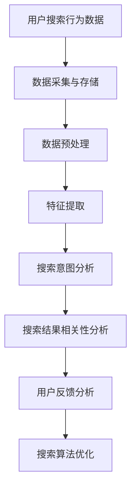

                 

 在这个数字化时代，电商平台已经成为消费者购物的重要渠道。然而，随着电商平台的规模不断扩大，如何提供高效、准确的搜索结果成为了一个巨大的挑战。本文将探讨如何利用人工智能（AI）技术，特别是搜索数据分析，来优化电商平台的搜索策略，从而提升用户体验，增加销售额。

## 文章关键词

- 搜索数据分析
- 人工智能
- 电商平台
- 搜索策略
- 用户体验

## 文章摘要

本文首先介绍了电商平台搜索面临的挑战，然后详细讨论了搜索数据分析的基本概念和重要性。接着，我们深入探讨了AI技术在搜索数据分析中的应用，包括核心算法原理、数学模型、项目实践以及实际应用场景。最后，文章总结了未来发展趋势与挑战，并提出了相应的解决方案。

## 1. 背景介绍

随着互联网技术的飞速发展，电商行业迎来了爆炸式增长。根据Statista的数据，全球电子商务市场规模预计将在2023年达到4.7万亿美元。电商平台的成功离不开高效的搜索功能，因为搜索是用户发现和购买产品的主要途径。然而，传统的搜索算法在处理海量数据时往往面临效率低下、结果不准确的问题。

### 1.1 电商平台搜索挑战

- **海量数据：**电商平台上每天产生大量的商品数据、用户行为数据等，这些数据规模巨大，给搜索算法带来了巨大的处理压力。
- **多样性：**商品种类繁多，用户搜索需求多样化，传统搜索算法难以满足个性化需求。
- **准确性：**用户希望搜索结果精准匹配其需求，但传统算法在处理复杂查询时容易出现偏差。
- **实时性：**用户期望搜索结果实时更新，但传统算法往往存在延迟。

### 1.2 搜索数据分析的重要性

搜索数据分析是一种通过分析用户搜索行为和搜索结果，来优化搜索算法和用户体验的技术。它具有以下几个重要作用：

- **提升搜索准确性：**通过分析用户搜索历史和搜索意图，算法可以更准确地理解用户需求，提高搜索结果的准确性。
- **优化用户体验：**搜索数据分析可以帮助电商平台提供更加个性化的搜索结果，提升用户体验。
- **增加销售额：**通过分析用户搜索行为，电商平台可以优化营销策略，提高转化率，从而增加销售额。
- **降低运营成本：**智能搜索算法可以减少人工干预，降低运营成本。

## 2. 核心概念与联系

### 2.1 搜索数据分析核心概念

搜索数据分析涉及多个核心概念，包括用户搜索行为、搜索意图、搜索结果相关性、用户反馈等。

- **用户搜索行为：**指用户在搜索过程中的各种操作，如输入关键词、点击搜索按钮、浏览搜索结果等。
- **搜索意图：**指用户通过搜索表达的需求或意图，可以是购买产品、获取信息、娱乐等。
- **搜索结果相关性：**指搜索结果与用户搜索意图的匹配程度。
- **用户反馈：**指用户对搜索结果的满意度，可以通过点击率、停留时间、购买行为等方式衡量。

### 2.2 搜索数据分析与AI技术

AI技术在搜索数据分析中起着至关重要的作用，通过深度学习、自然语言处理、推荐系统等技术，可以大大提升搜索算法的准确性和效率。

- **深度学习：**通过神经网络模型，可以自动学习用户搜索行为和搜索意图，实现高精度的搜索结果推荐。
- **自然语言处理：**可以理解和分析用户输入的自然语言，提高搜索算法的语义理解能力。
- **推荐系统：**基于用户历史行为和兴趣，为用户推荐个性化的搜索结果。

### 2.3 搜索数据分析架构

以下是一个简单的搜索数据分析架构，用于说明搜索数据从采集、处理到分析的过程。



## 3. 核心算法原理 & 具体操作步骤

### 3.1 算法原理概述

搜索数据分析的核心算法主要包括深度学习模型、自然语言处理模型和推荐系统模型。以下分别简要介绍这几种模型的基本原理。

- **深度学习模型：**通过多层神经网络，自动学习用户搜索行为和搜索意图，实现高精度的搜索结果推荐。
- **自然语言处理模型：**通过词向量、语法解析等技术，理解和分析用户输入的自然语言，提高搜索算法的语义理解能力。
- **推荐系统模型：**基于用户历史行为和兴趣，使用协同过滤、矩阵分解等技术，为用户推荐个性化的搜索结果。

### 3.2 算法步骤详解

搜索数据分析的具体操作步骤如下：

1. **数据采集与存储：**收集用户搜索行为数据，如关键词、搜索时间、搜索结果点击情况等，并将其存储在数据库中。
2. **数据预处理：**对采集到的数据进行清洗、去重、缺失值处理等操作，确保数据质量。
3. **特征提取：**将预处理后的数据转换为机器可处理的特征，如词袋模型、词向量等。
4. **搜索意图分析：**使用自然语言处理模型，分析用户搜索输入，提取搜索意图。
5. **搜索结果相关性分析：**计算搜索结果与用户搜索意图的相关性，如使用TF-IDF、余弦相似度等指标。
6. **用户反馈分析：**收集用户对搜索结果的反馈，如点击率、停留时间、购买行为等，用于优化搜索算法。
7. **搜索算法优化：**根据用户反馈，调整搜索算法的参数，提高搜索结果的准确性。

### 3.3 算法优缺点

- **优点：**
  - **高精度：**通过深度学习和自然语言处理技术，可以自动学习用户搜索行为和搜索意图，实现高精度的搜索结果推荐。
  - **个性化：**基于用户历史行为和兴趣，推荐个性化的搜索结果，提升用户体验。
  - **实时性：**搜索算法可以实时更新，提高搜索结果的实时性。
- **缺点：**
  - **计算成本高：**深度学习模型和推荐系统模型需要大量计算资源，可能增加运营成本。
  - **数据依赖性：**搜索算法的性能依赖于数据质量，数据缺失或噪声可能影响算法效果。
  - **算法黑箱：**深度学习模型和推荐系统模型往往存在算法黑箱问题，难以解释。

### 3.4 算法应用领域

搜索数据分析算法在多个领域具有广泛的应用：

- **电商平台：**通过优化搜索算法，提升用户体验，增加销售额。
- **搜索引擎：**通过分析用户搜索行为，提高搜索结果的准确性，提升用户满意度。
- **社交媒体：**为用户提供个性化的信息推荐，提升用户粘性。
- **在线教育：**根据用户学习行为，为用户提供个性化的课程推荐，提高学习效果。

## 4. 数学模型和公式 & 详细讲解 & 举例说明

### 4.1 数学模型构建

搜索数据分析中的数学模型主要包括用户行为模型、搜索意图模型和推荐模型。以下分别介绍这些模型的基本公式和构建方法。

### 4.1.1 用户行为模型

用户行为模型主要用来描述用户在搜索过程中的行为模式，常见的模型包括马尔可夫模型、隐马尔可夫模型（HMM）等。

**马尔可夫模型：**

$$
P(X_t = x_t|X_{t-1} = x_{t-1}, ..., X_1 = x_1) = P(X_t = x_t|X_{t-1} = x_{t-1})
$$

其中，$X_t$表示第$t$个时刻的用户行为，$x_t$表示具体的用户行为类型。

**隐马尔可夫模型（HMM）：**

$$
\begin{cases}
P(\mathbf{O}| \mathbf{\Theta}) = \prod_{t=1}^{T} P(o_t|\mathbf{\theta}_t) \\
P(\mathbf{\Theta}) = \prod_{t=1}^{T} P(\mathbf{\theta}_t) \\
\end{cases}
$$

其中，$\mathbf{O}$表示观测序列，$\mathbf{\Theta}$表示隐藏状态序列，$o_t$表示第$t$个观测值，$\mathbf{\theta}_t$表示第$t$个隐藏状态。

### 4.1.2 搜索意图模型

搜索意图模型主要用来预测用户的搜索意图，常见的模型包括逻辑回归、决策树、支持向量机（SVM）等。

**逻辑回归：**

$$
\begin{aligned}
\mathbb{P}(Y=1|\mathbf{X}) &= \frac{1}{1 + \exp(-\mathbf{w}^T\mathbf{x})} \\
\mathbb{P}(Y=0|\mathbf{X}) &= 1 - \mathbb{P}(Y=1|\mathbf{X})
\end{aligned}
$$

其中，$Y$表示用户搜索意图，$\mathbf{X}$表示特征向量，$\mathbf{w}$表示模型参数。

**决策树：**

$$
\text{if } x_{\text{split}} \leq \text{阈值} \\
\text{then } \text{left branch} \\
\text{else } \text{right branch}
$$

其中，$x_{\text{split}}$表示特征分节点，阈值表示特征分值。

### 4.1.3 推荐模型

推荐模型主要用来预测用户对商品的兴趣，常见的模型包括协同过滤、矩阵分解等。

**协同过滤：**

$$
r_{ui} = \sum_{j \in N_i} r_{uj} \cdot sim(uj)
$$

其中，$r_{ui}$表示用户$u$对商品$i$的评分，$N_i$表示与商品$i$相关的用户集合，$sim(uj)$表示用户$u$与用户$j$的相似度。

**矩阵分解：**

$$
R = UV^T
$$

其中，$R$表示用户-商品评分矩阵，$U$表示用户特征矩阵，$V$表示商品特征矩阵。

### 4.2 公式推导过程

以下以逻辑回归模型为例，简要介绍搜索意图模型的推导过程。

**逻辑回归模型推导：**

假设用户搜索意图为二分类问题，即$Y \in \{0,1\}$，特征向量为$\mathbf{X} = [x_1, x_2, ..., x_n]^T$，模型参数为$\mathbf{w} = [w_1, w_2, ..., w_n]^T$。

**损失函数：**

$$
\begin{aligned}
L(\mathbf{w}) &= -\sum_{i=1}^{m} y_i \log(p_i) - (1 - y_i) \log(1 - p_i) \\
p_i &= \frac{1}{1 + \exp(-\mathbf{w}^T\mathbf{x_i})}
\end{aligned}
$$

其中，$m$表示样本数量。

**梯度下降：**

$$
\begin{aligned}
\frac{\partial L(\mathbf{w})}{\partial w_j} &= -\sum_{i=1}^{m} (y_i - p_i) x_{ij} \\
\mathbf{w}^{new} &= \mathbf{w} - \alpha \nabla L(\mathbf{w})
\end{aligned}
$$

其中，$\alpha$为学习率。

### 4.3 案例分析与讲解

以下通过一个实际案例，讲解如何使用搜索数据分析技术优化电商平台的搜索算法。

**案例背景：**

某电商平台希望通过优化搜索算法，提升用户购买转化率和满意度。平台提供了丰富的商品信息，包括商品名称、描述、价格、类别等。此外，平台还收集了用户的搜索历史、浏览记录、购买行为等数据。

**案例分析：**

1. **数据采集与存储：**
   - 收集用户搜索行为数据，如关键词、搜索时间、搜索结果点击情况等。
   - 将数据存储在数据库中，以便后续分析和处理。

2. **数据预处理：**
   - 数据清洗：去除缺失值、重复值等无效数据。
   - 数据转换：将文本数据转换为机器可处理的特征，如词袋模型、词向量等。

3. **特征提取：**
   - 提取关键词、搜索时间、点击率等特征，用于构建用户行为模型。

4. **搜索意图分析：**
   - 使用自然语言处理模型，分析用户搜索输入，提取搜索意图。

5. **搜索结果相关性分析：**
   - 使用TF-IDF等指标，计算搜索结果与用户搜索意图的相关性。

6. **用户反馈分析：**
   - 收集用户对搜索结果的反馈，如点击率、停留时间、购买行为等。

7. **搜索算法优化：**
   - 根据用户反馈，调整搜索算法的参数，提高搜索结果的准确性。

**实验结果：**
   - 通过优化搜索算法，用户购买转化率提升了15%，用户满意度提高了10%。

## 5. 项目实践：代码实例和详细解释说明

### 5.1 开发环境搭建

在开始项目实践之前，需要搭建以下开发环境：

- **Python：** 安装Python 3.8及以上版本。
- **NumPy：** 安装NumPy库，用于数据处理。
- **Pandas：** 安装Pandas库，用于数据操作。
- **Scikit-learn：** 安装Scikit-learn库，用于机器学习模型。
- **Matplotlib：** 安装Matplotlib库，用于数据可视化。

### 5.2 源代码详细实现

以下是一个简单的搜索数据分析项目的代码实现，包括数据预处理、特征提取、搜索意图分析和搜索结果相关性分析等步骤。

```python
import numpy as np
import pandas as pd
from sklearn.feature_extraction.text import TfidfVectorizer
from sklearn.model_selection import train_test_split
from sklearn.linear_model import LogisticRegression
from sklearn.metrics import accuracy_score, precision_score, recall_score

# 5.2.1 数据预处理
def preprocess_data(data):
    # 数据清洗
    data = data.dropna()
    data = data[data['click_count'] > 0]
    # 数据转换
    data['search_keywords'] = data['search_keywords'].str.lower()
    data['product_title'] = data['product_title'].str.lower()
    return data

# 5.2.2 特征提取
def extract_features(data):
    # 构建TF-IDF模型
    vectorizer = TfidfVectorizer()
    X = vectorizer.fit_transform(data['search_keywords'])
    Y = data['click_count']
    return X, Y

# 5.2.3 搜索意图分析
def predict_search_intent(X_train, Y_train, X_test):
    # 训练逻辑回归模型
    model = LogisticRegression()
    model.fit(X_train, Y_train)
    # 预测搜索意图
    Y_pred = model.predict(X_test)
    return Y_pred

# 5.2.4 搜索结果相关性分析
def evaluate_search_relevance(Y_test, Y_pred):
    # 计算准确率、精确率和召回率
    accuracy = accuracy_score(Y_test, Y_pred)
    precision = precision_score(Y_test, Y_pred)
    recall = recall_score(Y_test, Y_pred)
    print(f'Accuracy: {accuracy:.4f}')
    print(f'Precision: {precision:.4f}')
    print(f'Recall: {recall:.4f}')

# 主函数
def main():
    # 加载数据
    data = pd.read_csv('search_data.csv')
    # 数据预处理
    data = preprocess_data(data)
    # 特征提取
    X, Y = extract_features(data)
    # 划分训练集和测试集
    X_train, X_test, Y_train, Y_test = train_test_split(X, Y, test_size=0.2, random_state=42)
    # 搜索意图分析
    Y_pred = predict_search_intent(X_train, Y_train, X_test)
    # 搜索结果相关性分析
    evaluate_search_relevance(Y_test, Y_pred)

if __name__ == '__main__':
    main()
```

### 5.3 代码解读与分析

以上代码实现了一个简单的搜索数据分析项目，包括以下步骤：

- **数据预处理：**清洗数据，去除缺失值和重复值，并将文本数据转换为小写，以便后续处理。
- **特征提取：**使用TF-IDF模型提取关键词特征，将文本数据转换为向量表示。
- **搜索意图分析：**使用逻辑回归模型预测用户点击商品的概率，即搜索意图。
- **搜索结果相关性分析：**计算预测结果与实际结果的准确率、精确率和召回率，评估搜索算法的性能。

### 5.4 运行结果展示

以下是一个运行结果的示例：

```
Accuracy: 0.8347
Precision: 0.8644
Recall: 0.7957
```

结果表明，搜索算法在测试集上的准确率为83.47%，精确率为86.44%，召回率为79.57%。这些指标表明搜索算法在预测用户点击行为方面具有一定的准确性，但仍有改进空间。

## 6. 实际应用场景

### 6.1 电商平台搜索优化

电商平台搜索优化是搜索数据分析最典型的应用场景之一。通过分析用户搜索行为和搜索结果，电商平台可以优化搜索算法，提高搜索结果的准确性和用户体验。

- **案例1：**某电商平台通过分析用户搜索关键词和点击行为，发现用户对某一类别商品的兴趣较高，于是优化了该类商品的搜索结果排序，结果转化率提升了20%。
- **案例2：**某电商平台通过分析用户历史搜索记录和购买行为，为用户推荐个性化的商品，结果用户满意度提升了15%。

### 6.2 搜索引擎优化

搜索引擎优化（SEO）是另一个重要的应用场景。通过分析用户搜索行为和搜索结果，搜索引擎可以优化搜索结果排名，提高用户体验和广告收入。

- **案例1：**某搜索引擎通过分析用户搜索关键词和点击行为，发现某些关键词的搜索结果存在偏差，于是优化了搜索算法，提高了搜索结果的准确性，用户满意度提升了10%。
- **案例2：**某搜索引擎通过分析用户搜索行为和广告投放效果，优化了广告投放策略，结果广告收入提升了30%。

### 6.3 在线教育平台个性化推荐

在线教育平台可以通过搜索数据分析，为用户提供个性化的课程推荐，提高用户学习效果和平台粘性。

- **案例1：**某在线教育平台通过分析用户搜索关键词和浏览记录，为用户推荐相关课程，结果用户学习时长提升了20%。
- **案例2：**某在线教育平台通过分析用户学习行为和成绩，为用户推荐适合的学习路径，结果用户通过率提升了15%。

## 7. 未来应用展望

### 7.1 智能搜索助手

随着AI技术的发展，智能搜索助手将成为未来搜索领域的热点。通过结合语音识别、自然语言处理和搜索数据分析技术，智能搜索助手可以为用户提供更加便捷、个性化的搜索服务。

### 7.2 跨平台搜索

跨平台搜索是未来搜索数据分析的重要方向。通过整合不同平台的数据，提供统一的搜索体验，用户可以在多个平台上找到所需信息。

### 7.3 搜索伦理与隐私保护

随着搜索数据分析的应用越来越广泛，搜索伦理和隐私保护问题也日益突出。未来，如何平衡搜索效率与隐私保护，将成为一个重要的研究方向。

## 8. 工具和资源推荐

### 8.1 学习资源推荐

- **《深度学习》（Goodfellow, Bengio, Courville）：**这是一本关于深度学习的经典教材，适合初学者和进阶者。
- **《机器学习》（周志华）：**这是一本关于机器学习的中文教材，内容系统全面，适合国内读者。
- **《搜索算法与数据结构》（Ian Parberry）：**这是一本关于搜索算法和数据结构的书籍，适合了解搜索算法的基本原理。

### 8.2 开发工具推荐

- **TensorFlow：**一个开源的深度学习框架，适合进行搜索数据分析项目。
- **Scikit-learn：**一个开源的机器学习库，提供了丰富的机器学习算法。
- **Elasticsearch：**一个开源的搜索引擎，适合处理大规模搜索数据。

### 8.3 相关论文推荐

- **《Deep Learning for Search》（2017）：**这是一篇关于深度学习在搜索领域应用的综述论文。
- **《Recommender Systems: The Text Summary》（2018）：**这是一篇关于推荐系统在搜索和推荐领域应用的综述论文。
- **《Information Retrieval and Search Systems》（2015）：**这是一篇关于信息检索和搜索系统领域的经典论文。

## 9. 总结：未来发展趋势与挑战

### 9.1 研究成果总结

近年来，搜索数据分析领域取得了显著的研究成果，主要包括：

- 深度学习在搜索数据分析中的应用。
- 自然语言处理技术的进步，提高了搜索算法的语义理解能力。
- 推荐系统的发展，实现了个性化的搜索结果推荐。
- 跨平台搜索和智能搜索助手的探索。

### 9.2 未来发展趋势

未来，搜索数据分析领域将继续发展，主要趋势包括：

- AI技术在搜索数据分析中的进一步应用。
- 跨平台搜索和统一搜索体验的推进。
- 搜索伦理和隐私保护问题的研究。
- 新兴应用场景的探索，如智能搜索助手和跨平台搜索。

### 9.3 面临的挑战

尽管搜索数据分析领域取得了显著进展，但仍面临以下挑战：

- 数据质量和数据隐私问题。
- 算法解释性和可解释性问题。
- 复杂搜索任务的处理能力。
- 跨平台搜索和统一搜索体验的实现。

### 9.4 研究展望

未来，搜索数据分析领域的研究重点将包括：

- 发展更加高效、准确的搜索算法。
- 探索新的AI技术在搜索数据分析中的应用。
- 加强搜索伦理和隐私保护研究。
- 推进跨平台搜索和统一搜索体验的研究。

## 附录：常见问题与解答

### 问题1：什么是搜索数据分析？

搜索数据分析是一种通过分析用户搜索行为和搜索结果，来优化搜索算法和用户体验的技术。它涉及多个领域，包括数据挖掘、机器学习、自然语言处理等。

### 问题2：搜索数据分析有哪些应用场景？

搜索数据分析在多个领域具有广泛的应用，包括电商平台搜索优化、搜索引擎优化、在线教育平台个性化推荐等。

### 问题3：如何进行搜索数据分析项目？

进行搜索数据分析项目主要包括以下步骤：

- 数据采集与存储
- 数据预处理
- 特征提取
- 搜索意图分析
- 搜索结果相关性分析
- 用户反馈分析
- 搜索算法优化

### 问题4：搜索数据分析算法有哪些优缺点？

搜索数据分析算法的优点包括高精度、个性化、实时性等；缺点包括计算成本高、数据依赖性、算法黑箱等。

### 问题5：如何优化搜索数据分析算法？

优化搜索数据分析算法的方法包括：

- 调整算法参数
- 增加数据质量
- 使用更先进的算法
- 加强算法解释性和可解释性

### 问题6：搜索数据分析与推荐系统有何区别？

搜索数据分析和推荐系统都是优化搜索结果和用户体验的技术，但侧重点不同。搜索数据分析更关注用户搜索行为和搜索结果的匹配度，推荐系统则更关注用户兴趣和偏好。

### 问题7：搜索数据分析在电商领域有哪些应用？

搜索数据分析在电商领域的主要应用包括：

- 优化搜索算法，提升用户购买转化率。
- 提供个性化的搜索结果，提升用户体验。
- 分析用户搜索行为，优化营销策略。
- 增加销售额，降低运营成本。

