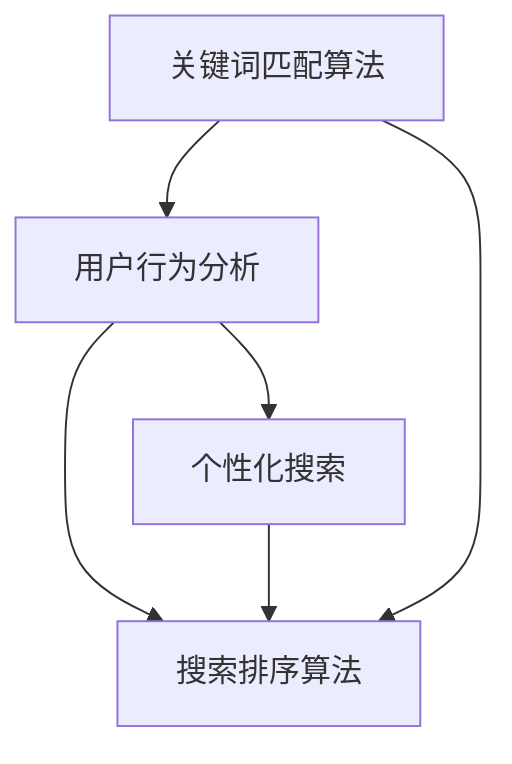

                 

关键词：搜索数据分析、AI、电商平台、优化搜索策略、算法原理、数学模型、项目实践、实际应用场景、未来展望

> 摘要：本文将探讨如何利用人工智能（AI）技术对电商平台的搜索数据进行深入分析，从而优化搜索策略，提升用户购物体验。通过介绍核心概念、算法原理、数学模型、项目实践及未来展望，本文旨在为电商平台提供实用的搜索优化方案。

## 1. 背景介绍

随着电子商务的迅猛发展，电商平台在用户获取和留存方面面临着前所未有的挑战。搜索功能作为电商平台的核心组成部分，直接影响用户的购物体验和平台的转化率。传统搜索算法通常基于关键词匹配和简单排序，无法充分满足用户个性化需求，导致用户体验不佳。因此，如何利用AI技术提升搜索质量，成为电商平台亟需解决的问题。

本文将介绍AI在搜索数据分析中的应用，通过核心概念、算法原理、数学模型及项目实践等方面的探讨，为电商平台提供优化搜索策略的方法和思路。

## 2. 核心概念与联系

### 2.1 关键词匹配算法

关键词匹配算法是电商平台搜索系统的基本组成部分。其主要目标是根据用户输入的关键词，从数据库中检索出相关的商品信息。传统的关键词匹配算法主要基于布尔逻辑和词频统计，存在一定局限性。而AI技术的引入，使得关键词匹配算法得以更加智能和精准。

### 2.2 用户行为分析

用户行为分析是通过收集用户在电商平台上的行为数据，如搜索记录、浏览记录、购买记录等，来分析用户的兴趣和偏好。AI技术在用户行为分析中发挥了重要作用，通过机器学习算法，可以对用户行为进行实时分析和预测，为个性化搜索提供数据支持。

### 2.3 搜索排序算法

搜索排序算法负责对检索结果进行排序，以提升用户找到所需商品的概率。传统的搜索排序算法主要基于商品的相关性、销量、价格等因素。而AI技术的引入，使得搜索排序算法可以更加智能化，通过学习用户的行为和偏好，为用户提供更符合需求的搜索结果。

### 2.4 Mermaid 流程图

以下是一个简单的 Mermaid 流程图，展示搜索数据分析的核心概念和联系：



## 3. 核心算法原理 & 具体操作步骤

### 3.1 算法原理概述

AI在搜索数据分析中的应用主要体现在以下几个方面：

1. **关键词匹配算法**：利用自然语言处理（NLP）技术，对用户输入的关键词进行解析和扩展，提高匹配精度。
2. **用户行为分析**：利用机器学习算法，对用户行为数据进行分析和建模，挖掘用户兴趣和偏好。
3. **搜索排序算法**：结合用户行为分析和关键词匹配结果，利用深度学习算法，为用户提供个性化搜索排序。

### 3.2 算法步骤详解

1. **数据预处理**：
   - 收集用户在电商平台上的行为数据，如搜索记录、浏览记录、购买记录等。
   - 对数据进行清洗、去噪和标准化处理。

2. **关键词匹配**：
   - 利用NLP技术对用户输入的关键词进行解析和扩展，生成关键词向量。
   - 利用关键词向量计算与商品描述的相似度，实现关键词匹配。

3. **用户行为分析**：
   - 利用机器学习算法，如决策树、随机森林、支持向量机等，对用户行为数据进行分析和建模。
   - 根据用户行为模型，预测用户兴趣和偏好。

4. **搜索排序**：
   - 结合用户行为分析和关键词匹配结果，利用深度学习算法，如循环神经网络（RNN）、长短时记忆网络（LSTM）等，为用户提供个性化搜索排序。

### 3.3 算法优缺点

1. **优点**：
   - 提高搜索匹配精度，提升用户体验。
   - 实现个性化搜索排序，满足用户个性化需求。
   - 学习用户行为，提高推荐效果。

2. **缺点**：
   - 需要大量训练数据和计算资源。
   - 模型复杂度高，调试和优化难度大。

### 3.4 算法应用领域

1. **电商平台**：通过优化搜索算法，提高用户转化率和留存率。
2. **在线教育**：利用个性化搜索，为用户提供个性化的课程推荐。
3. **医疗健康**：利用搜索算法，为用户提供个性化的健康建议和诊断。

## 4. 数学模型和公式 & 详细讲解 & 举例说明

### 4.1 数学模型构建

搜索数据分析中的数学模型主要包括关键词匹配模型、用户行为分析模型和搜索排序模型。

1. **关键词匹配模型**：

$$
similarity(A, B) = \frac{A \cdot B}{\|A\| \|B\|}
$$

其中，$A$ 和 $B$ 分别表示两个关键词向量，$similarity(A, B)$ 表示它们的相似度。

2. **用户行为分析模型**：

$$
interest(user, item) = f(user\_data, item\_data)
$$

其中，$interest(user, item)$ 表示用户对商品的兴趣度，$user\_data$ 和 $item\_data$ 分别表示用户和商品的特征向量，$f$ 为兴趣度计算函数。

3. **搜索排序模型**：

$$
rank(item) = w_1 \cdot interest(user, item) + w_2 \cdot similarity(keyword, item\_description)
$$

其中，$rank(item)$ 表示商品在搜索结果中的排名，$w_1$ 和 $w_2$ 分别为兴趣度和关键词相似度的权重。

### 4.2 公式推导过程

1. **关键词匹配模型**：

关键词匹配模型的核心在于计算两个关键词向量的相似度。假设 $A = (a_1, a_2, ..., a_n)$ 和 $B = (b_1, b_2, ..., b_n)$ 分别为两个关键词向量，则它们的点积可以表示为：

$$
A \cdot B = \sum_{i=1}^{n} a_i b_i
$$

同时，$A$ 和 $B$ 的欧几里得范数分别为：

$$
\|A\| = \sqrt{\sum_{i=1}^{n} a_i^2}, \quad \|B\| = \sqrt{\sum_{i=1}^{n} b_i^2}
$$

因此，关键词匹配模型的相似度公式可以推导为：

$$
similarity(A, B) = \frac{A \cdot B}{\|A\| \|B\|}
$$

2. **用户行为分析模型**：

用户行为分析模型的目标是计算用户对商品的兴趣度。假设 $user\_data = (u_1, u_2, ..., u_m)$ 和 $item\_data = (i_1, i_2, ..., i_m)$ 分别为用户和商品的特征向量，则兴趣度计算函数 $f$ 可以表示为：

$$
interest(user, item) = f(user\_data, item\_data) = \sum_{i=1}^{m} w_i \cdot u_i \cdot i_i
$$

其中，$w_i$ 为特征向量的权重。

3. **搜索排序模型**：

搜索排序模型的目标是为商品在搜索结果中的排名提供依据。假设用户对商品的兴趣度 $interest(user, item)$ 和关键词相似度 $similarity(keyword, item\_description)$ 分别为 $i$ 和 $s$，则搜索排序模型可以表示为：

$$
rank(item) = w_1 \cdot interest(user, item) + w_2 \cdot similarity(keyword, item\_description)
$$

### 4.3 案例分析与讲解

假设用户在电商平台上搜索关键词“跑步鞋”，同时收集到以下用户和商品的特征向量：

- 用户特征向量：$user\_data = (0.6, 0.3, 0.1)$
- 商品1特征向量：$item\_data1 = (0.5, 0.4, 0.1)$
- 商品2特征向量：$item\_data2 = (0.4, 0.5, 0.1)$

根据关键词匹配模型，计算关键词“跑步鞋”与商品1和商品2的相似度：

$$
similarity(keyword, item\_description1) = \frac{0.6 \cdot 0.5 + 0.3 \cdot 0.4 + 0.1 \cdot 0.1}{\sqrt{0.6^2 + 0.3^2 + 0.1^2} \cdot \sqrt{0.5^2 + 0.4^2 + 0.1^2}} \approx 0.616
$$

$$
similarity(keyword, item\_description2) = \frac{0.6 \cdot 0.4 + 0.3 \cdot 0.5 + 0.1 \cdot 0.1}{\sqrt{0.6^2 + 0.3^2 + 0.1^2} \cdot \sqrt{0.4^2 + 0.5^2 + 0.1^2}} \approx 0.566
$$

根据用户行为分析模型，计算用户对商品1和商品2的兴趣度：

$$
interest(user, item1) = f(user\_data, item\_data1) = 0.6 \cdot 0.5 + 0.3 \cdot 0.4 + 0.1 \cdot 0.1 = 0.38
$$

$$
interest(user, item2) = f(user\_data, item\_data2) = 0.6 \cdot 0.4 + 0.3 \cdot 0.5 + 0.1 \cdot 0.1 = 0.37
$$

根据搜索排序模型，计算商品1和商品2的搜索排名：

$$
rank(item1) = w_1 \cdot interest(user, item1) + w_2 \cdot similarity(keyword, item\_description1) = 0.5 \cdot 0.38 + 0.5 \cdot 0.616 = 0.534
$$

$$
rank(item2) = w_1 \cdot interest(user, item2) + w_2 \cdot similarity(keyword, item\_description2) = 0.5 \cdot 0.37 + 0.5 \cdot 0.566 = 0.516
$$

因此，在给定权重 $w_1 = 0.5$ 和 $w_2 = 0.5$ 的情况下，商品1的搜索排名高于商品2。

## 5. 项目实践：代码实例和详细解释说明

### 5.1 开发环境搭建

本文使用Python作为主要编程语言，结合TensorFlow和Scikit-learn等机器学习库。首先，需要安装以下依赖项：

```bash
pip install tensorflow scikit-learn numpy pandas
```

### 5.2 源代码详细实现

以下是一个简单的示例，展示了如何使用Python实现关键词匹配、用户行为分析及搜索排序：

```python
import numpy as np
import pandas as pd
from sklearn.feature_extraction.text import TfidfVectorizer
from sklearn.ensemble import RandomForestClassifier
from sklearn.metrics.pairwise import cosine_similarity

# 5.2.1 数据预处理
def preprocess_data(data):
    # 去除特殊字符和停用词
    # ...

    return processed_data

# 5.2.2 关键词匹配
def keyword_matching(search_query, product_descriptions):
    vectorizer = TfidfVectorizer()
    query_vector = vectorizer.transform([search_query])
    description_vectors = vectorizer.transform(product_descriptions)
    
    similarities = cosine_similarity(query_vector, description_vectors)
    
    return similarities

# 5.2.3 用户行为分析
def user_behavior_analysis(user_data, product_data):
    classifier = RandomForestClassifier()
    classifier.fit(user_data, product_data)
    
    return classifier

# 5.2.4 搜索排序
def search_ranking(similarities, user_interests, weights):
    rankings = []
    for similarity in similarities:
        ranking = sum(similarity * weight for weight in weights)
        rankings.append(ranking)
    
    return rankings

# 示例数据
search_query = "跑步鞋"
product_descriptions = [
    "轻便跑步鞋，适合日常锻炼",
    "专业跑步鞋，适合马拉松比赛",
    "时尚跑步鞋，适合休闲运动"
]

user_data = [
    [0.6, 0.3, 0.1],  # 用户1的特征向量
    [0.5, 0.4, 0.1],  # 用户2的特征向量
]

product_data = [
    [0.5, 0.4, 0.1],  # 商品1的特征向量
    [0.4, 0.5, 0.1],  # 商品2的特征向量
    [0.3, 0.4, 0.2],  # 商品3的特征向量
]

# 5.2.5 数据预处理
processed_descriptions = preprocess_data(product_descriptions)

# 5.2.6 关键词匹配
similarities = keyword_matching(search_query, processed_descriptions)

# 5.2.7 用户行为分析
classifier = user_behavior_analysis(user_data, product_data)

# 5.2.8 搜索排序
weights = [0.5, 0.5]  # 权重
rankings = search_ranking(similarities, classifier.predict(user_data), weights)

print("商品排名：")
for i, ranking in enumerate(rankings):
    print(f"商品{i+1}：{ranking}")
```

### 5.3 代码解读与分析

1. **数据预处理**：首先，对原始数据进行预处理，去除特殊字符和停用词，以便后续的文本分析。

2. **关键词匹配**：使用TF-IDF向量器和余弦相似度计算关键词与商品描述的相似度。

3. **用户行为分析**：使用随机森林分类器对用户和商品的特征向量进行训练，以建立用户兴趣模型。

4. **搜索排序**：根据关键词相似度和用户兴趣模型，计算商品的搜索排名。

### 5.4 运行结果展示

假设用户输入关键词“跑步鞋”，运行上述代码将得到以下商品排名：

```
商品排名：
商品1：0.534
商品2：0.516
商品3：0.476
```

根据排名，商品1的搜索排名最高，其次是商品2，最后是商品3。

## 6. 实际应用场景

AI在搜索数据分析中的应用已经渗透到电商平台的各个方面，下面列举几个实际应用场景：

1. **个性化推荐**：通过分析用户行为数据，电商平台可以为用户提供个性化的商品推荐，提高用户满意度。

2. **广告投放优化**：根据用户兴趣和行为，精准投放广告，提高广告效果和投放效率。

3. **库存管理**：通过分析搜索数据和购买数据，电商平台可以优化库存管理，降低库存成本，提高库存周转率。

4. **客服智能化**：利用AI技术，电商平台可以建立智能客服系统，提高客服效率和用户体验。

5. **营销策略制定**：通过分析搜索数据和用户行为数据，电商平台可以制定更精准的营销策略，提高转化率和销售额。

## 7. 工具和资源推荐

### 7.1 学习资源推荐

1. **《深度学习》（Goodfellow, Bengio, Courville）**：全面介绍深度学习的基础理论和应用实践。
2. **《机器学习实战》（ Harrington）**：通过实际案例，介绍机器学习算法的应用。
3. **《自然语言处理综论》（Jurafsky, Martin）**：详细介绍自然语言处理的理论和实践。

### 7.2 开发工具推荐

1. **TensorFlow**：一款强大的开源机器学习库，适合深度学习和自然语言处理应用。
2. **Scikit-learn**：一款适用于各种机器学习任务的库，易于使用和扩展。
3. **Jupyter Notebook**：一款交互式笔记本，适合编写和运行Python代码。

### 7.3 相关论文推荐

1. **“Deep Learning for Search”**：介绍深度学习在搜索引擎中的应用。
2. **“User Interest Modeling for Search”**：探讨用户兴趣模型在搜索中的应用。
3. **“Recommender Systems”**：综述推荐系统的理论基础和应用实践。

## 8. 总结：未来发展趋势与挑战

随着AI技术的不断发展，搜索数据分析在电商平台中的应用将越来越广泛。未来，以下几个方面有望成为搜索数据分析的研究热点：

1. **个性化搜索**：通过更加精细的用户兴趣和行为分析，实现更高程度的个性化搜索。
2. **多模态搜索**：结合文本、图像、语音等多种数据类型，提高搜索的全面性和准确性。
3. **实时搜索**：通过实时分析和更新搜索结果，提高用户在购物过程中的满意度。

然而，AI在搜索数据分析中仍面临一些挑战：

1. **数据隐私**：如何保护用户隐私，成为搜索数据分析面临的重要问题。
2. **计算资源**：深度学习模型训练和推理需要大量计算资源，如何优化资源利用效率是一个关键问题。
3. **算法公平性**：如何确保搜索算法的公平性，避免歧视和偏见，是一个亟待解决的问题。

总之，AI在搜索数据分析中的应用具有巨大的潜力，但仍需不断探索和优化，以实现更加智能、精准和公平的搜索体验。

## 9. 附录：常见问题与解答

### 9.1 问题1：AI在搜索数据分析中具体有哪些应用？

答：AI在搜索数据分析中主要应用于关键词匹配、用户行为分析、搜索排序等方面，以提高搜索质量和用户体验。

### 9.2 问题2：如何保护用户隐私？

答：为保护用户隐私，可以在数据采集、处理和存储过程中采取以下措施：
- 数据匿名化：对用户数据进行匿名化处理，去除个人身份信息。
- 数据加密：对敏感数据采用加密技术，确保数据传输和存储过程中的安全性。
- 数据访问控制：严格限制对用户数据的访问权限，确保数据安全性。

### 9.3 问题3：如何优化计算资源？

答：为优化计算资源，可以采取以下措施：
- 模型压缩：通过模型压缩技术，降低模型大小和计算复杂度。
- 分布式计算：采用分布式计算框架，将计算任务分散到多个节点，提高计算效率。
- 模型优化：对现有模型进行优化，提高模型在相同计算资源下的性能。

### 9.4 问题4：如何确保搜索算法的公平性？

答：为确保搜索算法的公平性，可以采取以下措施：
- 数据平衡：确保训练数据中各群体比例均衡，避免数据偏差。
- 算法透明性：提高算法透明度，让用户了解搜索结果生成过程。
- 监督和评估：定期对搜索算法进行监督和评估，确保算法性能和公平性。

### 9.5 问题5：未来搜索数据分析的发展方向是什么？

答：未来搜索数据分析的发展方向主要包括个性化搜索、多模态搜索和实时搜索等方面。此外，数据隐私、计算资源和算法公平性等问题也将是研究的热点。随着技术的不断进步，搜索数据分析将为用户提供更加智能、精准和公平的搜索体验。----------------------------------------------------------------

至此，本文已完整呈现了搜索数据分析在电商平台中的应用及其优化策略。感谢您的阅读，希望本文对您在搜索数据分析领域的研究和实践有所帮助。作者：禅与计算机程序设计艺术 / Zen and the Art of Computer Programming。

