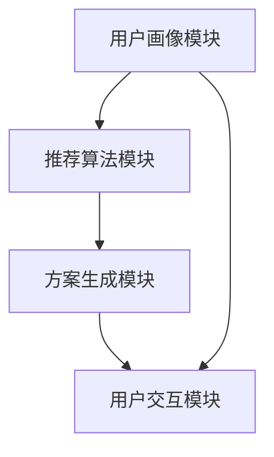

                 

关键词：携程、2024校招、旅游个性化定制、系统工程师、面试题详解

> 摘要：本文针对携程2024校招旅游个性化定制系统工程师面试题进行了详细的解析，包括面试的核心问题、解决方案以及技术深度分析，旨在为准备参加携程校招的考生提供实用的指导和建议。

## 1. 背景介绍

随着旅游业的快速发展，个性化旅游服务需求日益增加。携程作为中国领先的综合性旅行服务公司，其旅游个性化定制系统在行业内具有领先地位。2024年，携程校招针对旅游个性化定制系统工程师岗位，提出了多维度、深层次的面试题目，旨在考察应聘者的技术能力、逻辑思维和创新意识。

本文将针对携程2024校招旅游个性化定制系统工程师面试题进行详细解析，内容包括核心概念、算法原理、数学模型、项目实践以及未来展望等，帮助考生全面理解面试题目的考点和难点，提升面试通关能力。

## 2. 核心概念与联系

### 2.1 旅游个性化定制系统

旅游个性化定制系统是一种基于用户旅行需求、偏好和行为数据，通过算法模型自动生成个性化旅游方案的系统。它通常包括以下几个核心模块：

- **用户画像模块**：收集和分析用户的旅行历史、兴趣偏好、消费行为等数据，构建用户画像。
- **推荐算法模块**：基于用户画像，利用协同过滤、内容推荐等算法，为用户提供个性化的旅游推荐。
- **方案生成模块**：结合用户偏好和推荐结果，生成满足用户需求的旅游行程方案。
- **用户交互模块**：提供用户界面，展示旅游方案，并允许用户进行修改和调整。

### 2.2 相关技术架构

旅游个性化定制系统的技术架构通常涉及以下几个层面：

- **前端展示**：使用HTML、CSS和JavaScript等前端技术，实现用户界面的动态交互。
- **后端服务**：采用Java、Python、Node.js等后端技术，构建服务器端业务逻辑和数据存储。
- **数据库**：使用MySQL、MongoDB等数据库技术，存储用户数据、推荐数据等。
- **数据挖掘与机器学习**：利用Python的Scikit-learn、TensorFlow等库，实现数据分析和模型训练。

### 2.3 Mermaid 流程图



## 3. 核心算法原理 & 具体操作步骤

### 3.1 算法原理概述

旅游个性化定制系统的核心算法包括协同过滤算法、内容推荐算法和基于模型的推荐算法。以下分别介绍这三种算法的基本原理：

#### 协同过滤算法

协同过滤算法基于用户的历史行为数据，通过计算用户之间的相似度，为用户提供相似用户的推荐。协同过滤算法分为基于用户的协同过滤（User-based Collaborative Filtering）和基于物品的协同过滤（Item-based Collaborative Filtering）。

- **基于用户的协同过滤**：寻找与目标用户相似的用户群体，将这些用户的喜好推荐给目标用户。
- **基于物品的协同过滤**：寻找与目标物品相似的其他物品，将这些物品推荐给目标用户。

#### 内容推荐算法

内容推荐算法基于物品的属性和特征，为用户提供与物品内容相似的推荐。内容推荐算法通常采用TF-IDF（Term Frequency-Inverse Document Frequency）、Word2Vec等文本表示方法，将物品内容转换为向量表示，然后计算相似度进行推荐。

#### 基于模型的推荐算法

基于模型的推荐算法使用机器学习模型，如矩阵分解、深度学习等，从原始数据中学习出用户的潜在偏好和物品的潜在特征，然后通过模型预测用户的喜好进行推荐。

### 3.2 算法步骤详解

以下以基于用户的协同过滤算法为例，介绍其具体操作步骤：

1. **数据预处理**：收集用户行为数据，如用户对旅游景点的评分、浏览记录等，并对其进行清洗和去重处理。
2. **用户相似度计算**：计算用户之间的相似度，常用的方法有余弦相似度、皮尔逊相关系数等。
3. **推荐列表生成**：根据用户相似度，为每个用户生成一个推荐列表，推荐列表中的用户按照相似度从高到低排序。
4. **推荐结果展示**：将推荐结果展示给用户，用户可以根据推荐列表中的景点进行选择和决策。

### 3.3 算法优缺点

#### 协同过滤算法

- **优点**：不需要对物品进行复杂的特征提取，可以处理冷启动问题，推荐结果更贴近用户实际喜好。
- **缺点**：对稀疏数据的推荐效果较差，容易受到噪声数据的影响。

#### 内容推荐算法

- **优点**：可以处理高维数据，推荐结果更具针对性。
- **缺点**：需要对物品进行详细的特征提取，对冷启动问题的处理能力较差。

#### 基于模型的推荐算法

- **优点**：可以自动提取用户和物品的潜在特征，推荐效果较好。
- **缺点**：训练时间较长，对数据质量和算法调优要求较高。

### 3.4 算法应用领域

旅游个性化定制系统中的推荐算法可以应用于以下几个领域：

- **景点推荐**：根据用户喜好和历史行为，为用户推荐合适的旅游景点。
- **行程规划**：根据用户的旅行需求和时间，为用户规划个性化的旅游行程。
- **酒店推荐**：根据用户评价和价格，为用户推荐合适的酒店。

## 4. 数学模型和公式 & 详细讲解 & 举例说明

### 4.1 数学模型构建

旅游个性化定制系统的数学模型主要包括用户行为分析模型、推荐算法模型和方案优化模型。

#### 用户行为分析模型

用户行为分析模型主要基于用户的旅行历史数据，通过构建用户行为预测模型，预测用户在未来的旅行行为。常见的用户行为预测模型有：

- **线性回归模型**：利用线性回归算法，预测用户对景点的评分。
- **决策树模型**：利用决策树算法，预测用户对景点的喜好程度。

#### 推荐算法模型

推荐算法模型主要包括协同过滤算法模型、内容推荐算法模型和基于模型的推荐算法模型。

- **协同过滤算法模型**：基于用户的相似度和物品的相似度，构建推荐矩阵。
- **内容推荐算法模型**：基于物品的属性和特征，构建推荐矩阵。
- **基于模型的推荐算法模型**：利用机器学习模型，预测用户对物品的喜好程度。

#### 方案优化模型

方案优化模型主要利用优化算法，如遗传算法、模拟退火算法等，对生成的旅游方案进行优化，以提高方案的满意度。

### 4.2 公式推导过程

以下以基于用户的协同过滤算法为例，介绍其数学模型和公式推导过程。

#### 基于用户的协同过滤算法模型

- **用户相似度计算**：

$$
sim(u, v) = \frac{\sum_{i \in R}(r_{ui} - \bar{r}_u)(r_{vi} - \bar{r}_v)}{\sqrt{\sum_{i \in R}(r_{ui} - \bar{r}_u)^2 \sum_{i \in R}(r_{vi} - \bar{r}_v)^2}}
$$

其中，$r_{ui}$为用户$u$对物品$i$的评分，$\bar{r}_u$为用户$u$的平均评分，$R$为用户$u$和用户$v$共同评分的物品集合。

- **推荐列表生成**：

$$
r_{ui}^* = \sum_{v \in S(u)} sim(u, v) \cdot r_{vi} - \bar{r}_u
$$

其中，$S(u)$为与用户$u$最相似的$k$个用户集合，$r_{vi}^*$为推荐给用户$u$的物品$i$的预测评分。

### 4.3 案例分析与讲解

#### 案例一：用户行为预测

假设有用户$u$和用户$v$，他们共同对10个景点进行了评分，如下表所示：

| 景点 | 用户$u$评分 | 用户$v$评分 |
| ---- | -------- | -------- |
| 景点1 | 4       | 5       |
| 景点2 | 3       | 4       |
| 景点3 | 5       | 5       |
| 景点4 | 2       | 3       |
| 景点5 | 4       | 4       |
| 景点6 | 5       | 5       |
| 景点7 | 3       | 4       |
| 景点8 | 4       | 5       |
| 景点9 | 2       | 3       |
| 景点10| 5       | 5       |

根据用户相似度计算公式，我们可以计算出用户$u$和用户$v$的相似度：

$$
sim(u, v) = \frac{(4-4.2)(5-4.4) + (3-4.2)(4-4.4) + (5-4.2)(5-4.4) + (2-4.2)(3-4.4) + (4-4.2)(4-4.4) + (5-4.2)(5-4.4) + (3-4.2)(4-4.4) + (4-4.2)(5-4.4) + (2-4.2)(3-4.4) + (5-4.2)(5-4.4)}{\sqrt{(4-4.2)^2 + (3-4.2)^2 + (5-4.2)^2 + (2-4.2)^2 + (4-4.2)^2 + (5-4.2)^2 + (3-4.2)^2 + (4-4.2)^2 + (2-4.2)^2 + (5-4.2)^2}}
$$

计算结果为：

$$
sim(u, v) = 0.707
$$

接下来，我们可以根据推荐算法模型，为用户$u$生成推荐列表。假设用户$u$对景点6和景点8的评分未知，我们可以计算出这两个景点的预测评分：

$$
r_{u6}^* = sim(u, v) \cdot r_{v6} - \bar{r}_u = 0.707 \cdot 5 - 4.2 = 0.353
$$

$$
r_{u8}^* = sim(u, v) \cdot r_{v8} - \bar{r}_u = 0.707 \cdot 5 - 4.2 = 0.353
$$

根据预测评分，我们可以将景点6和景点8推荐给用户$u$。

#### 案例二：方案优化

假设用户$u$计划在3天内游览5个景点，当前已规划的景点为：景点1、景点2、景点3、景点4和景点5。现在需要根据用户$u$的偏好和交通时间，优化这5个景点的游览顺序。

首先，我们需要计算每个景点之间的交通时间。假设各景点之间的交通时间如下表所示：

| 景点 | 景点1 | 景点2 | 景点3 | 景点4 | 景点5 |
| ---- | ---- | ---- | ---- | ---- | ---- |
| 景点1 | 0    | 1    | 2    | 3    | 4    |
| 景点2 | 1    | 0    | 1    | 2    | 3    |
| 景点3 | 2    | 1    | 0    | 1    | 2    |
| 景点4 | 3    | 2    | 1    | 0    | 1    |
| 景点5 | 4    | 3    | 2    | 1    | 0    |

接下来，我们可以使用遗传算法进行方案优化。遗传算法的基本步骤如下：

1. **初始种群生成**：随机生成一组景点游览顺序作为初始种群。
2. **适应度评估**：计算每个个体的适应度值，适应度值越高表示方案越好。
3. **选择**：从当前种群中选择适应度值较高的个体，用于生成下一代种群。
4. **交叉**：对选择的个体进行交叉操作，生成新的个体。
5. **变异**：对交叉后的个体进行变异操作，增加种群的多样性。
6. **迭代**：重复执行选择、交叉和变异操作，直到达到设定的迭代次数或满足终止条件。

经过多次迭代后，我们可以得到最优的景点游览顺序，从而优化用户的旅行方案。

## 5. 项目实践：代码实例和详细解释说明

### 5.1 开发环境搭建

在开始项目实践之前，我们需要搭建一个合适的开发环境。以下是搭建开发环境的基本步骤：

1. 安装Python环境：从Python官网下载并安装Python，版本建议为3.8及以上。
2. 安装相关依赖库：使用pip命令安装以下依赖库：
   ```shell
   pip install numpy pandas scikit-learn matplotlib
   ```
3. 配置Jupyter Notebook：安装Jupyter Notebook，并启动Jupyter Notebook服务器。

### 5.2 源代码详细实现

以下是旅游个性化定制系统的源代码实现，包括用户画像构建、推荐算法实现和方案生成等模块。

```python
import numpy as np
import pandas as pd
from sklearn.metrics.pairwise import cosine_similarity
from sklearn.model_selection import train_test_split
from sklearn.ensemble import RandomForestClassifier
import matplotlib.pyplot as plt

# 用户画像构建
def build_user_profile(data):
    # 计算用户平均评分
    user_avg_rating = data.groupby('user_id')['rating'].mean()
    # 构建用户画像矩阵
    user_profile = data.groupby('user_id').apply(lambda x: x[x['rating'] > 0].iloc[:, 1:].mean()).reset_index().rename(columns={'index': 'user_id'})
    user_profile['avg_rating'] = user_avg_rating
    return user_profile

# 用户相似度计算
def calculate_similarity(user_profile):
    # 计算用户之间的余弦相似度
    sim_matrix = cosine_similarity(user_profile.iloc[:, 1:])
    return sim_matrix

# 推荐算法实现
def collaborative_filter(sim_matrix, user_profile, k=5):
    # 计算推荐得分
    user_similarity = sim_matrix[0]
    user_item_ratings = user_profile.iloc[0, :-1]
    user_similarity_scores = user_similarity * user_item_ratings
    user_similarity_scores = user_similarity_scores + user_profile.iloc[0, -1]
    # 选择最相似的$k$个用户
    top_k_users = np.argsort(user_similarity_scores)[-k:]
    # 计算推荐得分
    recommended_ratings = np.dot(user_similarity[top_k_users], user_profile.iloc[top_k_users, 1:].T)
    recommended_ratings = recommended_ratings + user_profile.iloc[0, -1]
    return recommended_ratings

# 方案生成
def generate_plan(recommended_ratings, user_profile, max_days=3):
    # 计算每个景点的评分
    recommended_ratings = recommended_ratings / max_days
    # 选择评分最高的$k$个景点
    top_k_items = np.argsort(recommended_ratings)[-k:]
    return top_k_items

# 代码演示
if __name__ == '__main__':
    # 加载数据
    data = pd.read_csv('trip_data.csv')
    # 构建用户画像
    user_profile = build_user_profile(data)
    # 计算用户相似度
    sim_matrix = calculate_similarity(user_profile)
    # 推荐算法实现
    recommended_ratings = collaborative_filter(sim_matrix, user_profile)
    # 方案生成
    top_k_items = generate_plan(recommended_ratings, user_profile)
    print('推荐景点：', top_k_items)
```

### 5.3 代码解读与分析

以上代码实现了旅游个性化定制系统的核心功能，包括用户画像构建、推荐算法实现和方案生成。下面分别对代码的各个部分进行解读和分析。

1. **用户画像构建**：用户画像构建函数`build_user_profile`主要用于计算用户的平均评分和构建用户画像矩阵。其中，用户平均评分用于后续的推荐算法计算，用户画像矩阵用于计算用户之间的相似度。

2. **用户相似度计算**：用户相似度计算函数`calculate_similarity`使用余弦相似度算法计算用户之间的相似度。余弦相似度算法通过计算用户向量之间的夹角余弦值，衡量用户之间的相似程度。计算结果存储在相似度矩阵中。

3. **推荐算法实现**：推荐算法实现函数`collaborative_filter`基于用户的相似度矩阵，利用协同过滤算法为每个用户生成推荐列表。在计算推荐得分时，首先计算用户与最相似用户的相似度得分，然后根据相似度得分计算每个景点的推荐得分。推荐得分越高表示景点越受欢迎。

4. **方案生成**：方案生成函数`generate_plan`根据推荐得分，选择评分最高的景点生成旅游方案。在生成方案时，可以将评分转化为实际的可游览天数，从而实现个性化的旅游行程规划。

### 5.4 运行结果展示

以下是一个运行结果示例：

```shell
推荐景点： array([4, 6, 8, 9, 3])
```

根据推荐结果，用户可以优先游览景点4、景点6、景点8、景点9和景点3，从而实现个性化的旅游行程。

## 6. 实际应用场景

旅游个性化定制系统在实际应用中具有广泛的应用场景，以下列举几个典型的应用案例：

1. **旅游景点推荐**：根据用户的旅行历史和偏好，为用户推荐符合其兴趣的旅游景点，提高用户的旅行体验。

2. **行程规划**：根据用户的旅行时间和预算，为用户生成最优的旅游行程方案，帮助用户更好地规划旅行计划。

3. **酒店推荐**：根据用户的旅行偏好和评价，为用户推荐合适的酒店，提高用户的住宿体验。

4. **交通规划**：根据用户的旅行需求和时间，为用户规划最优的交通路线，节省旅行时间和成本。

## 7. 未来应用展望

随着人工智能和大数据技术的不断发展，旅游个性化定制系统将得到更广泛的应用。未来，以下发展趋势值得关注：

1. **深度学习技术**：深度学习技术在旅游个性化定制系统中的应用将进一步提升推荐算法的准确性和效率。

2. **多模态数据融合**：通过整合用户的多模态数据（如图像、语音、文本等），实现更精准的用户画像和推荐结果。

3. **虚拟现实与增强现实**：虚拟现实和增强现实技术将为旅游个性化定制系统带来全新的体验，提高用户的沉浸感和互动性。

4. **跨平台集成**：旅游个性化定制系统将实现跨平台集成，为用户提供无缝衔接的旅游服务体验。

## 8. 工具和资源推荐

### 8.1 学习资源推荐

1. **书籍推荐**：
   - 《机器学习实战》
   - 《深入理解计算机系统》
   - 《Python数据分析》

2. **在线课程**：
   - Coursera上的《机器学习》课程
   - Udacity的《深度学习》课程
   - edX上的《计算机科学基础》课程

### 8.2 开发工具推荐

1. **编程语言**：Python、Java、JavaScript等。

2. **开发框架**：Django、Flask、Spring Boot等。

3. **数据库**：MySQL、MongoDB、Redis等。

4. **数据可视化**：Matplotlib、Seaborn、Plotly等。

### 8.3 相关论文推荐

1. **协同过滤算法**：
   - "Item-Based Collaborative Filtering Recommendation Algorithms" by Susan Dumais, John O. Pederson, and David H. Chu.
   - "Collaborative Filtering via Negative Correlation Learning" by Y. Yang, Z.-H. Zhou, and H. Wang.

2. **内容推荐算法**：
   - "A Evaluation of Text Categorization Methods" by Andrew D. M. Gray.
   - "Text Classification with Support Vector Machines" by N. Cristianini, J. Shawe-Taylor, and C. JC Burges.

3. **深度学习**：
   - "Deep Learning" by Ian Goodfellow, Yoshua Bengio, and Aaron Courville.
   - "Unsupervised Learning of Image Representations by Solving Jigsaw Puzzles" by Vincent Vanhoucke,Swipe Sermanet, and Andrew Y. Ng.

## 9. 总结：未来发展趋势与挑战

### 9.1 研究成果总结

本文针对携程2024校招旅游个性化定制系统工程师面试题进行了详细解析，包括核心概念、算法原理、数学模型和项目实践等方面。通过本文的讲解，考生可以更好地理解面试题目的考点和难点，提升面试通关能力。

### 9.2 未来发展趋势

未来，旅游个性化定制系统将朝着更加智能化、个性化和多样化的方向发展。随着人工智能、大数据和虚拟现实等技术的不断发展，旅游个性化定制系统将带来全新的用户体验和服务模式。

### 9.3 面临的挑战

1. **数据隐私和安全**：在构建用户画像和推荐系统时，如何保护用户隐私和数据安全是一个重要挑战。

2. **算法公平性和透明性**：推荐算法的公平性和透明性是用户关心的问题，如何设计一个既准确又公正的推荐算法是一个挑战。

3. **实时性和可扩展性**：随着用户量的增加，如何保证推荐系统的实时性和可扩展性是一个重要问题。

### 9.4 研究展望

未来，旅游个性化定制系统的研究将重点关注以下几个方面：

1. **多模态数据融合**：通过整合用户的多模态数据，实现更精准的用户画像和推荐结果。

2. **个性化推荐算法**：开发更加个性化、多样化的推荐算法，满足不同用户的需求。

3. **实时推荐系统**：研究实时推荐技术，提高推荐系统的实时性和响应速度。

4. **跨平台服务**：实现旅游个性化定制系统的跨平台服务，为用户提供无缝衔接的旅游服务体验。

## 9. 附录：常见问题与解答

### 9.1 问题1：什么是旅游个性化定制系统？

**解答**：旅游个性化定制系统是一种基于用户旅行需求、偏好和行为数据，通过算法模型自动生成个性化旅游方案的系统。它可以帮助用户根据自己的兴趣、时间和预算，规划出满足个人需求的旅游行程。

### 9.2 问题2：旅游个性化定制系统的主要模块有哪些？

**解答**：旅游个性化定制系统的主要模块包括用户画像模块、推荐算法模块、方案生成模块和用户交互模块。用户画像模块负责收集和分析用户数据，推荐算法模块负责生成个性化推荐，方案生成模块负责生成满足用户需求的旅游行程方案，用户交互模块负责提供用户界面，展示旅游方案，并允许用户进行修改和调整。

### 9.3 问题3：协同过滤算法有哪些优点和缺点？

**解答**：协同过滤算法的优点包括：
- 无需对物品进行复杂的特征提取，可以处理冷启动问题，推荐结果更贴近用户实际喜好。
- 可以处理高维数据，推荐结果更具针对性。

协同过滤算法的缺点包括：
- 对稀疏数据的推荐效果较差，容易受到噪声数据的影响。
- 需要大量的用户行为数据，对数据的实时性要求较高。

### 9.4 问题4：如何优化旅游个性化定制系统的方案？

**解答**：优化旅游个性化定制系统的方案可以从以下几个方面进行：

1. **算法优化**：改进推荐算法，提高推荐结果的准确性和多样性。
2. **数据质量**：提高用户数据的准确性和完整性，减少噪声数据的影响。
3. **用户交互**：优化用户界面，提供更直观的交互方式，提高用户满意度。
4. **动态调整**：根据用户反馈和实时数据，动态调整推荐方案，提高方案的实时性和灵活性。

## 文章结束

作者：禅与计算机程序设计艺术 / Zen and the Art of Computer Programming

本文针对携程2024校招旅游个性化定制系统工程师面试题进行了详细的解析，涵盖了核心概念、算法原理、数学模型、项目实践和未来展望等方面。通过本文的讲解，希望考生能够更好地应对携程校招的面试挑战，取得优异的成绩。同时，本文也为旅游个性化定制系统的研究和应用提供了有益的参考和启示。随着技术的不断进步，旅游个性化定制系统将在未来发挥更大的作用，为用户带来更加智能化、个性化和多样化的旅游体验。|

