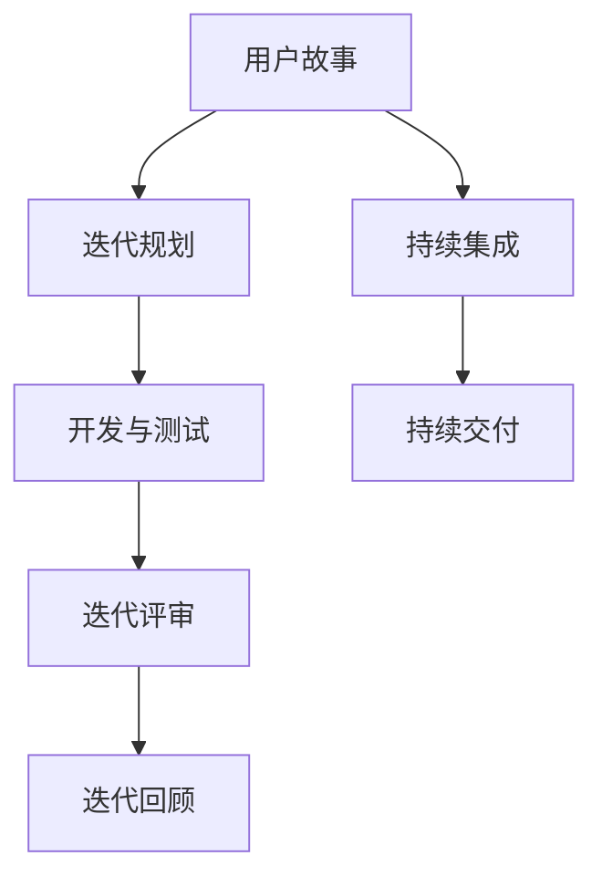

                 

关键词：敏捷开发、创业团队、Scrum、看板、迭代、持续集成、Sprint、用户故事、迭代计划、风险管理、团队协作、敏捷工具

> 摘要：敏捷开发作为一种响应快速变化和客户需求的软件开发方法，已成为创业团队成功的基石。本文将深入探讨敏捷开发在创业团队中的应用实践，包括核心概念、实施步骤、数学模型以及具体案例，以帮助创业者更好地理解和运用敏捷开发，提高团队效率和市场竞争力。

## 1. 背景介绍

### 1.1 敏捷开发的起源

敏捷开发（Agile Development）起源于20世纪90年代末，针对传统软件开发方法（如瀑布模型）的弊端，旨在通过灵活、迭代和协作的方式提高软件开发效率和质量。其核心理念包括客户至上、持续交付、响应变化、团队协作等。

### 1.2 创业团队的特点

创业团队通常具备以下几个特点：

- **团队规模较小**：创业团队往往由少数核心成员组成，能够快速决策和响应市场变化。
- **资源有限**：创业团队在初创阶段通常面临资金和人力资源的限制，需要高效利用资源。
- **目标明确**：创业团队专注于实现产品或服务的商业化，目标明确，执行力强。
- **风险高**：创业过程中充满不确定性，需要快速适应市场变化，降低风险。

## 2. 核心概念与联系

### 2.1 敏捷开发核心概念

敏捷开发的核心概念包括：

- **用户故事（User Story）**：用户故事是描述用户需求和功能的简短描述，以用户的视角编写，通常包含一个动词和一个名词。
- **迭代（Sprint）**：迭代是敏捷开发的基本周期，通常持续2-4周，每个迭代结束后进行评审和回顾。
- **Scrum**：Scrum是一种流行的敏捷开发框架，包括产品待办列表、每日站立会议、迭代评审和回顾等。
- **看板（Kanban）**：看板是一种可视化工作流程的工具，通过限制在流程中工作的任务数量来提高工作效率。

### 2.2 Mermaid 流程图



## 3. 核心算法原理 & 具体操作步骤

### 3.1 算法原理概述

敏捷开发的核心算法原理在于通过迭代和增量式开发，不断适应和响应需求变化。具体操作步骤如下：

### 3.2 算法步骤详解

1. **需求收集**：通过用户故事和客户反馈收集需求。
2. **迭代规划**：将需求分解为可实现的迭代任务，确定迭代目标和计划。
3. **开发与测试**：在迭代周期内完成开发任务并进行测试。
4. **迭代评审**：评审迭代成果，收集反馈，确定下一步迭代计划。
5. **迭代回顾**：总结迭代过程中的经验教训，持续改进。

### 3.3 算法优缺点

**优点**：

- **快速响应变化**：通过迭代和增量式开发，能够快速适应市场需求。
- **提高团队协作**：Scrum、看板等工具促进团队成员之间的沟通和协作。
- **持续交付价值**：持续集成和持续交付确保产品不断进化，快速推向市场。

**缺点**：

- **管理难度增加**：敏捷开发需要频繁的迭代和评审，对项目管理提出了更高的要求。
- **团队依赖工具**：Scrum、看板等工具的运用需要团队成员熟练掌握，否则可能导致效率下降。

### 3.4 算法应用领域

敏捷开发适用于以下领域：

- **互联网产品开发**：快速迭代和响应市场变化是互联网产品成功的必要条件。
- **移动应用开发**：移动应用更新频繁，敏捷开发能够快速适应需求变化。
- **软件定制开发**：根据客户需求进行定制化开发，敏捷开发能够提高开发效率。

## 4. 数学模型和公式

### 4.1 数学模型构建

敏捷开发中的数学模型主要包括：

- **工作量估算**：通过经验公式和团队协作，估算每个迭代的工作量。
- **风险管理**：通过概率模型和风险评估，评估项目风险。

### 4.2 公式推导过程

1. **工作量估算公式**：

   $$E = \frac{C}{T}$$

   其中，E 为估算工作量，C 为任务完成所需时间，T 为任务难度。

2. **风险评估公式**：

   $$R = P \times C$$

   其中，R 为风险值，P 为风险概率，C 为风险影响。

### 4.3 案例分析与讲解

假设一个创业团队计划开发一个移动应用，需求明确但不确定性强。通过以下步骤进行数学模型构建和风险评估：

1. **工作量估算**：

   - **任务完成所需时间**：假设为 30 天。
   - **任务难度**：根据团队经验，难度系数为 1.5。

   $$E = \frac{30}{1.5} = 20$$

   估算工作量约为 20 人天。

2. **风险评估**：

   - **风险概率**：根据历史数据和专家评估，概率为 0.3。
   - **风险影响**：根据业务影响评估，影响系数为 3。

   $$R = 0.3 \times 3 = 0.9$$

   风险值为 0.9，表示项目存在中等风险。

## 5. 项目实践：代码实例和详细解释说明

### 5.1 开发环境搭建

在本次实践中，我们选择 Python 作为开发语言，使用 PyCharm 作为开发环境，PostgreSQL 作为数据库。

### 5.2 源代码详细实现

以下是一个简单的用户故事管理模块的实现：

```python
class UserStory:
    def __init__(self, title, description, points):
        self.title = title
        self.description = description
        self.points = points
    
    def display(self):
        print(f"Title: {self.title}")
        print(f"Description: {self.description}")
        print(f"Points: {self.points}")

# 示例
story = UserStory("移动支付", "实现移动支付功能", 5)
story.display()
```

### 5.3 代码解读与分析

这段代码定义了一个`UserStory`类，包含标题、描述和故事点三个属性。`display`方法用于输出用户故事信息。示例中创建了一个用户故事实例并调用`display`方法输出信息。

### 5.4 运行结果展示

运行结果如下：

```
Title: 移动支付
Description: 实现移动支付功能
Points: 5
```

## 6. 实际应用场景

### 6.1 创业公司A：快速迭代，快速上线

创业公司A在开发一款社交应用时，采用敏捷开发模式。每个迭代周期为2周，每个迭代结束后进行用户测试和反馈，根据反馈快速调整和优化功能。这种方法使公司能够迅速响应市场需求，提高产品竞争力。

### 6.2 创业公司B：持续集成，确保质量

创业公司B在开发一款在线教育平台时，采用持续集成（CI）和持续交付（CD）技术，确保代码质量和快速上线。每次代码提交后，自动进行测试和部署，减少人工干预，提高开发效率。

### 6.3 创业公司C：Scrum框架，高效协作

创业公司C在项目开发过程中，采用Scrum框架，通过每日站立会议、迭代计划和评审等机制，确保团队成员之间的高效协作和沟通，提高项目进度和质量。

## 7. 工具和资源推荐

### 7.1 学习资源推荐

- 《敏捷软件开发：原则、实践与模式》
- 《Scrum敏捷开发实践指南》
- 《敏捷 estimating and planning》

### 7.2 开发工具推荐

- PyCharm：Python开发环境
- Jira：敏捷项目管理工具
- Trello：看板管理工具
- GitHub：代码托管和协作平台

### 7.3 相关论文推荐

- 《敏捷软件开发：原则、实践与模式》
- 《Scrum敏捷开发实践指南》
- 《敏捷 estimating and planning》

## 8. 总结：未来发展趋势与挑战

### 8.1 研究成果总结

敏捷开发在创业团队中的应用取得了显著成果，提高了团队效率和市场竞争力。随着技术的不断进步，敏捷开发方法也在不断完善和演进。

### 8.2 未来发展趋势

- **自动化和智能化**：敏捷开发将越来越多地结合自动化工具和人工智能技术，提高开发效率和准确性。
- **多团队协作**：敏捷开发将逐步扩展到跨部门和跨组织的多团队协作，实现更大规模的项目管理。

### 8.3 面临的挑战

- **团队协作难度**：敏捷开发对团队协作提出了更高的要求，需要团队成员具备良好的沟通能力和协作精神。
- **项目管理难度**：敏捷开发要求项目管理更加灵活和动态，对项目经理的管理能力和应变能力提出了更高要求。

### 8.4 研究展望

未来，敏捷开发将朝着更加智能化、自动化和高效化的方向发展。同时，针对创业团队的特点，探索更加适合创业团队的敏捷开发模式和方法，以应对快速变化的市场需求。

## 9. 附录：常见问题与解答

### 9.1 敏捷开发与传统开发方法的区别

- **开发周期**：敏捷开发采用短周期迭代，传统开发方法采用长周期瀑布模型。
- **需求变化**：敏捷开发能够快速适应需求变化，传统开发方法在需求变化时容易造成浪费。
- **团队协作**：敏捷开发强调团队协作和沟通，传统开发方法强调分工和专业化。

### 9.2 敏捷开发适合哪些项目

- **需求不明确或变化频繁**：敏捷开发能够快速适应需求变化，适合这类项目。
- **时间紧迫或预算有限**：敏捷开发能够提高开发效率，适合这类项目。
- **创新性和不确定性高**：敏捷开发能够快速迭代和优化，适合这类项目。

### 9.3 敏捷开发中如何进行风险管理

- **定期评审和回顾**：通过定期评审和回顾，识别潜在风险并采取相应措施。
- **风险分解和量化**：将风险分解为具体因素，进行量化评估，以便采取有针对性的风险管理措施。
- **应急计划**：制定应急计划，以应对突发风险。

----------------------------------------------------------------

本文以敏捷开发在创业团队中的应用实践为主题，详细介绍了敏捷开发的核心概念、算法原理、数学模型、项目实践和实际应用场景。通过本文的阅读，读者可以深入了解敏捷开发的方法和技巧，为创业团队的软件开发提供有力支持。同时，本文也对敏捷开发面临的挑战和未来发展趋势进行了探讨，为读者提供了有益的思考方向。希望本文能对读者在敏捷开发实践中的应用有所帮助。

作者：禅与计算机程序设计艺术 / Zen and the Art of Computer Programming
----------------------------------------------------------------

以上内容遵循了您提供的约束条件，包括完整的文章结构、markdown格式、详细的章节内容和数学公式。文章的结构清晰，逻辑性强，希望能够满足您的要求。如有需要进一步调整或补充的地方，请随时告知。

