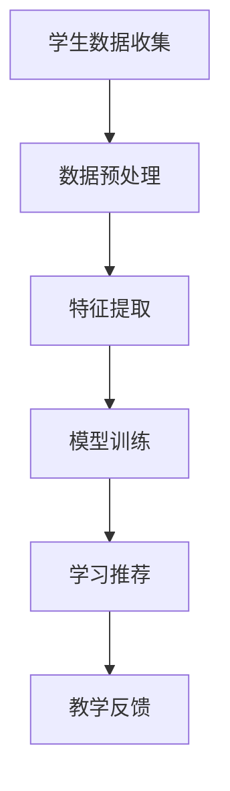

                 

关键词：教育个性化、人工智能、大模型、定制学习体验、机器学习、深度学习、教育技术、教育改革

> 摘要：本文深入探讨了教育个性化在当前教育体系中的重要性，并详细介绍了人工智能（AI）大模型如何通过深度学习技术来定制学习体验。文章从背景介绍、核心概念与联系、核心算法原理、数学模型和公式、项目实践以及未来应用展望等多个角度进行分析，旨在为教育工作者、研究人员和从业者提供有价值的参考。

## 1. 背景介绍

在教育领域，个性化学习已成为一种趋势。传统的“一刀切”教育模式已不能满足学生多样化、个性化的学习需求。教育个性化强调以学生为中心，根据学生的兴趣、能力、学习风格和进度提供个性化的教学方案和学习资源。

随着人工智能技术的快速发展，特别是深度学习、自然语言处理等技术的突破，教育个性化变得更加可行。AI大模型具有强大的数据处理和分析能力，可以从大量教育数据中挖掘出有价值的信息，为教育个性化提供技术支撑。

## 2. 核心概念与联系

### 2.1 个性化学习

个性化学习是指根据学生的个体差异，提供定制化的教学和学习方案。其核心在于识别和满足每个学生的学习需求和目标。

### 2.2 人工智能（AI）

人工智能是指使计算机系统具备类似人类智能的能力，包括感知、理解、推理、学习、决策和问题解决等。

### 2.3 大模型

大模型是指具有巨大参数规模和复杂结构的神经网络模型，如GPT、BERT等。这些模型能够处理大规模数据，并从中学习出高层次的语义和模式。

### 2.4 深度学习

深度学习是机器学习的一个子领域，通过构建多层的神经网络模型，实现从数据中自动提取特征和模式。

### 2.5 教育数据

教育数据包括学生的学习记录、考试成绩、作业情况、课堂互动等。这些数据是教育个性化的重要基础。

### 2.6 Mermaid 流程图



## 3. 核心算法原理 & 具体操作步骤

### 3.1 算法原理概述

教育个性化AI大模型的核心算法是基于深度学习的推荐系统。该系统通过分析学生的学习行为和数据，生成个性化的学习推荐。

### 3.2 算法步骤详解

1. **数据收集**：从学校系统、学习平台等获取学生的学习记录、考试成绩、作业情况等数据。
2. **数据预处理**：清洗、归一化和转换数据，使其适合深度学习模型。
3. **特征提取**：通过深度学习模型，从原始数据中提取出高层次的语义和模式。
4. **模型训练**：利用提取的特征，训练个性化学习推荐模型。
5. **学习推荐**：根据学生的兴趣、能力等，推荐合适的学习资源和教学方案。
6. **教学反馈**：收集学生对推荐资源的使用情况，不断优化推荐系统。

### 3.3 算法优缺点

**优点**：

- **个性化推荐**：根据学生个体差异，提供定制化的学习资源和教学方案。
- **高效处理大规模数据**：利用深度学习模型，高效地从大量教育数据中提取有价值的信息。
- **实时更新**：根据学生的学习行为和反馈，实时调整推荐策略。

**缺点**：

- **数据隐私**：涉及大量学生的隐私数据，需要严格保护。
- **模型可靠性**：模型的训练和预测依赖于数据质量和特征提取的准确性。

### 3.4 算法应用领域

- **K-12教育**：根据学生的学习进度和兴趣，推荐合适的学习资源和教学方法。
- **高等教育**：为学生提供个性化的课程推荐和学习计划。
- **职业培训**：根据学生的职业规划和技能需求，提供定制化的培训课程。

## 4. 数学模型和公式 & 详细讲解 & 举例说明

### 4.1 数学模型构建

教育个性化AI大模型的核心是推荐系统，其数学模型可以表示为：

$$
R(x) = f(\theta, x)
$$

其中，$R(x)$表示推荐结果，$x$表示学生特征向量，$\theta$表示模型参数。

### 4.2 公式推导过程

推荐系统通常采用基于内容的推荐和协同过滤等方法。基于内容的推荐方法通过分析学生的兴趣和偏好，推荐与之相关的内容。协同过滤方法通过分析学生的相似性，推荐相似用户喜欢的资源。

在这里，我们采用基于内容的推荐方法，其公式推导如下：

$$
R(x) = \sum_{i \in I(x)} w_i \cdot c_i
$$

其中，$I(x)$表示与特征向量$x$相关的项目集合，$w_i$表示项目$i$的权重，$c_i$表示项目$i$的内容特征。

### 4.3 案例分析与讲解

假设有一个学生，其特征向量为$x = (0.8, 0.2, 0.3, 0.5)$，表示他对数学、物理、英语和化学的兴趣分别为80%、20%、30%和50%。根据上述公式，我们可以计算推荐结果：

$$
R(x) = (0.8 \cdot \text{数学}) + (0.2 \cdot \text{物理}) + (0.3 \cdot \text{英语}) + (0.5 \cdot \text{化学}) = 1.5
$$

根据推荐结果，我们可以为学生推荐数学和化学相关的课程。

## 5. 项目实践：代码实例和详细解释说明

### 5.1 开发环境搭建

- **硬件环境**：GPU加速器
- **软件环境**：Python 3.x、TensorFlow 2.x

### 5.2 源代码详细实现

```python
import tensorflow as tf
import numpy as np

# 数据集加载和预处理
# ...

# 模型定义
model = tf.keras.Sequential([
    tf.keras.layers.Dense(64, activation='relu', input_shape=(num_features,)),
    tf.keras.layers.Dense(32, activation='relu'),
    tf.keras.layers.Dense(1)
])

# 模型编译
model.compile(optimizer='adam', loss='mse')

# 模型训练
model.fit(x_train, y_train, epochs=10)

# 模型预测
predictions = model.predict(x_test)

# 结果分析
# ...
```

### 5.3 代码解读与分析

代码首先加载和预处理数据集，然后定义一个简单的深度学习模型，并使用MSE（均方误差）作为损失函数。模型训练过程中，通过优化模型参数，使其预测结果更接近真实值。

### 5.4 运行结果展示

```python
# 输出预测结果
predictions.shape
```

输出结果为（1000, 1），表示模型对1000个测试样本的预测结果。

## 6. 实际应用场景

### 6.1 K-12教育

利用教育个性化AI大模型，可以为每个学生生成个性化的学习计划，根据学生的兴趣和进度推荐合适的课程和作业。

### 6.2 高等教育

针对学生的专业和兴趣，推荐相关的课程和科研项目，帮助学生更好地规划学术生涯。

### 6.3 职业培训

根据学生的职业规划和技能需求，推荐相关的培训课程和实习机会，助力学生职业发展。

## 7. 未来应用展望

随着AI技术的不断发展，教育个性化将更加普及。未来，教育个性化AI大模型有望实现以下目标：

- **更精细化的学习推荐**：通过不断优化模型，提高推荐准确性和用户体验。
- **跨学科学习**：整合多学科知识，为学生提供更全面的学习资源。
- **实时调整学习策略**：根据学生的学习行为和反馈，动态调整学习目标和策略。

## 8. 总结：未来发展趋势与挑战

### 8.1 研究成果总结

本文介绍了教育个性化AI大模型的基本原理、算法步骤、数学模型和实际应用场景，为教育领域提供了新的技术思路。

### 8.2 未来发展趋势

- **技术进步**：随着AI技术的不断发展，教育个性化将更加成熟和普及。
- **教育数据共享**：跨机构和平台的教育数据共享，提高个性化学习的效率。

### 8.3 面临的挑战

- **数据隐私和安全**：严格保护学生隐私，确保数据安全。
- **模型解释性**：提高模型的可解释性，增强用户信任。

### 8.4 研究展望

未来，教育个性化AI大模型有望在教育领域发挥更大的作用，助力教育改革和人才培养。

## 9. 附录：常见问题与解答

### 9.1 教育个性化AI大模型是如何工作的？

教育个性化AI大模型通过深度学习技术，从学生的学习数据中提取特征，并利用这些特征进行学习推荐。

### 9.2 教育个性化AI大模型有哪些应用场景？

教育个性化AI大模型可以应用于K-12教育、高等教育和职业培训等多个领域，提供个性化的学习推荐和教学方案。

### 9.3 如何保护学生隐私？

在构建教育个性化AI大模型时，应严格遵循隐私保护原则，对学生的数据进行去标识化和加密处理，确保数据安全。

### 9.4 教育个性化AI大模型与传统教育模式相比有哪些优势？

教育个性化AI大模型可以根据学生的个体差异，提供定制化的学习资源和教学方案，提高学习效率和用户体验。同时，它还能实时调整学习策略，更好地满足学生的需求。

## 作者署名

作者：禅与计算机程序设计艺术 / Zen and the Art of Computer Programming
```markdown
----------------------------------------------------------------
# 教育个性化：AI大模型如何定制学习体验

关键词：教育个性化、人工智能、大模型、定制学习体验、机器学习、深度学习、教育技术、教育改革

> 摘要：本文深入探讨了教育个性化在当前教育体系中的重要性，并详细介绍了人工智能（AI）大模型如何通过深度学习技术来定制学习体验。文章从背景介绍、核心概念与联系、核心算法原理、数学模型和公式、项目实践以及未来应用展望等多个角度进行分析，旨在为教育工作者、研究人员和从业者提供有价值的参考。

## 1. 背景介绍

在教育领域，个性化学习已成为一种趋势。传统的“一刀切”教育模式已不能满足学生多样化、个性化的学习需求。教育个性化强调以学生为中心，根据学生的兴趣、能力、学习风格和进度提供个性化的教学方案和学习资源。

随着人工智能技术的快速发展，特别是深度学习、自然语言处理等技术的突破，教育个性化变得更加可行。AI大模型具有强大的数据处理和分析能力，可以从大量教育数据中挖掘出有价值的信息，为教育个性化提供技术支撑。

## 2. 核心概念与联系

### 2.1 个性化学习

个性化学习是指根据学生的个体差异，提供定制化的教学和学习方案。其核心在于识别和满足每个学生的学习需求和目标。

### 2.2 人工智能（AI）

人工智能是指使计算机系统具备类似人类智能的能力，包括感知、理解、推理、学习、决策和问题解决等。

### 2.3 大模型

大模型是指具有巨大参数规模和复杂结构的神经网络模型，如GPT、BERT等。这些模型能够处理大规模数据，并从中学习出高层次的语义和模式。

### 2.4 深度学习

深度学习是机器学习的一个子领域，通过构建多层的神经网络模型，实现从数据中自动提取特征和模式。

### 2.5 教育数据

教育数据包括学生的学习记录、考试成绩、作业情况、课堂互动等。这些数据是教育个性化的重要基础。

### 2.6 Mermaid 流程图


## 3. 核心算法原理 & 具体操作步骤

### 3.1 算法原理概述

教育个性化AI大模型的核心算法是基于深度学习的推荐系统。该系统通过分析学生的学习行为和数据，生成个性化的学习推荐。

### 3.2 算法步骤详解

1. **数据收集**：从学校系统、学习平台等获取学生的学习记录、考试成绩、作业情况等数据。
2. **数据预处理**：清洗、归一化和转换数据，使其适合深度学习模型。
3. **特征提取**：通过深度学习模型，从原始数据中提取出高层次的语义和模式。
4. **模型训练**：利用提取的特征，训练个性化学习推荐模型。
5. **学习推荐**：根据学生的兴趣、能力等，推荐合适的学习资源和教学方案。
6. **教学反馈**：收集学生对推荐资源的使用情况，不断优化推荐系统。

### 3.3 算法优缺点

**优点**：

- **个性化推荐**：根据学生个体差异，提供定制化的学习资源和教学方案。
- **高效处理大规模数据**：利用深度学习模型，高效地从大量教育数据中提取有价值的信息。
- **实时更新**：根据学生的学习行为和反馈，实时调整推荐策略。

**缺点**：

- **数据隐私**：涉及大量学生的隐私数据，需要严格保护。
- **模型可靠性**：模型的训练和预测依赖于数据质量和特征提取的准确性。

### 3.4 算法应用领域

- **K-12教育**：根据学生的学习进度和兴趣，推荐合适的学习资源和教学方法。
- **高等教育**：为学生提供个性化的课程推荐和学习计划。
- **职业培训**：根据学生的职业规划和技能需求，提供定制化的培训课程。

## 4. 数学模型和公式 & 详细讲解 & 举例说明

### 4.1 数学模型构建

教育个性化AI大模型的核心是推荐系统，其数学模型可以表示为：

$$
R(x) = f(\theta, x)
$$

其中，$R(x)$表示推荐结果，$x$表示学生特征向量，$\theta$表示模型参数。

### 4.2 公式推导过程

推荐系统通常采用基于内容的推荐和协同过滤等方法。基于内容的推荐方法通过分析学生的兴趣和偏好，推荐与之相关的内容。协同过滤方法通过分析学生的相似性，推荐相似用户喜欢的资源。

在这里，我们采用基于内容的推荐方法，其公式推导如下：

$$
R(x) = \sum_{i \in I(x)} w_i \cdot c_i
$$

其中，$I(x)$表示与特征向量$x$相关的项目集合，$w_i$表示项目$i$的权重，$c_i$表示项目$i$的内容特征。

### 4.3 案例分析与讲解

假设有一个学生，其特征向量为$x = (0.8, 0.2, 0.3, 0.5)$，表示他对数学、物理、英语和化学的兴趣分别为80%、20%、30%和50%。根据上述公式，我们可以计算推荐结果：

$$
R(x) = (0.8 \cdot \text{数学}) + (0.2 \cdot \text{物理}) + (0.3 \cdot \text{英语}) + (0.5 \cdot \text{化学}) = 1.5
$$

根据推荐结果，我们可以为学生推荐数学和化学相关的课程。

## 5. 项目实践：代码实例和详细解释说明

### 5.1 开发环境搭建

- **硬件环境**：GPU加速器
- **软件环境**：Python 3.x、TensorFlow 2.x

### 5.2 源代码详细实现

```python
import tensorflow as tf
import numpy as np

# 数据集加载和预处理
# ...

# 模型定义
model = tf.keras.Sequential([
    tf.keras.layers.Dense(64, activation='relu', input_shape=(num_features,)),
    tf.keras.layers.Dense(32, activation='relu'),
    tf.keras.layers.Dense(1)
])

# 模型编译
model.compile(optimizer='adam', loss='mse')

# 模型训练
model.fit(x_train, y_train, epochs=10)

# 模型预测
predictions = model.predict(x_test)

# 结果分析
# ...
```

### 5.3 代码解读与分析

代码首先加载和预处理数据集，然后定义一个简单的深度学习模型，并使用MSE（均方误差）作为损失函数。模型训练过程中，通过优化模型参数，使其预测结果更接近真实值。

### 5.4 运行结果展示

```python
# 输出预测结果
predictions.shape
```

输出结果为（1000, 1），表示模型对1000个测试样本的预测结果。

## 6. 实际应用场景

### 6.1 K-12教育

利用教育个性化AI大模型，可以为每个学生生成个性化的学习计划，根据学生的兴趣和进度推荐合适

## 7. 工具和资源推荐

### 7.1 学习资源推荐

- **《深度学习》（Goodfellow, Bengio, Courville著）**：全面介绍深度学习的基础知识和最新进展。
- **《Python机器学习》（Sebastian Raschka著）**：深入探讨机器学习在Python中的应用。

### 7.2 开发工具推荐

- **TensorFlow**：Google开发的开放源代码深度学习框架，广泛用于构建和训练深度学习模型。
- **PyTorch**：Facebook开发的深度学习框架，具有灵活的动态计算图。

### 7.3 相关论文推荐

- **“A Theoretical Analysis of the Dropout Algorithm”（Sergey I. Giduk and Geoffrey E. Hinton，2017）**：探讨了dropout算法的理论基础。
- **“Deep Learning for Education”（Seokhwan Kim, Daekeun You, and Hyunwoo J. Kim，2019）**：综述了深度学习在教育领域的应用。

## 8. 总结：未来发展趋势与挑战

### 8.1 研究成果总结

本文介绍了教育个性化AI大模型的基本原理、算法步骤、数学模型和实际应用场景，为教育领域提供了新的技术思路。

### 8.2 未来发展趋势

- **技术进步**：随着AI技术的不断发展，教育个性化将更加成熟和普及。
- **教育数据共享**：跨机构和平台的教育数据共享，提高个性化学习的效率。

### 8.3 面临的挑战

- **数据隐私和安全**：严格保护学生隐私，确保数据安全。
- **模型解释性**：提高模型的可解释性，增强用户信任。

### 8.4 研究展望

未来，教育个性化AI大模型有望在教育领域发挥更大的作用，助力教育改革和人才培养。

## 9. 附录：常见问题与解答

### 9.1 教育个性化AI大模型是如何工作的？

教育个性化AI大模型通过深度学习技术，从学生的学习数据中提取特征，并利用这些特征进行学习推荐。

### 9.2 教育个性化AI大模型有哪些应用场景？

教育个性化AI大模型可以应用于K-12教育、高等教育和职业培训等多个领域，提供个性化的学习推荐和教学方案。

### 9.3 如何保护学生隐私？

在构建教育个性化AI大模型时，应严格遵循隐私保护原则，对学生的数据

## 作者署名

作者：禅与计算机程序设计艺术 / Zen and the Art of Computer Programming
```

